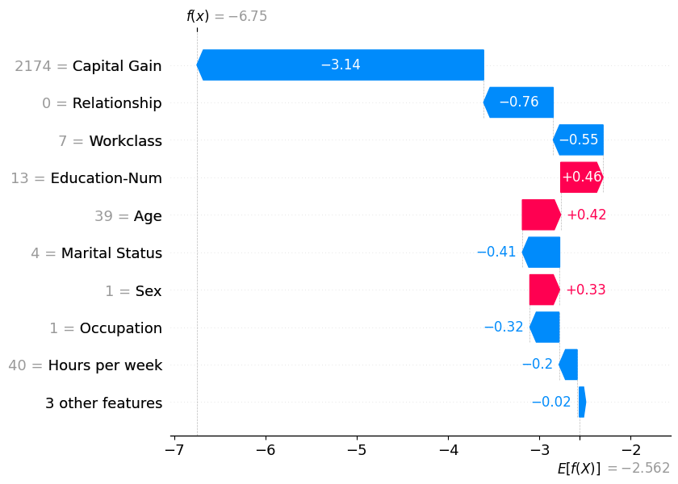
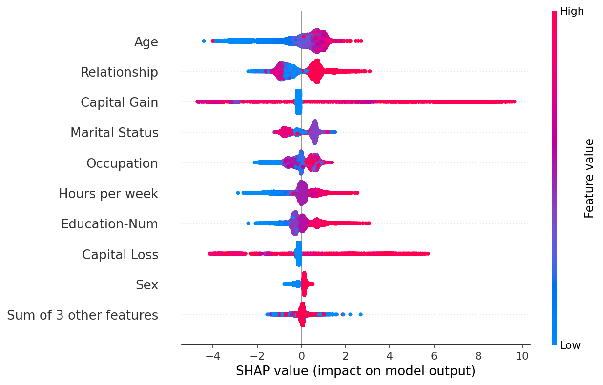

<!-- ===== §1. Framing ===== -->

## Title + Unit 14 positioning

- The final lecture of Mathematical Foundations of AI & ML. {.fragment}
- From physics-informed learning (Unit 13) to the question: **can we trust our models?** {.fragment}
- We synthesize the entire 14-unit arc into a coherent methodology for trustworthy ML. {.fragment}

## Learning outcomes for Unit 14

By the end of this lecture, students can:

- explain why explainability is a scientific and industrial mandate, {.fragment}
- distinguish semantic structures (synonyms, taxonomies, ontologies), {.fragment}
- perform and interpret perturbation-based sensitivity analysis, {.fragment}
- assess where ML adds value in causal process chains and where it fails. {.fragment}

## Why explainability is non-negotiable

- **Science** demands understanding, not just prediction — a model that cannot be questioned cannot be falsified. {.fragment}
- **Industry** demands accountability — engineers must justify decisions to stakeholders. {.fragment}
- **Regulation** demands transparency — EU AI Act requires explanations for high-risk AI systems. {.fragment}
- Explainability is not optional — it is a prerequisite for deploying ML in engineering. {.fragment}

## The black-box problem

- Deep neural networks achieve remarkable accuracy but offer **no explanation** for individual predictions. {.fragment}
- A model predicting "this alloy will fail" without explaining why is unacceptable for safety-critical decisions. {.fragment}
- Engineers need to know **which factors** drive the prediction and **how confident** the model is. {.fragment}
- The black-box problem motivates the entire field of explainable AI (XAI) [@neuer2024machine]. {.fragment}


<!-- ===== §2. Explainability vs interpretability ===== -->

## Explainability vs interpretability

:::: {.columns}
:::: {.column width="50%"}
**Interpretability**

- The model itself is transparent and understandable. {.fragment}
- Examples: linear regression, decision trees, small rule sets. {.fragment}

**Explainability**

- Post-hoc methods that reveal the reasoning of complex models. {.fragment}
- Examples: SHAP values, sensitivity analysis, attention visualization. {.fragment}

- Trade-off: interpretable models may be less accurate; explainability adds complexity to accurate models. {.fragment}
::::

:::: {.column width="50%"}
![A three-leaf decision tree and the corresponding partition of input space — an inherently interpretable model [@mcclarren2021machine]](images/mcclarren_decision_tree_visualization.png){width=100%}
::::
::::

## Who needs explanations?

- **Scientists**: full understanding (all levels) — to build knowledge. {.fragment}
- **Engineers**: process and prediction level — to make decisions. {.fragment}
- **Regulators**: data provenance and prediction justification — to ensure compliance. {.fragment}
- **Operators**: actionable recommendations — to adjust process parameters. {.fragment}
- Different audiences need different types and depths of explanation. {.fragment}

## The cost of unexplainability

- **Rejected** by regulators (cannot approve what cannot be explained). {.fragment}
- **Distrusted** by domain experts (they will use their own judgment instead). {.fragment}
- **Impossible to debug** (when predictions fail, no path to diagnosis). {.fragment}
- **Liability risk** (who is responsible when an unexplained model causes harm?). {.fragment}

## Explainability as scientific method

- Science progresses by proposing models, deriving predictions, and testing them. {.fragment}
- A model that cannot be questioned cannot be **falsified** — it fails Popper's criterion. {.fragment}
- ML models that only predict without explanation are **tools**, not **science**. {.fragment}
- Making ML explainable elevates it to a scientific methodology. {.fragment}


<!-- ===== §3. Course context ===== -->

## Course context

- Every unit has built toward this moment: {.fragment}
  - **Loss minimization** (Unit 1): what does the model optimize? {.fragment}
  - **Generalization** (Unit 8): does it work on new data? {.fragment}
  - **Uncertainty** (Unit 12): how confident is it? {.fragment}
  - **Physics** (Unit 13): does it respect known laws? {.fragment}
  - **Explainability** (Unit 14): can we understand and trust it? {.fragment}

## Roadmap of today's 90 min

- **10–25 min**: Semantic structures — digitizing meaning. {.fragment}
- **25–40 min**: Six levels of explainability (E1–E6). {.fragment}
- **40–55 min**: Sensitivity analysis — perturbation and beyond. {.fragment}
- **55–65 min**: Causality in process chains. {.fragment}
- **65–75 min**: Data manifold limits and trust. {.fragment}
- **75–87 min**: Course retrospective — the 14-unit arc. {.fragment}

## Digitizing meaning: the challenge

- ML models operate on numbers (tensors, vectors, matrices). {.fragment}
- Domain knowledge is encoded in **language** and **relationships**. {.fragment}
- Bridging this gap requires **semantic structures** that formalize meaning. {.fragment}
- Without semantic structures, models cannot be grounded in domain understanding [@neuer2024machine]. {.fragment}

## Synonyms and controlled vocabularies

:::: {.columns}
:::: {.column width="55%"}
- Different terms for the same concept: "yield strength" = "elastic limit" = "\\(R_e\\)". {.fragment}
- **Controlled vocabulary**: a standardized list of terms with defined meanings. {.fragment}
- Without synonym resolution, models may treat the same property as two separate features. {.fragment}
- First step in any data integration pipeline. {.fragment}
::::
:::: {.column width="45%"}
![Semantic tools ordered by increasing complexity [@neuer2024machine]](images/neuer_semantic_tools_complexity.png){width=100%}
::::
::::


<!-- ===== §4. Taxonomies: hierarchical classification ===== -->

## Taxonomies: hierarchical classification

:::: {.columns}
:::: {.column width="55%"}
- Organize concepts in **parent-child hierarchies**: {.fragment}
  - Material > Metal > Steel > Stainless Steel > 316L. {.fragment}
- Taxonomies enable **inheritance**: properties of "Metal" apply to all sub-categories. {.fragment}
- They structure domain knowledge and guide feature selection. {.fragment}
::::
:::: {.column width="45%"}
![Example taxonomy from biology: vertebrates and arthropods [@neuer2024machine]](images/neuer_taxonomy_biology_example.png){width=100%}
::::
::::

## Ontologies: structured knowledge graphs

- An ontology defines **concepts**, **relationships**, and **constraints**: {.fragment}
  - "Alloy *hasProperty* tensileStrength" {.fragment}
  - "tensileStrength *measuredIn* MPa" {.fragment}
  - "grainSize *affects* yieldStrength" {.fragment}
- Richer than taxonomies: capture arbitrary relationships, not just hierarchies. {.fragment}

## Why ontologies matter for ML

- Enable **deductive reasoning**: if the model's prediction violates a known ontological relationship, flag it. {.fragment}
- Guide **feature engineering**: ontological relationships suggest which features to include. {.fragment}
- Support **consistency checking**: predictions must be consistent with domain constraints. {.fragment}
- Provide a framework for **communicating** model behavior to domain experts. {.fragment}

## Ontologies for feature engineering

:::: {.columns}
:::: {.column width="55%"}
- Ontological relationships encode domain knowledge about what matters: {.fragment}
  - "Composition *determines* phase" → include composition features. {.fragment}
  - "Processing *affects* microstructure" → include processing parameters. {.fragment}
- This connects to Unit 13 (physics-informed learning): ontologies formalize the physics knowledge. {.fragment}
::::
:::: {.column width="45%"}
![Process ontology combining process descriptions with physical interactions [@neuer2024machine]](images/neuer_process_ontology_interactions.png){width=100%}
::::
::::


<!-- ===== §5. Materials ontology example ===== -->

## Materials ontology example

- **Causal chain**: Composition \\(\to\\) Processing \\(\to\\) Microstructure \\(\to\\) Properties. {.fragment}
- This is a process ontology — each arrow represents a physical mechanism. {.fragment}
- Models should respect this chain: predicting properties from composition is valid; the reverse is an ill-posed inverse problem. {.fragment}

## Checkpoint: semantic structures

- **Question**: Your model uses "hardness" and "HRC" as separate features. What semantic issue exists?
- **Answer**: They are **synonyms** — "HRC" is the Rockwell C hardness scale, a measure of "hardness". Including both double-counts the same information and may confuse the model.

## The six levels of explainability (E1–E6)

:::: {.columns}
:::: {.column width="55%"}
- A structured framework for matching explanation **depth** to **audience** and **purpose**.
- Each level addresses a different question about the model and its predictions.
- Comprehensive explainability requires addressing all six levels.
- Not every audience needs every level — match the explanation to the recipient [@neuer2024machine].
::::
:::: {.column width="45%"}
![Overview of the six levels of explainability (E1–E6) [@neuer2024machine]](images/neuer_explainability_levels_e1_e6.png){width=100%}
::::
::::

## E1: Data level

- **Question**: "What data was used?" {.fragment}
- **Covers**: data provenance, quality, completeness, representativeness, biases. {.fragment}
- **Why it matters**: a model is only as good as its data — garbage in, garbage out. {.fragment}
- **Output**: data documentation, distribution plots, missing data reports. {.fragment}


<!-- ===== §6. E2: Process level ===== -->

## E2: Process level

- **Question**: "What physical process does this model relate to?" {.fragment}
- **Covers**: the engineering context, the physical system, the measurement setup. {.fragment}
- **Why it matters**: predictions must be interpreted in the context of the physical process. {.fragment}
- **Output**: process flow diagrams, variable definitions, physical constraints. {.fragment}

## E3: Feature level

- **Question**: "Which input features matter most?" {.fragment}
- **Covers**: feature importance, feature selection rationale, sensitivity analysis. {.fragment}
- **Why it matters**: identifies which measurements drive predictions — guides data collection and process control. {.fragment}
- **Output**: feature importance rankings, sensitivity plots. {.fragment}

## E4: Model level

- **Question**: "How does the model work?" {.fragment}
- **Covers**: architecture description, hyperparameter choices, training protocol, convergence diagnostics. {.fragment}
- **Why it matters**: enables reproduction, debugging, and comparison with alternative models. {.fragment}
- **Output**: model documentation, training curves, architecture diagrams. {.fragment}

## E5: Prediction level

- **Question**: "Why this specific prediction?" {.fragment}
- **Covers**: local explanations for individual predictions. {.fragment}
- **Methods**: SHAP (Shapley values), Integrated Gradients, perturbation analysis. {.fragment}
- **Output**: "This sample is predicted high-strength because carbon content is high and grain size is small." {.fragment}


<!-- ===== §7. E6: Decision level ===== -->

## E6: Decision level

- **Question**: "What action should be taken?" {.fragment}
- **Covers**: mapping predictions to actionable recommendations with confidence. {.fragment}
- **Why it matters**: the ultimate purpose of the model is to inform decisions. {.fragment}
- **Output**: "Increase sintering temperature by 20°C (confidence: 85%)." {.fragment}

## Matching level to audience

:::: {.columns}
:::: {.column width="60%"}
| Audience | Primary levels | Example explanation |
|----------|:-------------:|:-------------------:|
| Operator | E2 + E6 | "Adjust temperature; model is 90% confident" |
| Data scientist | E3 + E4 | "Feature X has highest SHAP value; 3-layer MLP" |
| Regulator | E1 + E5 | "Data from 500 samples; prediction driven by grain size" |
| Scientist | All | Full documentation and methodology |
::::

:::: {.column width="40%"}
- Different stakeholders require different depth and focus.
- Explanations must be tailored to the user's technical background and decision-making needs.
::::
::::

## Perturbation-based sensitivity analysis

- Perturb one input feature by \\(\Delta\\); observe the change in output:

$$
S_j = \frac{|f(\mathbf{x} + \Delta \mathbf{e}_j) - f(\mathbf{x})|}{|\Delta|}
$$

- **High sensitivity**: the output changes strongly when this feature is perturbed.
- **Low sensitivity**: the feature has little effect on the prediction.
- Simple, model-agnostic, and intuitive.

## Global vs local sensitivity

- **Global sensitivity**: average \\(S_j\\) across many data points — which features matter **on average**.
- **Local sensitivity**: \\(S_j\\) at a specific point — which features matter **for this prediction**.
- Global sensitivity guides feature selection; local sensitivity explains individual predictions.


<!-- ===== §8. Sensitivity analysis in practice ===== -->

## Sensitivity analysis in practice

:::: {.columns}
:::: {.column width="55%"}
- Vary each feature by \\(\pm 10\%\\) (or \\(\pm 1\sigma\\)) while holding others constant.
- Record the output change for each perturbation.
- Rank features by average output sensitivity.
- Visualize as a bar chart: "tornado plot" showing feature sensitivities.
::::
:::: {.column width="45%"}
![Perturbation scan of a decision tree: true function (black) vs. sensitivity scan (red crosses) [@neuer2024machine]](images/neuer_sensitivity_analysis_result.png){width=100%}
::::
::::

## Feature importance from sensitivity

:::: {.columns}
:::: {.column width="55%"}
- **High sensitivity** \\(\to\\) important feature — changes in it strongly affect predictions.
- **Low sensitivity** \\(\to\\) unimportant feature — can potentially be removed.
- But: sensitivity alone does not imply **causation** — it reveals association.
- Combine with domain knowledge to interpret importance.
::::
:::: {.column width="45%"}
![Main effects (partial-dependence-style) for a random forest model — flat curves indicate unimportant features [@mcclarren2021machine]](images/mcclarren_main_effects_partial_dependence.png){width=100%}
::::
::::

## Sensitivity analysis: limitations

- **Assumes independence**: one-at-a-time perturbation misses feature interactions.
- **Linear approximation**: sensitivity at one point may not represent the full landscape.
- **No causal information**: sensitivity shows association, not mechanism.
- For interactions: use Sobol indices or SHAP (more expensive, more informative).

## Beyond perturbation: SHAP values (brief)

- **SHAP** (SHapley Additive exPlanations): allocates prediction contribution to each feature using game theory.
- Based on Shapley values: fair allocation of the "payout" (prediction) to "players" (features).
- Accounts for feature interactions.
- Computationally expensive but provides the most principled feature attribution.

## SHAP waterfall plot — explaining one prediction

:::: {.columns}
:::: {.column width="55%"}
- A **waterfall plot** decomposes a single prediction into per-feature contributions.
- Starting from the expected model output $\mathbb{E}[f(x)]$, each bar adds or subtracts the SHAP value of one feature.
- Red bars push the prediction higher; blue bars push it lower.
- The final value at the top is the model output for that instance [@lundberg2017unified].
::::
:::: {.column width="45%"}
{width=100%}
::::
::::

## SHAP beeswarm plot — global feature importance

:::: {.columns}
:::: {.column width="55%"}
- A **beeswarm plot** summarises SHAP values across the entire dataset.
- Each dot is one data point; the x-axis shows the SHAP value (impact on prediction).
- Colour encodes the feature value (red = high, blue = low).
- Features are ranked by mean |SHAP|, giving a global importance ranking with local detail [@lundberg2017unified].
::::
:::: {.column width="45%"}
{width=100%}
::::
::::

## Integrated Gradients: attributing deep network predictions

:::: {.columns}
:::: {.column width="55%"}
- **Integrated Gradients** (Sundararajan et al. 2017): attributes a prediction to each input pixel by integrating gradients along a straight path from a baseline (black image) to the input.
- Satisfies two key axioms: **Sensitivity** (if input and baseline differ only in one feature, it receives non-zero attribution) and **Implementation Invariance** (functionally identical networks get the same attribution) [@sundararajan2017axiomatic].
- Visualised as pixel-level heatmaps: positive attributions highlight features supporting the predicted class.
::::
:::: {.column width="45%"}
![Integrated Gradients attribution heatmaps on ImageNet: positive attributions (gray scale) track discriminative object regions better than simple gradients [@sundararajan2017axiomatic]](images/integrated_gradients_heatmaps.png){width=100%}
::::
::::

## Mechanistic interpretability: reverse-engineering what a network actually learned

:::: {.columns}
:::: {.column width="50%"}
**From attribution to internals**

- SHAP and Integrated Gradients tell you *which input features mattered* for one prediction — an input-side view.
- Mechanistic interpretability asks a different question: *what computation does this layer perform, and in what basis?* It looks **inside** the network.
- For transformers, the **residual stream** is the natural object of study: every layer reads from it and writes to it. Treat it as the "thought-process bus" of the model.
::::
:::: {.column width="50%"}
**Two ideas you should know**

- **Superposition** [@elhage2022superposition]: networks store *more features than they have neurons* by overlapping them in directions that are *not* axis-aligned. Single neurons are usually **polysemantic** — they fire for many unrelated concepts.
- **Sparse autoencoders (SAEs)** [@bricken2023sparseae; @templeton2024scaling]: train a sparse-coding autoencoder on layer activations to recover an *over-complete* basis of **monosemantic** directions. Each SAE feature is an interpretable concept (e.g. "Golden Gate Bridge", "buggy Python code"). Anthropic's *Scaling Monosemanticity* (2024) extracted millions of such features from production Claude models.
::::
::::

- Status in 2026: SAE-based feature extraction is the dominant interpretability research direction for foundation models. Still emerging for vision/materials; a forward-looking topic, not yet a production tool. {.fragment}

:::: {.notes}
- Why this slide sits here: SHAP and Integrated Gradients remain the *applied* tools you actually use on your own models today (they have largely displaced LIME as 2026 defaults). SAEs are the *research-frontier* tool for foundation-model interpretability. Students should leave knowing the latter exists and where it sits relative to the former.
- Pedagogical link to Unit 5: a sparse autoencoder is exactly the architecture from §D of Unit 5 (encoder + bottleneck + decoder) but with a sparsity penalty on the latent. The novelty here is *what you train it on* (activation vectors from a frozen LLM layer) and *why* (to discover the model's internal feature basis).
- Why monosemanticity matters: a feature that fires for *one* concept (e.g. "Python code with off-by-one bugs") can be *intervened on* — increase that feature's activation in the residual stream and the model behaves accordingly. This unlocks targeted safety interventions and model debugging.
- Honest limits: SAE features are not unique (different sparsity hyperparameters give different bases), and not all features are interpretable. The method is young (2023+); coverage of model behaviour is still partial.
- Materials angle: when foundation models trained on micrographs become standard (Unit 9 territory), the same SAE techniques will apply for understanding what visual concepts they encode. Practical applications are emerging in 2025–2026.
- Genealogy: linear probes (Alain & Bengio 2017) and the broader **circuits** research program (Olah et al. 2020, transformer circuits) are the roots. **Activation patching** and **attribution patching** are the diagnostic verification tools that test whether an SAE feature is actually causally involved in a behaviour.
::::


<!-- ===== §9. Causality vs correlation ===== -->

## Causality vs correlation

- ML models find **correlations**: features that co-occur with the output.
- But **correlation \\(\neq\\) causation**: confounders can create spurious patterns.
- Example: ice cream sales correlate with drowning rates (confounder: temperature).
- Causal claims require **interventional** data or **domain knowledge**.

## Causal process chains

:::: {.columns}
:::: {.column width="50%"}
- In manufacturing: **Composition** $\to$ **Processing** $\to$ **Microstructure** $\to$ **Properties**.
- The arrow direction encodes **causation**: changing composition causes different microstructure.
- ML can model these links, but the causal direction is known from physics, not learned from data [@neuer2024machine].
::::
:::: {.column width="50%"}
![Causal flow in an abstract process chain: detection algorithms (A3, A4) observe anomalies after they occur; prediction algorithms (A1, A2) anticipate them earlier [@neuer2024machine]](images/neuer_causal_process_chain.png){width=100%}
::::
::::


## Detection vs prediction

- **Detection**: "This sample has low hardness" — pattern recognition from measurements. ML excels here.
- **Prediction**: "Changing carbon content **will increase** hardness" — causal claim. Requires causal model.
- Most ML models perform **detection** (interpolation). **Prediction** (extrapolation with causal claims) requires more.

## Where ML adds value in causal chains

- **Within** the training distribution: ML provides fast, accurate detection and interpolation.
- **At the boundaries**: uncertainty quantification (Unit 12) flags unreliable predictions.
- **Beyond** the distribution: causal models (physics, experiments) are needed.
- ML is most valuable when combined with domain knowledge, not as a replacement for it.


<!-- ===== §10. Deductive reasoning with ontologies ===== -->

## Deductive reasoning with ontologies

- If the ontology states "grain size affects yield strength" but the model assigns zero importance to grain size:
  - Either the data lacks variation in grain size, or
  - The model has a problem.
- Ontological consistency checking catches such issues automatically.
- This connects explainability to domain validation.

## Checkpoint: causality

- **Question**: Your model finds that ice cream sales predict drowning rates. What's the issue?
- **Answer**: **Confounding variable** — temperature causes both. The model found a correlation, not a causal relationship.

## Data manifold limits

- ML models are only reliable **within the data manifold** (training distribution).
- **Extrapolation**: predicting outside the training range is unreliable — the model has no information there.
- **Detection**: use latent space density (Unit 9), reconstruction error (Unit 5), GP uncertainty (Unit 12).
- Never trust predictions in regions where the model has not seen data.

## Counterfactual explanations: "what if?"

:::: {.columns}
:::: {.column width="55%"}
- A **counterfactual explanation** answers: "what is the smallest change to the input that would flip the prediction?"
- Example: "Your loan was denied. If your income were €5 000 higher and your debt €2 000 lower, it would be approved."
- Counterfactuals are **actionable**: they tell users what to change, not just what mattered.
- **DiCE** (Mothilal et al. 2020) generates *diverse* counterfactuals so users see a range of valid alternatives [@mothilal2020explaining].
::::
:::: {.column width="45%"}
![DiCE: diversity and proximity metrics for generated counterfactual explanations across datasets and baseline methods [@mothilal2020explaining]](images/dice_counterfactual_comparison.png){width=100%}
::::
::::

## Fairness and bias in ML predictions

:::: {.columns}
:::: {.column width="55%"}
- ML models can perpetuate or amplify societal biases present in training data.
- **Equalized odds** (Hardt et al. 2016): a predictor is fair if it has equal true-positive and false-positive rates across protected groups (e.g. race, gender).
- **Equal opportunity**: the weaker condition of equal true-positive rates only.
- Figure 1 shows the ROC polytope of achievable (FPR, TPR) pairs per group — fairness requires operating at the same point on both group-specific ROC curves [@hardt2016equality].
::::
:::: {.column width="45%"}
![Hardt et al. 2016 Fig 1: achievable (FPR, TPR) regions for two demographic groups; equalized odds requires the same operating point for both [@hardt2016equality]](images/fairness_equalized_odds_roc.png){width=100%}
::::
::::

## Detecting extrapolation

- **Latent space density** (Unit 9): low density = far from training data = potential extrapolation.
- **Reconstruction error** (Unit 5 autoencoders): high error = input differs from learned patterns.
- **GP uncertainty** (Unit 12): wide uncertainty bands = no nearby training data.
- **Ensemble disagreement**: models disagree = uncertain = possible extrapolation.


## Out-of-distribution detection: baseline approach

- **Hendrycks & Gimpel (2017)**: the maximum softmax probability is a surprisingly effective OOD score.
- In-distribution examples typically produce **high** maximum softmax probabilities; OOD examples produce **lower** values.
- The method requires no modification to the trained network — only the softmax output at test time.
- AUROC (area under the ROC curve) measures detection quality: random = 50%, perfect = 100%.
- Limitation: softmax probabilities can be overconfident for OOD inputs far from the training manifold [@hendrycks2017baseline].

<!-- ===== §11. Inductive bias and trust ===== -->

## Inductive bias and trust

- Every model has **inductive bias** — assumptions built into the model structure.
- Linear model: assumes linear relationships. NN: assumes smooth functions (spectral bias).
- Trust requires **understanding** what the model assumes and **testing** where those assumptions fail.
- Physics-informed models (Unit 13) make their assumptions explicit — a trust advantage.

## When models should NOT be trusted

- **Extrapolation** beyond the training distribution.
- **Confounded features** where correlation \\(\neq\\) causation.
- **Insufficient training data** (high epistemic uncertainty).
- **Missing physics** (model violates known constraints).
- **Poor calibration** (predicted confidence does not match observed accuracy).

## Building trustworthy ML systems

:::: {.columns}
:::: {.column width="55%"}
- **Uncertainty quantification** (Unit 12): know what you don't know.
- **Explainability** (Unit 14): understand why predictions are made.
- **Domain validation**: check predictions against physical knowledge.
- **Human oversight**: experts review critical predictions.
- Trustworthy ML = the combination of all four.
::::
:::: {.column width="45%"}
![Full explainability chain: data → ontology → physics-informed preprocessing → learning → sensitivity analysis [@neuer2024machine]](images/neuer_explainability_full_chain.png){width=100%}
::::
::::

## Course retrospective: the 14-unit arc

- This course has been a journey from **"what is learning?"** to **"can we trust what the model learned?"**
- Each unit built on the previous, creating a coherent methodology for engineering ML.

```{mermaid}
%%| echo: false
%%| fig-align: center
graph TD
    subgraph Foundations
    U1["Unit 1: Learning vs Data Analysis"]
    U2["Unit 2: Linear Algebra, PCA/SVD"]
    U3["Unit 3: Regression as Loss Minimization"]
    U4["Unit 4: Neural Networks"]
    end
    subgraph Optimization_Probability ["Optimization & Probability"]
    U5["Unit 5: Clustering & Autoencoders"]
    U6["Unit 6: Loss Landscapes & Optimization"]
    U7["Unit 7: Probabilistic View"]
    end
    subgraph Generalization_Models ["Generalization & Modern Models"]
    U8["Unit 8: Generalization & Bias-Variance"]
    U9["Unit 9: Latent Spaces & SSL"]
    U10["Unit 10: Attention & Transformers"]
    U11["Unit 11: Generative — VAE & Diffusion"]
    end
    subgraph Trust
    U12["Unit 12: Uncertainty in Predictions"]
    U13["Unit 13: Physics-Informed Learning"]
    U14["Unit 14: Explainability & Trust"]
    end
    Foundations --> Optimization_Probability
    Optimization_Probability --> Generalization_Models
    Generalization_Models --> Trust
```

- Let us review the arc.


<!-- ===== §12. Units 1–4: Foundations ===== -->

## Units 1–4: Foundations

- **Unit 1**: Learning vs data analysis — models, loss functions, the empirical-risk picture.
- **Unit 2**: Linear algebra — PCA / SVD, covariance, eigendecomposition.
- **Unit 3**: Regression as loss minimization — analytic and iterative solutions.
- **Unit 4**: Neural network architectures — from neurons to CNNs.

## Units 5–7: Representation, optimization, probability

- **Unit 5**: Clustering & autoencoders — K-means / GMM / EM, PCA as a linear AE, non-linear AE bottleneck.
- **Unit 6**: Loss landscapes & optimization — momentum, Adam(W), Lion, Sophia, Schedule-Free.
- **Unit 7**: Probabilistic view — MLE, Bayesian inference, MAP, KL, conformal prediction.

## Units 8–11: Generalization, latent, attention, generative

- **Unit 8**: Generalization & bias-variance — regularization, CV, tree ensembles.
- **Unit 9**: Latent spaces & advanced representation — t-SNE, UMAP, MAE / DINOv2 / I-JEPA.
- **Unit 10**: Attention & transformers — ViT, Flash Attention, MoE, SSM/Mamba.
- **Unit 11**: Generative models — VAEs, diffusion, flow matching, consistency models.

## Units 12–14: Uncertainty, physics, and trust

- **Unit 12**: Uncertainty quantification — GPs, MC Dropout, ensembles.
- **Unit 13**: Physics-informed learning — PINNs, data enrichment, Lagaris.
- **Unit 14**: Explainability and trust — the culmination.


<!-- ===== §13. Exam-aligned summary: 10 course-wide must-know statements ===== -->

## Exam-aligned summary: 10 course-wide must-know statements

1. Learning = minimizing [ **expected** | empirical ] risk; [ **empirical** | validation ] risk is the tractable proxy. {.fragment}
2. The bias-variance tradeoff governs [ **model complexity** | dataset size ] selection. {.fragment}
3. Backpropagation enables efficient gradient computation in [ **$O(W)$** | $O(W^2)$ ]. {.fragment}
4. Regularization [ **restricts** | expands ] hypothesis space to improve generalization. {.fragment}
5. Bayesian inference provides principled uncertainty quantification via the [ likelihood | **posterior** ]. {.fragment}
6. Autoencoders learn compressed representations; linear AE = [ **PCA** | K-Means ]. {.fragment}
7. The EM algorithm iteratively finds [ **ML** | MAP ] parameters for mixture models. {.fragment}
8. GP uncertainty grows [ towards | **away from** ] data — honest epistemic uncertainty. {.fragment}
9. PINNs embed physics into the [ **loss** | architecture ] to reduce data requirements. {.fragment}
10. Explainability is a [ **mandate** | luxury ], not an optional add-on. {.fragment}

## Exam preparation and farewell

- **Exam scope**: Units 1–14. Focus on derivations (MLE, backprop, bias-variance, EM, GP posterior).
- **Preparation**: work through all exercise problems; understand the "10 must-know statements" per unit.
- **Format**: written exam — derivations, interpretations, design questions.
- Thank you for an excellent semester. Good luck with the exam!

::: {#refs}
:::

<!-- BEGIN prev-next -->

## Continue

- &larr; Previous: [Unit 13 &mdash; Physics-Informed & Constrained Learning](../13_physics_informed_learning/01_intro.html)
- [All courses](../../index.html)

<!-- END prev-next -->
