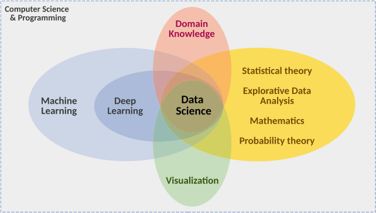

## Welcome to ML-PC

### Unit 1: What Makes Materials Data Special?

::: {.fragment}
**Today's Learning Journey:**

- From Sumerian clay to Kepler's laws — the long history of data
- What is Materials Data Science?
- Why materials ML is uniquely hard
- White-Box, Black-Box, and Grey-Box modeling
- The CRISP-DM workflow for the laboratory
:::

::: {.notes}
Welcome students, introduce yourself. This is the first of 14 units. Emphasize that this course is application-driven — we bridge physical data and ML algorithms.
:::

## Learning Outcomes

By the end of this unit, you can:

::: {.fragment}
1. Explain the historical transition from descriptive to data-driven models
2. Define Materials Data Science at the intersection of ML, statistics, and domain knowledge
3. Identify unique challenges: small data, high cost, noise, multi-modality
4. Classify models into White-Box, Grey-Box, and Black-Box categories
5. Apply the CRISP-DM process to structure a materials data project
6. Differentiate between correlation and causality in materials systems
:::

::: {.notes}
These are the examinable learning outcomes. Point students to the detailed version in the syllabus. Each outcome maps to a block of today's lecture.
:::

## Course Positioning in SS26

::: {.columns}
::: {.column width="50%"}
::: {.fragment}
- **MFML**: Mathematical foundations (the "how")
- **ML-PC**: Applied ML for characterization & processing (the "where")
- **Materials Genomics**: Computational materials discovery (the "what")
:::
:::

::: {.column width="50%"}
```{mermaid}
%%| echo: false
%%| fig-align: center
flowchart TD
    %% Styling
    classDef default fill:#f8fafc,stroke:#cbd5e1,stroke-width:2px,color:#334155,rx:8px,ry:8px,font-family:Inter;
    classDef accent fill:#e0f2fe,stroke:#38bdf8,stroke-width:2px,color:#0f172a,rx:8px,ry:8px,font-family:Inter,font-weight:600;

    MFML["MFML<br>Math Foundations"]:::accent --> MLPC["ML-PC<br>Characterization & Processing"]:::accent
    MFML --> MG["MG<br>Materials Genomics"]:::accent
    MLPC <--> MG
```
:::
:::

::: {.notes}
Explain the three-course triad. MFML provides the math; ML-PC and MG consume it in different application domains. Students take all three in parallel.
:::

---
 

## The "Hype Cycle" vs. Lab Reality

::: {.fragment}
- AI is everywhere in the news — but what about the lab?
- Most materials labs still operate with **small datasets** and **manual analysis**
- This course bridges the gap: from "textbook AI" to "lab-ready AI"
:::

::: {.callout-note}
The goal is not to replace domain expertise with ML — it is to amplify it.
:::

::: {.notes}
Ground students: AI hype is real but the lab is different. We deal with expensive, noisy, small datasets. This sets the tone for the whole course.
:::

## Historical Roots of Data (I)

### The First Data and Metadata

::: {.fragment}
- **3400 BCE**: Sumerian cuneiform tablets for counting sheep and grain
- Not just numbers — symbols represented *context*: units, objects, locations
- The first **metadata**: data about data [@sandfeld_materials_data_science]
:::

![One of the first data visualization: summary account of silver for the governor written in Sumerian Cuneiform on a clay tablet. (From Shuruppak or Abu Salabikh, Iraq, circa 2,500 BCE. British Museum, London. BM 15826, courtesy Gavin Collins [10])](images/sandfeld_-_Materials_Data_Science.pdf-0028-03.png){width=80%}
 

::: {.notes}
This connects to modern data management. Without metadata (units, calibration, instrument settings), a number is meaningless. The Sumerians understood this 5000 years ago.
:::

## Historical Roots of Data (II)

### From Gods to Crystal Spheres

::: {.fragment}
- Ancient astronomy: celestial observations as the first "big data"
- **Antikythera Mechanism** (~100 BCE): analog computation for celestial prediction
- Models evolved: divine will → geometric spheres → mathematical laws
:::

::: {.fragment}
The key transition: from *describing* patterns to *explaining* them with models.
:::

{width=80%}

::: {.notes}
Use the Antikythera mechanism as a hook — it's an ancient computer. The transition from description to explanation is exactly what ML tries to do today.
:::

## Kepler: The First Data Analyst

::: {.fragment}
::: {.columns}
::: {.column width="80%"}
- 1609: Kepler inherited **25 years** of Mars observations from Tycho Brahe
- He didn't invent a new telescope — he invented a **data-driven explanation**
- Transition from descriptive (circles) to explanatory (ellipses)
:::
::: {.column width="20%"}
{height=300px}
:::
:::
:::

::: {.fragment}
**The lesson**: More data alone is not enough. You need the right *model*.
:::

::: {.fragment}
::: {.columns}
::: {.column width="50%"}
{width=100%}
:::
::: {.column width="50%"}
{width=100%}
:::
:::
:::

::: {.notes}
Kepler is the perfect historical example. Brahe had the data; Kepler had the insight. This is exactly the ML workflow: data collection vs. model selection. Emphasize that Kepler tried many wrong models first.
:::

## J. Tobias Mayer: Lunar Tables — An Early Data-Driven Model
::: {.columns}
::: {.column width="50%"}
### What are lunar tables?
- Precomputed numerical tables predicting the **Moon’s position over time**
- Inputs: date & time  
- Outputs: celestial coordinates (longitude, latitude), phase

### Why were they important?
- Enabled solving the **longitude problem at sea**
- Workflow:
  - Observe Moon–star position
  - Compare with predicted values
  - Infer reference time → compute longitude
 
:::
::: {.column width="50%"}
{height=150px}

### Connection to Machine Learning
- Lunar tables ≈ **surrogate model of a dynamical system**
- Conceptual pipeline:
  - Data → Model → Prediction → Refinement
- Analogy:
  - Input: time  
  - Output: Moon position  
  - Model: calibrated function approximator
:::
:::
 

::: {.fragment}
Materials science today: we often have more measurements than parameters — this is a good problem to have!
:::

::: {.notes}
This connects directly to regression. Students will see least squares in MFML. Here we plant the historical seed. Mayer grouped equations and averaged — an early form of data reduction.
:::

## Defining Materials Data Science

### The Interdisciplinary Intersection

::: {.columns}
::: {.column width="50%"}
::: {.fragment}
ML-PC sits at the center of:

- **Machine Learning**: Algorithms that learn patterns
- **Statistics**: Quantifying uncertainty and significance
- **Computer Science**: Handling large data volumes
- **Domain Knowledge/ Materials Science**: The "Physics" that keeps ML grounded, the materials science domain models 

{width=80%}
:::
:::

::: {.column width="50%"}
```{mermaid}
%%| echo: false
%%| fig-align: center
flowchart TD
    %% Styling
    classDef default fill:#f8fafc,stroke:#cbd5e1,stroke-width:2px,color:#334155,rx:8px,ry:8px,font-family:Inter;
    classDef highlight fill:#fef08a,stroke:#eab308,stroke-width:2px,color:#422006,rx:8px,ry:8px,font-weight:bold,font-family:Inter;

    ML["Machine Learning"] --> MDS["Materials Data Science"]:::highlight
    Stats["Statistics"] --> MDS
    CS["Computer Science"] --> MDS
    DK["Domain Knowledge"] --> MDS
```
:::
:::

::: {.notes}
Emphasize that MDS is not just "ML applied to materials." The domain knowledge component is what makes it a distinct discipline. Without physics, ML models can produce nonsensical predictions.
:::

## The Ashby Map: Feature Engineering Before ML

::: {.fragment}
- **Michael Ashby** (1992): Plotting material properties against each other
- Young's Modulus vs. Density → material selection charts
- This is **feature engineering** without explicit ML!
:::

::: {.fragment}
{width=35%}
:::

::: {.callout-note}
Domain knowledge tells you *which* features to plot. ML automates finding patterns in high-dimensional versions of this idea.
:::

::: {.notes}
Ashby maps are familiar to materials students. Use this as a bridge: "You've already been doing data science — we're now going to formalize it."
:::

---


## Recall from MFML: Model Types & Learning Tasks

::: {.fragment}
- **Models**: Abstractions trading fidelity for simplicity.
- **Spectrum**: White-Box (physics) $\leftrightarrow$ Grey-Box (hybrid) $\leftrightarrow$ Black-Box (data-driven).
- **Core Tasks**: Supervised (regression/classification) vs Unsupervised (clustering/dimensionality reduction).
- **Optimization**: We minimize specific **loss functions** to fit models to data.
:::

::: {.notes}
Briefly remind students of these concepts from MFML. Emphasize that here in MLPC, we care about *applying* these concepts to real materials laboratory constraints.
:::

## Think About This...

::: {.fragment}
**Question**: You have a dataset of 50 tensile test curves. You want to predict yield strength from composition.

Should you use a white-box, black-box, or grey-box model?
:::

::: {.fragment}
**Answer**: Grey-box is likely best. 50 samples is too few for a deep neural network (black-box). Pure physics (white-box) can't easily map composition to yield strength. A physics-informed approach (e.g., Hall-Petch + ML correction) leverages both.
:::

::: {.notes}
Pause here. Let students discuss in pairs for 1 minute before revealing the answer. This is a key pedagogical moment — connecting the abstract categories to a concrete decision.
:::

## Materials example 1: process→property regression

::: {.columns}
::: {.column width="60%"}
**Example: steel quench & temper (DIN 1.7709 / 21CrMoV5-7).**

- Inputs: austenitizing temperature/time, quench medium, tempering temperature/time (here: fixed austenitize at 960 °C, oil quench, 2 h temper) [@Mantzoukas_2021_17709].
- Target: hardness (HRC/HV) or tensile properties (continuous).
- Risks: true cooling rate vs nominal quench, furnace load/position, prior microstructure, section size—easy to miss in the spreadsheet but they move the outcome.
:::

::: {.column width="40%"}
{width=100% fig-alt="Rockwell hardness versus tempering temperature with error bars."}
:::
:::

## Materials example 2: defect classification from images


**Example: supervised labeling of SEM micrographs** [@Modarres_2017_SEM]—the same pipeline as defect screening, but here the classes are morphology/device categories rather than “OK vs pore/crack”.

- Inputs: SEM (or EM) images + acquisition metadata (detector, beam energy, working distance, coating, etc.).
- Target: discrete class or defect probability (often multi-class softmax or one-vs-rest heads).
- Risks: **class imbalance** (rare defect modes), **weak/expert-dependent labels**, **domain shift** between tools and operators (contrast/charging/stage drift).

{width=100% fig-alt="Grid of ten scanning electron micrographs labeled by material morphology class."}


## Materials example 3: spectra interpretation task framing

::: {.columns}
::: {.column width="60%"}
**Example: Raman spectra → TiO$_2$ polymorph class (anatase vs rutile).** [@Bhattacharya_2022_TiO2_Raman]

- Inputs: spectral signal (possibly multimodal context).
- Targets: composition class, phase indicator, or property proxy.
- Risks: baseline drift, preprocessing leakage, calibration instability.
:::

::: {.column width="40%"}
{width=100% fig-alt="Raman spectral line stacks feeding a classification model, embedding visualization from mixed to separated classes, and experimental validation with a powder sample and Raman microscope."}
:::
:::

## Parsimony and Occam's Razor

::: {.fragment}
> "Among competing hypotheses, the one with the fewest assumptions should be selected." [@ryan2021machine]
:::

::: {.fragment}
- **Recall Overfitting from MFML**: A model that memorizes training data but fails on new data
- **Parsimony**: Prefer the simplest model that explains the data
- **Rule of thumb**: Start simple, add complexity only when justified
:::

::: {.callout-note}
If a linear model works, don't use a neural network.
:::

::: {.notes}
This is perhaps the most important principle in applied ML. Students are often attracted to complex models. Emphasize: complexity is a cost, not a feature. Overfitting is the #1 failure mode in materials ML because datasets are small.
:::

---

 

## The PSPP Paradigm

### Processing → Structure → Property → Performance

::: {.columns}
::: {.column width="50%"}
::: {.fragment}
- **Nodes**: Distinct data domains (images, spectra, logs)
- **Edges**: The ML tasks we want to solve
- **Dependency**: Structure *mediates* properties
:::
:::

::: {.column width="50%"}
```{mermaid}
%%| echo: false
%%| fig-align: center
flowchart TD
    %% Styling
    classDef default fill:#f8fafc,stroke:#cbd5e1,stroke-width:2px,color:#334155,rx:8px,ry:8px,font-family:Inter;
    classDef primary fill:#fef08a,stroke:#eab308,stroke-width:2px,color:#422006,rx:12px,ry:12px,font-weight:bold,font-family:Inter;
    classDef secondary fill:#dcfce7,stroke:#22c55e,stroke-width:2px,color:#052e16,rx:8px,ry:8px,font-family:Inter,font-weight:bold;

    P["Processing"]:::secondary -->|"Physics-Informed"| S["Structure"]:::primary
    S -->|"Vision ML"| Pr["Property"]:::primary
    Pr -->|"Surrogates"| Pe["Performance"]:::primary
    Pe -->|"Inverse Design"| P
```
:::
:::

::: {.notes}
PSPP is the central organizing principle of materials science. Every ML task in this course maps to an edge in this graph. Draw attention to the cycle: inverse design closes the loop.
:::

## The Multi-Scale Challenge

::: {.fragment}
- Materials span **10 orders of magnitude**: atoms (Å) to components (m)
- Each scale has its own data type:
  - Atomic: DFT energies, electron microscopy
  - Micro: Micrographs, EBSD maps
  - Meso: Process logs, mechanical tests
  - Macro: Component performance, field data
:::

::: {.fragment}
**ML challenge**: How do you connect information across scales?
:::

::: {.notes}
This is unique to materials science. In computer vision, everything is at one scale (pixels). In materials, the same sample generates data at vastly different scales, and they all matter.
:::

## The Multi-Modal Challenge

::: {.columns}
::: {.column width="55%"}
::: {.fragment}
- A single sample produces many data types:
  - **Images**: SEM, TEM, optical micrographs (2D/3D)
  - **Spectra**: XRD, EELS, EDS (1D/4D)
  - **Time series**: Temperature logs, force curves
  - **Scalars**: Hardness, conductivity, composition
:::

::: {.fragment}
**Fusion problem**: How do you combine a micrograph with a spectrum with a process log into one model?

**Model-driven fusion in STEM:** joint recovery of elemental maps by linking high-SNR elastic (HAADF) structure with spectroscopic (EDX/EELS) signals—often at much lower dose than chemistry-only mapping [@Schwartz_2022_fused_multimodal_EM].
:::
:::

::: {.column width="45%"}
{width=100% fig-alt="STEM geometry with HAADF and EDX; noisy raw elemental maps, clear HAADF, recovered elemental maps, and false-color composite."}
:::
:::

::: {.notes}
Multi-modality is a hot research topic. Most ML models are designed for one data type. Materials scientists routinely deal with 3-4 modalities per sample.
:::

## Small Data / High Cost

::: {.fragment}
- A single microscopy session can cost **hundreds to a few thousand Euros** in *access charges alone*—before counting preparation, travel to a national facility, and expert time.
- Synthesizing a new alloy (or composition) takes **days to weeks** of lab and person time; each new label in the dataset is tied to that pipeline.
- Typical ML dataset sizes in our field: **10–1000** conditions or specimens—not millions of i.i.d. draws.
:::

::: {.fragment}
**Typical access charges (EU core facilities):**

- **SEM / entry TEM** class tools: often **tens of € per hour**.
- **Analytical S/TEM** (EELS/EDX, HRSTEM, tomography setups): commonly **roughly 50–150 €/h** on published university tariffs (operator-assisted, external, or industrial use is often **several times** higher).
- **Back-of-envelope:** ~8–12 h instrument time for a careful study × ~**100 €/h** → on the order of **€10³** before prep and analysis—so “**thousands of Euros**”
:::

::: {.fragment}
**Contrast**: ImageNet has **14 million** images collected at **~zero marginal cost** per extra jpeg. A materials dataset with **50–500** labeled examples can already reflect **many person-months** and **many instrument-days**.
:::

::: {.callout-note .fragment}
Materials data is **precious and sparse** 
:::

::: {.notes}
This is the single biggest difference from mainstream ML. Our data is expensive, slow to generate, and scarce. This constrains every modeling decision: no deep learning without transfer learning, no validation without careful cross-validation.
:::

## Measurement Noise and Artifacts in the Lab

::: {.fragment}
- **Beyond theoretical noise**: Real laboratory data contains more than just statistical uncertainty.
- **Systematic Errors**: Instruments drift over time, calibration degrades.
- **Physical Artifacts**: Sample charging in SEM, sample contamination, beam damage.
:::

::: {.fragment}
These artifacts create **epistemic uncertainty** that must be managed through strict experimental protocols, not just more data.
:::

::: {.notes}
Recall the uncertainty types from MFML. Here we focus on the physical origin of epistemic and aleatoric noise in a characterization setting. Drift and artifacts are the bane of materials ML.
:::

## The Curse of Dimensionality (I)

::: {.fragment}
**Thought experiment**: You have 3 process parameters, each with 10 possible values.

- Full grid search: $10^3 = 1{,}000$ experiments
- But if you have 10 parameters: $10^{10} = 10{,}000{,}000{,}000$ experiments!
:::

::: {.fragment}
Even with 35 experiments, you've explored only $\frac{35}{10^3} = 3.5\%$ of a 3-parameter space.
:::

::: {.notes}
Use the numbers to shock students. Materials spaces are high-dimensional but we can only ever sample a tiny fraction. This motivates dimensionality reduction (Unit 2) and design of experiments.
:::

### The Curse of Dimensionality (II)

::: {.fragment}
::: {.columns}
::: {.column width="55%"}
- In high-dimensional space, data is **sparse by default**
- All points are approximately equidistant from each other
- Nearest-neighbor methods break down
- Materials data lies on a **low-dimensional manifold** — finding it is key
:::
::: {.column width="45%"}
{width=100%}
:::
:::
:::

::: {.notes}
This is the mathematical formulation. The key insight: even though a micrograph has millions of pixels, the "interesting" variation lives in a much lower-dimensional space. PCA and autoencoders find this manifold.
:::

## Data Scales (I): Nominal and Ordinal

::: {.fragment}
- **Nominal** (names): Phase labels (FCC, BCC, HCP)
  - No ordering, no arithmetic
- **Ordinal** (ordered names): Grain size categories (fine, medium, coarse)
  - Ordering exists, but distances are undefined
:::

::: {.fragment}
**ML impact**: You cannot compute a meaningful "average" of nominal data. Choose your algorithms accordingly.
:::

::: {.notes}
Data scales constrain what operations are valid. Taking the mean of phase labels is nonsensical. This connects to choosing the right loss function and encoding scheme.
:::

### Data Scales (II): Interval and Ratio

::: {.fragment}
- **Interval** (equal distances, no true zero): Temperature in Celsius
  - 20°C is not "twice as hot" as 10°C
- **Ratio** (true zero): Temperature in Kelvin, mass, length
  - 200 K is genuinely twice as hot as 100 K
:::

::: {.fragment}
**The Sumerian connection**: A number without its unit and scale is worthless — this was true in 3400 BCE and it's true today [@sandfeld_materials_data_science].
:::

::: {.notes}
Emphasize unit consistency. ML models don't know about physical units — it's our job to ensure inputs are properly scaled and meaningful. Mixing Celsius and Kelvin in a dataset is a real error that happens.
:::

## Metadata in the Lab

::: {.fragment}
- Every measurement needs metadata:
  - Instrument settings (voltage, magnification, exposure)
  - Calibration history
  - Environmental conditions (temperature, humidity)
  - Sample preparation steps
:::

::: {.fragment}
**Without metadata, your data is just noise with a timestamp.**
:::

::: {.notes}
This is practical advice. Students doing lab work need to record metadata rigorously. Many ML failures trace back to inconsistent metadata — different instruments, different calibrations, different operators.
:::

## Think About This: The "Failure Story"

::: {.fragment}
**True story**: A neural network was trained to classify steel microstructures. It achieved 99% accuracy on the test set.

But it was actually learning the **serial number of the microscope** — each microscope was used for only one type of steel.
:::

::: {.fragment}
This is a classic example of **data leakage** (introduced in MFML): the model finds a shortcut that correlates with the label but has no physical meaning.
:::

::: {.callout-note .fragment}
Always ask: "What is the model *actually* learning?"
:::

::: {.notes}
This is the most important cautionary tale. Pause and let it sink in. Data leakage is the #1 silent killer in materials ML. The model performs well on your test set but fails completely in the real world.
:::

## Recap

::: {.fragment}
1. **PSPP** structures the data flow in materials science
2. Materials data is **multi-scale, multi-modal, and sparse**
3. The **Curse of Dimensionality** means we can never sample enough
4. **Data scales** and **metadata** constrain what operations are valid
5. **Data leakage** is the silent killer — always check what the model learned
:::

::: {.notes}
Quick recap before moving to CRISP-DM. Check for questions. These five points are the "why" — CRISP-DM gives us the "how."
:::

---


## The CRISP-DM Standard

### Cross-Industry Standard Process for Data Mining

::: {.fragment}
- Originally developed for business analytics (1996)
- Adapted here for **scientific laboratory workflows**
- 6 phases forming a cycle (not a linear pipeline)
:::

::: {.fragment}
```{mermaid}
%%| echo: false
%%| fig-align: center
flowchart TD
    %% Styling
    classDef default fill:#f8fafc,stroke:#cbd5e1,stroke-width:2px,color:#334155,rx:8px,ry:8px,font-family:Inter;
    classDef step fill:#e0f2fe,stroke:#38bdf8,stroke-width:2px,color:#0f172a,rx:8px,ry:8px,font-family:Inter,font-weight:600;

    BU["1. Scientific<br>Understanding"]:::step --> DU["2. Data<br>Understanding"]:::step
    DU --> DP["3. Data<br>Preparation"]:::step
    DP --> M["4. Modeling"]:::step
    M --> E["5. Evaluation"]:::step
    E --> D["6. Deployment"]:::step
    D --> BU
```
:::

::: {.notes}
CRISP-DM is industry-standard. Scientists often skip steps (especially evaluation and deployment). Walking through each phase prevents common mistakes.
:::

## Phase 1: Scientific Understanding

::: {.fragment}
- **What is the scientific question?**
- What would a useful answer look like?
- What decisions will the model inform?
- What is the **Return on Insight** (ROI)?
:::

::: {.fragment}
**Industrial Example [@neuer2024machine]**: Predicting machine failures to save material costs. The ROI depends on whether the savings outweigh the modeling timeline.
:::

::: {.fragment}
**Bad**: "Let's apply ML to our data and see what happens."

**Good**: "Can we predict yield strength from composition to reduce testing by 50%?"
:::

::: {.notes}
This is the most overlooked phase. Students and researchers jump to "let me train a model" without defining what success looks like. A clear question is worth more than a clever algorithm.
:::

## Phase 2: Data Understanding

::: {.fragment}
- Visualize raw data before anything else
- Check for:
  - Missing values and outliers
  - Measurement artifacts (drift, saturation)
  - Class imbalance (90% of samples are one phase)
  - Distribution of features
:::

::: {.fragment}
**Example continued**: What sensor data do we need? Are additional sensors required? Is the data accessible in the company database?
:::

::: {.fragment}
**Rule**: If you can't explain what your raw data looks like, you're not ready to model.
:::

::: {.notes}
Exploratory Data Analysis (EDA) is essential. Show histograms, scatter plots, correlation matrices. This phase often reveals problems that invalidate the entire project — better to find them early.
:::

## Phase 3: Data Preparation

::: {.fragment}
- **Cleaning**: Remove or impute missing values
- **Scaling**: Normalize features to comparable ranges
- **Encoding**: Convert categorical variables (one-hot, label encoding)
- **Splitting**: Train / Validation / Test sets (carefully, avoiding leakage!)
:::

::: {.fragment}
**Example continued**: Cleaning faulty sensor readings and handling measurement drift before training.
:::

::: {.fragment}
**Materials trap**: Time-dependent data must be split chronologically, not randomly.
:::

::: {.notes}
Data preparation takes 60-80% of the time in real ML projects. Emphasize the train/test split — random splitting can cause leakage if samples from the same batch end up in both sets.
:::

## Phase 4: Modeling

::: {.fragment}
- Select algorithm(s) appropriate for:
  - Data size (small → simpler models)
  - Data type (images → CNNs, tabular → gradient boosting)
  - Interpretability requirements
- **Start simple**: Baseline before complexity
:::

::: {.fragment}
**Example continued**: Training a baseline classifier to detect anomalous process states from the sensor data.
:::

::: {.fragment}
A linear regression baseline that you understand is worth more than a neural network you don't.
:::

::: {.notes}
Emphasize the baseline principle. If linear regression gets R²=0.85, you need a strong reason to go to deep learning. The marginal improvement might not justify the added complexity and data requirements.
:::

## Phase 5: Evaluation

::: {.fragment}
- Does the model **generalize** to new data?
- **R² metric**: Fraction of variance explained
  - $R^2 = 1 - \frac{\sum(y_i - \hat{y}_i)^2}{\sum(y_i - \bar{y})^2}$
- **Pitfalls of R²**: Can be misleading with nonlinear data or outliers
- Cross-validation for small datasets
:::

::: {.fragment}
**Example continued**: Does the model meet the Key Performance Indicators (KPIs) set in Phase 1? How many false alarms are generated?
:::

::: {.fragment}
**The real test**: Does it work on data from a *different* lab / batch / instrument?
:::

::: {.notes}
Generalization is the ultimate goal. A model that works only on your specific dataset is useless. The "different lab" test is the gold standard in materials science — few models pass it.
:::

## Phase 6: Deployment & Monitoring

::: {.fragment}
- Integrating ML into the lab workflow:
  - Real-time classification during microscopy
  - Process control in a furnace
  - Automated quality inspection
- **Monitoring**: Detecting model drift and out-of-distribution inputs
:::

::: {.fragment}
**Example continued**: Closing the loop — using the model's predictions online to control production machines for better quality.
:::

::: {.fragment}
A deployed model needs **ongoing validation** — materials and processes change over time.
:::

::: {.notes}
Deployment is rare in academic settings but common in industry. Even in research, "deployment" might mean using a trained model to guide the next experiment. Model drift is a real issue when instruments are recalibrated.
:::

## Correlation vs. Causality (I)

### The "Ice Cream" Trap

::: {.fragment}
- **Observation**: Ice cream sales and crime rates both increase in summer
- **Spurious correlation**: Ice cream does *not* cause crime
- **Confounding variable**: Heat (temperature) drives both
:::

::: {.fragment}
```{mermaid}
%%| echo: false
%%| fig-align: center
flowchart TD
    %% Styling
    classDef default fill:#f8fafc,stroke:#cbd5e1,stroke-width:2px,color:#334155,rx:8px,ry:8px,font-family:Inter;
    classDef confounder fill:#fee2e2,stroke:#f87171,stroke-width:2px,color:#7f1d1d,rx:8px,ry:8px,font-family:Inter,font-weight:600;
    classDef outcome fill:#e0f2fe,stroke:#38bdf8,stroke-width:2px,color:#0f172a,rx:8px,ry:8px,font-family:Inter,font-weight:600;

    H["Temperature<br>(Confounder)"]:::confounder --> IC["Ice Cream Sales"]:::outcome
    H --> C["Crime Rate"]:::outcome
    IC -.->|"Spurious"| C
```
:::

::: {.notes}
Classic example. The point is that correlation ≠ causation. ML models find correlations — it's our job to check if they're causal.
:::

### Correlation vs. Causality (II)

### In Materials Science

::: {.fragment}
- Does adding chromium *cause* increased hardness?
- Or is chromium a proxy for a specific heat treatment that refines grain size?
- **The PSPP graph helps**: trace the causal chain through Processing → Structure → Property
:::

::: {.fragment}
**Randomized experiments** (varying one factor at a time) are the gold standard for establishing causality — but expensive in materials science.
:::

::: {.notes}
Connect back to PSPP. If the causal chain goes Cr → finer grains → higher hardness, then Cr is an indirect cause. But if you change the heat treatment, the Cr effect might vanish. The PSPP graph makes these dependencies explicit.
:::

## Scientific Trust and Explainability

::: {.fragment}
- Peer reviewers will ask: **"Why does your model make this prediction?"**
- A black-box answer ("the neural network said so") is not publishable
- **Explainability methods**: SHAP values, attention maps, feature importance
:::

::: {.fragment}
::: {.columns}
::: {.column width="34%"}
**SHAP (local attributions)** — how much each feature pushes *this* prediction up or down.

{width=100% fig-alt="Beeswarm-style plot: horizontal impact per feature with points colored blue to red."}
:::

::: {.column width="33%"}
**Attention / activation maps** — *where* the network looks in an input (image, sequence, spectrum grid).

{width=80% fig-alt="Gray base image with semi-transparent warm-colored spotlight overlays."}
:::

::: {.column width="33%"}
**Feature importance** — global ranking of inputs (tree splits, permutation Δ, coefficients).

{width=100% fig-alt="Horizontal bars of different lengths labeled with generic process features."}
:::
:::

*Schematic figures for teaching only—not outputs from a specific model or dataset.*

:::

::: {.fragment}
In safety-critical applications (aerospace, nuclear), unexplainable models are **not allowed**.
:::

::: {.notes}
This motivates the entire grey-box approach. Even if a black-box model is accurate, if you can't explain it, you can't publish it and you can't deploy it in critical applications.
:::

## Recap

::: {.fragment}
1. **CRISP-DM** provides a structured workflow for materials ML projects
2. Start with a clear **scientific question** (Phase 1)
3. **Explore your data** before modeling (Phase 2)
4. **Baseline before complexity** (Phase 4)
5. **Generalization** is the real test — not training accuracy (Phase 5)
6. Always distinguish **correlation from causality**
:::

::: {.notes}
Quick recap. CRISP-DM is the framework they should follow for their exercises and thesis projects. The cycle nature means you'll iterate — that's expected and healthy.
:::

---


## Exercise Preview: MDS-1 Tensile Test Dataset

::: {.fragment}
- Real dataset: tensile tests on steel samples
- Features: composition, processing parameters
- Target: yield strength, ultimate tensile strength
- **Your task**: Build a baseline regressor and evaluate it honestly
:::

::: {.notes}
Briefly describe the dataset. Students will explore it in the 90-minute exercise session. The key is applying CRISP-DM: understand the data first, then model.
:::

## Exercise Tasks

::: {.fragment}
1. **Data Understanding**: Inspect the dataset — what scales? what distributions?
2. **Identify data types**: Nominal, Ordinal, Interval, Ratio
3. **Build a baseline**: Simple linear regression
4. **Evaluate honestly**: R², residual plots, cross-validation
5. **Check for leakage**: Are there hidden correlations?
:::

::: {.notes}
Map each exercise task to today's lecture content. Task 1 = Phase 2 of CRISP-DM. Task 3 = Parsimony principle. Task 5 = the "Failure Story."
:::

## Checklist for Trustworthy Materials ML

::: {.fragment}
- [ ] **Baseline first**: Can a simple model solve this?
- [ ] **Leakage check**: Is the model learning physics or shortcuts?
- [ ] **Unit consistency**: Are all features in compatible scales?
- [ ] **Metadata recorded**: Can someone reproduce this experiment?
- [ ] **Evaluation on held-out data**: Not the training set!
:::

::: {.notes}
This checklist applies to every ML project in this course and beyond. Print it, pin it to your desk, use it for every project. It will save you from the most common mistakes.
:::

## Unit 1 Summary: Top Takeaways

::: {.fragment}
1. Materials data is **precious and sparse** — every sample counts
2. **Domain knowledge** is a prerequisite for Materials Data Science
3. **PSPP** structures the data flow from processing to performance
4. Choose the right **model type**: White → Grey → Black
5. **CRISP-DM** provides a rigorous path from raw data to insight
6. Always check: **correlation ≠ causation**
:::

::: {.notes}
Final summary. These six points are the examinable takeaways from Unit 1. Next week: Physics of Data Formation — how physical measurements become digital arrays.
:::

## References & Reading Assignments

::: {.fragment}
**Required Reading:**

- Sandfeld (2024): Chapters 1, 2, 4 [@sandfeld_materials_data_science]
- Neuer (2024): Chapter 1 [@neuer2024machine]
- McClarren (2021): Chapter 1 [@mcclarren2021machine]
:::

::: {.fragment}
**Next Week**: Unit 2 — Physics of Data Formation

How do physical measurements become digital arrays? Understanding the measurement chain, noise, and dimensionality reduction.
:::

::: {.notes}
Point students to the specific chapters. The reading is important for the exercise. Preview Unit 2 to build anticipation.
:::

---

## References

::: {#refs}
:::
