## Welcome to ML-PC

### Unit 1: What Makes Materials Data Special?

::: {.fragment}
**Today's Content:**

- From Sumerian clay to Kepler's laws — the long history of data
- What is Materials Data Science?
- Why materials ML is uniquely hard
- White-Box, Black-Box, and Grey-Box modeling
- The CRISP-DM workflow for the laboratory
:::

## Learning Outcomes

By the end of this unit, you can:

::: {.fragment}
1. Explain the historical transition from descriptive to data-driven models
2. Define Materials Data Science at the intersection of ML, statistics, and domain knowledge
3. Identify unique challenges: small data, high cost, noise, multi-modality
4. Classify models into White-Box, Grey-Box, and Black-Box categories
5. Apply the CRISP-DM process to structure a materials data project
6. Differentiate between correlation and causality in materials systems
:::

## The "Hype Cycle" vs. Lab Reality

::: {.fragment}
- AI is everywhere in the news — but what about the lab?
- Most materials labs still operate with **small datasets** and **manual analysis**
- This course bridges the gap: from "textbook AI" to "lab-ready AI"
:::

::: {.callout-note}
The goal is not to replace domain expertise with ML — it is to amplify it.
:::

## Historical Roots of Data (I)

### The First Data and Metadata

::: {.fragment}
- **3400 BCE**: Sumerian cuneiform tablets for counting sheep and grain
- Not just numbers — symbols represented *context*: units, objects, locations
- The first **metadata**: data about data [@sandfeld_materials_data_science]
:::

![One of the first data visualization: summary account of silver for the governor written in Sumerian Cuneiform on a clay tablet. (From Shuruppak or Abu Salabikh, Iraq, circa 2,500 BCE. British Museum, London. BM 15826, courtesy Gavin Collins [10])](images/sandfeld_-_Materials_Data_Science.pdf-0028-03.png){width=80%}
 

## Historical Roots of Data (II)

### From Gods to Crystal Spheres

::: {.fragment}
- Ancient astronomy: celestial observations as the first "big data"
- **Antikythera Mechanism** (~100 BCE): analog computation for celestial prediction
- Models evolved: divine will → geometric spheres → mathematical laws
:::

::: {.fragment}
The key transition: from *describing* patterns to *explaining* them with models.
:::

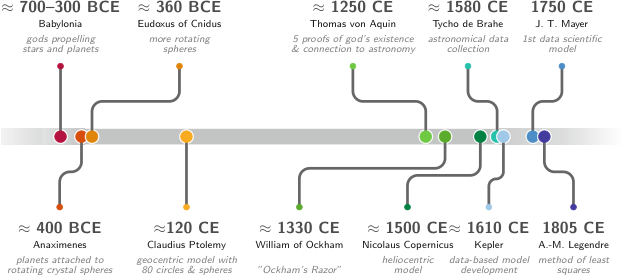{width=80%}

## Kepler: The First Data Analyst

::: {.fragment}
::: {.columns}
::: {.column width="80%"}
- 1609: Kepler inherited **25 years** of Mars observations from Tycho Brahe
- He didn't invent a new telescope — he invented a **data-driven explanation**
- Transition from descriptive (circles) to explanatory (ellipses)
:::
::: {.column width="20%"}
{height=300px}
:::
:::
:::

::: {.fragment}
**The lesson**: More data alone is not enough. You need the right *model*.
:::

::: {.fragment}
::: {.columns}
::: {.column width="50%"}
{width=100%}
:::
::: {.column width="50%"}
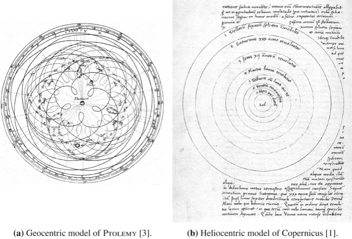{width=100%}
:::
:::
:::

## J. Tobias Mayer: Lunar Tables — An Early Data-Driven Model
::: {.columns}
::: {.column width="50%"}
### What are lunar tables?
- Precomputed numerical tables predicting the **Moon’s position over time**
- Inputs: date & time  
- Outputs: celestial coordinates (longitude, latitude), phase

### Why were they important?
- Enabled solving the **longitude problem at sea**
- Workflow:
  - Observe Moon–star position
  - Compare with predicted values
  - Infer reference time → compute longitude
 
:::
::: {.column width="50%"}
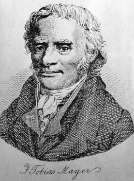{height=150px}

### Connection to Machine Learning
- Lunar tables ≈ **surrogate model of a dynamical system**
- Conceptual pipeline:
  - Data → Model → Prediction → Refinement
- Analogy:
  - Input: time  
  - Output: Moon position  
  - Model: calibrated function approximator
:::
:::
 

::: {.fragment}
Materials science today: we often have more measurements than parameters — this is a good problem to have!
:::

## The Ashby Map/Material Property Charts: Feature Engineering Before ML

 
- **Michael Ashby** (1992): Plotting material properties against each other
- Guided by both the engineering knowledge and intuition chose the most important pairs of properties, e.g., Young’s modulus vs. density
or strength vs. density
- **Feature engineering** without explicit ML
 
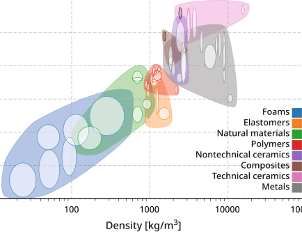{height=500px}
 

::: {.callout-note .fragment}
Domain knowledge tells you *which* features to plot. ML automates finding patterns in high-dimensional versions of this idea.
:::

---


## Recall from MFML: Model Types & Learning Tasks

::: {.fragment}
- **Models**: Abstractions trading fidelity for simplicity.
- **Spectrum**: White-Box (physics) $\leftrightarrow$ Grey-Box (hybrid) $\leftrightarrow$ Black-Box (data-driven).
- **Core Tasks**: Supervised (regression/classification) vs Unsupervised (clustering/dimensionality reduction).
- **Optimization**: We minimize specific **loss functions** to fit models to data.
:::

## Think About This…

::: {.fragment}
**Question:**  
You have a dataset of 50 tensile test curves. You want to predict yield strength from composition.

Should you use a **white-box**, **black-box**, or **grey-box** model?
:::

---

## Discussion → Answer

::: {.fragment}
**Grey-box is likely best.**
:::

::: {.fragment}
- **Black-box limits:** High-capacity models risk overfitting ($n=50$). Data is too sparse for deep learning without priors.
- **White-box limits:** Models like **Labusch/Fleischer** estimate solid-solution strengthening $\Delta\sigma_{\text{SSS}}(c)$, but cannot predict total yield strength safely since key microstructural state variables (grain size, precipitates) are missing.
:::

---

## Grey-box Strategy

::: {.fragment}
**Combine physics + data:**
$$
\sigma_y(c) = \underbrace{\Delta\sigma_{\text{SSS}}(c; \varepsilon, G)}_{\text{Physics Baseline}} + \underbrace{f_{\text{ML}}(c)}_{\text{Data-driven Residual}}
$$
:::

::: {.fragment}
- **Physics baseline:** Labusch/Fleischer provides a strong prior $\sigma_{\text{physics}}(c)$
- **ML learns:** The unobserved microstructural residuals, missing mechanisms, and noise.
:::


::: {.callout-note .fragment}
> Use physics to reduce the hypothesis space,  
> and data to correct what physics cannot capture.
:::

## Materials example 1: process→property regression

::: {.columns}
::: {.column width="60%"}
**Example: steel quench & temper (DIN 1.7709 / 21CrMoV5-7).**

- Inputs: austenitizing temperature/time, quench medium, tempering temperature/time (here: fixed austenitize at 960 °C, oil quench, 2 h temper) [@Mantzoukas_2021_17709].
- Target: hardness (HRC/HV) or tensile properties (continuous).
- Risks: true cooling rate vs nominal quench, furnace load/position, prior microstructure, section size—easy to miss in the spreadsheet but they move the outcome.
:::

::: {.column width="40%"}
{width=100% fig-alt="Rockwell hardness versus tempering temperature with error bars."}
:::
:::

## Materials example 2: defect classification from images


**Example: supervised labeling of SEM micrographs** [@Modarres_2017_SEM]—the same pipeline as defect screening, but here the classes are morphology/device categories rather than “OK vs pore/crack”.

- Inputs: SEM (or EM) images + acquisition metadata (detector, beam energy, working distance, coating, etc.).
- Target: discrete class or defect probability (often multi-class softmax or one-vs-rest heads).
- Risks: **class imbalance** (rare defect modes), **weak/expert-dependent labels**, **domain shift** between tools and operators (contrast/charging/stage drift).

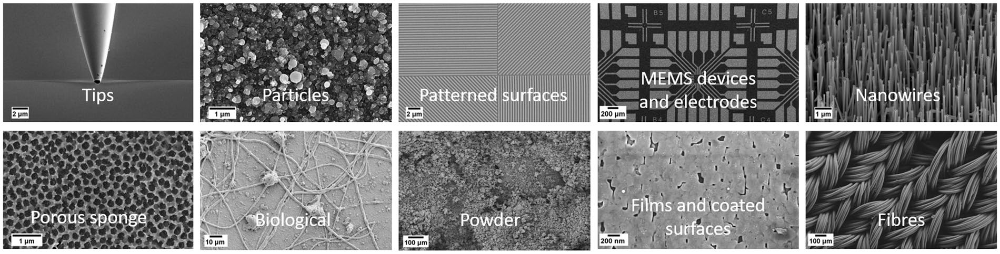{width=100% fig-alt="Grid of ten scanning electron micrographs labeled by material morphology class."}


## Materials example 3: spectra interpretation task framing

::: {.columns}
::: {.column width="60%"}
**Example: Raman spectra → TiO$_2$ polymorph class (anatase vs rutile).** [@Bhattacharya_2022_TiO2_Raman]

- Inputs: spectral signal (possibly multimodal context).
- Targets: composition class, phase indicator, or property proxy.
- Risks: baseline drift, preprocessing leakage, calibration instability.
:::

::: {.column width="40%"}
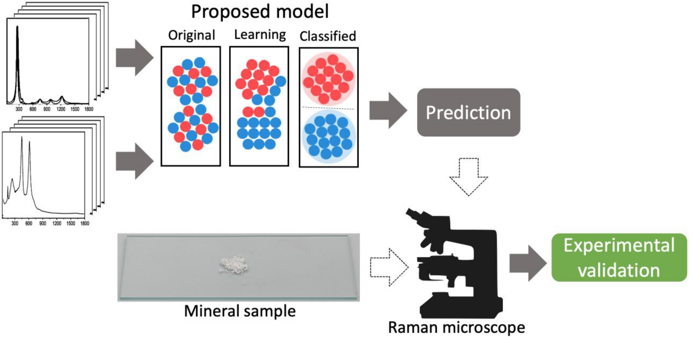{width=100% fig-alt="Raman spectral line stacks feeding a classification model, embedding visualization from mixed to separated classes, and experimental validation with a powder sample and Raman microscope."}
:::
:::

## Parsimony and Occam's Razor

::: {.fragment}
> "Among competing hypotheses, the one with the fewest assumptions should be selected." [@ryan2021machine]
:::

::: {.fragment}
- **Recall Overfitting from MFML**: A model that memorizes training data but fails on new data
- **Parsimony**: Prefer the simplest model that explains the data
- **Rule of thumb**: Start simple, add complexity only when justified
:::

::: {.callout-note}
If a linear model works, don't use a neural network.
:::

---

 

## The PSPP Paradigm

### Processing → Structure → Property → Performance

::: {.columns}
::: {.column width="50%"}
::: {.fragment}
- **Nodes**: Distinct data domains (images, spectra, logs)
- **Edges**: The ML tasks we want to solve
- **Dependency**: Structure *mediates* properties
:::
:::

::: {.column width="50%"}
```{mermaid}
%%| echo: false
%%| fig-align: center
flowchart TD
    %% Styling
    classDef default fill:#1e293b,stroke:#94a3b8,stroke-width:2px,color:#ffffff,rx:8px,ry:8px;
    classDef primary fill:#713f12,stroke:#facc15,stroke-width:2px,color:#ffffff,rx:12px,ry:12px,font-weight:bold;
    classDef secondary fill:#064e3b,stroke:#4ade80,stroke-width:2px,color:#ffffff,rx:8px,ry:8px,font-weight:bold;

    P["<span style='font-size:24px;'>Processing</span>"]:::secondary -->|<span style='font-size:16px;'>Physics-Informed</span>| S["<span style='font-size:24px;'>Structure</span>"]:::primary
    S -->|<span style='font-size:16px;'>Vision ML</span>| Pr["<span style='font-size:24px;'>Property</span>"]:::primary
    Pr -->|<span style='font-size:16px;'>Surrogates</span>| Pe["<span style='font-size:24px;'>Performance</span>"]:::primary
    Pe -->|<span style='font-size:16px;'>Inverse Design</span>| P
```
:::
:::

## The Multi-Scale Challenge

::: {.columns}
::: {.column width="50%"}
::: {.fragment}
- Materials span **10 orders of magnitude**: atoms (Å) to components (m)
- Each scale has its own data type:
  - Atomic: DFT energies, electron microscopy
  - Micro: Micrographs, EBSD maps
  - Meso: Process logs, mechanical tests
  - Macro: Component performance, field data


:::
:::
::: {.column width="50%"}
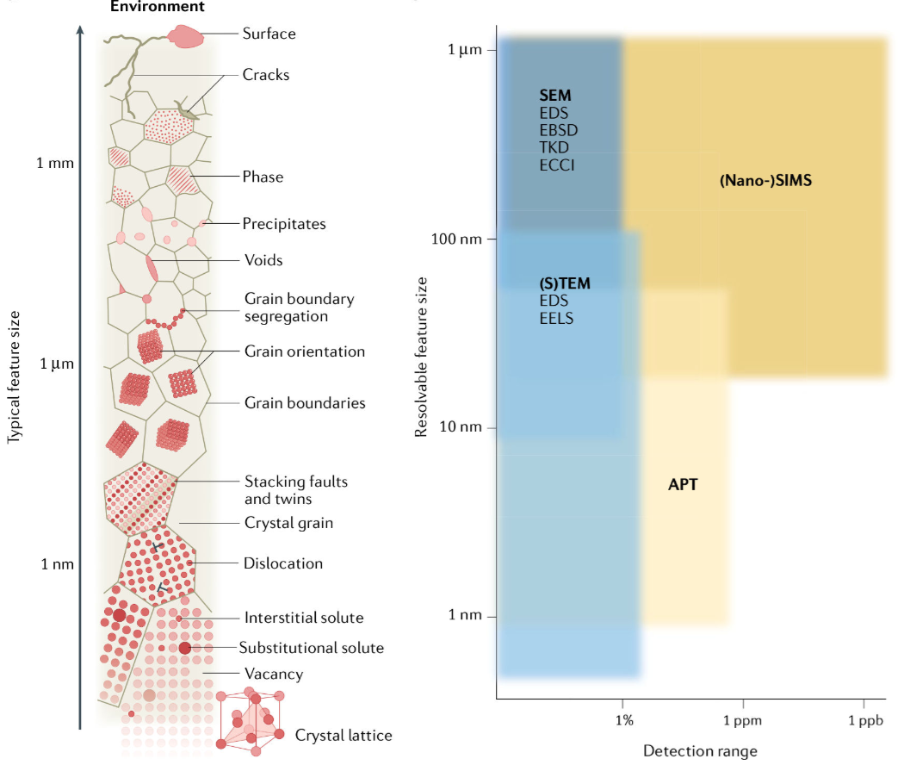{width=100% fig-alt="Microstructural features, typical sizes, and analytical techniques"}
:::
:::

::: {.callout-note .fragment}
**ML challenge:** How do you connect information across scales?
:::

## The Multi-Modal Challenge

::: {.columns}
::: {.column width="55%"}
::: {.fragment}
- A single sample produces many data types:
  - **Images**: SEM, TEM, optical micrographs (2D/3D)
  - **Spectra**: XRD, EELS, EDS (1D/4D)
  - **Time series**: Temperature logs, force curves
  - **Scalars**: Hardness, conductivity, composition
:::

::: {.fragment}
**Fusion problem**: How do you combine a micrograph with a spectrum with a process log into one model?

**Model-driven fusion in STEM:** joint recovery of elemental maps by linking high-SNR elastic (HAADF) structure with spectroscopic (EDX/EELS) signals—often at much lower dose than chemistry-only mapping [@Schwartz_2022_fused_multimodal_EM].
:::
:::

::: {.column width="45%"}
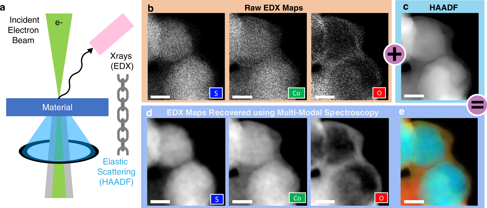{width=100% fig-alt="STEM geometry with HAADF and EDX; noisy raw elemental maps, clear HAADF, recovered elemental maps, and false-color composite."}
:::
:::

## Small Data / High Cost

::: {.fragment}
- A single microscopy session can cost **hundreds to a few thousand Euros** in *access charges alone*—before counting preparation, travel to a national facility, and expert time.
- Synthesizing a new alloy (or composition) takes **days to weeks** of lab and person time; each new label in the dataset is tied to that pipeline.
- Typical ML dataset sizes in our field: **10–1000** conditions or specimens—not millions of i.i.d. draws.
:::

::: {.fragment}
**Typical access charges (EU core facilities):**

- **SEM / entry TEM** class tools: often **tens of € per hour**.
- **Analytical S/TEM** (EELS/EDX, HRSTEM, tomography setups): commonly **roughly 50–150 €/h** on published university tariffs (operator-assisted, external, or industrial use is often **several times** higher).
- **Back-of-envelope:** ~8–12 h instrument time for a careful study × ~**100 €/h** → on the order of **€10³** before prep and analysis—so “**thousands of Euros**”
:::

::: {.fragment}
**Contrast**: ImageNet has **14 million** images collected at **~zero marginal cost** per extra jpeg. A materials dataset with **50–500** labeled examples can already reflect **many person-months** and **many instrument-days**.
:::

::: {.callout-note .fragment}
Materials data is **precious and sparse** 
:::

## Measurement Noise and Artifacts in the Lab

::: {.fragment}
- **Beyond theoretical noise**: Real laboratory data contains more than just statistical uncertainty.
- **Systematic Errors**: Instruments drift over time, calibration degrades.
- **Physical Artifacts**: Sample charging in SEM, sample contamination, beam damage.
:::

::: {.fragment}
These artifacts create **epistemic uncertainty** that must be managed through strict experimental protocols, not just more data.
:::

## The Curse of Dimensionality (I)

::: {.fragment}
**Thought experiment**: You have 3 process parameters, each with 10 possible values.

- Full grid search: $10^3 = 1{,}000$ experiments
- But if you have 10 parameters: $10^{10} = 10{,}000{,}000{,}000$ experiments!
:::

::: {.fragment}
Even with 35 experiments, you've explored only $\frac{35}{10^3} = 3.5\%$ of a 3-parameter space.
:::

### The Curse of Dimensionality (II)

::: {.fragment}
::: {.columns}
::: {.column width="55%"}
- In high-dimensional space, data is **sparse by default**
- All points are approximately equidistant from each other
- Nearest-neighbor methods break down
- Materials data lies on a **low-dimensional manifold** — finding it is key
:::
::: {.column width="45%"}
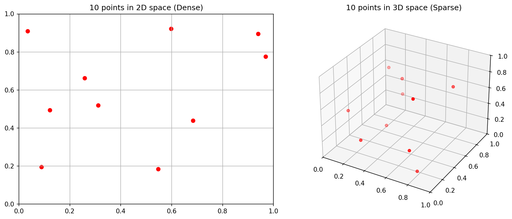{width=100%}
:::
:::
:::

## Data Scales (I): Nominal and Ordinal

::: {.fragment}
- **Nominal** (names): Phase labels (FCC, BCC, HCP)
  - No ordering, no arithmetic
- **Ordinal** (ordered names): Grain size categories (fine, medium, coarse)
  - Ordering exists, but distances are undefined
:::

::: {.fragment}
**ML impact**: You cannot compute a meaningful "average" of nominal data. Choose your algorithms accordingly.
:::

### Data Scales (II): Interval and Ratio

::: {.fragment}
- **Interval** (equal distances, no true zero): Temperature in Celsius
  - 20°C is not "twice as hot" as 10°C
- **Ratio** (true zero): Temperature in Kelvin, mass, length
  - 200 K is genuinely twice as hot as 100 K
:::

::: {.fragment}
**The Sumerian connection**: A number without its unit and scale is worthless — this was true in 3400 BCE and it's true today [@sandfeld_materials_data_science].
:::

## Metadata in the Lab

::: {.fragment}
- Every measurement needs metadata:
  - Instrument settings (voltage, magnification, exposure)
  - Calibration history
  - Environmental conditions (temperature, humidity)
  - Sample preparation steps
:::

::: {.fragment}
**Without metadata, your data is just noise with a timestamp.**
:::

## Think About This: The "Failure Story"

::: {.fragment}
**True story**: A neural network was trained to classify steel microstructures. It achieved 99% accuracy on the test set.

But it was actually learning the **serial number of the microscope** — each microscope was used for only one type of steel.
:::

::: {.fragment}
This is a classic example of **data leakage** (introduced in MFML): the model finds a shortcut that correlates with the label but has no physical meaning.
:::

::: {.callout-note .fragment}
Always ask: "What is the model *actually* learning?"
:::

## Recap

::: {.fragment}
1. **PSPP** structures the data flow in materials science
2. Materials data is **multi-scale, multi-modal, and sparse**
3. The **Curse of Dimensionality** means we can never sample enough
4. **Data scales** and **metadata** constrain what operations are valid
5. **Data leakage** is the silent killer — always check what the model learned
:::

---


## The CRISP-DM Standard

### Cross-Industry Standard Process for Data Mining

::: {.fragment}
- Originally developed for business analytics (1996)
- Adapted here for **scientific laboratory workflows**
- 6 phases forming a cycle 
:::

::: {.fragment}
```{mermaid}
%%| echo: false
%%| fig-align: center
flowchart TD
    %% Styling
    classDef default fill:#1e293b,stroke:#94a3b8,stroke-width:2px,color:#ffffff,rx:8px,ry:8px;
    classDef step fill:#082f49,stroke:#38bdf8,stroke-width:2px,color:#ffffff,rx:8px,ry:8px,font-weight:600;

    BU["<span style='font-size:18px;'>1. Business<br>Understanding</span>"]:::step --> DU["<span style='font-size:18px;'>2. Data<br>Understanding</span>"]:::step
    DU --> DP["<span style='font-size:18px;'>3. Data<br>Preparation</span>"]:::step
    DP --> M["<span style='font-size:18px;'>4. Modeling</span>"]:::step
    M --> E["<span style='font-size:18px;'>5. Evaluation</span>"]:::step
    E --> D["<span style='font-size:18px;'>6. Deployment</span>"]:::step
    D --> Mon["<span style='font-size:18px;'>7. Monitoring</span>"]:::step
    Mon -->|<span style='font-size:16px;'>Feedback Loop</span>| BU
```
::: 

## Phase 1: Business (Scientific) Understanding

::: {.fragment}
- **What is the scientific/business question?**
- What would a useful answer look like?
- What is the actual **Return on Investment** (ROI) or cost savings?
:::

::: {.fragment}
**Alloy Example**: Can we predict yield strength from composition to reduce expensive destructive tensile testing by 50%? The ROI is the testing money/time saved vs. the cost of training the ML model.
:::

::: {.fragment}
**Bad**: "Let's apply ML to our data and see what happens."
:::

## Phase 2: Data Understanding

::: {.fragment}
- Visualize raw data before anything else!
- Check for completeness and boundary conditions:
  - Missing values and outliers (saturation)
  - Measurement units (are they recorded?)
:::

::: {.fragment}
**Alloy Example**: We gather legacy CSVs of tensile tests and note that half are missing grain size data. We also notice 10% of samples were measured in 'ksi' instead of 'MPa'!
:::

::: {.fragment}
**Rule**: If you can't describe exactly what your raw data looks like, you're not ready to model.
:::

## Phase 3: Data Preparation

::: {.fragment}
- **Cleaning**: Imputing or dropping missing values
- **Scaling/Transformation**: Normalizing features to comparable ranges
- **Splitting**: Train / Validation / Test sets
:::

::: {.fragment}
**Alloy Example**: We convert all 'ksi' to 'MPa', drop columns with >50% missing data, and carefully split our data **by casting batch**, not randomly, to prevent data leakage.
:::

::: {.fragment}
Data preparation frequently takes 60-80% of the entire project timeline.
:::

## Phase 4: Modeling

::: {.fragment}
- Select algorithm(s) appropriate for your:
  - Data structure (tabular vs images)
  - Data volume ($n=50$ vs $n=1,000,000$)
- **Crucial**: Start with a simple baseline!
:::

::: {.fragment}
**Alloy Example**: We first train a simple Multivariate Linear Regression before trying a complex Random Forest or Neural Network.
:::

::: {.fragment}
A simple baseline model that you understand is worth more than a complex model that you don't.
:::

## Phase 5: Evaluation

::: {.fragment}
- Does the model **generalize** to new data?
- Does it meet the KPIs set in Phase 1?
- Evaluate metrics (e.g., $R^2$, RMSE, MAE)
:::

::: {.fragment}
**Alloy Example**: The Random Forest gets an $R^2=0.92$, predicting yield strength within $\pm10$ MPa. This accuracy is sufficient to safely skip physical testing for standard batches, meeting our Phase 1 goal!
:::

## Phase 6 & 7: Deployment & Monitoring

::: {.fragment}
- **Phase 6 (Deployment)**: Integrating the model into the lab or factory workflow.
- **Phase 7 (Monitoring)**: Checking if KPIs hold up over time and triggering retraining.
:::

::: {.fragment}
**Alloy Example**:

- **Deployment**: The model is built into an operator dashboard. Technicians type in the chemistry, and it outputs the expected yield strength predictions.
- **Monitoring**: After 6 months, a furnace is replaced. The model starts constantly underpredicting strength. We catch this drift and trigger a model retraining loop back to Phase 1.
:::

## Correlation vs. Causality (I)

### The "Ice Cream" Trap


 
::: {.columns}
::: {.column width="50%" .fragment}
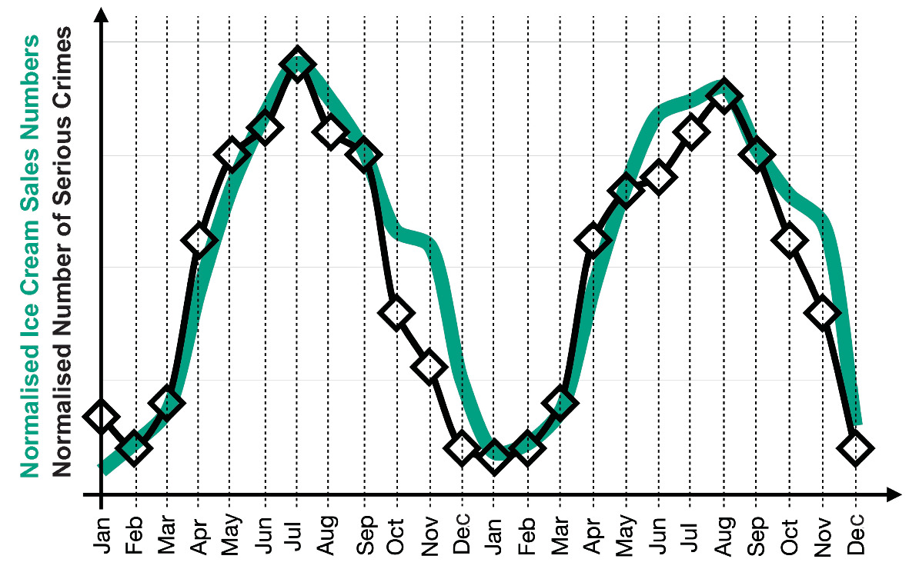{fig-alt="Two overlapping time series: green for ice cream sales, blue for violent crimes."}
:::

::: {.column width="50%" .fragment}
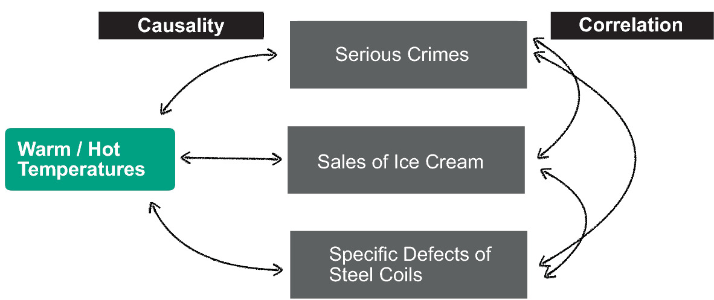{fig-alt="Diagram or chart illustrating that multiple trends may follow the same pattern but are not directly causally linked."}
:::
:::

::: {.fragment}
- **Observation**: Ice cream sales and crime rates both increase in summer
- **Spurious correlation**: Ice cream does *not* cause crime
- **Confounding variable**: Heat (temperature) drives both
:::

## Correlation vs. Causality (II) - In Materials Science

::: {.fragment}
- Does adding chromium *cause* increased hardness?
- Or is chromium a proxy for a specific heat treatment that refines grain size?
- **The PSPP graph helps**: trace the causal chain through Processing → Structure → Property
:::

::: {.fragment}
**Randomized experiments** (varying one factor at a time) are the gold standard for establishing causality — but expensive in materials science.
:::

## Scientific Trust and Explainability

::: {.fragment}
- Peers will ask: **"Why does your model make this prediction?"**
- A black-box answer ("the neural network said so") is not acceptable
- **Explainability methods**: SHAP values, attention maps, feature importance
:::

::: {.fragment}
::: {.columns}
::: {.column width="34%"}
**SHAP (local attributions)** — how much each feature pushes *this* prediction up or down.

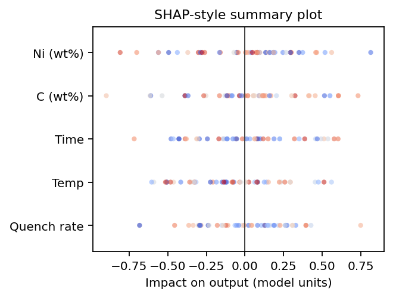{width=100% fig-alt="Beeswarm-style plot: horizontal impact per feature with points colored blue to red."}
:::

::: {.column width="33%"}
**Attention / activation maps** — *where* the network looks in an input (image, sequence, spectrum grid).

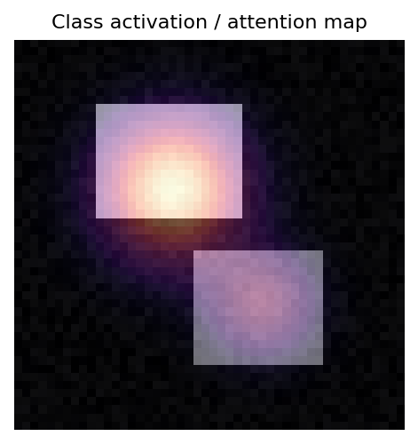{width=80% fig-alt="Gray base image with semi-transparent warm-colored spotlight overlays."}
:::

::: {.column width="33%"}
**Feature importance** — global ranking of inputs (tree splits, permutation Δ, coefficients).

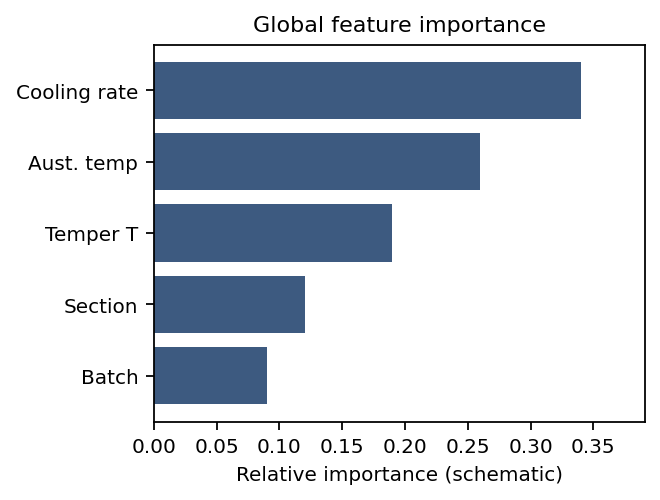{width=100% fig-alt="Horizontal bars of different lengths labeled with generic process features."}
:::
:::

 

:::
 

## Recap

::: {.fragment}
1. **CRISP-DM** provides a structured workflow for materials ML projects
2. Start with a clear **scientific question** (Phase 1)
3. **Explore your data** before modeling (Phase 2)
4. **Baseline before complexity** (Phase 4)
5. **Generalization** is the real test — not training accuracy (Phase 5)
6. Always distinguish **correlation from causality**
:::

---


## Exercise Preview: MDS-1 Tensile Test Dataset

::: {.fragment}
- Real dataset: tensile tests on steel samples
- Features: composition, processing parameters
- Target: yield strength, ultimate tensile strength
- **Your task**: Build a baseline regressor and evaluate it honestly
:::

## Exercise Tasks

::: {.fragment}
1. **Data Understanding**: Inspect the dataset — what scales? what distributions?
2. **Identify data types**: Nominal, Ordinal, Interval, Ratio
3. **Build a baseline**: Simple linear regression
4. **Evaluate honestly**: R², residual plots, cross-validation
5. **Check for leakage**: Are there hidden correlations?
:::

## Checklist for Trustworthy Materials ML

::: {.fragment}
- [ ] **Baseline first**: Can a simple model solve this?
- [ ] **Leakage check**: Is the model learning physics or shortcuts?
- [ ] **Unit consistency**: Are all features in compatible scales?
- [ ] **Metadata recorded**: Can someone reproduce this experiment?
- [ ] **Evaluation on held-out data**: Not the training set!
:::

## Unit 1 Summary: Top Takeaways

::: {.fragment}
1. Materials data is **precious and sparse** — every sample counts
2. **Domain knowledge** is a prerequisite for Materials Data Science
3. **PSPP** structures the data flow from processing to performance
4. Choose the right **model type**: White → Grey → Black
5. **CRISP-DM** provides a rigorous path from raw data to insight
6. Always check: **correlation ≠ causation**
:::

## References & Reading Assignments

::: {.fragment}
**Required Reading:**

- Sandfeld (2024): Chapters 1, 2, 4 [@sandfeld_materials_data_science]
- Neuer (2024): Chapter 1 [@neuer2024machine]
- McClarren (2021): Chapter 1 [@mcclarren2021machine]
:::

::: {.fragment}
**Next Week**: Unit 2 — Physics of Data Formation

How do physical measurements become digital arrays? Understanding the measurement chain, noise, and dimensionality reduction.
:::

---

## References

::: {#refs}
:::
