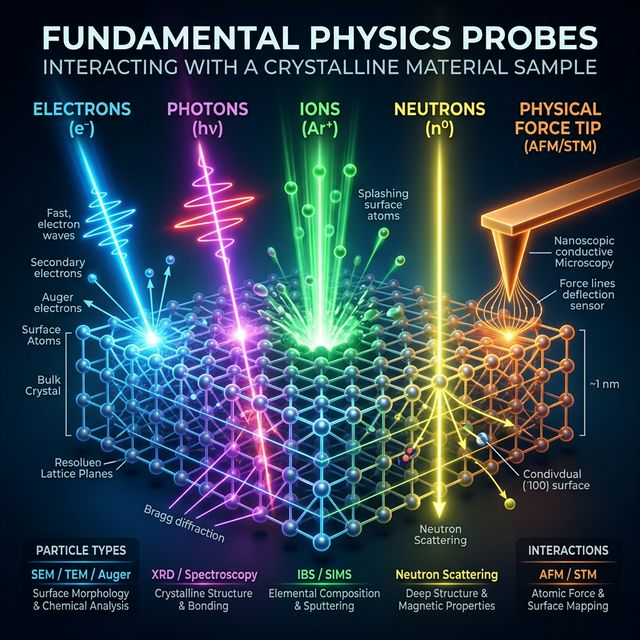
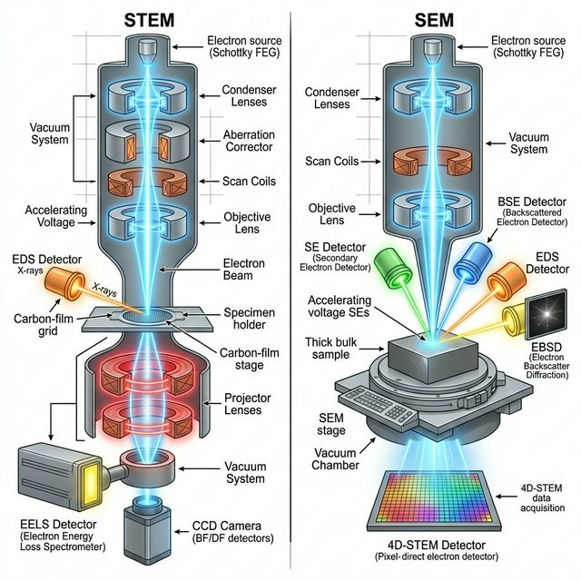
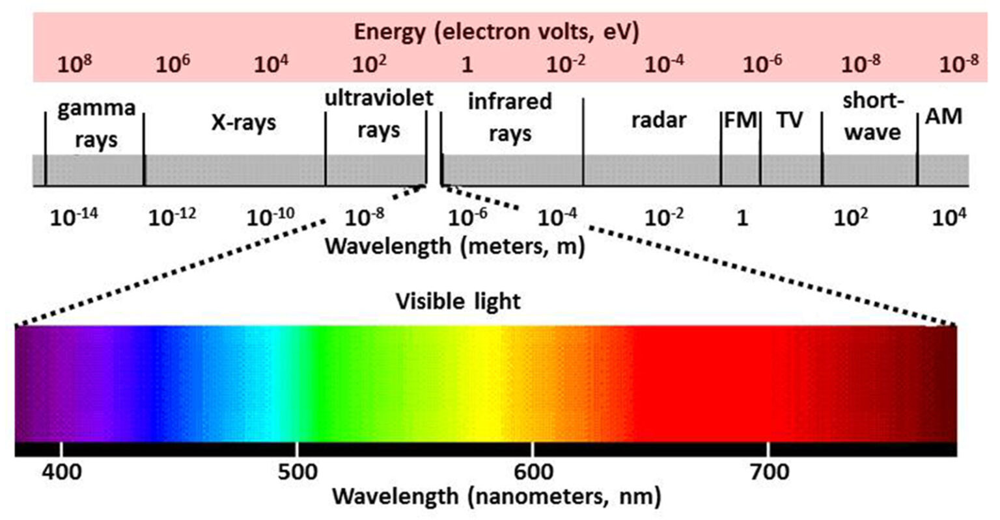
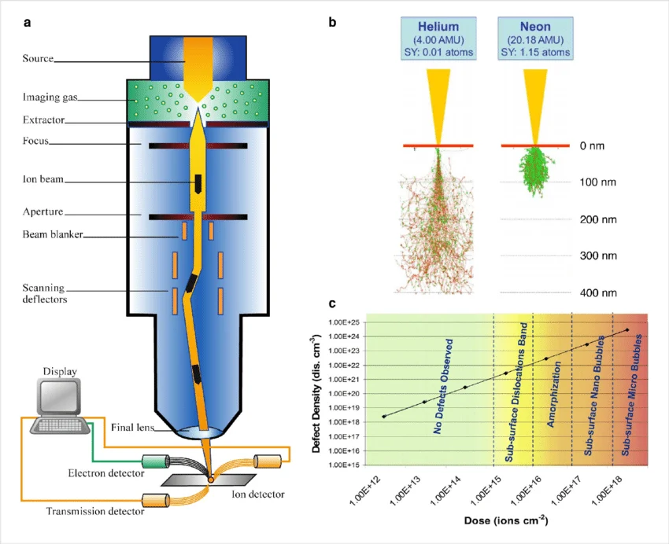
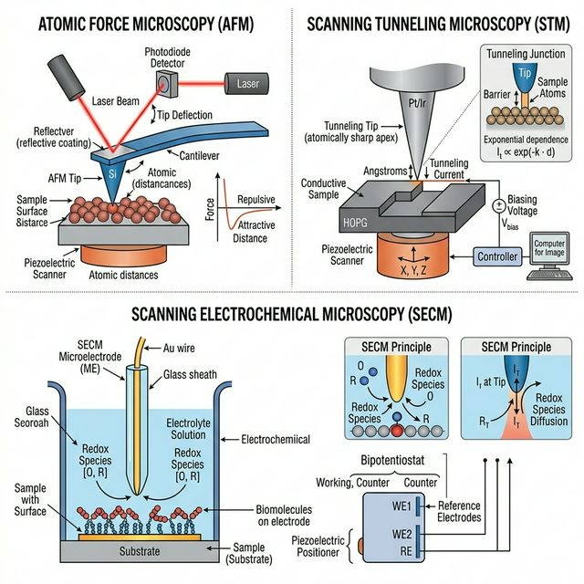
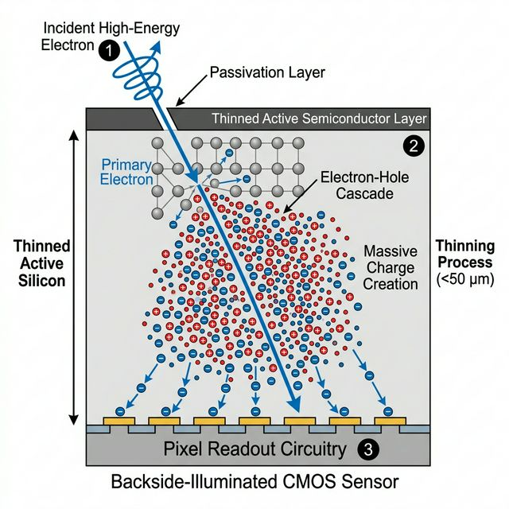

## 01. From Physical Sensing to ML

::: {.columns}
::: {.column width="50%"}
- How does a material property become a data point?
- Transition from physical process $\xi(t)$ to digital value $x_i$.
- Understanding the physics of sensing is crucial for selecting appropriate ML models (priors).
:::
::: {.column width="50%"}
- **Physics of Sensing:** From photons to digits.
:::
:::

::: {.notes}
**Framing the unit.** Unit 2 is about what happens *before* the neural network sees
a number. Every data point in materials characterization is the output of a chain:
physical state of the sample → probe–sample interaction → sensor / transducer →
analog electronics → ADC → stored digital value. The ML model only ever sees the
last link of this chain.

**Key conceptual shift.** Treat a measurement not as a value but as a random
variable generated by a *physical sampling process*. The general form we will use
throughout the unit is $x_i = \xi(\tau_i + \delta t) + u_x$, where $\xi$ is the
continuous ground-truth field, $\delta t$ is a sampling-time uncertainty (clock
jitter, scan drift) and $u_x$ is an amplitude uncertainty (shot noise, read noise,
dark current).

**Why this matters for ML.**

- Architecture choice is dictated by the *format* of the data, which is dictated by
  the probe ($2\mathrm{D}\ \text{images} \rightarrow \mathrm{CNN}/\mathrm{ViT}$;
  $1\mathrm{D}\ \text{spectra} \rightarrow \text{1D CNN}/\text{Transformer}$;
  $3\mathrm{D}\ \text{point clouds (APT)} \rightarrow \text{PointNet}$).
- The right *loss function* is dictated by the noise statistics
  ($p(x\mid\hat{x})=\mathcal{N}(\hat{x},\sigma^2) \rightarrow \mathcal{L}_{\mathrm{MSE}}$;
  $p(x\mid\hat{x})=\mathrm{Poisson}(\hat{x}) \rightarrow \mathcal{L}_{\mathrm{Poisson\ NLL}}$).
  Using $\mathcal{L}_{\mathrm{MSE}}$ on low-dose count data is a physics error.
- The right *regularizer* is dictated by physical priors (smoothness, sparsity,
  positivity, conservation laws). This is the Bayesian view we will formalize in
  slides on MAP estimation.

**Takeaway to reinforce.** "Garbage in, garbage out" has a precise meaning here:
if the physics of the sensor are misunderstood, the ML model learns detector
artifacts rather than materials physics. The rest of Unit 2 gives us tools to
avoid that.
:::

## 01b. Learning Outcomes

**Prerequisite (MFML Unit 2):** feature matrix $\mathbf{X}$, SVD, PCA, scree plots, standardization, low-rank approximation, eigen-microstructures.

By the end of *this* unit you can:

::: {.fragment}
1. Describe the **measurement chain** from physical state to digital value.
2. Apply the **Nyquist–Shannon theorem** to assess sampling adequacy and recognize **aliasing** artifacts.
3. Match physical noise processes to the right **likelihood / loss function** (Gaussian→MSE, Poisson→Poisson NLL, Weibull→reliability).
4. Distinguish **aleatory** from **epistemic** uncertainty and decide when to collect more data.
5. Read detector moments (mean, variance, skew, kurtosis) as *physical* diagnostics rather than abstract statistics.
6. **Interpret PCA components** in terms of materials physics — and recognize when a linear basis fails.
7. Apply **K-means** and **t-SNE** for unsupervised clustering and visualization in the PCA-reduced space.
:::

## 02. The Five Fundamental Probes

::: {.columns}
::: {.column width="50%"}
To understand data, we first ask: **What is probing the sample?**

1. **Electrons:** Charged, low mass. High spatial resolution.
2. **Photons:** Massless, uncharged. Penetrating, probes bonds & crystals.
3. **Ions:** Massive, charged. Huge momentum transfer (sputtering).
:::
::: {.column width="50%"}
4. **Neutrons:** Massive, uncharged. Deep nuclear penetration.
5. **Physical Forces:** Van der Waals, Pauli repulsion, tunneling (macroscopic/nanoscale probes).

- The choice of probe dictates the **physical interaction**, which determines the resulting data format (2D projection vs 3D volume, surface vs bulk).
:::
:::

<div style="text-align: center; margin-top: 20px;">
  
</div>

::: {.notes}
**Opening question.** Before we discuss any dataset, ask: *what did we shoot at the
sample?* The answer determines resolution, depth sensitivity, contrast mechanism,
dose/damage, and therefore the ML data format.

**Walkthrough of the five probes.**

- **Electrons:** charged, low mass, de Broglie $\lambda \sim$ pm at 100–300 kV.
  Strong interaction → high signal, low penetration (~tens of nm). Focusable with
  magnetic lenses → sub-Å probes.
- **Photons:** massless, uncharged. $E = h\nu$ spans orders of magnitude; pick
  energy to pick interaction (bonds, plasmons, cores, lattice). High penetration,
  bulk-representative, but difficult to focus to sub-nm in real space.
- **Ions:** heavy and charged. Transfer momentum to *nuclei* → sputtering,
  implantation. Used for FIB milling, helium ion microscopy, and APT (isotope
  mass-resolved 3D atom positions).
- **Neutrons:** heavy, neutral. Interact only with nuclei and magnetic spin.
  Centimeter-scale penetration; isotope-specific (H vs D, $^{10}$B vs $^{11}$B);
  probe magnetic structures.
- **Physical forces:** contact/near-contact nanoscopic tip. Van der Waals,
  electrostatic, Pauli repulsion, tunneling (STM). True $Z(X,Y)$ height maps, not
  projections.

**Probe → data modality → ML architecture (discuss explicitly).**

- Electrons → 2D real-space images, 2D diffraction patterns, 4D-STEM datacubes →
  CNNs, ViTs, equivariant networks.
- Photons → 1D spectra, 2D diffractograms → 1D CNNs, peak-deconvolution networks,
  phase-retrieval networks.
- Ions (APT) → 3D labeled point clouds ($\sim 10^8$ atoms) → PointNet-like
  architectures, density-based clustering.
- Neutrons → 1D spectra, diffractograms, magnetic-contrast maps.
- SPM → 2.5D height maps, force curves → U-Nets for tip-deconvolution.

**Takeaway.** Choice of ML architecture is usually set by the probe physics, not
by fashion. If your data is a 3D labeled cloud, do not flatten it into an image
just to use a familiar CNN.
:::

## 03. Electron Interactions

::: {.columns}
::: {.column width="50%"}
**Physics of the Probe:**

- Electrons are negatively charged and have low mass.
- Strong Coulomb interactions with both nucleus and electron cloud.
- High interaction cross-section = **low penetration depth** (surface sensitive).
- Easily focused using magnetic lenses to sub-Ångström spot sizes.
:::
::: {.column width="50%"}
**Information & Data Format:**

- **Elastic Scattering (Diffraction):** Provides crystal structure (e.g., SAED).
- **Inelastic Scattering (Energy Loss):** Yields chemical/bonding information (EELS/EDXS).
- **Data:** High-resolution 2D real-space images (SEM/STEM), 2D reciprocal-space diffractions, or 1D spectra.
:::
:::

<div style="text-align: center; margin-top: 20px;">
  
</div>

::: {.notes}
**Why electrons are the workhorse of high-resolution microscopy.** At 200 kV the de
Broglie wavelength is ~2.5 pm, well below atomic spacings. Electrons are charged,
so they can be focused by magnetic lenses — a luxury unavailable to X-rays or
neutrons. The Coulomb interaction with nuclei *and* electron clouds gives strong
contrast but also a short mean free path (tens of nm for typical samples).

**Elastic vs inelastic scattering (the two data streams).**

- *Elastic* (no energy loss): electrons scatter off the atomic potential. This
  produces diffraction patterns (SAED, CBED), high-angle annular dark field
  (HAADF) Z-contrast images in STEM, and phase-contrast TEM images. Data encodes
  atomic positions, lattice strain, crystal orientation.
- *Inelastic* (energy loss): electrons excite core electrons or plasmons. This
  produces EELS spectra and, via the accompanying X-ray emission, EDXS spectra.
  Data encodes chemistry, bonding, local electronic structure.

**Data formats to expect.**

- SEM image: 2D intensity $I(x,y)$, topographic/backscatter contrast, typically
  surface-sensitive.
- TEM/STEM image: $I(x,y)$ in real space or $I(k_x,k_y)$ in reciprocal space.
- 4D-STEM: $I(x, y, k_x, k_y)$ — a diffraction pattern at every probe position.
  Easily tens of GB to TB. Ideal testing ground for ML (ptychography,
  orientation mapping, strain mapping).
- Spectrum image: $I(x, y, E)$ in EELS/EDXS.

**Dose–damage trade-off (critical for ML).** More electrons per pixel → higher SNR
but more radiation damage, especially for beam-sensitive samples (polymers, MOFs,
2D materials, biological specimens). This is precisely why denoising networks,
self-supervised learners (Noise2Noise), and compressed sensing are transformative
in electron microscopy: they let us stay below the damage threshold.
:::

## 04. Photon Interactions (Vis & X-Ray)

::: {.columns}
::: {.column width="50%"}
**Physics of the Probe:**

- Electromagnetic waves ($E=h\nu$). They interact primarily with the electron cloud.
- **Visible/IR:** Low energy. Probes molecular bonds, vibrations, and bandgaps (Raman, FTIR).
- **X-rays:** High energy. Probes core-level electrons and long-range crystal periodicity (XRD, XPS). Highly penetrating.
:::
::: {.column width="50%"}
**Information & Data Format:**

- Transverse wave-nature means no magnetic lenses $\to$ harder to form sub-nm real-space probes compared to electrons.
- Excels at yielding bulk, macroscopic averages.
- **Data:** Often collected as 1D spectra (Intensity vs. Energy/Wavenumber/$2\theta$) or 2D diffraction spots.
:::
:::
{width="50%"}

::: {.notes}
**Photons as a probe.** Purely electromagnetic; no charge, no rest mass.
Interaction mechanism is set by photon energy:

- mid-IR / Raman: molecular vibrations, phonons;
- UV-Vis / PL: electronic transitions, bandgaps;
- XPS / XAS (soft X-ray): core-level transitions, oxidation state;
- XRD (hard X-ray): long-range atomic periodicity, lattice parameters.

**The lens problem.** The refractive index of matter for X-rays is essentially 1,
so there is no good X-ray "glass lens". Focusing requires zone plates, Kirkpatrick–
Baez mirrors, or computational approaches (coherent diffraction imaging,
ptychography). This is why sub-nm real-space X-ray imaging is an advanced
technique — and why ML-assisted phase retrieval is an active research area.

**Bulk vs surface.** X-rays routinely penetrate tens of µm to mm of dense
material; they naturally yield ensemble averages. Great for bulk phase
identification, stress tomography, operando studies; poor for local defects.

**Data formats.**

- 1D spectra $I(E)$ or $I(\lambda)$ (Raman, FTIR, UV-Vis, XPS, XAS, EDXS).
- 1D diffractograms $I(2\theta)$ (XRD powder).
- 2D diffraction patterns $I(k_x, k_y)$ (single crystal XRD, SAXS, CDI).
- 2D hyperspectral maps $I(x, y, E)$ (Raman mapping, synchrotron imaging).

**ML angle.** The inverse problems here are mostly *deconvolution*, *peak
identification*, and *phase retrieval*. The forward model is usually
well-understood physics (Lorentzians, Voigts, pseudo-Voigts for peak shapes;
kinematic diffraction; Lorentz / polarization factors). This means physics-aware
networks (unrolled iterations, score-based priors) work exceptionally well here.
:::

## 05. Massive Particles: Ions & Neutrons

::: {.columns}
::: {.column width="50%"}
**Ions:**

- Massive, charged (e.g., Ga$^+$, He$^+$).
- Transfer huge momentum (nuclear stopping).
- Used for milling/sputtering (FIB) and direct mass identification via Time-of-Flight (Atom Probe Tomography).
- **Data:** Focuses on direct 3D atomic reconstructions mapping isotopic mass to $(x,y,z)$ coordinates.

{width="30%"}
:::
::: {.column width="50%"}
**Neutrons:**

- Massive, neutral.
- Interact *only* with the nucleus (strong force) and magnetic spin.
- Extremely deep penetration (can probe inside bulk steel parts).
- **Data:** Isotope-specific scattering (can easily distinguish Hydrogen from Deuterium). Magnetic structure diffraction.
::: 
:::

::: {.notes}
**Ions — when the probe damages on purpose.** Unlike electrons or photons, a heavy
ion transfers so much momentum to nuclei that it *moves atoms* and *sputters
material*.

- **FIB (Ga$^+$):** controlled milling. Used to prepare TEM lamellae, cross
  sections, and serial block-face volumes. Beware of a ~20 nm Ga-implanted
  amorphous layer — a classic artifact ML can learn to recognize or correct.
- **HIM (He$^+$, Ne$^+$):** imaging with sub-nm probe, lower sub-surface damage
  than Ga.
- **Atom Probe Tomography (APT):** apply a high DC field + ns laser/voltage
  pulses; atoms successively field-evaporate, fly to a position-sensitive detector,
  and their mass is resolved by time of flight. Reconstruction yields a 3D,
  isotope-labeled point cloud, typically $10^8$–$10^9$ atoms. This is the closest
  thing to "3D atomic microscopy."

**Why APT is hard and why ML helps.** Trajectories are distorted by local
curvature of the tip; density variations appear near phase boundaries; ~30–60%
detection efficiency means the cloud is incomplete. ML tasks include: cluster
detection (e.g., early-stage precipitates), denoising of mass spectra, and
correcting trajectory aberrations.

**Neutrons — the silent penetrator.** Neutral and heavy; interact *only* with
nuclei (nuclear force) and magnetic moments.

- Penetration: cm of steel, so you can scan residual stress in welded components
  or Li transport inside a battery cell.
- Isotope specificity: cross-sections are irregular; H and D differ by an order of
  magnitude in scattering length. This is why neutrons are ideal for hydrogen
  storage materials, battery electrolytes, and biological samples (contrast
  variation).
- Magnetism: neutrons see magnetic structures directly; X-rays need synchrotron
  tricks to do the same.

**Instrument availability.** Remind students: ion beams are ubiquitous, neutrons
are not (a handful of reactors and spallation sources worldwide). Beam time is
scarce → ML to squeeze more from each sample.
:::

## 06. Physical Probes & Forces

::: {.columns}
::: {.column width="50%"}
**Physics of the Probe:**

- A physical, nanoscopic tip interacts directly with the sample surface.
- Relies on fundamental forces: Van der Waals, electrostatic, or Pauli exclusion (repulsion).
- In Scanning Tunneling Microscopy (STM), it measures quantum electron tunneling probability.
:::
::: {.column width="50%"}
**Information & Data Format:**

- **Atomic Force Microscopy (AFM):** Measures cantilever deflection via laser tracking.
- Yields true 3D spatial height maps (topography) of the surface, rather than a 2D projection.
- **Data:** 2D Topographic maps $Z(X,Y)$, or Force-Distance curves measuring mechanical stiffness/adhesion.
:::
:::

{fig-align="center" width="100%"}

::: {.notes}
**The SPM family.** Instead of firing particles, you raster a sharp physical tip
across the surface and record what it feels or measures at each pixel.

**Atomic Force Microscopy (AFM).**

- Cantilever with a sharp tip; deflection measured by reflecting a laser off its
  back onto a quadrant photodiode (optical beam deflection).
- Modes: contact (tip in touch, measures repulsion), tapping (oscillation,
  intermittent contact), non-contact (van der Waals regime).
- Modalities: topography $Z(X,Y)$, force-distance curves (elasticity, adhesion),
  phase imaging (viscoelasticity), KPFM (surface potential), MFM (magnetic
  gradient), c-AFM (conductivity).

**Scanning Tunneling Microscopy (STM).**

- Tunneling current between a metallic tip and a conductive sample.
- Exponential distance dependence ($\sim e^{-2\kappa d}$) gives atomic
  resolution.
- Also measures the local density of states $\rho(E, \mathbf{r})$ via $dI/dV$
  spectroscopy — maps electronic structure spatially.

**Data format distinction.** Unlike TEM/SEM/XRD, SPM returns a true 2.5D dataset:
each pixel is a height or a local observable, not an integrated projection. This
changes how ML models should be structured — you do not need to "invert" a
projection.

**Artifacts and ML opportunities.**

- Tip convolution: the measured image is $I = s \ast t$ where $t$ is the tip
  shape. Deconvolution networks (and blind deconvolution) are directly useful.
- Drift and creep of the scanner: autocorrection with flow-based models.
- Scan-speed vs resolution trade-off: sparse sampling + ML reconstruction is an
  active research area.
:::

## 07. Sensors as Transducers

- Sensors convert physical stimuli into electrical/digital signals.
- Stimuli: Photon intensity, electron scattering, temperature, stress.
- The mapping $f: \text{Physical State} \to \text{Digital Representation}$.
- Every sensor has a characteristic transfer function and noise profile.

::: {.notes}
**Defining the transducer.** A transducer is a device that converts a physical
observable (photon flux, force, current, temperature…) into an electrical signal.
An ADC then maps that analog signal to a finite-precision digital number.

**The transfer function.** Model the sensor as $n = f(s) + \eta$, where $s$ is
the stimulus, $n$ is the digital number, $f$ is the (ideally linear) transfer
function, and $\eta$ is additive noise. Real sensors show:

- **Gain / sensitivity** (slope of $f$ at the operating point),
- **Offset** (value at zero stimulus — dark level),
- **Non-linearity** (departure from a straight line),
- **Saturation** (clipping at the top of the range),
- **Dynamic range** = ratio of max signal to noise floor,
- **Bandwidth / response time** (how fast the sensor can follow changes),
- **Drift** with temperature and time,
- **Quantum efficiency** (for photon/particle detectors).

**Calibration: the unglamorous prerequisite.**

- *Dark-field subtraction*: average many zero-stimulus frames; subtract.
- *Flat-field correction*: uniform illumination → per-pixel gain map; divide.
- *Bad-pixel maps*: mark and inpaint dead/hot pixels.
- *Gain/offset calibration*: at least two known stimuli to fit a line.

**Connection to ML.** Calibrated data is the input that makes simple models work.
Uncalibrated data forces the ML model to spend its capacity "learning the
detector," which overfits to a single instrument and does not transfer. Rule of
thumb: the more of the transfer function you can invert analytically, the less
your network has to learn.

**Foreshadowing.** Slides 8–10 make this abstract picture concrete for three
different detector families (CMOS, scintillator-based, direct).
:::

## 08. Example: CMOS Detectors for Optical Imaging

::: {.columns}
::: {.column width="50%"}
- **Principle:** Photons generate electron-hole pairs in a semiconductor.
- **Architecture:** Active Pixel Sensor (APS) – each pixel has its own amplifier.
- **Transfer Function:** Photons $\rightarrow$ Charge $\rightarrow$ Voltage $\rightarrow$ Digital Number.
:::
::: {.column width="50%"}
- **Characteristics:**
  - High frame rates and parallel readout.
  - Susceptible to **readout noise** and **dark current** (thermal electrons).
  - High quantum efficiency for visible light.
:::
:::

::: {.notes}
**Why CMOS dominates consumer and industrial imaging.** Active Pixel Sensor (APS)
architecture: every pixel contains its own photodiode, reset transistor,
source-follower amplifier, and row-select transistor. Readout is massively
parallel → very high frame rates, low power, and integration of logic on the
same die (ROIs, binning, HDR, ML acceleration).

**Transfer chain.** Photon → electron-hole pair in the depletion region → charge
integrated on a pixel capacitor (or transferred to a floating diffusion) →
voltage → column ADC → digital number.

**Quantum efficiency (QE).** Visible peaks around 80–95% for back-illuminated
sensors; falls off in near-IR (beyond Si bandgap) and in UV (absorbed before
reaching the junction). QE is essentially zero for keV X-rays or fast electrons
— which is why we need scintillators (next slide) or direct detectors (slide 10)
for those regimes.

**The four noise sources students must know.**

- **Shot noise** (Poisson, fundamental): variance equals the mean number of
  collected electrons. Scales as $\sqrt{N}$. Dominant at high illumination.
- **Read noise** (Gaussian, electronic): roughly independent of signal;
  dominates at low illumination and sets the detection limit.
- **Dark current** (Poisson on top of Gaussian): thermally generated carriers;
  depends exponentially on temperature. Cooling (Peltier, LN$_2$) suppresses it.
- **Fixed-pattern noise / PRNU**: per-pixel gain and offset variations; removed
  by flat-fielding and dark-frame subtraction.

**Engineering knobs and why they matter.**

- Back-side illumination (BSI) → higher QE.
- Global shutter vs rolling shutter → avoids skew for fast scenes.
- Correlated Double Sampling (CDS) → suppresses kTC and 1/f noise.
- Pixel size trade-off: big pixels = more dynamic range, small pixels = more
  resolution.

**ML relevance.** Almost every modern denoising paper (Noise2Noise, Noise2Void,
SUPPORT) implicitly or explicitly assumes a Gaussian + Poisson mixture that is
calibrated against *this* sensor physics. Doing this properly is more productive
than tuning a loss function blindly.
:::

## 09. Example: Scintillation Detectors (Indirect)

::: {.columns}
::: {.column width="50%"}
- **Targets:** High-energy X-rays or fast electrons (e.g., in EM).
- **Two-Step Process:**
  1. Incident particle hits a scintillator (e.g., YAG, CsI).
  2. Scintillator emits a flash of visible light.
  3. Light is collected by a standard CMOS/CCD.
:::
::: {.column width="50%"}
- **Trade-offs:**
  - **Pro:** Protects the silicon sensor from radiation damage.
  - **Con:** The generated light scatters within the scintillator crystal.
  - **Result:** Broad Point Spread Function (PSF) $\to$ Loss of spatial resolution (blurring).
:::
:::

::: {.notes}
**The problem direct detection solves (and this slide does not).** Sending a keV
X-ray or 100–300 kV electron directly into silicon immediately generates tens of
thousands of carriers per event and damages the sensor over time. Historical
solution: put a *scintillator* in front of a standard CMOS/CCD and convert the
high-energy particle to many low-energy visible photons first.

**The two-step chain (with typical numbers).**
1. Incident particle → excitation of luminescence centers in a phosphor (YAG:Ce,
   CsI:Tl, P43 = Gd$_2$O$_2$S:Tb). A single 300 kV electron or a 20 keV X-ray
   releases $\sim 10^3$–$10^4$ visible photons.
2. Those photons propagate through the scintillator (possibly a fiber-optic
   taper) and are imaged by a CMOS/CCD.

**Why resolution suffers.** The visible photons scatter laterally inside the
scintillator before they escape. This lateral spread convolves the true incident
intensity distribution with a broad **point spread function (PSF)** $h$:
$y = x \ast h + n$. A thicker scintillator captures more high-energy particles
(higher DQE) but also produces a wider PSF. This is the fundamental
*resolution–efficiency trade-off* for indirect detection.

**ML angle.**

- Deconvolution: if $h$ is known, learn or unroll Richardson–Lucy-style updates.
- Super-resolution nets: treat the PSF as an implicit prior baked into the
  training data.
- Single-electron counting is possible but noisy due to scintillator photon
  statistics → lower SNR than direct detection.

**Historical context.** This is how TEM cameras worked for decades. It is still
the right choice for many X-ray applications (e.g., photon-starved imaging at
synchrotrons, radiography) because scintillator arrays can be made very large
very cheaply.
:::

## 10. Example: Direct Detectors

::: {.columns}
::: {.column width="50%"}
- **Targets:** X-rays and high-energy electrons (e.g., Cryo-EM).
- **Direct Process:** Incident particle enters a thinned semiconductor layer directly.
- **Physics:** One incident high-energy particle generates a massive electron-hole cascade.
:::
::: {.column width="50%"}
- **Key Advantages:**
  - No scintillator intermediate $\to$ **no optical scattering**.
  - Extremely sharp Point Spread Function (PSF).
  - High SNR allows precise **single-particle counting** with near-zero noise.
:::
:::

{fig-align="center" width="55%"}

::: {.notes}
**The idea.** Thin the silicon sensor so that a keV X-ray or fast electron
deposits energy *inside* the photosensitive layer itself, without a scintillator
intermediary. Each event generates a localized cascade of electron-hole pairs —
thousands per incident particle — right at the pixel of impact.

**What you win.**

- **Near-delta PSF**: no visible-light spreading. Spatial resolution is limited
  by carrier diffusion inside Si and by pixel pitch, not by a phosphor.
- **High DQE at the relevant low spatial frequencies** → much better SNR per
  dose than scintillators.
- **Single-particle counting**: at low dose, each incident electron generates a
  distinguishable blob that can be identified and counted, removing read noise
  per hit. The remaining noise is pure Poisson (shot) noise — the quantum
  limit.
- **Dose fractionation**: because readout is fast, direct detectors stream
  movies of many short frames, enabling per-frame motion correction and
  denoising.

**What you pay.**

- Sensor complexity and cost.
- Radiation damage to the sensor itself over time (months to years of use).
- Pixel pitch is limited by how thin the epi layer can be while still absorbing
  enough of the primary particle.

**Scientific impact.**

- Cryo-EM "resolution revolution" (2013 onward) was enabled primarily by the
  introduction of direct electron detectors (Falcon, K2/K3, DE).
- 4D-STEM at usable doses became routine.
- In X-ray science, hybrid pixel detectors (Pilatus, Eiger, Medipix) play a
  similar role: photon-counting with nearly zero electronic noise.

**ML relevance.** Because the dominant noise is Poisson, *the correct loss
function for downstream reconstruction is Poisson NLL, not MSE*. This will be
formalized in the slides on Gaussian→MSE and Poisson→Poisson-loss.
:::

## 11. Spectrometers: Energy Resolution in EDXS

::: {.columns}
::: {.column width="50%"}
- **Principle (Energy $\to$ Charge):** 
  - An X-ray photon strikes a semiconductor detector (e.g., Silicon Drift Detector).
  - It creates $N$ electron-hole pairs proportional to its energy: $N = E / \epsilon$.
  - Example: A 1 keV X-ray creates $\sim 260$ pairs in Si ($\epsilon \approx 3.8$ eV).
:::
::: {.column width="50%"}
- **Measurement:** 
  - The total collected charge is converted to a voltage pulse.
  - Pulse height $\propto$ incoming X-ray energy.
- **Resolution Limits:** 
  - Governed by **counting statistics** (Fano noise) and electronic readout noise.
  - Typical energy resolution is around $\sim 130$ eV.
:::
:::

::: {.notes}
**EDXS: "energy → charge" spectroscopy.** Each X-ray photon is absorbed inside a
semiconductor (Si(Li) or, modernly, a Silicon Drift Detector). The photon's
energy $E$ ionizes Si atoms, creating $N = E/\varepsilon$ electron-hole pairs,
where $\varepsilon \approx 3.6$–$3.8$ eV for Si. These pairs are swept to the
readout by a bias field and integrated over the event.

**The measurement chain.**

- X-ray absorbed in Si → $N$ e-h pairs generated.
- Charge collected on the anode → charge-sensitive preamplifier produces a step.
- Shaping amplifier produces a peak whose *height* is proportional to $N$, hence
  to $E$.
- Peak-detect and sort into a Multi-Channel Analyzer (MCA) → histogram = spectrum
  $I(E)$.

**Why resolution is limited — and why it beats pure Poisson.** A naïve Poisson
estimate would give $\sigma_N = \sqrt{N}$, which is too pessimistic. The
observed variance is $F \cdot N$, with Fano factor $F \approx 0.11$ for Si,
because the partition of energy into phonons vs ionizations is not independent
across events — energy conservation correlates them. The energy resolution is
$\Delta E = 2.355 \cdot \varepsilon \sqrt{F N + (\sigma_\mathrm{elec}/\varepsilon)^2}$,
which at the Mn Kα line (5.9 keV) yields the familiar $\sim 130$ eV FWHM for a
good SDD.

**Consequences for materials characterization.**

- Overlapping lines are common (e.g., S Kα at 2.31 keV vs Mo Lα at 2.29 keV; Ti
  Kβ vs V Kα). Quantification requires spectrum-fitting with physically correct
  line shapes and relative intensities.
- Pile-up at high count rates distorts the spectrum; pile-up rejection circuitry
  exists but is not perfect.
- SDD improvement over Si(Li): radial drift field → tiny anode capacitance →
  much lower electronic noise → higher count rate at equal resolution. No
  longer requires LN$_2$.

**ML relevance.** EDXS quantification is increasingly ML-assisted: learned
priors for background subtraction, joint unmixing of overlapping lines, and
spatial regularization across spectrum images (hyperspectral denoising).
:::

## 12. Spectrometers: Energy Resolution in EELS

::: {.columns}
::: {.column width="50%"}
- **Principle (Energy $\to$ Space):**
  - Fast electrons pass through the sample, undergoing inelastic scattering (losing energy).
  - A **magnetic prism** then bends the electron trajectories (Lorentz force).
  - Slower (energy-loss) electrons are bent slightly more than faster (zero-loss) ones.
:::
::: {.column width="50%"}
- **Measurement:**
  - The magnetic prism spatially disperses the electrons across a detector (e.g., CMOS or Direct Detector).
  - Pixel position on the detector directly maps to energy loss $\Delta E$.
- **Resolution Limits:**
  - Governed by the **energy spread of the electron gun** (e.g., Cold FEG restricts spread) and spectrometer aberrations.
  - State-of-the-art can achieve $\sim 10$ meV resolution!
:::
:::

::: {.notes}
**EELS: "energy → space" spectroscopy.** Rather than measuring one X-ray at a
time, EELS disperses a *beam* of electrons by energy using a magnetic prism,
projecting the energy-loss spectrum onto a position-sensitive detector.

**The physics in one sentence.** In a uniform magnetic field $\mathbf{B}$, the
Lorentz force $\mathbf{F} = -e \mathbf{v} \times \mathbf{B}$ curves electron
trajectories with radius $r = mv/(eB)$. Slower (more energy-loss) electrons have
smaller radius → bend more → land at a different horizontal position on the
detector. Position directly encodes $\Delta E$.

**What's in a spectrum.**

- **Zero-loss peak (ZLP)** at $\Delta E = 0$: electrons that didn't lose
  energy. Its width is the instrument's energy resolution.
- **Low-loss region** (0–50 eV): plasmons, phonons, band-gap features,
  vibrational modes for monochromated instruments.
- **Core-loss edges** (50–3000 eV): element-specific ionization edges (e.g.,
  C-K at 284 eV, O-K at 532 eV). Edge shapes (ELNES) encode bonding and
  oxidation state.

**Resolution budget.**

- Source energy spread: cold FEG $\sim 0.3$ eV, Schottky $\sim 0.7$ eV,
  monochromated $\sim 5$–$20$ meV.
- Spectrometer aberrations (corrected by multipoles in modern instruments).
- Detector PSF and pixel pitch.
- State-of-the-art monochromated EELS reaches $<10$ meV — vibrational
  spectroscopy on *single atomic columns*.

**EDXS vs EELS at a glance.**

- EDXS: simpler, larger collection angle, works at any TEM, but ~130 eV
  resolution. Quantification from line ratios.
- EELS: much higher resolution (meV to eV), chemical *and* bonding info, but
  needs a thin sample and careful background subtraction.

**Noise model (bridge to later slides).** On a direct detector, each pixel in
the EELS spectrum obeys Poisson statistics. The implication is that the correct
ML loss for denoising EELS spectrum images is Poisson NLL — a point we will
derive explicitly in the "Poisson noise → Poisson loss" slide.
:::

## 13. Continuous to Discrete Mapping

- Sampling: Measuring at discrete points $\tau_i$.
- Neuer's Sampling formula [@neuer2024machine]:
  $$x_i = \xi(\tau_i + \delta t) + u_x$$
  - $\xi$: Underlying physical truth.
  - $\delta t$: Timing jitter/uncertainty.
  - $u_x$: Amplitude noise/uncertainty.

::: {.notes}
**Making the sampling model precise.** Everything the computer ever sees follows
the same equation:

$$x_i = \xi(\tau_i + \delta t) + u_x$$

- $\xi(\cdot)$: the continuous, ground-truth physical field we would love to
  know exactly (intensity vs position, current vs time, EELS signal vs energy).
- $\tau_i$: the *nominal* sample location (pixel index × pitch, frame index ×
  period, spectral bin × $\Delta E$, …).
- $\delta t$: uncertainty in *when/where* the sample was actually taken — clock
  jitter, scan drift, stage instabilities, probe wobble. This couples with local
  gradients of $\xi$ to produce apparent noise.
- $u_x$: uncertainty in the *value* — shot noise, read noise, dark current,
  quantization, ADC non-linearity.

**Two failure modes to separate in students' minds.**

- Errors in $\tau_i$ (sampling geometry errors) → aliasing, moiré, scan
  distortions, phase noise, motion blur.
- Errors in $x_i$ at fixed $\tau_i$ (amplitude errors) → Gaussian/Poisson noise,
  pixel defects, saturation.
The two require different treatments: the first is a *forward-model* problem
(correct your model of where you measured), the second is a *likelihood* problem
(correct your model of the measurement noise).

**Why this equation is the backbone of the unit.**

- Nyquist/aliasing live in the $\tau_i$ spacing.
- Jitter lives in $\delta t$.
- Noise models (slides 22–27) live in $u_x$.
- Compressed sensing (FRI / FISTA, slides 19–21) combines both.
- Bayesian MAP (slide 28) writes down the likelihood $p(\mathbf{x} |
  \xi, \text{sensor})$ explicitly and plugs it into Bayes' rule.

**Takeaway.** Every ML model implicitly assumes some version of this equation.
The question is whether you chose it consciously or whether the defaults in
PyTorch chose it for you.
:::

## 14. Temporal and Spatial Sampling

::: {.columns}
::: {.column width="50%"}
**In Characterization:**

- Pixel pitch (spatial resolution)
- Frame rate (temporal resolution)
- Energy binning (spectral resolution)
:::
::: {.column width="50%"}
- Sampling Rate $\nu_S = 1/\Delta t$.
- Spatial frequency $k = 1/\Delta x$.
:::
:::

::: {.notes}
**Generalizing "sampling".** Signal processing language is usually taught for
time series, but it applies to *any axis that we discretize*. In materials
characterization we routinely sample along:

- **Time:** ADC rate, frame rate, pump–probe delay step. $\nu_S = 1/\Delta t$.
- **Space:** pixel pitch $\Delta x, \Delta y$. Spatial frequency $k = 1/\Delta x$.
- **Energy / wavelength:** EELS bin width $\Delta E$, XRD step, EDXS channel.
- **Angle:** tilt step in tomography, rocking curve step in diffraction.
- **Momentum:** $k$-step in 4D-STEM, $Q$-step in small-angle scattering.

**Multi-axis sampling.** Real datasets are tensors, not vectors. A 4D-STEM cube
$I(x, y, k_x, k_y)$ must respect Nyquist in *each* of the four axes
independently. Undersampling along $k_x$ (camera length too long, detector
pitch too coarse) aliases the diffraction pattern even if the real-space grid
is fine.

**Practical heuristic: Nyquist is a floor, not a target.**

- Nyquist: minimum sampling is $2\nu_{\max}$.
- Real experiments: aim for $3$–$5 \times \nu_{\max}$ to accommodate
  non-ideal anti-aliasing, finite-support artifacts, and a little safety margin.
- Memory/cost explodes as $\nu_S^D$ in $D$-dimensional data — so "just
  oversample" is often impossible. This motivates compressed sensing (coming
  later in the unit).

**Dose/time budget.** Sampling more = more dose, more time, more damage, more
storage. Every doubling of resolution along one axis costs 2× dose at least,
often more. Understanding sampling limits lets us *intentionally* undersample
and reconstruct — the central idea behind FRI/FISTA and modern ML-assisted
acquisition.

**Takeaway.** Whenever students see "sampling rate", they should ask: *along
which axis?* — and apply the signal processing machinery to each axis
separately.
:::

## 15. The Nyquist-Shannon Theorem

::: {.columns}
::: {.column width="40%"}
- To fully capture a signal with maximum frequency $\nu_{max}$, we must sample at least twice as fast: 
$$\nu_S \ge 2\nu_{max}$$

- Nyquist Frequency: $\nu_{Nyquist} = \frac{1}{2} \nu_S$.
- Frequencies above $\nu_{Nyquist}$ cannot be resolved and cause artifacts.
:::
::: {.column width="60%"}
<iframe src="nyquist_widget.html" width="100%" height="600px" style="border:none; margin-top:20px;"></iframe>
:::
:::

::: {.notes}
**The theorem.** A signal $\xi(t)$ that is *band-limited* (its Fourier
transform vanishes for $|\nu| > \nu_{\max}$) can be perfectly reconstructed
from its samples $\{\xi(n/\nu_S)\}$ provided $\nu_S \geq 2\nu_{\max}$.
The reconstruction formula is sinc interpolation:

$$\xi(t) = \sum_n \xi(n T_S) \, \text{sinc}\!\left(\frac{t - nT_S}{T_S}\right), \quad T_S = 1/\nu_S.$$

**Intuition.** You need *at least* two samples per period of the fastest
oscillation to be able to identify its frequency. With fewer, multiple different
continuous signals fit the samples — the map from signal to samples is no longer
injective.

**Caveats students must internalize.**

- The theorem assumes *exact* band-limiting. Real experiments are never band-
  limited → an **anti-aliasing filter** (optical blur, electronic low-pass,
  finite probe size) *must* suppress $|\nu| > \nu_{\max}$ before sampling,
  not after.
- Aperiodic or finite-length signals have spectra that strictly are *not*
  band-limited; Nyquist applies only up to edge artifacts (windowing, leakage).
- "Sufficient", not "necessary": with strong structural priors (sparsity),
  Finite Rate of Innovation and compressed sensing allow far sparser sampling —
  coming up later in this unit.

**In imaging.**

- Nyquist applies to each spatial axis: a feature of size $d$ needs pixel
  pitch $\leq d/2$ *at minimum*, and in practice $\leq d/3$–$d/4$ to beat the
  PSF and noise.
- For atomic-resolution STEM of a crystal with lattice spacing $a$, sampling
  at ~$a/4$ is standard.

**In spectroscopy.**

- Energy-bin width must be $\leq 1/2$ of the narrowest peak FWHM you want to
  resolve — else peaks merge into apparent broad features.

**Tips for the demo with the Nyquist widget.**

- Start with $\nu_S \gg 2\nu_{\max}$: the wave is reconstructed perfectly.
- Reduce $\nu_S$ to just above $2\nu_{\max}$: still reconstructed, but
  visibly fragile.
- Drop below Nyquist: the reconstructed wave has a *different* (lower)
  frequency than the true one — a persistent, non-random distortion.

**Bridge to the next slide.** When Nyquist is violated, the high-frequency
content does not vanish; it *folds back* into the measured spectrum as aliases
that the ML model may confidently learn to "predict". That's the topic of the
aliasing slide.
:::

## 16. Aliasing - When Resolution Fails

::: {.columns}
::: {.column width="40%"}
- If $\nu_S < 2\nu_{max}$, high-frequency components are "folded" into lower frequencies.
- **Example:** Moiré patterns in TEM when grid resolution and crystal lattice interfere.
- **Example:** Wagon-wheel effect in high-speed video.
:::
::: {.column width="60%"}
<iframe src="aliasing2d_widget.html" width="100%" height="600px" style="border:none; margin-top:0px;"></iframe>
:::
:::

## 17. Physical Resolution Limits

::: {.columns}
::: {.column width="35%"}
- Optical/Electron diffraction limits (Abbe's limit).
- **Point Spread Function (PSF):** The response of an imaging system to a point source.
- Measured image = True Object $\ast$ PSF + Noise.
- Blurring as a physical prior for convolutional models.
:::
::: {.column width="65%"}
<iframe src="psf_widget.html" width="100%" height="600px" style="border:none; margin-top:0px;"></iframe>
:::
:::

::: {.notes}
**Resolution is a physical quantity, not a pixel count.** Even if you sample
arbitrarily fine, the image you record is limited by how sharply the instrument
can localize a point source. That localization function is the **Point Spread
Function (PSF)**, $h(\mathbf{r})$.

**Abbe's diffraction limit.** For a lens of numerical aperture $\mathrm{NA}$
illuminated with wavelength $\lambda$, two points closer than
$d_\mathrm{Abbe} \approx \lambda / (2\,\mathrm{NA})$ cannot be separated.
Representative numbers:

- Visible microscopy ($\lambda \sim 500$ nm, $\mathrm{NA}\sim 1.4$) → $\sim 200$ nm.
- Soft X-rays ($\lambda \sim 2$ nm, $\mathrm{NA}\sim 0.05$) → $\sim 20$ nm.
- 300 kV STEM ($\lambda \sim 2$ pm, $\mathrm{NA}\sim 0.03$) → $\sim 50$ pm, in
  practice limited by aberrations to $\sim 0.5$–$1$ Å.

**The imaging equation — the most important equation in this unit.**

$$y(\mathbf{r}) = (h \ast x)(\mathbf{r}) + n(\mathbf{r})$$

- $x$ = true object (what we want).
- $h$ = PSF (what the instrument imposes).
- $n$ = noise (Poisson + Gaussian, depending on detector).

In Fourier space this becomes a *multiplicative* decay: $Y(\mathbf{k}) =
H(\mathbf{k})\,X(\mathbf{k}) + N(\mathbf{k})$, where $H$ is the **Optical
Transfer Function (OTF)**. $H$ goes to zero beyond the cutoff $k_\mathrm{cut} =
2\mathrm{NA}/\lambda$ — information at higher spatial frequency is *gone*, not
just blurred.

**Why this is a prior for ML, not a nuisance.**

- Convolutions are *translation-equivariant* → CNNs and ViTs with
  translation-equivariant positional encodings are the natural architectures.
- The forward model $y = h \ast x + n$ is *known* for most instruments → we
  can build physics-based layers (unrolled deconvolution, Wiener filters inside
  networks, plug-and-play priors).
- Super-resolution that claims to recover $|k| > k_\mathrm{cut}$ is
  *extrapolation* and must be justified by priors (sparsity, non-negativity,
  support). Without those, claims of "beating the diffraction limit" are usually
  hallucination.

**Widget intuition to surface in lecture.** Try narrow vs wide PSF on a sample
with closely spaced features; observe the Fourier cutoff; add noise to see how
"information" $\neq$ "contrast" — contrast can be high while information is zero
(noise in the passband).
:::

## 18. Jitter and Temporal Resolution

- Jitter ($\delta t$) in our "clock" during sampling.
- Leads to phase noise and uncertainty in transient measurements.
- Crucial in pump-probe experiments and high-speed process monitoring.

::: {.notes}
**Jitter is the $\delta t$ term in our sampling equation.** Recall
$x_i = \xi(\tau_i + \delta t) + u_x$: even if the amplitude noise $u_x$ is zero,
an uncertain $\delta t$ corrupts the value we read.

**How jitter becomes amplitude noise.** First-order expansion:

$$x_i \approx \xi(\tau_i) + \dot{\xi}(\tau_i)\,\delta t + u_x$$

so jitter contributes an *effective* noise with standard deviation
$|\dot{\xi}|\,\sigma_{\delta t}$. **It is worst where the signal changes
fastest** — at edges in an image, at rising/falling edges of a pulse, at the
steepest points on a spectral peak.

**Where jitter matters in materials experiments.**

- **Pump–probe spectroscopy / 4D-STEM:** femtosecond lasers have timing jitter
  of 10s–100s of fs. If the phenomenon of interest is $\sim 100$ fs, jitter
  defines the achievable temporal resolution, not the laser pulse width.
- **Ultrafast electron diffraction (UED):** arrival-time jitter between pump
  laser and probe electron bunch (100s of fs) → must be compensated by streak
  cameras or RF dechirping.
- **Scan jitter in STEM / SEM:** scan coils driven by imperfect DACs + line
  noise pickup → fly-back distortions, drift-like artifacts. Scan-position
  probe libraries (ptychography) and scan-flyback correction networks attack
  this directly.
- **APT pulse timing:** picosecond pulse jitter → smearing in mass spectra
  → incorrect isotope identification.

**Frequency-domain view: phase noise.** For a sinusoid
$\xi(t) = \cos(2\pi\nu t)$, jitter produces a pedestal around the peak in the
spectrum whose width grows as $\nu^2 \sigma_{\delta t}^2$. This is why
high-frequency oscillators (clocks in ADCs) are specified in *phase noise*, not
amplitude noise.

**ML relevance.**

- When jitter dominates over amplitude noise, MSE (which assumes iid Gaussian
  on $u_x$) is the wrong loss. Either forward-model the jitter
  (learnable $\tau_i$ offsets — "position refinement") or use a loss that is
  robust to local misalignment (optical-flow-aware losses, perceptual losses,
  differentiable warping).
- Alignment and registration of image stacks (drift correction, cryo-EM motion
  correction) is *explicit* jitter correction and dramatically boosts downstream
  performance.
:::

## 19. Finite Rate of Innovation (FRI)

- If we have *prior knowledge* of the signal structure (e.g., sum of $K$ spikes), we can sample below Nyquist.
- "Sparsity" in the physical process enables compressed sensing.
- Materials data is often sparse (e.g., atoms in vacuum, defects in a crystal).

::: {.notes}
**The punchline.** Nyquist is *sufficient* for arbitrary band-limited signals;
it is not *necessary*. If the signal belongs to a restricted class with only
$\rho$ degrees of freedom per unit time/length (the "rate of innovation"), you
only need $\approx \rho$ samples per unit time — possibly far below
$2\nu_{\max}$.

**Canonical FRI model.** A stream of $K$ Diracs at unknown positions $t_k$ with
unknown amplitudes $a_k$:

$$\xi(t) = \sum_{k=1}^{K} a_k\,\delta(t - t_k)$$

has only $2K$ unknowns regardless of bandwidth. Vetterli, Marziliano & Blu
(2002) showed it can be recovered from $2K$ samples of a suitable kernel
(e.g. low-pass filtered) via Prony / annihilating-filter methods.

**Why materials data is often sparse.**

- **Atoms:** mostly vacuum between nuclei — atomic positions are $K$ Diracs in
  3D.
- **Defects:** a few dislocations or precipitates in an otherwise perfect
  crystal.
- **Spectral peaks:** $K$ Lorentzians/Voigts on a smooth background (XRD, EELS,
  EDXS, Raman).
- **4D-STEM:** most pixels in the diffraction pattern are zero; only the Bragg
  disks are non-trivial.
- **Time-series events:** laser-induced breakdowns, acoustic emission bursts,
  lightning-like events in in-situ TEM.

**The broader compressed-sensing (CS) theorem.** If a signal $\mathbf{x}\in
\mathbb{R}^N$ is $K$-sparse in some basis $\mathbf{\Psi}$, then $M = \mathcal{O}(K
\log(N/K))$ random linear measurements suffice to recover it via $\ell_1$
minimization — far fewer than $N$ required by Nyquist.

**Practical impact on characterization.**

- **Sparse-scan STEM:** acquire 10–20% of pixels on a random mask, reconstruct
  the rest → 5–10× dose reduction without loss of resolution.
- **Compressed 4D-STEM:** random subsampling of probe positions + CS
  reconstruction → terabyte-scale datasets become manageable.
- **Spectroscopy:** sub-Nyquist spectral sampling + sparsity prior → faster
  mapping at equal information content.

**Bridge to ML.** The $\ell_1$ prior is the simplest sparsity regularizer. In
practice we replace it with *learned* priors (dictionary learning, deep
image priors, diffusion models) that capture richer structure — but the
foundational idea is still FRI/CS: prior structure makes sub-Nyquist
sampling invertible.
:::

## 20. Sparse Recovery Example (FISTA)

::: {.columns}
::: {.column width="35%"}
- **Compressed Sensing:** Recovering a signal from highly incomplete measurements.
- We measure $\mathbf{y} = \mathbf{A}\mathbf{x} + \mathbf{n}$ with $M \ll N$.
- L1-Minimization promotes sparsity:
  $$\hat{\mathbf{x}} = \arg\min_{\mathbf{x}} \frac{1}{2} \|\mathbf{y} - \mathbf{A}\mathbf{x}\|_2^2 + \lambda \|\mathbf{x}\|_1$$
- **FISTA:** Accelerated proximal gradient descent method to solve this non-smooth problem efficiently.
:::
::: {.column width="65%"}
<iframe src="fista_widget.html" width="100%" height="600px" style="border:none; margin-top:0px;"></iframe>
:::
:::

::: {.notes}
**The compressed-sensing objective, unpacked.**

- $\mathbf{x}\in \mathbb{R}^N$: the signal we want (sparse in some basis —
  here we assume the canonical basis).
- $\mathbf{A}\in \mathbb{R}^{M\times N}$ with $M \ll N$: the measurement
  operator (e.g., random subsampled Fourier matrix, or a random projection).
- $\mathbf{y}\in \mathbb{R}^M$: the undersampled measurement.
- $\mathbf{n}$: additive noise.

The optimization combines two competing forces:

- **Data fidelity** $\tfrac{1}{2}\|\mathbf{y}-\mathbf{A}\mathbf{x}\|_2^2$:
  make the reconstruction consistent with the measurements.
- **Sparsity prior** $\lambda \|\mathbf{x}\|_1$: prefer solutions with few
  non-zeros.

The hyperparameter $\lambda$ balances the two; physically, it is set by the
noise level (large noise → large $\lambda$ → more aggressive denoising).

**Why $\ell_1$ and not $\ell_0$?** True sparsity would count non-zeros
($\|\mathbf{x}\|_0$), but that is combinatorial and NP-hard. The $\ell_1$ norm
is the *tightest convex relaxation* and — under mild conditions on
$\mathbf{A}$ (Restricted Isometry Property) — recovers the same solution.

**Geometric intuition.** The $\ell_1$ ball has corners on the axes; the
intersection of the data-fidelity ellipsoid with an $\ell_1$ ball tends to land
at a corner → sparse solution. The $\ell_2$ ball is round → shrinks all
coefficients uniformly but rarely to zero (this is Ridge, not Lasso).

**Widget demo plan.**

- Start with full samples ($M=N$): reconstruction is trivial.
- Subsample aggressively ($M=N/4$) with $\lambda=0$ (least-squares): see
  artifact-ridden reconstruction.
- Crank $\lambda$ up: noise disappears, sparse features survive.
- $\lambda$ too large: even real spikes are suppressed — the classic
  bias-variance trade-off.

**Materials examples to mention.**

- Sparse-scan STEM images where $\mathbf{A}$ is a random-pixel sampling mask.
- Compressed EELS spectrum imaging.
- Undersampled 4D-STEM ptychography.
:::

## 21. The FISTA Algorithm (Mathematics)

- **Objective:** Minimize a composite function $F(\mathbf{x}) = f(\mathbf{x}) + g(\mathbf{x})$
  - Smooth data-fidelity: $f(\mathbf{x}) = \frac{1}{2}\|\mathbf{y} - \mathbf{A}\mathbf{x}\|_2^2 \implies \nabla f(\mathbf{x}) = \mathbf{A}^T(\mathbf{A}\mathbf{x} - \mathbf{y})$
  - Non-smooth sparsity prior: $g(\mathbf{x}) = \lambda \|\mathbf{x}\|_1$
- **Proximal Gradient Step (ISTA):**
  1. **Gradient Step:** $\mathbf{v}_k = \mathbf{x}_{k-1} - \gamma \nabla f(\mathbf{x}_{k-1})$
  2. **Proximal Step (Soft-Shrinkage):** Evaluates $\text{prox}_{\gamma g}(\mathbf{v}_k)$
     $$\mathbf{x}_k = \text{sign}(\mathbf{v}_k) \max(|\mathbf{v}_k| - \gamma\lambda, 0)$$
- **Nesterov Acceleration (FISTA):**
  - Updates the evaluation point using momentum to accelerate convergence from $\mathcal{O}(1/k)$ to $\mathcal{O}(1/k^2)$:
  - $\mathbf{y}_k = \mathbf{x}_k + \frac{t_k - 1}{t_{k+1}}(\mathbf{x}_k - \mathbf{x}_{k-1})$
  - where $t_{k+1} = \frac{1 + \sqrt{1 + 4t_k^2}}{2}$

::: {.notes}
**Why we decompose the objective.** $F = f + g$ where $f$ is smooth
(differentiable, Lipschitz gradient) and $g$ is non-smooth but has a cheap
proximal operator. Gradient descent handles $f$; the prox step handles $g$.
This is the template for *every* modern imaging reconstruction algorithm.

**The proximal operator, in one line.**

$$\text{prox}_{\gamma g}(\mathbf{v}) = \arg\min_{\mathbf{x}} \left\{ g(\mathbf{x}) + \tfrac{1}{2\gamma}\|\mathbf{x} - \mathbf{v}\|_2^2 \right\}$$

For $g(\mathbf{x}) = \lambda \|\mathbf{x}\|_1$ this has the beautiful
closed-form **soft-thresholding** (shrinkage) solution:

$$[\text{prox}_{\gamma g}(\mathbf{v})]_i = \text{sign}(v_i)\,\max(|v_i| - \gamma\lambda, 0)$$

— small coefficients are zeroed; large ones are shrunk toward zero by
$\gamma\lambda$.

**ISTA step-size.** $\gamma$ must satisfy $\gamma \leq 1/L$ where $L$ is the
Lipschitz constant of $\nabla f$. For $f=\tfrac{1}{2}\|\mathbf{y} -
\mathbf{A}\mathbf{x}\|_2^2$, $L = \|\mathbf{A}^T\mathbf{A}\|_\mathrm{op} =
\sigma_{\max}^2(\mathbf{A})$ — the largest singular value squared. If you pick
$\gamma$ larger you diverge; smaller you're slow.

**Nesterov acceleration in one paragraph.** Plain ISTA converges as
$\mathcal{O}(1/k)$ — painfully slow for large problems. FISTA (Beck & Teboulle,
2009) extrapolates the current iterate along the direction of the previous
step. The extrapolation coefficient $(t_k - 1)/t_{k+1}$ grows toward 1, so
early iterations are nearly plain ISTA and later iterations carry strong
momentum. Convergence becomes $\mathcal{O}(1/k^2)$ without any extra
matrix-vector products — a true free lunch.

**Connections to modern deep learning students should internalize.**

- **Learned ISTA / LISTA:** unroll $K$ ISTA iterations into a $K$-layer
  neural network; learn the step sizes and shrinkage parameters from data.
- **Plug-and-play priors:** replace the $\ell_1$ prox by a learned denoiser
  (BM3D, DnCNN, score networks). Gives state-of-the-art results for
  tomography, ptychography, CT.
- **Diffusion models + data consistency:** essentially FISTA where the prox
  step is a diffusion sampler — currently the SOTA for medical / materials
  inverse problems.

**Takeaway.** FISTA is the prototype of physics-informed optimization.
Understanding it unlocks 90% of modern inverse-problem literature.
:::

## 22. Modeling Sensor Noise

::: {.columns}
::: {.column width="50%"}
- **Measurements as Random Variables:**
  - A digital measurement $x_i$ is not a deterministic value.
  - Due to physical fluctuations, $x_i$ is drawn from a probability distribution $P(x_i | \lambda_i)$.
  - $\lambda_i$: The "true" underlying physical state (e.g., predicted by a model).
:::
::: {.column width="50%"}
- **Common Noise Models:**
  - **Gaussian (Normal) Noise:** Thermal fluctuations in electronics (readout noise).
  - **Poisson Noise:** Discrete counting statistics of particles (shot noise for photons/electrons).
:::
:::

::: {.notes}
**The central conceptual shift.** Stop thinking of "the measurement" and start
thinking of "the measurement *distribution*". Every pixel value, every ADC
sample, every APT event arrival time is one realization of a random variable
whose distribution is dictated by physics.

**The generative model.**

$$x_i \sim P(x_i \mid \lambda_i)$$

- $\lambda_i$: the *true* physical state — what a perfect detector would read,
  or what a forward model predicts.
- $P(\cdot | \lambda_i)$: the noise model. Its *form* is set by physics, not
  convenience.

**Two dominant families you must master.**

- **Gaussian noise** $x_i \sim \mathcal{N}(\lambda_i, \sigma^2)$: Central Limit
  Theorem kicks in whenever many small independent fluctuations add up
  (thermal agitation, readout electronics, amplifier noise). Variance is
  *independent* of signal.
- **Poisson noise** $x_i \sim \mathrm{Poisson}(\lambda_i)$: arises from
  *counting* independent discrete events (photons absorbed, electrons arriving,
  atoms field-evaporating). Variance *equals the mean*.

**Why "signal-dependent" noise matters.** Under Poisson:

$$\sigma = \sqrt{\lambda}\quad\Longrightarrow\quad \mathrm{SNR} = \lambda/\sqrt{\lambda} = \sqrt{\lambda}$$

SNR *grows* with signal. Doubling dose increases SNR by $\sqrt{2}$, not 2 —
this is the fundamental reason low-dose experiments are hard.

**Mixed regimes are the norm.** Real CMOS pixels follow a Gaussian+Poisson
mixture: $x_i = g\,\mathrm{Poisson}(\lambda_i) + \mathcal{N}(0, \sigma_r^2)$.
The variance–mean curve $\sigma^2(\mu) = g\mu + \sigma_r^2$ calibrates gain
$g$ and read noise $\sigma_r$ — this is how manufacturers and ML denoisers
alike characterize sensors.

**Forward-looking.** Slides 26–27 will derive MSE from Gaussian and Poisson-NLL
from Poisson. Slide 28 embeds them into Bayes' theorem as likelihoods.
:::

## 23. Noise as a Physical Process

- Sensors are stochastic processes.
- **Thermal Noise (Johnson-Nyquist):** Random electron motion.
- **Shot Noise:** Counting statistics for photons/electrons (Poisson process).
- Noise is not just "error"; it follows physical laws.

::: {.notes}
**Noise is physics, not failure.** Every noise source on this slide is the
direct consequence of a fundamental physical law — you cannot engineer it away,
only manage it.

**Thermal / Johnson–Nyquist noise.** A resistor $R$ at temperature $T$
generates a voltage fluctuation with power spectral density

$$S_V(\nu) = 4 k_B T R$$

(flat, "white", up to extremely high frequencies). Derivation: equipartition
of energy among the $RC$ modes of the circuit. Integrated over bandwidth
$\Delta \nu$, the RMS voltage is $\sqrt{4 k_B T R \Delta \nu}$. Reducing $T$
(cooled electronics) or $R$ (low-impedance front-end) is the only defence.

**Shot noise.** A Poisson process of independent, discrete arrivals. Examples:

- Photons hitting a photodiode.
- Electrons crossing a junction (dark current).
- X-ray photons detected in EDXS.
- Single atoms arriving at an APT detector.

Variance equals mean, so $\mathrm{SNR}=\sqrt{N}$. No amount of sensor
engineering can improve this — only collecting more counts can. This is the
**quantum limit** of detection.

**Flicker / $1/f$ noise.** Ubiquitous but not as fundamental. PSD
$\sim 1/\nu$ at low frequency; dominates long-exposure measurements. Mitigated
by *correlated double sampling* (CDS) in CMOS detectors.

**Quantization noise.** ADC with $B$ bits over a range $V$ gives a step
$\Delta = V/2^B$ and a uniformly distributed error with variance
$\Delta^2/12$. Usually negligible in well-designed systems but visible at low
light (posterization).

**The "noise budget".** Engineering practice: add variances of independent
sources in quadrature,

$$\sigma_\mathrm{total}^2 = \sigma_\mathrm{shot}^2 + \sigma_\mathrm{read}^2 + \sigma_\mathrm{dark}^2 + \sigma_\mathrm{quant}^2 + \ldots$$

and identify the dominant term at your operating point. This is the starting
point for choosing the right likelihood in ML.

**Takeaway.** A good ML engineer for materials data can look at a histogram of
dark frames, a variance-vs-mean plot, and a temporal PSD and *name the noise
sources*. This skill is more valuable than fluent PyTorch.
:::

## 24. Aleatory vs. Epistemic Uncertainty [@neuer2024machine]

::: {.columns}
::: {.column width="50%"}
**Aleatory (Statistical):**

- Inherent randomness (dice).
- Cannot be reduced by more data.
- e.g., thermal noise.
:::
::: {.column width="50%"}
**Epistemic (Knowledge-based):**

- From "lack of knowledge."
- Can be reduced by more data/better models.
- e.g., calibration errors.
:::
:::

::: {.notes}
**The distinction, operationally.** Ask: *can I reduce this uncertainty by
collecting more data or building a better model?*

- **Aleatory** (Latin *alea* = dice): **no**. It is baked into the physics.
  Examples: shot noise (you cannot un-quantize photons), thermal noise (you
  cannot freeze electrons to absolute zero), turbulent fluctuations, quantum
  measurement outcomes.
- **Epistemic** (Greek *episteme* = knowledge): **yes**. It reflects what
  *we* don't know. Examples: calibration offset, unknown PSF, uncertain
  material composition, limited training data, model mis-specification.

**Why it matters for ML — three concrete decisions.**

1. **Should you collect more data?** Only epistemic uncertainty shrinks with
   more data. If the dominant uncertainty is aleatory (e.g., you are already
   in the shot-noise limit), doubling the dataset does nothing — you need
   better sensors, longer exposure, or a different measurement.
2. **How do you estimate each?**
   - *Aleatory*: learn the likelihood's parameters (e.g., predict both $\mu$
     and $\sigma^2$ with a Gaussian-NLL loss; use heteroscedastic regression).
   - *Epistemic*: Bayesian deep learning (MC-dropout, ensembles, variational
     inference, deep ensembles). Shrinks as the training distribution covers
     the test point better.
3. **Active learning & experimental design.** You rank candidate experiments
   by the *epistemic* uncertainty they would reduce — aleatory uncertainty is
   a constant irrespective of which experiment you run.

**Materials examples.**

- **Aleatory:** Photon arrival time in EDXS; thermal drift in an STM current
  trace; fracture location in a Weibull strength test; defect placement in a
  random alloy.
- **Epistemic:** Unknown sample thickness; uncalibrated detector gain;
  instrument PSF; composition of an unknown phase; inter-atomic potential
  parameters in MD.

**Takeaway.** The first question when a learned model under-performs should be:
is the residual uncertainty reducible (epistemic — try harder) or irreducible
(aleatory — change the experiment)?
:::

## 25. Physical Noise Models

- **Gaussian:** Thermal/Electronic noise.
- **Poisson:** Shot noise in EM/X-ray (counting).
- **Weibull:** Failure and defect statistics in materials.

::: {.notes}
**A cheat-sheet for matching distribution to physics.**

- **Gaussian** $\mathcal{N}(\mu, \sigma^2)$:
  - Origin: Central Limit Theorem — sums of many small independent effects.
  - Where: readout noise in CMOS/CCD, electronic noise, measurement
    uncertainty *after* enough averaging, final-layer prediction noise in
    many ML problems.
  - Key property: symmetric, light tails, variance independent of mean.
  - NLL → MSE (slide 26).
- **Poisson** $\mathrm{Poisson}(\lambda)$:
  - Origin: counting statistics of rare, independent events per unit
    time/area.
  - Where: photon counts in low-dose EM / X-ray, electron counts in direct
    detectors, APT atom events per pulse, radioactive decay, XPS intensity.
  - Key property: discrete, variance $=$ mean, positive-skew at low counts.
  - NLL → Poisson loss (slide 27).
- **Weibull** $W(k, \lambda)$:
  - Origin: extreme-value / weakest-link statistics.
  - Where: brittle-material strength, fatigue life, time-to-failure, void
    nucleation, dielectric breakdown, defect density in thin films.
  - Key property: skewed, parameterizes infant-mortality vs wear-out.
  - NLL → reliability / survival loss (slide 25b).

**Other distributions you will encounter.** Log-normal (particle sizes,
grain sizes), Rician (magnitude of complex Gaussian — MRI, ptychography),
Student-$t$ (robust regression), Cauchy (outliers, t-SNE), Skellam (difference
of two Poissons — dark-subtracted counts).

**How to diagnose.** Plot $\sigma^2$ vs $\mu$ across a swept stimulus:

- flat → Gaussian-dominated;
- linear through the origin → Poisson;
- $\sigma^2 = g\mu + \sigma_r^2$ → Gaussian+Poisson mix (most real CMOS).

**Takeaway.** "Which distribution?" is a physics question with a physics answer.
It is not something to pick by what PyTorch has a class for.
::: 

## 25b. The Weibull Distribution: Failure & Strength Statistics

::: {.columns}
::: {.column width="50%"}
$$p(x; k, \lambda) = \frac{k}{\lambda}\!\left(\frac{x}{\lambda}\right)^{k-1}\!e^{-(x/\lambda)^k}$$

- Heavily **skewed** (not bell-shaped).
- $k$: **shape** — controls skewness and failure mechanism.
- $\lambda$: **scale** — characteristic life / strength.
- Captures both **early failures** ($k<1$) and **wear-out** ($k>1$).
:::
::: {.column width="50%"}
**Materials use cases:**

- Fatigue life prediction.
- Ceramic strength statistics.
- Reliability engineering & time-to-failure.
- Defect density in thin films.

**ML consequence:** Using MSE on Weibull-distributed targets gives wrong confidence intervals. Use a Weibull NLL or transform to log-space.
:::
:::

::: {.notes}
**Why Weibull keeps appearing in materials.** The weakest-link argument:
a specimen fails when its weakest flaw fails; the *minimum* of many iid random
variables converges (under mild conditions) to an extreme-value distribution.
For bounded-from-below strengths, that limit is Weibull.

**Parameter interpretation.**

- **Shape $k$** (Weibull modulus in ceramics):
  - $k < 1$: *infant mortality* — high early failure rate, decreasing hazard
    (e.g., manufacturing defects).
  - $k = 1$: constant hazard — reduces to the exponential distribution
    (Poisson arrivals of failures).
  - $k > 1$: *wear-out* — increasing hazard (fatigue, corrosion, creep).
  - $k \approx 3.4$: distribution is approximately Gaussian.
- **Scale $\lambda$**: characteristic life; 63.2% of samples have failed by
  $x = \lambda$.

**The hazard function.** $h(x) = (k/\lambda)(x/\lambda)^{k-1}$: the
instantaneous failure rate, conditional on surviving to $x$. This is what
reliability engineers actually plot.

**Materials applications, with numbers.**

- **Ceramic strength:** Weibull moduli $k$ = 5–15 are typical for industrial
  ceramics; higher $k$ = more uniform material. Zirconia ~10; glass ~3–8.
- **Fatigue life:** usually $k > 1$ (wear-out regime).
- **Dielectric breakdown** of thin films: Weibull with defect-density–
  dependent shape.
- **Pitting corrosion, creep, void nucleation:** all frequently Weibull.

**Why MSE is wrong for these targets.**

- MSE assumes symmetric Gaussian residuals → confidence intervals will include
  negative lives (nonsensical).
- Mean of a Weibull $\neq$ mode $\neq$ median; MSE predicts the mean, which is
  usually not what engineers care about for reliability.
- Correct alternatives:
  1. Maximum-likelihood fit with the Weibull NLL (learn $k, \lambda$ jointly).
  2. Log-transform data and fit with MSE — a crude but often acceptable
     approximation that recovers the Gumbel-of-log view.
  3. Use dedicated survival / accelerated-life-testing models.

**Takeaway.** Failure / strength / lifetime data live in Weibull-land. Treat
them with Weibull tools — or at least be explicit about why you chose
otherwise.
:::

## 25c. Weibull Distribution: Interactive Explorer

::: {.columns}
::: {.column width="32%"}
- Drag **$k$** (shape) and **$\lambda$** (scale) and watch the PDF, CDF and **hazard** $h(x)$ change.
- **Regime banner** tells you which failure mode:
  - $k<1$ → infant mortality,
  - $k\approx 1$ → random,
  - $k>1$ → wear-out,
  - $k\approx 3.4$ → near-Gaussian.
- Key points on the PDF: **mean, median, mode** — note how they separate with skewness.
:::
::: {.column width="68%"}
<iframe src="weibull_widget.html" width="100%" height="680px" style="border:none; margin-top:0px;"></iframe>
:::
:::

::: {.notes}
**How to use this slide in lecture.**

- Start at $k = 1$: show that the Weibull *is* the exponential distribution —
  flat hazard $h(x) = 1/\lambda$, pure memoryless decay. This is the
  Poisson-process limit: random failures in time.
- Drop $k$ to 0.5: PDF diverges at 0, hazard decreases — classic *infant
  mortality*. Early-life failures dominate; units that survive early are more
  reliable afterwards. Real-world analogue: "burn-in" testing before shipping.
- Raise $k$ to 2–3: PDF becomes a skewed bump, hazard grows linearly to
  super-linearly — *wear-out*. Typical of fatigue, creep, corrosion.
- Set $k \approx 3.4$: the PDF looks almost Gaussian and skewness $\to 0$.
  This is why people occasionally get away with MSE on reliability data — but
  only in this narrow range.
- Crank $k$ to 6–8: very tight, narrow distribution. High Weibull modulus =
  uniform ceramics, well-controlled manufacturing, narrow strength
  distribution. This is what engineers *want*.

**Pedagogical anchors for the equations.**

- $\mathrm{PDF}:\; p(x;k,\lambda) = \tfrac{k}{\lambda}(x/\lambda)^{k-1}
  e^{-(x/\lambda)^k}$.
- $\mathrm{CDF}:\; F(x) = 1 - e^{-(x/\lambda)^k}$.
- $\mathrm{Hazard}:\; h(x) = p(x)/(1-F(x)) = (k/\lambda)(x/\lambda)^{k-1}$ —
  the *instantaneous* failure rate, which is what reliability engineers
  actually plot.
- Mean $= \lambda\,\Gamma(1 + 1/k)$; median $= \lambda (\ln 2)^{1/k}$;
  mode $= \lambda((k-1)/k)^{1/k}$ for $k>1$, otherwise $0$.

**Show the skewness tracker.** The numerical readout at the top updates live.
Ask students to find $k$ where skewness $\approx 0$; check that it falls
near $k \approx 3.4$. Then ask: *what happens to skewness below $k=1$?* — it
grows large because the PDF is pinned to 0 but has a heavy right tail.

**Connection back to ML.** Remind students that using MSE on Weibull-
distributed targets:

- places the prediction at the *mean*, which is to the right of the mode;
- gives symmetric confidence intervals, which can be physically nonsensical
  (negative lives);
- under-weights the tail, where the engineering-relevant failures live.

The fix is either to fit $(k, \lambda)$ by maximum likelihood or to reach for
a survival / accelerated-life model.
:::

## 26. From Gaussian Noise to MSE Loss

::: {.columns}
::: {.column width="50%"}
- **Gaussian Likelihood:**
  $$P(x_i | \hat{x}_i) = \frac{1}{\sqrt{2\pi\sigma^2}} \exp\left( -\frac{(x_i - \hat{x}_i)^2}{2\sigma^2} \right)$$
  - $x_i$: Noisy observation.
  - $\hat{x}_i$: Model prediction.
:::
::: {.column width="50%"}
- **Negative Log-Likelihood (NLL):**
  $$-\log P(x_i | \hat{x}_i) \propto (x_i - \hat{x}_i)^2 + C$$
- **Result:** Assuming constant variance $\sigma^2$, minimizing NLL is exactly equivalent to minimizing the **Mean Squared Error (MSE)**.
- **Takeaway:** MSE assumes your data has Gaussian noise!
:::
:::

::: {.notes}
**Derivation, step by step.** For $N$ iid Gaussian observations:

$$P(\mathbf{x}\mid\hat{\mathbf{x}}) = \prod_{i=1}^{N} \frac{1}{\sqrt{2\pi\sigma^2}} \exp\!\left(-\frac{(x_i - \hat{x}_i)^2}{2\sigma^2}\right)$$

Take the negative log:

$$-\log P = \frac{1}{2\sigma^2} \sum_{i=1}^{N} (x_i - \hat{x}_i)^2 + \frac{N}{2}\log(2\pi\sigma^2)$$

If $\sigma^2$ is constant (and the model does not predict it), the second term
is a constant in the optimization. Minimizing the NLL over model parameters is
therefore equivalent to minimizing

$$\mathcal{L}_\mathrm{MSE} = \frac{1}{N}\sum_i (x_i - \hat{x}_i)^2.$$

**MSE is thus a *special case* of Gaussian maximum likelihood, not a generic
"distance".** Every time you train with MSE you are implicitly asserting:

- residuals are Gaussian;
- residuals are uncorrelated ("iid");
- residuals have constant variance (homoscedastic).

**When each assumption breaks — and what to do.**

- Heavy tails (cosmic-ray hits, single-pixel burns) → **Huber loss** (Gaussian
  core, $\ell_1$ tails) or explicit $t$-distribution NLL.
- Heteroscedastic noise (variance depends on signal) → **predict $\sigma^2$
  too**: loss becomes $\tfrac{(x - \hat{x})^2}{2\hat{\sigma}^2} + \tfrac{1}{2}
  \log\hat{\sigma}^2$. Classic heteroscedastic / aleatory regression.
- Poisson regime → **do not use MSE**; see slide 27.
- Correlated residuals (e.g., spatial PSF) → whiten first, or use a
  covariance-weighted loss.

**Historical aside.** Gauss himself motivated least squares by finding the
distribution whose MLE is the arithmetic mean — and got the Gaussian. The link
is not cosmetic; it is definitional.

**Takeaway.** If you type `nn.MSELoss()`, you have chosen a physical noise
model. Choose deliberately.
:::

## 27. From Poisson Noise to Poisson Loss

::: {.columns}
::: {.column width="50%"}
- **Poisson Likelihood (Shot Noise):**
  $$P(x_i | \hat{x}_i) = \frac{\hat{x}_i^{x_i} e^{-\hat{x}_i}}{x_i!}$$
  - $x_i$: Observed particle count (integer).
  - $\hat{x}_i$: Expected count rate.
:::
::: {.column width="50%"}
- **Negative Log-Likelihood (NLL):**
  $$-\log P(x_i | \hat{x}_i) = \hat{x}_i - x_i \log(\hat{x}_i) + \log(x_i!)$$
- **Poisson Loss:** Dropping the $\log(x_i!)$ term yields:
  $$\mathcal{L} = \hat{x}_i - x_i \log(\hat{x}_i)$$
- **Use Case:** Essential for low-dose microscopy, astronomy, and spectroscopy.
:::
:::

::: {.notes}
**Derivation.** For $N$ independent Poisson observations $x_i\in \mathbb{Z}_{\geq 0}$
with predicted rate $\hat{x}_i > 0$:

$$P(\mathbf{x}\mid\hat{\mathbf{x}}) = \prod_i \frac{\hat{x}_i^{\,x_i} e^{-\hat{x}_i}}{x_i!}$$

Negative log:

$$-\log P = \sum_i \left[\hat{x}_i - x_i\log\hat{x}_i + \log(x_i!)\right]$$

$\log(x_i!)$ does not depend on model parameters and is dropped. The
operational loss is

$$\mathcal{L}_\mathrm{Poisson} = \sum_i \left[\hat{x}_i - x_i\log\hat{x}_i\right]$$

**Why this differs from MSE — the "dark-pixel" problem.** Where $x_i = 0$ and
$\hat{x}_i$ is small, MSE penalizes $\hat{x}_i^2$ quadratically — easy to
minimize by predicting zero everywhere. Poisson NLL penalizes $\hat{x}_i$
*linearly* and includes $-x_i \log \hat{x}_i$: it correctly distinguishes
"nothing observed" from "something observed but small", and refuses to
predict zero where any counts arrived.

**Numerical reality.** In PyTorch/JAX implement as

```
loss = x_hat - x * torch.log(x_hat + eps)
```

with `x_hat = softplus(logit)` to keep the rate strictly positive, and a small
$\epsilon$ to avoid $\log(0)$. Equivalent to `nn.PoissonNLLLoss(log_input=False)`.

**Anscombe / generalized-Anscombe transform as a shortcut.** Applying
$y \mapsto 2\sqrt{y + 3/8}$ converts Poisson to approximately Gaussian with
$\sigma \approx 1$. You can then train with MSE and back-transform. This is a
valid, fast alternative when $\lambda \gtrsim 10$, but it breaks at very low
counts — use direct Poisson NLL there.

**Where this saves you in materials data.**

- **Low-dose cryo-EM and 4D-STEM:** typical $\lambda$ is 1–10 electrons per
  pixel. MSE-trained denoisers systematically underpredict; Poisson-trained
  ones don't.
- **EELS background subtraction** at high energy loss: extremely low counts;
  wrong loss ruins quantification.
- **EDXS mapping:** correct loss for maximum-likelihood phase quantification
  (AXSIA, NMF with Poisson divergence).
- **APT mass spectra, photon-counting astronomy, PET reconstruction:** all
  Poisson.

**Takeaway.** When data are counts, use Poisson NLL. This one change is often
worth more than architecture tweaks.
:::

## 28. Bayesian Inference & MAP Estimation

- **Bayes' Theorem:** Inferring the true state model $\mathbf{\theta}$ from data $\mathbf{X}$:
  $$P(\mathbf{\theta} | \mathbf{X}) = \frac{P(\mathbf{X} | \mathbf{\theta}) P(\mathbf{\theta})}{P(\mathbf{X})}$$
- **Maximum A Posteriori (MAP) Estimation:** 
  $$\hat{\mathbf{\theta}}_{\text{MAP}} = \arg\max_{\mathbf{\theta}} \left[ \log P(\mathbf{X} | \mathbf{\theta}) + \log P(\mathbf{\theta}) \right]$$
- **Connection to Machine Learning:**
  - $P(\mathbf{X} | \mathbf{\theta})$ is the **Likelihood** $\rightarrow$ Minimizing Negative Log-Likelihood gives our **Loss Function**.
  - $P(\mathbf{\theta})$ is the **Prior** $\rightarrow$ Provides **Regularization** (e.g., L2 weight decay is a Gaussian prior).

::: {.notes}
**The unifying picture.** Everything we have done in this unit — PSF-aware
imaging, noise-matched loss functions, sparsity-promoting regularizers — is a
special case of Bayesian inference:

$$\underbrace{P(\boldsymbol{\theta}\mid \mathbf{X})}_{\text{posterior}} \;\propto\; \underbrace{P(\mathbf{X}\mid \boldsymbol{\theta})}_{\text{likelihood}} \cdot \underbrace{P(\boldsymbol{\theta})}_{\text{prior}}$$

The posterior fuses *what the data say* (likelihood) with *what we knew
beforehand* (prior) into our updated belief.

**MAP estimation, in two lines.** Taking $\log$ and dropping the
$\boldsymbol{\theta}$-independent evidence:

$$\hat{\boldsymbol{\theta}}_\mathrm{MAP} = \arg\max_{\boldsymbol{\theta}} \left[\log P(\mathbf{X}\mid\boldsymbol{\theta}) + \log P(\boldsymbol{\theta})\right]$$

Equivalently, the canonical ML loss

$$\mathcal{L}(\boldsymbol{\theta}) = \underbrace{-\log P(\mathbf{X}\mid\boldsymbol{\theta})}_{\text{data term (NLL)}} + \underbrace{(-\log P(\boldsymbol{\theta}))}_{\text{regularizer}}$$

**The dictionary ML ↔ Bayes.**

| ML term                   | Bayesian identity                                         |
|---------------------------|-----------------------------------------------------------|
| MSE                       | Gaussian NLL with constant variance                       |
| Poisson loss              | Poisson NLL                                               |
| Cross-entropy             | Categorical NLL                                           |
| L2 weight decay           | Gaussian prior on weights: $P(\theta) \propto e^{-\|\theta\|_2^2/2\tau^2}$ |
| L1 / Lasso penalty        | Laplace prior on weights                                  |
| Total-variation regularizer | Prior over smoothness of images                         |
| Physics-informed penalty  | Prior that constraints respect PDEs / conservation laws   |
| Dropout / ensembles       | Approximate posterior sampling                            |
| Bayesian neural nets      | Full posterior over weights                               |

**The "physics as prior" message.**

- You *know* materials are mostly void between atoms → sparsity prior
  (FRI / $\ell_1$).
- You *know* thickness varies smoothly → total-variation prior.
- You *know* density is positive → non-negativity prior.
- You *know* mass is conserved in APT → conservation prior in the loss.

Encoding these priors saves data, reduces over-fitting, and improves
generalization across instruments.

**Beyond MAP: full posterior.**

- **MCMC / HMC:** gold standard, expensive.
- **Variational inference:** approximate posterior with a tractable family.
- **Ensembles / MC dropout:** cheap approximate Bayesian uncertainty.
- **Score-based / diffusion models:** recent SOTA for posterior sampling in
  imaging inverse problems (CT, MRI, 4D-STEM ptychography).

**Takeaway.** Bayes is not a separate topic — it is the unifying framework
inside which every slide of this unit can be re-expressed. When you design a
loss or a regularizer, you are implicitly writing down a likelihood and a
prior. Make them explicit; make them physical.
:::

## 29. Recap: Linear Algebra Toolkit (MFML Unit 2)

::: {.columns}
::: {.column width="55%"}
You already have the mathematical machinery:

- **Feature matrix** $\mathbf{X}$ ($m$ samples × $n$ features).
- **Covariance matrix** $\mathbf{C} = \tfrac{1}{N-1}\bar{\mathbf{X}}^{T}\bar{\mathbf{X}}$ — symmetric, PSD.
- **SVD**: $\mathbf{X} = \mathbf{U}\mathbf{\Sigma}\mathbf{V}^{T}$ — universal factorization.
- **PCA** = SVD on *centered* data; maximizes retained variance; scree plot for choosing $k$.
- **Low-rank truncation** $\mathbf{X}_k = \mathbf{U}_k\mathbf{\Sigma}_k\mathbf{V}_k^{T}$ — compression & denoising.
- **Standardization / whitening** before PCA when units / scales differ.
- **Eigen-microstructures** as a linear basis for image data.
:::
::: {.column width="45%"}
**In this unit we focus on the *physics* sitting on top of that math:**

- Which **physical modes** do PCs correspond to?
- How does the **noise model** (Poisson, Gaussian, Weibull) interact with PCA?
- When does a **linear basis fail**, and why?
- What do we do with the reduced representation (**clustering, visualization**)?

See MFML Unit 2 for derivations; here we apply them.
:::
:::

::: {.notes}
**Pedagogical Goal:** Explicitly signpost that the linear-algebra toolkit was established in MFML Unit 2 (given just last week). The contribution of *this* unit is the physics-informed interpretation of those tools, not their re-derivation. Students should be reaching for the MFML slides if they need the derivations of SVD, PCA, scree plots, standardization, or Eckart–Young.
:::

## 30. Moments in Detector Language

::: {.columns}
::: {.column width="50%"}
**Mean** — the *signal* level:
$$\mu = E[x] = \sum_i x_i\, p(x_i)$$

**Variance** — the *noise* level:
$$\sigma^2 = E\!\left[(x - \mu)^2\right]$$

For many detectors $\text{SNR} \approx \mu / \sigma$.
:::
::: {.column width="50%"}
**Noise-model constraints on moments:**

- **Poisson shot noise:** $\sigma^2 = \mu$ — variance is not a free parameter.
- **Gaussian thermal noise:** $\sigma^2$ independent of $\mu$ — two distinct parameters.
- **Weibull failure:** heavy skew; moments are non-trivial functions of $(k, \lambda)$.
:::
:::

::: {.notes}
**Pedagogical Goal:** Reconnect the abstract moments to detector behaviour. The variance–mean relationship is the *first* diagnostic to check when picking a likelihood/loss function. If $\sigma^2 \propto \mu$, you are in the Poisson regime; if $\sigma^2$ is roughly constant, you are Gaussian-dominated.
:::

## 31. Higher Moments as Detector Diagnostics

- **Skewness:** asymmetry — non-zero for Poisson at low counts and for Weibull failure data.
- **Kurtosis:** tail weight — high when cosmic-ray hits or ion bursts create spikes.
- **Practical use:** inspect residual histograms.
  - Fat tails → outliers → use a **Huber / robust** loss.
  - Skew → wrong noise model → switch the likelihood.

::: {.notes}
**Pedagogical Goal:** Give students an operational checklist for residual analysis. Higher moments are not abstract curiosities — they tell you whether your loss function is physically appropriate.
:::

## 32. Interpreting PCA Components in Materials

::: {.fragment}
PCA components often correspond to **physical modes**:

- **PC 1:** overall intensity — thickness / density variation.
- **PC 2:** primary chemical shift, grain rotation, or phase onset.
- **PC 3:** secondary phase appearance or defect signature.
:::

::: {.fragment}
**Warning:** PCA components are *mathematical* (orthogonal), not *physical*. Two physical effects can be mixed into one PC, or one effect can be spread across several PCs — always validate against domain knowledge.

**When PCA fails:** rotations, deformations and phase transitions lie on **non-linear manifolds** — consider NMF, autoencoders, or Kernel PCA (see MFML Unit 2 / 9).
:::

::: {.notes}
**Pedagogical Goal:** Set realistic expectations. PCA discovers directions of variance, not physical causes. For causal / parts-based decomposition use NMF, ICA or non-linear encoders. This slide is the materials-specific interpretation that MFML Unit 2 intentionally did *not* cover.
:::

## 33. Case Study: Time Series (McClarren) [@ryan2021machine]

::: {.columns}
::: {.column width="55%"}
**Hohlraum laser pulse simulation:**

- 30 time-point pulse profiles → 2 principal components.
- **PC 1** ≈ overall pulse scale / height.
- **PC 2** ≈ plateau timing / rise time.
- Captures **83 %** of variance with 2 variables.
:::
::: {.column width="45%"}
- A 30-dim physical process collapsed to a 2-D diagnostic plane.
- Each PC has a **clear physical meaning** — rare for PCA, but achievable for smooth time series.
- Models, experiments, and uncertainty bounds can all be tracked in the same PC plane.
:::
:::

::: {.notes}
**The experiment.** A Hohlraum is a mm-scale gold cavity used in inertial
confinement fusion: a laser pulse is shot in, its energy thermalizes into a
quasi-blackbody X-ray bath, and that bath drives implosion of a fuel capsule.
McClarren's example takes an ensemble of ~100 simulated pulse profiles —
laser power vs time, sampled at 30 time points — and asks: *how many numbers
do I really need to describe the shape of a pulse?*

**Why this is a natural PCA target.**

- Each profile lives in $\mathbb{R}^{30}$: 30 correlated time samples of a
  single smooth physical process.
- The physical process has only a handful of knobs (peak power, rise time,
  plateau duration, fall-off). Most of the 30 numbers are redundant.
- After centering, SVD of the design matrix $\mathbf{X}\in \mathbb{R}^{100\times
  30}$ produces singular values that drop off sharply after the first two —
  a textbook low-rank signature.

**Interpreting the components — physics in the basis vectors.**

- **PC 1 ($\sim 64\%$ of variance):** a near-constant bump across all 30 time
  points. Physically, this is *overall pulse energy / height*. Projects a
  profile onto "how much laser power".
- **PC 2 ($\sim 19\%$ of variance):** a sign-changing shape, negative early
  and positive late. Physically, this is *when the plateau arrives / timing
  shift*. Projects onto "how long was the ramp".
- **PC 3 and beyond:** residual shape details (ripples, under-shoots).
  Usually indistinguishable from noise for downstream analyses.

**Reconstruction in 2 PCs recovers 83% of the variance.** Plot the original
30-D profile vs its 2-D reconstruction for a handful of samples — nearly
perfect agreement. Each laser profile is now a point in a 2-D plane with
axes that have *physical units you can write on the board*.

**Why this example is pedagogically valuable.**

- It is rare that PCA components line up this cleanly with physical modes.
  When they do, it is because the underlying physical process has just a few
  continuous control parameters that vary smoothly across the dataset.
- The same structure shows up in materials data whenever the physics is
  dominated by 1–2 continuous parameters: thermal profiles in welding,
  stress–strain curves under varying strain rate, diffusion profiles at
  different temperatures.

**Using the PC plane as a diagnostic tool.**

- Plot experiment, high-fidelity simulation, and reduced-order model as
  three point clouds in the same PC plane. Discrepancies jump out visually.
- Uncertainty propagation becomes 2-D: push parameter uncertainty through the
  forward model, look at the shape of the resulting point cloud in PC space,
  compare with experimental scatter.
- Active learning: pick the next experiment to fill the sparsest region of
  the PC plane.

**Takeaway.** When the physics is low-dimensional and smooth, PCA reveals
that low dimensionality directly. *Verify* by looking at the leading basis
vectors and checking they resemble meaningful physical modes — do not assume.
:::

## 34. Case Study: Hyperspectral Imaging [@ryan2021machine]

- 2051 wavelengths per pixel → 4 principal components.
- Identifies **distressed vs. healthy vegetation** from non-visible spectral signatures.
- Same workflow applies to **EDS / EELS hyperspectral** data in materials: per-pixel spectra → few-component decomposition → phase maps.

::: {.notes}
**The dataset.** McClarren's remote-sensing example: an airborne hyperspectral
sensor records 2051 wavelength channels per pixel (visible through short-wave
infrared). Each pixel is a 2051-D vector. The task is to distinguish
*healthy* from *distressed* vegetation — a classification that the three RGB
channels we see with our eyes cannot reliably make.

**Why hyperspectral screams "dimensionality reduction".**

- Features are strongly correlated: neighboring wavelengths usually carry
  similar information (smooth reflectance spectra).
- Only a handful of *physical* processes modulate the spectrum:
  chlorophyll absorption bands, water content (near-IR), leaf cellular
  structure, canopy density.
- The intrinsic dimension is thus tiny ($\lesssim 10$), even though the
  nominal feature count is in the thousands.

**What the 4 principal components capture.**

- **PC 1:** overall reflectance amplitude — albedo / illumination.
- **PC 2:** red-edge position — a well-known biomarker for chlorophyll
  content, shifting by nm between stressed and healthy plants.
- **PC 3:** near-IR water feature — leaf water content.
- **PC 4:** residual shape (soil background, shadow mixing).

Those 4 numbers per pixel separate distressed from healthy vegetation far
better than RGB because they directly encode the physics of the leaf.

**Direct materials analogues.**

- **EDXS spectrum imaging:** typically 2048 energy channels per pixel, PCA
  reduces to 4–10 components corresponding to elemental / phase contrasts.
- **EELS spectrum imaging:** 2048–4096 energy channels, PCs often correspond
  to plasmon shifts, core-loss edges (O-K, C-K, Fe-L), and thickness
  variations.
- **Raman / FTIR mapping:** per-pixel spectra of vibrational modes — PCA
  gives chemical phase maps.
- **4D-STEM:** each pixel has a full 2-D diffraction pattern (tens of
  thousands of features); PCA on the flattened patterns reveals
  orientation / phase fingerprints.

**The standard workflow, explicitly.**

1. Assemble the design matrix: rows = pixels, columns = wavelength / energy
   channels.
2. Center (and optionally scale) columns — standardization matters when
   channels have different noise floors.
3. SVD → scree plot → pick $k$ components retaining $\sim 95\%$ variance.
4. Either visualize the top PC score maps directly, or cluster (K-means on
   the PC scores) to obtain a phase map.
5. *Validate* by overlaying on a known reference image or by looking at the
   full spectrum of each cluster centroid.

**Noise caveat (connect back to earlier slides).** PCA assumes Gaussian
noise implicitly. On low-count EDXS / EELS data the noise is Poisson —
"weighted PCA" or NMF with Poisson divergence gives materially different
(and more correct) decompositions. Pre-conditioning with an Anscombe
transform is a cheap alternative.

**Takeaway.** Hyperspectral PCA is how practitioners compress raw detector
streams into interpretable phase maps. The materials lab and the remote
sensor share the same math, differing only in the physics of the spectrum.
:::

## 35. K-means Clustering

::: {.fragment}
- **Unsupervised**: find $K$ natural groupings in the data.
- Minimize the within-cluster sum of squares:

$$L = \sum_{k=1}^{K} \sum_{\mathbf{x}_i \in C_k} \|\mathbf{x}_i - \boldsymbol{\mu}_k\|^2$$
:::

::: {.fragment}
- Initialize $K$ centroids → assign points → update centroids → repeat.
- Simple, fast, but requires choosing $K$ **in advance**.
- **Materials context:** automatic phase mapping in EDS / EELS hyperspectral datasets.
:::

::: {.notes}
**The algorithm in one paragraph (Lloyd's algorithm).** Given data
$\{\mathbf{x}_i\}_{i=1}^{N}$ and a user-chosen $K$:

1. **Initialize** $K$ centroids $\boldsymbol{\mu}_k$ (random samples, or
   k-means++ for better seeds).
2. **Assign** each $\mathbf{x}_i$ to the nearest centroid: $C_k = \{i :
   \|\mathbf{x}_i - \boldsymbol{\mu}_k\| \leq \|\mathbf{x}_i -
   \boldsymbol{\mu}_j\|\ \forall j\}$.
3. **Update** each centroid as the cluster mean: $\boldsymbol{\mu}_k =
   \frac{1}{|C_k|}\sum_{i \in C_k} \mathbf{x}_i$.
4. Repeat until assignments stop changing.

Each step is guaranteed to decrease $L = \sum_k \sum_{i\in C_k}
\|\mathbf{x}_i - \boldsymbol{\mu}_k\|^2$, so the algorithm converges — but
only to a *local* minimum. Restart with different seeds and keep the best
run.

**K-means is a Bayesian shadow.** It is the MAP estimator of a Gaussian
mixture model with equal spherical covariances and hard assignments. That
single fact explains all its strengths and failure modes:

- Works when clusters are roughly *isotropic Gaussian blobs of similar
  size*.
- Breaks on elongated, curved, or density-varying clusters (use GMM with
  full covariance, DBSCAN, or spectral clustering there).
- Sensitive to feature *scale* — a feature with larger numerical range
  dominates the Euclidean distance. Always standardize first.

**The PCA → K-means pipeline (the practitioner's default).**

1. Stack hyperspectral or image data into a design matrix
   $\mathbf{X}\in \mathbb{R}^{N\times D}$ (large $D$).
2. PCA/SVD → keep first $k$ components → reduced matrix $\mathbf{Z}\in
   \mathbb{R}^{N\times k}$.
3. K-means on $\mathbf{Z}$ with $K$ chosen by elbow / silhouette / domain
   knowledge.
4. Back-project cluster centroids to the original space to inspect each
   cluster's *mean spectrum* or *mean micrograph*.

This is an order of magnitude faster and more robust than K-means on the
raw high-dimensional data, because (a) PCA suppresses noise and (b)
Euclidean distances are well-behaved in low dimensions (the "curse of
dimensionality" hits distance-based clustering hard in high-$D$).

**Materials examples to cite in lecture.**

- **EDXS / EELS spectrum imaging:** PCA → K-means gives automatic phase
  segmentation from chemistry alone, no training labels.
- **4D-STEM orientation mapping:** PCA on diffraction patterns → K-means
  clusters pixels by crystal orientation / phase.
- **AFM multi-modal maps** (topography + phase + KPFM): cluster to
  identify mechanical domains.
- **APT composition fields:** cluster atoms in position–composition space
  to isolate precipitates.

**Failure modes worth naming.**

- Two real phases with overlapping PC scores → merged into one cluster.
  Remedy: use more PCs, or switch to GMM with full covariance.
- One phase spread across multiple clusters due to intensity variations
  (thickness gradient) → standardize better, or cluster on angular
  distance / normalized spectra.
- $K$ wrong → next slide.

**Takeaway.** K-means is simple, fast, and scales to millions of pixels.
Treat it as the *unsupervised workhorse* for phase mapping, but remember
its Gaussian-mixture assumption and validate cluster centroids against
physics.
:::

## 35b. Choosing $K$: The Elbow Method

::: {.columns}
::: {.column width="55%"}
- Plot the within-cluster loss $L$ versus $K$.
- **Elbow**: adding more clusters yields diminishing returns.
- Mirrors the PCA scree plot in spirit.
- **Alternatives**: silhouette score, gap statistic.
:::
::: {.column width="45%"}
In materials, prior knowledge often constrains $K$:

- Expected number of phases.
- Known crystallographic classes.
- Process-set regimes.
:::
:::

::: {.callout-note}
When the elbow is ambiguous, combine quantitative criteria with **domain knowledge** — e.g., do $K=4$ clusters correspond to known phases?
:::

::: {.notes}
**The problem.** K-means needs $K$ as input, but the "right" $K$ is rarely
known a priori. Picking $K$ too small merges distinct phases; too large
fragments real phases into meaningless sub-clusters.

**The elbow method, operationally.**

- Sweep $K = 1, 2, 3, \ldots, K_\mathrm{max}$.
- For each $K$, record the within-cluster loss $L(K)$ (sometimes called
  inertia or WCSS).
- Plot $L(K)$ vs $K$. It is monotonically decreasing — more clusters always
  fit the data better.
- The *elbow* is the value of $K$ where the marginal improvement
  $L(K)-L(K+1)$ drops sharply. Below the elbow, each extra cluster pays off;
  above it, clusters are splitting noise.

**Mathematical parallel to the scree plot.** The scree plot trades *model
complexity* (more PCs) for *reconstruction error* (less residual variance).
The elbow plot trades *cluster count* for *within-cluster variance*. In both
cases we are detecting the knee of a diminishing-returns curve. The
under-lying Eckart–Young-style argument is similar: low-rank / few-cluster
approximations retain most of the structure when the signal has an
intrinsic finite-dimensional character.

**Quantitative alternatives (mention briefly).**

- **Silhouette coefficient:** for each point, compare mean intra-cluster
  distance to mean nearest-other-cluster distance. Scores in $[-1, 1]$;
  peaks at the best $K$. More robust than the elbow when the elbow is
  soft.
- **Gap statistic** (Tibshirani et al.): compare $L(K)$ to that of a
  uniform null distribution; $K$ is chosen where the gap is largest. Good
  but computationally expensive.
- **BIC / AIC** for Gaussian mixture models: proper model selection with a
  complexity penalty.
- **Davies–Bouldin / Calinski–Harabasz:** classical cluster-validity
  indices.

**Materials prior knowledge usually beats pure statistics.**

- Expected number of phases from a phase diagram (e.g., austenite +
  martensite = 2; ternary alloy with known precipitates = 3 or 4).
- Number of crystallographic orientations from pole figures.
- Number of process regimes (liquid, partially solidified, solid) in
  thermal history.
- Documented defect classes in segmentation tasks.

When the elbow is ambiguous, the *physically motivated* $K$ almost always
wins over the statistically "optimal" one. A cluster count that does not
correspond to a physical category is a red flag.

**Practical recipe for a lecture demo.**

1. Run K-means for $K=1..10$.
2. Overlay elbow plot, silhouette plot, and a palette of cluster maps
   at $K=2, 3, 4, 5, 6$.
3. Ask the room: *which of these cluster maps do you believe, and why?*
4. Discuss: the "right" answer is always (statistical criterion) ∩
   (domain sense).

**Takeaway.** Cluster count is a modeling decision, not a computational
output. Use quantitative criteria to narrow the range, but make the final
call with physics in hand.
:::

## 36. t-SNE: Visualizing High-Dim Manifolds

::: {.fragment}
**t-Distributed Stochastic Neighbor Embedding**

- Maps high-dim data to 2D/3D for **human visualization**.
- Preserves **local structure** (neighbors stay neighbors).
- Does **not** preserve global distances.
:::

 

::: {.notes}
**Why linear methods are not enough.** PCA finds the best linear subspace,
but many interesting materials datasets live on *curved* manifolds: images
of a rotating grain, spectra parameterized by a temperature sweep, 4D-STEM
patterns along a tilt series. A linear projection of a swiss-roll-like
structure into 2-D overlaps classes that are actually well-separated on the
manifold. t-SNE is our first non-linear tool to go beyond that.

**The idea in three sentences.** In high-D, measure how *neighborly* each
pair of points is using a Gaussian kernel around each point (van der Maaten
& Hinton, 2008). Lay down points in 2-D and define their neighborliness
with a Student-$t$ (Cauchy) kernel instead. Move the 2-D points until
their neighborhood structure matches the high-D structure as closely as
possible, by minimizing a Kullback–Leibler divergence.

**The math, lightly.**

- High-D conditional similarity: $p_{j|i} \propto \exp(-\|\mathbf{x}_i -
  \mathbf{x}_j\|^2 / 2\sigma_i^2)$; symmetrized to $p_{ij}$.
- The per-point bandwidth $\sigma_i$ is chosen so that the *perplexity*
  (effective number of neighbors) is a user parameter, typically 5–50.
- Low-D similarity: $q_{ij} \propto (1 + \|\mathbf{y}_i -
  \mathbf{y}_j\|^2)^{-1}$ — Student-$t$ with 1 d.o.f. (Cauchy).
- Objective: $\mathrm{KL}(P \| Q) = \sum_{ij} p_{ij} \log(p_{ij} / q_{ij})$,
  minimized by gradient descent on the $\mathbf{y}_i$.

**What t-SNE preserves — and what it does not.**

- ✅ *Local* neighborhoods: if two points are neighbors in high-D, they
  end up near each other in 2-D.
- ❌ *Global* distances: the distance between two well-separated clusters
  in the plot is *meaningless*.
- ❌ *Cluster sizes / densities:* t-SNE equalizes cluster volumes. A big
  sparse cluster and a small dense one can look the same size in the
  embedding.
- ❌ *Linearity / invertibility:* there is no "t-SNE transform" you can
  apply to new data; the mapping is learned only for the training set
  (parametric t-SNE or UMAP address this).

**Key hyperparameters that matter in practice.**

- **Perplexity** (≈ neighborhood size): 5–50. Too small → fragmented, too
  large → blurred. Run 2–3 values and overlay.
- **Learning rate / iterations**: early exaggeration helps cluster
  formation; total $\sim 1000$ iterations typical.
- **Initialization**: PCA init gives more stable, reproducible layouts
  than random init (and is now the default in scikit-learn).

**Modern alternatives: UMAP.** Uber's Uniform Manifold Approximation and
Projection has similar local structure preservation, better global
structure, much faster, and is (mostly) deterministic. Mention it as the
default choice today for most practitioners — but t-SNE remains the
original pedagogical anchor.

**Materials examples.**

- **Fashion-MNIST** (next sub-slide): classic example, structure from pixels.
- **Microstructure atlas:** run t-SNE on CNN embeddings of thousands of
  micrographs and watch phases cluster.
- **4D-STEM:** t-SNE on flattened diffraction patterns reveals grain
  boundaries, orientation domains, defect signatures.
- **EELS spectrum imaging:** t-SNE on per-pixel spectra often separates
  phases that PCA+K-means merges.

**The "use for eyes, not for math" rule.** t-SNE is a *visualization*
technique. Do not run downstream regressions or distance-based classifiers
in the t-SNE space. If you want a low-dimensional representation for
downstream tasks, use PCA, UMAP (with caution), or a trained encoder.

**Takeaway.** t-SNE is the tool that makes high-dimensional materials data
*visible*. Use it to discover structure and formulate hypotheses; then
validate with physics or quantitative tests on the original data.
:::

## 36b. Why the "t"? Heavy Tails for Better Separation

::: {.columns}
::: {.column width="50%"}
- **High-dim:** Gaussian similarities between neighbors.
- **Low-dim:** Student-$t$ / Cauchy distribution (heavy tails).
- Heavy tails let dissimilar clusters spread out in 2D **without crowding** near clusters.
:::
::: {.column width="50%"}
**Fashion-MNIST example** [@ryan2021machine]:

- $28 \times 28$ pixel images → 784-D space.
- t-SNE reveals "islands" of T-shirts, shoes, dresses, ...
- Structure discovered purely from pixels — **no labels**.

**Materials analogue:** apply t-SNE to a stack of micrographs and watch microstructure types separate.
:::
:::

::: {.callout-important}
t-SNE is stochastic and depends on `perplexity`. Run it multiple times and vary perplexity before trusting any visual cluster.
:::

::: {.notes}
**The crowding problem, and how the $t$ solves it.** If you embed high-D
Gaussian neighborhoods into a low-D Gaussian, the finite "volume"
available at moderate distances in 2-D is not enough to hold all the
points that were moderately far apart in high-D. Everything gets
squished together near the origin — the *crowding problem*.

**The fix.** Use a *heavier-tailed* kernel in low-D: the Student-$t$ with
one degree of freedom (= Cauchy):

$$q_{ij} \propto \left(1 + \|\mathbf{y}_i - \mathbf{y}_j\|^2\right)^{-1}.$$

Compared to a Gaussian, this distribution assigns *higher* probability to
large distances. To match a moderate high-D similarity, the low-D points
need to be *farther apart* — so dissimilar clusters get pushed to the
edges of the plot, leaving the center uncluttered.

**Why Cauchy specifically?**

- Analytically convenient gradients.
- Matches the volume-growth rate: in $d$ dimensions, the volume at
  radius $r$ grows as $r^d$, so high-D space has "more room far out".
  Using a long-tailed low-D kernel compensates.
- The Cauchy is the $t$-distribution with $\nu = 1$; heavier tails than
  Gaussian, but still normalizable.

**The Fashion-MNIST demonstration.**

- Dataset: $28 \times 28$ grayscale images of 10 clothing categories
  (shirts, trousers, pullovers, sneakers, …), 70k samples.
- Flatten → 784-D feature vectors.
- t-SNE on raw pixels already reveals well-separated "islands" corresponding
  to the 10 classes, *without ever being told the class labels*.
- Sub-structure is visible within islands: light vs dark shoes,
  short-sleeve vs long-sleeve shirts — discovered from pixel geometry
  alone.

**Direct materials analogues.**

- Replace "images of shoes vs shirts" with "images of ferrite vs martensite
  vs austenite". The same t-SNE pipeline reveals microstructure classes
  from pixel-level representations or pretrained CNN embeddings.
- Replace "pixel vectors" with "EELS spectra" to see phase islands
  emerge without any pre-labeled training data.
- Crucially, *sub-structure* within islands often tracks continuous
  physical parameters (grain size, aspect ratio, texture).

**Stability and reproducibility (the elephant in the room).**

- Different random seeds → different-looking plots, same topology.
- Different perplexities → different emphasis on local vs global
  structure. Report at least two.
- A single t-SNE plot is a *visualization*, not a measurement. Do not
  claim quantitative conclusions from inter-cluster distances.

**When to reach for t-SNE / UMAP in the lab.**

- Exploratory phase of a new dataset — "do my samples form groups?"
- Debugging a neural network by visualizing its embedding space.
- Communicating structure to collaborators who are not ML specialists.
- Discovering unexpected categories (serendipitous clusters).

**Takeaway.** The heavy tail of the $t$-distribution is the single
mathematical trick that makes t-SNE work. Pedagogically, it is a lovely
reminder that distributions are not interchangeable tools — choosing the
right tail shape *is* the science.
:::

## 37. Summary & Key Takeaways

1. **Sampling Physics:** Nyquist, aliasing, and resolution are the *physical* limits of your data — no ML can recover what the sensor did not capture.
2. **Sensors as transducers:** CMOS, scintillator, direct detector, EDXS, EELS — each has a distinctive PSF and noise fingerprint.
3. **Uncertainty:** match the noise model (Gaussian → MSE, Poisson → NLL, Weibull → reliability) to the right loss. Separate aleatory (irreducible) from epistemic (reducible).
4. **Bayes' theorem** unifies physics prior + measurement likelihood → posterior — and recovers Ridge / Lasso regularization as special cases.
5. **Reduction (from MFML Unit 2), interpreted physically:** PCA components *may* correspond to physical modes; validate against domain knowledge; non-linear manifolds need non-linear tools.
6. **Clustering & visualization:** K-means (with elbow) and t-SNE (with heavy tails) uncover hidden structure — in PC space first, for robustness.

::: {.notes}
**One sentence to take away.** Every ML model for materials data is a chain
of physical assumptions — about sampling, about the detector, about noise,
about priors — and every design choice (loss, regularizer, architecture,
cluster count) corresponds to one of those assumptions. Unit 2 made those
assumptions explicit.

**Re-walk through the six points with a physics lens.**

1. **Sampling physics.** Every dataset is a discrete projection of a
   continuous $\xi(t)$ onto a finite grid. Nyquist sets the *floor*,
   aliasing and PSF set the *artifact vocabulary*, and compressed sensing
   (FRI / FISTA) sets the *escape route* when oversampling is unaffordable.
   ML cannot recover information the sensor did not record — but with
   priors, it can interpolate very cleverly between what was recorded.

2. **Sensors as transducers.** Different probes → different detectors →
   different PSFs and noise signatures. CMOS photoreceptors, scintillators,
   direct electron detectors, EDXS SDDs, and EELS magnetic prisms are all
   instances of the same abstract transfer function
   $n = f(s) + \eta$. Know the detector you are training on.

3. **Uncertainty and loss.** Gaussian → MSE, Poisson → Poisson NLL,
   Weibull → reliability NLL. "Loss function" is a misleading name —
   call it the *likelihood of the noise model*. Aleatory vs epistemic
   tells you whether more data will help. When the model under-performs,
   ask first: *is the residual reducible?*

4. **Bayes' theorem as the unifying grammar.** Likelihood × prior →
   posterior. MSE = Gaussian likelihood; $\ell_2$ weight decay = Gaussian
   prior; $\ell_1$ = Laplace prior; smoothness priors = TV / PDE
   constraints. When you write a loss you are writing down a Bayesian
   model — make it deliberate.

5. **Reduction, interpreted physically.** PCA finds directions of
   variance; it does not find *causes*. When components line up with
   physical modes (Hohlraum pulse, red-edge in hyperspectral), you win.
   When they don't, reach for NMF, autoencoders, or Kernel PCA.

6. **Clustering & visualization.** K-means in PC space is the
   unsupervised workhorse for phase mapping. t-SNE / UMAP is the lens
   for visualizing non-linear structure. Always validate against physics.

**What changes when you bring this mindset to a real project.**

- You spend more time on calibration and noise characterization and less
  time on architecture tweaks.
- You catch detector artifacts before training, not after deployment.
- Your models transfer across instruments because you inverted the
  transfer function analytically where possible.
- You can defend every hyperparameter with a physical argument.

**Forward-looking bridge to later units.**

- Unit 3 (Data Quality) → how to quantify and fix the artifacts we
  named here.
- Units 5–7 (CNNs, transfer learning, time series) → model families that
  internalize the priors we derived here.
- Unit 8 (Generalization) → will ask when those priors break across
  instruments.
- Unit 9 (Inverse problems) → will deploy FISTA / unrolled networks at
  full scale.
- Unit 12 (Closed-loop control) → Bayesian active learning with the
  aleatory vs epistemic split we introduced.

**Closing thought.** "Physics of data formation" is not a prerequisite to
ML — it *is* the modeling task. Everything else is bookkeeping.
:::
