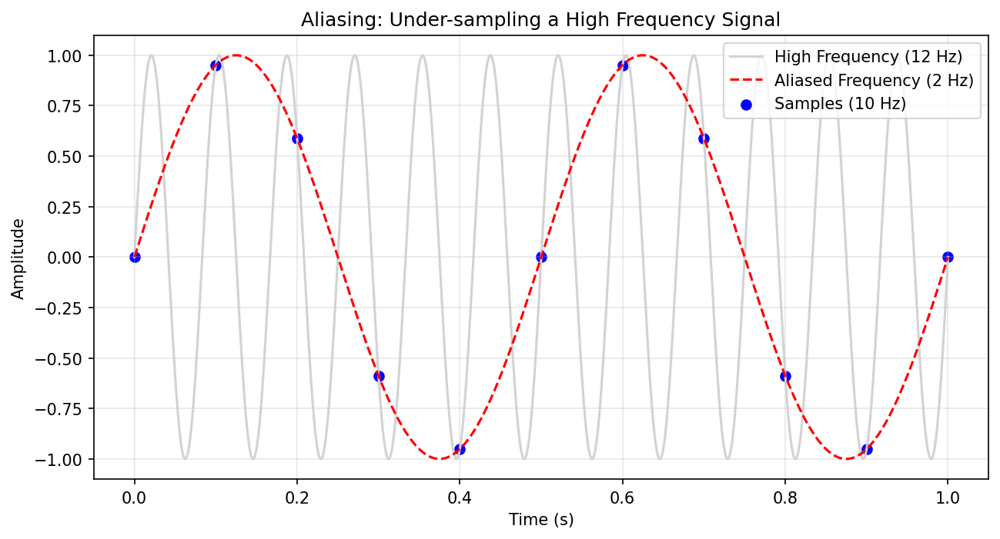
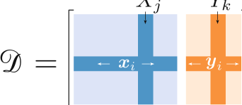
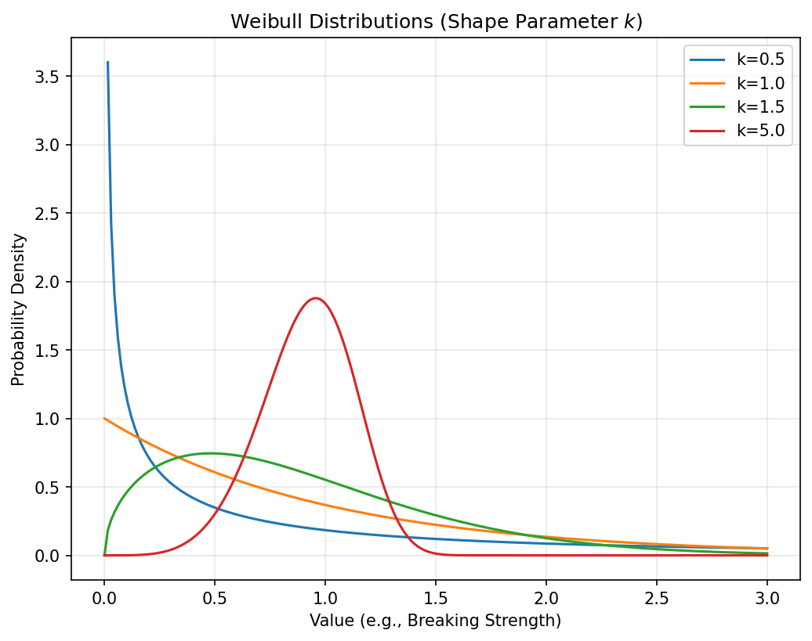
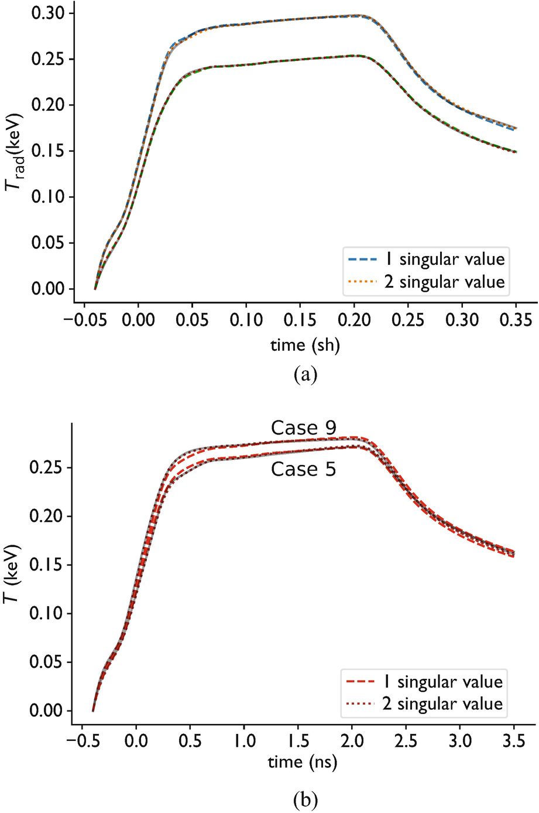
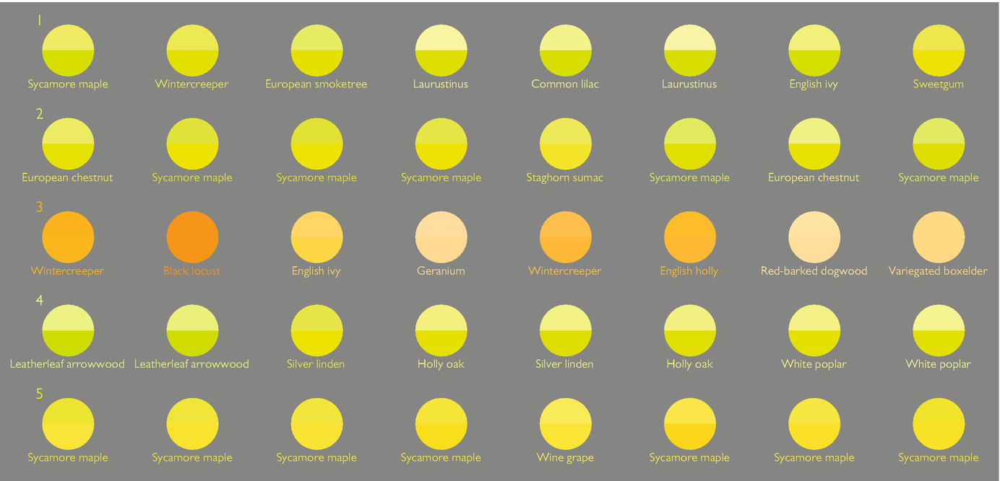
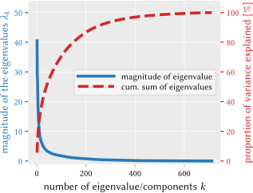

## 01. Welcome to Unit 2

### From Physical Sensing to Mathematical Representation

::: {.fragment}
**Today's Learning Journey:**

- How physical measurements become digital arrays
- The measurement chain: sampling, resolution, noise
- Mathematical representation of data
- Uncertainty types: aleatory vs. epistemic
- Dimensionality reduction: SVD and PCA
- Clustering and visualization
:::

::: {.notes}
Recap Unit 1 briefly (materials data is special). Today we go deeper: understanding the physics of how data is generated is crucial for choosing the right ML model.
:::

## 02. Learning Outcomes

By the end of this unit, you can:

::: {.fragment}
1. Describe the measurement chain from physical state to digital value
2. Apply the Nyquist-Shannon theorem to assess sampling adequacy
3. Distinguish aleatory from epistemic uncertainty
4. Perform PCA/SVD for dimensionality reduction
5. Interpret scree plots and choose the number of components
6. Use K-means and t-SNE for clustering and visualization
:::

::: {.notes}
These outcomes span theory and practice. The exercise will focus on hands-on PCA and clustering. Outcomes 1-3 are conceptual; 4-6 are computational.
:::

---

## {background-color="#1a1a2e"}

### Part 1: Signal & Image Formation {style="text-align: center; margin-top: 15%;"}

*Slides 03–12*

::: {.notes}
We start with the physics of measurement. Understanding how data is generated is the foundation for choosing appropriate ML models and priors.
:::

## 03. From Atoms to Bits

::: {.fragment}
- How do we get from a physical sample to a digital array?
- The **Measurement Chain**: physical phenomenon → sensor → digitization → data
- Signals are not "truth" — they are filtered, discretized, and noisy representations of reality
:::

::: {.callout-note}
Understanding the measurement chain is a prerequisite for choosing the right ML model.
:::

::: {.notes}
Set the stage: every number in your dataset went through a physical measurement process. That process introduces distortions, limitations, and noise. ML models that ignore this will fail.
:::

## 04. The Measurement as a Mapping

::: {.fragment}
- A measurement is a function $M: \mathcal{P} \rightarrow \mathcal{D}$ mapping physical states to data
- **Convolution**: The signal is often the true state convolved with the instrument's **Point Spread Function (PSF)**
:::

::: {.fragment}
$$I(\mathbf{r}) = [O * \text{PSF}](\mathbf{r}) + \eta$$

- $O$: the true object
- PSF: instrument response
- $\eta$: noise
:::

::: {.fragment}
*ML Task*: Can we "deconvolve" the instrument effects to recover $O$?
:::

::: {.notes}
This equation is fundamental. Every imaging modality (optical, electron, X-ray) can be described this way. The PSF encodes the physics of the instrument. Deconvolution is an inverse problem — we'll revisit this in Unit 9.
:::

## 05. Sensors as Transducers

::: {.fragment}
- Sensors convert physical stimuli into electrical/digital signals:
  - Photon intensity → pixel value (CCD/CMOS)
  - Electron scattering → diffraction pattern (TEM detector)
  - Temperature → voltage (thermocouple)
:::

::: {.fragment}
The mapping $f: \text{Physical State} \to \text{Digital Representation}$ is always **lossy**.
:::

::: {.notes}
Emphasize that no sensor is perfect. Every transduction step loses information. The question for ML is: what information survives, and what is lost? This determines what we can and cannot learn from the data.
:::

## 06. Continuous to Discrete: The Sampling Process

::: {.fragment}
- Physical signals are continuous; data is discrete
- Sampling: measuring at discrete points $\tau_i$
- Neuer's sampling formula [@neuer2024machine]:
:::

::: {.fragment}
$$x_i = \xi(\tau_i + \delta t) + u_x$$

- $\xi$: underlying physical truth
- $\delta t$: timing jitter/uncertainty
- $u_x$: amplitude noise
:::

::: {.notes}
This formula captures the two fundamental sources of measurement error: timing uncertainty (when exactly did we sample?) and amplitude noise (how accurate is the recorded value?). Both are unavoidable.
:::

## 07. Temporal and Spatial Sampling

::: {.fragment}
- **Sampling Rate** $\nu_S = 1/\Delta t$
- In characterization, sampling happens in multiple domains:
  - **Spatial**: Pixel pitch in microscopy
  - **Temporal**: Frame rate in in-situ experiments
  - **Spectral**: Energy resolution in EELS/EDS
:::

::: {.fragment}
**Question**: How fast / fine do we need to sample?
:::

::: {.notes}
This motivates the Nyquist theorem on the next slide. Students should think about their own instruments — what is the sampling rate, and is it sufficient?
:::

## 08. The Nyquist-Shannon Theorem

::: {.fragment}
To fully capture a signal with maximum frequency $\nu_{\max}$, we must sample at least twice as fast:

$$\nu_S \geq 2\nu_{\max}$$
:::

::: {.fragment}
- **Nyquist Frequency**: $\nu_{\text{Nyquist}} = \frac{1}{2}\nu_S$
- Frequencies above $\nu_{\text{Nyquist}}$ cannot be faithfully represented
- This is a **hard physical limit**, not a guideline
:::

::: {.callout-note}
Pixel size is what you choose; resolution is what the physics allows.
:::

::: {.notes}
The Nyquist theorem is one of the most important results in signal processing. Over-sampling wastes resources; under-sampling creates artifacts. Students should be able to calculate whether their sampling is adequate.
:::

## 09. Aliasing: When Resolution Fails

::: {.fragment}
- If $\nu_S < 2\nu_{\max}$, high-frequency components are "folded" into lower frequencies
- The signal appears to contain features that don't physically exist
- Example: Moiré patterns in TEM when grid resolution and crystal lattice interfere
:::

::: {.fragment}
{width=80%}
:::

::: {.fragment}
**ML Impact**: Your model might learn aliasing artifacts instead of real physical features!
:::

::: {.notes}
Show a visual example if possible. Moiré patterns are something materials students may have seen in TEM. The key point: garbage in, garbage out. If the data has aliasing artifacts, no amount of ML can recover the true signal.
:::

## 10. Physical Resolution Limits

::: {.fragment}
- **Optical/Electron diffraction** limits the finest resolvable feature
- **Point Spread Function (PSF)**: The response of an imaging system to a point source
- A sharp point becomes a blurred disk — the PSF encodes this blurring
:::

::: {.fragment}
- Blurring is a **physical prior** for convolutional models
- Knowing the PSF allows deconvolution (inverse problems, Unit 9)
:::

::: {.notes}
Connect PSF to the convolution equation from slide 04. The PSF is measurable — you can image a known point-like object. This measured PSF can then be used as a physics-informed prior in ML deconvolution.
:::

## 11. Jitter and Finite Rate of Innovation

::: {.columns}
::: {.column width="50%"}
::: {.fragment}
**Jitter** ($\delta t$):

- Timing uncertainty in our sampling clock
- Leads to phase noise in transient measurements
- Example: pump-probe experiments in ultrafast microscopy
:::
:::

::: {.column width="50%"}
::: {.fragment}
**Finite Rate of Innovation (FRI)**:

- If we have *prior knowledge* of signal structure (e.g., sum of $K$ pulses)
- We can sample **below Nyquist**!
- "Sparsity" in the physical process enables compressed sensing
:::
:::
:::

::: {.notes}
FRI is advanced but important conceptually. It shows that physics-informed sampling can break the Nyquist limit. This connects to compressed sensing and sparse recovery — active research areas in materials characterization.
:::

## 12. Part 1 Recap

::: {.fragment}
1. Measurements are **mappings** from physical states to data — always lossy
2. The **Nyquist theorem** sets a hard limit on sampling adequacy
3. **Aliasing** creates phantom features — check your sampling rate
4. The **PSF** encodes instrument physics — use it as a prior for ML
5. **Prior knowledge** about signal structure can relax sampling requirements
:::

::: {.notes}
Quick recap. Check for questions. The key message: understanding the measurement physics is not optional — it directly determines what ML can and cannot learn from your data.
:::

---

## {background-color="#1a1a2e"}

### Part 2: Mathematical Representation of Data {style="text-align: center; margin-top: 15%;"}

*Slides 13–22*

::: {.notes}
Now we formalize how to represent physical observations as mathematical objects that ML algorithms can work with.
:::

## 13. Notation Standards

::: {.fragment}
Following Sandfeld (2024) conventions [@sandfeld_materials_data_science]:

- **Scalars**: Italic Latin/Greek — $a$, $\lambda$
- **Vectors**: Lowercase bold — $\mathbf{x}$
- **Matrices**: Uppercase bold — $\mathbf{X}$
- **Indices**: Python starts at 0; mathematics often starts at 1
:::

::: {.notes}
Consistent notation matters. These conventions match the companion textbook and the MFML lecture. Warn students about the 0-vs-1 indexing difference between code and math.
:::

## 14. The Data Point $P$

::: {.fragment}
A single observation is a compound:

$$P = (\mathbf{x}, \mathbf{y})$$

- $\mathbf{x} \in \mathbb{R}^n$: **Input** variables (features)
- $\mathbf{y} \in \mathbb{R}^k$: **Output** variables (targets)
:::

::: {.fragment}
Example: One tensile test sample

- $\mathbf{x}$: composition (C, Mn, Si, ...), processing (temperature, time)
- $\mathbf{y}$: yield strength, elongation at break
:::

::: {.notes}
This is the fundamental unit of supervised learning. Every sample in our dataset is one $(x, y)$ pair. Features are what we measure; targets are what we want to predict.
:::

## 15. The Feature Matrix $\mathbf{X}$ (Design Matrix)

::: {.fragment}
- $m$ rows: **Observations** (samples, instances)
- $n$ columns: **Features** (variables, attributes)
- Element $x_{i,j}$: the $j$-th feature of the $i$-th observation
:::

::: {.fragment}
$$\mathbf{X} = \begin{pmatrix} x_{1,1} & x_{1,2} & \cdots & x_{1,n} \\ x_{2,1} & x_{2,2} & \cdots & x_{2,n} \\ \vdots & & \ddots & \vdots \\ x_{m,1} & x_{m,2} & \cdots & x_{m,n} \end{pmatrix}$$
:::

::: {.notes}
The design matrix is the standard input format for ML. Rows are samples, columns are features. This convention is used everywhere — scikit-learn, PyTorch, TensorFlow. Make sure students internalize rows = samples.
:::

## 16. Tabular Data in Practice

::: {.fragment}
{width=80%}
:::

::: {.fragment}
- **Features** are column vectors $\mathbf{X}_j$ (one measurement type across all samples)
- **Observations** are row vectors $\mathbf{x}_i$ (all measurements for one sample)
- The target matrix $\mathbf{Y}$ has the same number of rows as $\mathbf{X}$
:::

::: {.notes}
Show a concrete example: a table where rows are steel samples and columns are composition elements, processing parameters, and mechanical properties. This is what students will work with in the exercise.
:::

## 17. Python Implementation

::: {.fragment}
```python
import numpy as np
import pandas as pd

# Creating a feature matrix
X = np.array([[0.1, 850, 30],    # Sample 1: C%, Temp, Time
              [0.2, 900, 45],    # Sample 2
              [0.15, 875, 35]])  # Sample 3

# Accessing data
X[0, :]    # First sample (all features)
X[:, 1]    # Second feature (all samples) = temperatures
```
:::

::: {.fragment}
```python
# Using Pandas for labeled data
df = pd.DataFrame(X, columns=["C_pct", "Temp_C", "Time_min"])
df["Yield_MPa"] = [350, 420, 380]  # Target variable
```
:::

::: {.notes}
Live demo if time permits. Show how to load a CSV, inspect with df.describe(), and plot with df.plot.scatter(). Pandas makes EDA much easier than raw NumPy.
:::

## 18. Think About This: Feature Design

::: {.fragment}
**Question**: You have SEM images (1024×1024 pixels) of 50 microstructures. How do you create a feature matrix $\mathbf{X}$?

- (A) Each pixel is a feature → $\mathbf{X}$ is $50 \times 1{,}048{,}576$
- (B) Extract grain size, porosity, phase fraction → $\mathbf{X}$ is $50 \times 3$
- (C) Use a CNN to learn features automatically
:::

::: {.fragment}
**Answer**: All three are valid! (A) is high-dimensional and sparse. (B) uses domain knowledge. (C) learns features end-to-end. The right choice depends on data size and task.
:::

::: {.notes}
Pause for discussion. This connects to the curse of dimensionality. Option A has a million features but only 50 samples — classic overfitting risk. Option B is parsimonious but requires domain expertise. Option C needs enough data for the CNN.
:::

## 19. Expected Value and Mean

::: {.fragment}
$$\mu = E(x) = \sum_i x_i \, p(x_i)$$

- The **expected value** weights outcomes by their probability
- With uniform sampling: $\mu = \frac{1}{N}\sum_{i=1}^N x_i$ (arithmetic mean)
:::

::: {.fragment}
The mean is the simplest summary statistic — but it can be misleading for skewed or multi-modal distributions.
:::

::: {.notes}
Review this quickly — students know means. The point is that the mean assumes unimodal, symmetric distributions. For materials data (which is often skewed), the median may be more informative.
:::

## 20. Variance: The Spread of Data

::: {.fragment}
$$\sigma^2 = \text{Var}(\mathbf{x}) = \frac{1}{N}\sum_{i=1}^N (x_i - \mu)^2$$

- Measures fluctuation around the mean
- **In ML**: We want to distinguish "physical variance" (information) from "noise variance" (nuisance)
:::

::: {.fragment}
High variance in your target variable is good — it means there's something to learn. High variance in your predictions is bad — it means your model is unstable.
:::

::: {.notes}
Connect variance to the bias-variance tradeoff (covered in MFML). In materials: if all your samples have the same hardness, there's nothing to predict. You need variance in the target to build a useful model.
:::

## 21. Higher Moments: Skewness & Kurtosis

::: {.columns}
::: {.column width="50%"}
::: {.fragment}
**Skewness** — Asymmetry:

- $\gamma_1 = 0$: symmetric (Gaussian)
- $\gamma_1 > 0$: right-skewed (long right tail)
- $\gamma_1 < 0$: left-skewed
:::
:::

::: {.column width="50%"}
::: {.fragment}
**Kurtosis** — Tail weight:

- $\kappa = 3$: Gaussian reference
- $\kappa > 3$: heavy tails (leptokurtic)
- $\kappa < 3$: light tails (platykurtic)
:::
:::
:::

::: {.fragment}
**Materials relevance**: Failure statistics (Weibull) are often heavily skewed. Ignoring skewness leads to wrong confidence intervals.
:::

::: {.notes}
These are useful for characterizing noise distributions. If your residuals are skewed, your model has a systematic bias. If they have heavy tails, outliers are more likely than a Gaussian would predict.
:::

## 22. Covariance and Correlation

::: {.fragment}
**Covariance Matrix** $\mathbf{C}$: How features change together

$$\text{Cov}(X, Y) = E[(X - \mu_X)(Y - \mu_Y)]$$
:::

::: {.fragment}
**Correlation Coefficient**: Normalized to $[-1, 1]$

$$r_{XY} = \frac{\text{Cov}(X,Y)}{\sigma_X \sigma_Y}$$
:::

::: {.fragment}
*Materials Example*: Do high cooling rates always correlate with smaller grains? Plot it and check!
:::

::: {.notes}
The covariance matrix is the foundation for PCA (coming in Part 4). Correlation matrices are the first thing to look at in EDA — they reveal redundant features and unexpected relationships.
:::

---

## {background-color="#1a1a2e"}

### Part 3: Uncertainty & Stochasticity {style="text-align: center; margin-top: 15%;"}

*Slides 23–30*

::: {.notes}
Uncertainty is not just "error bars." Different types of uncertainty require different responses. This section formalizes the distinction.
:::

## 23. Every Measurement is a Random Variable

::: {.fragment}
- Data is a **Stochastic Process** [@neuer2024machine]
- Every measurement is one realization of a random variable
- Repeat the experiment → you get a different number each time
:::

::: {.fragment}
**Laplace Probability**: $P(A) = \frac{\text{favorable outcomes}}{\text{possible outcomes}}$

In the lab, we repeat measurements to "see" the underlying distribution.
:::

::: {.notes}
Ground this in lab reality. Students take three hardness measurements and average them. Why? Because each measurement is a sample from a distribution. We want the distribution's mean, not any single realization.
:::

## 24. Aleatory Uncertainty (Statistical)

::: {.fragment}
- Inherent randomness (Latin *alea* = dice)
- Examples:
  - **Shot noise**: discrete photon/electron counting
  - **Thermal fluctuations**: Johnson-Nyquist noise
  - **Radioactive decay**: counting statistics
:::

::: {.fragment}
**Key property**: Cannot be reduced by collecting more data or using a better model. It is a fundamental property of the physical system.
:::

::: {.notes}
Aleatory uncertainty is irreducible. No matter how good your detector or how many measurements you take, the underlying randomness remains. You can characterize it (measure the variance) but not eliminate it.
:::

## 25. Epistemic Uncertainty (Systematic/Model)

::: {.fragment}
- Uncertainty from "lack of knowledge"
- Examples:
  - **Small dataset**: not enough samples to learn the true relationship
  - **Model bias**: wrong functional form
  - **Limited precision**: instrument calibration errors
:::

::: {.fragment}
**Key property**: *Can* be reduced by better models, more data, or improved instruments.
:::

::: {.callout-note}
Distinguishing aleatory from epistemic uncertainty tells you whether to collect more data (epistemic) or accept the noise floor (aleatory).
:::

::: {.notes}
This distinction is actionable. If your model's uncertainty is mostly epistemic, collect more data or use a better model. If it's mostly aleatory, you've hit the physical noise floor — no improvement is possible without changing the measurement technique.
:::

## 26. Physical Noise Model: Gaussian

::: {.fragment}
$$p(x) = \frac{1}{\sqrt{2\pi\sigma^2}} \exp\left(-\frac{(x-\mu)^2}{2\sigma^2}\right)$$

- Universal model for the sum of many random disturbances (**Central Limit Theorem**)
- Thermal noise in electronics, background noise in spectroscopy
:::

::: {.fragment}
**Why it matters for ML**: Many loss functions (MSE) implicitly assume Gaussian noise. If your noise is *not* Gaussian, MSE is the wrong loss!
:::

::: {.notes}
The Gaussian is the default assumption in ML. This is often correct (CLT) but not always. Poisson noise at low counts and Weibull for failures are important exceptions in materials science.
:::

## 27. Physical Noise Model: Poisson

::: {.fragment}
$$p(x) = \frac{\lambda^x}{x!} e^{-\lambda}$$

- Counting statistics for rare, discrete events
- **Mean = Variance = $\lambda$**
- Example: electron counts in TEM, photon counts in X-ray spectroscopy
:::

::: {.fragment}
**Key insight**: At low counts ($\lambda < 20$), Poisson looks nothing like Gaussian. Using MSE loss on Poisson data is wrong — use Poisson negative log-likelihood instead.
:::

::: {.notes}
This is critically important for electron microscopy and spectroscopy. At high counts, Poisson → Gaussian (CLT again). But low-dose imaging lives in the Poisson regime. Several students will work with this type of data.
:::

## 28. Physical Noise Model: Weibull

::: {.fragment}
- Models failure and defect statistics in materials
- Heavily **skewed** — captures "early failures" and "wear-out"
- Parameters: shape $k$ (controls skewness) and scale $\lambda$ (characteristic life)
:::

::: {.fragment}
{width=80%}
:::

::: {.fragment}
Used in: fatigue life prediction, ceramic strength statistics, reliability engineering.
:::

::: {.notes}
Weibull is less familiar to students but very important in materials engineering. If you're predicting failure times or strength distributions, Gaussian assumptions are wrong. The Weibull shape parameter tells you about the failure mechanism.
:::

## 29. Bayes' Theorem in Characterization

::: {.fragment}
$$P(\text{State} | \text{Data}) = \frac{P(\text{Data} | \text{State}) \cdot P(\text{State})}{P(\text{Data})}$$
:::

::: {.fragment}
- **Prior** $P(\text{State})$: What physics tells us before measurement
- **Likelihood** $P(\text{Data} | \text{State})$: The noise model (Gaussian, Poisson, ...)
- **Posterior** $P(\text{State} | \text{Data})$: Updated belief after measurement
:::

::: {.fragment}
Physics provides the **prior**. The measurement provides the **likelihood**. Bayes combines them optimally.
:::

::: {.notes}
This is the mathematical framework for combining physics and data — the formal version of "grey-box modeling." Students will see this in MFML Unit 8. Here, just build intuition: prior knowledge + new evidence = updated belief.
:::

## 30. Part 3 Recap

::: {.fragment}
1. Every measurement is a **realization of a random variable**
2. **Aleatory** uncertainty is irreducible; **epistemic** is reducible
3. **Gaussian** noise → MSE loss. **Poisson** noise → Poisson loss
4. **Weibull** captures failure statistics (not bell-shaped!)
5. **Bayes' theorem** is the formal way to combine physics and data
:::

::: {.notes}
Key message: noise is not just "error" — it contains information about the physical process. Choosing the right noise model determines the right loss function and ultimately the quality of your ML model.
:::

---

## {background-color="#1a1a2e"}

### Part 4: Dimensionality Reduction {style="text-align: center; margin-top: 15%;"}

*Slides 31–45*

::: {.notes}
The longest and most technical section. We go from the curse of dimensionality to the practical tools (SVD/PCA) that solve it.
:::

## 31. The Curse of Dimensionality

::: {.fragment}
- Experimental data is high-dimensional:
  - 1D Spectrum: 2048 channels
  - 2D Image: $1024 \times 1024 \approx 10^6$ dimensions
  - 4D-STEM dataset: $10^8$ values per scan
:::

::: {.fragment}
- Most of this space is **empty**
- Materials data usually lies on a **low-dimensional manifold**
- **Finding this manifold is the key to making ML work**
:::

::: {.notes}
Revisit the curse from Unit 1 but now with concrete numbers. A single micrograph is a point in million-dimensional space. But microstructures don't fill that space randomly — they're constrained by physics to a much smaller subspace.
:::

## 32. The Covariance Matrix as a Geometric Object

::: {.fragment}
$$\mathbf{C} = \frac{1}{N}\mathbf{X}^T\mathbf{X}$$

- A $n \times n$ matrix encoding feature relationships
- The **eigenvectors** of $\mathbf{C}$ are the principal axes of the data cloud
- The **eigenvalues** give the variance along each axis
:::

::: {.fragment}
```{mermaid}
graph LR
    D["Data Cloud<br>(high-dim)"] --> C["Covariance Matrix<br>C = X'X/N"]
    C --> EV["Eigenvectors<br>(directions)"]
    C --> EL["Eigenvalues<br>(variances)"]
```
:::

::: {.notes}
This connects the statistical concepts (covariance) to geometry (principal axes). The covariance matrix tells us how the data is oriented in feature space. Its eigenvectors point along the directions of maximum spread.
:::

## 33. Singular Value Decomposition (SVD)

::: {.fragment}
The "engine" of linear algebra:

$$\mathbf{X} = \mathbf{U} \mathbf{S} \mathbf{V}^T$$

- $\mathbf{U}$: Left singular vectors — patterns across **samples** ($m \times m$)
- $\mathbf{S}$: Singular values — **importance** of each pattern (diagonal)
- $\mathbf{V}^T$: Right singular vectors — patterns across **features** ($n \times n$)
:::

::: {.notes}
SVD is the numerical algorithm behind PCA, low-rank approximation, and many other methods. Students should think of it as "factoring" a data matrix into its most important components. The singular values tell you how important each component is.
:::

## 34. Rank and Structure

::: {.fragment}
- **Rank** of a matrix = number of non-zero singular values
- Reveals the number of *truly independent* variables
- A rank-3 dataset of 1000 features has only 3 degrees of freedom!
:::

::: {.fragment}
**Materials insight**: If your 2048-channel spectrum has rank ~5, only 5 independent spectral components are present. The rest is noise or linear combinations.
:::

::: {.notes}
This is a powerful insight. Real data is almost always approximately low-rank. The rank tells you the intrinsic dimensionality of your data — this is the manifold dimension we're looking for.
:::

## 35. Principal Component Analysis (PCA)

::: {.columns}
::: {.column width="55%"}
::: {.fragment}
Finding the coordinate system that **maximizes captured variance**:

1. **Mean centering**: $\bar{\mathbf{X}} = \mathbf{X} - \boldsymbol{\mu}$
2. **SVD**: $\bar{\mathbf{X}} = \mathbf{U}\mathbf{S}\mathbf{V}^T$
3. **Project**: $\mathbf{Z} = \bar{\mathbf{X}}\mathbf{V}_k$ (keep top $k$ components)
:::
:::

::: {.column width="45%"}
```{mermaid}
graph TD
    X["Raw Data X<br>(m × n)"] --> C["Center:<br>X - μ"]
    C --> SVD["SVD:<br>U S V'"]
    SVD --> S["Scree Plot<br>Choose k"]
    S --> Z["Projected Data Z<br>(m × k)"]
```
:::
:::

::: {.fragment}
PCA components are **orthogonal** — each captures information not in the others.
:::

::: {.notes}
PCA is the most used dimensionality reduction technique in materials science. The three steps are simple and students should be able to implement them from scratch. Emphasize centering — PCA without centering gives wrong results.
:::

## 36. SVD vs. PCA: What's the Difference?

::: {.fragment}
- **SVD** is the numerical algorithm: works on any matrix
- **PCA** is the statistical concept: SVD applied to **centered** data
- Connection: PCA eigenvalues = (singular values)² / (N-1)
:::

::: {.fragment}
In practice: just use `sklearn.decomposition.PCA` or `np.linalg.svd` — both work.
:::

::: {.notes}
Students often confuse SVD and PCA. Keep it simple: PCA = center your data, then do SVD. The mathematical relationship is clean but the practical difference is just one line of code (subtracting the mean).
:::

## 37. Maximizing Variance: Why?

::: {.fragment}
- Spreading data out along principal axes **preserves the most information**
- First PC: direction of greatest variability
- Second PC: direction of greatest variability **orthogonal** to the first
- And so on...
:::

::: {.fragment}
{width=80%}
:::

::: {.notes}
Draw this on the board: a 2D scatter plot with the PCA axes. The first PC goes along the "long axis" of the data ellipse. The second PC goes perpendicular. This geometric intuition is key.
:::

## 38. The Scree Plot: How Many Components?

::: {.fragment}
- Plot singular values (or squared singular values) in descending order
- **The "Elbow"**: where signal ends and noise begins
- Fraction of variance explained: $m_\ell = \frac{\sum_{n=1}^{\ell} s_n^2}{\sum_{n=1}^{N} s_n^2}$
:::

::: {.fragment}
**Rule of thumb**: Keep enough components to explain 90-95% of variance. But always check what the components mean physically!
:::

::: {.notes}
The scree plot is the primary diagnostic tool for PCA. Show a real example. The elbow is often clear, but sometimes it's ambiguous. In that case, domain knowledge helps: if component 6 corresponds to a known physical mode, keep it.
:::

## 39. Interpreting PCA Components in Materials

::: {.fragment}
PCA components often correspond to physical modes:

- **Component 1**: Overall intensity (thickness/density variation)
- **Component 2**: Primary chemical shift or grain rotation
- **Component 3**: Secondary phase appearance
:::

::: {.fragment}
**Warning**: PCA components are mathematical, not physical. They may mix multiple physical effects. Interpret with caution.
:::

::: {.notes}
This is where domain knowledge enters. PCA gives you orthogonal directions — but physics doesn't have to be orthogonal. Two physical effects may be mixed in a single PCA component, or spread across several. Always validate against known physics.
:::

## 40. Case Study 1: Time Series Reduction

::: {.fragment}
**McClarren's Hohlraum Example** [@mcclarren2021machine]:

- 30 time-point laser pulse profiles → 2 principal components
- **PC1** = overall scale (pulse height)
- **PC2** = plateau timing (when the pulse peaks)
- Captures **83% of variance** with only 2 variables!
:::

::: {.fragment}
{width=80%}
:::

::: {.notes}
This is a beautiful example. 30 dimensions compressed to 2 with minimal loss. The two PCs have clear physical interpretations. Students should try to find similar structure in their own data.
:::

## 41. Case Study 2: Hyperspectral Imaging

::: {.fragment}
**McClarren's Foliage Example** [@mcclarren2021machine]:

- 2051 wavelengths per pixel → 4 principal components
- Identifying **distressed vs. healthy** vegetation
- PCA uncovers spectral structure that visible light alone misses
:::

::: {.fragment}
{width=80%}
:::

::: {.notes}
This shows PCA as an EDA tool. By projecting 2051-dimensional spectra into 4D PC space, we can visualize clusters and separate healthy from stressed plants. The same approach works for EDS/EELS hyperspectral data in materials.
:::

## 42. PCA on Images: Eigen-Microstructures

::: {.fragment}
- Flatten 2D images into 1D vectors
- Stack into a matrix: each row is one image
- Apply PCA → "Eigenfaces" / "Eigenmicrostructures"
:::

::: {.fragment}
- Most images are "rare" in high-dimensional space
- They occupy a small **manifold** defined by physics
- PCA finds the linear approximation of this manifold
:::

::: {.fragment}
**Limitation**: PCA is **linear**. It cannot handle rotations, deformations, or complex nonlinear structures efficiently.
:::

::: {.notes}
Eigenfaces are a classic example. For materials: eigenmicrostructures capture the dominant morphological variations across a set of micrographs. But nonlinear methods (autoencoders, covered later) are often needed for complex microstructures.
:::

## 43. PCA for Noise Removal

::: {.fragment}
**Reconstruct** using only the top $k$ components:

$$\mathbf{X}_{\text{clean}} \approx \mathbf{U}_k \mathbf{S}_k \mathbf{V}_k^T$$

- Discards small singular values → removes noise
- Physical peaks are preserved; random noise is suppressed
:::

::: {.fragment}
**Danger**: Rare but real physical events (e.g., a single defect) may have small singular values and get discarded!
:::

::: {.notes}
PCA denoising is widely used in EELS and EDS hyperspectral data. It works well for statistically common features but can erase rare events. Always compare denoised and original data to check for information loss.
:::

## 44. Standardizing Data Before PCA

::: {.fragment}
- PCA is **sensitive to the scale of features**
- Feature A in [0, 1] vs. Feature B in [0, 1000] → PCA dominated by B
- **Always** center (subtract mean) and optionally standardize (divide by std)
:::

::: {.fragment}
```python
from sklearn.preprocessing import StandardScaler
X_scaled = StandardScaler().fit_transform(X)
# Now each feature has mean=0, std=1
```
:::

::: {.notes}
This is a common pitfall. Students forget to standardize and get PCA components dominated by the feature with the largest numerical range. Centering is mandatory; standardization is recommended when features have different units.
:::

## 45. Part 4 Recap

::: {.fragment}
1. High-dimensional data lives on a **low-dimensional manifold**
2. **SVD** factorizes data into patterns and their importance
3. **PCA** = SVD on centered data → maximizes preserved variance
4. **Scree plots** tell you how many components to keep
5. PCA components may (or may not) correspond to physical modes
6. PCA is **linear** — nonlinear methods exist for complex structures
:::

::: {.notes}
Dimensionality reduction is foundational for everything that follows. PCA appears in nearly every materials ML pipeline. Students should be comfortable implementing it and interpreting the results.
:::

---

## {background-color="#1a1a2e"}

### Part 5: Clustering & Visualization {style="text-align: center; margin-top: 15%;"}

*Slides 46–50*

::: {.notes}
Final section. We use the reduced-dimensional representations from PCA to find natural groupings and visualize structure in the data.
:::

## 46. K-Means Clustering

::: {.fragment}
- **Unsupervised**: Find $K$ natural groupings in the data
- Minimize the within-cluster sum of squares:

$$L = \sum_{k=1}^{K} \sum_{\mathbf{x}_i \in C_k} \|\mathbf{x}_i - \boldsymbol{\mu}_k\|^2$$
:::

::: {.fragment}
- Initialize $K$ centroids → Assign points → Update centroids → Repeat
- Simple, fast, but requires choosing $K$ in advance
:::

::: {.notes}
K-means is the simplest clustering algorithm. It works well in PCA space (low-dimensional, approximately Gaussian clusters). The main challenge is choosing K — addressed on the next slide.
:::

## 47. Choosing $K$: The Elbow Method

::: {.fragment}
- Plot loss $L$ vs. number of clusters $K$
- **The elbow**: where adding more clusters yields diminishing returns
- Similar concept to the PCA scree plot
:::

::: {.fragment}
{width=80%}
:::

::: {.fragment}
**Materials example**: K-means on EDS spectra → automatically identifying phases without manual labeling.
:::

::: {.notes}
The elbow method is heuristic — sometimes the elbow is ambiguous. Alternative: silhouette score. In materials, you often have prior knowledge about the expected number of phases, which helps constrain K.
:::

## 48. t-SNE: Visualizing High-Dimensional Data

::: {.fragment}
**t-Distributed Stochastic Neighbor Embedding**:

- Maps high-dimensional data to 2D/3D for **visualization**
- Preserves **local structure** (neighbors stay neighbors)
- Does NOT preserve global distances
:::

::: {.fragment}
```{mermaid}
graph LR
    HD["High-Dim Space<br>(1000+ dims)"] -- "Gaussian<br>similarities" --> P["Probability<br>Matrix (high-D)"]
    P -- "Minimize KL<br>divergence" --> Q["t-Distribution<br>similarities (2D)"]
    Q --> VIS["2D/3D<br>Visualization"]
```
:::

::: {.notes}
t-SNE is the go-to visualization tool for high-dimensional data. But warn students: t-SNE is for visualization only — not for downstream ML. The distances in the 2D plot are not meaningful. Cluster sizes and gaps can be misleading.
:::

## 49. Why the "t"? Heavy Tails for Better Separation

::: {.fragment}
- In high-dim: Use **Gaussian** (normal) for neighborhood probabilities
- In low-dim: Use **Cauchy/t-distribution** (heavy tails)
- Heavy tails "push" dissimilar clusters apart → better visual separation
:::

::: {.fragment}
**Fashion MNIST example** [@mcclarren2021machine]:

- 28×28 pixel images of clothing → 784 dimensions
- t-SNE reveals clear "islands" of T-shirts, shoes, dresses, etc.
- Structure discovered purely from pixel values — no labels needed!
:::

::: {.notes}
Show the Fashion MNIST t-SNE plot if possible. The "archipelago" structure is striking. Materials analogue: apply t-SNE to a set of micrographs and see if microstructure types separate naturally.
:::

## 50. Unit 2 Summary & Next Steps

::: {.fragment}
**Key Takeaways:**

1. Signals are physical mappings → understand the **PSF**
2. Noise has a distribution → use it as a **prior** for your loss function
3. High dimensionality is a mask → use **PCA/SVD** to find the structure
4. **K-means** and **t-SNE** reveal natural groupings without labels
:::

::: {.fragment}
**Reading:**

- McClarren (2021): Ch. 4 (PCA and Data Reduction) [@mcclarren2021machine]
- Neuer (2024): Ch. 2 (Mathematical description of data) [@neuer2024machine]
- Sandfeld (2024): Ch. 5, 8, 15 [@sandfeld_materials_data_science]
:::

::: {.fragment}
**Next Week**: Unit 3 — Data Quality and Leakage
:::

::: {.notes}
Summarize the four takeaways. Point to the reading assignments. Preview Unit 3: we'll address the practical question of ensuring data quality before modeling — cleaning, leakage detection, and train/test splitting.
:::

---

## References

::: {#refs}
:::
