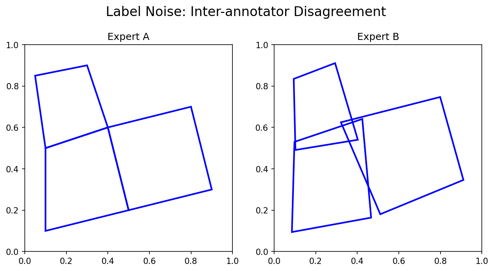

## 01. Where We Are

::: {.columns}
::: {.column width="50%"}
**Recap — Units 1 & 2**

- *Unit 1:* materials data is small, expensive, hierarchical, and probe-dependent.
- *Unit 2:* the measurement chain $\xi(t)\rightarrow x_i$ — every datum is a sample of a physical process plus noise.
:::
::: {.column width="50%"}
**Today — Unit 3**

The data has arrived in your computer. **What now?**

- It is messy, mis-scaled, partly missing, and inconsistently labelled.
- Before any model: clean, transform, validate.
- Before believing any score: rule out leakage.
:::
:::

::: {.notes}
**Position the unit.** Unit 1 told us *what* materials data looks like, Unit 2 told us *how* it
is generated by a physical sensing chain. Unit 3 is where we close the gap between the raw
file the instrument hands us and the well-behaved tensor a model can train on. It is also
the unit where students learn the discipline that separates a publishable result from a
spurious one.

**Set expectations.** Preprocessing and validation are unglamorous. They are also where
80% of project time goes in industry, and where almost all of the "ML doesn't work for our
data" stories actually originate. Tell students explicitly: this is the unit that will save
their thesis.

**Connect to later units.** The skills from today reappear in:
- Unit 6 (transfer learning — when scarce data forces clever validation)
- Unit 7 (time series — temporal leakage, triggering)
- Unit 8 (generalization & robustness — group splits, distribution shift)
- Unit 12 (uncertainty / GPs — Bayesian posteriors first introduced today)
:::

## 02. Learning Outcomes

By the end of this lecture, you will be able to:

::: {.fragment}
1. **Diagnose** common data-quality problems (missing values, outliers, duplicates, scale mismatch) and choose appropriate repair strategies.
2. **Apply** standard transformations — centering, standardization, log, differentiation, FFT, wavelet — and explain *why* each is needed for a given algorithm.
3. **Distinguish** noise outliers from rare physical events using domain knowledge.
4. **Quantify** label uncertainty (inter-annotator variance, soft labels) and explain the Bayesian prior–likelihood–posterior view.
5. **Design** robust validation (k-fold, stratified, group-based, time-aware) that prevents data leakage.
6. **Choose** the right error metric for a regression or classification task in materials science (MAE/RMSE/$R^2$ vs. precision/recall/IoU/Dice).
:::

::: {.notes}
**Bloom mapping.** Outcomes 1, 2, 5, 6 are at the *apply* / *analyse* level — students
should be able to walk into a project and execute. Outcomes 3 and 4 are at the *evaluate*
level: judging whether a thing is an artifact or signal, deciding whether labels are
trustworthy.

**Assessment hook.** Tell students which exercises in the problem set map onto which
outcome. Outcome 5 is heavily exam-relevant — leakage is the most common reason published
ML papers in materials science fail to reproduce.
:::

## 03. The Running Headline — GIGO

::: {.columns}
::: {.column width="55%"}
> "On two occasions I have been asked, 'Pray, Mr. Babbage, if you put into the machine wrong figures, will the right answers come out?' I am not able rightly to apprehend the kind of confusion of ideas that could provoke such a question."
> — Charles Babbage, 1864

**Garbage In, Garbage Out (GIGO):** model accuracy is bounded by *data* quality before any architectural choice.
:::
::: {.column width="45%"}
A representative materials-science failure mode:

- A CNN trained on TEM images of nanoparticles reports **94% accuracy**.
- It actually learned to detect the *carbon-grid pattern* — present in 94% of "particle" images and 0% of "no-particle" images.
- No architecture fix would have helped. Only **data hygiene** would.
:::
:::

::: {.notes}
**The hook.** Open with the Babbage quote — students enjoy it, and it sets the tone that
this is a centuries-old discipline, not a new ML annoyance. Then drop the carbon-grid
example. This is a true family of failures (the "Husky vs Wolf"–style shortcut, transferred
to TEM).

**Drive home the asymmetry.** Spending another week on hyperparameter search will not
recover from a data leak. Spending an hour on data cleaning often turns a 60% model into
a 90% model. Make the implicit ROI argument explicit.

**Connect forward.** When we discuss explainability and saliency maps in later units,
the carbon-grid story comes back as Exhibit A for *why* you need attribution methods to
catch silent failures.
:::

## 04. The ML Workflow Through Today's Lens

::: {.columns}
::: {.column width="50%"}
**The classical pipeline (CRISP-DM, Unit 1):**

1. Data **collection** — Unit 2.
2. Data **preprocessing** — *today, §1–§3*.
3. **Model** training — Units 4–7.
4. **Validation** — *today, §4–§5*.
5. **Deployment** & monitoring.

Steps 2 and 4 typically dominate calendar time on real projects.
:::
::: {.column width="50%"}
**Today's structure**

- §1 Cleaning *(≈14 min)*
- §2 Transformations & scaling *(≈22 min)*
- §3 Labels & uncertainty *(≈9 min)*
- §4 Bias–variance & regularization *(≈8 min)*
- §5 Validation & leakage *(≈14 min)*
- §6 Error metrics *(≈12 min)*

Three short *think-pair-share* checkpoints along the way.
:::
:::

::: {.notes}
**Signposting.** Students orient much better when they know the shape of the lecture.
Promise the breaks (active-learning slides) so they pace their attention.

**Time-honesty.** The transformations section is the longest because it has the most
formula content and a worked example. The validation section is the most exam-relevant.
The cleaning section is short but conceptually dense.
:::

# §1 · Data Cleaning {.section}

## 05. The Measurement Chain — Where Errors Enter

::: {.columns}
::: {.column width="50%"}
$$
\underbrace{\xi(\tau)}_{\text{physical state}}
\;\to\; \text{probe} \;\to\; \text{detector} \;\to\;
\underbrace{\text{ADC} \;\to\; \text{file}}_{\text{digital}}
\;\to\; \mathbf{x}
$$

Errors can enter at **every link**:

- *Sensor:* drift, saturation, dead pixels, dark current.
- *Transmission:* dropped packets, timestamp skew.
- *Storage:* wrong dtype, units lost in the header.
- *Human:* transposed columns, mis-labelled batches.
:::
::: {.column width="50%"}
**Strategy:** *clean at the source first* [@neuer2024machine, §3.2.1].

- A bad sensor produces bad data forever.
- Digital "repair" *interpolates* — it cannot recover information that was never recorded.
- Always document *where* in the chain a fix was applied: it changes how downstream models should interpret the data.
:::
:::

::: {.notes}
**Anchor in Unit 2.** Remind students the measurement chain $x_i = \xi(\tau_i + \delta t) + u_x$
introduced in Unit 2 — today we deal with the residual that survives that chain plus
purely digital pathologies (typos, NaNs, duplicates).

**The "source first" principle.** Worked example: a thermocouple reading $-1273\,°\mathrm{C}$
because the lead wire broke. Two responses: (a) drop the row in pandas — fast, but the
broken wire keeps producing bad rows tomorrow; (b) replace the wire — slow, but solves the
class of failures. Industrial ML practice strongly prefers (b). Where (b) is impossible
(legacy data, sealed instrument, archival), document the digital repair so a reader can
recompute without it.

**Why explainability cares.** If you imputed missing values with column means, every
post-hoc explanation tool will see those imputed rows as "typical" — masking exactly the
samples that were anomalous in reality.
:::

## 06. Six Failure Modes You Will Meet

::: {.columns}
::: {.column width="50%"}
1. **Structural problems** — typos, mixed units (hPa vs kPa), wrong delimiters, mixed date formats.
2. **Duplicates** — repeated frames in a video, the same DOE point recorded twice.
3. **Irrelevant observations** — pre-experiment baseline still in the file.
:::
::: {.column width="50%"}
4. **Missing values (NaN)** — sensor drop, out-of-range, transmission loss.
5. **Outliers** — point, contextual, collective (next slide).
6. **Mislabelled rows** — class flipped, sample ID lost, condition swapped.
:::
:::

**Most of these are caught only by *visualizing* the data.** Always plot before fitting.

::: {.notes}
**Practical advice.** Open the dataset in pandas, run `df.describe()`, `df.info()`, and a
small grid of histograms / scatter plots *before* any modelling. The single most effective
"ML technique" in industry is matplotlib.

**War story.** A common failure: column dtypes silently coerced — temperatures read as
strings, sorted lexicographically ("100" < "20"). The model trains, predicts, and ships
nonsense. `df.dtypes` catches it in two seconds.

**Materials-specific pitfalls.** Mixed units across instruments (kV vs V, Pa vs MPa);
sample IDs encoded as integers that get auto-converted to scientific notation in Excel
(yes, this is still a problem); time stamps with and without timezone.
:::

## 07. Missing Values — Repair Options

::: {.columns}
::: {.column width="50%"}
**Where do NaNs come from?**

- Sensor saturation or dropout.
- Transmission gap (Bluetooth / Wi-Fi).
- Out-of-range readings ("$-1273\,°\mathrm{C}$" stored as NaN by the driver).
- Pandas re-indexing across heterogeneous frames.

**Three repair strategies:**

1. **Drop** the row — safe only if NaNs are MCAR (missing completely at random).
2. **Interpolate**: linear, mean, median, model-based.
3. **Mark** with an out-of-range numeric token and let the model see "this was missing."
:::
::: {.column width="50%"}
**Linear interpolation between neighbours [@neuer2024machine, eq. 3.1]:**
$$
x_i \;=\; \tfrac{1}{2}\bigl(x_{i-1} + x_{i+1}\bigr)
$$

**Numerical marker (temperature sensor, range $[-50, 100]\,°\mathrm{C}$):**
$$
x_i^{\text{NaN}} \;=\; -1000\,°\mathrm{C}
$$
chosen *outside the physically possible range*, so downstream code can treat it specially.

::: {.fragment}
**Trap.** Replacing NaN with $0$ silently inflates the count of zero-readings and biases statistics.
:::
:::
:::

::: {.notes}
**MCAR / MAR / MNAR taxonomy.** Briefly mention: missing completely at random (drops are
safe), missing at random (drops bias the dataset along an observable variable, can be
corrected), missing not at random (drops bias the dataset along an *unobservable* variable
— often the most interesting case, e.g., the instrument fails *because* the sample is
unusual).

**Why markers beat zeros.** Zero is a value the sensor can produce. -1000°C is not. A model
or feature engineer can build a "was-missing" indicator from the marker. With zero, the
information is destroyed.

**Connect to imaging.** In TEM/SEM, "missing" can mean an entire scan line dropped or a
detector quadrant dead. Inpainting (a learning method itself) is the right tool there;
interpolation suffices only for sparse, isolated NaNs.
:::

## 08. Outliers — Three Flavours

::: {.columns}
::: {.column width="50%"}
**Point / global outlier.** A single value far from the bulk of the distribution. *Tensile test:* one stress reading at $10\,\mathrm{GPa}$ in a $\sim 500\,\mathrm{MPa}$ dataset.

**Contextual outlier.** A value that is reasonable globally but anomalous *given its neighbours*. *Time series:* a $300\,\mathrm{K}$ reading inside a furnace ramp at $1500\,\mathrm{K}$.

**Collective outlier.** A *sub-sequence* whose individual values look fine but whose joint behaviour deviates. *Stress–strain:* an entire curve with the wrong loading rate.
:::
::: {.column width="50%"}
**Detection toolbox**

- Distribution-based: $|x - \mu| > k\sigma$, IQR rule, Mahalanobis distance.
- Model-based: residuals from a fit, isolation forests, one-class SVM.
- Density-based: DBSCAN, LOF.
- Visualization: boxplots, scatter, residual plots.

For a tensile-test example see [@sandfeld_materials_data_science, Fig. 11.4].
:::
:::

::: {.notes}
**Materials examples.**

- *Point:* a Hall-effect reading that hit the rail because the field exceeded the probe range.
- *Contextual:* a XRD intensity that is fine in absolute terms but inconsistent with the
  background trend in that 2θ window.
- *Collective:* a fatigue cycle whose load amplitude was wrong by a factor of 10 — every
  individual reading is plausible, the *cycle* is not.

**Why the taxonomy matters.** Different detection methods catch different kinds. A z-score
test catches points; you need temporal models for contextual, and sequence models for
collective.

**Anti-pattern.** Don't drop outliers based on a single statistical test without looking
at them. The first material that ever passed superconductivity Tc would have been a 6-sigma
outlier in any prior dataset.
:::

## 09. Outlier or Rare Event? The Crucial Decision

::: {.columns}
::: {.column width="50%"}
A point well outside the distribution may be:

::: {.fragment}
- **Artifact** → measurement noise, ADC saturation, sample contamination → *remove*.
:::
::: {.fragment}
- **Rare physical event** → crack initiation, phase nucleation, beam damage onset → *keep, perhaps weight up*.
:::

**The decision is not statistical. It is *physical*.**
:::
::: {.column width="50%"}
**Heuristic checklist before removing a point**

1. Reproduce: do nearby measurements show the same trend?
2. Cross-instrument: does another sensor agree?
3. Process log: was anything unusual recorded?
4. Domain plausibility: is it physically possible?
5. Consequence: how would the downstream model change *if* it were real?

::: {.fragment}
**Default rule of thumb:** *flag, don't drop.* Keep an "outlier" column. Train with and without; report both.
:::
:::
:::

::: {.notes}
**Pause-and-discuss prompt.** Show a stress–strain curve with one anomalously high stress
peak and one anomalously low one. Ask: which would you remove? *Neither, until you know
the experiment.* The high peak might be a Lüders band; the low one might be a slipped
extensometer.

**War story.** The discovery of the Higgs boson lived as a 5σ outlier in a sea of pure
noise — for years it was indistinguishable from background. Materials analogues: defect
nucleation events in fatigue testing, single-photon avalanche events in detectors, beam
damage onset in cryo-EM.

**Connect to Unit 8.** "Distribution shift" and "process windows" formalise the intuition
that the *region* where rare events occur is also the region where models extrapolate
worst — exactly where keeping rare events is most valuable.
:::

## 10. Duplicates — Quiet but Damaging

::: {.columns}
::: {.column width="50%"}
**Sources**

- DOE point recorded twice by the operator.
- Frame repeated by a camera at variable rate.
- Same TEM micrograph cropped in two places.
- Database join with one-to-many cardinality.

**Why it matters**

- *Statistics:* duplicates over-weight the duplicated condition, biasing means and variances.
- *ML training:* duplicates inflate apparent accuracy.
- *Validation:* identical rows on both sides of a split → leakage.
:::
::: {.column width="50%"}
**Detection idioms (pandas)**

```python
df.duplicated().sum()
df.drop_duplicates(subset=["sample_id", "t"])
```

**For images / spectra:** exact duplicates miss near-duplicates (different crops, different exposures of the same scene). Use perceptual hashes or learned embeddings.

::: {.fragment}
**Materials trap.** Many "different" measurements come from the **same specimen**. They are not duplicates by row, but they are *correlated by physics*. We will return to this in §5 (group leakage).
:::
:::
:::

::: {.notes}
**Sharpen the distinction.** A row-level duplicate is a literal copy. A *group* duplicate
is a set of distinct rows that share an underlying physical entity (a sample, a coupon, a
batch). Both inflate validation scores; the second one is harder to detect because
`df.duplicated()` won't flag it.

**Pre-flight for any dataset.** (1) `df.duplicated().sum()` (2) is there a `sample_id` /
`specimen_id` column? (3) if yes, what is the `groupby(sample_id).size()` distribution?
This last query alone catches many "leaks" before any model is trained.
:::

# §2 · Transformations & Scaling {.section}

## 11. Why Transform Data?

::: {.columns}
::: {.column width="50%"}
**Three goals**

1. **Comparability.** Make features with different units directly comparable.
2. **Numerical conditioning.** Avoid dominance by large-magnitude features in distance- or gradient-based methods.
3. **Linearisation.** Reveal structure (exponential trends, oscillations, transients) that is hidden in the raw representation.

**Algorithms that *care* about magnitude**

- $k$-NN and any Euclidean-distance method.
- PCA / SVD (Unit 4) — variance is scale-dependent.
- Gradient descent — different scales → different effective learning rates per parameter.
- Regularised linear models — penalty applies per-coordinate.
:::
::: {.column width="50%"}
**Algorithms that *don't*** (much)

- Decision trees and forests.
- Tree-based gradient boosting.
- Methods using only rank statistics.

**A general warning**

Transformation is a *modelling decision*. It changes the effective prior the algorithm sees. Document and motivate every transform you apply [@sandfeld_materials_data_science, §11.5.3].
:::
:::

::: {.notes}
**Tie back to Unit 4.** PCA decomposes the *covariance* of standardized features.
Without standardization, PCA is dominated by whatever feature happens to have the largest
variance — usually an artefact of units, not physics. We will meet this concretely next
week with eigen-microstructures.

**Why trees don't care.** A decision tree splits on $x_j > \tau$. Any monotonic
transformation $x_j \mapsto f(x_j)$ leaves the order intact, hence the same splits are
available. Standardising before a random forest is *harmless* but also *useless*.
Standardising before kNN is *essential*.

**Numerical view.** Adam's per-parameter adaptive scale partially compensates for unscaled
features, but ill-conditioned feature matrices still hurt convergence and generalisation.
:::

## 12. Centering and Shifting

::: {.columns}
::: {.column width="50%"}
**Centering (mean-subtraction):**
$$
\tilde{x}_i = x_i - \langle x \rangle, \qquad \langle \tilde{x} \rangle = 0
$$

- Required by methods that interpret the origin as a reference (PCA, covariance, FFT phase).
- Preserves the shape of the distribution; only the location changes.

**Shifting (alignment):**
$$
\tilde{x}_i^{(k)} = x_i^{(k)} - x^{(k)}_{\text{ref}}
$$

- Align peak positions across spectra, or zero-the-extensometer across tensile curves.
:::
::: {.column width="50%"}
**Materials examples**

- *XRD:* shift each pattern so its strongest reflection sits at $2\theta = 0$ before averaging.
- *Stress–strain:* shift each curve so the elastic origin coincides — corrects for grip slip.
- *Spectroscopy:* align a known reference line (e.g., Si Raman peak at $520\,\mathrm{cm}^{-1}$).

::: {.fragment}
**Caution.** Shifting destroys absolute calibration. Keep the offsets if you may need them later (e.g., for absolute energy alignment).
:::
:::
:::

::: {.notes}
**Be precise about what shifting changes.** It moves the data; it does *not* rescale or
reshape. The distribution's spread, skew, and kurtosis are invariant. Useful when the
quantity of interest is the *shape* (peak width, peak ratio, decay rate) rather than the
absolute value.

**Pitfall.** Naive grand-mean centering across a heterogeneous dataset can mask
class differences. Center per-group only when the per-group mean is itself uninformative.
:::

## 13. Min–Max and Range Scaling

::: {.columns}
::: {.column width="50%"}
**Min–max scaling to $[0, 1]$:**
$$
\tilde{x}_i \;=\; \frac{x_i - \min(\mathbf{x})}{\max(\mathbf{x}) - \min(\mathbf{x})}
$$

**Variants**

- $[-1, 1]$: divide by $\max(|\mathbf{x}|)$ after centering.
- Sum-normalisation: $\tilde{x}_i = x_i / \sum_j x_j$ (preserves area; suitable for histograms / spectra interpreted as densities).
:::
::: {.column width="50%"}
**Use when**

- The feature has a *known, bounded* range (image pixel intensities $[0,255]$).
- You need values in a fixed interval for numerical stability (e.g., feeding a bounded activation).

**Avoid when**

- The data has heavy tails — a single extreme value compresses everything else.
- Min/max change between train and test sets (and they will).

[@neuer2024machine, eqs. 3.2 – 3.4]
:::
:::

::: {.notes}
**Outlier sensitivity.** Min–max is dominated by the most extreme point in the sample.
Move one outlier from $10$ to $1000$ and *every other point* gets compressed by 100×.
Standardisation (next slide) is dominated by $\mu$ and $\sigma$, which are far less
fragile.

**Train/test discipline.** The min and max are *parameters* of the transform. They are
fit on the training set and *applied* to the test set. Re-fitting on the test set is a
form of leakage. We'll see this systematically in §5.
:::

## 14. Standardization (Z-Score)

::: {.columns}
::: {.column width="50%"}
$$
z_i \;=\; \frac{x_i - \mu}{\sigma}, \qquad \mu = \langle x \rangle, \quad \sigma^2 = \langle (x-\mu)^2 \rangle
$$

After standardisation: $\langle z \rangle = 0$, $\mathrm{Var}(z) = 1$.

**Properties**

- Robust to scale; less sensitive to outliers than min–max.
- *Does not* make non-Gaussian data Gaussian (Fig. 11.8 in [@sandfeld_materials_data_science]).
- The default for distance-based methods, PCA, regularised linear models.
:::
::: {.column width="50%"}
**Worked example — Motor currents [@neuer2024machine, §3.3.3]**

::: {.fragment}
*Problem:* a fleet of motors logs current. Some channels record in mA, others in A — three orders of magnitude difference. Raw plot: half the curves look "flat".
:::

::: {.fragment}
*Fix:* standardise each curve (or rescale unit families) so all channels share a common axis. The anomalous motor now visibly deviates.
:::

::: {.fragment}
*Lesson:* the *fix* is one line of code. The *diagnosis* required a domain expert and a plot.
:::
:::
:::

::: {.notes}
**Bias–variance for the transform itself.** Why divide by $\sigma$ rather than the range?
Range is an extreme-value statistic — non-robust. $\sigma$ averages over all points and
inherits Central-Limit-Theorem stability.

**Materials warning.** Standardising on the *full* dataset before train/test split leaks
test-set information (the mean and std saw test data). The disciplined recipe: fit
$(\mu, \sigma)$ on train, transform train and test using those frozen values. Use scikit-learn's
`StandardScaler.fit` on train, `.transform` on both. We will return to this in §5.

**Robust alternatives.** When the data has extreme outliers, replace $\mu, \sigma$ with
*median* and *interquartile range* (`RobustScaler`).
:::

## 15. Non-Dimensionalisation — Physics-Aware Scaling

::: {.columns}
::: {.column width="50%"}
**Idea:** divide each quantity by an *intrinsic* physical scale, not a statistical one.

$$
\tilde{x} \;=\; \frac{x}{x_{\text{ref}}}, \qquad x_{\text{ref}} \in \{L_0, T_0, c, k_B, \dots\}
$$

**Examples**

- Strain $\varepsilon$ is already non-dimensional ($\Delta L / L_0$).
- Reynolds number, Péclet number — scaled flow variables.
- Temperatures normalised by $k_B T / E_{\text{barrier}}$ in Arrhenius analyses.
:::
::: {.column width="50%"}
**Why physicists prefer this**

- Removes spurious scale dependence — the laws look the same.
- Reveals the *true* number of independent parameters (Buckingham $\pi$).
- Makes ML models that respect known physical symmetries.

::: {.fragment}
**Connect:** Unit 13 (PINNs) leans heavily on non-dimensionalisation — it is what lets a single trained model generalise across orders of magnitude.
:::
:::
:::

::: {.notes}
**The right scale depends on the problem.** For a polycrystal, the natural length scale
might be the grain size; for a fatigue specimen, the gauge length; for a TEM image, the
pixel size in real space. There is no general recipe — domain knowledge picks $x_{\text{ref}}$.

**Why ML cares.** A neural network trained on data scaled by an arbitrary unit choice
generalises poorly to a new unit choice. A network trained on non-dimensional inputs is
unit-agnostic by construction.
:::

## 16. The Log Transform

::: {.columns}
::: {.column width="50%"}
$$
\tilde{x}_i \;=\; \log(x_i + \epsilon), \qquad x_i > 0
$$

**Linearises power laws and exponentials.**

- $y = a x^b \;\Rightarrow\; \log y = \log a + b \log x$.
- Arrhenius: $\log k = \log A - E_a /(k_B T)$.
- Hall–Petch: $\sigma_y = \sigma_0 + k d^{-1/2}$.

**Compresses dynamic range.**

- Grain sizes spanning $10\,\mathrm{nm}$ to $10\,\mathrm{mm}$ → six decades.
- Dislocation densities, time-to-failure, particle-size distributions.
:::
::: {.column width="50%"}
**Practical rules**

- Add a small $\epsilon$ to handle zeros; document its value.
- Do *not* log-transform variables that can legitimately be zero or negative without first thinking about the physics.
- After log-transform, errors are *relative*, not absolute — change your loss function (MSLE, log-likelihood) accordingly.

::: {.fragment}
**Connect:** the MSLE error metric (§6) is the natural error after a log-transform.
:::
:::
:::

::: {.notes}
**Statistical view.** A log-transform is the *Box–Cox* transform with $\lambda \to 0$. It
moves multiplicative noise into the additive regime, which makes Gaussian assumptions
realistic. For variables whose noise is genuinely multiplicative — most concentration,
intensity, count, and rate measurements in materials science — the log-transform is not
optional, it is the correct preprocessing.

**Anti-example.** Don't log-transform stress unless you have a good reason; the natural
noise on stress is closer to additive Gaussian. Log-transforming it makes things worse.
:::

## 17. Differentiation as a Convolution

::: {.columns}
::: {.column width="50%"}
**Forward difference as a discrete kernel** [@neuer2024machine, eq. 3.10]:
$$
\frac{d\mathbf{f}}{dx} \;\approx\; \mathbf{f} \ast [-1, +1]
$$

**Second derivative:**
$$
\frac{d^2\mathbf{f}}{dx^2} \;\approx\; \mathbf{f} \ast [+1, -2, +1]
$$

**What it does**

- Removes constant baselines (DC offset → 0).
- Enhances change points, spikes, transitions.
- Makes anomaly detection easier in slowly drifting signals.
:::
::: {.column width="50%"}
**Practical caveat**

Differentiation amplifies high-frequency noise. Combine with smoothing in one kernel:
$$
\mathbf{f} \ast [-1,-1,-1,-1,+1,+1,+1,+1]/4
$$

(Savitzky–Golay filters generalise this idea.)

**Materials applications**

- Derivative spectroscopy (Raman, IR) to highlight peak shoulders.
- Strain-rate from displacement.
- Acoustic-emission event detection from continuous load signals.
:::
:::

::: {.notes}
**Why convolution view matters.** It tells students *immediately* that the same operation
sits at the heart of CNNs (Unit 5). A first-derivative kernel is a learned edge detector.
Edge filters are the simplest possible convolutional features.

**Numerical stability.** Higher-order finite differences are more sensitive to noise.
The Savitzky–Golay polynomial filter fits a low-order polynomial in a moving window and
returns its analytical derivative — robust against noise while preserving peaks.

**Common mistake.** Differentiating the noisy signal first and then smoothing is *worse*
than smoothing first and then differentiating. The order matters because the smoothing
filter is not orthogonal to the derivative.
:::

## 18. From Time to Frequency — the FFT

::: {.columns}
::: {.column width="50%"}
**Continuous Fourier transform** [@neuer2024machine, eq. 3.14]:
$$
\hat{x}(\nu) \;=\; \frac{1}{\sqrt{2\pi}}\int x(t)\, e^{-i 2\pi \nu t}\, dt
$$

**Why we transform**

- Periodic signals are *delocalised* in time but *localised* in frequency.
- One peak at $\nu^*$ in the spectrum encodes the entire oscillation.
- Many physical processes (vibrations, AC drives, lattice phonons) are intrinsically frequency-domain phenomena.

**FFT (Cooley–Tukey)** computes the DFT in $\mathcal{O}(N \log N)$ — practical for $N \sim 10^6$.
:::
::: {.column width="50%"}
{width=100%}

::: {.fragment}
**Diagnostic value.** A specific $\nu^*$ peak distinguishes "good" from "anomalous" motor cycles even when the time-domain signals look almost identical.
:::
:::
:::

::: {.notes}
**Sampling discipline.** Recall Unit 2's Nyquist–Shannon theorem: to detect frequency
content up to $\nu_{\max}$ you need a sampling rate of at least $2\nu_{\max}$. Aliasing is
the form of leakage that occurs *during data acquisition* and cannot be undone digitally.

**Why complex-valued?** The FFT has both magnitude and phase. The magnitude $|\hat{x}|$
encodes "how much" of frequency $\nu$; the phase encodes its alignment in time. For
classification tasks the magnitude is usually enough; for reconstruction (e.g., ptychography
in Unit 9) the phase is the entire game.

**Common pitfalls.**
- **Spectral leakage** (window-induced): use a Hann or Hamming window before FFT.
- **DC dominance**: subtract the mean before transforming, or its peak at $\nu = 0$ swamps everything.
- **Wrong axis units**: the frequency bin $k$ corresponds to $\nu_k = k / (N \Delta t)$.
  Get $\Delta t$ right or your peaks land in the wrong place.
:::

## 19. When the FFT Fails — Localised Signals

::: {.columns}
::: {.column width="50%"}
**FFT assumes the signal is periodic over the whole window.**

A *transient* — an acoustic-emission burst, a crack-initiation event, a single phonon
pulse — is short in time but broad in frequency. The FFT *finds* its frequency content
but cannot tell you *when* it happened.

**The consequence**

- Two signals with identical FFTs may differ in *when* the events occurred.
- For event detection / process monitoring (Unit 7) we need both axes.
:::
::: {.column width="50%"}
**Wavelet transform — the Ricker example** [@neuer2024machine, eq. 3.16]:
$$
\psi\!\left(\tfrac{t-b}{a}\right) \;\propto\;
\frac{d^2}{dt^2}\, e^{-(t-b)^2 / a^2}
$$

**Continuous wavelet transform (CWT):**
$$
\mathrm{CWT}[x](a, b) \;=\; \frac{1}{\sqrt{|a|}} \!\int x(t)\, \psi\!\left(\tfrac{t-b}{a}\right) dt
$$

Output is a function of *width* $a$ (≈ inverse frequency) and *position* $b$ (time) — a *2D* time–frequency map.
:::
:::

::: {.notes}
**Heisenberg-style trade-off.** You cannot have arbitrarily high resolution in time *and*
in frequency simultaneously. Wavelets parameterise the trade-off: narrow $\psi$ → good time
resolution, poor frequency resolution; wide $\psi$ → the opposite.

**Practical wavelet families.** Ricker (mexican-hat) for symmetric transients; Morlet for
oscillatory bursts; Haar for step changes. Choice is dictated by the physical event you
hunt for. There is no "default" wavelet.

**ML angle.** A 1D CNN learns *its own* wavelet-like filters from data. Wavelets are the
hand-engineered prior; CNNs are the data-driven version. Knowing the prior helps you
interpret what the network learned.
:::

## 20. Triggering — Cutting the Time Series

::: {.columns}
::: {.column width="50%"}
**Many process signals are long, with short interesting windows:**

- A rolling-mill cycle inside hours of idle.
- A laser pulse inside seconds of dwell.
- A loading cycle inside thousands of fatigue cycles.

**Triggering** extracts windows around events.

```python
def trigger(x, threshold, window):
    return [x[i:i+window]
            for i in range(len(x)-window)
            if x[i] > threshold]
```
:::
::: {.column width="50%"}
**Why it matters**

- Aligns repeated events for averaging.
- Reduces dataset size from gigabytes to megabytes.
- Lets you compare cycles directly — anomalies pop out as deviations from the mean cycle.

::: {.fragment}
**Connect:** in Unit 7 (time-series ML) we will build models that learn the trigger criterion.
:::
:::
:::

::: {.notes}
**Threshold choice is domain-specific.** A fatigue test triggers on load > 0.9 of peak;
an acoustic-emission detector triggers on amplitude > 4× background RMS. The "right"
threshold is whatever isolates the event of interest with high recall and tolerable false
positive rate.

**Triggering vs detection.** Triggering uses a hand-set rule. Detection learns the rule.
For known events with stable signatures, triggering wins on simplicity and robustness.
For unknown or drifting events, learned detectors win on flexibility.

**A subtle leakage trap.** If the trigger is based on the *target* variable (e.g., trigger
on "outcome > threshold"), you have effectively seen the label before training. Trigger
must use only inputs available at run time.
:::

## 21. Recap — the Transformation Toolbox

| Goal | Tool | When |
|------|------|------|
| Centre at zero | mean subtraction | covariance, FFT phase |
| Bound to $[0,1]$ | min–max | image pixels, bounded sensors |
| Equalise spread | standardisation | kNN, PCA, regularised linear |
| Linearise multiplicative | log | power laws, dynamic range |
| Reveal change | derivative | baseline drift, anomaly |
| Reveal periodicity | FFT | stationary oscillations |
| Reveal localised periodicity | wavelet | transients, AE events |
| Isolate cycles | triggering | repetitive processes |
| Remove unit dependence | non-dimensionalisation | physics-aware ML |

**Rule of thumb:** match the transform to *what you want the model to see*.

::: {.notes}
**Use this slide as a reference card.** Tell students the table is intended to live on the
desk during their project work. Each row is "if your data has this property, try that
tool."

**Multiple transforms compose.** A typical stress–strain ML pipeline: shift to align
elastic origins → standardise per channel → take first derivative → trigger on plastic
onset → FFT to find Lüders-band frequency. Each transform is a *modelling choice* and each
should be defensible.

**No transformation is free.** Every transform throws away information. Document them all.
The same transform applied at training and inference time. *In writing.*
:::

## 22. Pause & Reflect — Which Transform?

For each of the four signals below, which preprocessing would you apply *first*, and why?

::: {.columns}
::: {.column width="50%"}
::: {.fragment}
**(a)** A vibration spectrum from a rolling bearing, sampled at $20\,\mathrm{kHz}$.
*→ FFT to find characteristic fault frequencies; subtract DC first.*
:::

::: {.fragment}
**(b)** Grain-size measurements ranging from $50\,\mathrm{nm}$ to $50\,\mathrm{\mu m}$.
*→ Log-transform to bring 3 decades onto a manageable scale.*
:::
:::
::: {.column width="50%"}
::: {.fragment}
**(c)** Three sensors measuring temperature, pressure, current — fed into a kNN classifier.
*→ Standardise so no single feature dominates the Euclidean distance.*
:::

::: {.fragment}
**(d)** Acoustic emission during fatigue — long quiet stretches, brief bursts.
*→ Trigger on amplitude threshold; CWT inside each window for time–frequency content.*
:::
:::
:::

::: {.notes}
**Active learning checkpoint (~3 min).** Run this as think-pair-share:
1. *Think* (60 s): each student picks an answer for one of the four signals.
2. *Pair* (90 s): turn to neighbour, compare and defend.
3. *Share* (60 s): cold-call two pairs, then reveal the recommended answer.

**Calibration.** Don't reveal the answers as "the right one" — reveal them as "what most
practitioners would default to, and why." Push back if students suggest something
unexpected and have a defence — there are often multiple valid answers (e.g., (b) could
also be cube-root, depending on whether the underlying distribution is log-normal vs.
gamma).

**Time check.** This is the natural place for a 3-minute mini-break — students refill
coffee, you breathe.
:::

# §3 · Labels and Uncertainty {.section}

## 23. Labels Are the Hard Part

::: {.columns}
::: {.column width="50%"}
**A supervised model is only as good as its labels.**

In materials science, labels are:

- **Sparse** — few experiments, fewer per-pixel masks.
- **Costly** — domain expert time, $\$$ per hour, hours per image.
- **Subjective** — expert interpretation drift over weeks of labelling.
- **Often probabilistic** — "phase A" is a continuum, not a Boolean.
:::
::: {.column width="50%"}
**Common scenarios**

- *TEM/SEM segmentation:* hand-painted masks for grain boundaries, defects, particles.
- *Phase classification:* expert-assigned class from XRD or EBSD.
- *Defect cataloguing:* human review of thousands of optical images.

::: {.fragment}
**Insight:** the labelling process is itself a measurement chain (Unit 2) — with its own noise model.
:::
:::
:::

::: {.notes}
**Numbers to anchor.** A trained TEM operator labels around 50 grain-boundary masks per
hour; a state-of-the-art segmentation paper might use 500 such masks. That is a 10-hour
investment per dataset *before* any modelling. This is why transfer learning (Unit 6)
matters so much — it reuses upstream labels.

**Frame labelling as a sensing problem.** Every mask, every class assignment, is a
measurement. Just as in Unit 2, there is signal (the true latent ground truth), noise
(annotator disagreement), and bias (annotator-specific shortcuts). Treat labels with the
same scepticism as raw sensor outputs.
:::

## 24. Inter-Annotator Variance

::: {.columns}
::: {.column width="50%"}
**Two domain experts rarely agree pixel-for-pixel** on:

- Grain boundary location (where exactly is the contrast threshold?).
- Phase mask boundary (gradual transitions).
- Particle vs. background near low-contrast edges.

**Quantify it!** Compute Dice/IoU *between annotators* — that is your *upper bound* for any model trained on either set.
:::
::: {.column width="50%"}
{width=100%}
:::
:::

::: {.notes}
**Bayesian view.** A label is not *the* truth — it is a sample from $p(\text{label} \mid \text{image, expert})$.
The "true" mask is a latent variable. Modelling labels as point estimates throws away the
disagreement information.

**Practical strategy.** When you have multiple annotators per image:
1. Compute inter-annotator agreement (Dice, IoU, Cohen's kappa).
2. Use the *consensus* as supervision but report the agreement as the noise floor.
3. For ambiguous regions, train with *probabilistic* labels (next slide).

**Common mistake.** Reporting model accuracy of 0.95 when the inter-annotator Dice is
0.80 is suspicious — the model has likely learned annotator-specific quirks rather than
the underlying physics. This is one of the easier silent failures to catch if you measure
inter-annotator variance up front.
:::

## 25. Probabilistic Labels and Softmax

::: {.columns}
::: {.column width="50%"}
**Hard label** — one-hot vector $\mathbf{y} = [0, 1, 0]$.

**Soft label** — distribution $\mathbf{y} = [0.1, 0.7, 0.2]$.

For a classifier producing logits $z_\ell$, the softmax converts them to probabilities:
$$
p(\ell \mid \mathbf{x}) \;=\; \frac{e^{z_\ell(\mathbf{x})}}{\sum_{\ell'} e^{z_{\ell'}(\mathbf{x})}}
$$

The output sums to 1 — interpret as a probability over classes.
:::
::: {.column width="50%"}
**Why it matters in materials science**

- A "phase A" label may really mean 80% A, 20% A+B at a phase boundary.
- Probabilistic labels propagate the labeller's *uncertainty* into training.
- Softmax outputs let you *threshold* — flag $\max_\ell p_\ell < 0.6$ for human review.

::: {.fragment}
**Connect:** Unit 12 (Gaussian processes, uncertainty-aware regression) treats this principle in full generality.
:::
:::
:::

::: {.notes}
**Calibration.** A model can be highly accurate yet *poorly calibrated* — confidently
wrong. Rule of thumb: a well-calibrated 80%-confident prediction is right 80% of the time.
Reliability diagrams are the diagnostic. Temperature scaling (a single learned scalar that
divides the logits) is the cheapest fix.

**Softmax temperature.** Dividing logits by $T$ before softmax makes the distribution
sharper ($T < 1$) or flatter ($T > 1$). $T = 1$ at training; lowering it at inference
gives sharper predictions (and worse calibration). It's a knob, not a fix.
:::

## 26. Bayesian View of Models — Prior, Likelihood, Posterior

::: {.columns}
::: {.column width="50%"}
**Bayes' rule** [@mcclarren2021machine, §1.4]:

$$
\underbrace{p(\mathbf{w} \mid \mathcal{D})}_{\text{posterior}}
\;=\;
\frac{
\overbrace{p(\mathcal{D} \mid \mathbf{w})}^{\text{likelihood}}
\;
\overbrace{p(\mathbf{w})}^{\text{prior}}
}{
\underbrace{p(\mathcal{D})}_{\text{evidence}}
}
$$

**Reading it**

- *Prior:* what you believe about parameters $\mathbf{w}$ *before* seeing data.
- *Likelihood:* how plausible the data is for given $\mathbf{w}$.
- *Posterior:* updated belief *after* seeing data.
:::
::: {.column width="50%"}
**Why this matters today**

- Standard ML returns a *point estimate* (one $\mathbf{w}^*$ that maximises the likelihood).
- A Bayesian treatment returns a *distribution* over $\mathbf{w}$ → uncertainty on every prediction.
- Regularization (next section) is *exactly* a prior on $\mathbf{w}$:
  - L2 penalty $\lambda \|\mathbf{w}\|_2^2$ ↔ Gaussian prior.
  - L1 penalty $\lambda \|\mathbf{w}\|_1$ ↔ Laplace prior.

::: {.fragment}
**Connect:** Unit 12 (GPs) takes the Bayesian view all the way; today we just need its vocabulary.
:::
:::
:::

::: {.notes}
**Why introduce Bayes here.** Two reasons. First, it gives a clean explanation of *why*
regularization works (it is a prior, not a hack). Second, it is the formal framework for
expressing *uncertainty* in predictions — which we need for soft labels above and for
GP regression in Unit 12.

**MAP vs MLE.** Maximum likelihood (MLE) returns the $\mathbf{w}$ that fits training data
best — overfits without regularization. Maximum *a posteriori* (MAP) returns the
$\mathbf{w}$ that maximises the posterior — equivalent to MLE with a regularization term.

**Computational cost.** Full posteriors are intractable for any non-toy model. MCMC
(Metropolis–Hastings) and variational inference are the workhorses. For *some* problems
the posterior is closed-form (conjugate priors, GPs); we use those when we can.
:::

# §4 · Bias, Variance, and Parsimony {.section}

## 27. Underfit, Good Fit, Overfit

![Three fits to the same data: too stiff (underfit, high bias), well-balanced, too flexible (overfit, high variance). Adapted from [@sandfeld_materials_data_science, Fig. 12.5].](images/overfitting.png){width=85%}

::: {.notes}
**Anchor in concrete numbers.** Sandfeld's quadratic example: balanced fit gives $\mathrm{MSE}_{\text{train}} = 1.1, \mathrm{MSE}_{\text{test}} = 2.7$
(close — good generalisation). Degree-13 polynomial gives $\mathrm{MSE}_{\text{train}} = 0.1, \mathrm{MSE}_{\text{test}} = 7098$ — five orders of
magnitude. The training error tells you *nothing* about test performance for an over-flexible
model.

**Diagnostic on the chalkboard.** Plot training and test error as a function of model
complexity. Training error monotonically decreases. Test error has a U-shape: high at
both extremes, minimum in the middle. The minimum is the model you want.

**Materials caveat.** Many materials datasets are small ($N < 100$). The test-error U is
*noisy*. Trust the U-shape qualitatively, not its exact minimum location.
:::

## 28. The Bias–Variance Decomposition

::: {.columns}
::: {.column width="50%"}
For squared-error loss [@sandfeld_materials_data_science, eq. after MSE]:

$$
\mathbb{E}\bigl[(\hat{y} - y)^2\bigr]
\;=\; \underbrace{\bigl(\mathbb{E}\hat{y} - y\bigr)^2}_{\mathrm{Bias}^2}
\;+\; \underbrace{\mathrm{Var}(\hat{y})}_{\text{Variance}}
\;+\; \underbrace{\sigma^2}_{\text{Noise}}
$$

- **Bias:** systematic error of an averaged prediction.
- **Variance:** sensitivity of the prediction to a particular training set.
- **Noise:** irreducible — the floor set by the data.
:::
::: {.column width="50%"}
**Practical reading**

- *Underfit* → high bias, low variance. *Cure:* more flexible model, more features.
- *Overfit* → low bias, high variance. *Cure:* more data, fewer parameters, regularization.
- *Good fit* → bias and variance both small relative to the noise floor.

::: {.fragment}
**Materials reality:** $\sigma^2$ is often large (small samples, expensive measurements). Don't chase a model below the noise.
:::
:::
:::

::: {.notes}
**Tie back to Unit 2.** The noise term $\sigma^2$ is exactly the aleatory uncertainty
introduced in Unit 2 — irreducible, set by physics and detector electronics. The bias and
variance are *epistemic* — reducible with better models or more data.

**The wrong mental model.** Students often think "more data always helps." It helps with
*variance*. It does not help with *bias*. A linear model on intrinsically nonlinear data
will not improve no matter how many points you add.

**Materials engineering analogy.** Bias is like a systematic calibration offset on a load
cell — repeating the experiment many times doesn't fix it. Variance is like measurement
noise — averaging many trials does fix it.
:::

## 29. Parsimony — Occam's Razor

::: {.columns}
::: {.column width="50%"}
> *Entia non sunt multiplicanda praeter necessitatem.*
>
> "Entities should not be multiplied beyond necessity." — *William of Ockham, 14th c.*

**McClarren's example** [@mcclarren2021machine, §1.1.1.1]:

- True relationship: $y = 3x_1 + \delta$, with $\delta \sim \mathcal{N}(0, \sigma^2)$.
- Available features: $x_1, \dots, x_{50}$ ($x_{2..50}$ are pure noise).
- Fit a 50-parameter linear model → **zero training error**.
- Test error → catastrophic. The 49 spurious coefficients have memorised noise.
:::
::: {.column width="50%"}
**The lesson**

A model with capacity $\geq$ dataset size can memorise noise. Adding *the right kind* of bias toward simplicity is the only protection.

**Practical consequences**

- Prefer linear/quadratic over high-degree polynomials.
- Prefer fewer hidden layers, fewer features.
- Add an *explicit* parsimony term to the loss → regularization.
:::
:::

::: {.notes}
**Quantify the trap.** McClarren's setup is a *clean* failure: only $x_1$ is signal; the
linear model's 50 parameters are enough degrees of freedom to fit any 50 points. The
training $R^2 = 1$. This is exactly the situation where a single number ($R^2$) tells you
nothing useful and you *need* held-out validation.

**Common materials-data analogue.** A small DOE ($N = 30$) with many candidate features
(processing temperature, pressure, time, and 47 derived ratios). Fit a regression with all
features and "discover" highly significant coefficients on noise.

**Sanity check.** Compute training error *and* a permutation test: shuffle $y$, refit. If
the model still achieves low training error, the model class is too flexible for the data.
:::

## 30. Regularization — Parsimony in the Loss

::: {.columns}
::: {.column width="50%"}
**Augment the loss:**
$$
\mathcal{L}_{\text{reg}}(\mathbf{w}) \;=\; \mathcal{L}_{\text{data}}(\mathbf{w}) \;+\; \lambda\, \Omega(\mathbf{w})
$$

**Two canonical penalties**

- **L2 / Ridge:** $\Omega(\mathbf{w}) = \|\mathbf{w}\|_2^2 = \sum_j w_j^2$. Shrinks all weights toward zero; keeps them all non-zero.
- **L1 / Lasso:** $\Omega(\mathbf{w}) = \|\mathbf{w}\|_1 = \sum_j |w_j|$. Drives many weights *exactly* to zero — feature selection built in.
:::
::: {.column width="50%"}
**Bayesian re-reading**

- L2 ↔ Gaussian prior $\mathbf{w} \sim \mathcal{N}(0, \sigma_w^2 \mathbf{I})$.
- L1 ↔ Laplace prior $\mathbf{w} \sim \mathrm{Laplace}(0, b)$.
- $\lambda$ ↔ inverse prior strength.

::: {.fragment}
**Materials value.** Lasso applied to McClarren's example zeros out 49 noise features, recovers $w_1 \approx 3$. The model literally tells you which features matter.
:::
:::
:::

::: {.notes}
**Choosing $\lambda$.** Cross-validation. Sweep $\lambda$ over a logarithmic grid; pick
the value with lowest CV error. We will see this concretely in §5.

**Why both Ridge and Lasso exist.** Ridge handles correlated features gracefully — it
spreads weight across them. Lasso picks one and zeros the rest, which is sharper but less
stable when features are nearly collinear. Elastic net combines both penalties.

**Connect forward.** When we discuss neural networks, weight decay = L2 regularization on
the network weights. Dropout, batch norm, early stopping are all forms of regularization.
The whole field of deep learning is the search for *implicit* regularizers that work in
high dimensions.
:::

# §5 · Robust Validation {.section}

## 31. The Holdout — Train/Test Split

::: {.columns}
::: {.column width="50%"}
**The simplest validation strategy** [@sandfeld_materials_data_science, §16.2.2]:

1. Randomly split data: 70–80% train, 20–30% test.
2. Fit on train.
3. Evaluate on test → estimate of generalisation.

**Quick, cheap, often used.**

```python
from sklearn.model_selection import train_test_split
X_tr, X_te, y_tr, y_te = train_test_split(
    X, y, test_size=0.2, random_state=42)
```
:::
::: {.column width="50%"}
**The risks**

- For small datasets (typical in materials), the split is *random* — a single unlucky split can mis-estimate performance by 50%.
- All data points contribute equally to a *single* error estimate; no measure of variance.
- Selection bias: if rare classes end up entirely in train *or* test, you don't notice.

::: {.fragment}
**Sandfeld's experiment:** 100 random 60/40 splits on the same data → 100 different MSEs, sometimes off by 5×. The holdout gives you *one* of those 100 numbers.
:::
:::
:::

::: {.notes}
**Set the random seed.** For reproducibility, but understand that the seed *is* a choice.
Reporting "test error 0.07" without saying which seed is meaningless on small datasets.
Good practice: report mean ± std across many seeds.

**The 80/20 ratio is folklore.** It comes from the Pareto distribution rule of thumb,
not from any theorem. For very small datasets (N < 50) you may want larger train fractions
(90/10) or you may want to abandon holdout entirely (next slides).

**The validation/test distinction.** If you only train *one* model with one set of
hyperparameters, "test" and "validation" mean the same thing. As soon as you tune
hyperparameters on the held-out set, you need *three* sets — train (fit), validation
(tune), test (final report). Conflating validation and test is the most common cause of
optimistic generalisation estimates in published papers.
:::

## 32. K-Fold Cross-Validation

::: {.columns}
::: {.column width="50%"}
**The recipe** [@sandfeld_materials_data_science, §16.2.4]:

1. Split data into $k$ equal folds at random.
2. For $i = 1 \ldots k$:
   - Train on the $k-1$ folds excluding $i$.
   - Test on fold $i$, record $\mathrm{MSE}_i$.
3. Report
$$
\overline{\mathrm{MSE}} \;=\; \frac{1}{k}\sum_{i=1}^{k} \mathrm{MSE}_i
\quad\text{and}\quad
\mathrm{std}(\mathrm{MSE}_i).
$$
:::
::: {.column width="50%"}
**Why it's better than holdout**

- Every point is used for both training and testing — no waste.
- The std across folds tells you *how stable* the estimate is.
- Less sensitive to a single unlucky split.

**Cost**

- $k$ trainings instead of 1. For deep nets, often $k = 3$ or $5$, not $10$.

**Defaults**

- $k = 10$ for moderate datasets ($N \sim 10^3$).
- $k = 5$ for compute-bound situations.
- $k = 3$ when even that is too expensive.
:::
:::

::: {.notes}
**Variance of the estimator.** $\overline{\mathrm{MSE}}$ has *less* variance than a single
holdout because it averages $k$ estimates. Use the across-fold std as an *informal* error
bar — it is biased, but useful as a "is the model stable?" indicator.

**A subtlety.** The k-fold estimate is a *biased* estimate of the generalisation error,
because each model is trained on $(k-1)/k$ of the data, not all of it. The bias goes to
zero as $k \to N$ (LOOCV).

**Compute discipline.** For deep learning, k-fold is often skipped because $k$ trainings
× hours each is impractical. The honest replacement is bootstrapped confidence intervals
on a single holdout, or `holdout × multiple seeds`.
:::

## 33. Leave-One-Out (LOOCV) and Stratified Folds

::: {.columns}
::: {.column width="50%"}
**LOOCV — $k = N$.**

- Each fold is a single point.
- $N$ trainings — usually impractical above $N \sim 10^3$.
- Lowest possible bias for a CV estimator.
- *Very* useful for very small datasets ($N < 30$, common in materials).

**Stratified k-fold** [@sandfeld_materials_data_science, Fig. 16.7]

- Each fold preserves the class distribution of the whole dataset.
- Critical for *imbalanced* problems: rare-defect detection, minority-phase identification.
- `sklearn.model_selection.StratifiedKFold`.
:::
::: {.column width="50%"}
**Sketch of stratified 5-fold for two classes (▲, ●):**

```
Whole set: ▲▲●●●●●●▲●●▲▲●●●▲●●●

Fold 1:    ▲ ● ● ● →  test
Fold 2:    ▲ ● ● ● →  test
Fold 3:    ● ● ● ▲ →  test
Fold 4:    ▲ ● ● ● →  test
Fold 5:    ● ● ● ▲ →  test
```

Same ratio of ▲ : ● in every fold — guarantees every fold has minority-class examples.
:::
:::

::: {.notes}
**When to stratify on a continuous target.** Bin the target into a few quantile buckets
and stratify on the bucket. Prevents folds where one chunk of the target distribution is
absent.

**Multi-label stratification.** When a sample has multiple labels (e.g., contains both
phase A and phase B), naive stratification fails. Use `IterativeStratification` from the
`scikit-multilearn` library, or accept a small imbalance.

**Leakage warning (preview).** Stratifying by a feature that *encodes the target* (e.g.,
specimen ID where each ID has only one class) is fine. Stratifying by something that *is*
the target leaks. Be precise about *what* you stratify on.
:::

## 34. Data Leakage — the Silent Killer

::: {.columns}
::: {.column width="50%"}
**Definition.** Information from the *test* set influences the *training* process — directly or indirectly. The reported performance is then optimistic by an unknown amount.

**Symptoms**

- Cross-validation score >> realistic deployment score.
- Performance drops sharply on a "true" external dataset.
- Even simple models match deep nets — both are exploiting the leak.

**Cause: a discipline failure**, not a bug. Almost all real cases come from one of three patterns on the next slides.
:::
::: {.column width="50%"}
**Three classes you must know**

::: {.fragment}
1. **Pre-processing leakage** — fitting transforms on train+test combined.
:::

::: {.fragment}
2. **Temporal leakage** — using future to predict past.
:::

::: {.fragment}
3. **Group / spatial leakage** — same physical entity in train and test.
:::
:::
:::

::: {.notes}
**The general framing.** Treat the test set as if it were data you will *only see in
production*. Anything you do during training that uses test-set values is a leak. This
includes: scaling, imputation, feature selection, hyperparameter tuning.

**War story.** A widely cited 2019 paper on superconductor Tc prediction was found to
have group-leakage: the same compound family appeared in train and test under different
synthesis conditions. The 0.95 R² collapsed to 0.6 on a clean re-evaluation. The
*model* was fine. The *validation* was broken.
:::

## 35. Pre-Processing Leakage

::: {.columns}
::: {.column width="50%"}
**The wrong way:**
```python
X_scaled = StandardScaler().fit_transform(X)
X_tr, X_te, y_tr, y_te = train_test_split(X_scaled, y)
model.fit(X_tr, y_tr)
```

The scaler computed $\mu, \sigma$ on $X$ — *including the test rows*. Test-set statistics leaked into training.
:::
::: {.column width="50%"}
**The right way:**
```python
X_tr, X_te, y_tr, y_te = train_test_split(X, y)
scaler = StandardScaler().fit(X_tr)   # train only
X_tr = scaler.transform(X_tr)
X_te = scaler.transform(X_te)
model.fit(X_tr, y_tr)
```

`scikit-learn`'s `Pipeline` does this for you:
```python
Pipeline([("scale", StandardScaler()),
          ("model", Lasso())])
```
:::
:::

::: {.notes}
**Subtle but ubiquitous.** Almost every student does this once. The damage is usually
small (mean and std are stable for large $N$) but invisible. For small $N$ or strong
outliers it can matter a lot.

**Operations that leak when fitted on full data.**
- Standardisation, min–max scaling.
- Imputation of missing values (using full-data means).
- Feature selection (e.g., picking top-$k$ features by correlation with $y$).
- PCA fitted on full data.

**The Pipeline pattern.** `sklearn.pipeline.Pipeline` makes the right thing the default.
Inside cross-validation, the pipeline is refit on every training fold, automatically.
:::

## 36. Temporal Leakage

::: {.columns}
::: {.column width="50%"}
**Time has a direction.** You cannot use $x(t+\Delta t)$ to predict $y(t)$.

**The wrong way:** randomly shuffle a time series and split. The resulting training set has data points that *come after* test-set points — a model can exploit short-range temporal autocorrelation that won't be there at deployment.

**The right way: time-aware split.**

```
─────train─────┃────val───┃───test───→ time
               t1         t2          T
```

- Train: $t < t_1$.
- Validation: $t_1 \le t < t_2$.
- Test: $t \ge t_2$.
:::
::: {.column width="50%"}
**Walk-forward (rolling) CV** for time series:

- Fold $k$: train on $[0, T_k)$, test on $[T_k, T_k + \Delta T)$.
- Increment $T_k$, repeat.
- Honestly simulates "predict next month from past data."

**Materials examples**

- Process monitoring (Unit 7) — predict tomorrow's drift from yesterday's logs.
- Operando spectroscopy — predict reaction rate at $t+\Delta t$ from spectrum at $t$.

`sklearn.model_selection.TimeSeriesSplit`.
:::
:::

::: {.notes}
**Subtle temporal leaks.**
- *Rolling features.* If a "30-day moving average" feature includes test-period data, that
  is leakage even with a time-aware split.
- *Future-aware target encoding.* Encoding categorical variables by their mean target over
  *all* time leaks future information into the encoding.
- *Hyperparameter tuning.* Tuning on a random k-fold of a time series leaks just as badly
  as random train/test.

**Connect forward.** Unit 7 spends most of its time on this — recurrent and Transformer
architectures, attention masks, walk-forward validation as the only honest CV.
:::

## 37. Group / Spatial Leakage

::: {.columns}
::: {.column width="50%"}
**The trap.** Multiple data points share an underlying *physical entity*:

- Several TEM micrographs of the *same* specimen.
- Several stress-strain curves from the *same* fatigue coupon.
- Several DFT calculations on the *same* compound family.

If random splitting puts some of those rows in train and others in test, the model can recognise the entity rather than the property.
:::
::: {.column width="50%"}
**The cure: group-based splitting.**

```python
from sklearn.model_selection import GroupKFold
gkf = GroupKFold(n_splits=5)
for tr, te in gkf.split(X, y, groups=specimen_id):
    model.fit(X[tr], y[tr])
    score = model.evaluate(X[te], y[te])
```

The split now respects the physical grouping — the entire specimen is in either train *or* test, never both.

::: {.fragment}
**Materials default:** *if there is a* `specimen_id` *column, your default CV is `GroupKFold`*.
:::
:::
:::

::: {.notes}
**Why it bites in materials science.** Specimens are expensive — you take many
measurements per specimen. The variance *within* a specimen is small (same processing,
same composition, same defects); the variance *across* specimens is large (different
batches, operators, environments). Random splitting tests interpolation within specimens —
trivial. Group splitting tests generalisation across specimens — what you actually want.

**Detection heuristic.** If your random-CV score is much higher than your group-CV score,
you have group structure that random CV is exploiting. The *gap* is a useful diagnostic.

**Connect forward.** Unit 6 (transfer learning) takes group leakage to its extreme —
"how well does a model trained on alloy family A generalise to alloy family B?" The answer
is "less well than you think," and group-CV is what tells you so.
:::

## 38. Pause & Reflect — Spot the Leak

For each scenario, identify the leakage — and the fix.

::: {.columns}
::: {.column width="50%"}
**(a)** You scale all features with `StandardScaler.fit_transform(X)` and *then* split into train/test.

::: {.fragment}
*Pre-processing leak. Fix: fit scaler on train only.*
:::

**(b)** You split a year of process data 80/20 *at random* and report 0.95 $R^2$.

::: {.fragment}
*Temporal leak. Fix: train on first 80%, test on last 20% chronologically.*
:::
:::
::: {.column width="50%"}
**(c)** You collected 20 micrographs from each of 5 fatigue specimens. Random 5-fold CV gives Dice 0.92; on a 6th specimen, Dice = 0.55.

::: {.fragment}
*Group leak. Fix: GroupKFold on `specimen_id`.*
:::

**(d)** You select the top-50 most correlated features with $y$ on the *full* dataset, then run k-fold CV.

::: {.fragment}
*Pre-processing leak via feature selection. Fix: feature selection inside each fold.*
:::
:::
:::

::: {.notes}
**Active learning checkpoint (~3 min).** Same think-pair-share format as slide 22. Cold-call
two pairs, then reveal answers.

**Why this works as a teaching device.** Each scenario is a *real* and *common* mistake —
students may be making one of them right now in their thesis project. The discomfort of
recognition is exactly the learning signal.

**The taxonomy is the punchline.** All four collapse to "test data influenced training."
That single sentence is the core of §5.
:::

# §6 · Error Measures {.section}

## 39. Why Error Measures Matter

::: {.columns}
::: {.column width="50%"}
**A loss function trains the model. A metric reports performance.** They need not be the same.

- Train with MSE *because it's smooth* (gradient-friendly).
- Report MAE *because it's interpretable* (in the same units as the target).
- Track $R^2$ *because it's scale-free* and lets you compare across datasets.

**Different problems demand different metrics:**

- Regression — MAE, MSE, RMSE, $R^2$, MSLE.
- Classification — accuracy, precision, recall, F1, ROC-AUC.
- Segmentation — IoU, Dice.
:::
::: {.column width="50%"}
**A metric encodes a value judgment.**

- $\mathrm{MAE}$ treats all errors linearly.
- $\mathrm{MSE}$ punishes large errors disproportionately.
- $\mathrm{Recall}$ favours catching positives over avoiding false alarms.

::: {.fragment}
*Pick the metric that matches what you actually care about.* Defects you must catch → recall. Calibrated property predictions → MSE / $R^2$. Sample size where outliers dominate → MAE.
:::
:::
:::

::: {.notes}
**The cardinal sin.** Reporting accuracy on an imbalanced classification problem ("99%
accuracy at detecting cracks!" when only 1% of samples have cracks — a model that always
predicts "no crack" achieves 99%). Materials datasets are often imbalanced. Default to
precision / recall / F1, not accuracy.

**Multiple metrics.** Always report at least one *primary* metric (the one tied to the
business objective) and one *interpretable* metric (so a domain expert can sanity-check).
For dislocation segmentation: primary = IoU, interpretable = "fraction of dislocation
length recovered."
:::

## 40. Regression Metrics — MAE, MSE, RMSE

::: {.columns}
::: {.column width="50%"}
$$
\mathrm{MAE} = \frac{1}{n}\sum_{i=1}^n |y_i - \hat{y}_i|
$$
$$
\mathrm{MSE} = \frac{1}{n}\sum_{i=1}^n (y_i - \hat{y}_i)^2
$$
$$
\mathrm{RMSE} = \sqrt{\mathrm{MSE}}
$$

**Properties**

- $\mathrm{MAE}, \mathrm{RMSE}$ in the *units of $y$* — directly interpretable.
- $\mathrm{MSE}$ in *squared units* — opaque but smooth.
- $\mathrm{MAE} \le \mathrm{RMSE}$ always; equality iff all errors are equal.
:::
::: {.column width="50%"}
**Outlier sensitivity**

- MSE is dominated by the largest residual (squares it).
- MAE is robust — a single huge error contributes linearly.

**Pick MSE when**

- Large errors must be *strongly* penalised (safety-critical predictions).
- Smooth gradient is needed (training).

**Pick MAE when**

- Outliers are present and cannot be cleaned.
- The cost of an error grows linearly with its size (most engineering settings).
:::
:::

::: {.notes}
**Decomposition.** $\mathrm{MSE} = \mathrm{Bias}^2 + \mathrm{Variance}$. Useful when
diagnosing models — high MSE with low bias means high variance (overfitting); high MSE
with low variance means high bias (underfitting). Connect back to slide 28.

**MSLE preview.** When the target spans orders of magnitude (grain size, fatigue life),
RMSE is dominated by the largest values. The mean-squared-log error
$\mathrm{MSLE} = \frac{1}{n}\sum (\log(y_i) - \log(\hat{y}_i))^2$ is a *relative* metric —
better suited.
:::

## 41. The $R^2$ Coefficient

::: {.columns}
::: {.column width="50%"}
$$
R^2 \;=\; 1 - \frac{\sum_i (y_i - \hat{y}_i)^2}{\sum_i (y_i - \bar{y})^2}
\;=\; 1 - \frac{\mathrm{MSE}_{\text{model}}}{\mathrm{MSE}_{\text{baseline}}}
$$

**Interpretation:** "fraction of variance in $y$ explained by the model."

- $R^2 = 1$ → perfect fit.
- $R^2 = 0$ → the model is no better than predicting $\bar{y}$.
- $R^2 < 0$ → the model is *worse* than the constant-mean baseline.
- Scale-invariant: comparable across datasets and units.
:::
::: {.column width="50%"}
**Caution: $R^2$ alone is not enough** [@mcclarren2021machine, §1.1.1].

- A high $R^2$ does *not* imply a useful model. (McClarren's overfit example: training $R^2 = 1$, useless predictions.)
- *Always* report $R^2$ on **held-out** data, not training.
- Pair $R^2$ with a *physical* metric (RMSE in units, residual plots).
:::
:::

::: {.notes}
**Adjusted $R^2$.** Penalises additional features that don't help — $R^2_{\text{adj}} = 1 - (1 - R^2)\frac{n-1}{n-p-1}$
where $p$ is the number of features. Ordinary $R^2$ rises monotonically with $p$ on
training data; adjusted does not.

**Negative $R^2$ is real.** A model that systematically predicts the wrong sign on the
test set has $R^2 < 0$. Reporting "$R^2 = -0.3$" is bad news but it's *honest* — the
model is worse than the constant mean.

**Residual plots.** Plot $\hat{y}_i - y_i$ against $\hat{y}_i$. Random scatter → good.
Trend → systematic bias. Funnel shape → variance scales with magnitude (consider log
transform on $y$).
:::

## 42. Confusion Matrix — the Atom of Classification

::: {.columns}
::: {.column width="50%"}
For a binary problem ("defective" = 1):

|              | Pred 0 (no defect) | Pred 1 (defect) |
|--------------|--------------------|-----------------|
| **True 0**   | TN                 | FP (Type I)     |
| **True 1**   | FN (Type II)       | TP              |

$$
\mathrm{Accuracy} = \frac{\mathrm{TP} + \mathrm{TN}}{\mathrm{TP} + \mathrm{TN} + \mathrm{FP} + \mathrm{FN}}
$$

[@sandfeld_materials_data_science, §11.8.1]
:::
::: {.column width="50%"}
**The cost is asymmetric.**

- *Missing a defect* (FN) → unsafe part ships → expensive recall, lawsuits.
- *Calling a good part bad* (FP) → unnecessary scrap → expensive but contained.

A balanced metric like accuracy hides this asymmetry. Precision and recall reveal it.

::: {.fragment}
**For multi-class:** confusion matrix is $K \times K$. Off-diagonal = misclassifications. Heat-map it.
:::
:::
:::

::: {.notes}
**Imbalance is the rule, not the exception.** Defect detection: 1% defects → 99% accuracy
by predicting "no defect" always. Phase identification: minority phases buried in majority.
Always report the confusion matrix, not just accuracy.

**Decision threshold matters.** A binary classifier outputs a *probability*; the threshold
0.5 is a default, not a law. Adjusting the threshold trades precision for recall — the
ROC and PR curves visualise this trade-off across thresholds.

**Multiclass extensions.** "Macro-averaged precision" treats each class equally;
"weighted" weights by class frequency; "micro" pools all decisions. Pick one and *say which
one* in the methods section.
:::

## 43. Precision and Recall

::: {.columns}
::: {.column width="50%"}
$$
\mathrm{Precision} = \frac{\mathrm{TP}}{\mathrm{TP} + \mathrm{FP}}
\quad\text{"of what I called positive, how much actually was?"}
$$
$$
\mathrm{Recall} = \frac{\mathrm{TP}}{\mathrm{TP} + \mathrm{FN}}
\quad\text{"of what was actually positive, how much did I find?"}
$$

**Synonyms**

- Recall = Sensitivity = True positive rate.
- Precision = Positive predictive value.

**They trade off.** Lower the decision threshold → recall ↑, precision ↓.
:::
::: {.column width="50%"}
**Pick by use case**

- *Cancer screening* → recall (don't miss any).
- *Spam filter* → precision (don't trash real mail).
- *Defect inspection* → recall (every miss is a field failure).
- *Search ranking* → precision (top results matter most).

**Materials examples**

- *Defect detection in SEM:* recall first.
- *Phase classification of a known mixture:* precision and recall both matter → use F1.
:::
:::

::: {.notes}
**Operating point.** A real model is deployed at *one* threshold. Pick it from the PR
curve to match the cost ratio of FN to FP. If a missed defect costs 100× a false alarm,
operate where $\partial\mathrm{Recall}/\partial\mathrm{Precision} \approx 100$.

**Average precision.** The area under the PR curve summarises performance across all
thresholds. More informative than accuracy on imbalanced problems; preferred for
ranked-retrieval tasks.

**Don't confuse with confidence.** A model can have high precision and recall but be
poorly *calibrated* — confidence values that don't match true probabilities. Calibration
is a separate concern (slide 25).
:::

## 44. F1 / Dice Coefficient

::: {.columns}
::: {.column width="50%"}
$$
\mathrm{F1} \;=\; \frac{2\,\mathrm{Precision}\cdot\mathrm{Recall}}{\mathrm{Precision} + \mathrm{Recall}}
\;=\; \frac{2\,\mathrm{TP}}{2\,\mathrm{TP} + \mathrm{FP} + \mathrm{FN}}
$$

The harmonic mean of precision and recall — close to the *minimum* of the two, so a model with one near-zero score is heavily punished.

**In segmentation, the same quantity is called the Dice coefficient.**

[@sandfeld_materials_data_science, §11.8.3]
:::
::: {.column width="50%"}
**Dice for segmentation**

For predicted region $A$ and true region $B$:
$$
\mathrm{Dice}(A, B) \;=\; \frac{2|A \cap B|}{|A| + |B|}
$$

- $\mathrm{Dice} = 1$ → perfect overlap.
- $\mathrm{Dice} = 0$ → no overlap.

::: {.fragment}
**Single-metric trap.** A high Dice can hide systematic over- or under-segmentation. Always pair with precision and recall to know *which way* the model fails.
:::
:::
:::

::: {.notes}
**Why harmonic mean.** The arithmetic mean of (precision = 1, recall = 0) is 0.5 — looks
fine but the model is useless. The harmonic mean is 0 — correctly flags the failure.

**$F_\beta$.** Generalises F1: $F_\beta = (1+\beta^2) \frac{P\,R}{\beta^2 P + R}$. $\beta = 1$
treats precision and recall equally; $\beta > 1$ favours recall; $\beta < 1$ favours
precision. Useful when the asymmetric cost is known.

**Per-class vs averaged.** For multiclass segmentation, report Dice *per class* and a
macro-average. A single overall number hides minority-class collapse.
:::

## 45. IoU / Jaccard — the Other Overlap Metric

::: {.columns}
::: {.column width="50%"}
$$
\mathrm{IoU}(A, B) \;=\; \frac{|A \cap B|}{|A \cup B|}
\;=\; \frac{\mathrm{TP}}{\mathrm{TP} + \mathrm{FP} + \mathrm{FN}}
$$

**Relation to Dice:**
$$
\mathrm{Dice} = \frac{2\,\mathrm{IoU}}{1 + \mathrm{IoU}}
$$

Both range $[0, 1]$. IoU is always smaller than (or equal to) Dice for the same prediction.
:::
::: {.column width="50%"}
**When IoU is the convention**

- Object detection (mean Average Precision at IoU thresholds 0.5, 0.75).
- Instance segmentation in computer vision benchmarks.
- Materials microscopy benchmarks (defect / particle / grain segmentation).

**When Dice is the convention**

- Medical image segmentation.
- Many materials-segmentation papers (especially TEM).

::: {.fragment}
**Either is fine — but be explicit.**
:::
:::
:::

::: {.notes}
**Sandfeld's TEM example summary** [@sandfeld_materials_data_science, Table 11.2]:

| Mask | IoU | Dice | Precision | Recall |
|------|-----|------|-----------|--------|
| A (under-prediction) | 0.68 | 0.81 | 1.00 | 0.68 |
| B (over-prediction)  | 0.88 | 0.94 | 0.88 | 1.00 |
| C (mixed errors)     | 0.67 | 0.80 | 0.85 | 0.75 |

Mask A has perfect precision — *every* predicted pixel is dislocation — but only 0.68 recall.
Mask B has perfect recall — *every* dislocation pixel is found — but precision 0.88
because of false positives. Mask C is the worst overall, even though its IoU and Dice are
*similar* to mask A. The lesson: a single number cannot diagnose the failure mode. Always
report at least precision *and* recall alongside IoU/Dice.
:::

## 46. Categorical Cross-Entropy — the Default Multiclass Loss

::: {.columns}
::: {.column width="50%"}
For $K$ classes with one-hot true label $\mathbf{y}$ and predicted probabilities $\hat{\mathbf{p}} = \mathrm{softmax}(\mathbf{z})$ [@sandfeld_materials_data_science, eq. 11.20]:

$$
\mathcal{L}_{\mathrm{CE}} \;=\; -\sum_{k=1}^{K} y_k \log \hat{p}_k
$$

For binary:
$$
\mathcal{L} = -[y\log \hat{p} + (1-y)\log(1-\hat{p})]
$$

**Punishes** confident wrong predictions disproportionately — $\log(0)$ blows up.
:::
::: {.column width="50%"}
**Why cross-entropy is the standard loss**

- It's the negative log-likelihood under a categorical distribution → *maximum-likelihood interpretation*.
- Smooth and convex in the logits — gradient-friendly.
- Recovers the right calibrated probabilities (when the model has the capacity).

::: {.fragment}
**Connect:** later units use cross-entropy to train CNNs (Unit 5), language-model heads, and even contrastive losses.
:::
:::
:::

::: {.notes}
**Numerical stability.** Computing $\log(\mathrm{softmax}(z))$ naively underflows for
large $|z|$. Frameworks provide a fused `log_softmax` and `nll_loss`, or
`CrossEntropyLoss` directly on logits. Always feed *logits*, not softmaxed probabilities.

**Label smoothing.** Replace one-hot $\mathbf{y}$ with $(1 - \alpha)\mathbf{y} + \alpha/K$
to discourage extreme overconfidence. Improves calibration; small accuracy cost.

**Class-weighted CE.** For imbalanced problems, weight each class inversely to its
frequency. The cheap, correct fix for "my model always predicts the majority class."
:::

# §7 · Wrap-Up {.section}

## 47. Putting It Together — a Materials ML Recipe

::: {.fragment}
1. **Inspect.** `df.describe()`, plot histograms and scatter, check dtypes, sample IDs, units.
:::
::: {.fragment}
2. **Clean.** Handle NaNs by source-fix → mark → interpolate → drop, in that order. Identify outliers; decide artifact vs rare event with a domain expert in the room.
:::
::: {.fragment}
3. **Transform.** Pick a transform per *physical reasoning*, not by reflex. Standardise *after* splitting. Document every transform.
:::
::: {.fragment}
4. **Validate.** Choose CV that matches the data: GroupKFold for grouped data, TimeSeriesSplit for temporal data, StratifiedKFold for imbalanced classes. *Never* random k-fold without verifying group structure.
:::
::: {.fragment}
5. **Measure.** Pick a metric that reflects the *cost* of errors in the application. Report the confusion matrix, not just accuracy.
:::
::: {.fragment}
6. **Diagnose.** Compare CV variance to mean. Compare random-CV vs group-CV. Check residual plots. Permute labels — does the model still "succeed"?
:::

::: {.notes}
**Use this slide as a closing mnemonic.** *Inspect, Clean, Transform, Validate, Measure,
Diagnose.* If a student remembers nothing else from today, this six-step checklist is the
working recipe.

**Iterate.** It is a loop, not a sequence. Issues found in step 6 send you back to step
2 or 3. The number of iterations is a useful proxy for project maturity.
:::

## 48. Things Most Teams Get Wrong

::: {.columns}
::: {.column width="50%"}
**The greatest hits of materials-ML failures:**

::: {.fragment}
- Scaling on full data → leakage.
:::
::: {.fragment}
- Random k-fold on grouped data → over-optimistic scores.
:::
::: {.fragment}
- Reporting accuracy on imbalanced problem → meaningless.
:::
::: {.fragment}
- Ignoring inter-annotator variance → modelling noise.
:::
::: {.fragment}
- Single-number metric on segmentation → hides failure mode.
:::
:::
::: {.column width="50%"}
::: {.fragment}
- Random shuffle on time series → temporal leakage.
:::
::: {.fragment}
- Outliers removed by 3σ rule without physics check → losing rare events.
:::
::: {.fragment}
- High $R^2$ on training → no statement about generalisation.
:::
::: {.fragment}
- Tuning hyperparameters on the test set → leakage by another name.
:::
::: {.fragment}
- "It works on my data" without cross-instrument validation → distribution shift in disguise.
:::
:::
:::

::: {.notes}
**Use this slide as a checklist.** Tell students they will revisit it before each project
milestone. Have they done any of these? If yes, fix before reporting results.

**Connect to the literature.** Each item maps to a common pattern of erratum / retraction
in published materials-ML work. Cite a couple if time permits — students remember
cautionary tales better than abstract rules.
:::

## 49. Looking Ahead — Unit 4

::: {.columns}
::: {.column width="50%"}
**Unit 4: From classical microstructure metrics to learned representations.**

- *Inputs:* segmented images, point sets, crystallographic data — all preprocessed with today's tools.
- *Goal:* turn microstructures into vectors a model can consume.
- *Methods:* texture descriptors, two-point statistics, eigen-microstructures (PCA on standardised images!), latent-space encoders.
:::
::: {.column width="50%"}
**Today's tools you'll need next week**

- *Standardisation* → eigen-microstructures need it.
- *Group-based CV* → samples come from the same alloy.
- *IoU/Dice* → for segmentation labels feeding into representations.
- *Bayesian view* → priors on latent codes.
:::
:::

::: {.notes}
**Make the bridge concrete.** Show one slide preview of an eigen-microstructure (will be
in next week's deck). Explain that PCA without standardisation gives PC1 = "which image is
the brightest" — totally useless. Standardisation is what makes PCA find *physically
meaningful* modes of variation.

**Reading bridge.** The Sandfeld §11.5 chapter you skimmed today is the prerequisite for
the §15 PCA chapter you'll need next week. Save the time investment by reading the
preprocessing chapter properly *now*.
:::

## 50. Reading & Exercises

::: {.columns}
::: {.column width="50%"}
**Required reading**

- Sandfeld, *Materials Data Science*, §11.5, §11.7, §11.8, §16.2.
- Neuer, *Machine Learning for Engineers*, Ch. 3.
- McClarren, *Machine Learning for Engineers*, Ch. 1 (especially §1.5 Cross-Validation).

**Optional**

- Bishop, *PRML*, §1.3 (model selection), §1.5 (decision theory).
- Murphy, *MLAPP*, Ch. 1 (probabilistic perspective).
:::
::: {.column width="50%"}
**Exercises (problem set 3)**

::: {.fragment}
1. Take a stress–strain dataset, deliberately introduce 5% NaNs. Apply each repair strategy; report MAE on a downstream regression. Which strategy wins, and why?
:::
::: {.fragment}
2. Build a *leaking* pipeline (scale-then-split). Build a clean one. Compare cross-validation scores. Quantify the bias.
:::
::: {.fragment}
3. Implement GroupKFold from scratch given a list of `(X, y, group_id)` triples. Verify against `sklearn.GroupKFold`.
:::
::: {.fragment}
4. For the TEM dislocation example, implement IoU, Dice, precision, recall. Reproduce Table 11.2 from Sandfeld.
:::
:::
:::

::: {.notes}
**Pacing the reading.** Sandfeld §11.5 is substantial — flag the "Words of advice" boxes
as the high-density bits. Neuer Ch. 3 is more example-heavy and can be read faster.

**Exercises connect to outcomes.** Exercise 1 ↔ outcomes 1; exercise 2 ↔ outcomes 5;
exercise 3 ↔ outcome 5; exercise 4 ↔ outcome 6. Tell students which outcome each
exercise is testing — it makes preparation strategic, not random.
:::

## 51. Key Takeaways

::: {.fragment}
- **Data quality bounds model quality.** No architecture rescues bad data.
:::
::: {.fragment}
- **Every transform is a modelling choice** — defensible, documented, applied consistently across train and test.
:::
::: {.fragment}
- **Outliers are decisions, not statistics** — physics tells you whether to keep or drop.
:::
::: {.fragment}
- **Labels are measurements** — they have noise, bias, and inter-annotator variance. Quantify them.
:::
::: {.fragment}
- **Validation must respect the structure of the data** — group, time, stratification. Random k-fold is a dangerous default.
:::
::: {.fragment}
- **A single metric lies.** Always pair an aggregate (Dice, $R^2$) with diagnostics (precision/recall, residual plots).
:::

::: {.notes}
**Closing rhythm.** Six bullets, six fragments — let students see them appear one at a
time. The last one — "a single metric lies" — is the take-home that connects today
back to McClarren's $R^2 = 1$ overfit example and forward to every project they will
do this term.

**End on confidence, not anxiety.** "These are guard rails, not trip wires. The teams
that follow them ship robust models." Then transition to Q&A.
:::

## 52. Questions?

Use the chalkboard.

**Office hours:** see course page.

**Next week:** Unit 4 — *From classical microstructure metrics to learned representations.*

::: {.notes}
**Q&A management.** Have one or two seed questions ready in case the room is quiet:

- "Suppose your dataset has 100 samples from 5 specimens — how many folds would you use?"
- "When would you choose MAE over RMSE for a final report?"
- "What's the difference between a validation set and a test set, and why does it matter?"

**Pre-flag the next session.** "Next week we put PCA on the standardised images you cleaned
today. The exercises in problem set 3 will give you the inputs."
:::

## References
::: {#refs}
:::
