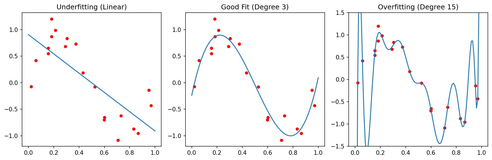

## 01. The Quality Crisis in Scientific ML

::: {.fragment}
- **Garbage In, Garbage Out**: An algorithm is only as good as the data it sees
- In materials science, data is expensive — so we tend to use *everything*, even the "garbage"
- **The Reproducibility Crisis**: Many published models fail on new samples
:::

::: {.callout-note}
Unit 3 focuses on everything that happens *before* and *after* modeling — the steps most often skipped.
:::

::: {.notes}
Set the tone: this is the least glamorous but most important unit. Data quality and validation are where most materials ML projects fail silently. Students should internalize that preprocessing is not optional.
:::

## 02. Learning Outcomes

By the end of this unit, you can:

::: {.fragment}
1. Design a systematic data cleaning pipeline for lab data
2. Choose appropriate scaling/normalization for different feature types
3. Identify and prevent the three types of data leakage
4. Apply K-fold and grouped cross-validation correctly
5. Select appropriate error metrics for regression and classification
6. Evaluate model reliability beyond simple accuracy
:::

::: {.notes}
These outcomes are practical and directly applicable to thesis projects. Every materials ML paper should address points 3-6. Many don't — that's why they fail to reproduce.
:::

## 03. The ML Workflow: Where Are We?

```{mermaid}
graph LR
    C["Collection"] --> PP["Preprocessing"]
    PP --> M["Modeling"]
    M --> E["Evaluation"]
    E --> D["Deployment"]
    style PP fill:#e7ad52,color:#000
    style E fill:#e7ad52,color:#000
```

::: {.fragment}
Today we focus on the **gold boxes**: Preprocessing and Evaluation.

These are where 80% of the work happens — and where 80% of the mistakes hide.
:::

::: {.notes}
Show students that modeling is actually a small part of the pipeline. Preprocessing and evaluation bracket the model and determine whether it's trustworthy.
:::

## 04. The Role of Preprocessing

::: {.fragment}
Transforming raw, potentially messy data into a structured format suitable for algorithms:

- Raw sensor readings → clean feature matrix
- Inconsistent units → standardized scales
- Missing values → complete records (or honest gaps)
- Artifacts → detected and documented
:::

::: {.notes}
Preprocessing is not just "cleaning." It includes transformation, normalization, feature encoding, and splitting. Each step has pitfalls that can silently corrupt your model.
:::

---

## {background-color="#1a1a2e"}

### Part 1: Data Cleaning {style="text-align: center; margin-top: 15%;"}

*Slides 05–11*

::: {.notes}
We start with the most fundamental step: ensuring your data is clean and honest. Cleaning is not about making data look nice — it's about understanding what went wrong and fixing it at the source when possible.
:::

## 05. Common Data Issues

::: {.fragment}
- **Structural problems**: Typos in labels, mixed units (mm vs. µm), inconsistent naming
- **Duplicates**: Same measurement recorded twice — inflates dataset and biases training
- **Irrelevant observations**: Test runs, calibration samples left in the dataset
- **Missing values (NaNs)**: Sensor failure, transmission drops, out-of-range readings
- **Outliers**: Extreme values — physical or artifactual?
:::

::: {.notes}
Walk through each with a materials example. Duplicates are surprisingly common when merging datasets from different lab notebooks. Mixed units is a classic error — especially across collaborators.
:::

## 06. Missing Values: Sources and Detection

::: {.fragment}
**Why data goes missing:**

- Sensor failure during measurement
- Transmission dropout (wireless sensors)
- "Out of range" readings clipped by the instrument
- Operator error (forgot to record a parameter)
:::

::: {.fragment}
**Detection**: `df.isnull().sum()` in Pandas — always the first thing to check.
:::

::: {.notes}
Missing data is not random in materials science. If a thermocouple fails, it fails at high temperatures — so the missing data is biased. Understanding *why* data is missing changes how you handle it.
:::

## 07. Handling Missing Values

::: {.columns}
::: {.column width="50%"}
::: {.fragment}
**Fix at source** (ideal):

- Repair the sensor
- Re-run the measurement
- Check the raw data files
:::
:::

::: {.column width="50%"}
::: {.fragment}
**Digital repair** (if source fix impossible):

- **Deletion**: Remove rows/columns (wasteful for small data)
- **Interpolation**: Linear, spline for time-series
- **Imputation**: Mean/median (dangerous for multi-modal data)
- **Physics-based**: Fill using conservation laws
:::
:::
:::

::: {.fragment}
**Numerical markers**: Using "impossible" values (e.g., -1000°C) to track NaNs without losing record count.
:::

::: {.notes}
The "fix at source" principle is key. Digital repair is always second-best. Emphasize that mean imputation can destroy real bimodal distributions — if you have two phases, the mean falls between them where no real sample exists.
:::

## 08. Outlier Detection

::: {.fragment}
Three types of outliers:

- **Point (global)**: A single value far from the distribution (e.g., hardness = 5000 HV)
- **Contextual**: Normal globally but unusual in context (e.g., 200°C during a room-temperature test)
- **Collective**: A group that behaves differently from the rest (e.g., an entire batch with drift)
:::

::: {.notes}
The distinction matters because each type needs different treatment. Point outliers are easy to spot. Contextual outliers require domain knowledge. Collective outliers are the most dangerous — they can look normal individually.
:::

## 09. Think About This: To Remove or Not?

::: {.fragment}
**Scenario**: You find a hardness value 3× higher than all others in your dataset.

- (A) Remove it — it's clearly an error
- (B) Keep it — it might be real (e.g., a hard precipitate)
- (C) Investigate — check the measurement log before deciding
:::

::: {.fragment}
**Answer**: Always **(C)**. Is it a cosmic ray on the detector? A typo? Or a rare but real physical event (crack initiation, phase transformation)?

Removing real outliers destroys the most interesting data points.
:::

::: {.notes}
This is a crucial decision. In materials science, outliers are often the most scientifically interesting data points. A defect that causes early failure IS the thing you want to detect. But artifacts need to go.
:::

## 10. Duplicate Tracking

::: {.fragment}
- Redundant data points **bias training** (over-weighting certain conditions)
- Duplicates between train and test sets cause **leakage**
- Sources: Copy-paste errors, merging overlapping databases, augmentation artifacts
:::

::: {.fragment}
```python
# Simple duplicate check
n_duplicates = df.duplicated().sum()
print(f"Found {n_duplicates} duplicate rows")
df = df.drop_duplicates()
```
:::

::: {.notes}
Duplicates are more common than students expect, especially when datasets are assembled from multiple sources. Always check before training. In image datasets, near-duplicates (same region, slightly shifted) are even harder to detect.
:::

## 11. The Systematic Cleaning Pipeline

::: {.fragment}
1. **Detection**: Identify outliers, NaNs, duplicates, structural issues
2. **Diagnosis**: Is the issue physical or artifactual? Check the measurement log
3. **Treatment**: Delete, cap, impute, or flag — with justification
4. **Documentation**: Always report how much data was altered!
:::

::: {.callout-note}
If you remove 20% of your data without documenting why, your results are not reproducible.
:::

::: {.notes}
Documentation is the most overlooked step. A paper that says "outliers were removed" without criteria is not reproducible. Create a cleaning log that records every decision and its justification.
:::

---

## {background-color="#1a1a2e"}

### Part 2: Data Transformation and Scaling {style="text-align: center; margin-top: 15%;"}

*Slides 12–20*

::: {.notes}
Once data is clean, we need to transform it into a format that algorithms can work with effectively. Different algorithms have different requirements for input scaling.
:::

## 12. Why Transform Data?

::: {.fragment}
- **Linearize trends**: Log-transform for exponential relationships
- **Align features**: Temperature in [20, 1200] vs. composition in [0.01, 0.5]
- **Equal weighting**: Algorithms using distance (kNN, SVM) need comparable scales
- **Numerical stability**: Very large or very small values cause floating-point issues
:::

::: {.notes}
Transformation is not cosmetic. Without proper scaling, a kNN model will be dominated by the feature with the largest range, ignoring all others. PCA similarly depends on scale.
:::

## 13. Centering and Shifting

::: {.fragment}
- **Mean centering**: $x' = x - \bar{x}$ (center at zero)
- Required for covariance-based methods (PCA, correlation analysis)
- **Peak alignment**: Shifting spectra so that a reference peak is at position zero
:::

::: {.fragment}
Centering changes the origin but not the shape or spread of the distribution.
:::

::: {.notes}
Simple but important. PCA without centering gives incorrect results. Peak alignment is common in spectroscopy — different instruments may have slightly different calibrations.
:::

## 14. Min-Max Scaling

::: {.fragment}
$$x' = \frac{x - x_{\min}}{x_{\max} - x_{\min}} \in [0, 1]$$

- Maps all features to the same range
- **Weakness**: Sensitive to outliers — one extreme value stretches the entire scale
:::

::: {.fragment}
Good for: Neural network inputs (bounded activations like sigmoid expect [0,1]).

Bad for: Noisy lab data with occasional extreme values.
:::

::: {.notes}
Min-max is simple but fragile. If your training set has a max temperature of 900°C and a test sample has 950°C, the scaled value exceeds [0,1] — the model sees something it's never trained on.
:::

## 15. Standardization (Z-score)

::: {.fragment}
$$x' = \frac{x - \mu}{\sigma}$$

- Mean = 0, Standard deviation = 1
- **Robust** to differences in feature magnitude
- The default choice for most ML algorithms
:::

::: {.fragment}
```python
from sklearn.preprocessing import StandardScaler
scaler = StandardScaler()
X_train_scaled = scaler.fit_transform(X_train)  # Fit on training only!
X_test_scaled = scaler.transform(X_test)         # Apply to test
```
:::

::: {.notes}
Z-score standardization is the most common choice. Emphasize the critical rule: fit on training data only, then apply to test data. Fitting on the full dataset is preprocessing leakage.
:::

## 16. Robust Scaler

::: {.fragment}
$$x' = \frac{x - \text{median}}{\text{IQR}}$$

- Uses median and interquartile range instead of mean and std
- **Best for noisy lab data**: Outliers don't distort the scaling
- Available as `sklearn.preprocessing.RobustScaler`
:::

::: {.notes}
For materials data with frequent outliers, RobustScaler is often the best choice. The median and IQR are unaffected by extreme values, so one bad measurement doesn't ruin the scaling for all others.
:::

## 17. Log-Transforms

::: {.fragment}
- Useful for variables spanning **several orders of magnitude**:
  - Grain sizes: 0.1 µm to 1000 µm
  - Dislocation densities: $10^6$ to $10^{15}$ m$^{-2}$
- Linearizes exponential trends → simpler models work better
:::

::: {.fragment}
**Caution**: Log-transform requires strictly positive values. Check for zeros first!
:::

::: {.notes}
Log-transforms are very common in materials science. Particle size distributions, creep rates, diffusion coefficients — all span orders of magnitude. After log-transform, a linear regression may suffice where before you needed a complex model.
:::

## 18. Frequency Domain: FFT

::: {.fragment}
- **Fast Fourier Transform**: Convert time-domain → frequency-domain
- Detect oscillations, periodicity, and characteristic frequencies
- Materials example: Vibration analysis during milling → tool wear detection
:::

::: {.fragment}
{width=80%}
:::

::: {.notes}
FFT is a powerful preprocessing step for time-series data. Instead of feeding raw time series to ML (high-dimensional), extract the frequency spectrum as features (much more compact and physically meaningful).
:::

## 19. Wavelet Transforms: Time-Frequency Analysis

::: {.fragment}
- FFT loses *when* frequencies occur — Wavelets keep both time and frequency
- Localizing features that are both temporal and periodic
- Materials example: Acoustic emission during crack propagation — the frequency signature changes over time
:::

::: {.notes}
Wavelets are the advanced option for non-stationary signals. If the frequency content changes over time (as in fatigue testing), FFT averages everything out. Wavelets preserve the time-frequency structure.
:::

## 20. Triggering: Isolating Relevant Sequences

::: {.fragment}
- Long time series often contain mostly irrelevant data
- **Triggering**: Automatically extracting relevant windows
  - Example: Isolating loading cycles from a continuous fatigue test
  - Example: Extracting melting events from a continuous temperature log
:::

::: {.fragment}
**Critical rule for all transformations**: Scalers and transforms must be "fit" on training data only and "applied" to test data. Otherwise: **preprocessing leakage**.
:::

::: {.notes}
Triggering reduces data volume dramatically while keeping the informative parts. Combined with FFT or wavelets, it creates compact, meaningful feature vectors from hours of raw sensor data.
:::

---

## {background-color="#1a1a2e"}

### Part 3: Labeling and Uncertainty {style="text-align: center; margin-top: 15%;"}

*Slides 21–24*

::: {.notes}
Labels are the "ground truth" for supervised learning. But in materials science, ground truth is rarely certain. This section addresses the uncomfortable reality that our labels are noisy.
:::

## 21. The Annotation Problem

::: {.fragment}
- Who provides the "Ground Truth"?
- In microscopy, labeling is **manual and tedious**: drawing grain boundaries, identifying phases, marking defects
- **Label uncertainty**: If two experts disagree, which one is "right"?
:::

::: {.fragment}
{width=80%}
:::

::: {.notes}
This is a fundamental issue. We train models to predict labels, but the labels themselves are uncertain. Students who do segmentation in their thesis will experience this directly — grain boundaries are ambiguous.
:::

## 22. Inter-Annotator Variance

::: {.fragment}
- Different experts segment the same micrograph differently
- This variance sets an **upper bound** on meaningful model performance
- If humans only agree 85% of the time, a model claiming 99% accuracy is likely overfitting to one person's bias
:::

::: {.fragment}
**Best practice**: Have multiple annotators. Report the inter-annotator agreement. Your model should aim for *human-level* performance, not perfect accuracy.
:::

::: {.notes}
This is a reality check. Many papers report "superhuman" accuracy on materials datasets — but they only compared to one annotator. The true ceiling is the inter-annotator agreement, and that's often lower than you'd expect.
:::

## 23. Quantifying Label Uncertainty

::: {.fragment}
- Models shouldn't just output a label — they should output **confidence**
- **Softmax probabilities**: $P(\text{Phase} = \text{FCC}) = 0.82$
- Confidence < 0.6? The model is uncertain — flag for expert review
:::

::: {.fragment}
The Bayesian perspective: treat model parameters as distributions, not point estimates. Prior + Likelihood = Posterior.
:::

::: {.notes}
This connects to Unit 2's discussion of uncertainty types. Label uncertainty is epistemic — it can be reduced with better annotation protocols or more annotators. Model confidence should be calibrated to reflect true uncertainty.
:::

## 24. Active Learning: Smart Annotation

::: {.fragment}
- Instead of labeling everything, the model asks: *"Label this specific image because I am most uncertain about it"*
- Reduces manual burden while focusing on the "hard" physical cases
:::

```{mermaid}
graph LR
    U["Unlabeled<br>Pool"] --> M["Model<br>Predicts"]
    M --> Q["Query:<br>Most Uncertain"]
    Q --> E["Expert<br>Labels"]
    E --> T["Retrain<br>Model"]
    T --> M
```

::: {.notes}
Active learning is a practical solution to the annotation bottleneck. Instead of labeling 10,000 images, you might need to label only 500 strategically chosen ones. The model guides the labeling process.
:::

---

## {background-color="#1a1a2e"}

### Part 4: Robust Validation and Model Selection {style="text-align: center; margin-top: 15%;"}

*Slides 25–37*

::: {.notes}
Now we address the most critical question: how do we know if our model actually works? This section covers the bias-variance tradeoff, cross-validation, and the three types of data leakage.
:::

## 25. Overfitting vs. Underfitting

::: {.columns}
::: {.column width="50%"}
::: {.fragment}
**Underfitting** (High Bias):

- Model is too simple
- Fails to capture the trend
- High error on both train and test
:::
:::

::: {.column width="50%"}
::: {.fragment}
**Overfitting** (High Variance):

- Model is too complex
- Memorizes noise as if it were signal
- Low train error, high test error
:::
:::
:::

::: {.fragment}
{width=80%}
:::

::: {.notes}
Draw this on the board. The classic bias-variance picture. The key diagnostic: if training error is much lower than test error, you're overfitting. If both are high, you're underfitting.
:::

## 26. The Bias-Variance Tradeoff

::: {.fragment}
$$\text{Total Error} = \text{Bias}^2 + \text{Variance} + \text{Irreducible Noise}$$

- **Bias**: Error from wrong assumptions (model too simple)
- **Variance**: Error from sensitivity to training data (model too complex)
- **Irreducible noise**: Aleatory uncertainty — the noise floor
:::

::: {.fragment}
The sweet spot: enough complexity to capture the physics, not so much that you memorize the noise.
:::

::: {.notes}
This equation is fundamental. The irreducible noise is the aleatory uncertainty from Unit 2. Bias and variance are both epistemic — they can be reduced with better models and more data, respectively.
:::

## 27. Parsimony and Regularization

::: {.fragment}
**Occam's Razor**: Prefer the simplest model that explains the data.

> "Entities must not be multiplied beyond necessity."
:::

::: {.fragment}
**Regularization** adds a penalty for complexity:

- **L1 (Lasso)**: $J = \text{MSE} + \lambda \sum |w_i|$ — can force weights to exactly zero (feature selection!)
- **L2 (Ridge)**: $J = \text{MSE} + \lambda \sum w_i^2$ — shrinks weights toward zero
:::

::: {.notes}
Regularization is the practical implementation of Occam's razor. L1 is particularly useful in materials science because it automatically selects the most important features from a large set of candidates.
:::

## 28. Train-Test Split (Holdout)

::: {.fragment}
- Divide data into independent sets:
  - **Training set** (70-80%): Learn model parameters
  - **Test set** (20-30%): Evaluate final performance
- The test set must **never** influence training decisions
:::

::: {.fragment}
**Risk for small datasets**: An unlucky split puts all "hard" cases in the test set → pessimistic estimate. Or all "easy" cases → optimistic estimate.
:::

::: {.notes}
Holdout is the simplest validation strategy. For large datasets (>10,000 samples), it works well. For typical materials datasets (50-500 samples), it's unreliable — the performance estimate depends heavily on which samples end up where.
:::

## 29. K-Fold Cross-Validation

::: {.fragment}
- Split data into $K$ folds (typically $K = 5$ or $10$)
- Iteratively use $K-1$ folds for training, 1 for testing
- Average the $K$ performance scores
:::

::: {.fragment}
```{mermaid}
graph TD
    D["Dataset"] --> F1["Fold 1: Test"]
    D --> F2["Fold 2: Test"]
    D --> F3["Fold 3: Test"]
    D --> F4["Fold 4: Test"]
    D --> F5["Fold 5: Test"]
    F1 --> A["Average<br>Performance"]
    F2 --> A
    F3 --> A
    F4 --> A
    F5 --> A
```
:::

::: {.fragment}
More stable than holdout: every sample gets to be in the test set exactly once.
:::

::: {.notes}
K-fold is the standard for materials ML. 5-fold is a good default. 10-fold gives slightly better estimates but costs twice the computation. The key benefit: the performance estimate uses all data for both training and testing.
:::

## 30. Leave-One-Out (LOOCV)

::: {.fragment}
- Special case: $K = N$ (number of samples)
- Each sample is tested individually against a model trained on all others
- **Most robust** for very small datasets ($N < 50$)
- **Most expensive** computationally: train $N$ models
:::

::: {.notes}
LOOCV is the extreme of K-fold. Use it when data is very scarce (10-30 samples). For larger datasets, 5-fold or 10-fold is sufficient and much faster.
:::

## 31. Stratified Splitting

::: {.fragment}
- Ensure each fold has the **same class distribution** as the full dataset
- Crucial for **imbalanced data**: if only 5% of samples are "defective," a random fold might contain zero defective samples
:::

::: {.fragment}
```python
from sklearn.model_selection import StratifiedKFold
skf = StratifiedKFold(n_splits=5, shuffle=True)
for train_idx, test_idx in skf.split(X, y):
    # Each fold has same proportion of each class
    ...
```
:::

::: {.notes}
Class imbalance is very common in materials: defects are rare, most samples are "normal." Without stratification, some folds may have no defective samples at all, making the evaluation meaningless.
:::

## 32. Data Leakage: The Silent Killer

::: {.fragment}
**Definition**: When information from the test set "leaks" into training, producing over-optimistic results that vanish during real deployment.
:::

::: {.fragment}
Three types of leakage in materials ML:

1. **Spatial/Group leakage**: Patches from the same sample in train and test
2. **Temporal leakage**: Using future data to predict the past
3. **Preprocessing leakage**: Fitting scalers on the full dataset
:::

::: {.callout-note}
"If your accuracy is too good to be true, it probably is."
:::

::: {.notes}
Leakage is the #1 reason materials ML papers fail to reproduce. It's silent — your metrics look great, your model seems to work, but it's actually memorizing dataset-specific patterns rather than learning physics.
:::

## 33. Spatial/Group Leakage

::: {.fragment}
**Scenario**: A sample is cut into 100 image patches. 80 go to train, 20 to test.

**Problem**: Patches from the same physical sample are highly correlated. The model "recognizes" the specific sample instead of learning general physics.
:::

::: {.fragment}
**Solution**: Split by **Sample ID** or **Batch ID**, never by patch.

```python
from sklearn.model_selection import GroupKFold
gkf = GroupKFold(n_splits=5)
for train_idx, test_idx in gkf.split(X, y, groups=sample_ids):
    ...
```
:::

::: {.notes}
This is the most common leakage type in microscopy. If you train on 80 patches from sample A and test on 20 other patches from the same sample, you're testing recognition, not generalization. Always split by sample.
:::

## 34. Temporal Leakage

::: {.fragment}
**Scenario**: Predict the quality of a weld based on sensor logs.

**Problem**: Using data from $t = 50$ min to predict a property measured at $t = 10$ min.

**Solution**: "Walk-forward" validation — only use data available *at the time of prediction*.
:::

::: {.fragment}
In time-series: never shuffle! The arrow of time must be respected in your splits.
:::

::: {.notes}
Temporal leakage is obvious once you see it, but easy to miss in practice. If your model uses future sensor readings to predict past outcomes, it's cheating. Walk-forward validation mimics the real deployment scenario.
:::

## 35. Preprocessing Leakage

::: {.fragment}
**Scenario**: Calculate mean and standard deviation of the **entire** dataset before splitting.

**Problem**: Information about the test set distribution is now embedded in the training features.

**Solution**: Use **Pipeline objects** to encapsulate all preprocessing.
:::

::: {.fragment}
```python
from sklearn.pipeline import Pipeline
pipe = Pipeline([
    ('scaler', StandardScaler()),  # Fit only on training fold
    ('model', LinearRegression())
])
cross_val_score(pipe, X, y, cv=GroupKFold(5), groups=sample_ids)
```
:::

::: {.notes}
Preprocessing leakage is subtle. Scikit-learn Pipelines solve it automatically — the scaler is fit inside each cross-validation fold, using only the training data for that fold. Without pipelines, it's easy to leak.
:::

## 36. Think About This: Spot the Leakage

::: {.fragment}
**Setup**: You have 20 steel samples. Each is imaged at 5 locations. You standardize all features, then randomly split the 100 images into 80 train / 20 test. You achieve R² = 0.95.

**How many leakage errors are present?**
:::

::: {.fragment}
**Answer**: Three!

1. **Preprocessing leakage**: Standardization before splitting
2. **Spatial leakage**: Images from the same sample in train and test
3. **No grouped validation**: Should split by sample ID, not by image
:::

::: {.notes}
Pause for students to think. This example combines all three leakage types — and it looks exactly like what a naive first attempt would produce. The R² of 0.95 is meaningless because of leakage.
:::

## 37. Nested Cross-Validation

::: {.fragment}
- **Outer loop**: Evaluates model performance (5-fold)
- **Inner loop**: Tunes hyperparameters (5-fold within each outer fold)
- Prevents hyperparameter tuning from biasing the performance estimate
:::

::: {.fragment}
Computationally expensive ($5 \times 5 = 25$ model fits) but the **gold standard** for small datasets.
:::

::: {.notes}
Nested CV is the most rigorous validation scheme. If you tune hyperparameters using the same data you evaluate on, you get optimistic estimates. The outer loop provides an unbiased assessment. Use this for any paper or thesis.
:::

---

## {background-color="#1a1a2e"}

### Part 5: Error Measures {style="text-align: center; margin-top: 15%;"}

*Slides 38–47*

::: {.notes}
Now that we know how to validate properly, we need to choose the right metric. Different metrics answer different questions — and the wrong metric can hide serious problems.
:::

## 38. Measuring Success: Which Metric?

::: {.fragment}
- Different tasks need different measures
- A metric defines what "good" means — choose it as carefully as your model

| Task | Common Metrics |
|:---|:---|
| Regression | MAE, MSE, RMSE, R² |
| Classification | Accuracy, Precision, Recall, F1, AUC |
| Segmentation | IoU (Jaccard), Dice, Pixel Accuracy |
:::

::: {.notes}
The metric is a design decision. It should reflect what matters in your application. If missing a defect is catastrophic, optimize for recall. If false alarms are costly, optimize for precision.
:::

## 39. Regression: MAE (L1 Error)

::: {.fragment}
$$\text{MAE} = \frac{1}{N}\sum_{i=1}^{N} |y_i - \hat{y}_i|$$

- Mean Absolute Error — in the **original units** of the target
- Less sensitive to outliers than MSE
- Interpretable: "On average, our prediction is off by X MPa"
:::

::: {.notes}
MAE is the most interpretable regression metric. If you predict yield strength, MAE tells you "we're off by 15 MPa on average." It treats all errors equally, regardless of magnitude.
:::

## 40. Regression: MSE, RMSE (L2 Error)

::: {.fragment}
$$\text{MSE} = \frac{1}{N}\sum_{i=1}^{N} (y_i - \hat{y}_i)^2 \qquad \text{RMSE} = \sqrt{\text{MSE}}$$

- **MSE**: Penalizes large errors disproportionately (quadratic)
- **RMSE**: Returns to original units — comparable to MAE
- Use MSE when large errors are especially bad (safety-critical applications)
:::

::: {.notes}
The difference between MAE and RMSE tells you about error distribution. If RMSE >> MAE, you have a few very large errors (outliers). If RMSE ≈ MAE, errors are uniform. This diagnostic is underused.
:::

## 41. Regression: R² (Coefficient of Determination)

::: {.fragment}
$$R^2 = 1 - \frac{\sum(y_i - \hat{y}_i)^2}{\sum(y_i - \bar{y})^2}$$

- Fraction of variance "explained" by the model
- $R^2 = 1$: perfect fit. $R^2 = 0$: model is no better than predicting the mean
- $R^2 < 0$ is possible: model is *worse* than the mean!
:::

::: {.fragment}
**Pitfall**: High R² doesn't mean a useful model. Always check residual plots.
:::

::: {.notes}
R² is the most reported metric in materials ML. But it can be misleading: a model that predicts a line through a curved dataset can still have high R² if the range is large. Always visualize predictions vs. truth.
:::

## 42. Classification: The Confusion Matrix

::: {.fragment}
|  | Predicted Positive | Predicted Negative |
|:---|:---:|:---:|
| **Actually Positive** | TP (True Positive) | FN (False Negative) |
| **Actually Negative** | FP (False Positive) | TN (True Negative) |
:::

::: {.fragment}
- **Type I Error** (FP): "Crying wolf" — predicting a defect that isn't there
- **Type II Error** (FN): "Missing the wolf" — missing a real defect
- Which is worse depends on the application!
:::

::: {.notes}
The confusion matrix is the foundation for all classification metrics. Draw it on the board. In quality control, Type II errors (missing defects) are usually worse. In screening, Type I errors (false alarms) waste resources.
:::

## 43. Precision: Avoiding False Alarms

::: {.fragment}
$$\text{Precision} = \frac{TP}{TP + FP}$$

"Of all predicted positives, how many were actually positive?"
:::

::: {.fragment}
**Materials example**: Automated defect detection in a production line.

High precision = few false alarms → operators trust the system.
:::

::: {.notes}
Precision answers: "When the model says there's a defect, can I believe it?" Low precision means lots of false alarms, which leads to alarm fatigue and operators ignoring the system.
:::

## 44. Recall (Sensitivity): Finding Everything

::: {.fragment}
$$\text{Recall} = \frac{TP}{TP + FN}$$

"Of all actually positive cases, how many did we find?"
:::

::: {.fragment}
**Materials example**: Safety-critical inspection of turbine blades.

High recall = we find (almost) every crack → no catastrophic failures.
:::

::: {.notes}
Recall answers: "Did we catch all the defects?" In safety-critical applications, recall matters more than precision. Missing a crack in a turbine blade can be catastrophic.
:::

## 45. F1-Score: Balancing Precision and Recall

::: {.fragment}
$$F_1 = 2 \cdot \frac{\text{Precision} \cdot \text{Recall}}{\text{Precision} + \text{Recall}}$$

- Harmonic mean of precision and recall
- F1 = 1 only if both precision and recall are perfect
- Also known as the **Dice coefficient** in image segmentation
:::

::: {.notes}
F1 is the go-to single metric for classification when you care about both precision and recall. It's the default choice for most materials classification tasks unless you have a specific reason to weight one over the other.
:::

## 46. IoU (Jaccard Similarity)

::: {.fragment}
$$\text{IoU} = \frac{|A \cap B|}{|A \cup B|} = \frac{TP}{TP + FP + FN}$$

- **Intersection over Union**: Standard for image segmentation and object detection
- Stricter than Dice: penalizes both false positives and false negatives
- IoU > 0.5 is a common threshold for "acceptable" segmentation
:::

::: {.notes}
IoU is essential for any segmentation task in microscopy — grain boundary detection, phase mapping, defect localization. If your IoU is below 0.5, your segmentation is essentially random.
:::

## 47. Categorical Cross-Entropy

::: {.fragment}
$$L = -\sum_{c=1}^{C} y_c \log(\hat{y}_c)$$

- The standard **loss function** for multi-class classification
- Penalizes incorrect *high-confidence* predictions heavily
- Used during training (not as an evaluation metric)
:::

::: {.fragment}
**Connection**: Cross-entropy is the negative log-likelihood under a categorical distribution — it's the Bayesian-correct loss for classification.
:::

::: {.notes}
Cross-entropy is the training loss; F1/precision/recall are the evaluation metrics. The distinction matters: you optimize cross-entropy during training but report F1 in your paper. They measure different things.
:::

---

## {background-color="#1a1a2e"}

### Summary and Key Takeaways {style="text-align: center; margin-top: 15%;"}

*Slides 48–50*

::: {.notes}
Final wrap-up. Give students a clear checklist they can use for every project.
:::

## 48. Summary: Preprocessing

::: {.fragment}
1. **Clean your data** — but fix the physics first (source correction > digital repair)
2. **Scale appropriately**: Z-score by default, RobustScaler for noisy data
3. **Transform thoughtfully**: Log, FFT, wavelets — match the physics
4. **Document everything**: A cleaning log is part of your reproducibility
:::

::: {.notes}
Quick recap of Parts 1-2. The key message: preprocessing is not optional, and it must be documented.
:::

## 49. Summary: Validation and Metrics

::: {.fragment}
1. **Human labels are uncertain** → quantify disagreement, don't chase 100% accuracy
2. **Beware of leakage** → split by sample, not by pixel; respect the arrow of time
3. **Cross-validate properly** → grouped K-fold + nested CV for hyperparameters
4. **Choose the right metric** → what matters in your application? Safety? Cost? Trust?
:::

::: {.notes}
Quick recap of Parts 3-5. The key message: validation must mirror the operational reality. If your model will be deployed on new samples from a new lab, your validation should test that scenario.
:::

## 50. The Trustworthy Materials ML Checklist

::: {.fragment}
- [ ] Is my split **leakage-safe** (grouped by sample)?
- [ ] Did I fit the scaler **only on the training set**?
- [ ] Do my labels have an **uncertainty estimate**?
- [ ] Is my metric **sensitive to class imbalance**?
- [ ] Have I benchmarked against a **simple baseline**?
- [ ] Are my **residuals** random (no systematic pattern)?
- [ ] Can someone **reproduce** my preprocessing from my documentation?
:::

::: {.fragment}
**Reading:**

- Neuer (2024): Ch. 3 (Data Preprocessing) [@neuer2024machine]
- Sandfeld (2024): Ch. 11.5, 16.2 (Validation) [@sandfeld_materials_data_science]
- McClarren (2021): Ch. 1, 3 (Evaluation and Metrics) [@mcclarren2021machine]
:::

::: {.fragment}
**Next Week**: Unit 4 — From Classical Microstructure Metrics to Learned Representations
:::

::: {.notes}
This checklist is the single most important slide in the unit. Students should apply it to every project. Preview Unit 4: we move from data preparation to representation — how do we describe microstructures in a way that ML can learn from?
:::

---

## References

::: {#refs}
:::
