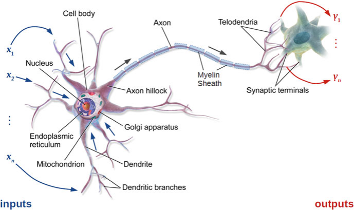
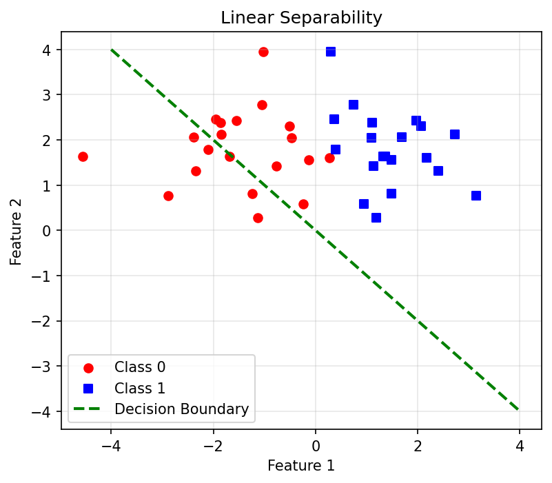
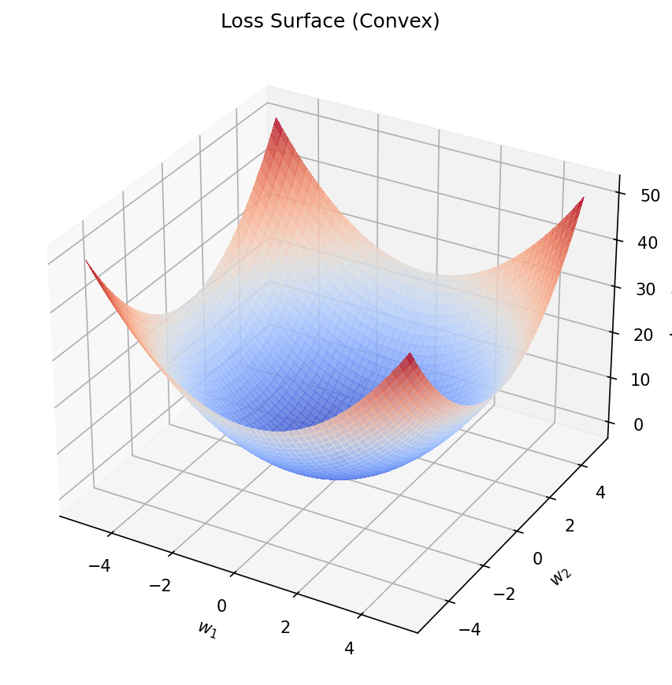
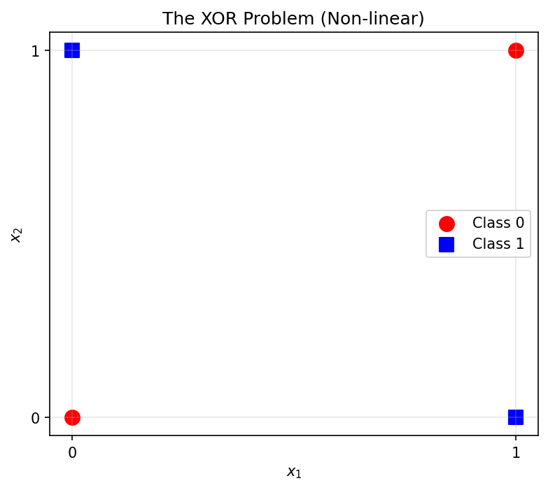
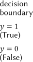

## 01. The Language of Microstructures

::: {.fragment}
- How do we describe what we see in a microscope?
- **Traditionally**: Human-driven metrics (grain size, phase fraction)
- **Modern approach**: Algorithm-driven representations (embeddings)
- **Goal**: Capture the link between structure and properties — automatically
:::

::: {.notes}
This unit bridges classical materials characterization and modern deep learning. We start from stereology (which students know) and build toward neural network representations (which they'll use for the rest of the course).
:::

## 02. Learning Outcomes

By the end of this unit, you can:

::: {.fragment}
1. Explain the information loss in classical stereological metrics
2. Describe the architecture of the Perceptron and MLP
3. Explain why non-linear activation functions are necessary
4. Trace forward propagation through a multi-layer network
5. Distinguish between hand-crafted and learned feature representations
6. Choose appropriate activation functions for different tasks
:::

::: {.notes}
This unit is foundational for everything that follows. Units 5-6 build on the neural network concepts introduced here by adding convolutions and transfer learning.
:::

---

## {background-color="#1a1a2e"}

### Part 1: Classical Microstructure Metrics {style="text-align: center; margin-top: 15%;"}

*Slides 03–10*

::: {.notes}
We start with what students already know — stereology and hand-crafted descriptors — and expose their limitations. This motivates the shift to learned representations.
:::

## 03. Stereology: Quantifying Structure

::: {.fragment}
**Stereology**: The science of estimating 3D properties from 2D sections.

- **Volume fractions** ($V_V$): How much of each phase?
- **Surface area per volume** ($S_V$): Interface density
- **Mean intercept length**: Grain size estimation
:::

::: {.fragment}
How we've characterized structure for over a century — the backbone of materials standards (ASTM, DIN).
:::

::: {.notes}
Students know stereology from their materials science courses. Remind them that these are statistical estimates based on geometric assumptions (random sections through random structures). The assumptions matter.
:::

## 04. Stereological Descriptors in Practice

::: {.fragment}
{width=80%}
:::

::: {.fragment}
Scalar features that condense complex 3D structures into **single numbers**:

- Grain size → one number
- Phase fraction → one number
- Porosity → one number

These are our "hand-crafted features."
:::

::: {.notes}
Show a real micrograph with measurement overlays. The point is that each measurement throws away enormous amounts of spatial information. A grain size number tells you nothing about grain shape, connectivity, or spatial arrangement.
:::

## 05. Hand-Crafted Shape Descriptors

::: {.fragment}
Features based on human intuition:

- **Shape**: Aspect ratio, circularity, tortuosity
- **Distribution**: Nearest-neighbor distances, clustering index
- **Texture**: Orientation distribution function (ODF)
:::

::: {.fragment}
- **Strength**: Physically interpretable — you can explain them to a colleague
- **Weakness**: Biased — you only find what you look for. What if the key descriptor hasn't been invented yet?
:::

::: {.notes}
Hand-crafted features encode human knowledge. That's both their power and their limitation. If the relationship between microstructure and properties depends on a feature no one has thought to measure, hand-crafted approaches will miss it.
:::

## 06. The Information Bottleneck

::: {.fragment}
- A high-resolution micrograph: $10^6$ pixels of information
- ASTM grain size: reduces this to **one number**
- We discard **99.99%** of the information
:::

::: {.fragment}
*Question*: Can we keep more information while remaining computationally efficient?

*Answer*: Yes — learned representations (embeddings) compress images into vectors that preserve the task-relevant information.
:::

::: {.notes}
This is the key motivation. The information bottleneck is severe. A single grain size number cannot distinguish between two microstructures that have the same average grain size but very different spatial arrangements.
:::

## 07. PSPP as a Feature Space

::: {.fragment}
Processing → Structure (Metric $d$) → Property (Hardness $H$)

**Hall-Petch**: $H = H_0 + k \cdot d^{-1/2}$

A linear model using a physical descriptor — works well for simple cases!
:::

::: {.fragment}
```{mermaid}
graph LR
    P["Processing<br>(cooling rate)"] --> S["Structure<br>(grain size d)"]
    S --> Pr["Property<br>(hardness H)"]
    style S fill:#e7ad52,color:#000
```
:::

::: {.notes}
Hall-Petch is the classic example of a physics-based structure-property relationship. It works because grain size is the dominant structural feature for this property. But for complex alloys or multi-phase systems, a single metric is insufficient.
:::

## 08. Why Not Just Metrics?

::: {.fragment}
Modern materials defy simple descriptions:

- **High-entropy alloys**: 5+ principal elements, complex phase mixtures
- **Nanocomposites**: Multi-scale structures spanning nm to µm
- **Additive manufacturing**: Spatially varying microstructures, not statistically homogeneous
:::

::: {.fragment}
Simple metrics are insufficient to describe the "S" in PSPP completely. We need **richer representations**.
:::

::: {.notes}
This is where the field is moving. Additive manufacturing is a great example: the microstructure varies point-to-point within a single component. A single grain size number is meaningless.
:::

## 09. The Paradigm Shift

::: {.fragment}
| Approach | Input | Features | Limitations |
|:---|:---|:---|:---|
| **Classical** | Micrograph → Metrics | Hand-crafted | Information loss |
| **Modern** | Micrograph → Network | Learned (embedding) | Need data |
:::

::: {.fragment}
From **"Predicting with Descriptors"** to **"Learning Representations"**

The model decides what features matter — not the scientist.
:::

::: {.notes}
This table is the key conceptual shift. Classical: human designs features, model uses them. Modern: model learns features end-to-end. Both have trade-offs. The rest of this unit builds the foundation for the modern approach.
:::

## 10. Part 1 Recap

::: {.fragment}
1. Classical metrics (stereology) are interpretable but **lossy**
2. Hand-crafted features encode human knowledge — but may miss key descriptors
3. The information bottleneck: $10^6$ pixels → 1 number
4. Modern materials need **richer representations** than scalar metrics
5. The solution: let the model **learn** the representation
:::

::: {.notes}
Quick recap. Make sure students understand *why* we need neural networks before we introduce *how* they work. The motivation must be clear.
:::

---

## {background-color="#1a1a2e"}

### Part 2: The Foundational Neuron {style="text-align: center; margin-top: 15%;"}

*Slides 11–22*

::: {.notes}
Now we build the neural network from scratch, starting with biological inspiration and progressing through the historical development: McCulloch-Pitts → Perceptron → ADALINE.
:::

## 11. Biological Inspiration

::: {.fragment}
- The human brain: **86 billion neurons**, each connected to thousands of others
- Nature's information processor: learn, adapt, generalize
- Can we build a mathematical model that does the same?
:::

::: {.fragment}
{width=80%}
:::

::: {.notes}
Start with biology as motivation, but be careful: artificial neural networks are only loosely inspired by biology. They don't work like real brains. The analogy is useful for intuition but breaks down quickly.
:::

## 12. The Neuron as Information Processor

::: {.fragment}
- **Dendrites**: Receive input signals from other neurons
- **Soma**: Aggregates inputs and makes a "decision"
- **Axon**: Transmits the output signal
- **Synapses**: Connection points — their **strength** changes during learning
:::

::: {.fragment}
> "Neurons that fire together, wire together" — Hebb's Rule (1949)

Synaptic plasticity = learning
:::

::: {.notes}
Hebb's rule is the biological precursor to the learning rules we'll see in the Perceptron. Strengthen connections that are used together; weaken those that aren't. Simple but powerful.
:::

## 13. The McCulloch-Pitts (MCP) Neuron (1943)

::: {.fragment}
The first computational model of a neuron:

- **Binary inputs**: $x_i \in \{0, 1\}$
- **Unweighted sum**: $a = \sum x_i$
- **Threshold activation**: $y = 1$ if $a \geq \theta$, else $0$
:::

::: {.fragment}
A "Threshold Logic Unit" — the simplest possible decision maker.
:::

::: {.notes}
McCulloch and Pitts showed that simple threshold units can compute Boolean logic. This was revolutionary — it demonstrated that neurons (even simplified ones) can process information logically.
:::

## 14. MCP for Boolean Decisions

::: {.columns}
::: {.column width="50%"}
::: {.fragment}
**AND** ($\theta = 2$):

| $x_1$ | $x_2$ | $a$ | $y$ |
|:---:|:---:|:---:|:---:|
| 0 | 0 | 0 | 0 |
| 0 | 1 | 1 | 0 |
| 1 | 0 | 1 | 0 |
| 1 | 1 | 2 | **1** |
:::
:::

::: {.column width="50%"}
::: {.fragment}
**OR** ($\theta = 1$):

| $x_1$ | $x_2$ | $a$ | $y$ |
|:---:|:---:|:---:|:---:|
| 0 | 0 | 0 | 0 |
| 0 | 1 | 1 | **1** |
| 1 | 0 | 1 | **1** |
| 1 | 1 | 2 | **1** |
:::
:::
:::

::: {.notes}
Walk through the truth tables. By changing the threshold, the same unit computes different Boolean functions. But note the limitation: all inputs contribute equally (no weights).
:::

## 15. Limits of MCP

::: {.fragment}
- All inputs are **equally important** (unweighted)
- In reality, some features matter more than others:
  - Carbon content matters more than trace impurities for steel hardness
  - Grain boundary density matters more than average grain size for fatigue
- We need **weights** to encode feature importance
:::

::: {.notes}
This limitation motivates the Perceptron. The MCP neuron treats all inputs the same. But in materials science, we know that some measurements are more informative than others. Weights allow the model to learn this automatically.
:::

## 16. The Rosenblatt Perceptron (1958)

::: {.fragment}
Introducing **weights** ($w_i$) and **bias** ($b$):

$$a = \sum_{i=1}^{n} w_i x_i + b = \mathbf{w}^T \mathbf{x} + b$$

- Weights: learned importance of each feature
- Bias: shifts the decision threshold
- Activation: step function $y = 1$ if $a \geq 0$, else $0$
:::

::: {.fragment}
The foundation of supervised learning.
:::

::: {.notes}
The Perceptron is the first trainable model. Unlike MCP, it can learn which features matter and how much. The bias allows the decision boundary to be shifted away from the origin.
:::

## 17. Perceptron Architecture

::: {.fragment}
```{mermaid}
graph LR
    x1["x₁"] -- "w₁" --> S["Σ + b"]
    x2["x₂"] -- "w₂" --> S
    x3["x₃"] -- "w₃" --> S
    S --> A["Step<br>Function"]
    A --> y["y"]
```
:::

::: {.fragment}
- Inputs can now be **continuous** (temperature, pixel intensity, composition)
- Weights are **real-valued** — learned from data
- The step function makes a hard binary decision
:::

::: {.notes}
Draw this diagram on the board. Label each component. The sum + bias is the "aggregation" (like the soma), and the step function is the "activation" (like the axon firing or not).
:::

## 18. The Perceptron Learning Rule

::: {.fragment}
How do we find the right weights?

$$\mathbf{w} \leftarrow \mathbf{w} + \eta (d - y) \mathbf{x}$$

- $\eta$: **Learning rate** (step size)
- $d$: Desired output (label)
- $y$: Current output (prediction)
- If correct ($d = y$): no update. If wrong: adjust weights.
:::

::: {.notes}
Walk through an example: if the model predicts 0 but the label is 1, the error is +1, so weights increase in the direction of the input. If the model predicts 1 but the label is 0, the error is -1, so weights decrease.
:::

## 19. Geometric Interpretation

::: {.fragment}
The Perceptron defines a **hyperplane** (decision boundary) in feature space:

$$\mathbf{w}^T \mathbf{x} + b = 0$$

- In 2D: a line
- In 3D: a plane
- In $n$D: a hyperplane
:::

::: {.fragment}
Everything on one side → class 0. Everything on the other side → class 1.

{width=80%}
:::

::: {.notes}
Draw this in 2D. Show two clusters of points separated by a line. The Perceptron finds this line. But what if the classes can't be separated by a line? That brings us to the XOR problem later.
:::

## 20. Think About This: Can a Perceptron Do This?

::: {.fragment}
**Task**: Classify steel samples as "pass" or "fail" based on carbon content and cooling rate.

The pass/fail boundary looks like a line in 2D space.

**Can a single Perceptron solve this?**
:::

::: {.fragment}
**Yes!** If the classes are **linearly separable**, a Perceptron will converge to the correct boundary. This is guaranteed by the Perceptron Convergence Theorem.
:::

::: {.notes}
Use this to build confidence. Simple problems with linear boundaries are perfectly solvable. The question is: how many real materials problems have linear boundaries? Spoiler: not many.
:::

## 21. ADALINE: Adaptive Linear Neuron (1960)

::: {.fragment}
**Key difference**: Training uses the *linear* output $a$ (before the step function)

$$J = \frac{1}{2}(d - a)^2 = \frac{1}{2}(d - \mathbf{w}^T\mathbf{x} - b)^2$$

- The **Delta Rule** (Widrow-Hoff): minimize Mean Squared Error
- Provides a "smoother" optimization landscape
:::

::: {.notes}
ADALINE is the bridge between the Perceptron and modern neural networks. By training on the continuous output (not the thresholded output), we get a smooth error surface that we can optimize with gradient descent.
:::

## 22. Part 2 Recap

::: {.fragment}
1. **MCP neuron**: Binary inputs, threshold, no learning
2. **Perceptron**: Weighted inputs, bias, simple learning rule
3. **ADALINE**: Continuous error, smooth optimization landscape
4. All three can only solve **linearly separable** problems
5. Next: How to break the linear barrier
:::

::: {.notes}
Quick recap. The historical progression is MCP → Perceptron → ADALINE. Each adds capability. But all share a fundamental limitation: they can only draw straight lines in feature space.
:::

---

## {background-color="#1a1a2e"}

### Part 3: Gradient Descent {style="text-align: center; margin-top: 15%;"}

*Slides 23–30*

::: {.notes}
Now we formalize the optimization procedure that all neural networks use: gradient descent. This is the "engine" that makes learning possible.
:::

## 23. The Cost Surface

::: {.fragment}
The error $J(w, b)$ forms a surface in parameter space:

- For ADALINE (MSE loss): a smooth **bowl** (convex)
- We want to reach the bottom of the bowl: the minimum error
:::

::: {.fragment}
{width=80%}
:::

::: {.notes}
Visualize this: each point on the surface represents a specific combination of weights and bias, and the height is the error. We want to find the lowest point. For linear models, there's exactly one minimum (convex). For deep networks, the landscape is much more complex.
:::

## 24. Introduction to Gradient Descent

::: {.fragment}
"Walk downhill" in parameter space:

$$\nabla J = \left(\frac{\partial J}{\partial w_1}, \frac{\partial J}{\partial w_2}, \ldots, \frac{\partial J}{\partial b}\right)$$
:::

::: {.fragment}
Update rule:

$$\mathbf{w}_{\text{new}} = \mathbf{w}_{\text{old}} - \eta \nabla J$$

- The gradient $\nabla J$ points **uphill** → we go in the opposite direction
- $\eta$: learning rate (step size)
:::

::: {.notes}
The gradient is the direction of steepest ascent. We want to descend, so we go the opposite way. This is the fundamental algorithm behind all neural network training. The learning rate controls how big each step is.
:::

## 25. The Learning Rate $\eta$

::: {.columns}
::: {.column width="50%"}
::: {.fragment}
**Too large**:

- Oscillations around the minimum
- May diverge entirely
- "Jumping over the valley"
:::
:::

::: {.column width="50%"}
::: {.fragment}
**Too small**:

- Extremely slow convergence
- May get stuck in flat regions
- Wastes computational resources
:::
:::
:::

::: {.fragment}
**The Goldilocks zone**: Large enough to make progress, small enough to converge. In practice: use learning rate schedulers or adaptive methods (Adam).
:::

::: {.notes}
Draw the two failure modes on the board. Large η: the path bounces back and forth. Small η: the path crawls slowly. Adaptive learning rates (Adam, RMSprop) solve this by adjusting η automatically during training.
:::

## 26. Batch, Mini-Batch, and Stochastic GD

::: {.fragment}
- **Batch GD**: Compute gradient over the entire dataset → stable but slow
- **Stochastic GD (SGD)**: Compute gradient from one sample → fast but noisy
- **Mini-Batch GD**: Compute gradient from a small subset (e.g., 32 samples) → best trade-off
:::

::: {.fragment}
```{mermaid}
graph LR
    B["Batch<br>(all data)"] --- MB["Mini-Batch<br>(32-256)"]
    MB --- S["Stochastic<br>(1 sample)"]
    B -.- BL["Stable,<br>Slow"]
    S -.- SL["Noisy,<br>Fast"]
    MB -.- ML["Best<br>Trade-off"]
    style MB fill:#e7ad52,color:#000
```
:::

::: {.notes}
Mini-batch GD is the standard in modern deep learning. The noise from mini-batches actually helps — it can escape local minima. Typical batch sizes: 32, 64, 128, 256. Materials datasets are often small enough for full-batch GD.
:::

## 27. Convergence and the Loss Curve

::: {.fragment}
- Plot loss $J$ vs. training iteration (epoch)
- **Healthy training**: Loss decreases smoothly, then plateaus
- **Warning signs**:
  - Loss oscillates wildly → learning rate too high
  - Loss plateaus immediately → learning rate too low or model too simple
  - Train loss drops but validation loss increases → **overfitting**
:::

::: {.notes}
The loss curve is the primary diagnostic tool during training. Always plot both training and validation loss. The gap between them tells you about overfitting. Students should make this plot for every model they train.
:::

## 28. Think About This: Linear Limits

::: {.fragment}
**Question**: You want to classify microstructures as "acceptable" or "reject" based on grain size and porosity. Acceptable means grain size < 50 µm AND porosity < 2%.

Can a single Perceptron solve this?
:::

::: {.fragment}
**Answer**: Yes — this is a rectangular boundary, which is linearly separable (can be done with 2 Perceptrons combined, or one with appropriate features). But what if the boundary is curved (e.g., small grains tolerate more porosity)? Then you need non-linearity.
:::

::: {.notes}
Second engagement slide. This grounds the abstract concept in a real materials decision. The key insight: real acceptance criteria are often non-linear, which motivates hidden layers.
:::

## 29. The Linear Limit

::: {.fragment}
Single Perceptrons and ADALINEs can only solve **linearly separable** problems.

They can draw a line, but not a curve or a circle.
:::

::: {.fragment}
**In materials**: Most structure-property relationships are **non-linear**.

- Yield strength vs. temperature (complex curve)
- Phase stability vs. composition (non-convex boundaries)
- Fatigue life vs. stress amplitude (power law)
:::

::: {.notes}
This sets up the XOR problem and the motivation for multi-layer networks. Linear models are useful (recall parsimony from Unit 3), but real materials physics is inherently non-linear. We need more expressive models.
:::

## 30. The XOR Problem

::: {.fragment}
| $x_1$ | $x_2$ | XOR |
|:---:|:---:|:---:|
| 0 | 0 | 0 |
| 0 | 1 | **1** |
| 1 | 0 | **1** |
| 1 | 1 | 0 |

No single line can separate the 1s from the 0s!
:::

::: {.fragment}
{width=80%}

**Minsky & Papert (1969)** proved a single Perceptron fails here → triggered the "AI Winter."
:::

::: {.notes}
The XOR problem is the classic counterexample. Draw it on the board: four points at the corners of a square, with opposite corners having the same class. No line can separate them. This caused the first AI winter — people gave up on neural networks.
:::

## 31. Part 3 Recap

::: {.fragment}
1. **Gradient descent** = "walk downhill" in parameter space
2. The **learning rate** controls speed vs. stability
3. **Mini-batch GD** is the practical standard
4. Single-layer networks can only solve **linearly separable** problems
5. The **XOR problem** proves we need something more
:::

::: {.notes}
Recap before the key breakthrough: multi-layer networks. The solution to XOR was known all along — just add more layers. But training multi-layer networks required backpropagation, which came later.
:::

---

## {background-color="#1a1a2e"}

### Part 4: Multi-Layer Networks {style="text-align: center; margin-top: 15%;"}

*Slides 31–40*

::: {.notes}
The big idea: stacking neurons in layers enables non-linear decision boundaries. This is what makes neural networks powerful.
:::

## 32. The Solution: Hidden Layers

::: {.fragment}
- Combine multiple neurons into **layers**
- Insert "hidden" layers between input and output
- Each hidden neuron creates a new **learned feature**
:::

::: {.fragment}
```{mermaid}
graph LR
    subgraph Input
    x1["x₁"]
    x2["x₂"]
    end
    subgraph "Hidden Layer"
    h1["h₁"]
    h2["h₂"]
    end
    subgraph Output
    y["ŷ"]
    end
    x1 --> h1
    x1 --> h2
    x2 --> h1
    x2 --> h2
    h1 --> y
    h2 --> y
```
:::

::: {.notes}
Draw the full architecture on the board. Each connection has a weight. Each hidden neuron has a bias and an activation function. Information flows left to right — this is "feed-forward."
:::

## 33. Solving XOR with Two Hidden Neurons

::: {.fragment}
- Hidden neuron 1: Learns a line separating (0,0) from (0,1) and (1,0)
- Hidden neuron 2: Learns a line separating (1,1) from (0,1) and (1,0)
- Output combines both: XOR = "either but not both"
:::

::: {.fragment}
{width=80%}
:::

::: {.fragment}
Two lines combine to "sandwich" the XOR outputs → **non-linear boundary** from linear components!
:::

::: {.notes}
This is the "aha moment." Each hidden neuron draws a line. The output neuron combines them into a region. No single line can solve XOR, but two lines can. This principle extends to arbitrary complexity with more neurons.
:::

## 34. Multi-Layer Perceptrons (MLP)

::: {.fragment}
Stacking neurons in layers:

- **Input Layer**: Your features (pixels, composition, sensor readings)
- **Hidden Layer(s)**: Increasingly abstract representations
- **Output Layer**: Your prediction (hardness, phase ID, defect probability)
:::

::: {.fragment}
The "hidden" features are the model's **internal representation** of the material — its learned "language."
:::

::: {.notes}
The term "hidden" means we don't directly observe these features — the model learns them. In materials terms: the hidden layer might learn something like "grain boundary density in this region" even though we never explicitly measured it.
:::

## 35. Forward Propagation: From Input to Output

::: {.fragment}
**Layer 1** (hidden):
$$\mathbf{h} = \phi(\mathbf{W}^{(1)} \mathbf{x} + \mathbf{b}^{(1)})$$

**Layer 2** (output):
$$\hat{y} = \mathbf{W}^{(2)} \mathbf{h} + \mathbf{b}^{(2)}$$
:::

::: {.fragment}
In matrix notation — efficient on GPUs:

$$\hat{y} = \mathbf{W}^{(2)} \cdot \phi(\mathbf{W}^{(1)} \mathbf{x} + \mathbf{b}^{(1)}) + \mathbf{b}^{(2)}$$
:::

::: {.callout-note}
Forward propagation is just matrix multiplications + element-wise non-linear functions. This is why GPUs excel at it.
:::

::: {.notes}
Walk through the computation step by step with concrete numbers if time permits. The key point: forward propagation is just matrix multiplications and element-wise non-linear functions. This is why GPUs are so good at it.
:::

## 36. Hidden Layers as Feature Extractors

::: {.fragment}
- **Early layers**: Detect simple patterns (edges, intensity gradients)
- **Middle layers**: Combine simple patterns into complex ones (shapes, textures)
- **Deep layers**: Combine complex patterns into abstractions (phase morphology, defect types)
:::

::: {.fragment}
Each layer adds a level of **abstraction** — from pixels to physics.
:::

::: {.notes}
This hierarchical feature extraction is the key insight of deep learning. In materials: raw pixels → edges → grain boundaries → phase regions → property predictions. Each layer builds on the previous one.
:::

## 37. Neural Networks as Universal Approximators

::: {.fragment}
**Cybenko's Theorem (1989)**: A network with one hidden layer and a non-linear activation can approximate **any** continuous function to arbitrary accuracy.
:::

::: {.fragment}
*Materials interpretation*: There exists a neural network that can map any microstructure to its property — **provided** we have:

- Enough neurons
- Enough data
- The right training procedure
:::

::: {.callout-note}
Universal approximation is a theoretical guarantee. In practice, finding the right network is the challenge.
:::

::: {.notes}
This theorem is both encouraging and misleading. Yes, a neural network CAN approximate anything. But it doesn't tell you how many neurons you need, or how much data, or how long training takes. It's an existence proof, not a recipe.
:::

## 38. Interpreting the Hidden Features

::: {.fragment}
- Can we understand what the hidden neurons "see"?
- In image models: visualize the learned filters
- In materials: map hidden activations back to physical features
:::

::: {.fragment}
*Discussion*: If hidden neuron 7 activates strongly for images with large precipitates, it has learned a "precipitate detector" without being told what precipitates are!
:::

::: {.notes}
Interpretability is a major research topic. For materials scientists, understanding what a network has learned is crucial for scientific trust. We'll revisit this in later units with more sophisticated visualization techniques.
:::

## 39. Deep Neural Networks

::: {.fragment}
"Deep" simply means **many hidden layers**.

- 2-3 layers: "Shallow" (MLPs)
- 10-100+ layers: "Deep" (ResNets, Transformers)
- Each layer adds abstraction but also:
  - More parameters to train
  - Risk of vanishing/exploding gradients
  - Need for more data
:::

::: {.notes}
Depth is a double-edged sword. Deeper networks can learn more complex patterns, but they're harder to train and need more data. For materials datasets (small!), moderate depth (3-10 layers) is usually sufficient.
:::

## 40. Case Study: ASTM Grain Size vs. Neural Network

::: {.fragment}
**Task**: Predicting tensile strength from micrographs.

| Method | Features | R² |
|:---|:---|:---|
| **Baseline** | Mean grain size (ASTM) | 0.72 |
| **Hand-crafted** | Grain size + aspect ratio + porosity | 0.81 |
| **MLP** | Raw image statistics | 0.88 |
:::

::: {.fragment}
The neural network finds that "largest grain" and "pore distribution" matter more than the average — information the ASTM number throws away.
:::

::: {.notes}
This is a concrete example of the information bottleneck in action. The MLP extracts more informative features than the hand-crafted ones. But note: the hand-crafted features still get to 0.81 — sometimes that's good enough.
:::

## 41. Part 4 Recap

::: {.fragment}
1. **Hidden layers** enable non-linear decision boundaries
2. **XOR** is solvable with just 2 hidden neurons
3. **Forward propagation** = matrix multiplications + non-linear functions
4. **Universal approximation**: NNs can approximate any function (in theory)
5. Each layer adds a level of **abstraction** — from pixels to physics
:::

::: {.notes}
We now understand the architecture. The remaining question: which non-linear function should we use in each neuron? That's the topic of Part 5.
:::

---

## {background-color="#1a1a2e"}

### Part 5: Activation Functions {style="text-align: center; margin-top: 15%;"}

*Slides 41–50*

::: {.notes}
Activation functions are what give neural networks their power. Without them, a multi-layer network collapses to a single linear model. The choice of activation function affects training speed, gradient flow, and output interpretation.
:::

## 42. Why Non-Linearity Is Essential

::: {.fragment}
Without activation functions, layers collapse:

$$\mathbf{W}_2(\mathbf{W}_1 \mathbf{x}) = (\mathbf{W}_2 \mathbf{W}_1)\mathbf{x} = \mathbf{W}_{\text{eff}} \mathbf{x}$$

Two linear layers = one linear layer. No matter how deep the network!
:::

::: {.fragment}
Materials physics is **non-linear**: yielding, phase transitions, diffusion. Activation functions let the model capture this complexity.
:::

::: {.notes}
This is the mathematical proof that depth without non-linearity is useless. The product of linear transformations is still linear. Only non-linear activation functions make depth meaningful.
:::

## 43. The Step Function (Perceptron)

::: {.fragment}
$$y = \begin{cases} 1 & \text{if } a \geq 0 \\ 0 & \text{if } a < 0 \end{cases}$$

- Hard binary decision
- **Problem**: Not differentiable at $a = 0$
- Gradient = 0 everywhere else → gradient descent **doesn't work**!
:::

::: {.notes}
The step function was the original activation (Perceptron). But you can't compute a gradient through it, so you can't use backpropagation for training. We need smooth, differentiable alternatives.
:::

## 44. The Sigmoid (Logistic) Function

::: {.fragment}
$$\sigma(x) = \frac{1}{1 + e^{-x}}$$

- S-shaped curve, maps any input to $(0, 1)$
- Differentiable everywhere: $\sigma'(x) = \sigma(x)(1 - \sigma(x))$
- **Good for**: Output layer of binary classification (interpret as probability)
:::

::: {.fragment}
**Problem**: For large $|x|$, gradient $\approx 0$ → **vanishing gradient problem** in deep networks.
:::

::: {.notes}
Sigmoid was the standard for decades. It's still used in the output layer for binary classification. But in hidden layers of deep networks, it causes vanishing gradients: the gradient becomes so small that early layers stop learning.
:::

## 45. The Hyperbolic Tangent (tanh)

::: {.fragment}
$$\tanh(x) = \frac{e^x - e^{-x}}{e^x + e^{-x}}$$

- Maps to $(-1, 1)$ — **zero-centered** (unlike sigmoid)
- Steeper gradients than sigmoid → faster learning
- Still suffers from vanishing gradients for large $|x|$
:::

::: {.notes}
Tanh is "sigmoid shifted and scaled." The zero-centering is important: it means the output of one layer has mean ≈ 0, which helps the next layer's optimization. But the vanishing gradient problem persists.
:::

## 46. The ReLU Revolution

::: {.fragment}
$$f(x) = \max(0, x) = \begin{cases} x & \text{if } x > 0 \\ 0 & \text{if } x \leq 0 \end{cases}$$

- The **industry standard** for hidden layers since ~2012
- Gradient = 1 for $x > 0$ → no vanishing gradient!
- Computationally cheap: just a comparison
:::

::: {.callout-note}
ReLU enabled the deep learning revolution by solving the vanishing gradient problem.
:::

::: {.notes}
ReLU is simple but transformative. Before ReLU, training networks deeper than 3-4 layers was extremely difficult. ReLU's constant gradient for positive inputs allows information to flow through many layers. This is what enabled ImageNet-winning architectures.
:::

## 47. The Vanishing Gradient Problem

::: {.fragment}
- **Sigmoid/tanh**: For large $|x|$, gradient $\to 0$
- In a 10-layer network, gradients get multiplied: $0.25^{10} \approx 10^{-6}$
- Early layers receive **near-zero gradients** → stop learning
:::

::: {.fragment}
- **ReLU**: Gradient = 1 for $x > 0$ → gradients flow unchanged through layers
- This is why deep learning became practical
:::

::: {.notes}
The vanishing gradient problem is the reason the "AI Winter" lasted so long. People had the architecture (MLPs) but couldn't train them deep enough to be useful. ReLU (along with batch normalization and skip connections) solved this.
:::

## 48. Leaky ReLU and Variants

::: {.fragment}
**Problem with ReLU**: "Dying neurons" — if a neuron's input is always negative, its gradient is always 0 → it never learns again.
:::

::: {.fragment}
**Leaky ReLU**: $f(x) = \begin{cases} x & \text{if } x > 0 \\ \alpha x & \text{if } x \leq 0 \end{cases}$

- Small slope $\alpha$ (typically 0.01) for negative inputs
- Neurons can "recover" from negative regions
:::

::: {.notes}
Leaky ReLU is a simple fix for dying neurons. In practice, the difference between ReLU and Leaky ReLU is often small. Some practitioners always use Leaky ReLU as a safe default. Other variants: ELU, GELU, Swish.
:::

## 49. Softmax: For Multi-Class Classification

::: {.fragment}
$$\text{Softmax}(z_i) = \frac{e^{z_i}}{\sum_{j=1}^{C} e^{z_j}}$$

- Normalizes output to a **probability distribution** over $C$ classes
- All outputs sum to 1
- Used in the **final layer** of classification models
:::

::: {.fragment}
**Materials example**: Phase classification — Softmax outputs $P(\text{FCC}) = 0.72$, $P(\text{BCC}) = 0.25$, $P(\text{HCP}) = 0.03$.
:::

::: {.notes}
Softmax is not an activation function for hidden layers — it's specifically for the output layer of multi-class classifiers. The probabilities it outputs can be used to assess model confidence (connecting back to Unit 3's discussion of uncertainty).
:::

## 50. Choosing the Right Activation

::: {.fragment}
| Layer | Task | Activation |
|:---|:---|:---|
| **Hidden** | General | ReLU (or Leaky ReLU) |
| **Output** | Regression | Linear (no activation) |
| **Output** | Binary classification | Sigmoid |
| **Output** | Multi-class classification | Softmax |
:::

::: {.fragment}
**Rule of thumb**: Start with ReLU for hidden layers. Only change if you have a specific reason.
:::

::: {.notes}
This table is the practical cheat sheet. Students should memorize it. ReLU for hidden layers is almost always right. The output layer activation depends on the task — this connects directly to the loss function choice from Unit 1.
:::

## 51. Unit 4 Summary & Next Steps

::: {.fragment}
**Key Takeaways:**

1. Classical metrics are interpretable but **lose information**
2. The Perceptron learns a **linear** decision boundary
3. **Hidden layers** enable non-linear modeling
4. **Activation functions** (especially ReLU) make deep learning possible
5. **Gradient descent** is the universal training algorithm
:::

::: {.fragment}
**Reading:**

- Sandfeld (2024): Ch. 17 (Neural Networks) [@sandfeld_materials_data_science]
- McClarren (2021): Ch. 2, 5 (Linear Models, Feed-Forward NNs) [@mcclarren2021machine]
- Neuer (2024): Ch. 4 (Neural Networks) [@neuer2024machine]
:::

::: {.fragment}
**Next Week**: Unit 5 — Deep Learning for Images: Convolutional Neural Networks (CNNs)
:::

::: {.notes}
Preview Unit 5: we add spatial structure to our neural networks. Instead of treating images as flat vectors, CNNs exploit the fact that nearby pixels are related. This is the workhorse for microstructure analysis.
:::

---

## References

::: {#refs}
:::
