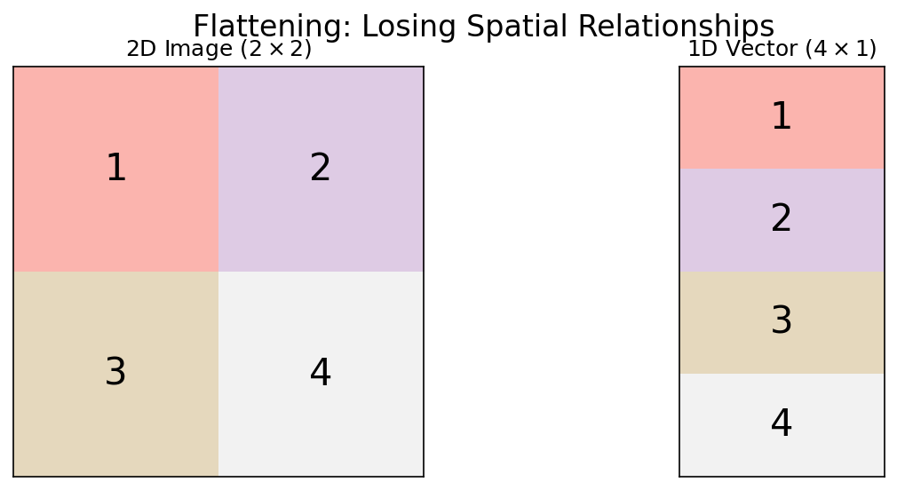
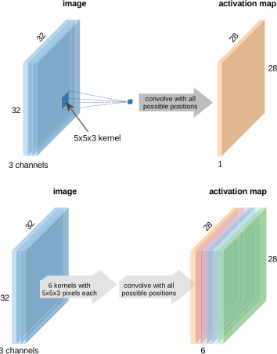
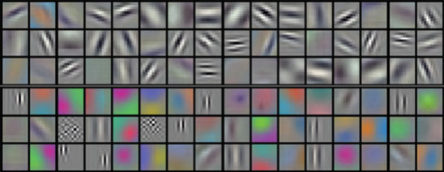
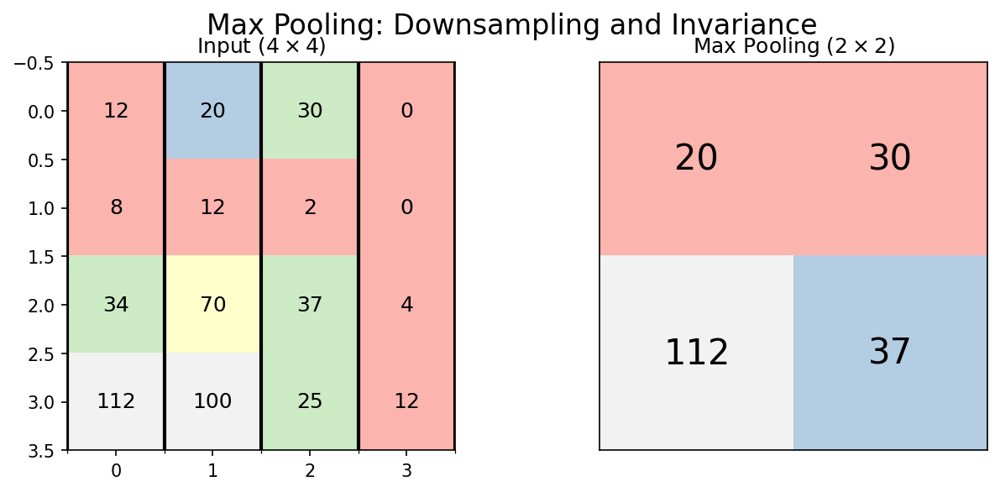
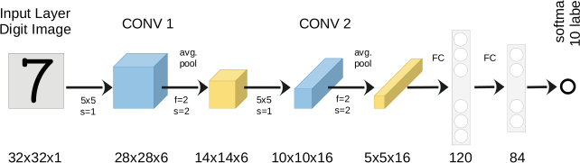
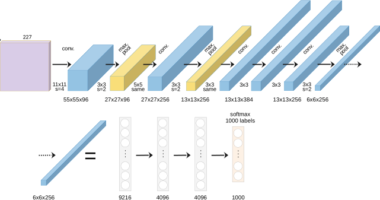
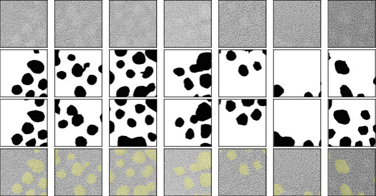
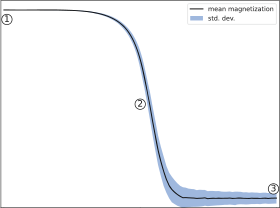

## 01. From Vectors to Images

::: {.fragment}
- Last week: Multi-Layer Perceptrons (MLPs) for tabular data
- This week: **Convolutional Neural Networks (CNNs)** for images
- Why can't we just use a standard MLP for a micrograph?
:::

::: {.fragment}
**The problem**: Images have spatial structure that MLPs destroy.
:::

## 02. Learning Outcomes

By the end of this unit, you can:

::: {.fragment}
1. Explain why MLPs fail for high-resolution images (parameter explosion)
2. Define convolution, kernels, stride, and padding
3. Explain local connectivity, weight sharing, and translation invariance
4. Distinguish between Max and Average Pooling
5. Describe key CNN architectures (LeNet, AlexNet, ResNet, U-Net)
6. Apply CNN concepts to microstructure segmentation and classification
:::

---

## {background-color="#1a1a2e"}

### Section 1: The Image Problem {style="text-align: center; margin-top: 15%;"}

*Slides 03–08*

## 03. Microscopy Data is Inherently Spatial

::: {.fragment}
Materials characterization produces diverse image data:

- **SEM**: Surface morphology (µm resolution)
- **TEM**: Atomic structure (Å resolution)
- **AFM**: Surface topography (nm resolution)
- **Optical**: Macro-scale structure (µm–mm)
:::

::: {.fragment}
All share a common property: **nearby pixels are correlated** — physics ensures spatial continuity.
:::

## 04. The Parameter Explosion (I)

::: {.fragment}
**Example**: A modest $64 \times 64$ image

- Input size: $64 \times 64 = 4{,}096$ pixels
- One hidden layer with 512 neurons
- Parameters: $4{,}096 \times 512 = \mathbf{2.1 \text{ million}}$ weights
:::

::: {.fragment}
This is already large. But real micrographs are much bigger...
:::

## 05. The Parameter Explosion (II)

::: {.fragment}
**Realistic example**: A $1024 \times 1024$ SEM image

- Input size: $1{,}048{,}576$ pixels
- One hidden layer with 512 neurons
- Parameters: $1{,}048{,}576 \times 512 = \mathbf{537 \text{ million}}$ weights
- Memory: ~4 GB just for one layer!
:::

::: {.callout-note}
With only 100 training images, a 537M parameter model will memorize every sample perfectly — and generalize to nothing.
:::

## 06. Loss of Spatial Structure

::: {.fragment}
- MLPs flatten images into 1D vectors: pixel (0,0), pixel (0,1), ...
- **Result**: Neighboring pixels (same grain) are treated identically to distant pixels (different phases)
- The spatial correlation — the key physical information — is destroyed
:::

::: {.fragment}
{width=80%}
:::

## 07. The Translation Problem

::: {.fragment}
- If a precipitate moves 5 pixels to the right, the MLP sees a **completely different** input pattern
- It must relearn the precipitate at every possible position
- This is hopelessly wasteful — the same feature appears everywhere in the image
:::

::: {.fragment}
**What we want**: A feature detector that works the same way regardless of position — **translation invariance**.
:::

## 08. Section 1 Recap

::: {.fragment}
1. Microscopy images have **spatial structure** that encodes physics
2. MLPs suffer a **parameter explosion** on high-resolution images
3. Flattening **destroys spatial relationships**
4. We need **translation-invariant** feature detection
5. The solution: **Convolutional Neural Networks**
:::

---

## {background-color="#1a1a2e"}

### Section 2: The Convolution Layer {style="text-align: center; margin-top: 15%;"}

*Slides 09–20*

## 09. Convolution: The Core Idea

::: {.fragment}
- Slide a small "window" (**kernel/filter**) over the image
- At each position, compute a weighted sum
- The output is a **feature map**: a new image highlighting specific patterns
:::

::: {.fragment}
```{mermaid}
graph LR
    I["Input Image"] --> K["Kernel<br>(3×3)"]
    K --> FM["Feature Map<br>(detected edges)"]
```
:::

## 10. The Discrete Convolution Formula

::: {.fragment}
$$(I * K)_{m,n} = \sum_{i}\sum_{j} I_{m-i,\, n-j} \cdot K_{i,j}$$

- $I$: input image
- $K$: kernel (filter) — typically $3 \times 3$ or $5 \times 5$
- The kernel slides across the image, computing element-wise products and summing
:::

## 11. Visualizing the Sliding Window

::: {.fragment}
{width=80%}
:::

::: {.fragment}
- Input: $5 \times 5$ image
- Kernel: $3 \times 3$
- Output: $3 \times 3$ feature map (without padding)
- Each output pixel "sees" a $3 \times 3$ local neighborhood
:::

## 12. The Feature Map

::: {.fragment}
- The output of one convolution is called a **feature map**
- Each pixel in the feature map represents how strongly the kernel's pattern was detected at that location
- High values = strong match. Low values = weak match.
:::

::: {.fragment}
A single kernel produces one feature map. We use **multiple kernels** to detect multiple features simultaneously.
:::

## 13. Kernels as Feature Detectors (I)

::: {.columns}
::: {.column width="50%"}
::: {.fragment}
**Edge detection** (Laplacian):

$$K = \begin{pmatrix} 0 & -1 & 0 \\ -1 & 4 & -1 \\ 0 & -1 & 0 \end{pmatrix}$$

Highlights boundaries between regions.
:::
:::

::: {.column width="50%"}
::: {.fragment}
**Blur** (Gaussian):

$$K = \frac{1}{16}\begin{pmatrix} 1 & 2 & 1 \\ 2 & 4 & 2 \\ 1 & 2 & 1 \end{pmatrix}$$

Smooths noise by averaging neighbors.
:::
:::
:::

## 14. Kernels as Feature Detectors (II)

::: {.fragment}
**Horizontal edges**:
$$K_h = \begin{pmatrix} -1 & -1 & -1 \\ 0 & 0 & 0 \\ 1 & 1 & 1 \end{pmatrix}$$

**Vertical edges**:
$$K_v = \begin{pmatrix} -1 & 0 & 1 \\ -1 & 0 & 1 \\ -1 & 0 & 1 \end{pmatrix}$$
:::

::: {.fragment}
**In a CNN**: The network discovers that these filters (and many others) are useful for the task — automatically, from data.
:::

## 15. Stride: Controlling the Step Size

::: {.fragment}
- **Stride** = how many pixels the kernel moves at each step
- Stride 1: kernel moves one pixel → output nearly same size as input
- Stride 2: kernel moves two pixels → output is half the size
:::

::: {.fragment}
Higher stride = faster computation, lower resolution output. A design trade-off.
:::

## 16. Padding: Preserving Image Size

::: {.fragment}
- Without padding, a $3 \times 3$ kernel on a $W \times W$ image produces $(W-2) \times (W-2)$
- Images **shrink** after each convolution!
:::

::: {.fragment}
- **"Valid" padding**: No padding, output shrinks
- **"Same" padding**: Add zeros at borders → output size = input size
- Same padding is the standard in most architectures
:::

## 17. Think About This: Parameter Savings

::: {.fragment}
**Compare**: Processing a $1024 \times 1024$ image

| Approach | Parameters |
|:---|:---|
| MLP (512 hidden units) | 537 million |
| One $3 \times 3$ conv filter | **9** |
| 64 conv filters | **576** |
:::

::: {.fragment}
**That's a 930,000× reduction!** Weight sharing is the key: the same 9 weights are reused at every position in the image.
:::

## 18. Multi-Channel Convolution

::: {.fragment}
- Real images have **depth** (channels):
  - Grayscale: 1 channel
  - RGB: 3 channels
  - Hyperspectral: 100+ channels
  - Feature maps from previous layer: $C$ channels
:::

::: {.fragment}
A kernel on multi-channel input has shape $C \times k \times k$. It sums across all channels.
:::

::: {.fragment}
{width=80%}
:::

## 19. Activation in CNNs

::: {.fragment}
After each convolution, apply a non-linear activation:

$$\text{Feature Map} = \text{ReLU}(I * K + b)$$

- ReLU keeps only positive activations: "this feature is present here"
- Same activation functions as in MLPs (Unit 4)
:::

## 20. Section 2 Recap

::: {.fragment}
1. **Convolution** = sliding a kernel over the image, computing local weighted sums
2. **Kernels** are feature detectors (edges, textures, blobs)
3. **Stride** controls spatial downsampling; **padding** preserves size
4. **Weight sharing** reduces parameters by 5-6 orders of magnitude vs. MLPs
5. **Multi-channel** convolution enables combining features across depth
:::

---

## {background-color="#1a1a2e"}

### Section 3: Architectural Principles {style="text-align: center; margin-top: 15%;"}

*Slides 21–30*

## 21. Local Connectivity

::: {.fragment}
- Each neuron in a conv layer "sees" only a **small local patch** of the input
- A $3 \times 3$ kernel means each output pixel depends on only 9 input pixels
- **Physical justification**: Features in micrographs are local (grain boundaries, precipitates)
:::

## 22. Weight Sharing

::: {.fragment}
- The **same kernel** is used at every spatial position
- One set of weights → applied millions of times
- **Assumption**: A feature that's useful in one part of the image is useful everywhere
:::

::: {.callout-note}
Weight sharing encodes translation invariance into the architecture — we don't need to learn the same feature at every position.
:::

## 23. Translation Invariance vs. Equivariance

::: {.columns}
::: {.column width="50%"}
::: {.fragment}
**Translation Equivariance**:

If the input shifts, the feature map shifts by the same amount.

*Conv layers are equivariant.*
:::
:::

::: {.column width="50%"}
::: {.fragment}
**Translation Invariance**:

The output doesn't change when the input shifts.

*Classification layers (after pooling + flattening) are invariant.*
:::
:::
:::

::: {.fragment}
Equivariance preserves "where" the feature is. Invariance discards "where" and keeps only "what."
:::

## 24. The Concept of Depth

::: {.fragment}
- Each conv layer has multiple filters → multiple feature maps
- The **number of filters** per layer is called the layer's "depth" or "channels"
- Typical progression: 64 → 128 → 256 → 512 channels
:::

::: {.fragment}
More filters = more features detected. But also more parameters and computation.
:::

## 25. The Receptive Field (I)

::: {.fragment}
- **Receptive field**: The region of the input image that influences a specific output neuron
- A single $3 \times 3$ conv layer: receptive field = $3 \times 3$
- Two stacked $3 \times 3$ layers: receptive field = $5 \times 5$
- Three stacked layers: receptive field = $7 \times 7$
:::

## 26. The Receptive Field (II)

::: {.fragment}
**With stride and pooling**, the receptive field grows faster:

$$r_{\text{eff}} = r + (k - 1) \times \prod_{i} s_i$$

where $k$ is kernel size and $s_i$ are strides of preceding layers.
:::

::: {.fragment}
**Design rule**: The receptive field should be large enough to "see" the features you want to detect. Grain boundary detection needs at least grain-sized receptive fields.
:::

## 27. The Hierarchy of Features

::: {.fragment}
- **Layer 1**: Simple edges, dots, intensity gradients
- **Layer 2**: Textures, corners, simple shapes (grain boundary segments)
- **Layer 3**: Complex morphologies (dendrites, twins, precipitate clusters)
- **Final layers**: Global material state or classification
:::

::: {.fragment}
{width=80%}
:::

## 28. Full CNN Anatomy

::: {.fragment}
```{mermaid}
graph LR
    I["Input<br>Micrograph"] --> C1["Conv + ReLU<br>(64 filters)"]
    C1 --> P1["MaxPool<br>(2×2)"]
    P1 --> C2["Conv + ReLU<br>(128 filters)"]
    C2 --> P2["MaxPool<br>(2×2)"]
    P2 --> C3["Conv + ReLU<br>(256 filters)"]
    C3 --> F["Flatten"]
    F --> FC["FC Layers"]
    FC --> O["Output<br>(Phase A/B)"]
```
:::

::: {.fragment}
1. **Feature Extractor**: Alternating Conv + Pooling layers
2. **Classifier**: Flatten → Fully Connected → Output
:::

## 29. Think About This: Designing a CNN

::: {.fragment}
**Task**: You need to classify microstructure images as "martensitic" or "ferritic." Your images are $256 \times 256$ grayscale. You have 200 labeled images.

What's your concern?
:::

::: {.fragment}
**Answer**: 200 images is far too few to train a CNN from scratch. Even a modest CNN has millions of parameters. You'll need **transfer learning** (Unit 6) or **data augmentation**. Start with the simplest possible model.
:::

## 30. Section 3 Recap

::: {.fragment}
1. **Local connectivity**: Each neuron sees only a small patch
2. **Weight sharing**: Same kernel everywhere → massive parameter reduction
3. **Translation equivariance/invariance**: Features detected regardless of position
4. **Receptive field**: Grows with depth — must match feature scale
5. **Feature hierarchy**: Edges → textures → morphologies → classification
:::

---

## {background-color="#1a1a2e"}

### Section 4: The Pooling Layer {style="text-align: center; margin-top: 15%;"}

*Slides 31–38*

## 31. Why Pool?

::: {.fragment}
- **Downsampling**: Reduce spatial dimensions → less computation
- **Noise robustness**: Small pixel shifts don't change the output
- **Increase receptive field**: Each pixel in the pooled output covers a larger input region
:::

## 32. Max Pooling

::: {.fragment}
- Take the **maximum** value in each window (typically $2 \times 2$)
- Preserves the **strongest** signal in each region
- Spatial size: halved in each dimension
:::

::: {.fragment}
$$\text{MaxPool}(x)_{m,n} = \max_{i,j \in \text{window}} x_{m+i, n+j}$$

{width=80%}
:::

## 33. Average Pooling

::: {.fragment}
- Take the **mean** value in each window
- Preserves the **overall** signal level
- Less aggressive than max pooling — retains more information about intensity
:::

::: {.fragment}
$$\text{AvgPool}(x)_{m,n} = \frac{1}{|W|}\sum_{i,j \in \text{window}} x_{m+i, n+j}$$
:::

::: {.fragment}
Used more often in later layers. **Global Average Pooling** (over the entire feature map) is standard for the final layer of modern architectures.
:::

## 34. Pooling and Shift Invariance

::: {.fragment}
- If the input shifts by 1 pixel, the feature map shifts by 1 pixel
- After $2 \times 2$ max pooling: a 1-pixel shift may produce the **same** output
- Pooling provides **approximate** translation invariance
:::

::: {.fragment}
**Materials implication**: A precipitate at pixel (50, 50) and one at pixel (51, 51) produce the same classification — which is physically correct.
:::

## 35. The Conv-Pool Block

::: {.fragment}
The standard building block of CNNs:

$$\text{Input} \xrightarrow{\text{Conv}} \xrightarrow{\text{ReLU}} \xrightarrow{\text{Pool}} \text{Output}$$

Typically repeated 3-5 times, with increasing filter count:
:::

::: {.fragment}
| Block | Filters | Spatial Size (from 256×256) |
|:---:|:---:|:---:|
| 1 | 64 | 128×128 |
| 2 | 128 | 64×64 |
| 3 | 256 | 32×32 |
| 4 | 512 | 16×16 |
:::

## 36. Hierarchical Features: From Edges to Phases

::: {.columns}
::: {.column width="50%"}
::: {.fragment}
**Early layers** (Block 1-2):

- Edges, intensity gradients
- Grain boundary segments
- Local texture patterns
:::
:::

::: {.column width="50%"}
::: {.fragment}
**Deep layers** (Block 3-4):

- Grain shapes, phase morphologies
- Precipitate distributions
- Global arrangement patterns
:::
:::
:::

::: {.fragment}
{width=80%}
:::

## 37. Visualizing What CNNs See

::: {.fragment}
- **Filter visualization**: What pattern does each kernel respond to?
- **Activation maps**: Where in the image does each filter activate strongly?
- **Grad-CAM**: Which regions are most important for the classification?
:::

::: {.fragment}
These visualization tools are essential for **scientific trust** — they answer: "What is the CNN actually looking at?"
:::

## 38. Section 4 Recap

::: {.fragment}
1. **Max pooling** preserves strongest activations; **average pooling** preserves overall intensity
2. Pooling provides **downsampling** and **approximate shift invariance**
3. The **Conv-Pool block** is the standard building unit
4. Features progress from **edges** to **morphologies** to **classifications**
5. **Visualization tools** (Grad-CAM) verify the network's reasoning
:::

---

## {background-color="#1a1a2e"}

### Section 5: Key Architectures {style="text-align: center; margin-top: 15%;"}

*Slides 39–44*

## 39. LeNet-5 (1995): The Ancestor

::: {.fragment}
- **Yann LeCun**: Handwritten digit recognition (postal codes)
- Architecture: 2 conv layers → 2 pooling → 3 FC layers
- Only ~60K parameters — tiny by modern standards
:::

::: {.fragment}
{width=80%}
:::

::: {.fragment}
**Legacy**: Proved that learned features outperform hand-crafted features for vision tasks.
:::

## 40. AlexNet (2012): The Deep Learning Revolution

::: {.fragment}
- Won ImageNet competition by a **massive margin** (15.3% vs. 26.2% error)
- Key innovations:
  - **ReLU** activation (fast training, no vanishing gradients)
  - **Dropout** regularization (prevents overfitting)
  - **GPU training** (made deep networks practical)
  - 60 million parameters, 8 layers
:::

::: {.fragment}
{width=80%}
:::

## 41. Going Deeper: The Vanishing Gradient Problem

::: {.fragment}
- After AlexNet: let's just add more layers!
- **Problem**: Very deep networks (20+ layers) **stop learning**
- Gradients vanish as they flow through many layers
- Training loss plateaus — the network can't be trained effectively
:::

::: {.fragment}
Deeper is not always better... unless you have a trick.
:::

## 42. ResNet (2015): Skip Connections

::: {.fragment}
**The Residual Block**:

$$\mathbf{y} = F(\mathbf{x}) + \mathbf{x}$$

- Instead of learning $\mathbf{y} = F(\mathbf{x})$, learn the **residual** $F(\mathbf{x}) = \mathbf{y} - \mathbf{x}$
- The skip connection $+ \mathbf{x}$ provides a gradient highway
:::

::: {.fragment}
```{mermaid}
graph LR
    X["x"] --> C1["Conv + ReLU"]
    C1 --> C2["Conv"]
    X -- "Skip<br>Connection" --> ADD["+ "]
    C2 --> ADD
    ADD --> R["ReLU"]
    R --> Y["y = F(x) + x"]
```
:::

::: {.callout-note}
ResNet enabled networks with 100+ layers. The 2015 ImageNet winner had **152 layers**.
:::

## 43. U-Net: Segmentation Architecture

::: {.fragment}
- Designed for **pixel-level** classification (semantic segmentation)
- **Encoder**: Downsampling path (like a normal CNN)
- **Decoder**: Upsampling path (restores spatial resolution)
- **Skip connections**: Connect encoder to decoder at each level
:::

::: {.fragment}
```{mermaid}
graph TD
    I["Input Image"] --> E1["Encoder 1<br>(↓ 256)"]
    E1 --> E2["Encoder 2<br>(↓ 128)"]
    E2 --> B["Bottleneck<br>(64)"]
    B --> D2["Decoder 2<br>(↑ 128)"]
    D2 --> D1["Decoder 1<br>(↑ 256)"]
    D1 --> O["Output Mask"]
    E1 -. "skip" .-> D1
    E2 -. "skip" .-> D2
```
:::

## 44. Section 5 Recap

::: {.fragment}
| Architecture | Year | Innovation | Use Case |
|:---|:---:|:---|:---|
| **LeNet** | 1995 | Learned filters | Digit recognition |
| **AlexNet** | 2012 | ReLU, Dropout, GPU | Image classification |
| **ResNet** | 2015 | Skip connections | Very deep networks |
| **U-Net** | 2015 | Encoder-Decoder | Pixel segmentation |
:::

---

## {background-color="#1a1a2e"}

### Section 6: Materials Science Case Studies {style="text-align: center; margin-top: 15%;"}

*Slides 45–50*

## 45. Case Study: Phase Segmentation in TEM

::: {.fragment}
- **Task**: Segment crystalline Au nanoparticles from amorphous background
- **Method**: U-Net trained on labeled TEM frames
- **Challenge**: Limited labeled data, noisy images, beam damage
:::

::: {.fragment}
{width=80%}
:::

## 46. Case Study: Synthetic Training Data

::: {.fragment}
- **Problem**: No labeled SEM grain microstructures available
- **Solution**: Generate synthetic grain structures using **Voronoi tessellations**
- Parameters: number of seeds, regularity, boundary thickness
- **Result**: Perfect labels for free — no expert annotation needed!
:::

::: {.fragment}
{width=80%}
:::

## 47. Case Study: Synthetic-to-Real Transfer

::: {.fragment}
- Train **only** on Voronoi synthetic data
- Test on **real** polycrystalline SEM images
- **Result**: Nearly perfect grain boundary segmentation!
:::

::: {.fragment}
The synthetic data captured the **topological truth** of grain networks — the CNN learned grain boundary detection without ever seeing a real micrograph.
:::

::: {.fragment}
{width=80%}
:::

## 48. Case Study: Property Prediction from Microstructure

::: {.fragment}
- **Task**: Classify Ising model microstructures by simulation temperature
- **Input**: 2D spin configurations (binary images)
- **Method**: CNN classifier trained on labeled configurations
- **Result**: CNN learns to detect the phase transition temperature from microstructure alone
:::

::: {.fragment}
{width=80%}
:::

## 49. Current Challenges

::: {.fragment}
- **Data scarcity**: 50 labeled micrographs vs. 14M ImageNet images
- **Domain gap**: Natural images ≠ micrographs (contrast, texture, noise)
- **3D structures from 2D sections**: Stereological sampling bias persists
- **Interpretability**: What does the CNN actually learn?
:::

::: {.fragment}
**Next week**: Strategies to overcome data scarcity — Transfer Learning, Augmentation, and Synthetic Data.
:::

## 50. Unit 5 Summary & Next Steps

::: {.fragment}
**Key Takeaways:**

1. **Convolutions** exploit spatial locality with shared weights
2. **Weight sharing** reduces parameters by orders of magnitude
3. **Pooling** provides downsampling and shift invariance
4. **Feature hierarchies**: edges → textures → morphologies → properties
5. **U-Net** is the standard for microstructure segmentation
:::

::: {.fragment}
**Reading:**

- Sandfeld (2024): Ch. 19 (CNNs) [@sandfeld_materials_data_science]
- McClarren (2021): Ch. 6 (CNNs) [@mcclarren2021machine]
:::

::: {.fragment}
**Next Week**: Unit 6 — Data Scarcity, Transfer Learning & Synthetic Data
:::

---

## References

::: {#refs}
:::
