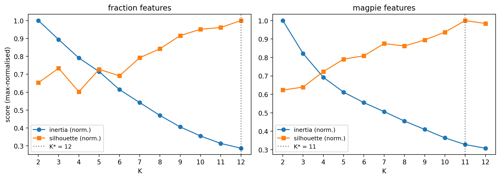
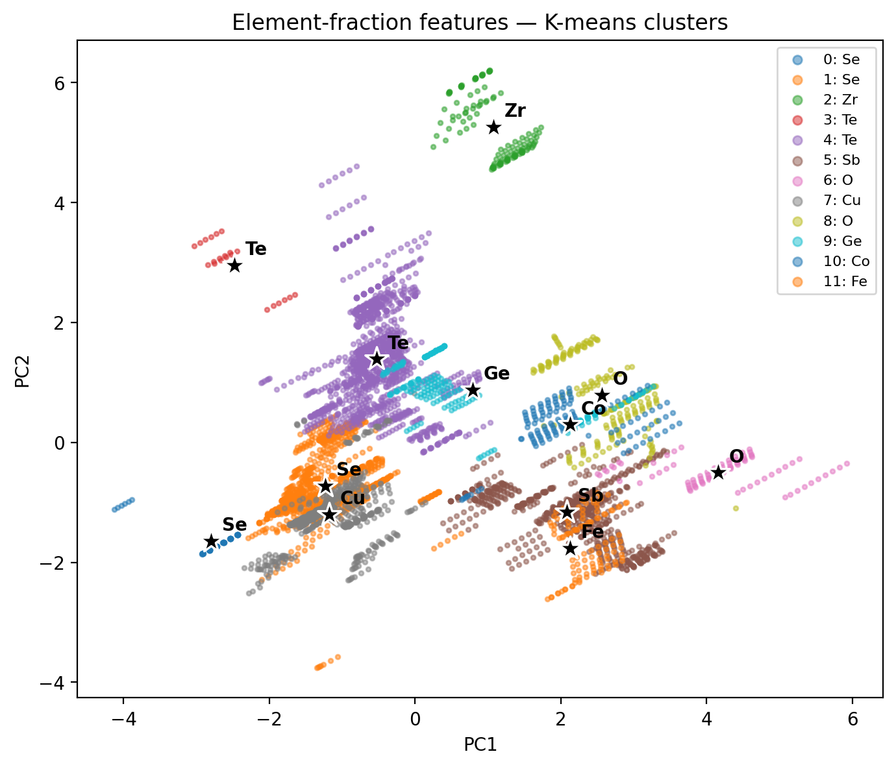
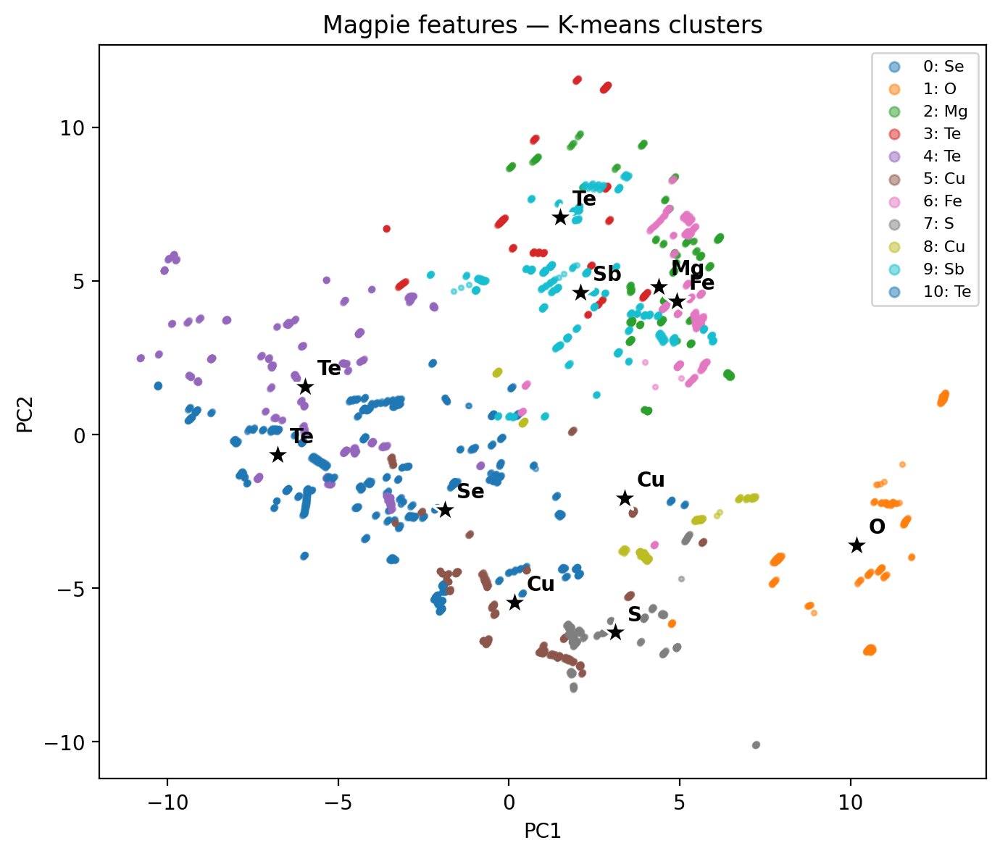
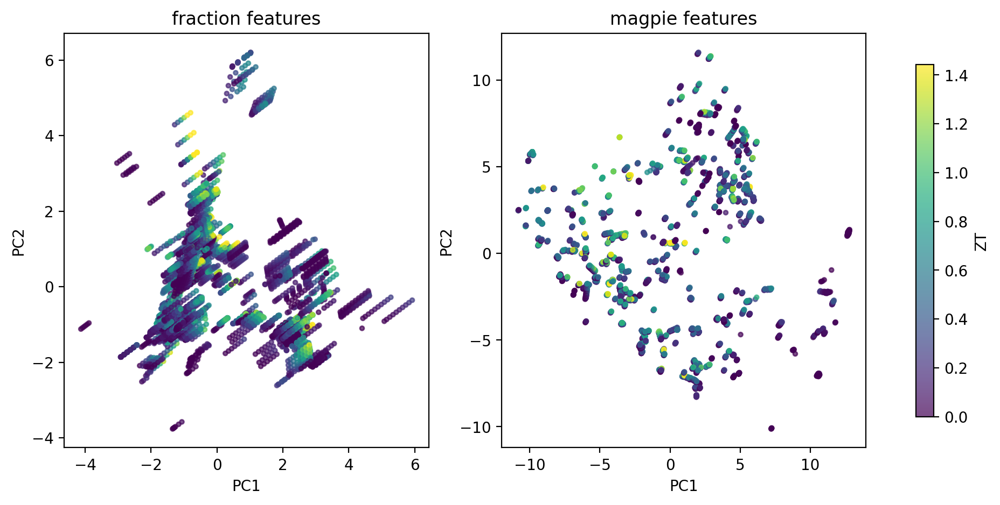
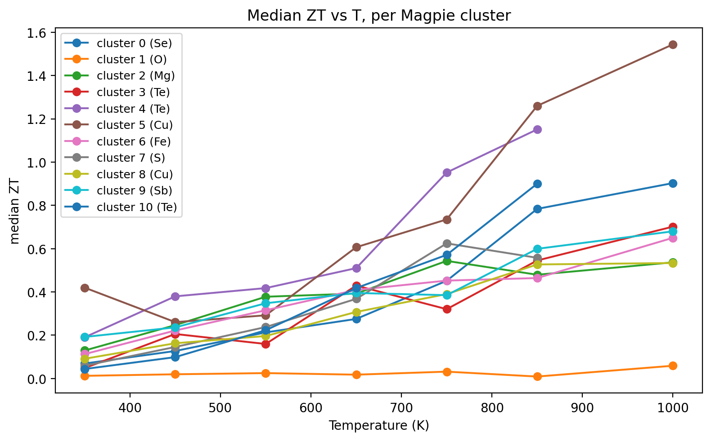
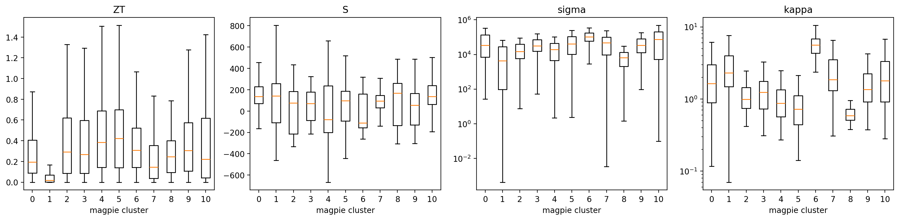
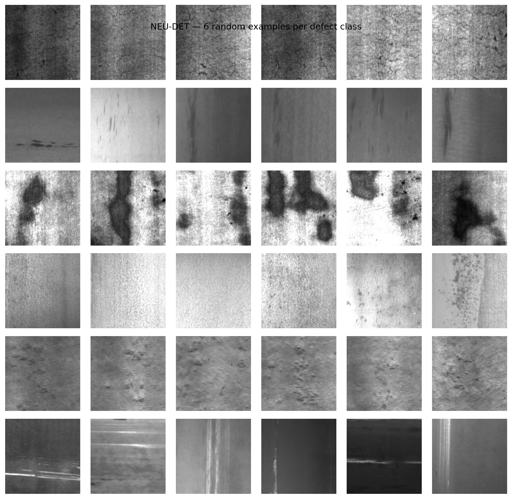
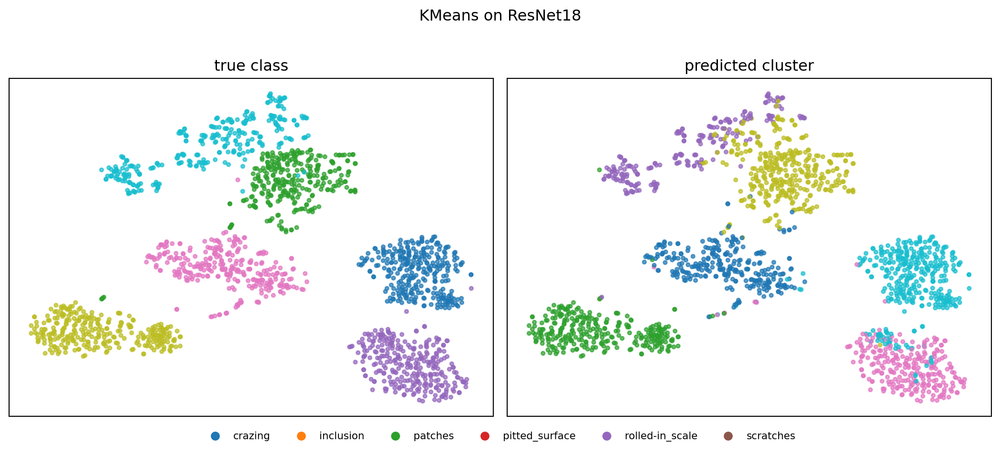
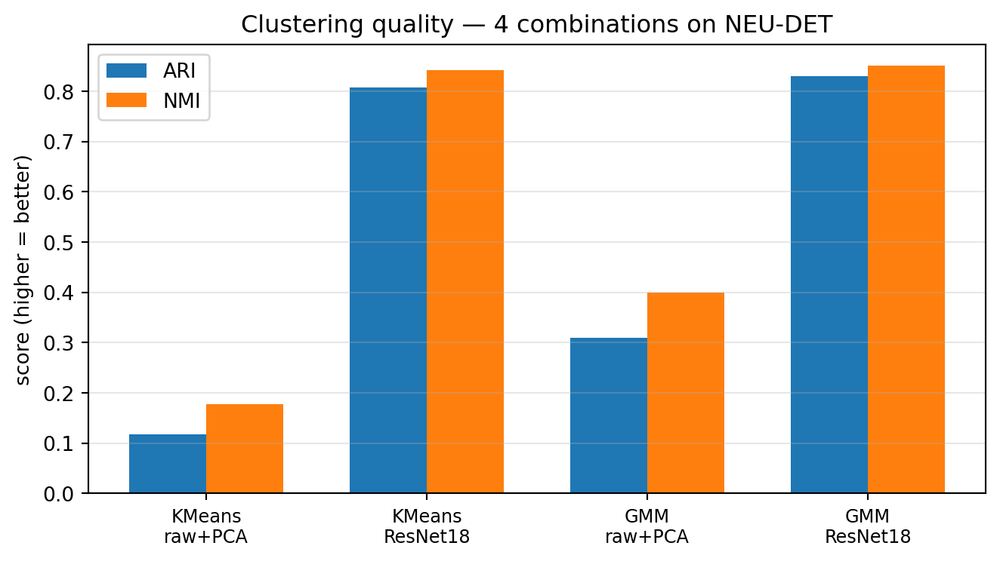
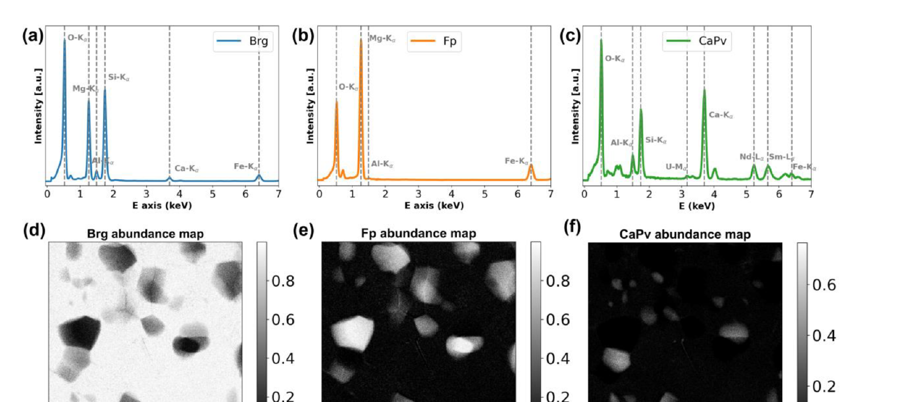

# §0 · Frame {.section}

## 03. Learning Outcomes

By the end of 90 minutes, you can:

::: {.columns}
::: {.column width="50%"}
::: {.fragment}
1. Apply **K-means and GMM** to materials descriptors and choose $k$ defensibly (elbow / silhouette / BIC).
2. Cluster **CNN embeddings** for unsupervised phase discovery on micrographs.
3. Cluster **hyperspectral datacubes** (EELS / EDS / XRF) into spatial phase maps.
:::
:::
::: {.column width="50%"}
::: {.fragment}
4. Build a **convolutional autoencoder** for denoising, compression, and label-efficient regression.
5. Deploy **AE reconstruction error** as an anomaly score with a defensible threshold.
6. Articulate **what the AE bottleneck $z$ is** — anticipating the W9 latent-space view and W11 generative use.
:::
:::
:::

::: {.notes}
**Frame the exam contract.** Outcomes 1, 4, 5 are exam-weight; outcomes 2, 3, 6 are skill-weight (the exercise tests them, the exam may probe their reasoning).

**Five "must-know" statements that come up in the exam (introduce now, repeat at the end).**

1. K-means assigns each point to its nearest centroid; GMM gives soft posterior assignments via EM.
2. The number of clusters $k$ must be *chosen from validation diagnostics* (elbow, silhouette, BIC) — never assumed.
3. A frozen pretrained CNN can serve as a feature extractor; clustering its embeddings *discovers structure without labels*.
4. A convolutional autoencoder is trained by minimizing reconstruction error; the bottleneck imposes the inductive bias.
5. AE-based anomaly detection requires a *clean nominal* training set; thresholds come from nominal validation error, never from anomaly examples.

**Tell them where outcome 6 lives.** Outcome 6 is a "you-will-not-get-it-today, but you will be glad you heard it once before W9" outcome. Bottleneck = compressed representation = manifold coordinate. Today we just hold that thought.
:::

# §A · Classical Clustering on Materials Descriptors {.section}

## 05. K-means Recap (1/2): Lloyd's Iteration

::: {.columns}
::: {.column width="50%"}
**Objective**

$$\min_{\{\mu_k\}, \{c_i\}} \sum_{i=1}^{N} \|\mathbf{x}_i - \mu_{c_i}\|_2^2$$

- $c_i \in \{1, \dots, k\}$: hard assignment of point $i$.
- $\mu_k$: centroid of cluster $k$.
:::
::: {.column width="50%"}
**Lloyd's iteration — assignment step**

- For each point $\mathbf{x}_i$, assign:
  $$c_i \leftarrow \arg\min_k \|\mathbf{x}_i - \mu_k\|_2^2$$
- Each point goes to its **nearest centroid** [@bishop2006pattern].
:::
:::

::: {.notes}
**The objective in plain English.** "Minimise the total squared distance from each point to the centre of its cluster." That is the only thing K-means is doing. Everything else is implementation detail.

**Why Lloyd's iteration works.** The objective is jointly non-convex in $(\mu, c)$ but is convex in each variable when the other is fixed. So we alternate: fix centroids, optimise assignments (slide 5); fix assignments, optimise centroids (slide 6). This is the simplest possible *coordinate descent* algorithm.

**MFML cross-reference.** Students should already have this from MFML W5. The notation here is identical (Bishop §9.1, slide 4-ish in the MFML deck). If you sense blank stares, pause and rederive the objective on the whiteboard for two minutes — do not bulldoze on.

**Common student question, answer in advance.** "Why $\ell_2^2$ and not $\ell_2$?" Because squared distance gives a closed-form centroid update (the mean, slide 6), and because it corresponds to a Gaussian likelihood with isotropic unit variance (we'll generalise to GMM in slides 8–9).

**Visual to draw on the whiteboard.** Two clusters in 2D, three random points, one centroid in the middle of each. Show the assignment step as Voronoi cells; show the update step as centroids hopping to the centre of mass of the cells. Two iterations and it's converged.
:::

## 06. K-means Recap (2/2): Update and Initialisation

::: {.columns}
::: {.column width="50%"}
**Update step**

- For each cluster $k$:
  $$\mu_k \leftarrow \frac{1}{|C_k|} \sum_{i \in C_k} \mathbf{x}_i$$
- The new centroid is the **mean** of its assigned points.
- Iterate until assignments stop changing.
:::
::: {.column width="50%"}
**Convergence and initialisation**

- Converges to a **local** optimum — not global.
- Sensitive to initialisation; restart from many random seeds.
- **k-means++**: spread initial centroids by sampling proportional to squared distance from already-chosen centroids.
:::
:::

::: {.fragment}
> **Practical default in `sklearn`:** `KMeans(init='k-means++', n_init=10)`. Take the best run by total inertia.
:::

::: {.notes}
**Why k-means++ matters.** Plain random init occasionally lands two centroids inside one true cluster and zero centroids in another. The greedy distance-weighted seeding from [@arthur2007kmeanspp] provably gets you within $O(\log k)$ of the optimum in expectation, and in practice fixes >95% of pathological inits.

**Hard vs soft assignment.** Lloyd's algorithm uses *hard* assignments — each point belongs to exactly one cluster. This is fine when clusters are well-separated and roughly spherical. When they're not (different sizes, overlapping, anisotropic), we need *soft* assignments — that is GMM, two slides from now.

**Failure modes to call out aloud.**

- **Different-sized clusters:** K-means tends to equalise sizes (because variance is shared). A genuine 90/10 split may come out 50/50.
- **Anisotropic clusters:** isotropic distance metric → K-means slices elongated clusters perpendicular to their long axis. Standardise features first; or move to GMM with full covariance.
- **Curse of dimensionality:** in $d \gtrsim 100$, all pairwise distances become similar → clusters lose contrast. We will hit this hard in §B with 2048-D CNN embeddings.
- **Non-convex clusters:** two crescent-shaped clusters cannot be separated by Voronoi cells. K-means breaks; try DBSCAN or spectral clustering. Out of scope today, but mention by name.

**One-line summary to leave on the board.** "K-means = mean-of-nearest-points, iterated."
:::

 
## 08. GMM as Soft K-means

::: {.columns}
::: {.column width="50%"}
**Generative model**

$$p(\mathbf{x}) = \sum_{k=1}^{K} \pi_k \, \mathcal{N}(\mathbf{x} \mid \mu_k, \Sigma_k)$$

- Each point is drawn from one of $K$ Gaussians.
- $\pi_k \geq 0$, $\sum_k \pi_k = 1$: mixing weights.
- $\Sigma_k$: per-component covariance (full / diagonal / spherical).
:::
::: {.column width="50%"}
**Posterior responsibilities**

$$\gamma_{ik} = \frac{\pi_k \, \mathcal{N}(\mathbf{x}_i \mid \mu_k, \Sigma_k)}{\sum_{j} \pi_j \, \mathcal{N}(\mathbf{x}_i \mid \mu_j, \Sigma_j)}$$

- Each point has a **soft** posterior over clusters.
- $\sum_k \gamma_{ik} = 1$; mixed-membership is allowed [@bishop2006pattern].
:::
:::

::: {.notes}
**The conceptual upgrade over K-means.** GMM is K-means *with three things added*: (1) per-cluster covariance $\Sigma_k$ — anisotropic clusters are fine; (2) soft assignments $\gamma_{ik}$ — boundary points get partial credit; (3) cluster weights $\pi_k$ — clusters can have different sizes.

**The K-means $\to$ GMM limit.** Set $\Sigma_k = \sigma^2 \mathbf{I}$ and let $\sigma \to 0$. The Gaussian densities become Dirac-like, and $\gamma_{ik}$ collapses to a one-hot vector picking the nearest centroid. So K-means is a degenerate GMM. Make sure students see this on the board — it unifies the two algorithms in one limit.

**Where GMM materially helps in materials.**

- **Phase boundary pixels** in hyperspectral maps (§C): a pixel sitting on a phase boundary is genuinely a *mixture* of two phases — soft assignment captures that.
- **Process windows** with overlapping nominal regimes — soft assignment lets a marginal melt-pool be 30% nominal, 70% keyhole rather than forced to one side.
- **Polycrystal texture distributions** where multiple ideal orientations have spread.

**Notation drift to avoid.** Some textbooks use $r_{ik}$ instead of $\gamma_{ik}$ (Bishop). MFML W5 used $\gamma_{ik}$. We stick with $\gamma_{ik}$ today. Tell the students which letter to expect on the exam.
:::

## 09. EM for GMM

::: {.columns}
::: {.column width="50%"}
**E-step (responsibilities)**

$$\gamma_{ik} \leftarrow \frac{\pi_k \, \mathcal{N}(\mathbf{x}_i \mid \mu_k, \Sigma_k)}{\sum_j \pi_j \, \mathcal{N}(\mathbf{x}_i \mid \mu_j, \Sigma_j)}$$

- Compute posterior cluster membership at current parameters.
:::
::: {.column width="50%"}
**M-step (parameter updates)**

$$N_k = \sum_i \gamma_{ik}, \quad \pi_k \leftarrow \tfrac{N_k}{N}$$

$$\mu_k \leftarrow \tfrac{1}{N_k} \sum_i \gamma_{ik} \mathbf{x}_i$$

$$\Sigma_k \leftarrow \tfrac{1}{N_k} \sum_i \gamma_{ik} (\mathbf{x}_i - \mu_k)(\mathbf{x}_i - \mu_k)^\top$$
:::
:::

::: {.fragment}
**Guarantees:** likelihood is non-decreasing each iteration; converges to a *local* maximum (Bishop §9.2; @bishop2006pattern, @murphy2012machine).
:::

::: {.notes}
**The EM idea, in one sentence.** Alternate between (E) computing the posterior given current parameters, and (M) re-fitting parameters given the posterior — each step is a closed-form weighted version of the corresponding hard-assignment step.

**Why EM and not gradient descent.** The log-likelihood of a GMM has a $\log \sum_k$ inside it that prevents clean differentiation. EM sidesteps this via Jensen's inequality, optimising a tight lower bound (the ELBO) that *is* clean. The same trick will reappear in Unit 11 (VAE) — please flag this aloud, it's worth the foreshadow.

**Three implementation gotchas to mention before students hit them in the exercise.**

- **Singular covariance:** if a Gaussian collapses onto a single point, $|\Sigma_k| \to 0$ and likelihood $\to \infty$. Add a small regulariser $\Sigma_k \to \Sigma_k + \epsilon \mathbf{I}$, or use `sklearn`'s `reg_covar`.
- **Initialisation:** GMM is even more init-sensitive than K-means. Default in `sklearn` is to seed with K-means++ for 10 iterations, then run EM. Use that default; do not try to be clever.
- **Identifiability:** the labels $k=1,2,3$ are arbitrary. Two runs may swap labels even if the partitions are identical. *Never* compare cluster IDs across runs without label-matching first (Hungarian algorithm).

**MFML reuse.** The full E-step / M-step derivation was done in MFML W5 (Jensen's inequality, $Q$-function lower bound, monotonicity of log-likelihood). Today we use the result. Anyone curious about the proof: re-read MFML W5 Lecture 5; it is twenty minutes of careful work and worth doing once.
:::


## 10. Case Study — Composition Clustering with ESTM (1/4)

::: {.columns}
::: {.column width="55%"}
**Dataset**

- **ESTM** [@na2022estm]: 5 205 experimental observations across 880 thermoelectric compounds.
- Each row = (formula, temperature $T$, Seebeck $S$, conductivity $\sigma$, thermal conductivity $\kappa$, power factor $\mathrm{PF}$, figure of merit $\mathrm{ZT}$).
- No phase labels, no class labels — just composition + physics measurements.
- Goal: discover the *families* of thermoelectric materials, then rank families by ZT.

**The new question: what is the feature vector for a *compound*?**

- Grain morphology (slide 7) had three obvious geometric numbers per object.
- A compound is a *string* — `Bi₂Te₃`, `PbTe`, `Yb₀.₃Co₄Sb₁₂`. Not yet a vector.
- Two standard choices, contrasted on the right.
:::
::: {.column width="45%"}
**Two composition featurizations**

- **Element fractions.** 118-D one-hot-like vector + $T$ → 119-D. Sparse: most rows touch 2–4 elements out of 118.
- **Magpie descriptors** [@ward2016magpie]. 132 physics-aware statistics over the present elements (mean atomic mass, mean electronegativity, mean valence-shell occupancy, mean atomic radius, …) + $T$ → 133-D. Dense.
- Same K-means, same standardisation, same data — *only the feature map changes*. That is the experiment.
- Reproducible at `notebooks/MLPC/week05_clustering_estm.qmd`.
:::
:::

::: {.notes}
**Why this case study sits here.** Slide 7 gave you the "low-dim, hand-picked geometric features" worked example with three obvious numbers; ESTM is the bridge: a real, public materials database where the feature space is *not* obvious, and the featurization design choice will dominate the result. Once students see this, the §B claim ("representation beats algorithm" on micrographs) lands without resistance.

**The MG cross-reference.** Students in the Materials Genomics course saw composition descriptors in MG W5 (chemical-elements descriptors → regression). Today we reuse the same descriptors *for clustering* — different downstream task, same featurization machinery. Make that link aloud; it costs nothing and saves twenty minutes for the dual-enrolled students.

**What ESTM is and isn't.** It *is* experimental: every row was measured in a lab, not predicted by DFT. It *isn't* clean: temperatures span 100–1100 K, properties span six orders of magnitude in $\sigma$, and the same compound is often measured many times at different $T$. Treat it as a real dataset, not a textbook.

**Anchor the discovery framing.** Na & Chang's motivation was *extrapolation*: cluster the known materials, then ask which clusters concentrate high ZT, then go synthesise more of those. We will reproduce the first two steps today; the synthesis step is the field's open problem.

**Forward link to §B (slide 13+).** The next major question of this lecture is "can we *learn* the feature map instead of hand-designing it?" That is what frozen-CNN embeddings do on images. ESTM gives us the hand-designed baseline against which the learned representations are judged. Say this out loud: "Magpie is to ResNet18 what a phenomenological fit is to a neural network — both work, one took 30 years of materials-science intuition to design, the other was trained on cats and dogs."
:::

## 11. ESTM — Picking K Without a Clean Elbow (2/4)

::: {.columns}
::: {.column width="55%"}
{width=100%}

::: {.fragment}
> When silhouette is monotonic and inertia has no elbow, the data lacks discrete groups in this representation. Pick $K$ honestly, then **validate clusters by what they contain** (next two slides).
:::

:::
::: {.column width="45%"}
**What the diagnostics say**

- Silhouette never *peaks* — it just keeps climbing as $K$ grows.
- Inertia falls smoothly, no clean elbow either.
- Argmax silhouette: $K^* = 12$ (fractions), $K^* = 11$ (Magpie).
- These are **working hypotheses**, not "the answer".

**Two more numbers worth saying aloud**

- Fraction-feature PCA-10 captures **29.5 %** of variance.
- Magpie-feature PCA-10 captures **77.6 %**.
- First quantitative hint that featurization changes the geometry of the data, not just its labels.


:::
:::

::: {.notes}
**The honesty moment.** Slide 9 told you to choose $K$ from elbow / silhouette / BIC; the simple worked examples on slides 7–9 showed that working perfectly. *This slide shows what to do when it doesn't.* Silhouette monotonically increases on real composition data because the underlying material space is more continuous than discrete. We don't fudge — we report $K^*$, label it a hypothesis, and validate downstream.

**Why monotonic silhouette is not a bug.** It is geometrically what happens when clusters live on a low-dimensional manifold rather than as separated blobs. Smaller $K$ groups points across the manifold; larger $K$ slices the manifold finer; each slice is locally compact, so silhouette rewards bigger $K$ indefinitely. Forward to slide 12 (when clustering is the wrong tool) — this is exactly the diagnostic that triggers the warning. We proceed anyway today because the *cluster contents* turn out to be meaningful (slide 11b), but a less generous reader would call it.

**The 29 % vs 78 % is the headline.** Standardised PCA-10 captures more than twice the variance on Magpie features than on raw fractions. That means the data lives in a much lower-dimensional subspace when expressed in physics-aware coordinates. This is the same lesson as "PCA on raw pixels vs PCA on ResNet18 embeddings" (slide 20) — featurization can collapse intrinsic dimension. Say it once now, students will recognise it when it returns in §B.

**Connecting back to slide 7.** "We z-scored both feature sets before PCA and K-means, same as the grain-morphology example. The recipe is identical; only the feature *map* differs."

**Practical pitfall to mention before the exercise.** Students will be tempted to pick $K = 2$ or $K = 3$ because "those are the clusters I expect" (e.g. PbTe-like / Bi₂Te₃-like / SnSe-like). The diagnostic doesn't support that; the data is finer-grained. Trust the diagnostic, not your prior. Slide 11b will show why $K \sim 10$ is the right resolution: cluster identity tracks thermoelectric *family*, of which there are roughly that many in the experimental literature (chalcogenides, skutterudites, half-Heuslers, Zintl phases, oxide thermoelectrics, silicides, clathrates, …).
:::

## 11a. ESTM — Featurization Shapes the Cluster Map (3/4)

::: {.columns}
::: {.column width="50%"}
{width=100%}
:::
::: {.column width="50%"}
{width=100%}
:::
:::

::: {.fragment}
> **Same 5 205 compounds, same K-means, two different feature maps → two different cluster geometries.** Featurization design has bigger impact than the choice of $K$.
:::

::: {.notes}
**Read the two scatters aloud.**

*Left (fractions):* Clusters separate by **which single element dominates** — a Bi cluster, a Pb cluster, a Sn cluster, etc. This is shallow chemistry: the algorithm has rediscovered that materials containing element X cluster together. Useful, but not insightful.

*Right (Magpie):* Clusters separate by **physical character** of the composition — typical atomic mass, mean electronegativity, valence-shell occupancy. The same compound can move clusters between the two views, because "what element dominates" and "what is the mean atomic mass" are different questions. The Magpie clusters mix elements but share *physics*.

**The "representation beats algorithm" claim in classical clothing.** Slide 22 will say the same thing with ResNet18 on micrographs (ARI 0.12 → 0.81). ESTM says it now with hand-designed Magpie features on compositions — no deep learning required. Two different domains, same lesson. Make that explicit aloud: "The choice between fraction-features and Magpie-features is the materials-science analogue of choosing between raw pixels and CNN embeddings."

**Standardisation, again.** Both pipelines z-scored the features before PCA and clustering. If we had skipped this on Magpie, mean atomic mass (range $\sim$10–200) would have dominated the distances and we'd have got a 1-D mass spectrum back. This is the single most common bug — same warning as slide 7, said for the third time.

**Why this matters for the exercise.** The afternoon exercise asks students to build a clustering pipeline for *their own* dataset. The decision they will agonise over is "which features?" — not "which K?", and not "K-means or GMM?". This slide gives them permission to spend most of their time on featurization.

**Forward to slide 11b.** "We've shown the clusters are geometrically different in the two views — but are either of them *meaningful*? Property enrichment, next."
:::

## 11b. ESTM — Clusters Concentrate ZT in Specific T Windows (4/4)

::: {.columns}
::: {.column width="50%"}
{width=70%}

{width=70%}
:::
::: {.column width="50%"}
{width=100%}

::: {.fragment}
**Discovery signal**

- A handful of Magpie clusters carry >2× the median ZT of the full dataset.
- Cluster T-profiles separate low-$T$ chalcogenides from high-$T$ skutterudites / half-Heuslers.
- Cluster $\equiv$ **operating window**: a shortlist for synthesis in a target $T$ range.
- One step short of @na2022estm's SIMD descriptor, which *learns* the cluster-aware projection — preview of Unit 9 latent spaces.
:::
:::
:::

::: {.notes}
**Headline to say out loud.** "We did not give the algorithm a single property value — only composition + temperature. And yet a small number of the clusters it found happen to contain the high-ZT entries. The features encoded enough physics that materials with similar transport properties ended up in the same cluster."

**Reading the three figures.**

- *Top-left (PCA-by-ZT):* Visual gut check. Compare the bright (high-ZT) regions in the Magpie panel to the cluster boundaries from slide 11a. They align — that is the discovery signal. The fraction panel is murkier; high-ZT is more dispersed across element-dominated clusters.
- *Right (boxplots):* The rigorous version of the same claim. For each cluster, ZT/S/σ/κ are summarised as boxplots. Some cluster IDs concentrate ZT far above the dataset median; others sit at near-zero ZT. The cluster is now a **property-enriched subset**.
- *Bottom-left (ZT vs T per cluster):* Each cluster has its own *temperature optimum*. Low-T peaks (300–500 K) are chalcogenide families (Bi₂Te₃-like, PbTe-like — room-temperature generators). High-T peaks (700–1000 K) are skutterudites and half-Heuslers (waste-heat recovery). A material engineer reads this plot as "here is your shortlist for a 600 K application".

**The materials-discovery framing, said carefully.** Clustering is not a discovery engine on its own. It is a *shortlist generator*. You still need to (a) verify the high-ZT enrichment isn't an artefact of where the literature happened to measure things, (b) synthesise candidates in the enriched cluster that are *not* yet in the database, (c) measure them. That last step is the bottleneck. What clustering buys you is a 100× reduction in candidates to synthesise. That is worth a lot of money.

**The flip side (mention to anchor honesty).** The enrichment is **conditional on what the literature has already measured**. ESTM is not a uniform sample of materials space; researchers measure compositions they expect to be good. So "high-ZT cluster" really means "composition family that has been measured *and* tends to perform well". Cluster = shortlist of the *known* good neighbourhoods, not a guarantee for unmeasured compositions.

**Forward link to §B and Unit 9.** Magpie was designed by humans encoding physical intuition into 132 statistics. Could a neural network do better? Yes — Na & Chang's SIMD descriptor learns the cluster-aware projection from a similarity graph over materials, and pushes extrapolation further than Magpie alone. That is exactly the "learned representations" idea that §B introduces on micrographs (slide 13+) and that Unit 9 makes the centrepiece (latent spaces, contrastive learning). Today we have the hand-designed baseline; the next two units upgrade it.

**Pre-empt the "K is too high" objection.** Some students will ask why $K=11$ doesn't give "one cluster per material family I know". Answer: K-means at this $K$ over-segments — some real families split into two or three sub-clusters by transport regime. That is fine *for the discovery use case*: a slightly fragmented family list is still a shortlist, and merging is cheap (hierarchical clustering with average linkage, or label-matching by chemical proximity). Coarsening is easier than refining.

**Reproduce in 2 minutes.** Rendered notebook at `notebooks/MLPC/week05_clustering_estm.qmd`; figures regenerate from the elbow/silhouette, PCA, K-means, and property-enrichment cells. Element-fraction and Magpie caches are pre-built (`data/estm/features_*.npz`), so re-runs take <10 s warm.
:::

 

## 12. When Clustering Is the Wrong Tool

::: {.columns}
::: {.column width="50%"}
**Continuous spectra**

- Microstructures often vary smoothly: grain size, texture sharpness, defect density.
- Forcing $k$ partitions onto a continuum gives spurious boundaries.
- Better: use a continuous **representation** (PCA, AE bottleneck) and *visualise*, not partition.
:::
::: {.column width="50%"}
**Multi-scale heterogeneity**

- A single sample contains structure at nm, µm, and mm scales.
- One clustering can capture only one scale.
- Better: cluster at each scale separately or use hierarchical methods.
:::
:::

::: {.fragment}
> **Rule of thumb:** if your silhouette score is $< 0.25$ regardless of $k$, **clustering is not the right tool**. The data lacks discrete groups.
:::

::: {.notes}
**Stop and read this slide aloud.** Half the failures in undergraduate materials ML projects come from forcing clustering onto continuous structure. Examples I have seen multiple times:

- "I clustered SEM images of a *tensile test series* into 3 phases." There aren't 3 phases — there's a continuous evolution of strain. The clusters are arbitrary slices through a one-parameter continuum. The right tool is regression on strain, or visualisation of an AE bottleneck (§D autoencoder section).
- "I clustered XRD patterns of an *anneal series*." There is no discrete cluster of "annealed" vs "unannealed" — there is a continuous grain-growth trajectory. Same prescription.
- "I clustered AFM topographies and got $k=4$." The four came out because I asked for four; silhouette was 0.18.

**The diagnostic, once more.** A genuinely clusterable dataset has $\bar{s} \gtrsim 0.5$ at the chosen $k$. $\bar{s} \in [0.25, 0.5]$: weak but possibly real groups; report carefully. $\bar{s} < 0.25$: don't cluster, *visualise* (the W9 toolkit) or *regress* (Unit 12) instead.

**Forward pointer.** This is the moment in the lecture where I plant the seed for §D. "If clustering is too coarse a tool for continuous structure, what's the right tool? A *continuous representation*. That is the autoencoder's job." Then we drop §B and §C in between, and arrive at §D ready for the upgrade.

**Honesty.** This slide saves more student time than any other in the lecture. Half of "my clustering didn't work" emails are answered by "your data isn't clusterable; use AE." Make this slide memorable.
:::

# §B · Clustering CNN-Encoded Representations {.section}

## 13. The Labels-Are-Expensive Problem Revisited

::: {.columns}
::: {.column width="50%"}
**The setup**

- 50 000 SEM frames from an automated session.
- 0 phase labels (operator was busy).
- Yesterday's question: "What's in there?"
- A pretrained CNN sits on the lab GPU.
:::
::: {.column width="50%"}
**Today's answer**

- Freeze the CNN. Pull embeddings. Cluster.
- No retraining, no labels, no bespoke architecture.
- The CNN's pretrained features serve as *general-purpose* image descriptors [@sandfeld_materials_data_science].
:::
:::

::: {.notes}
**Bridge from §A.** "Section A clustered hand-crafted features. Section B asks: can we cluster *learned* features instead, using a CNN we already have?" Spoiler: yes, often beautifully. With caveats.

**Why this works at all — three sentences.** A CNN trained on a large image dataset has, in its penultimate layer, a $d$-dimensional feature vector that is invariant to pose, illumination, and (somewhat) texture variation but discriminative for *content*. Clustering these vectors groups images by what's actually in them. The CNN did the hard work of learning a useful distance; we only do the easy work of partitioning that distance.

**War story I always tell.** A master's student inherited an automated SEM session that had run for three weeks. 60000 frames, no labels, no notes. We pulled features from a frozen ResNet-18, ran K-means with $k=12$, looked at five exemplars per cluster. Clusters were: 3 of "good frames at different magnifications", 2 of "out of focus", 1 of "carbon contamination", 1 of "calibration grid by accident", 1 of "specimen edge", and 4 distinct microstructure phases the original operator hadn't realised they had captured. Total time: 40 minutes. *That* is the ROI of this section.

**Pre-empt.** "But the CNN was trained on cats and dogs!" Yes, and that is exactly the caveat we will flag in slide 23. For now: it works often enough to try first.
:::

## 14. CNN as Frozen Feature Extractor

::: {.columns}
::: {.column width="50%"}
**The recipe**

- Take a CNN pretrained on natural images (ResNet, EfficientNet, ConvNeXt) or on materials data (if available).
- Remove the classification head.
- For each image $x$, output the **penultimate-layer activations** $\phi(x) \in \mathbb{R}^d$.
- $d \in \{256, 512, 1024, 2048\}$ depending on backbone.
:::
::: {.column width="50%"}
**Why "frozen"?**

- No backpropagation, no labels, no fine-tuning.
- $\phi$ is treated as a *fixed function*: image → feature vector.
- 5–10 minutes for $10^4$ images on a single GPU.
- Same recipe as transfer learning (Unit 6), but without the supervised second stage.
:::
:::

::: {.notes}
**Operational tip.** In PyTorch, the cleanest way is `torch.nn.Sequential(*list(model.children())[:-1])` for ResNet-style backbones, or `timm.create_model(name, num_classes=0)` which is the shortcut for "give me the features, drop the head". Make sure students see this code pattern — it is one line they'll reuse for the next two years.

**What "penultimate layer" means in different architectures.**

- ResNet: after the global average pooling, before the FC head. 512-D for ResNet-18, 2048-D for ResNet-50.
- ViT: the CLS token output, or mean-pooled patch tokens.
- ConvNeXt: post-norm output of the final stage.
- EfficientNet: post-pooling, pre-classifier.

In all four cases, the pretraining objective (ImageNet classification) shaped these features to be *content-discriminative* and *view-invariant*. Both properties are what we want for clustering.

**Dimensionality concern.** $d = 2048$ is high. Distances in such a space can be unstable (curse of dimensionality). Two remedies, both standard: (1) PCA-reduce embeddings to 50–100D before K-means/GMM; (2) cosine distance instead of Euclidean — divides out the radial component that contains little semantic information.

**Forward link.** Unit 6 (transfer learning) returns to this recipe and *unfreezes* the CNN with labels. Unit 9 (latent-space depth) replaces ImageNet pretraining with *contrastive* pretraining (SimCLR, DINO), which gives much sharper materials clusters than ImageNet does.
:::

## 15. Embeddings as a New Feature Space

::: {.columns}
::: {.column width="50%"}
**The transformation**

- Image: $W \times H \times 3$ pixels — millions of dimensions.
- Embedding: $\mathbb{R}^d$ — hundreds to a few thousand.
- Each embedding axis encodes a learned visual concept (texture, orientation, contrast structure).
- Pairwise distance in embedding space ≈ semantic distance.
:::
::: {.column width="50%"}
**Practical preprocessing**

- L2-normalise embeddings: $\phi(x) \to \phi(x) / \|\phi(x)\|_2$.
- Optionally PCA-reduce to $\sim 50$–$100$ dims.
- Standardise per-axis (z-score) if not L2-normalised.
- Then K-means / GMM as in §A.
:::
:::

::: {.notes}
**Conceptual checkpoint.** "We just turned an image-clustering problem into a vector-clustering problem. Section A's tools all work without modification." That swap — image $\to$ embedding $\to$ cluster — is the entire content of §B. The cleverness is in the embedding; the clustering itself is identical to §A.

**Why L2-normalise.** With L2-normalised embeddings, Euclidean distance and cosine distance are monotonically related: $\|a - b\|^2 = 2 - 2 a^\top b$. Cosine distance discounts overall feature magnitude (which often correlates with brightness or contrast) and focuses on *direction* (which correlates with content). For natural-image-pretrained backbones used on materials data, this consistently improves cluster purity.

**Why PCA before clustering.** Two reasons. (1) `KMeans` Euclidean distance behaves badly in high $d$ (concentration of distances). (2) Many embedding dimensions are redundant for any given downstream task; PCA keeps the $\sim 50$ dimensions that carry $\sim 95\%$ of the variance and discards noise. Empirically: 5–10% silhouette improvement, sometimes dramatic.

**Don't:** apply $t$-SNE / UMAP *before* clustering. They distort distances by design — clusters in t-SNE plots are visually faithful but the coordinates are *not* metrically meaningful. Cluster in PCA space, *then* visualise with t-SNE.

**Connection to MFML.** This is exactly the ML-PC Unit 2 picture (PCA as low-rank factorisation) but applied to a different feature matrix. The math doesn't change; the input does.
:::

## 16. K-means / GMM on Embeddings

::: {.columns}
::: {.column width="50%"}
**Pipeline**

1. $\phi(x_i) \in \mathbb{R}^d$ for $i = 1, \dots, N$.
2. L2-normalise; PCA to $d' \in [50, 100]$.
3. Run K-means or GMM with $k$ chosen by silhouette + BIC.
4. Inspect cluster exemplars — pick $k$ representative images per cluster.
:::
::: {.column width="50%"}
**Reading the result**

- Each cluster = visually coherent group of micrographs.
- Cluster centroid: a *prototype* feature vector. The nearest images to it are "purest" examples.
- Outlier images: those far from any centroid. Often the most informative for QA.
:::
:::

::: {.notes}
**The exemplar-grid figure that you should show in lecture.** A 5-by-$k$ grid: each row is one cluster, each column shows the 5 nearest images to that cluster's centroid. A clean clustering produces visibly homogeneous rows; a bad clustering shows mixed content within rows. This grid is the single most useful diagnostic for embedding clustering — more useful than silhouette in practice, because humans can see content where math sees only distance.

**Choosing $k$ — same diagnostics as §A, with one twist.** In a 50–2048-D space, silhouette scores are typically lower than in 2-D toy data — even a great clustering may give $\bar{s} \approx 0.2$. Don't be alarmed; compare *relative* silhouette across $k$, not absolute. BIC is more reliable in high $d$.

**Practical tip students will need today.** `sklearn`'s `MiniBatchKMeans` scales to millions of samples; full `KMeans` chokes past $\sim 10^5$. For embedding clustering of large microscopy datasets, mini-batch is the default.

**A subtle but important point.** Cluster membership is not a property of the *image*; it is a property of the *embedding* — i.e., of the encoder. Switch encoders (ResNet $\to$ ConvNeXt) and clusters can change qualitatively. There is no "true" cluster of an image without specifying the feature space.
:::

## 17. Cluster Quality Metrics — Internal

**No labels needed (used to pick $k$)**

- **Silhouette $\bar{s} \in [-1, 1]$.** Per-point $s(i) = (b_i - a_i)/\max(a_i, b_i)$ with $a_i$ = mean intra-cluster distance, $b_i$ = mean distance to the nearest *other* cluster. Average over $i$. Rule of thumb: $\bar{s} \gtrsim 0.5$ strong, $0.25$–$0.5$ weak, $< 0.25$ probably not clusterable.
- **BIC (GMM).** $\mathrm{BIC} = -2 \log L + p \log N$. Lower = better; penalises model complexity. Pick the $k$ at the BIC elbow.

**Used at slides 7, 12, 17 to choose $k$ when no ground truth exists.**

::: {.notes}
**Why this slide exists where it does (internal half).** Silhouette and BIC have already been name-dropped (slides 7, 12, 17) as the way you pick $k$ when no labels are available. This slide makes the definitions explicit before the external pair on the next slide — and before the NEU-DET case study (slides 19–21), where ARI/NMI appear only for evaluation.

**Internal-only workflow.** Internal metrics need only the data and the partition — you can compute them on any clustering, always. Say aloud: pick $k$ with silhouette/BIC first; *if* labels exist later, validate with external metrics (next slide) — never tune $k$ to external scores on the same split you report (that would be a leak).

**`sklearn` (internal).** `silhouette_score(X, labels)`; `GaussianMixture(...).bic(X)`.

**One trap to mention.** Silhouette uses Euclidean distance by default. If you've L2-normalised embeddings (slide 15), Euclidean ≡ cosine up to monotone — fine. If you haven't, silhouette on raw 512-D vectors can be misleading; standardise first.
:::

## 18. Cluster Quality Metrics — External

**Require labels (used to score against truth)**

- **ARI** — adjusted Rand index. Counts agreeing/disagreeing *pairs* of points across (cluster, true-class) partitions, then subtracts the chance baseline. Range $[-1, 1]$: **0 = chance**, **1 = perfect**, negative = worse than random.
- **NMI** — normalised mutual information: $\mathrm{NMI}(C, Y) = I(C;Y)/\sqrt{H(C)\,H(Y)}$. Range $[0, 1]$: 0 = independent partitions, 1 = identical partitions.
- Both are **permutation-invariant**: relabelling clusters $\{0,1,2\} \to \{2,0,1\}$ leaves the score unchanged.

**Used on slides 19–21 to score the NEU-DET case study against ground truth.**

::: {.notes}
**Pairs with slide 17.** External metrics need labels — you can compute them only sometimes, typically post-hoc on a small evaluation subset. Workflow recap: internal first (slide 17); *if* labels arrive, validate with ARI/NMI — never the other way around.

**ARI vs NMI — when do they disagree, and what does that tell you.** NMI is more forgiving of "over-splitting": a clustering that fragments one true class into many small clusters can still score high on NMI because the information content is preserved. ARI penalises over-splitting because it scores *pairs*, and pair-agreement collapses when clusters fragment. **NMI ≫ ARI ⇒ suspect over-fragmentation.** They usually move together; the gap is the diagnostic. On NEU-DET you'll see them within $\sim 0.04$ for every (features × algorithm) combination — that's the healthy regime.

**Why "adjusted" matters in ARI.** Plain Rand index counts pairs that agree across the two partitions, normalised by total pairs. The expected value of plain RI under random partitions is *not zero* — it depends on $k$ and class balance, typically $\sim 0.5$–$0.8$. So plain RI looks "good" even for nonsense clusterings. ARI subtracts the expected RI under a hypergeometric null with the same marginals: **0 = random regardless of $k$**, which is what you want. Always use ARI, never raw RI.

**Reference numbers for context.** On ImageNet-pretrained features clustered with K-means: ARI $\geq 0.7$ is "good", $\geq 0.85$ is "excellent". Pure-pixel features on the same task: ARI typically $< 0.2$. The NEU-DET case study (next three slides) shows exactly this gap.

**`sklearn` (external + recap).** `adjusted_rand_score(y_true, y_pred)`; `normalized_mutual_info_score(y_true, y_pred)`; plus slide 17's `silhouette_score` / `bic` when you have labels — report all four; all run in milliseconds.
:::

## 19. Case Study — NEU-DET Steel Defects (1/3)

::: {.columns}
::: {.column width="55%"} 
**Dataset**

- **NEU-DET** [@neudet_song2013]: 1800 grayscale 200×200 micrographs of hot-rolled steel surfaces.
- Six defect classes, 300 frames each: *crazing*, *inclusion*, *patches*, *pitted_surface*, *rolled-in_scale*, *scratches*.
- Labels are used **only for evaluation** — clustering sees pixels.

**Two feature pipelines, two algorithms**

- **A** raw pixels (40 000-D) → z-score → PCA(50).
- **B** frozen **ResNet18** (ImageNet) → 512-D embedding → z-score.
- Run both **K-means** and **GMM** with $K = 6$ on each feature set.
- Score against ground truth with **ARI** and **NMI**; inspect with t-SNE and contingency tables.
- Notebook: `notebooks/MLPC/week05_clustering_neu_det.qmd`.
:::
::: {.column width="45%"}
{width=100%}
:::
:::

::: {.notes}
**Why this dataset for the case study.** NEU-DET is the canonical *industrial* surface-defect benchmark — small enough to run in a notebook (1800 images), large enough to be real, six visually-distinct classes that map cleanly to the $K=6$ we'd pick from silhouette. And it lives in *materials processing*, not natural images: students see immediately that the "embedding clustering on micrographs" pipeline from slides 13–18 is not just a textbook story.

**What I'm controlling for, said aloud.** Holding $K=6$ and the algorithm fixed, I'm varying *only* the feature representation: raw pixels vs frozen ResNet18. Any difference in clustering quality is attributable to the features, not the algorithm or hyperparameters. This is the §B claim ("representation beats algorithm") in its cleanest experimental form.

**Why ResNet18 and not ResNet50.** The notebook runs in <3 minutes on a laptop GPU and ~10 minutes on CPU. ResNet18 is the smallest backbone that still gives strong features; the lesson is unchanged at ResNet50/ConvNeXt. For the exercise this afternoon, students who run on Colab CPU will appreciate the speed.

**Connect to slide 16.** Pipeline on this slide *is* the §B pipeline from slide 16: embed → standardise → cluster → evaluate. The only thing new here is a real dataset and side-by-side comparison with raw features. The next slide shows what comes out.
:::

## 20. Case Study — NEU-DET Feature Pipelines (2/3)

::: {.columns}
::: {.column width="50%"}
**Pipeline A: Raw Pixels + PCA**

- **Flattening:** Treats the 200×200 image as a flat 40,000-D vector, discarding all spatial relationships.
- **PCA:** Reduces dimensionality to 50, capturing the directions of maximum variance (mostly global brightness and large contrast shifts).
- **Limitation:** Euclidean distance in raw pixel space is highly sensitive to illumination and translation.

**Pipeline B: ResNet18 Embeddings**

- **Deep CNN:** Passes the image through a frozen ResNet18 (pretrained on ImageNet), preserving spatial locality via convolutions.
- **Pooling:** Extracts a 512-D feature vector from the final global average pooling layer.
- **Advantage:** Leverages hierarchical, translation-invariant features
:::
::: {.column width="50%"}
**Pipeline A Architecture**
```{mermaid}
%%| echo: false
%%| fig-align: center
%%{init: {'theme': 'dark', 'themeVariables': { 'darkMode': true, 'background': 'transparent' }}}%%
graph LR
    A["Image"] --> B["Flatten<br>(40k-D)"]
    B --> C["z-score"]
    C --> D["PCA<br>(50-D)"]
    D --> E["K-means / GMM"]
    style E fill:#e7ad52,color:#000
```

<br>

**Pipeline B Architecture**
```{mermaid}
%%| echo: false
%%| fig-align: center
%%{init: {'theme': 'dark', 'themeVariables': { 'darkMode': true, 'background': 'transparent' }}}%%
graph LR
    A["Image"] --> B["ResNet18<br>(Frozen)"]
    B --> C["Global Pool<br>(512-D)"]
    C --> D["z-score"]
    D --> E["K-means / GMM"]
    style B fill:#4a9eff,color:#fff
    style E fill:#e7ad52,color:#000
```
:::
:::

::: {.notes}
**Contrasting the architectures.** Here we explicitly map out the two pipelines we are comparing. 
Pipeline A is the classical baseline: we treat the image as a flat vector of pixels. This throws away all spatial structure. PCA reduces the dimension so K-means doesn't drown in the 40,000-D space, but PCA can only find linear combinations of pixel intensities.

Pipeline B uses a deep convolutional neural network as a fixed feature extractor. ResNet18 retains spatial structure through its convolutional layers, building up complex textures and shapes before collapsing them into a 512-D vector via global average pooling. 

**Why z-score in both?** A quick recap: z-scoring (or standardisation) transforms the data to have a mean of 0 and a standard deviation of 1 ($z = \frac{x - \mu}{\sigma}$). Since clustering and PCA rely on distance and variance, features with larger numeric ranges will artificially dominate the results if we don't standardise. We apply it at different stages here. For raw pixels, we standardise *before* PCA so PCA finds the directions of structural variance rather than simply pulling out the brightest pixels. For embeddings, we standardise the 512-D vector *before* clustering so that neural network features with larger activation ranges don't dominate the K-means distance calculation.

**Bridge to results.** Now that we've seen the two pipelines, let's look at what comes out when we run the exact same clustering algorithm on these two different representations.
:::

## 21. Case Study — NEU-DET Results (3/3)

::: {.columns}
::: {.column width="55%"}
{width=80%}

{width=80%}
:::
::: {.column width="45%"}
**What the numbers say**

- **Representation beats algorithm.** Swapping raw pixels for ResNet18 embeddings raises ARI from **0.12 → 0.81** for K-means — a $\sim 7\times$ jump with the *same* clustering code.
- **GMM ≈ K-means once features are good.** On ResNet18, GMM (ARI 0.83) is within noise of K-means (0.81). The features carry the signal; soft vs hard assignment is a second-order knob.
- **Some classes are easy, others not.**

::: {.fragment}
> The encoder did the work. We will revisit this on slide 23 (caveat); domain-pretrained encoders are picked up again in Unit 9 (contrastive learning).
:::
:::
:::

::: {.notes}
**Headline number to say out loud.** "Same K-means, same $K$, same random seed — we went from ARI 0.12 to 0.81 by changing nothing except the feature extractor. ResNet18 was *never trained on steel defects*; it was trained on ImageNet cats and dogs. And yet its features partition steel surface defects almost perfectly."

**Why raw pixels fail so badly.** Two reasons. (1) Euclidean distance in 40 000-D pixel space is dominated by global brightness/contrast, not texture or shape. (2) The same defect type appears under different illuminations and orientations; raw pixels see those as far apart in image space. ResNet18 has learned (on ImageNet) features that are largely brightness- and translation-invariant — and those invariances transfer almost for free.

**The scratches/inclusion confusion is real, not noise.** Look at the example tiles on slide 19: both classes are elongated dark streaks on light backgrounds. ImageNet has no concept of "this dark streak is a foreign-material inclusion vs a mechanical scratch" — it sees both as "elongated dark thing". A domain-pretrained encoder (Unit 9, contrastive learning) closes this gap.

**Why I don't bother with hierarchical clustering or DBSCAN here.** Same lesson would emerge. The point of the case study is the *features*, not the algorithm zoo. Hierarchical clustering with cosine distance on ResNet18 embeddings is a great exercise extension; the homework includes it.

**Bridge to slide 21.** "Now imagine you didn't have ground-truth labels — which you usually don't. The next slide shows how clusters that contain very few samples are themselves diagnostic: they surface the dataset's *outliers*."

**Pre-empt the predictable question.** "Why not train a supervised CNN?" — because we don't have 1800 labels for the next dataset, and the next dataset has 17 classes, and the labelling budget is zero. Clustering is the answer to *labels-are-expensive*; supervised CNNs are the answer to *labels-are-plentiful*. Both have their place; this lecture is about the former.

**Reproduce in 3 minutes.** Notebook is pinned at `notebooks/MLPC/week05_clustering_neu_det.qmd`; Colab badge at the top. Exact figures used on this slide are regenerated by re-running cells 5, 13 (output 4), and 14.
:::

## 22. Outlier Detection via Singleton Clusters

::: {.columns}
::: {.column width="50%"}
**Setup**

- Run K-means with a generous $k$ (say, $k = 10$ for 10 000 frames).
- Most clusters: hundreds to thousands of points each.
- Some clusters: single-digit membership.
- Singleton / tiny clusters = candidate **outliers**.
:::
::: {.column width="50%"}
**Why this works**

- A truly anomalous frame is far from any nominal centroid.
- K-means accommodates it by placing a centroid at it — a cluster of one.
- Inspecting the 10–20 smallest clusters surfaces $\sim$all dataset-scale anomalies.
- Cost: one human-eyeball pass on $\lesssim 100$ frames.
:::
:::

::: {.notes}
**The simplest possible anomaly detector.** Crude but effective. Especially useful early in a project, when you don't yet know what "normal" looks like — and so can't train a proper anomaly model. The singletons *show* you what abnormal looks like, often more efficiently than any algorithm.

**Calibration in practice.** Choose $k$ to be roughly $2\times$–$5\times$ the number of phases or visual modes you expect. Too small: anomalies hide inside large clusters. Too large: legitimate phases fragment into multiple clusters and singletons proliferate (false positives).

**Anti-pattern.** Don't use this method to *automate* anomaly rejection — it is a *triage* tool to flag candidates for human review. The downstream pipeline still needs human-validated labels, or — better — the AE reconstruction-error approach in §E, which gives a continuous anomaly *score* rather than a discrete cluster ID.

**War story.** A 2024 master's project found, via this method, that 6% of an automated SEM run had been recorded with the beam blanker accidentally engaged — uniformly black frames. Operator hadn't noticed; clustering surfaced them in the smallest cluster within seconds. That entire batch was redone. Without the singleton-cluster check, those frames would have polluted a downstream classifier.
:::

## 23. Caveat: Cluster Meaning ≤ Encoder Quality

::: {.columns}
::: {.column width="50%"}
**The trap**

- ImageNet-pretrained CNNs were optimised to discriminate *cats from dogs*, not *austenite from martensite*.
- Some materials concepts are visible to ImageNet features (shape, texture, contrast) — ferrite vs pearlite works.
- Some are not (subtle phase contrast, EBSD orientation cues) — the CNN simply doesn't have features for them.
:::
::: {.column width="50%"}
**Diagnostic**

- Inspect cluster exemplars. If clusters split on *imaging conditions* (mag, brightness, focus) rather than *phases*, the encoder is missing the relevant features.
- Remedy: domain-pretrained encoder (Unit 9), or supervised fine-tuning (Unit 6), or hand-crafted features (§A).
:::
:::

::: {.notes}
**The honest version of §B's promise.** Embedding clustering works *when the encoder's features are aligned with the task*. ImageNet features align well with macroscopic morphology and texture; they align less well with subtle contrast differences that depend on physics-of-imaging (phase contrast, channelling, mass-thickness).

**The diagnostic-pattern to teach.** When you inspect cluster exemplars and they split by *acquisition condition* (e.g., "all bright frames in cluster 1, all dim frames in cluster 2") rather than *content*, the encoder has latched onto the wrong axis. Standardise / histogram-equalise the input; or move to a brightness-invariant encoder (most contrastively-pretrained ones are); or accept that you need domain-specific pretraining.

**The harder failure mode.** Sometimes the clusters look right but mis-cluster a few critical examples — and you only discover this when downstream property prediction fails. Always check: how do downstream tasks perform when conditioned on cluster ID? If cluster ID predicts hardness or yield strength, your clustering captured something real. If not, it didn't.

**A taxonomy of fixes, ordered by cost.** (1) L2-normalise + PCA-reduce — free; sometimes fixes things. (2) Cosine distance — free. (3) Different ImageNet backbone (ResNet $\to$ DINO/v2) — cheap. (4) Materials-domain pretrain (Unit 9) — moderate. (5) Supervised fine-tuning with a small labelled set (Unit 6) — expensive but reliable.

**Bridge to slide 23.** The last fix on the list is itself an *unsupervised method*: contrastive learning. That is the §B-content of Unit 9, four weeks from now.
:::

# §C · Hyperspectral Clustering {.section}

## 24. Hyperspectral Data in Materials

::: {.columns}
::: {.column width="50%"}
**The datacube**

- Per-pixel **spectrum** instead of per-pixel intensity.
- Shape: $H \times W \times C$, with $C \in \{64, 256, 2048, \dots\}$ spectral channels.
- Modalities: **EELS** (electron energy loss), **EDS / EDXS** (X-ray emission), **XRF** (X-ray fluorescence), Raman/IR mapping.
:::
::: {.column width="50%"}
**Information content**

- Each pixel carries chemistry, bonding, oxidation state, phonons.
- Spatial $(x, y)$ tells *where*; spectrum tells *what*.
- Exam scale: a $512 \times 512$ EELS spectrum image is $\sim 130\,000$ spectra, often $\geq 1000$ channels each.
:::
:::

::: {.notes}
**Bridge from §A/§B.** "Sections A and B clustered features (hand-crafted or learned) per *image*. Section C clusters features per *pixel*. Same algorithms, different scale and different feature space."

**MFML connection.** This is exactly the per-pixel-as-sample reframing students saw in MFML W2 (PCA on hyperspectral data). The new content today is *clustering*, not *PCA* — discrete labels rather than a continuous low-rank approximation.

**Modality cheat-sheet — spend 30 seconds on this aloud.**

- **EELS:** ~$10$–$2000$ eV, ~$0.1$–$1$ eV per channel; thousands of channels common. Encodes core-loss edges (chemistry), low-loss (bonding, plasmons), zero-loss (instrument resolution).
- **EDS/EDXS:** ~$100$–$20\,000$ eV, ~$10$ eV per channel; ~$2000$ channels. Characteristic X-ray peaks for elemental composition.
- **XRF:** similar to EDS but at the macro scale (mm pixels, painting-scale or core-scale samples).
- **Raman/IR:** $100$–$4000$ cm$^{-1}$, hundreds to a thousand channels. Vibrational fingerprints of bonds.

**Scale of data students will hit.** A 4D-STEM EELS dataset is routinely 50 GB. Loading it as a dense $H \times W \times C$ array in Python is feasible; storing it that way long-term is not. Compression (slide 35) becomes operational, not optional.
:::

## 25. Reframe as Clustering

::: {.columns}
::: {.column width="50%"}
**The trick**

- Flatten $(x, y) \to i$: the datacube becomes an $N \times C$ matrix of $N = H W$ spectra.
- Each row is a feature vector $\mathbf{s}_i \in \mathbb{R}^C$.
- This is now an §A-style clustering problem with $C$-dimensional features.
- Run K-means or GMM as usual.
:::
::: {.column width="50%"}
**Re-imaging the result**

- Cluster ID $c_i \in \{1, \dots, k\}$ for each pixel.
- Reshape $c_i$ back to $H \times W$.
- Result: a *cluster map* — one colour per phase.
- Spatial structure was *not* used; it emerges from the spectra alone.
:::
:::

::: {.notes}
**The most important conceptual point of §C.** Spatial information is *thrown away* during clustering — pixels are just points in spectral space. When the cluster IDs are reshaped back to $H \times W$, *coherent spatial regions emerge* purely because neighbouring pixels happen to have similar spectra. That emergence is the visualisation that tells you the clustering captured something real.

**Why this works at all.** Adjacent pixels in a materials sample usually correspond to the same phase — that is a fact about *materials*, not about the algorithm. The clustering doesn't know it; it just clusters spectra; but the result *looks like a phase map*.

**Pitfall to flag.** Because spatial coherence isn't enforced, clusters can speckle — single pixels deep inside a phase region get wrong assignments due to noise. Remedies (median filter on cluster map, MRF-like priors, deep-learning approaches to coupled spatial-spectral clustering) are flagged for the exercise.

**MFML link, said aloud.** "This is exactly the t-SNE / K-means hyperspectral demo from MFML W5 — but with a materials interpretation. The math is identical."

**Operational.** `sklearn.cluster.MiniBatchKMeans` on $\sim 10^5$ spectra of $\sim 10^3$ channels each runs in ~30 seconds on a CPU. No GPU required. The exercise this afternoon uses exactly this code.
:::

## 26. K-means Phase Maps — Duplex Stainless Steel by Low-Loss EELS

::: {.columns}
::: {.column width="42%"}
::: {.fragment}
**Setup [@castro_riglos_2024]**

- Industrial **2205 duplex stainless steel** (aged), STEM low-loss EELS.
- Spectrum image: $100 \times 100$ pixels over $\sim 18 \times 18$ µm, 10–35 eV plasmon window, 0.1 eV/pixel, 0.05 s dwell.
:::

::: {.fragment}
**What each cluster *is***

- Centroid $\mu_k$ is a *prototypical low-loss EELS spectrum* — physically interpretable (panel d).
- Cluster IDs reshaped to a phase map (panel c).
:::
:::
::: {.column width="58%"}
{width=80%}
:::
:::

::: {.fragment}
**Outcome.** Recovered phases: **ferrite (α)**, **austenite (γ)**, and **σ-phase precipitates**. Phase map agrees with co-acquired EDS, HAADF, and electron diffraction. **Runtime: K-means ≈ 30 s vs ≈ 10 min for the same dataset using pixel-by-pixel Drude-model plasmon fitting** — same answer, $\sim 20\times$ faster, no per-fit hand-tuning.
:::

::: {.notes}
**Why this paper is the right worked example.** Three reasons. (1) It is a *real* industrial dataset — duplex stainless steels are a major structural-materials class, σ-phase precipitates control toughness, and operators *care* about the phase map. (2) The pipeline is exactly what we built on slide 24: flatten cube → K-means → reshape → done. No tricks. (3) The benchmark vs pixel-wise spectral fitting is a $\sim 20\times$ speedup — the kind of number that lands with an audience of engineers.

**Reading a K-means phase map.** Each cluster has a centroid $\mu_k \in \mathbb{R}^C$ — that centroid *is itself a spectrum*, the cluster's prototypical spectrum. Plotting it side-by-side with reference spectra (NIST EELS database, NIST X-ray transitions) lets the student *interpret* what each cluster represents — assigning physical meaning to the algorithmic output. Castro Riglos et al. show exactly this: each centroid is a low-loss EELS spectrum, distinct from the others in plasmon energy and shape, and matches reference spectra for ferrite/austenite/σ-phase.

**Always plot the centroid spectra.** Two-panel figure (the one on this slide is just the map): left, the cluster map; right, the centroid spectra. Without the centroid spectra, the cluster map is uninterpretable; with them, it's publishable.

**Why low-loss, not core-loss.** Plasmon peaks (low-loss, $\sim 10$–$30$ eV) are *intense* compared to core-loss edges — short acquisitions are sufficient. The plasmon shape encodes valence-electron density, which differs measurably between FCC austenite, BCC ferrite, and tetragonal σ. So plasmon energy and shape *separate* the three phases without needing chemical edges. This is the trick of the paper.

**Standard pre-processing pipeline (universal, not paper-specific).** (1) Energy calibration (zero-loss alignment for EELS, characteristic-line check for EDS). (2) Background subtraction (power-law for EELS pre-edge; Bremsstrahlung model for EDS). (3) Per-spectrum normalisation (sum or zero-loss-peak normalisation for EELS). (4) Optionally, PCA pre-reduce for SNR. *Then* cluster.

**Skipping pre-processing is the most common bug.** Without normalisation, the brightest pixels dominate the clustering — you get a "thickness vs thinness" cluster map, not a "phase A vs phase B" cluster map. Same bug as slide 7 (don't standardise grain features) and slide 15 (don't L2-normalise embeddings). The pattern repeats.

**How they chose $k = 3$.** Silhouette sweep over $k = 2$ to 6; clear maximum at $k = 3$. Same diagnostic logic as slide 17 (cluster quality metrics). They cross-checked against EDS-derived phase fractions and electron-diffraction-confirmed crystal structures — agreement is the criterion that promotes "clusters" to "phases".

**Forward link.** Slide 30 (GMM mixed pixels) will revisit this — pixels on the α/γ interface are real spectral mixtures of two phases. K-means assigns one ID; GMM gives a responsibility vector. Castro Riglos et al. stay with K-means; for mixed pixels we want the soft assignment.

**Anti-pattern to mention.** "Why not just threshold the HAADF image?" — HAADF gives Z-contrast, which separates *heavy* from *light* atoms. Austenite and ferrite are the same chemistry, only different *crystal structure*; HAADF cannot separate them. Low-loss EELS can, because the plasmon depends on bonding/density, not just atomic number. That is the structural insight in one sentence.
:::

## 27. GMM Phase Maps and Mixed Pixels

::: {.columns}
::: {.column width="50%"}
**Soft assignment is the right tool here**

::: {.fragment}
- A pixel sitting on a phase boundary contains a *mixture* of two materials.
- K-means forces one cluster ID; GMM gives the responsibility vector $\gamma_{i\cdot}$.
- $\max_k \gamma_{ik}$: maximum-responsibility map (looks like K-means).
- $\gamma_{i\cdot}$ vector: composition map per pixel.
:::

:::
::: {.column width="50%"}
**Visualisation**

::: {.fragment}
- Map 1: argmax responsibility — same as K-means, sharp boundaries.
- Map 2: per-cluster responsibility heatmap — shows boundary smearing, mixed regions.
- Map 3: entropy of $\gamma_{i\cdot}$ — uncertainty map; high near phase boundaries and at sub-pixel features.
:::

:::
:::

::: {.notes}
**Why GMM is the *physically* better choice for hyperspectral.** Pixel size is finite. A pixel that lies across a phase boundary genuinely contains *both* phases, and its measured spectrum is genuinely a *linear mixture* of the two endmember spectra. GMM models this mixture explicitly via the responsibility $\gamma_{ik}$. K-means cannot. 

**The maximum-responsibility map is *not* the GMM result.** It's the GMM-result-projected-onto-K-means. The actual GMM result is the full $\gamma_{i\cdot}$ vector per pixel — a compositional decomposition. Treat it that way: present three maps (argmax, per-cluster heatmaps, entropy) rather than one.

**Bridge to slide 28.** The compositional interpretation of $\gamma_{i\cdot}$ leads directly to *spectral unmixing*: model each pixel as a non-negative sum of physically-meaningful endmember spectra. GMM with a Gaussian likelihood is too unconstrained for that; we need positivity + sum-to-one. That is the topic of the next slide and a forward pointer to W9.

**Operational.** `sklearn.mixture.GaussianMixture` with `covariance_type='diag'` is the right choice for high-channel hyperspectral data. Full covariance is $C \times C$ per cluster, prohibitive for $C = 2000$. Diagonal is $C$ parameters per cluster — works fine when channels are roughly independent post-normalisation.
:::

## 28. Spectral Unmixing as Constrained Clustering

**Linear mixing model**

$$\mathbf{s}_i \approx \sum_{k=1}^{K} a_{ik}\, \mathbf{m}_k, \quad a_{ik} \geq 0,\ \sum_k a_{ik} = 1$$

- $\mathbf{m}_k$: endmember spectrum (fixed or learned).
- $a_{ik}$: abundance of endmember $k$ at pixel $i$.
- Constraints: non-negative, sum-to-one — *physically interpretable* mixture.

**Relation to GMM**

- GMM: $\gamma_{i\cdot}$ are unconstrained Gaussian responsibilities.
- Unmixing: $a_{i\cdot}$ are constrained to lie on the simplex.
- Algorithms: **NMF** (non-negative matrix factorisation), **VCA** (vertex component analysis), constrained learned encoders (Unit 9).

::: {.notes}
**Why this is on a clustering slide.** Spectral unmixing is the *physically constrained* version of GMM clustering. The constraints (non-negativity, sum-to-one) come from the material itself — abundances cannot be negative; they must sum to 100%. Imposing them gives interpretable abundance maps that GMM doesn't.

**Three algorithms, named so students recognise them later.**

- **NMF** [@lee2001nmf]: factorise the $N \times C$ data matrix into $N \times K$ non-negative abundances and $K \times C$ non-negative endmembers. The workhorse used by Chen et al. and the @teurtrie_2024_espmnmf physics-guided variant (espm Python library).
- **VCA / N-FINDR**: geometric algorithms that find the "purest" pixels (vertices of the data simplex) as endmembers, then linearly unmix the rest. Fast, no iteration; weak under noise.
- **Constrained autoencoders**: encoder produces $a_{i\cdot}$ on the simplex (softmax bottleneck); decoder is a linear layer initialised to identity-like, learning $\mathbf{m}_k$. Modern; bridges to Unit 9 and Unit 11.

**Why this is *one* slide, not five.** Spectral unmixing deserves a full lecture — and gets one in advanced characterisation courses. Today's purpose is to flag it as the *constrained-representation* cousin of clustering, so that when W9 introduces constrained latent spaces (sparsity, simplex, manifold) the students recognise the family.

**Forward link, explicit.** "When we get to Unit 9 (latent-space depth), spectral unmixing will reappear as the simplest possible *constrained representation learning*. The simplex constraint we are imposing by hand today, an autoencoder can learn from data. Hold that pointer for now."
:::

## 29. Worked Example: Deep-Mantle Assemblage

::: {.columns}
::: {.column width="45%"}
**Setup and Challenge [@chen_2024_nmf]**

- Sample: diamond-anvil-cell synthesis of lower-mantle phases.
- Phases: **bridgmanite** (Brg), **ferropericlase** (Fp), **Ca-perovskite** (CaPv).
- Doped with trace **Nd, Sm, U** ($\sim 500$ ppm).

::: {.fragment}
- **Problem:** Phases overlap spectrally (shared lines) and spatially (sub-pixel). STEM-EDXS is too noisy per pixel for trace detection.
- **Solution:** NMF (HyperSpy) → 3 components → FCLS-LSMA refinement.
- **Headline result:** Trace Sm in Fp detected down to **$\sim 65$ ppm**.
:::

:::
::: {.column width="55%"}
{width=100%}
:::
:::

::: {.notes}
**Why the Chen et al. case is the right concrete example.** Three reasons. (1) The phases *cannot* be separated by clustering alone — their spectra share so many X-ray lines that K-means / GMM either lump them together or split by noise. NMF + physics priors is the right tool. (2) The headline number — **trace-element quantification at ~100 ppm** — is what an analytical-microscopist audience cares about. (3) Deep-mantle mineralogy is a high-prestige application; students remember the slide.

**What "physics-guided" buys you in NMF.** Plain NMF has no idea Fe-Kα is at 6.40 keV. Physics-guided NMF (Teurtrie et al. 2024, espm) initialises endmember spectra from EDX theory — known line positions, widths, branching ratios — and uses Poisson likelihood instead of Frobenius MSE (correct noise model for X-ray counts). Result: cleaner endmember spectra, fewer spurious peaks, and trace elements that plain NMF would smear into noise become detectable.

**Anti-pattern to flag.** Do *not* run plain K-means / GMM on a spectrum image with strongly overlapping phases and report the cluster map as a "phase map" — you will get a confident-looking partition that is wrong on every mixed pixel. The Chen et al. case is the corrective: when phases overlap, you need unmixing, not clustering.

**One-line operational rule.** Phases visually/spectrally distinct (Castro Riglos: ferrite, austenite, σ-phase) → K-means is fine. Phases that share lines and intermingle below the pixel scale (Chen: bridgmanite, ferropericlase, Ca-perovskite) → NMF / physics-guided NMF.
:::

# §D · Convolutional Autoencoders for Micrographs {.section}

## 30. From Clustering to Representation Learning

::: {.columns}
::: {.column width="50%"}
**The shift in §D**

- §A–C: *partition* the data into discrete groups.
- §D: *compress* the data into a continuous low-dimensional representation.
- Same goal — reveal structure without labels — different geometry.
:::
::: {.column width="50%"}
::: {.fragment}
**Why a continuous representation is sometimes the right tool**

- Microstructures vary smoothly along processing axes (strain, anneal time, dose).
- A discrete cluster ID can't represent that.
- A 2- to 32-D continuous bottleneck $z$ can.
 
:::

:::
:::

::: {.notes}
**Bridge to read aloud.** "Section A taught us to partition. Slide 13 warned us partitioning fails when structure is continuous. Section D introduces the alternative: instead of dividing the dataset into clusters, *learn a continuous low-dimensional coordinate system* on which the dataset lives."

**The conceptual hierarchy of representations.**

- 0-D: a discrete cluster ID. K-means / GMM.
- Few-D continuous: an autoencoder bottleneck. Today.
- High-D continuous: a contrastive embedding (W9). Or a diffusion latent (W11).

Each is more expressive than the last. For most materials problems, the AE bottleneck is the *minimum* useful representation. Below it: clustering. Above it: contrastive / generative.

**The single most important sentence of the unit.** *The autoencoder bottleneck is the conceptual through-line of the next two months.* Repeat this aloud at slide 30 and again at slide 49.

**Pacing.** §D is the longest section (11 slides, ~20 min). Slow down here. The math (slide 31) and the architecture (slide 32) are the load-bearing slides; slides 33–36 are applications and diagnostics, which can move faster.
:::

## 31. Autoencoder Objective

::: {.columns}
::: {.column width="50%"}
**Definition**

$$\min_\theta \ \mathbb{E}_{x \sim \mathcal{D}}\, \|x - g_\theta(f_\theta(x))\|_2^2$$

- $f_\theta : \mathbb{R}^{D} \to \mathbb{R}^{d}$ — **encoder**, $d \ll D$.
- $g_\theta : \mathbb{R}^{d} \to \mathbb{R}^{D}$ — **decoder**.
- $z = f_\theta(x)$ — **bottleneck** / latent code.
- $\hat{x} = g_\theta(z)$ — **reconstruction**.
:::
::: {.column width="50%"}
**The constraint that does the work**

- $d \ll D$: forces the network to compress.
- The AE *cannot* learn the identity unless $d = D$.
- The features it must keep are those most useful for reconstruction.
- That utility is what makes $z$ a useful representation [@goodfellow2016deep].
:::
:::

::: {.notes}
**The MFML W5 derivation, in one paragraph.** An autoencoder is a parametric pair $(f, g)$ trained to minimise reconstruction error. Without the bottleneck constraint $d < D$, the trivial solution $g = f^{-1}$ exists and the AE learns nothing useful. The constraint $d \ll D$ forces the encoder to discard $D - d$ dimensions' worth of information — and gradient descent picks which dimensions to discard so that *the remaining $d$ dimensions reconstruct the input as well as possible*. That selection is what makes $z$ a useful representation.

**The linear case is PCA.** When $f$ and $g$ are linear and the loss is $\ell_2^2$, the optimal AE is exactly the PCA projection onto the top $d$ singular vectors. The non-linear AE generalises this — it can learn manifolds that bend through ambient space.

**Loss choice in practice.** $\ell_2^2$ is the default; corresponds to Gaussian noise assumption (recall Unit 2). For Poisson-noisy data (low-dose TEM, count-mode EDS), Poisson NLL is the principled choice. For binary masks, BCE. The exam question form is: "Why MSE here?" $\to$ answer in one Unit-2 sentence.

**Choose $d$ how?** Same logic as choosing $k$ in clustering — except cleaner here. Plot reconstruction loss on a held-out set vs $d$; find the elbow. Or use a downstream task (silhouette of $z$-space clusters; correlation with known properties). Three diagnostics are still better than one.

**Foreshadow.** "$z$ is the most important thing we'll define today. We use it for downstream tasks: compression (slide 35), feature extraction (slide 36), anomaly detection (§E), and — in the W11 generative deck — sampling. Hold $z$ in your head."
:::

## 32. Convolutional AE Architecture

::: {.columns}
::: {.column width="50%"}
**Encoder = Unit 4 conv blocks**

- Stack of `Conv2d` + activation + downsampling (pool or stride-2).
- Spatial dimensions shrink: $128\!\times\!128 \to 64 \to 32 \to 16 \to 8$.
- Channel count grows: $1 \to 16 \to 32 \to 64 \to 128$.
- Final spatial flatten + linear $\to z \in \mathbb{R}^d$.
:::
::: {.column width="50%"}
**Decoder = mirror image**

- Linear $z \to$ low-resolution feature map.
- Stack of upsample + `Conv2d` (or `ConvTranspose2d`).
- Spatial dimensions grow back: $8 \to 16 \to 32 \to 64 \to 128$.
- Final `Conv2d` → 1 channel reconstruction $\hat{x}$.
:::
:::

::: {.fragment}
> Total parameter count: typically $10^5$–$10^7$ for $128 \times 128$ micrographs — a small CNN by 2024 standards.
:::

::: {.notes}
**Why "convolutional" matters.** A fully connected AE on a $128 \times 128$ image is $16384$ inputs $\to$ massive parameter count, no spatial inductive bias. A conv-AE inherits the same translation equivariance as a CNN classifier (Unit 4) — features learned in one corner of an image generalise to the whole image. Crucial for materials data, where the same phase appears in many spatial positions across a dataset.

**`ConvTranspose2d` vs `Upsample + Conv2d`.** The former can produce checkerboard artifacts [@odena2016deconvolution]. The safer modern choice is `nn.Upsample(scale_factor=2, mode='nearest')` followed by `nn.Conv2d(...)`. Use this in the exercise.

**Architecture cheat sheet for the exercise.**

- Input: $1 \times 128 \times 128$ greyscale micrograph.
- Encoder: 4 conv-pool blocks; output $128 \times 8 \times 8$; flatten + linear $\to z \in \mathbb{R}^{32}$.
- Decoder: linear $\to 128 \times 8 \times 8$; 4 upsample-conv blocks; final $1 \times 1$ conv to 1 channel.
- ~250k params; trains in ~5 minutes on a single GPU.

**Activations.** ReLU in the encoder, ReLU in the decoder except the final layer (linear or sigmoid depending on input range). Final layer choice matters: sigmoid for $[0,1]$ data, linear for standardised data. Mismatch causes pinned-to-boundary reconstructions and unstable training.

**Don't re-teach convolution today.** That was Unit 4. Refer back; do not redraw.
:::

## 33. Bottleneck Dimension as Inductive Bias

::: {.columns}
::: {.column width="50%"}
**Small $d$**

- Strong compression.
- AE retains only the most "globally important" features (rough morphology, dominant phase).
- Reconstruction blurs fine detail.
- $z$-space is interpretable and visualisable.
:::
::: {.column width="50%"}
**Large $d$ (close to $D$)**

- Weak constraint.
- AE approaches the identity function.
- Reconstruction is sharp but $z$ is uninformative.
- Use case: only when reconstruction quality matters and representation does not.
:::
:::

::: {.fragment}
> **Practical sweet spot for $128 \times 128$ micrographs:** $d \in [16, 64]$. For 2-D scatter visualisation: $d = 2$ or $d = 3$ as a *secondary* head trained jointly.
:::

::: {.notes}
**The bias–variance trade-off, autoencoder edition.** Small $d$ → high bias, low variance — AE underfits, reconstructions blur, but $z$ generalises and is robust. Large $d$ → low bias, high variance — AE overfits towards identity, reconstructions sharpen, but $z$ becomes redundant and brittle.

**Diagnostic plot every student should run once.** $d \in \{2, 4, 8, 16, 32, 64, 128\}$, train each, plot held-out reconstruction MSE vs $d$. Elbow gives the right $d$. Same diagnostic logic as choosing $k$ in §A — recurring theme of the unit.

**Visual diagnostic on top of the metric.** Show reconstructions at three $d$ values: $d=2$ (very blurry but captures coarse class), $d=16$ (good balance), $d=128$ (near-identity). Side-by-side. Students should see the trade-off.

**Anti-pattern.** Don't pick $d$ to maximise reconstruction quality. *That* is identity. Pick $d$ to balance reconstruction against $z$-utility (e.g., downstream classification accuracy with a frozen $z$).

**Forward link.** Variational autoencoders (W11) add a regulariser that pushes $z$ towards a unit Gaussian — that is *another* inductive bias on top of the dimensionality one. Today: just dimension. In W11: dimension + density.
:::

## 34. Training a Conv-AE

::: {.columns}
::: {.column width="50%"}
**Recipe**

- Loss: per-pixel MSE (Gaussian noise) or per-pixel Poisson NLL (count data).
- Optimiser: Adam, LR $10^{-3}$ with cosine decay.
- Batch size: 64–256 depending on GPU memory.
- Normalise input to zero mean / unit variance per dataset.
- Early stop on held-out reconstruction loss.
:::
::: {.column width="50%"}
::: {.fragment}
**When to stop**

- Plateau on validation loss for $\sim 10$ epochs.
- Or hit a target reconstruction quality (PSNR / SSIM threshold).
- Don't overtrain: identity function looms.
- Save the encoder $f_\theta$; the decoder $g_\theta$ is often discarded after training (kept only for denoising / compression).
:::

:::
:::

::: {.notes}
**The single most common training bug.** Forgetting to normalise input. Greyscale micrographs come in at $[0, 255]$ uint8; if you train with $\ell_2^2$ loss on raw uint8 values, gradients are huge and unstable. Always: `(x - mean) / std` per dataset, training and inference matched.

**The second most common bug.** Mismatched final-layer activation and input range. Sigmoid output + standardised input ($[-3, 3]$ish) → reconstruction pinned to $[0,1]$ → loss never converges. Either: (a) sigmoid + $[0,1]$ input + BCE loss; or (b) linear + standardised input + MSE loss. Both work; don't mix.

**The third most common bug.** Validation set drawn from the same SEM session as training $\to$ near-identity copies → val loss artificially low → AE looks great → fails on a new session. *Use group splits* — different sessions, samples, or operators in train vs val (Unit 3 leakage hammered this point home; let's not relearn it the hard way).

**Training tracking.** Three plots: train MSE, val MSE, sample reconstructions every $K$ epochs. The third matters more than students think — the loss can decrease while reconstructions stay blurry due to training-set memorisation of texture statistics. Eyeball reconstructions.

**Time budget for the exercise.** A 250k-param conv-AE on 5000 micrographs trains in $\sim 5$ min on a single GPU, $\sim 30$ min on CPU. Plan accordingly.
:::

## 35. Application 2 — Compression for Archival

::: {.columns}
::: {.column width="50%"}
**The problem**

- 4D-STEM dataset: $\sim 50$–$500$ GB raw.
- Archival constraint: lab disk space, network bandwidth, long-term storage.
- Lossless compression (gzip): $\sim 2\times$. Not enough.
- Lossy classical compression (JPEG): destroys diffraction-pattern structure.
:::
::: {.column width="50%"}
**The AE solution**

- Train AE on a subset of the data.
- Save only the bottleneck activations $z_i$ instead of the raw images.
- Compression ratio: $D / d \sim 100$–$1000\times$.
- Reconstruct on demand for downstream analysis.
- Distortion is bounded by the AE's training reconstruction quality.
:::
:::

::: {.notes}
**Trade-off this slide is making.** AE compression is *lossy* — but lossy in a *learned* way that preserves the structure the AE was trained to preserve. JPEG is lossy in a *fixed* way (DCT block thresholds) that was never designed for diffraction patterns. The AE wins when the data lives on a low-dimensional manifold (it does); JPEG wins when the data resembles natural photos (it doesn't, in materials science).

**Operational reality.** For 4D-STEM, AE-style compression of diffraction patterns is no longer hypothetical — published work in our group and beyond achieves 10–100$\times$ compression with limited reconstruction error on diffraction-pattern–level metrics, which makes terabyte-scale 4D-STEM datasets [@Pelz_2023; @Romanov_2024] manageable.

**Key engineering decisions.** (1) Bottleneck dimensionality: trade-off compression vs fidelity. (2) Per-pattern AE vs whole-cube AE: per-pattern is simpler and parallel; whole-cube exploits spatial-spectral correlation but is harder to train. (3) Quantisation of $z$: store $z$ as int8 rather than float32 for an extra $4\times$ on top of the spatial compression.

**Caveat for archival use.** A compressed dataset is *encoder-bound* — to use it you need the encoder, the decoder, *and* the version. Drift in encoders (different training run) breaks reproducibility. Always archive the AE weights *with* the compressed data; treat them as part of the data product.

**Forward link.** Generative AEs (W11 / VAEs) can do better than vanilla AE for compression because the bottleneck is regularised — fewer wasted bits. Mention by name.
:::

## 36. Application 3 — AE Features for Downstream Regression

::: {.columns}
::: {.column width="50%"}
**Case study — Frieden Templeton et al. 2024 [@frieden_templeton_2024_vaeregression]**

- LPBF Ti-6Al-4V parts, optical micrographs of polished cross-sections.
- Target: four-point-bend **fatigue life** (cycles to failure).
- Pipeline: **VAE with a regression head** — micrograph $\to$ latent $z$ $\to$ predicted fatigue life.
- Latent features pick out *physically plausible* porosity descriptors: pore clusters, pores near edges, jagged pore morphologies.
- Second demo: binder-jet WC-Co micrographs $\to$ transverse rupture strength.
:::
::: {.column width="50%"}
**The general recipe**

1. Train AE/VAE on all unlabeled micrographs.
2. Freeze (or jointly train a head on) the encoder.
3. Fit a small regressor on $(z_i, y_i)$ for the few labelled samples.
4. Result: useful property predictor with $10^2$ labels — *because* the AE already learned the features.

::: {.fragment}
*Generalises to any image-to-scalar property task where labels are expensive but unlabeled images are cheap.*
:::
:::
:::

::: {.notes}
**The label-efficiency story, said clearly.** Supervised end-to-end CNN regression needs labels for *both* feature learning and prediction. The AE-feature recipe decouples them: feature learning happens unsupervised on the unlabeled bulk; prediction happens supervised on the small labelled subset. Canonical abstraction: 50 000 unlabeled micrographs + 100 with a property measurement $\to$ a regressor that would otherwise need $\sim 10^4$ end-to-end labels. Net effect: 50–100$\times$ fewer labels for a given accuracy.

**Why Frieden Templeton 2024 is the slide's anchor.** It is the closest published match to exactly what we are teaching: micrograph → VAE latent → mechanical-property regression, in a real AM materials workflow. They frame the method as linking "imaged features and quantitative part properties within the VAE latent space" — *that sentence is the slide title in prose*. The Ti-6Al-4V fatigue demo is the headline; the WC-Co transverse-rupture demo shows it's not a one-dataset trick.

**Verbal extension for the hardness-specific version.** If a student asks "does this work for hardness?" — yes: Khatavkar, Swetlana & Singh 2020 [@khatavkar_2020_vickers] used SEM-derived microstructure descriptors plus composition to predict Vickers hardness of Co- and Ni-based superalloys with high accuracy. Not AE-based (classical image processing + ML), but the same image-to-scalar-property template; useful to mention as the "pure hardness" reference point.

**The state-of-the-art label-efficient version (mention by name, do not derive).** Liao et al. 2025 [@liao_2025_disentangling] sit at the bleeding edge of this recipe: image augmentation + self-supervised VAE pretraining + regression on only **25** measured micrographs with yield strength. Reported test-set $R^2$ rose from $\approx 0.35$ for a typical end-to-end CNN to $\approx 0.74$ with their representation-learning approach. This is the modern incarnation of today's slide — same picture, contrastive/SSL pretraining instead of plain reconstruction.

**When this works (and when it doesn't).** Works when the property of interest is *encoded in image content* and the AE captured that content. Fatigue life ↔ pore clusters / morphology, hardness ↔ grain size / phase fraction / defect density — yes. Property ↔ subtle compositional variations invisible at the AE's resolution — no. Always sanity-check by computing correlation between $z$ components and known property metrics, exactly as Frieden Templeton et al. did when they linked latent dimensions to porosity descriptors.

**Connection to §B.** Slide 17 used a *frozen pretrained* CNN as feature extractor; this slide uses a *self-trained* AE encoder. Same downstream pattern, different upstream source. The AE wins when the data domain is too far from ImageNet for transfer to work (micrographs!); the pretrained CNN wins when ImageNet features are good enough and labels are *very* scarce (no time even to train an AE).

**Bridge to Unit 6 and beyond.** Unit 6 (transfer learning, data scarcity) revisits this exact picture and adds *fine-tuning* to the recipe. Today: feature extractor only. Unit 6: + supervised fine-tuning. Unit 9: + contrastive features (the gold standard — Liao-style). Same architecture, three regimes.

**Pelz-group context.** This recipe is the bread and butter of label-efficient property prediction in our group's materials informatics workflow. Worth mentioning aloud as the *specific* skill students will use in research projects with the group.
:::

## 37. VAE-Regression Architecture — Frieden Templeton 2024

::: {.columns}
::: {.column width="58%"}
![Encoder, latent sampler, generator and a parallel regressor with shared encoder. Prediction loss (cycles-to-failure) is added to the ELBO. [@frieden_templeton_2024_vaeregression]](images/frieden_templeton_2024_architecture.jpg){fig-align="center" width="100%"}
:::
::: {.column width="42%"}
**What's new vs vanilla AE**

- Encoder is **variational** ($\mu_z$, $\sigma_z$) — smooth, regularised latent.
- A small **regression head** branches off the encoder and predicts cycles-to-failure.
- Loss = ELBO + prediction loss → latent is **jointly** shaped by reconstruction *and* property.
- Binarised pore masks ($128\times 128$) are the inputs — the AE compresses *porosity geometry*.
:::
:::

::: {.notes}
**Why a VAE and not a plain AE.** Two reasons: (1) the KL regulariser stops the latent from over-specialising to memorise training images and gives smoother interpolation, which we use on the next slide for counterfactual edits; (2) explicit $\mu_z, \sigma_z$ make it natural to do uncertainty propagation through the regression head.

**Joint training is the real trick.** If you trained the VAE first and then a separate regressor on $z$, you would get an encoder that captures *all* image variation — including variation that has nothing to do with fatigue. By adding the prediction loss into the objective from epoch 0, the encoder is gently pressured to allocate latent capacity to *property-relevant* features. The slide before stated this abstractly ("freeze the encoder"); this paper relaxes step 2 of the recipe and trains jointly. Both regimes are legitimate; joint training tends to win when even the small labelled set ($\sim 100$ samples) is enough to pull the encoder.

**Binarised pore masks.** Important detail: they do *not* feed raw optical micrographs into the VAE — they binarise to a pore mask first, then patch into $128\times 128$ windows. So the VAE is modelling *the geometry of porosity*, not the full optical appearance. This is a smart inductive choice: fatigue life in LPBF Ti-6Al-4V is dominated by porosity, so binarising removes nuisance variation (illumination, polishing artefacts) before the network sees it.

**Forward pointer.** Next slide shows what dimension 13 of this 32-d latent does; the slide after that shows that running the trained regressor over a *whole* cross-section in a sliding window gives a spatial fatigue-life map.
:::

## 38. Latent Edits Recover Physical Porosity Descriptors

::: {.columns}
::: {.column width="62%"}
![Top: regressor predictions vs ground-truth cycles-to-failure (LCF $\to$ RO classes). Bottom: counterfactual latent edits — pushing samples from LCF toward RO consistently *reduces pore area, smooths jagged morphologies,* and *moves pores away from the edge*. [@frieden_templeton_2024_vaeregression]](images/frieden_templeton_2024_latent_edits.jpg){fig-align="center" width="60%"}
:::
::: {.column width="38%"}
**Two results in one figure**

- **Accuracy:** the regressor separates LCF ($\sim 10^4$ cycles) from run-out ($10^7$) cleanly.
- **Interpretability:** decoding edited latents reveals what the network thinks "long life" looks like.

::: {.fragment}
**What pops out is exactly what materials science predicts:**

- fewer pores
- less jagged pore boundaries
- pores not near the sample edge
:::
:::
:::

::: {.notes}
**Why this slide matters more than the loss curve.** A regression $R^2$ tells you the model fits; it does *not* tell you the model is using the *right* physics. The counterfactual edit is the actual diagnostic — pick a sample, hold the image fixed, sweep a latent dimension, decode, and look at what changes. If what changes matches known failure mechanisms, you have evidence that the latent encodes a *causal* descriptor, not a spurious correlate.

**The four encodings, walked through.** Encoding 1: a few large pores in the original image; the LCF$\to$RO edit shrinks them and smooths the jagged left-edge pore. Encoding 2: a cluster of small pores; the edit removes most of them. Encoding 3 and 4: edge effects — the big black region is the sample boundary; pores near the edge get pushed inward / are de-emphasised. *Edge pores nucleate fatigue cracks earlier* — the model rediscovered this.

**This is the same idea as Liao 2025, said with a different vocabulary.** Liao's "disentangling strengthening mechanism" framing is exactly: each latent dimension should correspond to one mechanism, and you should be able to read it off by sweeping the dimension and looking at what changes in the image. Frieden Templeton's edit study and Liao's disentanglement are two implementations of the same principle.

**Pedagogical hook.** Ask the class: "what would convince you the model isn't just memorising?" The answer is on this slide. Latent interpretability replaces feature engineering as the audit tool.

**Caveat to mention.** The latent edit doesn't *prove* causality — it shows the model believes the edit is property-changing. The proper validation is to *manufacture* samples with the edited microstructure and test them. Useful as guidance for AM process tuning, not as ground truth.
:::

## 39. Spatial Fatigue-Life Prediction Across the Cross-Section

::: {.columns}
::: {.column width="62%"}
![Sliding-window VAE-regression prediction over whole micrographs of an LCF (top, $4.5\times 10^4$ cycles) and an RO (bottom, $10^7$ cycles) sample. Yellow tiles = high predicted life; purple = low. A single jagged pore on the LCF side dominates the local prediction. [@frieden_templeton_2024_vaeregression]](images/frieden_templeton_2024_spatial_predictions.jpg){fig-align="center" width="100%"}
:::
::: {.column width="38%"}
**Why this is the deployment slide**

- Train on patches → **apply per-patch** to a full cross-section → get a *spatial* fatigue-life map *for free*.
- The map highlights the *worst* local region — that's the fatigue-driver.
- Same recipe as AE-based anomaly localisation we'll meet in §E.

::: {.fragment}
**Operational use:** a non-destructive proxy for go/no-go decisions on AM parts from a single polished cross-section.
:::
:::
:::

::: {.notes}
**The trick is patching, not retraining.** The VAE was trained on $128\times 128$ patches with one scalar fatigue-life target per patch. To get a map on a full cross-section, you slide the patch window across the image, run the regressor on each patch, and colour by the predicted value. No new model, no new training — *the same regressor* gives a per-location prediction.

**The pedagogical bridge to §E (anomaly detection).** This is *structurally identical* to per-pixel anomaly maps: train on patches, apply patch-wise, build a heatmap. The only difference is the score (predicted property vs reconstruction error). Anchor this aloud — students will see the same trick again in 5 minutes.

**Why the LCF sample is interesting.** The annotation in the figure highlights one jagged pore that drags the local prediction down. The rest of the sample looks fine. *Localisation is operationally critical:* knowing the part will fail is much less useful than knowing *where*. AM operators can correlate hotspots with process logs and tune locally.

**A scientific honesty caveat.** Fatigue life of the *part* is not the average of patch predictions — fatigue is a weakest-link property. The patch-wise map is best read as "where is the most fatigue-critical region", not as an unbiased part-level estimate. Frieden Templeton's paper is careful about this; we should be too.

**Forward link.** Unit 11 (uncertainty/GP) will revisit this picture: each patch prediction should come with a calibrated uncertainty, and the uncertainty map is as important as the mean map. Today we show only the mean.
:::

# §E · AE-Based Anomaly Detection {.section}

## 40. The Anomaly-Detection Setup

::: {.columns}
::: {.column width="50%"}
**The premise**

- Train an AE *only on nominal data* — frames / signals known to be "good".
- The AE learns to compress nominal data accurately.
- Anomalous data — by definition not in the training distribution — *cannot* be compressed accurately.
- Reconstruction error $\to$ anomaly score.
:::
::: {.column width="50%"}
::: {.fragment}
**Operational form**

- Score: $a(x) = \|x - g_\theta(f_\theta(x))\|^2$.
- High $a$: anomaly.
- Threshold $\tau$: from nominal *validation* error distribution (not from anomaly examples).
- Flag if $a(x) > \tau$.
:::

:::
:::

::: {.notes}
**The conceptual leap of §E.** Until now we used the AE to *represent* data ($z$ for downstream tasks) or to *reconstruct* clean data. Section E uses the *failure mode* of the AE — its inability to reconstruct out-of-distribution input — as the actual signal. The bug is the feature.

**Why this is uniquely well-suited to materials anomaly detection.**

- **Anomalies are diverse and rare.** A supervised classifier needs labels for *every type* of anomaly; AE anomaly detection needs labels for *no* anomalies, just a clean nominal training set.
- **Anomalies are unknown unknowns.** Many failure modes in microscopy / process monitoring (a new contamination type, a never-before-seen defect) wouldn't be in any training set. The AE flags them simply because they don't compress.
- **Localisation is free.** The per-pixel residual map shows *where* in the image the anomaly lives — a critical operational requirement.

**Anti-pattern that ruins the deployment.** Including any anomaly in the training set. The AE will learn to compress that anomaly type and stop flagging it. Even one frame of (say) carbon contamination in 10000 nominal frames can teach the AE to reconstruct contamination accurately. *Strict nominal-only curation* is the entire engineering challenge.

**Notation cross-check.** The score $a(x)$ uses the same MSE loss as training. Some implementations use SSIM-based or perceptual scores instead — sharper for some anomaly types. Mention; do not derive today.
:::

## 41. Anomaly Score: Frame-Level vs Pixel-Level

::: {.columns}
::: {.column width="50%"}
**Frame-level**

$$a(x) = \tfrac{1}{HW} \sum_{i,j} (x_{ij} - \hat{x}_{ij})^2$$

- One scalar per frame.
- Use case: "is this frame anomalous?"
- Drives *frame-level* decisions (keep / flag / reject).
:::
::: {.column width="50%"}
::: {.fragment}
**Pixel-level (residual map)**

$$r_{ij}(x) = (x_{ij} - \hat{x}_{ij})^2$$

- A 2-D image, same shape as input.
- Use case: "*where* in this frame is the anomaly?"
- Drives *spatial* decisions (which region to re-image, ROI selection).
:::

:::
:::

::: {.notes}
**Use both.** Frame-level for *triage* ("is anything wrong?"); pixel-level for *localisation* ("show me what's wrong"). The frame-level score is the average of the pixel-level residual; you get the pixel map free as a by-product of computing the score.

**Pixel-level smoothing.** Raw per-pixel residual is noisy — even nominal frames have non-zero residual due to AE reconstruction error. A small Gaussian blur (~3 px) on the residual map suppresses noise and surfaces *spatially coherent* anomalies. This is the operational form used in industrial deployments.

**Threshold on pixel maps.** A single global threshold on $r_{ij}$ is rarely right; per-pixel thresholds (calibrated from per-pixel statistics on nominal validation data) handle non-uniform sensor response, vignetting, etc. For a first deployment, global threshold is fine; for production, calibrate per pixel.

**Frame-level pitfall.** A small but severe local anomaly (a one-pixel-wide bright defect) is *averaged out* in the frame-level score. Always inspect the *max* of the residual map alongside the mean — it is more sensitive to localised anomalies. In practice we use both: $\bar{r} > \tau_{\rm mean}$ OR $\max_{ij} r_{ij} > \tau_{\rm max}$.

**Forward link.** This per-pixel residual approach generalises to volumetric (3D) and time-series data trivially: replace the AE with a 3D-conv-AE or a 1D-conv-AE / sequence model. Same logic.
:::

## 42. Threshold Selection from Nominal Validation

::: {.columns}
::: {.column width="50%"}
**The procedure**

1. Hold out a nominal validation set $\mathcal{V}_{\rm nom}$ (no anomalies).
2. Compute $\{a(x) : x \in \mathcal{V}_{\rm nom}\}$.
3. Pick a high quantile (95%, 99%, 99.9%) as $\tau$.
4. Deploy: flag frames with $a > \tau$.
:::
::: {.column width="50%"}
::: {.fragment}
**The cardinal rule**

- **Never** pick $\tau$ from anomaly examples.
- That would be supervised threshold tuning ⇒ leakage of anomaly labels into the detector.
- The threshold must be *purely a property of nominal data*.
- Anomalies are evaluated *after* deployment as a sanity check.
:::

:::
:::

::: {.notes}
**Repeat the rule three times in lecture.** Threshold from nominal. Threshold from nominal. Threshold from nominal. This is the most-violated rule in industrial anomaly detection — and the one that makes deployments quietly fail. A threshold tuned on a few labelled anomalies overfits to *those* anomalies and fails on the next batch of unknown unknowns.

**Why a quantile, not a mean.** The nominal score distribution is typically heavy-tailed even on clean data. A mean + 3$\sigma$ threshold misses the tail; a 99.9% quantile catches it. Use quantiles.

**Calibrating the false-positive rate.** $\tau$ at 99% quantile of nominal $\Rightarrow$ 1% nominal frames falsely flagged. For deployment at 1000 frames per session, that's 10 nominal frames flagged per session — manageable as a human-review burden. Tune the quantile to match the operational human-in-the-loop budget. There is no universally correct quantile; it is a deployment trade-off.

**Reporting in a paper.** Report the ROC curve (TPR vs FPR across thresholds) — only feasible if a labelled anomaly test set exists for *evaluation*. The threshold *itself* still comes from the nominal validation set; the labelled anomaly set tells you what TPR / FPR your threshold delivered. Two distinct sets, two distinct roles.

**Practical exception.** When *prior knowledge* of the expected false-positive rate exists (e.g., regulatory: max 0.1% missed defects), set the quantile from that requirement and report what TPR results.
:::

## 43. Case Study — Melt-Pool Monitoring (LPBF, 1/3)

::: {.columns}
::: {.column width="58%"}
![End-to-end framework from Fathizadan et al. 2021 [@fathizadan_2021_lpbf]: convolutional AE on melt-pool images → bottleneck → (left) agglomerative clustering for automatic anomaly annotation; (right) multivariate control charts for real-time process monitoring.](images/fathizadan_2021_framework.jpg){fig-align="center" width="100%"}
:::
::: {.column width="42%"}
**The problem**

- **Laser powder-bed fusion:** laser fuses metal powder layer-by-layer; melt-pool dynamics drive porosity, surface quality, microstructure.
- Co-axial high-speed camera at the NIST AMMT testbed: $\sim$ 3000 melt-pool images / layer / part, hundreds of layers per build.
- **No per-frame labels** — porosity ground truth comes from post-mortem CT, aggregated over volumes.

::: {.fragment}
**The recipe (one sentence)**

> Use an unsupervised AE to learn melt-pool features, then *cluster* the features to discover anomaly types, then *chart* the features to flag anomalies in real time.
:::
:::
:::

::: {.notes}
**Why this paper, not the literature anchor I had before.** Fathizadan, Ju & Lu (NIST + Arizona State, 2021) is the cleanest *single* paper that exercises the entire §E recipe on real LPBF data: small conv-AE, clustering on the latent, control-chart-based deployment. The Inconel-625 part 8 / layer 8 dataset they use was acquired on the NIST AMMT — open instrument with documented metadata, which is also why the paper makes a good *citable* anchor for teaching.

**Concrete numbers to drop aloud.** 12-part Inconel-625 build on the NIST AMMT, 100 mm × 100 mm × 5 mm geometry, 850 nm bandpass coaxial camera at 2 kHz acquisition, $\sim$3766 frames from one layer. Each frame is $128\times 120$ raw; they crop to $60\times 60$ around the heated region and 2D-sharpen before feeding the CAE. *That preprocessing is half the engineering.*

**Why "no per-frame labels" is the central motivation.** This is the slide that justifies the whole §E section. If you had per-frame porosity labels you would do supervised classification. You don't — porosity is verified by CT *after* the build. So you reach for unsupervised methods: AE + clustering + control charts. Say this aloud as the reason the recipe even exists.

**Stage-setting for the next two slides.** Next slide: *what the latent learned* — the AE without labels carves the melt-pool images into three physically meaningful clusters. Slide after: *real-time deployment* — Hotelling $T^2$ and $S^2$ charts on the latent flag anomalies as new frames stream in.

**Pre-empt.** "Why not just threshold the brightness?" Answer: a bright spatter and a slightly oversized melt pool can have the same area / mean intensity but very different shapes. Hand-crafted features collapse those into one number; the AE bottleneck preserves shape information.

**Forward link to Unit 7.** Today: *per-frame* anomaly detection. Unit 7: *per-sequence* — feed melt-pool sequences into a recurrent or transformer AE to catch temporal anomalies (e.g., a slow drift in melt-pool elongation across a track). Same recipe; one dimension richer.
:::

## 44. Case Study — Melt-Pool Monitoring (LPBF, 2/3)

::: {.columns}
::: {.column width="56%"}
![Three clusters discovered by single-linkage agglomerative clustering of the CAE bottleneck vectors. Same paper [@fathizadan_2021_lpbf]. **C1 (anomaly)**: splash / multiple bright lobes / eccentric melt pools — 97 samples. **C2 (noisy)**: sensor / acquisition glitches — 530 samples. **C3 (normal)**: clean elliptical melt pools — 3138 samples.](images/fathizadan_2021_clusters.jpg){fig-align="center" width="70%"}
:::
::: {.column width="44%"}
**The interpretability headline**

- The AE saw *no* labels.
- The dendrogram cut at cophenetic distance $0.70$ separates **3 distinct populations**.
- Sample images inside each cluster confirm the populations are *physically meaningful*:

::: {.fragment}
| Cluster | What it is | Frames |
|---|---|---:|
| $C_1$ | splash / eccentric anomalies | 97 |
| $C_2$ | sensor noise (camera glitch) | 530 |
| $C_3$ | clean melt pool (normal) | 3138 |
:::

::: {.fragment}
**Therefore:** the latent has learned a *taxonomy of process states* without supervision.
:::
:::
:::

::: {.notes}
**This is the slide where students should feel "ah, that's why we trained the AE."** No labels were used. The AE-latent + agglomerative clustering produced three groups that, when you look at the *images* inside each group, correspond to three operationally distinct things: real process anomalies, sensor artefacts, and nominal melt pools. The taxonomy was *discovered*, not designed.

**The role of $C_2$ matters more than students realise.** A naive recipe would lump sensor noise into "anomaly" — flooding the operator with false positives every time the camera hiccups. Discovering $C_2$ as a *separate* cluster is the unsupervised equivalent of debouncing. The downstream control-chart step (next slide) trains *only* on $C_3$, so $C_2$ frames don't pollute the nominal model.

**Why single-linkage agglomerative was the right call here.** Single-linkage tends to form long thin clusters that *chain* — usually a downside. But it has the property that genuine outliers form their own singletons and don't get absorbed into the main cluster. That property is exactly what we need to surface rare splash events. The same dataset clustered with k-means (k=3) would smear $C_1$ into $C_3$ because the splash frames are a tiny minority.

**The cophenetic-distance cut.** They chose 0.70 by visually inspecting the dendrogram (their Figure 8) and looking for the "natural gap". This is a judgment call — like choosing $k$ in k-means. Mention that this is a hyper-parameter and a different cut would give a different taxonomy.

**Connection to slide 36 (AE features for regression).** Same principle: the AE built a representation in which a *cheap* downstream model (clustering here, MLP regressor there) does most of the work. The AE is the feature engineer.

**Anti-pattern to mention.** Some students will want to use $C_1$ as labels and train a supervised classifier. You can — Witherell et al. 2022 does exactly this. But you've now made a system that only finds *the kinds of anomalies you already saw*. The control-chart approach (slides 45–46) generalises to anomaly types that didn't appear in $C_1$.
:::

## 45. Aside — Hotelling's $T^2$ as a Multivariate Anomaly Score

::: {.columns}
::: {.column width="50%"}
**The score**

$$
T^2(\mathbf{z}) \;=\; (\mathbf{z}-\boldsymbol{\mu})^\top \,\boldsymbol{\Sigma}^{-1}\, (\mathbf{z}-\boldsymbol{\mu})
$$

- $\mathbf{z} \in \mathbb{R}^d$: feature vector (here, the 200-d AE bottleneck).
- $\boldsymbol{\mu},\,\boldsymbol{\Sigma}$: **estimated from the in-control samples only**.
- One scalar per frame — the *squared Mahalanobis distance* from the in-control mean.

::: {.fragment}
$T^2$ is the multivariate generalisation of the squared $z$-score.
:::
:::
::: {.column width="50%"}
**From score to alarm**

- Under Gaussian in-control: $T^2 \sim \chi^2_d$ asymptotically.
- In practice the latent isn't Gaussian → estimate the in-control distribution of $T^2$ **non-parametrically** (kernel density).
- **Upper control limit (UCL):** $(1-\alpha)$ quantile of that distribution.
- Online: compute $T^2(\mathbf{z}_t)$ per new frame → flag if $T^2 > \mathrm{UCL}$.

::: {.fragment}
**Geometry.** $T^2 = c$ traces an *ellipsoid* aligned to the in-control covariance — anisotropic distance, not a sphere.
:::
:::
:::

::: {.notes}
**One-line definition for the class.** "$T^2$ is the squared distance from the in-control centre, with each direction rescaled by how spread the in-control data is in that direction." That last clause is the whole point — it's why $T^2$ beats Euclidean distance.

**Why Euclidean distance fails for AE bottlenecks.** Different latent dimensions have wildly different variances (some encode prominent factors of variation, others encode subtle ones). A Euclidean ball treats them identically, so prominent dimensions dominate the score. $T^2$'s $\boldsymbol{\Sigma}^{-1}$ rescales each direction by its in-control variance — small-variance directions count *more* per unit deviation, large-variance directions count *less*. Anomalies in subtle directions become visible.

**Derivation in one breath.** If $\mathbf{z} \sim \mathcal{N}(\boldsymbol{\mu}, \boldsymbol{\Sigma})$, then $\boldsymbol{\Sigma}^{-1/2}(\mathbf{z}-\boldsymbol{\mu}) \sim \mathcal{N}(\mathbf{0}, I)$ — *whitened*. Its squared norm is $\sum z_i^2 \sim \chi^2_d$. That's $T^2$. Hotelling generalised this to small-sample cases where $\boldsymbol{\Sigma}$ is estimated (then $T^2$ follows a scaled $F$-distribution); for the large-sample regime relevant here, $\chi^2_d$ is the working answer.

**Why kernel density instead of $\chi^2_d$ in this paper.** The AE bottleneck is decidedly *not* Gaussian — it has heavy tails, multimodality from the nominal-cluster sub-types, etc. Using $\chi^2_d$ quantiles would either flood the operator with false alarms (if quantile too tight) or miss real anomalies (if too loose). KDE on the empirical distribution of $T^2$ over the in-control set is the safe non-parametric choice. Mention this as the practical fix; do not derive.

**The two parameters worth seeing.** (1) $\alpha$ — type-I error rate per frame. Fathizadan et al. swept $\alpha$ from $10^{-3}$ to $5\cdot 10^{-2}$ and chose $\alpha' \approx 0.023$. (2) The bandwidth $b$ of the KDE — chosen by $K$-fold cross-validation on the log-likelihood of held-out in-control $T^2$ values. Standard recipe.

**Geometric picture for the chalkboard.** Draw a 2-D scatter of in-control points (elongated cloud at 45°), draw the $T^2 = 1$ ellipsoid (matches the cloud's spread), then a $T^2 = 5$ ellipsoid (larger, same shape). Anomalies are points outside the outer ellipse. Contrast with a Euclidean ball, which would either miss anomalies along the cloud's long axis or falsely flag normals along the short axis.

**Two more things $T^2$ is *not* doing.**

1. It is *not* a likelihood — it is a *score*. You don't need the latent to be Gaussian for $T^2$ to be useful; you just need to calibrate the UCL on real in-control data (hence KDE).
2. It is *not* sensitive to anomalies that lie *inside* the in-control manifold but where the AE reconstruction fails (e.g., a black sensor-dropped frame whose latent is near $\boldsymbol{\mu}$ by chance). That is exactly why Fathizadan et al. pair $T^2$ with a *residual-variance* chart ($S^2$, next slide).

**First $T^2$ in the unit.** This is the canonical reference slide for $T^2$ in this lecture series — Unit 7 will reuse it on time-series features, Unit 12 on GP residuals. If a student is shaky on multivariate Gaussians, this is the slide to send them back to.

**Pre-empt the obvious question.** "Why not just train a one-class SVM or an isolation forest?" Both are valid. $T^2$ is the parametric baseline that everyone in the SPC/quality-control literature knows; the modern ML alternatives gain power but lose the operational interpretability (a $T^2$ chart is a recognised regulatory artefact in many industries). Worth a one-line aloud mention.
:::

## 46. Case Study — Melt-Pool Monitoring (LPBF, 3/3)

::: {.columns}
::: {.column width="58%"}
![Real-time process monitoring [@fathizadan_2021_lpbf]. (a) Hotelling $T^2$ chart on the 200-d CAE bottleneck. (b) $S^2$ chart on the reconstruction-residual variance. Anomaly samples (black) consistently exceed the UCL while in-control samples (green) stay below. Together: $F_1 = 82.6\%$ vs. $27.3\%$ for the hand-crafted NBEM baseline.](images/fathizadan_2021_control_charts.jpg){fig-align="center" width="100%"}
:::
::: {.column width="42%"}
**Two charts, two failure modes**

- $T^2$ on the **bottleneck vector** $\to$ catches *features* the AE learned (shape, splash).
- $S^2$ on the **reconstruction residual** $\to$ catches images the AE *can't represent at all* (sensor glitches, novel anomalies).

::: {.fragment}
**Bottom-line numbers**

|  | Accuracy | Sensitivity | F$_1$ |
|---|---:|---:|---:|
| Hand-crafted (NBEM) | 89.2% | 17.9% | 27.3% |
| CAE + $T^2$/$S^2$ | 95.4% | 82.1% | **82.6%** |
:::

::: {.fragment}
*Deep features triple the F$_1$ — and it is **all** because sensitivity went from 18% to 82%.*
:::
:::
:::

::: {.notes}
**Read the numbers, slowly.** NBEM (a hand-crafted morphological / thermal feature method from earlier work by the same group) gets 89% *accuracy* — sounds good. But its *sensitivity* is 18%, meaning it misses 4 out of 5 actual anomalies. Accuracy alone is the wrong metric on this dataset because anomalies are rare. The CAE approach pushes sensitivity to 82% while keeping specificity around 97% — that is the slide's headline.

**Why two charts, not one.** A single Hotelling $T^2$ chart misses anomalies that are *outside* the latent manifold entirely (e.g., a black frame from a dropped camera packet — the AE has no way to represent it). The residual $S^2$ chart catches exactly that case: if the AE can't reconstruct the input, its residual variance spikes. The two charts are *complementary* — one watches the latent, the other watches the gap between the input and what the AE can encode.

**Statistical machinery in one breath.** Phase-I (offline) builds the chart parameters from the cluster-$C_3$ normals: mean vector $\mu$, covariance $\Sigma$, residual variance $\sigma^2$. Kernel-density estimation sets the upper control limit (UCL) because the latent is *not* Gaussian — using $\chi^2$ quantiles directly would inflate false alarms. Phase-II (online) just computes $T^2$ and $S^2$ per frame and compares to the UCL.

**Type-I error tuning.** They sweep $\alpha'$ from 0.001 to 0.05 and pick $\alpha' = 0.0228$ as the operating point. At that operating point the operator gets about 2% false-alarm rate per frame — high in absolute terms, but acceptable here because anomalies are extremely rare (97 of 3766 $\approx$ 2.6%).

**What this slide *is not* claiming.** That this generalises to every LPBF machine, every alloy, every camera. The model was trained on one layer of one Inconel-625 build on the NIST AMMT. Deploying on a different machine requires re-training. Same lesson as slide 47 (the next slide): training-set scope = deployment scope.

**Bridge to slide 47.** The very next slide ("Failure Mode 1 — Training Set Too Narrow") is the deployment caveat for *exactly* this recipe. Foreshadow: "this looks like it works — now let's talk about how it breaks."

**Bridge backward to slide 36.** Same recipe, different downstream: in slide 36 (Frieden Templeton) we put a regression head on the AE; here we put control charts on it. Pick the downstream head by what you want out (a scalar property prediction vs a binary anomaly flag); the encoder is the same.
:::

## 47. Failure Mode 1 — Training Set Too Narrow

::: {.columns}
::: {.column width="50%"}
**The trap**

- AE trained on a single sample, single magnification, single brightness.
- Deployed to slightly different conditions (a sample with a rare-but-real microstructure).
- AE flags the rare-but-real frames as anomalies.
- High false-positive rate $\to$ alert fatigue $\to$ operators silence the system.
:::
::: {.column width="50%"}
**Mitigation**

- Train on *broad* nominal data: many sessions, samples, magnifications, brightnesses.
- Augment: brightness/contrast jitter, small rotations, additive Gaussian noise.
- Periodically *re-train* the AE on a sliding window of recent nominal data.
- Track false-positive rate per session; alert on its drift.
:::
:::

::: {.notes}
**The single most common deployment failure.** "We trained the AE for a week, deployed it, it flagged 30% of frames as anomalies on day one, the operators turned it off, and now no one uses it." This is the modal trajectory of an unmonitored anomaly-detection system.

**The fix is process, not algorithm.** No AE architecture saves you from a too-narrow training set. The fix is a *data-curation discipline*: actively collect nominal data across the full operating envelope. Plan a "nominal harvest" phase as long or longer than the AE training itself.

**A concrete number.** A useful conv-AE for SEM anomaly detection typically needs $\sim$ 10 000+ nominal frames spanning $\geq 5$ sessions, $\geq 3$ samples, and the operating-magnification range you actually use. This is roughly a one-week dedicated harvest at any active microscopy lab.

**The drift problem.** Even a well-curated AE drifts: the instrument ages, the operators rotate, samples shift in style. A static AE deployed for a year will accumulate false positives. Schedule a quarterly re-training on the most recent quarter's nominal data; track and report the AE's FPR over time as a maintenance metric.

**Operational test for "broad enough".** After training, sample 1000 random frames from production data. If the AE flags more than (say) 5%, the training set was too narrow — augment, retrain, repeat. This is the deployment-readiness check.
:::

# §F · Wrap-Up {.section}

## 48. Method-vs-Application Matrix

::: {.columns}
::: {.column width="100%"}

| Method \\ Application | Phase ID | Denoising | Anomaly | Compression | Downstream regression |
|---|---|---|---|---|---|
| §A Classical clustering (K-means / GMM) | $\checkmark\checkmark$ |  | $\checkmark$ |  |  |
| §B CNN-embedding clustering | $\checkmark\checkmark$ |  | $\checkmark$ |  | $\checkmark$ |
| §C Hyperspectral clustering | $\checkmark\checkmark$ |  |  |  |  |
| §D Conv-AE | $\checkmark$ | $\checkmark\checkmark$ |  | $\checkmark\checkmark$ | $\checkmark\checkmark$ |
| §E AE anomaly detection |  |  | $\checkmark\checkmark$ |  |  |

:::
:::

::: {.notes}
**Read this matrix aloud, slowly.** The single takeaway: *no method is universal*. Each one has a sweet-spot application; using a method outside its sweet-spot is the most common form of "ML doesn't work for materials" complaint.

**Highlights.**

- **Phase ID:** clustering is the natural tool. Hand-crafted features (§A) when interpretability matters; CNN embeddings (§B) when image content does.
- **Denoising:** AE is the natural tool — a *clean* AE input is the AE's job description. Clustering doesn't help.
- **Anomaly detection:** AE wins decisively (§E). Clustering can flag outliers via singletons (slide 21) but is far less sensitive.
- **Compression:** AE only. Clustering is discrete by definition; no information for reconstruction.
- **Downstream regression:** AE features (slide 36) win when bulk unlabeled data is available; CNN embeddings (slide 16) win when ImageNet transfer is good enough; classical features (§A) win when the descriptor is itself physically meaningful.

**Exam-ready summary.** Given a materials problem, pick the method by *what you want out*: cluster ID, clean output, anomaly score, compressed representation, or downstream prediction. Then pick the feature space (hand-crafted, CNN embedding, hyperspectral, AE bottleneck) by *what kind of data you have*.

**The matrix is *not* exhaustive.** Spectral unmixing, contrastive embeddings, VAE / diffusion all extend it. They are the next several units of the course. Today's matrix is the foundation; later units fill more cells.
:::

## 49. Exercise + Reading Assignment


**Reading for next week**

- **@sandfeld_materials_data_science**, Ch 11 (clustering for materials data) and Ch 19 sections on AE / microscopy case studies.
- **@goodfellow2016deep**, Ch 14 (autoencoders) — sections 14.1–14.3 are sufficient.
- **@bishop2006pattern** §9.1–9.2 if K-means / EM still feel shaky.
- Optional: **@neuer2024machine** Ch 5 for an engineering perspective on unsupervised methods.

**Next week (Unit 6):** transfer learning and data scarcity — the supervised counterpart to today's unsupervised toolkit.


::: {.notes}
**Set expectations for the exercise.** Part 1 (clustering) is the must-finish; Part 2 (conv-AE) is the new-content stretch; Part 3 (anomaly detection) is the reach goal. Students who finish 1 in 30 min and reach for 2 will grasp this lecture's content much better than those who only do 1 carefully.

**Hand-off cues.** "The synthetic data, the Conv-AE skeleton, and a notebook scaffold are on the course Git. Read the Sandfeld + Goodfellow chapters *before* the exercise — they save you 30 min of head-scratching during it."

**Reading priorities.** If they only read one thing this week: Sandfeld Ch 11 — it ties everything in §A–C to materials examples in the same vocabulary we used today. If they read two: + Goodfellow Ch 14 §14.1–14.3 — the canonical AE chapter, very readable. If three: + Bishop §9.1–9.2 for the EM derivation if it's still shaky from MFML W5.

**Closing sentence.** "Next week: transfer learning. The supervised counterpart to today. Plus: how to use the AE features we learned today as a starting point for *small-label* supervised models. The two halves of the unsupervised/supervised story will close." End there. Take questions.
:::

<!-- BEGIN prev-next -->

## Continue

- &larr; Previous: [Unit 04 &mdash; From classical microstructure metrics to learned representations](../unit04_microstructure_representations/01_intro.html)
- &rarr; Next: [Unit 06 &mdash; Data scarcity & transfer learning](../unit06_transfer_learning/06_transfer_learning.html)
- [All courses](../../index.html)

<!-- END prev-next -->
