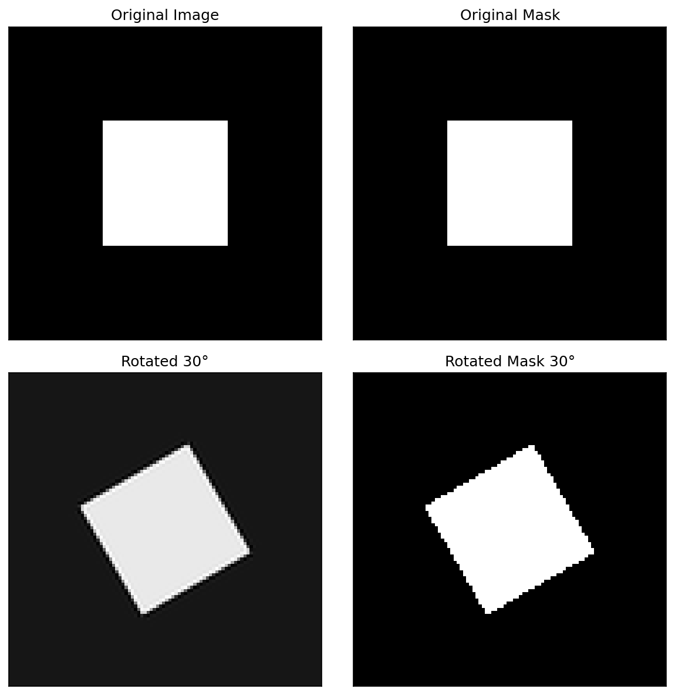
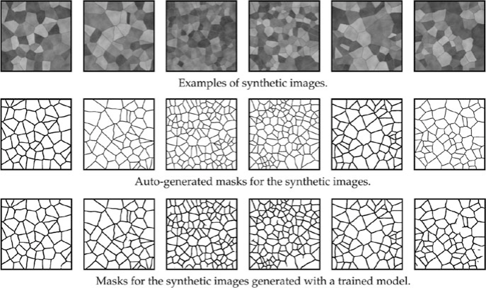

## 01. The Materials Data Bottleneck

::: {.fragment}
- **Expensive data**: 1 micrograph ≈ hours of prep + days of labeling
- **Big models vs. small data**: A model with $10^7$ parameters will memorize 100 samples
- **Goal**: Build deep models that generalize even when data is scarce
:::

## 02. Learning Outcomes

By the end of this unit, you can:

::: {.fragment}
1. Explain why materials data is scarce and how this leads to overfitting
2. Design physically valid augmentation pipelines
3. Distinguish feature extraction from fine-tuning in transfer learning
4. Apply gradual unfreezing and differential learning rates
5. Evaluate synthetic-to-real transfer approaches
6. Build a complete small-data training workflow
:::

---

## {background-color="#1a1a2e"}

### Part 1: The Small Data Challenge {style="text-align: center; margin-top: 15%;"}

*Slides 03–08*

## 03. The "Big Data" Myth in Materials Science

::: {.fragment}
- Materials labs generate **TBs of raw data** (e.g., 4D-STEM datasets)
- But **labeled data** is extremely sparse
- In computer vision (ImageNet): labels are cheap (crowdsourcing)
- In materials science: labels require **PhD-level experts** and hours of annotation
:::

## 04. Why Is Materials Data Scarce?

::: {.fragment}
1. **High acquisition cost**: Synchrotron beamtime, specialized TEMs
2. **Limited facility access**: Only a few instruments in the world for some techniques
3. **Expert annotation time**: Segmenting 100 grains in an SEM takes hours
4. **Reproducibility barriers**: Different instruments produce different images
:::

## 05. The Labeled Data Gap

::: {.fragment}
| Domain | Typical Dataset Size | Labels |
|:---|:---|:---|
| ImageNet | 14,000,000 images | Crowdsourced |
| Medical Imaging | 10,000–100,000 | Expert radiologists |
| **Materials Science** | **50–500 images** | **PhD microscopists** |
:::

::: {.fragment}
Standard deep learning (ResNet-50: 25M parameters) is designed for 1M+ images.

If we train from scratch on 100 images → **guaranteed overfitting**.
:::

## 06. Overfitting on Small Data

::: {.fragment}
- Model "memorizes" specific noise and artifacts of those 100 images
- Fails **catastrophically** on a new dataset from a different microscope
- Classic symptoms:
  - Training accuracy: 99%
  - Test accuracy: 55% (barely better than random)
:::

## 07. The "Small Data" Survival Kit

::: {.fragment}
Three strategies to overcome data scarcity:

1. **Data Augmentation**: Multiply data by applying valid transformations
2. **Transfer Learning**: Reuse knowledge from large-dataset models
3. **Synthetic Training**: Generate labeled data for free using simulations
:::

::: {.fragment}
```{mermaid}
graph LR
    PT["Pretrained Model<br>(ImageNet)"] --> TL["Transfer Learning"]
    SD["Synthetic Data<br>(Voronoi, Phase Field)"] --> Pre["Pretraining"]
    Pre --> TL
    TL --> FT["Fine-Tuning"]
    Aug["Data Augmentation"] --> FT
    FT --> M["Final Model"]
    style M fill:#e7ad52,color:#000
```
:::

## 08. Part 1 Recap

::: {.fragment}
1. Materials science has a **labeled data bottleneck** (50-500 images typical)
2. Standard deep learning **overfits** massively on small datasets
3. Three complementary strategies: **Augmentation**, **Transfer**, **Synthetic**
4. These strategies are not alternatives — use them **all together**
:::

---

## {background-color="#1a1a2e"}

### Part 2: Data Augmentation {style="text-align: center; margin-top: 15%;"}

*Slides 09–20*

## 09. Concept: Artificially Expanding the Dataset

::: {.fragment}
- "Reusing existing images by applying transformations"
- A form of **oversampling** — the same physical content, different pixel arrangements
- Forces the network to focus on **structure**, not **specific pixel patterns**
:::

## 10. Geometric Transformations

::: {.fragment}
- **Flips**: Horizontal, vertical
- **Rotations**: 90°, 180°, 270° (or arbitrary angles)
- **Scaling/Cropping**: Zoom in/out, random crops
- **Elastic deformation**: Simulating sample warping or drift
:::

::: {.fragment}
Each transformation multiplies your effective dataset size. Flips alone give 4× more data.
:::

## 11. Invariance via Augmentation

::: {.fragment}
- By rotating images, we force the network to be **rotation-invariant**
- Crucial for microstructures where "up" and "down" are arbitrary
- The augmentation **encodes physical knowledge** into the training process
:::

::: {.callout-note}
Augmentation is a way to tell the network: "This transformation doesn't change the physics."
:::

## 12. When Augmentation Is "Illegal"

::: {.fragment}
**Physical reality check**: Transformations must not violate materials physics!

- **Don't rotate** if there's a physical gradient (e.g., surface hardening layer, directional solidification)
- **Don't flip vertically** if gravity matters (e.g., sedimentation structures)
- **Don't warp** if topology is critical (e.g., grain boundary network connectivity)
:::

::: {.fragment}
Think before you augment: "Would this transformation produce a physically plausible image?"
:::

## 13. Intensity Transformations

::: {.fragment}
- **Brightness jittering**: ±10-20% intensity variation
- **Contrast adjustment**: Simulating different detector settings
- **Gamma correction**: Non-linear intensity mapping
:::

::: {.fragment}
**Purpose**: Make the model robust to different imaging conditions. A model trained at one brightness level should work at another.
:::

## 14. Adding "Physical" Noise

::: {.columns}
::: {.column width="50%"}
::: {.fragment}
**Gaussian noise**: Electronic/thermal noise

- Simulates detector readout noise
- Makes model robust to noisy images
:::
:::

::: {.column width="50%"}
::: {.fragment}
**Poisson/Shot noise**: Counting statistics

- Simulates low-dose conditions
- Important for electron microscopy
:::
:::
:::

::: {.fragment}
**Blur**: Gaussian or motion blur

- Simulates defocus or sample drift
- Forces model to rely on structure, not sharpness
:::

## 15. Advanced Augmentations

::: {.fragment}
- **CutOut / Random Erasing**: Mask random regions with zeros
  - Handles occlusions and artifacts (contamination spots)
- **Mixup**: Linear combination of two images and their labels
  - $x' = \lambda x_1 + (1-\lambda) x_2$, $y' = \lambda y_1 + (1-\lambda) y_2$
  - Regularizes the model, smooths decision boundaries
:::

## 16. Implementation: Torchvision & Albumentations

::: {.fragment}
```python
import albumentations as A

transform = A.Compose([
    A.HorizontalFlip(p=0.5),
    A.RandomRotate90(p=0.5),
    A.GaussNoise(var_limit=(10, 50), p=0.3),
    A.RandomBrightnessContrast(p=0.3),
    A.ElasticTransform(alpha=120, sigma=6, p=0.2),
])

# Apply to image AND mask simultaneously
augmented = transform(image=image, mask=mask)
```
:::

## 17. On-the-fly vs. Offline Augmentation

::: {.columns}
::: {.column width="50%"}
::: {.fragment}
**Offline**:

- Generate augmented images on disk before training
- Pro: Faster training
- Con: Fixed set of augmentations
:::
:::

::: {.column width="50%"}
::: {.fragment}
**On-the-fly** (preferred):

- Transform images in RAM during each batch
- Pro: Infinite diversity — each epoch sees different augmentations
- Con: Slightly slower per batch
:::
:::
:::

## 18. The Label Consistency Rule

::: {.fragment}
If you transform the image, you **must** transform the labels identically!

- Rotate image → rotate mask
- Flip image → flip mask
- Crop image → crop mask at the same location
:::

::: {.fragment}
{width=80%}
:::

::: {.fragment}
Intensity augmentations (brightness, noise) don't affect labels — only geometric ones do.
:::

## 19. Think About This: Augmentation Design

::: {.fragment}
**Scenario**: You have 50 SEM images of a laser-welded joint. The weld bead runs left-to-right. You want to classify weld quality (good/defective).

Which augmentations are valid?
:::

::: {.fragment}
- Horizontal flip: **Valid** (symmetric about weld center)
- Vertical flip: **Invalid** (top surface ≠ bottom)
- 90° rotation: **Invalid** (weld direction matters)
- Brightness jitter: **Valid**
- Gaussian noise: **Valid**
:::

## 20. Part 2 Recap

::: {.fragment}
1. Augmentation **multiplies** your effective dataset size
2. Geometric transforms encode **physical symmetries**
3. Only apply transformations that produce **physically plausible** images
4. Noise augmentation prepares models for **real experimental conditions**
5. Always transform **images and labels together**
:::

---

## {background-color="#1a1a2e"}

### Part 3: Transfer Learning {style="text-align: center; margin-top: 15%;"}

*Slides 21–32*

## 21. Concept: Knowledge Reuse

::: {.fragment}
> "Learning on Peas to count Lentils." — Sandfeld (2024)

- Take a model trained on **Task A** (e.g., classifying dogs vs. cats)
- Adapt it for **Task B** (e.g., classifying phases in micrographs)
- Why does this work? Because early visual features are **universal**
:::

## 22. Why ImageNet Features Transfer

::: {.fragment}
**ImageNet**: 14 million images, 1000 classes (dogs, cats, cars, buildings...)

The hierarchical features learned on ImageNet:

- **Layer 1**: Edges, gradients → universal
- **Layer 2**: Textures, corners → mostly universal
- **Layer 3**: Object parts → domain-specific
- **Layer 4+**: Full objects → very domain-specific
:::

::: {.fragment}
Early layers transfer well. Late layers need adaptation.
:::

## 23. The Backbone and the Head

::: {.fragment}
```{mermaid}
graph LR
    I["Input<br>Image"] --> BB["Backbone<br>(ResNet, VGG)<br>Pretrained"]
    BB --> H["Head<br>(FC layers)<br>New"]
    H --> O["Output<br>(your classes)"]
    style BB fill:#4a9eff,color:#fff
    style H fill:#e7ad52,color:#000
```
:::

::: {.fragment}
- **Backbone**: The feature extractor — pretrained on ImageNet
- **Head**: The classifier/regressor — newly initialized for your task
- Replace the head to match your number of classes
:::

## 24. Strategy 1: Feature Extraction

::: {.fragment}
- **Freeze** the entire backbone (no weight updates)
- Train **only** the new head on your materials dataset
- The backbone becomes a fixed feature extractor
:::

::: {.fragment}
**When to use**: Very small dataset (<100 images), risk of overfitting is high.

**Advantage**: Fast training, minimal risk of destroying pretrained features.

**Disadvantage**: Cannot adapt backbone to domain-specific textures.
:::

## 25. Strategy 2: Fine-Tuning

::: {.fragment}
- Initialize with pretrained weights
- Train the **entire** network (or the last few layers)
- Use a **very low learning rate** for the backbone
:::

::: {.fragment}
**When to use**: Moderate dataset (100-1000 images), enough to adapt the backbone.

**Advantage**: Backbone adapts to "micrograph-specific" textures.

**Risk**: **Catastrophic forgetting** — destroying useful pretrained features with aggressive updates.
:::

## 26. Differential Learning Rates

::: {.fragment}
- **High LR** for the head ($10^{-3}$): Learning new classes from scratch
- **Low LR** for the backbone ($10^{-5}$): Gently adapting existing features
- **Ratio**: Typically 100× between head and backbone
:::

::: {.fragment}
```python
optimizer = torch.optim.Adam([
    {'params': model.backbone.parameters(), 'lr': 1e-5},
    {'params': model.head.parameters(), 'lr': 1e-3},
])
```
:::

## 27. Gradual Unfreezing

::: {.fragment}
A safer fine-tuning protocol:

1. **Freeze** all backbone layers. Train head until convergence.
2. **Unfreeze** the last backbone block. Train with low LR.
3. **Unfreeze** the next block. Train further.
4. Repeat until the entire network is fine-tuned.
:::

::: {.fragment}
This prevents **catastrophic forgetting** of low-level features while allowing high-level adaptation.
:::

## 28. The Domain Gap: Natural vs. Scientific

::: {.fragment}
Natural images and micrographs differ in:

- **Color**: RGB vs. grayscale / 16-bit
- **Perspective**: 3D with vanishing points vs. orthographic top-down
- **Textures**: Organic, varied vs. crystallographic, periodic
- **Noise**: Compression artifacts vs. shot noise
:::

::: {.fragment}
If the domain gap is large, more fine-tuning is needed. Feature extraction alone may not suffice.
:::

## 29. Cross-Material Transfer

::: {.fragment}
- Train on a large database of **steel** micrographs
- Fine-tune on a small set of **aluminum** samples
- **Physics intuition**: Grain boundary topology is similar across alloy systems
:::

::: {.fragment}
```{mermaid}
graph LR
    S["Steel Dataset<br>(1000 images)"] --> PT["Pretrain<br>CNN"]
    PT --> FT["Fine-tune"]
    A["Aluminum Dataset<br>(50 images)"] --> FT
    FT --> M["Aluminum<br>Classifier"]
    style M fill:#e7ad52,color:#000
```
:::

## 30. Success Story: Au Nanoparticle Segmentation

::: {.fragment}
- **Task**: Segment crystalline Au nanoparticles from amorphous TEM background
- **Method**: U-Net initialized with ImageNet weights
- **Result**: High accuracy despite limited labeled TEM frames
:::

::: {.fragment}
{width=80%}
:::

::: {.fragment}
ImageNet pretraining helped even though ImageNet contains no TEM images — the low-level features transferred.
:::

## 31. Transfer from Simulations

::: {.fragment}
- Pretrain on **simulated** data (DFT, molecular dynamics, phase field)
- Fine-tune on real experiments
- **Advantage**: Simulations provide unlimited labeled data at zero annotation cost
:::

::: {.fragment}
The next frontier: physics-simulation-based pretraining for materials ML.
:::

## 32. Part 3 Recap

::: {.fragment}
1. **Don't train from scratch** — always start with a pretrained backbone
2. **Feature extraction**: Freeze backbone, train head only (safest)
3. **Fine-tuning**: Adapt backbone with low LR (more powerful)
4. **Gradual unfreezing** prevents catastrophic forgetting
5. **Differential learning rates**: 100× between head and backbone
6. Transfer works across domains (natural → scientific) and materials (steel → aluminum)
:::

---

## {background-color="#1a1a2e"}

### Part 4: Learning from Synthetic Data {style="text-align: center; margin-top: 15%;"}

*Slides 33–42*

## 33. The "Infinite Data" Dream

::: {.fragment}
- If we can **simulate** the microstructure, we can generate **unlimited** labeled data
- **Perfect masks for free**: No expert annotation needed
- **Controllable**: We choose the parameters (grain size, phase fraction, noise level)
:::

::: {.callout-note}
Synthetic data flips the labeling bottleneck: instead of labeling real images, we generate images from known structures.
:::

## 34. Generating Grain Microstructures

::: {.fragment}
**Voronoi Tessellations**:

- Distribute random seed points in 2D
- Assign each pixel to its nearest seed → grain regions
- Parameters: number of seeds (grain count), regularity, boundary thickness
:::

::: {.fragment}
{width=80%}
:::

## 35. From Geometry to Realistic Image

::: {.fragment}
A raw Voronoi diagram doesn't look like an SEM image. We need to add:

1. **Grain contrast**: Random intensity per grain
2. **Boundary appearance**: Thickened, possibly bright or dark boundaries
3. **Texture**: Per-grain crystallographic texture
4. **Noise**: Gaussian + Poisson to simulate detector noise
5. **Blur**: Slight defocus
:::

::: {.fragment}
{width=80%}
:::

## 36. The Sim-to-Real Gap

::: {.fragment}
- Synthetic data is often "too clean" or "too regular"
- Real microstructures have:
  - Non-uniform lighting
  - Sample preparation artifacts (scratches, contamination)
  - Complex grain morphologies that Voronoi can't capture
:::

::: {.fragment}
CNNs might learn **synthetic-only** features and fail on real SEMs.
:::

## 37. Domain Adaptation: Closing the Gap

::: {.fragment}
Making synthetic images look more like real ones:

- **Style transfer**: Apply the "style" of real SEMs to synthetic geometry
- **GANs** (Generative Adversarial Networks): Train a generator to produce realistic textures
- **Noise modeling**: Use measured noise characteristics from real instruments
:::

## 38. Case Study: SEM Grain Segmentation

::: {.fragment}
- Model trained **only** on Voronoi synthetic data
- Tested on **real** polycrystalline SEM images
- **Result**: Nearly perfect grain boundary segmentation!
:::

::: {.fragment}
{width=80%}
:::

::: {.fragment}
The synthetic data captured the **topological truth** of grain networks — boundaries, junctions, and connectivity patterns.
:::

## 39. Adaptive Data Generation

::: {.fragment}
1. Train on 1000 synthetic images
2. Test on real images → find the **hardest** cases (worst predictions)
3. Analyze what makes them hard (unusual grain shapes? specific textures?)
4. Generate **targeted** synthetic data mimicking those hard cases
5. Retrain and iterate
:::

::: {.fragment}
This is a form of **active learning** for synthetic data generation.
:::

## 40. Procedural Generation for Spectra

::: {.fragment}
Synthetic data works for more than images:

- **XRD patterns**: Simulate peaks with varying noise, background, and peak overlap
- **EELS spectra**: Simulate edges with realistic energy loss and plural scattering
- **EDS maps**: Simulate elemental distributions with counting noise
:::

::: {.fragment}
The same principle: if you can simulate it, you can label it for free.
:::

## 41. Think About This: When Synthetic Data Fails

::: {.fragment}
**Scenario**: You generate synthetic EBSD maps using a grain growth simulation. Your CNN achieves 95% accuracy on synthetic test data but only 60% on real EBSD maps.

What went wrong?
:::

::: {.fragment}
**Possible causes**:

1. Sim-to-real gap: Simulated grain shapes too regular
2. Missing artifacts: Real EBSD has indexing errors, no-solution pixels
3. Missing physics: Simulation doesn't capture twinning or deformation textures
4. Overfitting to synthetic style: Model learned simulation artifacts
:::

## 42. Part 4 Recap

::: {.fragment}
1. **Synthetic data** provides unlimited labeled data at zero annotation cost
2. **Voronoi tessellations** are a simple but effective grain generator
3. **Realism pipeline** (contrast, texture, noise, blur) bridges the sim-to-real gap
4. **Domain adaptation** (style transfer, GANs) for difficult domain gaps
5. **Adaptive generation** focuses on the hardest cases
:::

---

## {background-color="#1a1a2e"}

### Part 5: Practical Workflow & Best Practices {style="text-align: center; margin-top: 15%;"}

*Slides 43–50*

## 43. The Complete Fine-Tuning Recipe

::: {.fragment}
1. **Select** a pretrained architecture (e.g., ResNet-50, EfficientNet)
2. **Replace** the final layer for your number of classes/targets
3. **Freeze** all backbone layers
4. **Train** the head with standard LR ($10^{-3}$), augmented data
5. **Unfreeze** gradually, train with low LR ($10^{-5}$)
6. **Early stopping** based on validation loss
:::

::: {.callout-note}
This recipe works for 90% of materials classification and segmentation tasks.
:::

## 44. Validation in the Small Data Regime

::: {.fragment}
- **K-Fold CV** is mandatory (Unit 3 review)
- Be extremely wary of **augmentation leakage**: don't have an image and its rotation in both train and test!
- Always split by **specimen**, not by individual crop
:::

::: {.fragment}
```python
from sklearn.model_selection import GroupKFold
gkf = GroupKFold(n_splits=5)
for train_idx, test_idx in gkf.split(X, y, groups=specimen_ids):
    # Each fold: all crops from one specimen in same fold
    ...
```
:::

## 45. Group-Based Splitting Revisited

::: {.fragment}
```{mermaid}
graph TD
    S1["Specimen 1<br>(10 crops)"] --> Train["Training Fold"]
    S2["Specimen 2<br>(10 crops)"] --> Train
    S3["Specimen 3<br>(10 crops)"] --> Train
    S4["Specimen 4<br>(10 crops)"] --> Test["Test Fold"]
    S5["Specimen 5<br>(10 crops)"] --> Test
```
:::

::: {.fragment}
- If you have 5 specimens with 10 crops each = 50 images
- Split by **specimen**: 3 train, 2 test (not 40 random/10 random!)
- Then augment the 30 training images to 300+
:::

## 46. Early Stopping

::: {.fragment}
- Monitor **validation loss** during training
- Stop when validation loss starts increasing (even if training loss is still decreasing)
- Small datasets are prone to **sudden overfitting** late in training
:::

::: {.fragment}
```python
early_stopping = EarlyStopping(
    monitor='val_loss',
    patience=10,      # Wait 10 epochs before stopping
    restore_best_weights=True
)
```
:::

## 47. Active Learning: Maximizing Expert Time

::: {.fragment}
- Instead of labeling all images equally, let the model guide annotation
- **Uncertainty-based**: Label images where the model is most uncertain
- **Diversity-based**: Label images that are most different from already-labeled data
:::

::: {.fragment}
Maximizes the value of every expert hour — 50 strategically chosen labels can beat 500 random ones.
:::

## 48. The "Gold Standard" Test Set

::: {.fragment}
- Even with TL/augmentation/synthetic data, you need a small, high-quality **benchmark test set**
- Hand-labeled by multiple experts
- From a **different** instrument or session than training data
- This is the **absolute** benchmark — never touched during training
:::

::: {.fragment}
Your model is only as credible as your test set is rigorous.
:::

## 49. Summary: The Complete Small-Data Strategy

::: {.fragment}
1. **Augment** your data to enforce physical invariances
2. **Transfer** knowledge from ImageNet or domain-specific pretrained models
3. **Synthetic** data provides infinite labels if generated carefully
4. **Validate** rigorously: grouped K-fold, early stopping, gold standard test set
5. **Combine** all three strategies for maximum effectiveness
:::

## 50. Unit 6 Summary & Next Steps

::: {.fragment}
**Key Takeaways:**

1. Materials science is the land of **small data** — act accordingly
2. **Augmentation** is free — use it always, but respect the physics
3. **Transfer learning** is the single most impactful technique
4. **Synthetic data** can replace expensive annotation
5. **Validation** must be even more rigorous when data is scarce
:::

::: {.fragment}
**Reading:**

- Sandfeld (2024): Ch. 19.2-19.3 [@sandfeld_materials_data_science]
- McClarren (2021): Ch. 6.4 (Transfer Learning) [@mcclarren2021machine]
- Neuer (2024): Ch. 4.2.1 (Generalization) [@neuer2024machine]
:::

::: {.fragment}
**Next Week**: Unit 7 — Learning from Processing Data: Time Series & Sequence Models
:::

---

## References

::: {#refs}
:::
