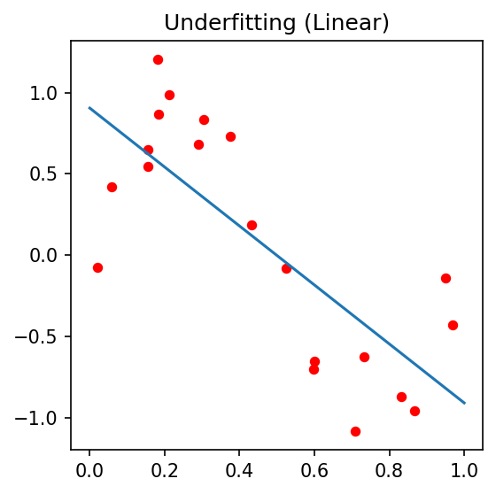
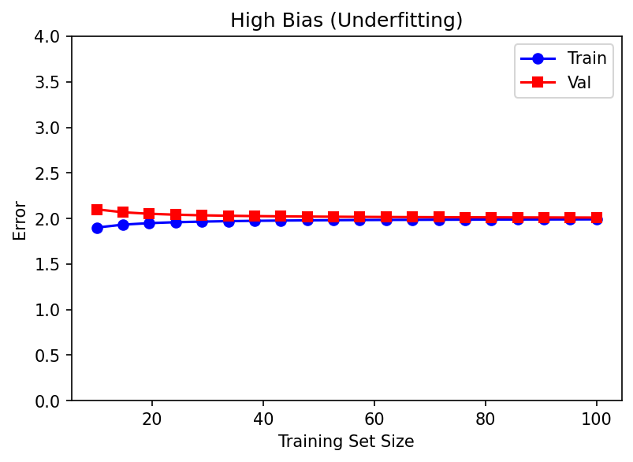
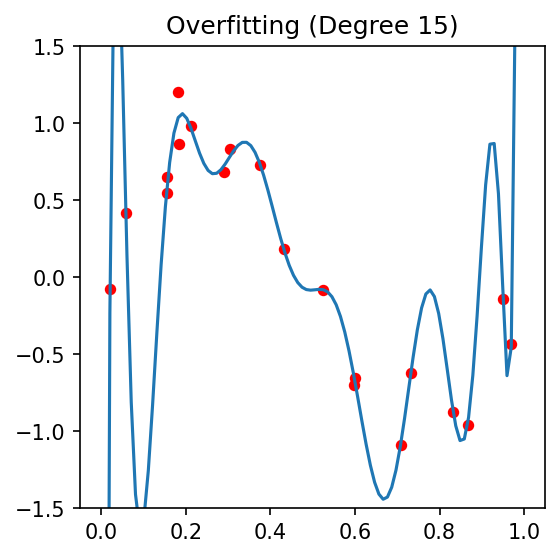
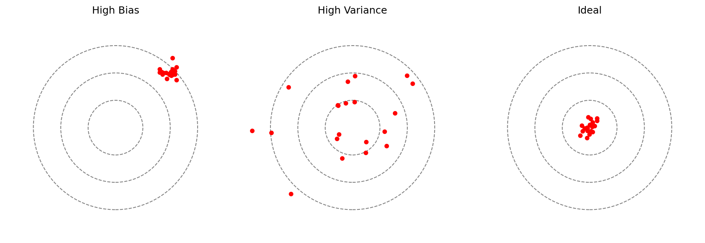
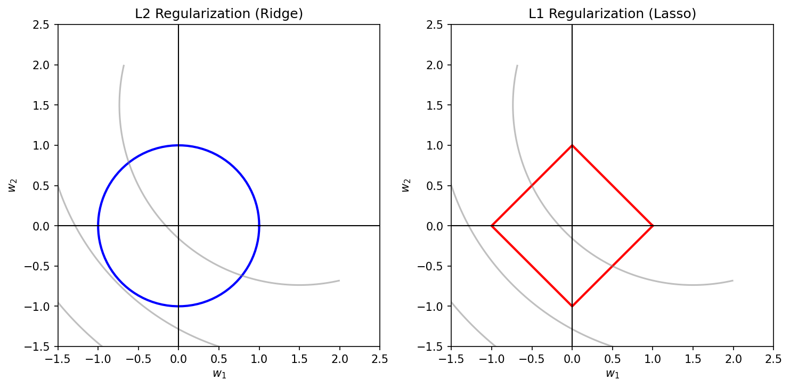
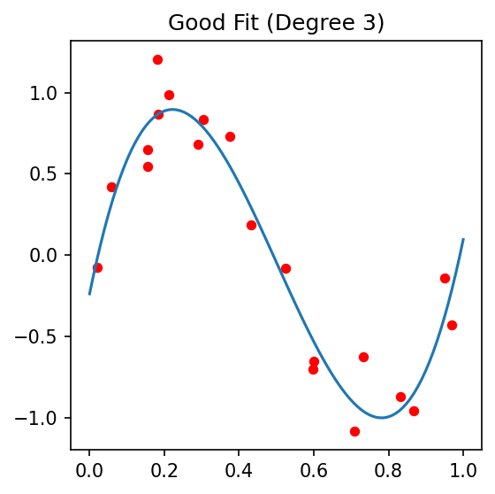
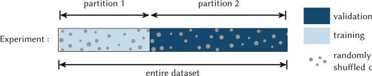
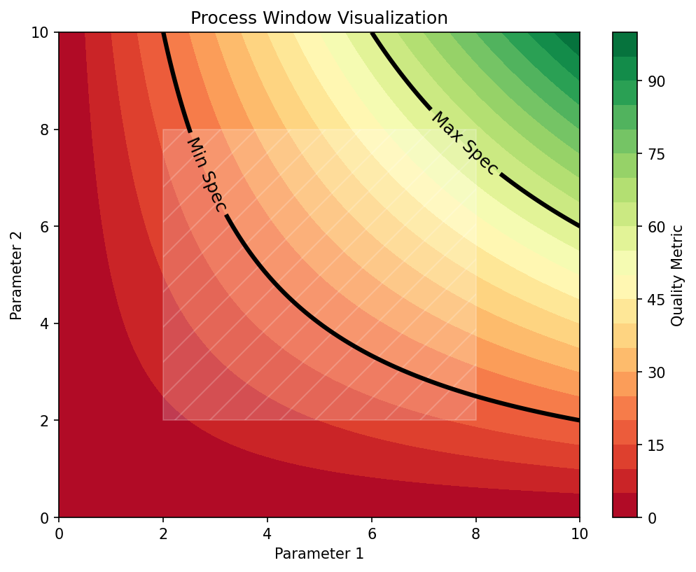

## 01. Where We Are

::: {.columns}
::: {.column width="50%"}
**Recap — Units 1–6 (ML-PC) and MFML W1–W6**

- *Unit 2:* the measurement chain $\xi(t) \rightarrow x_i$ + noise model.
- *Unit 3:* cleaning, scaling, leakage, error metrics.
- *Units 4–6:* representations, CNNs, transfer learning under data scarcity.
- *MFML W6 (parallel track):* loss landscapes, gradient descent, neural-network training.
:::
::: {.column width="50%"}
**Today — Unit 7 (delivered Week 7)**

You have a model that *trains*. The hard questions begin now:

- Will it work on **next week's** sample?
- Will it work on the **other** microscope?
- Where in process space can we **trust** its decisions enough to ship parts?
:::
:::

::: {.notes}
**Position the unit explicitly.** This is the lecture where ML stops being a fitting exercise and starts being an engineering discipline. Up to now we have asked "can the model represent the data?" — today we ask "would I bet a 10 k€ build plate on its prediction?" That is the difference between a paper plot and a process control system.

**The week-numbering note (say it once, do not belabor).** ML-PC W7 (26.05.2026) was cancelled — public holiday. The old Time-series unit (folder now `unit07_time_series_supplementary/`) has been demoted to optional self-study, so the SS26 schedule shifts down by one and this Generalization & Robustness lecture is delivered as **Unit / Week 7**. Folder index and unit number now match. The MFML W7 pairing (Generalization, Regularization, Model Selection) lines up exactly with this lecture as before.

**Anchor in the parallel MFML track.** MFML W7 covers the formal bias-variance decomposition, ridge / lasso regularization, k-fold CV, and the validation-set protocol. Today we use *exactly* that machinery and apply it to materials data, where the failure modes are different from generic ML benchmarks: tiny datasets, group structure (specimens, sessions, microscopes), distribution shift between batches, and the engineering need for *guaranteed* operating regions rather than averaged accuracy.

**Forward links.**

- Unit 8 (next week) → inverse problems and process maps will *use* the process windows we define today as the constraint sets.
- Unit 11 → Gaussian Processes give us calibrated uncertainty, which is the principled version of the "probability contour" we will draw freehand today.
- Unit 12 → physics-informed losses are a regularizer; we will preview the Bayesian view here.

**Time honesty.** This is a content-dense 90 min lecture. Six sections, ~50 slides, two short think-pair-share checkpoints, one numerical demo. Promise students they get a 5-min break after §3 (CV/HPO) and another after §5 (sensitivity).
:::

## 02. Learning Outcomes

By the end of this lecture you can:

::: {.fragment}
1. **Decompose** prediction error into **bias**, **variance**, and **irreducible noise**, and read this decomposition off a learning curve.
2. **Choose** a regularizer ($L_1$, $L_2$, dropout, early stopping, augmentation) and justify it as a Bayesian prior.
3. **Design** a leakage-free validation protocol (k-fold, stratified, group, time-aware) for a materials dataset.
4. **Tune** hyperparameters with grid / random / Bayesian search and explain when each is appropriate.
5. **Assess** robustness to measurement noise, distribution shift, and outliers — and distinguish the three.
6. **Define** an ML-driven **process window** with a quantified safety margin, given a calibrated classifier or regressor.
7. **Quantify** which inputs drive a model's prediction (permutation importance, saliency, SHAP teaser).
:::

::: {.notes}
**Bloom mapping.** Outcomes 1, 3, 4, 6 are *apply* / *create* level — students should walk into a lab project and execute. Outcomes 2, 5, 7 are *evaluate* level: they are about judging whether a model is *trustworthy*, not whether it *fits*.

**The exam-relevant ones to flag.** Outcome 3 (validation design) and outcome 6 (process window with margin) are the two most exam-relevant — they are also the two students get wrong most often in the literature. The "94% accuracy" CNN that learned the carbon-grid pattern from Unit 3 is the canonical failure mode: the model generalized perfectly *to its leakage*, and the lab failed only when the second batch arrived.

**Pedagogical sequence.** Today's outcomes follow the natural order: first understand the *failure* (overfitting, bias), then the *fix* (regularization, CV, HPO), then the *operational consequence* (process window), then the *audit tools* (sensitivity / SHAP teaser). Sticking to this order keeps the lecture coherent — resist the temptation to teach SHAP before students have a feel for what overfitting looks like.
:::

## 03. Today's Map

::: {.columns}
::: {.column width="50%"}
**Six sections, ≈90 min**

- §1 Generalization & bias–variance *(≈15 min)*
- §2 Robustness & noise *(≈14 min)*
- §3 Cross-validation & HPO *(≈18 min)*
- §4 Process windows *(≈15 min)*
- §5 Sensitivity & feature importance *(≈12 min)*
- §6 Wrap-up & forward links *(≈6 min)*
:::
::: {.column width="50%"}
**Two checkpoints, one demo**

- *Think-pair-share* after §2: "Is this an outlier or a discovery?"
- *Live demo* in §3: 5-fold CV on a tiny tensile-strength dataset.
- *Think-pair-share* after §4: "Where is the keyhole boundary, and how confident are you?"
:::
:::

::: {.notes}
**Signposting.** Students pace better when they know the shape of the lecture. Promise the breaks and the demo so they keep attention through the formula-heavy §3.

**Why this ordering.** Generalization first, because every other concept today is a tool to *achieve* generalization. Robustness second, because it is the realistic version of generalization (different microscope, different operator). CV/HPO third, because that is *how* you actually get a generalizing model. Process windows fourth, because that is the *deliverable* in a real materials project. Sensitivity last, because it is the *audit* layer — used to defend the model in front of a process engineer.

**What I am not covering today.** Calibrated uncertainty (Unit 11), conformal prediction (Unit 11), causal sensitivity (Unit 13). I will name them when they come up so students can tell which concept lives where.
:::

# §1 · Generalization & Bias–Variance {.section}

## 04. Generalization is the Goal

::: {.columns}
::: {.column width="50%"}
**The model's job is not to fit the training data.**

- We do not care about $L_{\text{train}}$.
- We care about $L_{\text{test}}$ on data the model has *never seen*.
- *Generalization* = transferring learned structure to new samples drawn from the same (ideally) distribution.
:::
::: {.column width="50%"}
**Formally** [@bishop2006pattern]:

$$
L_{\text{gen}}(\hat f) \;=\; \mathbb{E}_{(x,y)\sim p_{\text{data}}} \!\left[ \ell\bigl(y, \hat f(x)\bigr)\right]
$$

We can never compute this — we only ever *estimate* it from a held-out sample. Today is largely about building those estimators correctly.
:::
:::

::: {.notes}
**Anchor.** This is the single most-violated principle in early-career materials ML papers: reporting training accuracy as if it were a result. Be loud about it: a model that gets 100% on the training set tells you nothing — it might have memorized, it might have leaked, it might be perfect. You cannot tell from $L_{\text{train}}$ alone.

**Why we will never know $L_{\text{gen}}$.** The expectation is over the true data distribution $p_{\text{data}}$, which is unobservable. Every number we report — test accuracy, k-fold mean, leave-one-specimen-out — is an *estimator* of this expectation, with its own bias and variance. Students should leave today thinking of "test accuracy" as a noisy measurement of an unknowable population quantity, not as a ground truth.

**Connect to MFML W7.** MFML covers the same equation in the abstract — empirical risk vs population risk, Hoeffding-style bounds, VC / Rademacher. In ML-PC we will not redo the bounds; we will use them as the conceptual scaffold and focus on the materials-specific failure modes (small $N$, groups, drift).

**Wrong answers students often give.**
- "We can compute $L_{\text{gen}}$ if we have enough data" — no, you can compute a *better estimator*.
- "Cross-validation gives us $L_{\text{gen}}$" — no, it gives a less-biased estimator with measurable variance.
:::

## 05. Training vs. Testing Error

::: {.columns}
::: {.column width="55%"}
- *Training error* measures **fitting** — how well the parameters minimize $L$ on the data they were optimized against.
- *Testing error* measures **generalization** — how well the model performs on data the optimizer never touched.
- The gap $L_{\text{test}} - L_{\text{train}}$ is the **generalization gap**.

::: {.fragment}
**Engineering reading [@sandfeld_materials_data_science Ch.12]:**

- Both errors decreasing → underfitting; add capacity.
- Train error $\downarrow$, test error $\uparrow$ → overfitting; regularize, get more data, or simplify.
- Both errors plateau at the same high value → noise floor / data is not informative.
:::
:::
::: {.column width="45%"}
![Training and validation loss curves [@sandfeld_materials_data_science]](images/loss_curves.png){width="95%"}
:::
:::

::: {.notes}
**Read the curve aloud.** Walk the class through the canonical loss-curve picture. Training loss monotonically decreasing because gradient descent is doing its job. Validation loss decreasing, then turning, then climbing — that turn is the moment overfitting begins. The classical *early stopping* rule is "stop at the minimum of the validation curve."

**The three diagnostic shapes.** I will redraw these on the chalkboard.

1. *Both curves still falling, parallel and high* → underfit; either your model is too simple, you have not trained long enough, your features are wrong, or there is no signal to find.
2. *Train falling, validation flat or rising, big gap* → overfit; the model has capacity to memorize and is using it.
3. *Both curves flat, gap small* → you are at the noise floor; collecting more data of the same kind will not help — you need a different feature, a different label, or a different model class.

**The "perfect" looking curve is a red flag.** If both train and validation are essentially zero, suspect leakage. The exception is genuinely deterministic toy problems, which a real materials dataset never is.

**Cross-reference.** This is the same picture students saw in MFML W6 (training NNs) and they will see again in Unit 11 (GPs, where the validation curve is replaced by a marginal likelihood).
:::

## 06. Underfitting — High Bias

::: {.columns}
::: {.column width="55%"}
A model with **insufficient capacity** to capture the underlying structure.

- Linear fit to a quadratic relationship.
- Constant predictor for a structured field.
- Both train and test error are high *and similar*.

**Symptoms on the curve:** both losses plateau early at a high value; the gap is small.

::: {.fragment}
**Materials examples:**

- Predicting yield strength from composition alone, ignoring grain size.
- Linear regression on a nonlinear $\sigma$–$\dot\varepsilon$–$T$ surface.
- Tiny CNN ($<10^4$ params) on 4D-STEM patterns.
:::
:::
::: {.column width="45%"}
{width="95%"}

{width="95%"}
:::
:::

::: {.notes}
**Diagnostic recipe for "is this underfitting?"** Add a few epochs and watch. If train loss does not move, you are limited by capacity (too few params, too restrictive a function class). If train loss moves but stays high, you may be limited by features — the inputs simply do not contain the information you want to predict.

**Bias has a precise meaning.** In the bias-variance decomposition (slide 08), bias is the *expected* deviation of the model's average prediction from the truth, integrated over many fictitious training sets. A linear model has high bias on a quadratic problem because *no* dataset can rescue it — the function class itself is wrong.

**Engineering instinct check.** A high-bias model is one that "just doesn't see the physics." Increase capacity in graded steps: linear → polynomial → kernel → small NN → bigger NN. Stop the moment the test curve begins to rise (slide 07).

**Anti-pattern.** Students often jump from "linear model has 30% error" straight to "let me train a 50-layer transformer on my 200-sample dataset." That trade trades bias for variance — slide 07 — and usually loses.
:::

## 07. Overfitting — High Variance

::: {.columns}
::: {.column width="55%"}
A model with **excess capacity** that memorizes training noise.

- 10th-degree polynomial through 5 points.
- Decision tree grown to leaf-purity on every sample.
- Deep CNN with millions of parameters on a few hundred images (Unit 6).

**Symptoms:** train loss tiny, validation loss large; big gap.

::: {.fragment}
**Materials-specific causes:**

- *Tiny $N$*: hundreds of micrographs, millions of weights.
- *Group structure*: 1000 patches from 5 specimens looks like 1000 samples but behaves like 5.
- *Instrument fingerprints*: the model learns "this is microscope A's vignetting," not the physics.
:::
:::
::: {.column width="45%"}
{width="95%"}

{width="95%"}
:::
:::

::: {.notes}
**The trap of "too good to be true."** When a deep network on 200 micrographs reports 99% test accuracy, my prior is overwhelmingly that there is leakage, not that the architecture is brilliant. Always double-check by (a) freezing the splits as group splits, (b) running on a *new specimen* held out from the start, (c) inspecting saliency maps to see whether the model is looking at the sample or the scale bar.

**Why deep learning makes this worse.** Modern overparameterized networks can memorize random labels [@zhang2017understanding]. The fact that they nevertheless generalize on real datasets is one of the open mysteries of deep learning, and it leans heavily on inductive biases (convolution, augmentation, SGD's implicit regularization) — not on the architecture being "small."

**Materials-specific cause to emphasize: group structure.** This is the most-missed source of inflated test accuracy in the field. We will spend a slide on group-aware k-fold (slide 24). Tease it now.

**Practical fixes preview.** Regularization (slides 11–12), augmentation (Unit 6, recapped slide 18), more data (Unit 6 transfer learning), simpler model class (slide 09–10).
:::

## 08. The Bias–Variance Decomposition

::: {.columns}
::: {.column width="55%"}
For squared-error regression with target $y = f(x) + \varepsilon$, $\mathbb{E}[\varepsilon]=0$, $\mathrm{Var}(\varepsilon)=\sigma^2$ [@bishop2006pattern; @murphy2012machine]:

$$
\mathbb{E}\bigl[(y - \hat f(x))^2\bigr] = \underbrace{\bigl(\mathbb{E}[\hat f(x)] - f(x)\bigr)^2}_{\text{Bias}^2} + \underbrace{\mathrm{Var}(\hat f(x))}_{\text{Variance}} + \underbrace{\sigma^2}_{\text{Irreducible}}
$$

::: {.fragment}
- **Bias²** ↓ as model complexity ↑.
- **Variance** ↑ as model complexity ↑.
- **Irreducible** ($\sigma^2$) is fixed by the *physics of the measurement* (Unit 2).
:::
:::
::: {.column width="45%"}
{width="95%"}
:::
:::

::: {.notes}
**The "why" of regularization in one slide.** This decomposition is the conceptual engine of the rest of the lecture. Every regularizer, every CV fold, every dropout mask is a knob that trades a little extra bias for a much-reduced variance. The total-error U-curve has a minimum, and finding that minimum is what model selection actually *is*.

**The expectation is over training sets.** A subtlety students miss: the bias and variance are with respect to repeated draws of the *training set*, not the *test point*. Bias asks "if I trained the same model on many different datasets of the same size, would the average prediction at $x$ equal the truth?" Variance asks "how much does the prediction at $x$ jiggle as I vary the training set?" CV is a practical proxy for that thought experiment.

**Irreducible noise is the noise floor from Unit 2.** Poisson shot noise on a low-dose detector, thermal drift on a thermocouple, inter-annotator label uncertainty — all of these set $\sigma^2$. No amount of model engineering reduces it. The only fix is *better measurement* (more dose, longer acquisition, more annotators), which is exactly the Unit 2 lesson.

**Outside squared error.** The decomposition has analogues for other losses (Domingos's unified bias-variance, James's generalized bias-variance), but the spirit is the same. For 0/1 loss the math is uglier but the picture is identical.

**Connect to today's outcomes.** Outcome 1 ("decompose prediction error into bias, variance, irreducible") = this slide. Outcome 2 (regularizer = Bayesian prior) = slide 11–12.
:::

## 09. Reading the U-Curve

::: {.columns}
::: {.column width="50%"}
{width="95%"}
:::
::: {.column width="50%"}
**The classical "model selection" picture:**

- Move *right* (more capacity) → bias falls, variance rises.
- The total-error curve has a minimum: this is the **sweet spot** $\mathcal{M}^\star$.
- Capacity = parameter count, polynomial degree, tree depth, kernel bandwidth, NN width × depth.

::: {.fragment}
**Modern caveat (deep nets).** In overparameterized networks the U-curve becomes a *double descent*: error rises near the interpolation threshold, then *falls again* deep into the overparameterized regime. We name it; we do not derive it. Pragmatically: regularize and CV either way.
:::
:::
:::

::: {.notes}
**Classical version first, modern caveat second.** For most materials problems — especially with small $N$ — the classical U-curve is the right mental model. Regularize, CV, watch the validation curve; pick $\mathcal{M}^\star$ where the validation loss bottoms out. This is the version that goes on the exam.

**Double descent in one paragraph.** When a model has *exactly* enough parameters to interpolate the training set, the generalization error spikes — there is one and only one way to fit, and it is brittle. Add even more parameters and the implicit regularization of SGD selects a "smooth" interpolator out of the infinite family of zero-train-error solutions, and generalization improves again. This is why a 100M-param vision transformer can outperform a 1M-param CNN on ImageNet without obviously overfitting. For our typical $N \sim 10^2 – 10^4$ materials datasets, however, classical U-curve thinking is the safer default — name double descent so students recognize the term, but do not let them use it as an excuse to skip regularization.

**On the chalkboard.** Sketch the U-curve with three vertical guide lines: underfit on the left, sweet spot in the middle, overfit on the right. Mark the irreducible-noise floor as a horizontal asymptote.

**Sweet-spot is dataset-dependent.** $\mathcal{M}^\star$ moves rightward as $N$ grows. With more data the variance term shrinks faster than bias grows, so larger models become preferable. Quantitatively this is one of the standard PAC-style results — gesture at it, do not derive it.
:::

## 10. Why Materials ML Overfits So Easily

::: {.columns}
::: {.column width="50%"}
**Three structural reasons** [@sandfeld_materials_data_science]:

1. **Small $N$**: experiments are expensive; we routinely train on $10^2–10^3$ samples.
2. **High $D$**: a $1024^2$ micrograph is $10^6$-dimensional; a 4D-STEM dataset can be $10^{10}$-dimensional [@Pelz_2023].
3. **Group structure**: many "samples" are slices of the same specimen — they are not independent.
:::
::: {.column width="50%"}
**Two cultural reasons:**

- We borrow architectures from ImageNet (millions of params, designed for $10^7$ images) and apply them to 200 SEM images.
- We forget that *augmentation*, *transfer learning*, and *physics priors* are the only realistic counterweights.

::: {.fragment}
**Lesson from Unit 6.** When data is scarce, simpler is *almost always* better unless you can pretrain on a related domain.
:::
:::
:::

::: {.notes}
**Why I keep saying "small $N$".** A typical published materials-ML paper has $N$ between 100 and 10,000. ImageNet has 14 million images. The same architecture applied at the same capacity will overfit catastrophically on the smaller end. Yet papers continue to use ResNet-50 by reflex.

**The hidden $N$ killer: group structure.** Suppose you have 5 specimens, each cut into 200 patches. Naive reporting will say $N = 1000$. The number of *independent* training samples is closer to 5. A leakage-free split must put *whole specimens* into either train or test — never both. Tease this; we will hammer it on slide 24.

**The high-dimensional curse.** A $1024 \times 1024$ image lives in $\mathbb{R}^{10^6}$. Even an "MLP" with one hidden layer of 100 units has $10^8$ weights at the input layer. Convolution structure (translation equivariance, local receptive fields) is what makes this tractable — and convolution is itself a regularizer (we will return to this in slide 11).

**Pelz-group case in point.** 4D-STEM datasets routinely exceed $10^{10}$ entries; ptychographic reconstruction networks operate in this regime. The only reason they generalize is that they bake the *forward model* in (Unit 8 / Unit 12 preview).

**Cultural reason.** Architectures travel from CV/NLP into materials with their parameter counts intact. Borrowing the architecture without borrowing the dataset size is a sure overfitting recipe — and is one of the most common reviewer comments I write.
:::

## 11. Regularization — Keeping it Simple

::: {.columns}
::: {.column width="55%"}
**Add a penalty on complexity to the training loss:**

$$
\mathcal{L}_{\text{reg}}(\theta) \;=\; \mathcal{L}_{\text{data}}(\theta) \;+\; \lambda \cdot \Omega(\theta)
$$

| $\Omega(\theta)$ | Bayesian prior | Effect |
|:---|:---|:---|
| $\|\theta\|_2^2$ | Gaussian | shrinks all weights toward 0 |
| $\|\theta\|_1$   | Laplace  | sparsity — sets weights to 0 |
| $\|\nabla \theta\|^2$ | smoothness | spatially smooth fields |

::: {.fragment}
**Other regularizers** [@goodfellow2016deep]:

- *Dropout* (NN), *early stopping*, *data augmentation* (Unit 6), *batch norm*, *weight averaging*.
- All trade a little bias for a lot of variance.
:::
:::
::: {.column width="45%"}
{width="95%"}
:::
:::

::: {.notes}
**Bayesian framing — non-negotiable.** Every regularizer is a prior. $L_2$ weight decay $\Leftrightarrow$ Gaussian prior on weights. $L_1$ $\Leftrightarrow$ Laplace prior. Smoothness $\Leftrightarrow$ Gaussian-process prior with a smoothing kernel. Dropout $\Leftrightarrow$ approximate Bayesian model average over an ensemble of subnetworks [@gal2016dropout]. The Bayesian view forces honesty: pick a regularizer that encodes a prior you actually believe.

**$\lambda$ is a hyperparameter.** It cannot be set on the training set (the training loss always wants $\lambda = 0$). It must be tuned by cross-validation against held-out data — which is exactly §3 of today's lecture.

**Geometry of L1 vs L2.** Draw it on the chalkboard if I have time: the loss contours are ellipses around the OLS minimum; the constraint set is a ball ($L_2$) or a diamond ($L_1$). The ellipse first touches the diamond at a *corner* — corners have zero coordinates — which is why $L_1$ produces sparsity. The ellipse touches the ball anywhere, which is why $L_2$ shrinks but does not zero out.

**Materials-relevant regularizers.**

- *Smoothness* / TV — natural for fields that should not jiggle (temperature, strain, density).
- *Positivity* — concentrations and intensities cannot be negative.
- *Conservation* — mass, charge, momentum (Unit 12 will formalize this).

**Forward link.** Regularization comes back as the *physics-informed loss term* in PINNs (Unit 12) and as the *kernel choice* in GP regression (Unit 11).
:::

## 12. Regularization in Pictures

::: {.columns}
::: {.column width="33%"}
{width="100%"}
:::
::: {.column width="34%"}
{width="100%"}
:::
::: {.column width="33%"}
{width="100%"}
:::
:::

**The same data, three values of $\lambda$.** Tuning $\lambda$ is the most common single hyperparameter problem in applied ML.

::: {.notes}
**Read the three panels left-to-right.**

- *Left, $\lambda$ very large:* the penalty dominates; the model is forced toward $\theta = 0$; we see a near-constant predictor — high bias.
- *Center, $\lambda \approx \lambda^\star$:* the penalty trades just enough complexity for stability; the curve passes near the true function and ignores noise.
- *Right, $\lambda \to 0$:* the penalty is asleep; the model overfits noise; high variance.

**Rule of thumb for $\lambda$ search.** Sweep on a *log scale* over 6–8 decades, e.g. $\lambda \in \{10^{-6}, 10^{-5}, …, 10^{0}\}$. Linear sweeps waste compute because $\lambda$'s effect is logarithmic. This becomes important in §3 when we discuss random search.

**One more anti-pattern.** I have seen students pick $\lambda$ that minimizes *training* loss. Training loss is monotonically increasing in $\lambda$ — the optimal training $\lambda$ is always 0. Always validate against held-out data.

**Transition cue.** "OK — you've regularized, the U-curve has a minimum, you found it. The model generalizes — on the same kind of data. What happens when the *world* changes a little? That is robustness, and it is §2."
:::

# §2 · Robustness & Noise {.section}

## 13. Defining Robustness

::: {.columns}
::: {.column width="50%"}
**Generalization** = same distribution, new sample. **Robustness** = perturbed distribution.

A model is *robust* if its prediction $\hat f(x)$ changes only modestly when:

- the input $x$ is corrupted by noise,
- the input distribution shifts (new instrument, new operator, new batch),
- a small fraction of training data is contaminated.
:::
::: {.column width="50%"}
**Two flavors of uncertainty** (Unit 2 recap) [@neuer2024machine]:

- **Aleatory** — irreducible randomness in the measurement (Poisson shot noise, thermal jitter).
- **Epistemic** — gaps in the model's knowledge (regions of input space we never sampled).

A robust model is *aleatory-tolerant* and *epistemic-honest*.
:::
:::

::: {.notes}
**The two definitions matter.** In the literature "robustness" is overloaded. Be explicit:

- *Noise robustness* — the prediction does not flip when you add Gaussian / Poisson noise consistent with the measurement process.
- *Distribution-shift robustness* — the model trained on microscope A still works on microscope B.
- *Adversarial robustness* — the prediction does not flip under tiny worst-case input perturbations (less central to materials, but matters for safety-critical QC).
- *Outlier robustness* — a few corrupted training points do not derail the fit.

We will touch all four in §2; only outlier robustness gets a worked example.

**Aleatory vs epistemic — the punchline.** Aleatory you cannot fix with more data of the same kind; epistemic you *can*. A robust model should *report which kind* of uncertainty dominates at a query point. We come back to this in §4 (process windows) and Unit 11 (GPs).

**Anti-pattern: confusing "low test error" with "robust."** A model with 95% test accuracy on data from microscope A may have 50% accuracy on microscope B and not know it. Today's tools are how you *find out* before deployment.
:::

## 14. Aleatory Uncertainty — Measurement Noise

::: {.columns}
::: {.column width="50%"}
**The detector noise we cannot remove** (Unit 2):

- Photon-counting / electron-counting → Poisson.
- Read noise, dark current → Gaussian.
- Quantization → uniform.

**Robust ML requirement:** prediction insensitive to *noise within the measurement's natural fluctuation envelope*.
:::
::: {.column width="50%"}
**Diagnostic test.**

- Take a real input $x$.
- Sample $n$ noise realizations $\eta^{(k)} \sim p_{\text{noise}}$ consistent with the detector physics.
- Compute the prediction spread $\{\hat f(x + \eta^{(k)})\}_{k=1}^n$.
- A *robust* model's spread should be $\ll$ the variation across genuinely different inputs.
:::
:::

::: {.notes}
**Direct link to Unit 2.** The noise model from Unit 2 gives us $p_{\text{noise}}$ — Gaussian, Poisson, Weibull, depending on what the detector and the sample do. Today's robustness test *uses* that noise model. Without Unit 2 we would be guessing.

**Operationalize the diagnostic.** Pick one validation image. Add 100 independent Poisson samples at the realistic count rate. Look at the spread of predicted yield strength / phase fraction / defect class. If the spread is comparable to the model's reported test-set RMSE, you are at the noise floor — no further model engineering will help. If the spread is *much smaller* than the RMSE, your generalization gap is dominated by something *other* than measurement noise (probably distribution shift; see slide 16).

**Cheap fix for noise robustness: train with noise.** This is the noise-injection trick (slide 18) — Gaussian noise during training as a form of regularization [@bishop1995training]. Equivalent at small noise to L2 weight decay; richer than L2 at large noise.

**Counter-example to be honest about.** Some detector noise is *informative*: in EELS the Poisson-tail of low-count pixels carries quantitative information about chemistry. "Robust to noise" cannot mean "throw away the noise" — it means "do not depend on noise *patterns* the next dataset will not share."
:::

## 15. Epistemic Uncertainty — Saying "I don't know"

::: {.columns}
::: {.column width="50%"}
**The model has not seen this region of input space.**

- A grain-size predictor trained on Inconel 718 asked about pure Cu.
- A defect classifier trained at 10 kV asked about a 30 kV image.
- A process-window predictor asked about parameters outside the training cube.

**A robust model abstains** rather than extrapolates with false confidence.
:::
::: {.column width="50%"}
**How to detect it (preview of Unit 11):**

::: {.fragment}
- *Ensembles*: train $M$ models, look at prediction variance.
- *Bayesian NNs* / *MC Dropout*: posterior predictive variance.
- *Gaussian Processes*: native posterior variance — the "gold standard."
- *Conformal prediction*: distribution-free coverage guarantees.

If $\mathrm{Var}(\hat f(x))$ is *high*, refuse to act.
:::
:::
:::

::: {.notes}
**The most consequential robustness flavor for engineering.** In a lab, an epistemically uncertain prediction means *do not run the experiment yet — collect more data near this point.* In a factory, it means *do not start the build — we are extrapolating outside the qualified envelope.* This is the bridge from ML to operational decision-making, and it is exactly what Unit 11 will formalize.

**Why I am only previewing it today.** Calibrated epistemic uncertainty is a Unit 11 topic — Gaussian processes, deep ensembles, conformal prediction. Today, it is enough to know:

- It exists, distinct from aleatory.
- It is the right concept to invoke when we draw the *probability contour* of a process window in §4.
- A point estimator alone (a single neural network output) does not give it to you — you need an *ensemble* or a *Bayesian* treatment.

**Quick ensemble recipe (use in §4 demo).** Train 5–10 models with different seeds; report mean ± std at each query point. Crude, but qualitatively correct, and a good zero-budget baseline before reaching for a GP.

**Anti-pattern.** Reporting a single softmax probability as "the model's confidence." Modern NNs are notoriously *miscalibrated*: a softmax of 0.95 does not mean 95% chance correct. Calibration (Platt scaling, temperature scaling, isotonic regression) and conformal prediction are the post-hoc fixes — Unit 11.
:::

## 16. Distribution Shift

::: {.columns}
::: {.column width="50%"}
**Train and test data are no longer drawn from the same distribution.**

- *Covariate shift*: $p_{\text{train}}(x) \neq p_{\text{test}}(x)$ but $p(y\mid x)$ unchanged.
- *Label / concept shift*: $p(y\mid x)$ itself changes (e.g., a new failure mode appears).
- *Prior shift*: class proportions change (defects 1% → 10%).
:::
::: {.column width="50%"}
**Materials examples:**

::: {.fragment}
- TEM images from microscope A (FEI Titan) → microscope B (JEOL ARM): different aberrations, detector PSF, vignetting [@sanchez2025phase].
- AM build plates from machine 1 → machine 2: different thermal history, slightly different powder.
- A new operator changes the sample-prep recipe.
:::

**Detection:** prediction distribution looks different on test, or input statistics drift (KS-test, MMD, energy distance).
:::
:::

::: {.notes}
**The single biggest "ML doesn't work in our lab" cause.** A model trained on six months of one instrument's data, deployed on the next instrument over, often loses 20–40% accuracy overnight. The model did not get worse; the *world* changed by an amount the training set did not represent.

**The three flavors are diagnosed differently.**

- *Covariate shift* → the inputs look different. Diagnose with input statistics (mean, variance, KL divergence between train and test feature distributions). Fix with *importance reweighting* or *domain-adversarial training*.
- *Label shift* → the input distribution is the same but the *labels-given-input* changed (a new alloy phase appears that the model has never seen). Often invisible until predictions look strange.
- *Prior shift* → defect rate jumps from 1% to 10%. Easy to detect, easy to fix (recalibrate priors).

**Link to Unit 6 (transfer learning).** The whole point of transfer learning was to handle this: pretrain on a large source distribution, fine-tune on a small target distribution. Today we just ask: "have we even *noticed* the shift?"

**Practical advice.** Build distribution-shift monitoring into deployment from day one. Track feature statistics in production; raise an alarm when they drift more than a few standard deviations from training. This is the closed-loop view we will revisit in Unit 10 (automation) and Unit 11 (uncertainty + active learning).
:::

## 17. Outliers — The Robustness Stress Test

::: {.columns}
::: {.column width="55%"}
**Single bad data points can derail a non-robust loss.**

| Loss | Sensitivity | Comment |
|:---|:---|:---|
| MSE / OLS | $\propto r^2$ | one large $r$ dominates |
| MAE | $\propto |r|$ | robust |
| Huber | quadratic small $r$, linear large $r$ | best of both |
| Tukey biweight | bounded influence | redescending |

::: {.fragment}
**Try it on the chalkboard.** Add one $r = 100$ outlier to a 10-point regression. The MSE-fit *line* moves visibly; the MAE fit barely twitches.
:::
:::
::: {.column width="45%"}
**For classification:** the analogous knob is the *loss margin* (hinge vs cross-entropy vs focal loss). Imbalanced datasets (rare defects, rare phases) further amplify outlier effects [@sandfeld_materials_data_science].
:::
:::

::: {.notes}
**Quick derivation in head.** OLS minimizes $\sum r_i^2$. The gradient component from a single outlier with $r_i = 100$ is *10000*, vs *1* from a typical $r_i = 1$ point. One outlier carries 10000× the leverage of a typical point. MAE replaces $r^2$ by $|r|$; the gradient is bounded by 1 per point regardless of $r$. That single bookkeeping change is what makes MAE robust.

**Huber loss, lecture-ready definition.**

$$
\rho_\delta(r) = \begin{cases} \tfrac{1}{2} r^2 & |r| \le \delta \\ \delta(|r| - \tfrac{1}{2}\delta) & |r| > \delta \end{cases}
$$

Quadratic where the data behaves, linear where the outliers live. Default $\delta$ is roughly the 1.5× MAD.

**Materials-flavored outliers.** Sample mounted upside down. Wrong calibration file. Detector glitched on row 514 of the image. A genuinely anomalous specimen worth a *separate paper*. **You cannot tell which is which from numbers alone** — slide 18 is about this.

**Loss-function fashion.** Cross-entropy for classification is itself heavy-tailed-tolerant relative to a 0/1 loss; focal loss further down-weights easy examples to focus capacity on hard ones [@lin2017focal]. For materials, focal loss helps with the common "1% defect rate" problem.
:::

## 18. Outlier or Discovery? — Think–Pair–Share

::: {.columns}
::: {.column width="50%"}
**The scientific caveat.**

- An "outlier" can be a measurement error to delete.
- Or a rare physical event to *write a Nature paper about*.
- Removing it is a methodological choice, not a janitorial one.
:::
::: {.column width="50%"}
**Discuss with your neighbor (2 min):**

::: {.fragment}
1. A grain-boundary segregation map shows one specimen with 10× the typical Ni content. **Outlier or discovery?**
2. A tensile test shows one sample at 3× normal yield. **Outlier or discovery?**
3. An XRD peak appears in 1 of 500 measurements at an unexpected $2\theta$. **Outlier or discovery?**

Test of intent: does the *mechanism* generating the rare point fit our physical model?
:::
:::
:::

::: {.notes}
**Run as a real think–pair–share.** Put the timer up: 90 s individually, 60 s with a neighbor, 60 s for one or two voices to report out. You get higher-quality engagement than a mass Q&A.

**The right answers, roughly.**

1. *Ni segregation*: depends on processing history. If the specimen came from the same batch and the SEM-EDX is calibrated, it could be a Suzuki effect or a real precipitation phenomenon — investigate before deleting. If it came from a known mis-cut sample with a layer of contamination, delete.
2. *Tensile 3× yield*: physically suspicious — most monolithic materials cannot triple their yield by chance. Most likely a calibration error (load cell) or a geometry error (cross-section measurement). Check the raw data first.
3. *Anomalous XRD peak*: classic discovery candidate. New phase, contamination, or detector glitch. Reproduce on a fresh sample.

**Heuristic.** *Reproducibility* discriminates: rare events that reproduce on independent samples are physics; rare events that do not are noise.

**Modeling consequence.** Robust losses (MAE, Huber) hedge against case 2-style errors *without* throwing away cases 1 and 3. They down-weight, they do not delete. Deleting is a separate, *human* decision.

**Forward link to MFML.** The Bayesian view (Unit 11) handles this naturally: a heavy-tailed likelihood absorbs occasional large residuals without panicking, and the posterior tells you which observations are "surprising."
:::

## 19. Adversarial Examples in Materials?

::: {.columns}
::: {.column width="50%"}
**Adversarial example:** an imperceptibly small input perturbation that *flips* the prediction.

$$
x' = x + \delta,\quad \|\delta\| < \epsilon,\quad \hat f(x') \neq \hat f(x)
$$

- A core security concern in computer vision and NLP.
- *Less* studied for materials data — but real, particularly for automated QC.
:::
::: {.column width="50%"}
**When does it matter for ML-PC?**

- **Automated quality control:** a CNN approves/rejects parts. A vendor with a bad incentive could perturb surface texture to spoof "pass."
- **Physical realism:** even *non-adversarial* small perturbations matter — a 1 °C change in build temperature should not flip a "pass" classifier (slide 21).
:::
:::

::: {.notes}
**Honest framing.** Adversarial robustness is a vibrant subfield in CV/NLP and a marginal one in materials. The reason: most materials-ML deployments are not adversarial — there is no human attacker trying to fool the SEM. But the *mathematical* tools (input gradients, certified defenses, randomized smoothing) translate directly to *physical-realism* checks, which absolutely matter for ML-PC.

**Key references:** Goodfellow's "fast gradient sign method" (FGSM) for crafting adversarial examples [@goodfellow2015explaining]; Madry's PGD-trained robust models [@madry2018towards]; Cohen's randomized smoothing for certified bounds [@cohen2019certified].

**The closer-to-home version: physical perturbation robustness.** A 1% pixel change is uninteresting; a 1 °C process change is everything. The right materials adversary is *physically realizable* perturbations — small in the *physical* metric, not the $L_\infty$ pixel metric. We come back to this with sensitivity analysis in §5.

**Practical defense: augmentation.** Same as last unit. Adding realistic perturbations during training is empirically the strongest, simplest defense for materials models. We do not "adversarially train" against gradient-crafted attacks; we augment with the noise / shift envelope we expect in deployment. Slide 20 makes this concrete.
:::

## 20. Making CNNs Robust — Augmentation Recap

::: {.columns}
::: {.column width="55%"}
**From Unit 6:** augmentation = *teaching invariances explicitly*.

- Random flips, rotations, crops → rotational/translational invariance.
- Brightness/contrast jitter → exposure invariance.
- Gaussian / Poisson noise injection → noise invariance [@bishop1995training].
- MixUp / CutMix → mixed-sample interpolation invariance.

::: {.fragment}
**For materials specifically:**

- Add realistic *detector noise* models, not generic Gaussian.
- Augment with *instrument transfer functions* — different PSFs simulate microscope swaps.
- Use *physics-consistent* augmentations only: a flipped diffraction pattern violates centrosymmetry of the lattice — a flipped grain map does not.
:::
:::
::: {.column width="45%"}
{width="95%"}
:::
:::

::: {.notes}
**Augmentation as a regularizer.** [@bishop1995training] showed that training with input noise of small variance is equivalent (to leading order) to L2 regularization with a specific data-dependent strength. So "augmentation" and "regularization" are not separate ideas — augmentation is the data-side implementation of regularization.

**Physics-consistency rule.** I keep emphasizing this and I will keep emphasizing it. Augmentation must respect the physics of the data:

- Random rotations OK on grain maps; *not* OK on EBSD orientation maps unless you co-rotate the orientations.
- Horizontal flip OK on most images; *not* OK on micrographs with a directional process (rolling, casting, AM scan direction).
- Brightness jitter OK; *not* OK on images that will be used for *quantitative* concentration mapping.

The wrong augmentation looks like robustness but is destroying signal.

**Dropout note.** Dropout in fully-connected layers is fine; dropout *between* convolutional layers is unusual and rarely helps; "spatial dropout" / "DropBlock" are the conv-friendly variants. Mention by name only.

**Closing point.** "Robust to noise" via augmentation gets you 80% of the way to a deployable model in a clean lab environment. Distribution shift (slide 16) and group structure (slide 24) are the other 20%, and they need different tools.
:::

## 21. Physical Continuity as a Robustness Requirement

::: {.columns}
::: {.column width="55%"}
**Engineering smell test.**

If I change the temperature by 1 °C, the predicted yield strength *should not* jump by 100 MPa.

- Physical fields are usually **smooth** in their inputs.
- A discontinuous ML predictor is almost certainly capturing **noise**, not physics.

::: {.fragment}
**Operationalize:**

$$
\bigl|\hat f(x + \Delta x) - \hat f(x)\bigr| \;\le\; L \cdot \|\Delta x\|
$$

— **Lipschitz continuity** with constant $L$ matched to physical knowledge.
:::
:::
::: {.column width="45%"}
**How to enforce / encourage:**

- Spectral normalization on NN weights → bounded Lipschitz.
- Smoothness regularizer $\lambda \|\nabla_x \hat f\|^2$.
- Physics-informed losses (Unit 12).
- Gaussian processes with smooth kernels (Unit 11).
:::
:::

::: {.notes}
**Why this slide is here.** It is the bridge between robustness (§2) and process windows (§4). Process windows depend on the predicted property *as a smooth field over process parameters*. If our classifier reports "pass" at $P = 200$ W and "fail" at $P = 200.1$ W, no engineer will trust the boundary.

**The Lipschitz framing is operational.** You do not need to *prove* Lipschitz continuity — you need a *bound on $L$ that matches your physics*. From your domain expertise: how much yield strength change is plausible per °C of temperature change? Per W of laser power? Per µm of layer thickness? Use those numbers as targets when training a smoothness-regularized model.

**Methods, briefly.**

- *Spectral normalization* [@miyato2018spectral] divides each layer's weight matrix by its top singular value, capping the per-layer Lipschitz constant. The total network's $L$ is bounded by the product. Cheap, works.
- *Gradient penalty* — add $\lambda \|\nabla_x \hat f(x)\|^2$ to the loss, evaluated on training points or random points. Encourages smoothness in the data manifold.
- *Smooth kernels in GPs* — the squared-exponential / Matérn-5/2 kernels have analytic smoothness properties.

**Anti-pattern.** Random forests and gradient-boosted trees produce *piecewise constant* predictors — they violate Lipschitz continuity by construction. They are still useful (interpretable, low data hunger) but should be smoothed (e.g., averaged over a small input neighborhood) before being used to draw process boundaries.
:::

# §3 · Cross-Validation & Hyperparameter Tuning {.section}

## 22. Cross-Validation — Getting More Out of Few Samples

::: {.columns}
::: {.column width="55%"}
**The single hold-out problem.** With $N \approx 100$ samples, an 80/20 split tests on 20 — way too noisy, very dependent on which 20.

**$k$-fold CV** [@sandfeld_materials_data_science Ch.16]:

1. Partition the data into $k$ disjoint folds.
2. For $i = 1, \dots, k$: train on the other $k-1$ folds, test on fold $i$.
3. Report mean and std of the $k$ test scores.

::: {.fragment}
- $k = 5$ or $k = 10$: standard.
- $k = N$: leave-one-out (LOOCV) — small bias, high variance, expensive.
- Each sample is in the test set *exactly once*.
:::
:::
::: {.column width="45%"}
{width="95%"}
:::
:::

::: {.notes}
**Why CV is non-negotiable for materials.** With $N=100$, a single 80/20 split has a CI on test accuracy of roughly ±10 percentage points — the entire claimed improvement of one method over another can be inside that bar. CV reduces the variance of the score estimate by averaging $k$ partially-overlapping training sets. For most materials problems, $k=5$ is the right tradeoff between variance reduction and compute cost.

**Bias of CV.** $k$-fold CV trains on $\frac{k-1}{k} N$ samples instead of $N$, so it slightly *underestimates* the model's performance when trained on the full $N$. The bias is small for $k \ge 5$.

**Variance of CV.** The folds share $\frac{k-2}{k}$ of their training data, so the fold scores are correlated — the apparent variance of the mean is *larger* than the simple "std/sqrt(k)" formula. There are corrected estimators [@nadeau2003inference]; for our purposes, just report mean and std without the $\sqrt{k}$.

**LOOCV is *not* the gold standard.** LOOCV has very low bias but high variance because the $N$ training sets are nearly identical; the resulting score is itself noisy. Prefer $k=5$ or $k=10$ unless you have a specific reason.

**Anti-pattern.** Reporting the *best* fold instead of the mean. This is cherry-picking and is the second-most-common cause of irreproducible materials-ML claims (after leakage).

**Demo cue.** Live-code a 5-fold CV on the tensile-strength dataset in scikit-learn. Show that the std of fold scores is comparable to the differences between competing models — i.e., almost all the differences students will see in the literature are within noise.
:::

## 23. Stratified $k$-Fold

::: {.columns}
::: {.column width="55%"}
**Problem.** In an imbalanced dataset (e.g., 95% "good" parts, 5% "defect"), random folds may end up with *zero* defects in a test fold.

**Stratified $k$-fold:** preserve class proportions in each fold.

- Each fold has the same fraction of each class as the original dataset.
- Mandatory for classification, especially with rare classes.

::: {.fragment}
**Materials examples:**

- Rare defect detection (porosity, cracks).
- Phase classification with one minority phase.
- Multi-phase quantification: stratify on the dominant phase or use multilabel stratification.
:::
:::
::: {.column width="45%"}
**Regression analog.** Bin the target $y$ into quantiles, then stratify on the bin. Keeps fold means comparable. Critical when $y$ has heavy tails (most materials properties do).
:::
:::

::: {.notes}
**Why "stratified" is the *default*, not the optional version.** With an imbalanced class structure, ordinary random k-fold can give one fold a class proportion far from the global one. The estimator becomes biased by that fold and the variance across folds inflates. The cost of stratifying is zero — there is no scenario in which random k-fold is *better* than stratified k-fold for classification.

**Multilabel stratification** [@sechidis2011stratification] when each sample has multiple labels — implementation in `iterstrat` Python package.

**Regression: do bin-stratify.** Bin $y$ into deciles, stratify on the bin index. Otherwise on small $N$ you can get a fold whose mean target value is off by 30% from the global mean — a recipe for noisy fold scores.

**Anti-pattern.** Using *time order* of acquisition as the stratification axis on time-series data. That is the *opposite* of what you want — see slide 25 (group / time-aware splits).
:::

## 24. Group Splits — The Materials Killer

::: {.columns}
::: {.column width="55%"}
**Never put images from the same specimen in both train and test folds.**

- 5 specimens × 200 patches each → $N_{\text{indep}} \approx 5$, *not* 1000.
- Random k-fold reports inflated accuracy (the model recognizes the specimen, not the property).
- This is **leakage** in disguise — the most common materials-ML error.

::: {.fragment}
**Group-aware k-fold:** partition by *group ID* (specimen, batch, session, instrument), not by row.

- `GroupKFold` in scikit-learn.
- For nested groups (specimen ⊂ batch), use the *outermost* group.
:::
:::
::: {.column width="45%"}
**Time-aware variant for sequential data:** train on past, test on future ("walk-forward CV").

- Mandatory for in-situ process data (see supplementary time-series deck) — random splits *peek into the future*.
- Use `TimeSeriesSplit` with an expanding window.
:::
:::

::: {.notes}
**The single biggest mistake in published materials-ML.** I will repeat this until students can recite it: random k-fold on group-structured data inflates reported accuracy and the model fails on the next specimen. If you take *one* operational lesson from today, take this one.

**Worked numerical example.** Suppose 5 specimens, 200 patches each. The within-specimen patches are highly correlated (lighting, vignetting, tilt). With random k-fold, every fold's test set contains patches whose siblings are in the training set — the model effectively trains and tests on the same specimens, and learns "specimen A looks like *this*." Reported accuracy 98%. With `GroupKFold`, no specimen appears in both train and test in any fold; reported accuracy drops to (say) 75% — and the new number is what you will get on the next specimen.

**How to identify groups.** Anything you suspect creates within-group correlation:
- Specimen / sample.
- Imaging session (focus drift, contamination accumulation).
- Operator (sample prep idiosyncrasies).
- Instrument (calibration).
- Batch / shipment / supplier (powder composition).

Name them; choose the *outermost* one as your grouping variable.

**Time-aware splits.** Process-monitoring data (see supplementary time-series deck) has a temporal causality students often violate. If your build runs from 0:00 to 8:00 and you split randomly, the model sees the future — leak. Walk-forward (train on 0:00–1:00, test on 1:00–2:00; train on 0:00–2:00, test on 2:00–3:00; …) is the only honest protocol.
:::

## 25. Parameters vs. Hyperparameters

::: {.columns}
::: {.column width="50%"}
**Parameters** $\theta$ — *learned by the algorithm*:

- NN weights and biases.
- Linear regression coefficients.
- Tree split thresholds.
- Optimized to minimize a loss on training data via gradient descent or analytic solution.
:::
::: {.column width="50%"}
**Hyperparameters** $\eta$ — *chosen by the human (or HPO algorithm)*:

- Learning rate, batch size, # epochs.
- # layers, # filters, # neurons, dropout rate.
- $\lambda$ in regularization.
- Tree depth, # trees.
- Kernel bandwidth, $C$ in SVM.

::: {.fragment}
**Cardinal rule:** never tune hyperparameters on the test set.
:::
:::
:::

::: {.notes}
**The 30-second test.** "Is it adjusted by gradient descent?" → parameter. "Is it set before training begins?" → hyperparameter. The boundary is sometimes blurry (learnable temperature, learnable kernel bandwidth in deep kernel methods) but the operational rule is the same: anything you choose, you must validate.

**Hyperparameter ↔ regularization strength.** $\lambda$ is the textbook hyperparameter — there is no way to set it from the training loss alone (training loss prefers $\lambda = 0$). It must be tuned on a held-out set. This generalizes: every hyperparameter requires a validation procedure.

**The validation set vs the test set — say it loud.** Three sets, three roles:

- *Train*: fits parameters.
- *Validation*: chooses hyperparameters / model class / when to stop.
- *Test*: untouched until the very end. Reported once. Never used to make any choice.

If you peek at the test set during model selection, you have *converted* it into a validation set, and you no longer have an honest generalization estimate. Slide 31 makes this concrete.

**A fourth set you sometimes need: the "production" set.** Real deployment data, collected after the paper is published. The honest test of generalization. We will revisit this in Unit 11 (active learning) and Unit 13 (closing the loop).
:::

## 26. Hyperparameter Tuning is the Outer Loop

::: {.columns}
::: {.column width="50%"}
**Two nested optimization problems:**

- **Inner:** find best parameters $\theta^\star(\eta)$ given hyperparameters $\eta$.
- **Outer:** find best hyperparameters $\eta^\star = \arg\min_\eta L_{\text{val}}(\theta^\star(\eta))$.

The outer loop is *expensive*: each evaluation requires a full training run.
:::
::: {.column width="50%"}
**Three classes of outer-loop methods:**

::: {.fragment}
1. **Grid search** — exhaustive on a regular lattice. Brute force.
2. **Random search** — i.i.d. samples from the hyperparameter prior.
3. **Bayesian optimization** — model the loss surface, query smartly.

Modern variants: Hyperband, BOHB, population-based training.
:::
:::
:::

::: {.notes}
**Why the outer loop is hard.** Each evaluation costs a full training run — minutes for small models, days for large ones. Total budget is small (typically tens to hundreds of evaluations). The optimization is over a high-dimensional, noisy, possibly discrete space (number of layers ∈ ℕ; activation function ∈ {ReLU, GELU, …}; learning rate ∈ ℝ_+).

**The outer loss surface is also noisy.** $L_{\text{val}}(\eta)$ is itself an estimate — different folds, different seeds give different numbers. Most HPO methods ignore this; the better ones (BO with noise model, Hyperband with multiple seeds) do not.

**Layered architecture.** In production, you also have hyperparameters of the *outer* loop (acquisition function, budget allocation in Hyperband) — call those *meta-hyperparameters*. We will not tune those today.

**Practical advice on what to tune.** With a small budget, focus on the high-impact ones:
- Learning rate (almost always the most sensitive).
- Regularization strength.
- Model capacity (depth/width).
- Batch size (if your data fits in memory).

Tune on log scales for $\lambda$, learning rate; on integer scales for layer counts.
:::

## 27. Grid Search — The Brute Force Baseline

::: {.columns}
::: {.column width="50%"}
**Try every combination on a regular lattice.**

- 2 hyperparameters × 5 levels each = 25 evaluations.
- 5 hyperparameters × 5 levels each = 3125 evaluations.

::: {.fragment}
**The curse of dimensionality bites:** cost scales as $L^d$ for $d$ hyperparameters, $L$ levels per dim.

- Tractable for $d \le 2$.
- Unaffordable beyond $d \approx 4$.
:::
:::
::: {.column width="50%"}
**When grid search is fine:**

- 1–2 well-known hyperparameters.
- Small training cost per run.
- You want a *replicable*, paper-friendly sweep.

**When grid search is wrong:** any time you have $\ge 3$ hyperparameters of unknown sensitivity. Use random search.
:::
:::

::: {.notes}
**Grid search has one nice property: reproducibility.** Anyone can rerun the sweep and get the same surface. For paper-grade ablations on 1–2 hyperparameters, grid search is the right call.

**The curse is real.** With 5 hyperparameters at 5 levels each you are at 3125 runs. At 1 minute per run (a small model) that is 52 hours. At 1 hour per run (a CNN on micrographs) that is 130 days. We need a smarter strategy.

**The deeper problem.** Grid search wastes budget on *unimportant* hyperparameters. If learning rate matters and batch size does not, grid search spends 1/5 of its budget perturbing batch size at a fixed (suboptimal) learning rate. Random search does not have this failure mode — slide 28.

**A subtle gotcha.** Grid points lie on a regular lattice. If your loss surface has a minimum *between* grid lines you will never find it. Random search has full coverage in continuous space.
:::

## 28. Random Search — Better Than Grid

::: {.columns}
::: {.column width="55%"}
**Sample hyperparameters i.i.d. from a prior.**

- Same budget; different sampling pattern.
- [@bergstra2012random]: for the same budget, random search consistently *equals or beats* grid search.

**Intuition.** Most hyperparameters do not matter. Random search marginalizes over the unimportant ones; grid search wastes budget on them.

::: {.fragment}
**Practical recipe:**

- Log-uniform priors for $\lambda$, learning rate.
- Discrete-uniform for integer counts.
- 50–200 random samples is usually enough to find a good neighborhood.
:::
:::
::: {.column width="45%"}
**The 2-D intuition.**

If only 1 of 2 hyperparameters matters, grid search at 5 levels samples that 1 hyperparameter at 5 distinct values; random search at 25 trials samples it at ~25 distinct values. 5× more resolution on the important axis, *for free*.
:::
:::

::: {.notes}
**[@bergstra2012random].** The key empirical finding: across many ML benchmarks, random search outperforms grid search at equal compute. The reason is the "effective dimensionality" of the hyperparameter space is usually much lower than its nominal dimensionality.

**Choose priors wisely.**

- Learning rate: $\log U(10^{-5}, 10^{-1})$.
- Weight decay: $\log U(10^{-6}, 10^{-1})$.
- Batch size: $U(\{16, 32, 64, 128, 256\})$.
- Number of layers: $U(\{1, 2, 3, 4, 5\})$.
- Dropout rate: $U(0, 0.5)$.

The prior is a *modeling choice* — too narrow and you miss good solutions; too wide and you waste samples on hopeless regions.

**Variance of random search.** Two random-search runs with different seeds will return different "best hyperparameters." The variance is real and is itself a function of how peaked the loss surface is. Repeat with a few seeds before declaring a winner.

**Random search is the correct *default*.** Skip grid search unless you have a specific reason — typically a paper requirement for "all combinations of these 2 settings."
:::

## 29. Bayesian Optimization — Smart Search

::: {.columns}
::: {.column width="55%"}
**Build a *surrogate* model of $L_{\text{val}}(\eta)$, query where it expects to improve most.**

- *Surrogate*: usually a Gaussian Process (Unit 11 preview!).
- *Acquisition function*: Expected Improvement, Upper Confidence Bound, Thompson sampling.
- Each evaluation updates the surrogate; the next query is chosen to balance *exploration* (high uncertainty) and *exploitation* (low predicted loss).
:::
::: {.column width="55%"}
**When to use BO:**

::: {.fragment}
- Each evaluation is **expensive** (training takes hours).
- Budget is small ($\sim 20$–$200$ evaluations).
- Hyperparameter space is moderate-dim ($d \le 20$) and mostly continuous.

**Tools:** `Optuna`, `Hyperopt`, `BoTorch`, `scikit-optimize`, `Ax`.
:::
:::
:::

::: {.notes}
**The one-paragraph derivation.** Maintain a posterior over the loss function $L_{\text{val}}(\eta)$. Initially this is a wide GP prior. After $n$ evaluations $\{(\eta_i, L_i)\}$, update to a posterior with mean $\mu_n(\eta)$ and variance $\sigma_n^2(\eta)$. The Expected Improvement acquisition function is

$$
\mathrm{EI}(\eta) = \mathbb{E}\bigl[\max(0, L^\star - L(\eta))\bigr]
$$

where $L^\star$ is the best observed loss. Maximize $\mathrm{EI}(\eta)$ to choose the next query. Repeat.

**Key advantage.** BO uses the *information* from previous evaluations to skip parts of the space the surrogate already thinks are bad. Random search ignores this entirely. For ~50 evaluations, BO can find points 10–30% better than random search.

**Failure modes.**

- High-dimensional hyperparameter spaces ($d \ge 30$): GPs scale badly.
- Noisy objectives: standard EI does not handle noise; use noisy-EI variants.
- Discrete / categorical hyperparameters: you need a kernel that handles them (one-hot + Hamming, or a tree-structured Parzen estimator as in Hyperopt).

**Forward link.** The surrogate is a Gaussian Process — that is *literally* Unit 11. Bayesian optimization is one of the most concrete applications of probabilistic ML in materials science (autonomous experiment design, autonomous synthesis).

**Tools mention.** `Optuna` is the friendliest; `BoTorch` is the most powerful and integrates with PyTorch; `Ax` is Meta's high-level wrapper. None cited because none in ref.bib.
:::

## 30. AutoML and Beyond

::: {.columns}
::: {.column width="55%"}
**AutoML:** automate the entire pipeline — preprocessing, feature engineering, model class selection, hyperparameter search, ensembling.

- Tools: `auto-sklearn`, `TPOT`, `H2O AutoML`, `AutoGluon`.
- Often beat hand-tuned baselines on tabular data.

::: {.fragment}
**Architecture search (NAS):** search over NN architectures themselves.

- Computationally heavy; rarely worth it for materials-sized datasets.
- DARTS, ENAS — name-only.
:::
:::
::: {.column width="45%"}
**Caveats for materials.**

- AutoML cannot invent *physics-aware* architectures (PINNs, equivariant nets, ptychographic priors).
- AutoML does not enforce *group-aware* CV by default — supply your own splitter.
- AutoML can cheerfully overfit your tiny dataset by trying 1000 models.
:::
:::

::: {.notes}
**AutoML is great for tabular materials data.** Composition + processing-history features, target = mechanical property — `AutoGluon` will give a strong baseline in 30 minutes. It will not beat a thoughtful physics-informed model on a hard problem, but it is the right *starting point* for tabular problems.

**AutoML is mediocre for image data.** Most AutoML tools default to ResNet/EfficientNet backbones with limited augmentation choices. A targeted CNN with task-appropriate augmentation usually wins.

**The overfitting trap.** AutoML evaluates many models on the validation set. With 1000 models, even by chance, one will look 5σ better than the true mean. *Use a separate held-out test set* — and prefer AutoML tools that report the validation-test gap.

**The interpretability trap.** AutoML produces a black-box ensemble. For materials work that has to satisfy a process engineer, a single explainable model often wins on *adoption* even when it loses on *accuracy* by a few percent. Pick the model that ships, not the one with the best CV number.

**NAS for materials.** Most materials problems do not benefit — the architecture matters less than the data quality and the physics priors. Skip unless you have a very specific high-resource problem.
:::

## 31. The Three Sets — Drawn Once, Used Once

::: {.columns}
::: {.column width="55%"}
**Discipline:**

1. *Train* — fits parameters $\theta$.
2. *Validation* — tunes hyperparameters $\eta$, model class, when to stop.
3. *Test* — frozen at the start; reported *exactly once* in the paper.

::: {.fragment}
**For small $N$:** nested cross-validation.

- *Outer loop* (k folds): each outer fold is a fresh test set.
- *Inner loop* (k′ folds within the training portion): hyperparameter tuning.
- Compute, but it is the only honest protocol when $N < 1000$.
:::
:::
::: {.column width="45%"}
**Forbidden moves.**

- Re-running the test set after seeing the score.
- Choosing the seed that gives the best test number.
- "Just one more architecture" after the test was reported.

These are *test-set leakage*. The number you report is no longer an estimate of generalization.
:::
:::

::: {.notes}
**The cardinal sin: the test set is sacred.** The moment you make *any* decision based on the test score — even "let me try one more thing" — your test set has become a validation set, and you have no test set left. The only fix is to acquire a *new* test set. If new data is unavailable, you must report this as a *validation* result, not a test result.

**Nested CV in pictures.** I will draw it on the chalkboard.

- Outer: 5 folds. Each outer fold $i$ is a held-out test set.
- For each outer fold $i$, the remaining 4/5 of data is used for *inner* CV: 5 inner folds for hyperparameter tuning.
- Best hyperparameters from the inner CV are used to retrain on the full outer-train, evaluated on outer-fold $i$.
- Final reported score: mean ± std of the 5 outer-fold scores.

Total runs: $k_{\text{outer}} \times k_{\text{inner}} \times |\eta\text{-grid}|$ — expensive but correct.

**The "test set is too small to be a test" problem.** With $N = 100$ and a 5-fold outer split, each test fold has 20 samples. The std of the mean test score is $\sigma / \sqrt{20}$ — large. Either accept the wide CI or get more data. Do *not* shrink the test set further to "improve power."

**Reproducibility note.** Always report all three set sizes, the splitting protocol (random vs group vs time), the seed, and the number of HPO trials. This is the minimum for someone else to reproduce your number.
:::

# §4 · Process Windows {.section}

## 32. What is a Process Window?

::: {.columns}
::: {.column width="55%"}
**The region in process-parameter space where the product meets specifications.**

- *Process parameters*: laser power $P$, scan velocity $v$, layer thickness $t$, build temperature $T$, …
- *Specifications*: porosity $<$ 0.1%, yield strength $>$ 800 MPa, no cracks, …

A process window is the *intersection* of all "good enough" regions.

::: {.fragment}
**Why ML?** Each specification corresponds to a model that maps process → property. Combining them gives a window. ML fills the parameter space without running every experiment.
:::
:::
::: {.column width="45%"}
**Engineering deliverable.** A process window is the output the production team actually wants. Not a test accuracy. Not an $R^2$. A *map*: "which $(P, v, T)$ values are safe?"
:::
:::

::: {.notes}
**This section is the materials-engineering payoff.** Everything we have done in §1–§3 — bias-variance, regularization, CV, HPO — exists so that the model we deliver in §4 produces a *trustworthy* process window. Without §1–§3 the window is just a confident-looking but wrong contour drawn over a tiny data set.

**Vocabulary alignment.** Talk to a process engineer in *their* language: "operating envelope," "safe zone," "qualified region," "Goldilocks zone." All synonyms for what statisticians call a "feasible set" and what we will call a *process window*.

**The dimensionality problem.** Real processes have 5–20 parameters. We can only draw 2-D pictures. We will see slices, projections, and PCA-projected windows in slide 39. The *math* of the window is dimension-independent; the *visualization* is the hard part.

**The trust problem.** A process window drawn from a model the production team does not trust gets ignored. This is why we needed §3: the engineer must believe the CV protocol was honest, the regularization principled, the test data realistic.
:::

## 33. The Traditional Process Map

::: {.columns}
::: {.column width="55%"}
**Pre-ML construction:**

- Run a designed experiment (DoE) over $(P, v)$ at a coarse grid.
- Section the parts; measure porosity, defects.
- Hand-draw "good" and "bad" regions on the $(P, v)$ plane.

**Limitations:**

- Coarse grid → boundaries are interpolated by eye.
- No uncertainty estimate on the boundary.
- Each new alloy / machine / powder requires a fresh DoE.
:::
::: {.column width="45%"}
{width="95%"}
:::
:::

::: {.notes}
**Honor the classical method.** DoE-based process maps are how the additive manufacturing field has worked for 20 years. They are *good*. They produced enormously valuable engineering knowledge. ML is not replacing them — it is *augmenting* them by:
1. Filling in the grid between DoE points using a learned surrogate.
2. Quantifying the uncertainty on the boundary.
3. Generalizing across alloys / machines using transfer learning (Unit 6).
4. Updating the boundary online as new data arrives (active learning, Unit 11).

**The four AM regimes** (drawn in slide 37): lack-of-fusion (insufficient melting), conduction-mode (sweet spot), keyholing (over-melting → vapor cavity → porosity), balling (instability). The boundaries between these regimes are the *physical* substance of the process window.

**Why classical maps are still the baseline.** When you publish an ML-driven process map, the first reviewer comment will be "how does it compare to the DoE map?" Have that comparison ready. The honest answer is usually "ML matches the DoE map within DoE uncertainty, *plus* extrapolates further with calibrated uncertainty bars" — and that is a real contribution.
:::

## 34. ML-Driven Process Windows

::: {.columns}
::: {.column width="55%"}
**Train a classifier or regressor on (process, outcome) pairs:**

- *Classifier*: $(P, v, T) \mapsto$ {pass, fail}.
- *Regressor*: $(P, v, T) \mapsto$ porosity, yield strength, …
- Predict over the entire parameter space, not just where you have measurements.

::: {.fragment}
**The boundary** = the set where the classifier output transitions from "pass" to "fail" — typically the $p = 0.5$ contour.
:::
:::
::: {.column width="45%"}
**What this gives you that DoE alone does not:**

- *Continuous* prediction across parameter space.
- *Multi-property* combination (intersect several models).
- *Uncertainty* quantification on the boundary (next slide).
- *Active learning* loop: query where the model is most uncertain.
:::
:::

::: {.notes}
**Classifier vs regressor — pick the right tool.**

- Use a *classifier* when the spec is a hard yes/no (cracks: yes/no; defect detected: yes/no).
- Use a *regressor* when the spec is a threshold on a continuous property (porosity ≤ 0.1%; yield strength ≥ 800 MPa). The boundary is the level-set $\{f(\eta) = \text{threshold}\}$.

The regressor is more informative — it tells you *how much* margin you have to the spec — and is almost always preferable. Classifiers are still useful for human-labeled outcomes ("operator says: this looks bad").

**Why a learned surrogate is better than interpolating between DoE points.** Linear interpolation has implicit smoothness assumptions that are wrong near regime boundaries (the porosity surface is *not* smooth across the keyhole transition). A flexible model with appropriate inductive bias (kernel choice, GP, NN with smoothness regularization) handles the discontinuities better.

**Multi-property combination.** Suppose you have separate models for porosity, yield strength, and ductility. The process window is the *intersection* of:
$\{P, v, T : f_{\text{pore}} < 0.1\%\} \cap \{f_{\text{yield}} > 800 \text{ MPa}\} \cap \{f_{\text{duct}} > 5\%\}$.
Each model carries its own uncertainty; the intersection's uncertainty is at least as large as the worst component's. Slide 38.

**Active learning preview.** Where is the next experiment most informative? At the boundary, where the model is uncertain. This is the closing of the loop — Unit 11.
:::

## 35. Probabilistic Windows — Add Uncertainty Bars

::: {.columns}
::: {.column width="55%"}
**A sharp boundary lies. Use probability contours.**

- Output of the classifier is $p(\text{pass}\mid \eta) \in [0, 1]$.
- Draw the **95% safe** contour: $\{\eta : p \ge 0.95\}$.
- Draw the **uncertain** band: $\{\eta : 0.05 < p < 0.95\}$.

::: {.fragment}
**Operational use:**

- Inside the 95% contour: *qualified* operating region.
- In the uncertain band: *do more experiments before shipping*.
- Outside: do not operate.
:::
:::
::: {.column width="45%"}
{width="95%"}
:::
:::

::: {.notes}
**The single biggest win of ML over DoE.** A DoE map gives you a line. A probabilistic ML map gives you a *line plus an uncertainty band*. The band is the actionable information: it tells the production team where the next experiment should go, and it tells them how confident the qualification is.

**Calibration matters.** A probabilistic boundary at $p = 0.95$ is only useful if "95% predicted" actually means "95% empirical." NN softmax probabilities are *not* calibrated by default — they are systematically over-confident [@guo2017calibration]. Apply temperature scaling or Platt scaling on the validation set; verify with a reliability diagram.

**The "safety factor" framing.** Engineers love safety factors. ML uncertainty *is* a principled safety factor: pick the contour level $\alpha$ that matches your risk tolerance. $\alpha = 0.99$ for human-rated parts; $\alpha = 0.95$ for industrial; $\alpha = 0.80$ for R&D screening.

**Where the uncertainty comes from.**

- *Aleatory*: built into the labels (porosity has measurement uncertainty even with perfect process).
- *Epistemic*: small training set in this region of parameter space.

The 95% contour conflates these — for many production decisions that is fine, but in §5 (sensitivity) and Unit 11 (GPs) we will pull them apart.
:::

## 36. Conformal Wrappers — Finite-Sample Safety Net

::: {.columns}
::: {.column width="50%"}
**The promise.** *Whatever* you trained in §1–§3 — ridge, random forest, deep ensemble, GP — you can wrap it with **split conformal prediction** and get:

- A prediction interval $C(x)$ such that $\mathbb{P}[y \in C(x)] \ge 1-\alpha$.
- **Finite-sample, distribution-free, no Gaussianity assumed.**
- Recipe: hold out $n_{\text{cal}}$ rows, compute residuals, take the $(1-\alpha)$-quantile, emit $\hat f(x) \pm \hat q$.

::: {.fragment}
**Five lines of code, one theorem, zero retraining.**
:::
:::
::: {.column width="50%"}
**Materials deployment recipe**

1. Train any predictor on §1–§3 splits.
2. Carve a fresh **calibration set** off the *qualified* operating envelope.
3. Compute non-conformity scores $s_i = |y_i - \hat f(x_i)|$ on it.
4. Report intervals $\hat f(x) \pm \hat q_{1-\alpha}$ on every production prediction.

::: {.fragment}
**One row added to the model card:**

> *"90% split-conformal coverage, $\alpha=0.10$, verified on $n_{\text{cal}}=200$ held-out samples."*
:::

::: {.callout-note .fragment}
Full method + adaptive widths (CQR) in **Unit 11**. Today's slide tells you it exists and that any §1–§3 model can use it.
:::
:::
:::

::: {.notes}
**Why this slide belongs in Generalization & Robustness, not just Unit 11.** Conformal is operationally a **wrapper** — it doesn't change the model, doesn't change the training, doesn't even change the loss. It bolts onto whatever §3 cross-validated regressor you finished building. So conceptually it is the *robustness story* completed: pick the best-CV model, then conformalise so the predicted intervals have guaranteed coverage.

**The connection to slide 35 (probabilistic windows).** Slide 35 introduced probability contours and noted they are only useful "if 95% predicted actually means 95% empirical." Calibration (Platt / temperature scaling) is one way to fix the calibration of a *classifier*; conformal is the regression analogue *and* the distribution-free alternative for classification (set-valued prediction).

**Exchangeability is the only assumption.** Calibration and test data must be drawn from the same distribution. Under the distribution shifts of §2 — new alloy family, new microscope — this breaks. So conformal **flags** distribution shift (coverage drops) but does not magically survive it. The deployment monitoring plan: track empirical coverage on incoming data; alarm when it drops below the target.

**Why students should commit this to memory now.** Conformal is the *single* technique they can wrap around *any* model they meet in industry — including legacy models someone else trained — and immediately get a calibration story. Worth more than another bias-variance derivation.

**One-line code.** `q_hat = np.quantile(np.abs(y_cal - model.predict(X_cal)), 1 - alpha)`. That is the entire conformal calibration step. Live-code if time permits.

**Anti-pattern.** Fitting the model on the calibration set, or reusing the §3 K-fold validation folds as the calibration set. The calibration data must be **independent of model training**. Standard recipe: 60/20/20 train/val/cal split; tune on val, conformalise on cal.

**Forward link.** Unit 11 derives the exchangeability proof and adds **CQR** (Conformalized Quantile Regression) for adaptive widths in heteroscedastic regimes. Today's slide is the elevator pitch.

**Materials hook for the chalkboard.** A 100-row HRC-vs-temper-temperature dataset (the §3 Unit-12 case-study setup) is exactly the scale where conformal makes a visible difference: a deep ensemble's mean is fine, but its variance is overconfident at $n=30$; conformal restores honest coverage.
:::

## 37. Case Study — Additive Manufacturing $(P, v)$

::: {.columns}
::: {.column width="55%"}
**The canonical AM process map.** Laser-powder-bed fusion (L-PBF):

- $P$: laser power, 100–400 W.
- $v$: scan velocity, 0.5–3 m/s.
- *Energy density* $E = P / (v \cdot t \cdot h)$ — a useful but incomplete derived feature.

::: {.fragment}
**Three regimes** (drawn on the chalkboard):

- *Low $E$* — **lack of fusion**: incomplete melting, porosity, weak parts.
- *Intermediate $E$* — **conduction mode**: dense, sound parts. **The window.**
- *High $E$* — **keyholing**: vapor cavity, instability, deep porosity.
:::
:::
::: {.column width="45%"}
{width="95%"}
:::
:::

::: {.notes}
**Why AM is the showcase application.** $(P, v)$ is the most-published 2-D process window in materials ML. Many groups have ML-driven maps; the field has settled on a small set of canonical datasets (Beuth, Khairallah simulations, NIST AM benchmark). It is also the application where the *operational consequence* is most visible: a bad map → a bad build → 10 k€ of wasted powder and machine time.

**The energy-density trap.** $E = P / (v \cdot t \cdot h)$ is a popular dimensionality reducer but it loses information. Two builds at the same $E$ but different $(P, v)$ can have very different microstructures. Use $(P, v)$ separately as inputs; let the model decide whether $E$ is the right combination.

**Physics behind the regimes.**

- *Lack of fusion*: scan track does not fully overlap; powder remains unmelted between tracks. Visible as elongated unfused pores parallel to scan direction.
- *Keyhole*: laser intensity exceeds the vaporization threshold; vapor pushes liquid metal sideways; deep V-shaped melt pool collapses → spherical gas pores at the keyhole tip.
- *Balling*: melt pool surface tension dominates; track breaks into beads.

The ML model discovers these regime boundaries from data; the *physics* validates that the discovered boundaries are real and not artifacts.

**Ranges — material specific.** Quoted ranges are for stainless 316L; Inconel, Ti, Al alloys have different windows. A transfer-learning approach (Unit 6) lets you bootstrap a new alloy from an old one with fewer experiments.
:::

## 38. Multi-Property Process Windows

::: {.columns}
::: {.column width="55%"}
**Real specifications combine multiple properties:**

$$
\Omega = \bigcap_{i=1}^{m} \{\eta : f_i(\eta) \in [a_i, b_i]\}
$$

- $f_1$: porosity ≤ 0.1%
- $f_2$: yield strength ≥ 800 MPa
- $f_3$: elongation ≥ 5%
- $f_4$: cost per part ≤ €50

::: {.fragment}
**Each $f_i$ is a separate learned model with its own uncertainty.** The intersection's confidence is *the worst* component's confidence at every point.
:::
:::
::: {.column width="45%"}
**Trade-off frontier.** When the intersection is empty: optimize *Pareto-front* — find the set of $\eta$ values that are non-dominated.

This is *multi-objective optimization*; classical tools: NSGA-II, Bayesian-multi-objective with hypervolume.
:::
:::

::: {.notes}
**Why intersections are *harder* than they look.**

- If $f_1, …, f_m$ are independent, $p(\Omega \mid \eta) = \prod_i p_i(\eta)$. With $m = 5$ and each $p_i = 0.95$, the joint probability is $0.95^5 \approx 0.77$ — already below most engineering thresholds.
- More commonly the $f_i$ are *correlated* (high yield strength tends to mean low ductility — Considère). Joint modeling captures this and tightens the window.

**Pareto-front methods.** When the intersection is empty (or the engineer wants the *best* compromise), reframe as multi-objective optimization. NSGA-II evolves a population toward the Pareto front; multi-objective Bayesian optimization (qEHVI in BoTorch) does it sample-efficiently.

**Materials-realistic example.** Strength-vs-ductility for HEAs (high-entropy alloys). Almost no $\eta$ gives both > 90th-percentile strength *and* > 90th-percentile ductility — that combination is the open research problem. A Pareto plot is honest about the trade-off; an intersection plot would be empty.

**Operational tip.** Always plot the *individual* $p_i(\eta)$ contours alongside the intersection. The engineer needs to know *which* spec is binding — that is where the next experiment should focus.
:::

## 39. Visualizing High-Dimensional Windows

::: {.columns}
::: {.column width="55%"}
**Real processes have $d \gg 2$ parameters.** You cannot draw a $d$-D window. Strategies:

1. **2-D slices** at fixed values of the other $d - 2$ parameters.
2. **Pair-plots** — all $\binom{d}{2}$ slices.
3. **PCA projection** of the qualifying region — shows the *shape* of $\Omega$ in 2-D.
4. **t-SNE / UMAP** of qualifying points — non-linear embedding (Unit 2 recap).
5. **Interactive dashboards** (Plotly, ParaView) for engineers to explore.
:::
::: {.column width="45%"}
**Caveat.** A 2-D slice through a 5-D window can look like a closed contour but be misleading: nearby slices can be empty. Always supplement with marginal probabilities $p(\Omega \mid \eta_j)$ for each parameter $j$.
:::
:::

::: {.notes}
**The fundamental tension.** The window lives in $d$-D; the engineer thinks in 2-D. Some compromise of fidelity and intuition is unavoidable.

**The slice trap, in detail.** Suppose $\Omega$ is a thin elongated shape in 5-D. A 2-D slice through the wrong place can show an empty region; a 2-D slice through the right place can show a full ellipse. Without a sense of the *thickness* of the window in the other dimensions, the slice misleads. Two practical fixes:

- *Marginal probability*: $p(\Omega \mid \eta_j = c)$ is the volume of the window restricted to $\eta_j = c$, divided by the total volume — tells you whether the slice is representative.
- *Tolerance ellipsoid*: fit a Gaussian to the qualifying points; report the principal axes (lengths and directions).

**PCA projection of the window.** Sample uniformly from $\Omega$; PCA the samples; project onto top-2 PCs. Shows the dominant *directions of variation* the window allows. Connect to Unit 2's PCA — same math, applied to the operating set rather than the data set.

**For a real engineering hand-off:** build an interactive dashboard (Streamlit, Dash, or a Jupyter widget). The engineer adjusts $d - 2$ sliders and sees the 2-D window update. Far more useful than a static figure.
:::

## 40. Real-Time Window Monitoring

::: {.columns}
::: {.column width="55%"}
**The closed loop.**

- Run the process; collect in-situ sensor data (thermography, acoustic, photodiode — see supplementary time-series deck).
- Predict the *current operating point* in $\eta$-space.
- Predict the property model output and the **distance to the window boundary**.
- If approaching the boundary → alert / adjust.

::: {.fragment}
**Distance-to-boundary** ≈ $\frac{p(\eta) - 0.5}{\|\nabla_\eta p(\eta)\|}$ — local linearization.
:::
:::
::: {.column width="45%"}
**Examples** [@neuer2024machine]:

- L-PBF: increase laser power if melt-pool temperature drops.
- Casting: adjust pouring rate if mold temperature deviates.
- CVD: adjust flow rates if optical-emission spectroscopy spectra shift.

This is **autonomous process control** — Unit 10 picks it up.
:::
:::

::: {.notes}
**The integration pattern.** A process window is a *static* qualification map. Real-time monitoring uses the same map *dynamically*:

1. Sensor stream → estimate of current $\eta$ (or its proxies).
2. Plug into the property model → predicted property and its uncertainty.
3. Compare to spec → distance to the boundary, in units of "standard deviations of the predictor."
4. If distance < safety threshold → either alert or close the loop with a control action.

**The gradient direction tells you what to change.** $\nabla_\eta p(\eta)$ is the direction of *fastest increase* of the pass-probability. Projecting onto controllable parameters (laser power, scan speed, flow rate) gives the recommended adjustment. This is gradient-flow process control — old idea, modernized by ML's ability to estimate the gradient from data.

**Latency considerations.** Many in-situ sensors run at kHz–MHz; the model must predict at the same rate. This *constrains the model class*: small NNs, kernel models, regression trees — not transformers. Compute-aware design is part of the engineering brief.

**Unit 10 link.** The full closed loop — sense, decide, act — is the topic of the automation unit. Today we are showing where the *decision* layer comes from: the ML-derived process window.
:::

## 41. Process Window Design — Think–Pair–Share

::: {.columns}
::: {.column width="50%"}
**The keyhole boundary, with your neighbor (3 min):**

You have an L-PBF dataset of $(P, v)$ pairs and porosity measurements. You train two models:

- *Model A*: random forest, 5-fold CV $R^2 = 0.92$.
- *Model B*: GP regressor, 5-fold CV $R^2 = 0.87$, with calibrated uncertainty.

::: {.fragment}
You must deliver a process window for production. **Which do you ship?**
:::
:::
::: {.column width="50%"}
**Hints to consider:**

- $R^2$ is a *point* metric; the window cares about *boundaries*.
- Random forests are piecewise-constant — boundaries are jagged.
- GP gives *uncertainty bars* on the boundary itself.
- Production needs a *qualified envelope*, not the maximum possible accuracy.

::: {.fragment}
*One reasonable answer:* Ship Model B. Use Model A as a sanity-check baseline. The 5-point $R^2$ gap is dwarfed by the value of calibrated uncertainty.
:::
:::
:::

::: {.notes}
**Run as a real think-pair-share.** Timer up: 90 s individually, 90 s with neighbor, 60 s for two voices to report.

**The point of the exercise.** Force students to articulate that *production* and *paper-grade benchmark* have different optima. A 5-point $R^2$ improvement is paper-grade; calibrated uncertainty is production-grade. The right model depends on the deployment target.

**Possible counterpoints students may raise.**

- "Random forest's piecewise-constant prediction can be smoothed by averaging." True — partially. The base model still has discontinuities at every split; smoothing helps locally but not at regime boundaries.
- "We could ensemble RFs and use the variance as uncertainty." Reasonable, but RF variance is *not* calibrated by default; calibration is harder than for a GP.
- "The GP scales poorly with $N$." True for $N > 10^4$. For most materials process datasets, $N < 10^3$; GPs are ideal.

**Bridge to Unit 11.** The whole answer hinges on calibrated uncertainty. That is the central topic of Unit 11 — Gaussian processes specifically, and Bayesian methods generally. Today's lecture motivates *why* you would invest in the harder methodology.
:::

# §5 · Sensitivity & Feature Importance {.section}

## 42. What Drives the Model?

::: {.columns}
::: {.column width="55%"}
**Sensitivity analysis** quantifies how much the output changes when an input changes.

- *Local*: at a specific point $x_0$, what is $\partial \hat f / \partial x_j$?
- *Global*: across the whole input distribution, how much does varying $x_j$ change the output?

::: {.fragment}
**Two questions, not one:**

- *Quantitative*: how big is the change?
- *Qualitative*: which inputs the model is *actually using* — vs which it should be using.
:::
:::
::: {.column width="45%"}
**Why this is a robustness diagnostic.**

- *High* sensitivity to a *physical* parameter → good (model captures physics).
- *High* sensitivity to a *nuisance* parameter (scale bar, microscope ID) → bad (model is shortcutting).
- *Zero* sensitivity to a parameter the engineer says matters → model is missing information.
:::
:::

::: {.notes}
**Why sensitivity is the right closing topic.** It is the *audit* layer. After §1–§4 we have a model that generalizes (§1), is robust (§2), is honestly evaluated (§3), and produces a useful process window (§4). §5 is how we *defend* the model in front of a process engineer who asks "but *why* does it think this?"

**Two kinds of question, two kinds of answer.**

- *How much*: gradients, Sobol indices, permutation importance — quantitative.
- *Why*: saliency maps, SHAP, counterfactuals — qualitative attribution.

A complete sensitivity report addresses both.

**The shortcut detector.** This is the most useful single thing sensitivity analysis does for materials ML: catch the model that learned the *wrong* feature. If a microstructure CNN's saliency map highlights the scale bar, you have a Husky-vs-Wolf failure (Unit 3 callback). No accuracy number would have caught it; the saliency map does.

**Engineering decision aid.** Sensitivity tells the engineer *where to invest*. If the model is most sensitive to layer thickness $t$, that is where measurement precision pays off. If the model is insensitive to powder size distribution, that QC step might be a cost saving.
:::

## 43. Local Sensitivity — Gradients

::: {.columns}
::: {.column width="55%"}
**At a query point $x_0$, perturb each input by $\Delta x_j$:**

$$
S_j(x_0) \approx \frac{\partial \hat f}{\partial x_j}\bigg|_{x_0}
\;\approx\; \frac{\hat f(x_0 + \Delta x_j) - \hat f(x_0)}{\Delta x_j}
$$

- For NNs: free via backprop ("input × gradient" in saliency literature).
- For tree-ensembles: finite differences.

::: {.fragment}
**Limitations:**

- *Local*: tells you about $x_0$, not the global behavior.
- *Sign-sensitive*: $|S_j|$ is more useful than $S_j$ for ranking.
- *Misleading at saturated outputs* (softmax → 0 gradient even when feature is "important").
:::
:::
::: {.column width="45%"}
**Materials interpretation:** $S_j$ has *units*. Yield strength (MPa) per unit composition (at%) is a *physical sensitivity* — compare to thermodynamic models, Hume-Rothery rules, etc.
:::
:::

::: {.notes}
**Local sensitivity = derivative of the predictor.** For a differentiable model, it is just `model.grad(x_0)`. For NNs, backprop gives it for free.

**Why local often isn't enough.** A non-linear model can have $S_j(x_0) = 0$ at $x_0$ but be highly sensitive to $x_j$ on average — for example, $\hat f(x) = x_j^2$ has zero gradient at $x_j = 0$. This is why we also need *global* sensitivity (slide 43).

**The "input × gradient" trick.** For NN saliency, plot $x_j \cdot \partial \hat f / \partial x_j$ — accounts for the fact that a small input × small gradient is genuinely small, while a large input × small gradient may still matter.

**Unit-aware reporting.** Sensitivities have *physical units*. MPa/at%, MPa/°C, MPa/(W/m). These numbers are directly comparable to literature values (Hall-Petch, Hume-Rothery, thermal-coefficient databases). When a model's sensitivity matches a known coefficient → corroboration. When it disagrees → a flag worth investigating.

**Smoothed gradients.** Vanilla gradients are noisy in NNs. SmoothGrad [@smilkov2017smoothgrad] averages gradients over Gaussian-perturbed copies of the input. Cleaner saliency maps; same conceptual content.
:::

## 44. Global Sensitivity — Sobol Indices

::: {.columns}
::: {.column width="55%"}
**How does $x_j$ matter, *on average*, across the input distribution?**

**Variance decomposition** (Sobol):

$$
\mathrm{Var}(\hat f) \;=\; \sum_j V_j \;+\; \sum_{j<k} V_{jk} \;+\; \cdots
$$

- $S_j = V_j / \mathrm{Var}(\hat f)$: **first-order** index — main effect of $x_j$.
- $S_j^T$ — **total-order** index — main + all interactions.

::: {.fragment}
- $S_j \approx S_j^T$ → no important interactions.
- $S_j^T \gg S_j$ → strong interactions with others.
:::
:::
::: {.column width="45%"}
**Practical use.** Rank inputs by $S_j^T$. Drop or de-prioritize inputs with $S_j^T \approx 0$.

For materials processes: $S_j^T$ tells you which control knobs are *worth tightening tolerances on*.
:::
:::

::: {.notes}
**Sobol indices in one paragraph.** Decompose the variance of the output as a sum of contributions from individual inputs and their interactions. The first-order index $S_j$ is the fraction of variance explained by $x_j$ *alone*; the total-order $S_j^T$ also includes its interactions with everything else. They are computed by Monte Carlo (Saltelli's design of $2N(d+2)$ samples) [@saltelli2008global].

**Why Sobol is harder than gradients.** It requires evaluating the model many times across the input distribution — typically $\sim 10^4$–$10^5$ evaluations. For models that are cheap to evaluate (the surrogate models we built in §3) this is fine. For expensive models (a CFD simulation) it is impractical and you fall back to surrogate-of-surrogate methods.

**The "drop the input" interpretation.** $S_j^T \approx 0$ means $x_j$ does not matter — you can fix it at any value and the output barely changes. This is the *go signal* for the process engineer: stop tightening tolerances on $x_j$ and put the budget into the inputs with high $S_j^T$.

**Connection to dimensionality reduction.** Inputs with $S_j^T \approx 0$ are candidates for *dropping*; the remaining inputs span the *effective dimensionality* of the process. Often a 10-D process is effectively 3–4 dimensional, which is why DoE works at all.

**Variance-based indices** [@sobol1993sensitivity]. `SALib` [@herman2017salib] is the standard Python implementation.
:::

## 45. Permutation Importance

::: {.columns}
::: {.column width="55%"}
**Empirical, model-agnostic, easy.**

For each feature $j$:

1. Compute test accuracy normally.
2. *Shuffle* feature $j$ across test rows (breaks association with the target).
3. Recompute test accuracy.
4. The drop in accuracy = importance of feature $j$.

::: {.fragment}
**Strengths:**

- Works for any model — no gradients needed.
- Captures interactions (mostly).
- Has a clear unit: drop in your favorite metric.
:::
:::
::: {.column width="45%"}
**Caveats:**

- Correlated features: shuffling one when its correlate is intact understates importance.
- Variable across runs — repeat 10–30 times.
- Slow on large datasets (one full evaluation per shuffle).
:::
:::

::: {.notes}
**Why permutation importance is the workhorse.** It works on *any* model (random forest, NN, kernel, ensemble), it is conceptually trivial (everyone understands "shuffle feature, see how performance drops"), and it directly answers the engineer's question: "if I made this measurement worse / unavailable, how much would I lose?"

**The correlation gotcha.** If $x_1$ and $x_2$ are highly correlated and the model uses $x_1$, shuffling $x_2$ does *not* drop performance much because the model can still use $x_1$. Conclusion: $x_2$ is "unimportant." But if $x_1$ also got shuffled, performance might collapse — the *combination* mattered.

Fix: *grouped* permutation (shuffle correlated groups together) or *conditional* permutation (resample $x_j$ from $p(x_j \mid x_{\setminus j})$). Both are more expensive; both are more honest.

**Variance.** Each permutation is a single realization. Repeat 10–30 times and report mean ± std. With small test sets the std can be a substantial fraction of the mean — name the noise.

**Implementation.** `sklearn.inspection.permutation_importance` does it in one line.

**Sanity check.** A feature that the model's training procedure was *not* given (e.g., the row index) should have zero permutation importance. If it doesn't → leakage.
:::

## 46. Saliency Maps and Grad-CAM for CNNs

::: {.columns}
::: {.column width="55%"}
**For image inputs, "feature importance" is *spatial*.**

- **Saliency**: $\partial \hat f / \partial x$ visualized as a heatmap over the image.
- **Grad-CAM**: gradient-weighted class activation mapping — coarser but more semantically meaningful.
- **Occlusion**: slide a gray square across the image; see where prediction collapses.

::: {.fragment}
**The Husky-vs-Wolf test (Unit 3 recap).**

If the saliency map highlights the scale bar, the watermark, or the corner of the field of view → the model is shortcutting. **Catch this before deployment.**
:::
:::
::: {.column width="45%"}
**Materials examples:**

- Grain-size CNN: heatmap should fall on grain boundaries, not on the diagonal vignetting gradient.
- Defect classifier: heatmap should highlight the defect, not the surrounding matrix.
- Phase classifier: heatmap should track the phase boundaries, not the SEM scale bar.
:::
:::

::: {.notes}
**Why saliency for CNNs is non-negotiable.** Materials micrographs come with idiosyncratic artifacts: scale bars in fixed locations, watermarks, sample-holder shadows, microscope-specific vignetting. A CNN can — and frequently does — pick up on these as discriminative features. Test accuracy stays high; the model fails on the next instrument.

A saliency map catches this in 30 seconds: just look at where the heatmap falls. If it falls anywhere other than the *physical* feature you wanted the model to learn, you have a shortcut.

**The four common methods to mention.**

1. *Vanilla saliency* — gradient of output w.r.t. input. Noisy but cheap.
2. *Grad-CAM* [@selvaraju2017gradcam] — weights the last-conv-layer activations by their gradients. Coarse but interpretable.
3. *Integrated gradients* [@sundararajan2017axiomatic] — average gradient along a path from a baseline input. Cleaner attribution.
4. *Occlusion* — slide a gray patch; record prediction drop. Slow but model-agnostic.

**The correct workflow.** Train, look at validation accuracy, then look at saliency on a sample of correct *and* incorrect predictions. The incorrect-prediction saliency is often where you spot the shortcut — the model is highlighting something nonsensical *and* getting it wrong, or highlighting the right thing *and* getting it wrong (data label is wrong).

**Connect to robustness.** A model whose saliency drifts wildly between similar inputs is non-robust. Saliency stability is itself a robustness metric.
:::

## 47. SHAP — Game-Theoretic Attribution

::: {.columns}
::: {.column width="55%"}
**Shapley values:** fairly distribute the "credit" for a prediction among the input features.

For each feature $j$ and prediction $\hat f(x)$:

$$
\phi_j = \sum_{S \subseteq F\setminus\{j\}} \frac{|S|!\,(d-|S|-1)!}{d!} \bigl[\hat f(S\cup\{j\}) - \hat f(S)\bigr]
$$

- Sum over all subsets $S$ of features.
- $\sum_j \phi_j = \hat f(x) - \mathbb{E}[\hat f]$ — *additive*.
:::
::: {.column width="45%"}
**Why SHAP, not just gradient × input:**

::: {.fragment}
- *Local accuracy*: contributions sum to the prediction.
- *Consistency*: a more-influential feature gets a larger Shapley value.
- *Missingness*: features that do not contribute get zero.

**Tools:** `shap` library; TreeSHAP for trees is exact and fast.
:::
:::
:::

::: {.notes}
**SHAP intuition.** Imagine the prediction is a payout from a coalition game: each feature is a player. The Shapley value asks "what is the average marginal contribution of player $j$, over all possible orderings in which the players join the coalition?" It is the unique attribution method satisfying four desirable axioms (efficiency, symmetry, dummy, additivity).

**Why I am only previewing it today.** Full treatment is in Unit 13 (interpretability and reflection). Today's role: SHAP is the *gold standard* for tabular feature attribution; it generalizes permutation importance and gradient × input by averaging over all feature subsets.

**Computational cost.** Exact Shapley values require $2^d$ model evaluations. Tractable for $d \le 20$. Approximations exist:

- *KernelSHAP*: model-agnostic, sample-based.
- *TreeSHAP*: exact and fast for tree ensembles.
- *DeepSHAP*: gradient-based for NNs.

**Materials use case.** Composition + processing → property regression. SHAP shows: "this prediction of 800 MPa = average 600 MPa + (Cr contribution: +120 MPa) + (laser power contribution: +50 MPa) + (cooling rate contribution: +30 MPa)." Directly comparable to expert intuition.

**Foundational SHAP reference** [@lundberg2017unified].
:::

## 48. From Input Importance to Feature Decomposition — Sparse Autoencoders

::: {.columns}
::: {.column width="50%"}
**What §5 has been doing.** Saliency, Grad-CAM, SHAP all answer "*which inputs* matter for this prediction."

**What they cannot do.** Tell us "*what concept* the model **internally represents** in its hidden layers." A single neuron in a defect-classification CNN typically fires for **many** unrelated patterns at once — *polysemanticity* — because the network had more features to encode than neurons available [@elhage_2022_superposition].

::: {.fragment}
**The mechanistic-interpretability fix.** Train a **Sparse Autoencoder** (SAE) on the layer's activations $h \in \mathbb{R}^d$:

$$
\hat h = D\big(\text{ReLU}(E h - b)\big), \quad \mathcal{L} = \|h - \hat h\|_2^2 + \lambda \|E h - b\|_1.
$$

The wide ($d' \gg d$), sparsely-activating SAE features tend toward **monosemanticity** — one feature, one concept [@templeton_2024_scaling].
:::
:::
::: {.column width="50%"}
**Why this lands in materials**

- A defect classifier's penultimate-layer neurons mix "scratch", "stain", "operator-fingerprint", "imaging artefact". SHAP just averages over the mixture.
- The SAE pulls them apart. *Top-activating images per SAE feature* gives a human-readable list: *this feature fires on grain-boundary curvature, that one on oxide stripes.*
- Now you can answer: "**does the model use features my QC team would accept?**" — a precondition for certification, not just performance.

::: {.fragment}
**Connection to Unit 5.** An SAE is exactly the Unit-5 autoencoder + an $\ell_1$ activation penalty. The architecture is unchanged; the loss adds one term.
:::

::: {.callout-note .fragment}
SHAP/Grad-CAM remain the right tools for *single-prediction* explanations. SAEs are for *global model audit* — what concepts does the network actually carry around.
:::
:::
:::

::: {.notes}
**The two failure modes SHAP/Grad-CAM cannot diagnose.**

1. *Superposition.* A network with $d$ neurons can represent more than $d$ orthogonal directions of variation by spreading them across **interfering** axes. Anthropic's toy models (2022) prove this happens for the simplest setups; "Scaling Monosemanticity" (2024) confirms it scales to production-size models. SHAP, which attributes *to input dimensions*, never sees this.
2. *Polysemanticity.* The natural consequence: one neuron means several different things. Inspecting top-activating inputs of a *raw neuron* gives a mosaic; inspecting top-activating inputs of an *SAE feature* tends to give a coherent concept.

**Why a sparse autoencoder, not a dense one.** The Unit-5 vanilla AE has a *narrow* bottleneck (compression). The mech-interp SAE has an **over-complete** dictionary (often $d' = 4d$ to $16d$) plus an $\ell_1$ penalty that forces only $\sim 100$ features to be active per input. The over-completeness is what lets the SAE *uncross* the superposed axes.

**Recipe in one breath.** (1) Pick a layer to interpret. (2) Cache its activations over a representative batch. (3) Train an SAE on those activations with the loss above. (4) For each SAE feature, find the top-$k$ training inputs that maximally activate it. (5) Visualise; name the feature; build a dictionary.

**Operational use for materials QC.** If a regulator asks "*what features does your defect classifier use*", showing them an SAE dictionary — feature 17 = scratch density, feature 42 = oxide stripe orientation, feature 99 = sample-tilt artefact — is dramatically more compelling than a Grad-CAM heatmap of *one* input. The latter is a story about *one image*; the former is a story about the *model*.

**Honest caveats.**

- SAE features are an *interpretation*, not ground truth. Two different SAEs trained on the same layer disagree on which directions matter.
- $\lambda$ is a knob: too small → still polysemantic; too large → most features die. Tune by inspection of the dictionary.
- Computational cost: training an SAE is comparable to training the underlying model. Not free.

**Connection to MFML W14.** The MFML "Mechanistic Interpretability" slide derives the superposition-by-pigeonhole argument formally. Today's ML-PC slide is the materials-deployment view: SAE as the audit primitive for safety-critical CNNs.

**Why Unit 7, not Unit 13.** §5 (Sensitivity & Feature Importance) is the natural home — this is the next-generation feature-importance tool. Unit 13 (Reflection) will revisit it from the ethics / certification angle.

**Anti-pattern.** Treating SAE features as semantically labelled categorical variables. They are *coordinates* in a learned dictionary; their names are human-given labels with all the usual caveats. Cite Templeton et al. on "feature steering" if a student wants to push back.

**Forward link.** Unit 13 mech-interp slide; Unit 5 sparse-autoencoder exercise (planned in the lecture-content modernization).
:::

## 49. Stability vs. Sensitivity — Both Required

::: {.columns}
::: {.column width="55%"}
**Two complementary criteria:**

- **Sensitive to physical inputs** — captures the right physics.
  - Sensitivity to laser power, temperature, composition: should be substantial and match domain knowledge.
- **Stable under noise / nuisance** — robustness (§2).
  - Sensitivity to detector noise, scan repetition, pixel-level perturbations: should be small.

::: {.fragment}
**Combined diagnostic:**

$$
Q \;=\; \frac{\|\partial \hat f / \partial x_{\text{physical}}\|}{\|\partial \hat f / \partial x_{\text{nuisance}}\|}
$$

— *physical signal* over *nuisance noise*. Larger is better.
:::
:::
::: {.column width="45%"}
**Anti-pattern.** A model with low overall sensitivity *looks* robust but is *useless*: a constant predictor has zero sensitivity to everything.

The right combination: *high* signal sensitivity, *low* nuisance sensitivity.
:::
:::

::: {.notes}
**This is the closing slide of the technical content.** It binds robustness (§2) and sensitivity (§5) into a single diagnostic. A model that ignores nuisance and tracks physics is the goal — and you can quantify it with the ratio $Q$.

**The constant-predictor failure mode.** A model that always predicts the mean has zero sensitivity to everything. It will pass any "low sensitivity to nuisance" test trivially. The defense: also require *high* sensitivity to physical inputs. Both directions matter.

**$Q$ as a model selection criterion.** When choosing between two models with similar test accuracy, pick the one with higher $Q$. The high-$Q$ model is the one that captured signal; the low-$Q$ model captured both signal and noise and got lucky on the test set.

**Operational test.** For each candidate model:
1. Compute $\partial \hat f / \partial x_j$ on a held-out batch for every input $x_j$.
2. Partition inputs into "physical" (process parameters, composition, temperature) and "nuisance" (image-level, sensor-level, instrument metadata).
3. Compute the ratio of norms.
4. Use the ratio as a tie-breaker.

This is one of the most useful "post-§3" model-selection criteria I have used in real projects, and it almost never appears in introductory ML courses. Today is your chance to introduce it before it becomes folk wisdom.
:::

# §6 · Wrap-Up {.section}

## 50. The Generalization → Robustness → Window Pipeline

::: {.columns}
::: {.column width="50%"}
**One coherent story:**

::: {.fragment}
1. **Generalization** (§1): the only accuracy that matters is on unseen data. Decompose error into bias / variance / irreducible.
2. **Robustness** (§2): the world will not be the training distribution. Plan for noise, drift, outliers.
3. **Validation** (§3): use group-aware CV; tune hyperparameters with random search or BO; respect the three-set discipline.
:::
:::
::: {.column width="50%"}
::: {.fragment}
4. **Process windows** (§4): the deliverable is a probabilistic operating envelope, not a single accuracy.
5. **Sensitivity** (§5): audit the model — does it use the physics you wanted? Is it stable to noise?

**Each layer is a check on the previous one.** Skip a layer and your published model fails on next month's batch.
:::
:::
:::

::: {.notes}
**Why the order matters.** Take any out, and the rest collapses:

- Skip §1 → you may regularize a model that already generalizes well, wasting bias for no variance reduction.
- Skip §2 → your model is brittle to the next instrument.
- Skip §3 → your reported numbers do not estimate generalization.
- Skip §4 → you have an accuracy number but no engineering decision.
- Skip §5 → you cannot defend the model when it is challenged.

**Reinforce the pedagogical lineage.** This unit is the natural extension of MFML W7. MFML W7 builds the *theory* (PAC bounds, bias-variance decomposition, ridge / lasso). ML-PC W7 (today) applies that theory to materials data, where the failure modes are different: tiny $N$, group structure, distribution shift, multi-property windows.

Forward: Unit 8 (inverse problems) uses today's process windows as constraint sets. Unit 11 (GPs) gives us calibrated uncertainty so the windows are honest. Unit 12 (PINNs) tightens the regularizers with physics priors. Unit 13 (reflection) deepens SHAP and discusses ML's epistemic limits.
:::

## 51. Summary — Top Takeaways

::: {.columns}
::: {.column width="50%"}
1. **Generalization** is the only accuracy that matters [@bishop2006pattern].
2. **Bias-variance** decomposition is the conceptual engine of regularization, CV, and HPO.
3. **Regularization** = Bayesian prior; choose one you actually believe (smoothness, sparsity, positivity).
4. **Group-aware CV** prevents the most common materials-ML failure (within-specimen leakage).
:::
::: {.column width="50%"}
::: {.fragment}
5. **Hyperparameter tuning**: random search ≥ grid search; Bayesian optimization for expensive objectives.
6. **Process windows** with calibrated uncertainty are the *deliverable* — not test accuracy.
7. **Sensitivity analysis** is the audit layer: physical signal up, nuisance noise down.
8. **Each layer guards the previous.** Pipeline integrity, not single-number accuracy, defines a deployable model.
:::
:::
:::

::: {.notes}
**One sentence to take away.** A deployable materials-ML model is one whose *generalization* you have estimated honestly, whose *robustness* you have tested against the realistic perturbations of your lab, whose *operating envelope* you have published with calibrated uncertainty bars, and whose *internal logic* you can defend against a process engineer with a saliency map.

**Walk through the eight bullets one more time, quickly.**

1. *Generalization first* — restate the Babbage-style framing. Training accuracy is a hygiene metric, not a result.
2. *Bias-variance is the engine* — every method today is a knob on this U-curve.
3. *Regularizer = prior* — make the prior physical and explicit.
4. *Group-aware CV* — if students take one practical lesson from today, this is it.
5. *Random > grid; BO for expensive* — the budget allocation hierarchy.
6. *Probabilistic process windows* — the materials-engineering deliverable.
7. *Sensitivity ratio Q* — the post-deployment audit.
8. *Pipeline integrity* — single numbers lie; pipelines tell the truth.

**Closing thought.** Generalization, robustness, and process windows are not three separate techniques; they are three views of the same engineering question: *would I trust this model with a 10 k€ build plate?* If the answer is yes, you have done all three correctly. If the answer is no, find the layer you skipped.

**Forward bridge.** Next week (Unit 8): inverse problems and process maps — *given* a property target, find the process parameters that produce it. We will build directly on the process windows we defined today.
:::

<!-- BEGIN prev-next -->

## Continue

- &larr; Previous: [Unit 06 &mdash; Data scarcity & transfer learning](../unit06_transfer_learning/06_transfer_learning.html)
- &rarr; Next: [Unit 08 &mdash; Inverse problems and process maps](../unit08_inverse_problems/09_inverse_problems.html)
- [All courses](../../index.html)

<!-- END prev-next -->

## 52. Further Reading & References

::: {.columns}
::: {.column width="50%"}
**Textbook foundations:**

- Sandfeld et al., *Materials Data Science*, Ch. 12 (generalization), Ch. 16 (CV/tuning) [@sandfeld_materials_data_science].
- Bishop, *Pattern Recognition and ML*, Ch. 1, 3, 5 [@bishop2006pattern].
- Murphy, *Machine Learning: A Probabilistic Perspective*, Ch. 6, 7 [@murphy2012machine].
- Goodfellow et al., *Deep Learning*, Ch. 5, 7 (regularization) [@goodfellow2016deep].
- McClarren, *ML for Engineers*, Ch. 1 (overview, robustness) [@mcclarren2021machine].
- Neuer, *ML for Engineers* — supervised-learning evaluation, uncertainty [@neuer2024machine].
:::
::: {.column width="50%"}
**Selected papers:**

- [@bergstra2012random] — random vs grid search.
- [@lundberg2017unified] — SHAP unified attribution.
- [@selvaraju2017gradcam] — Grad-CAM.
- [@guo2017calibration] — calibration of modern NNs.
- [@gal2016dropout] — MC dropout as Bayesian approx.
- [@saltelli2008global; @sobol1993sensitivity; @herman2017salib] — Sobol indices, `SALib`.

**Related ML-PC units:**

- Unit 6 — transfer learning, augmentation.
- Unit 11 — GPs, calibrated uncertainty.
- Unit 12 — physics-informed regularizers.
:::
:::

::: {.notes}
**Reading guide for the students.**

- *Tonight (light)*: re-read Bishop §1.5 (decision theory) and §3.2 (bias-variance). 30 minutes.
- *This week (medium)*: skim Sandfeld Ch. 12 + 16; re-derive the bias-variance decomposition for squared loss yourself.
- *Project-time (deeper)*: read the Bergstra & Bengio random-search paper [@bergstra2012random] — short, classic, sharpens HPO intuition. Read the Lundberg & Lee SHAP paper [@lundberg2017unified] if your project involves tabular feature attribution. Read Guo et al. on NN miscalibration [@guo2017calibration] if you plan to use softmax probabilities as decision thresholds.

**Connection to the *next* lecture.** Unit 8 (Week 9) is inverse problems. We will use today's *forward* models (process → property) and today's *process windows* (the constraint sets) and ask the inverse question: *given* a target property, *what* process parameters get us there? Bring today's notes.
:::
