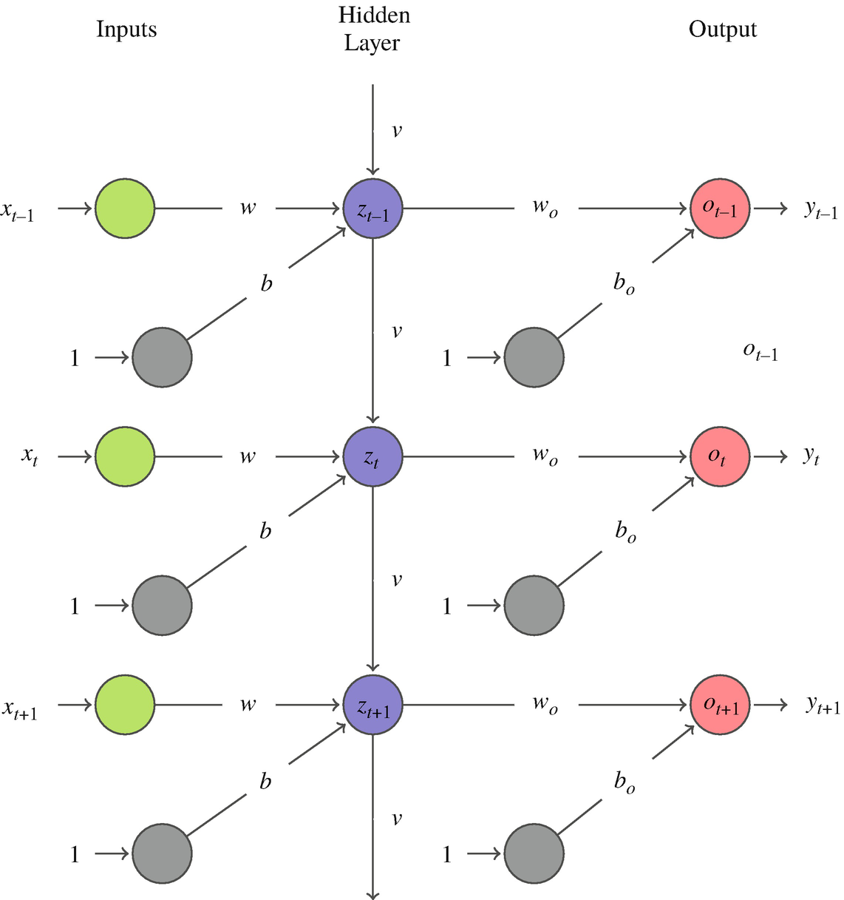
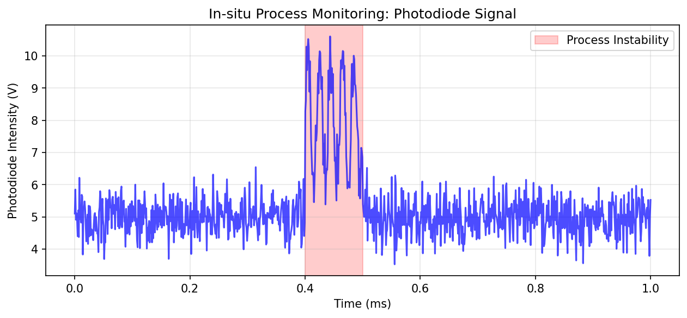
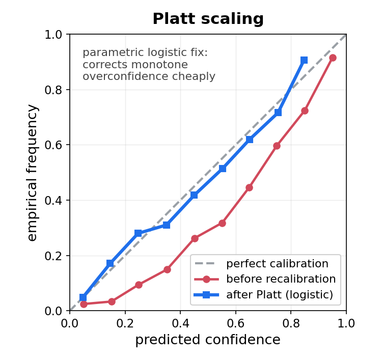
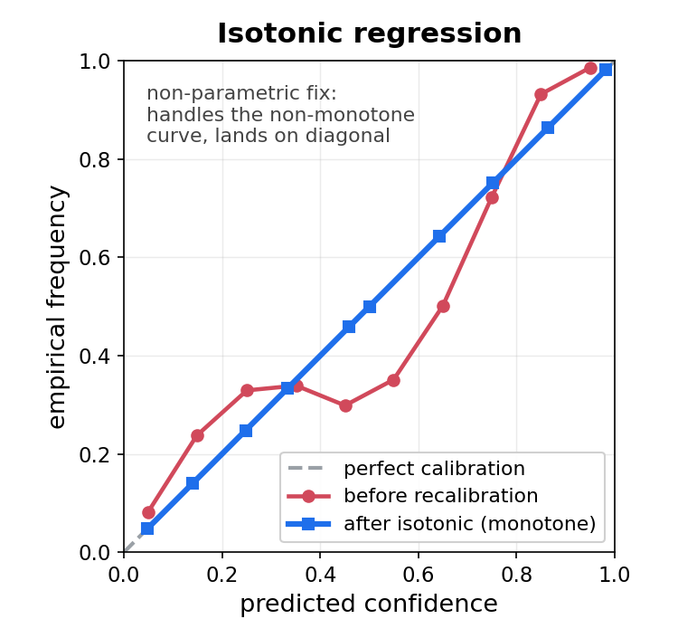
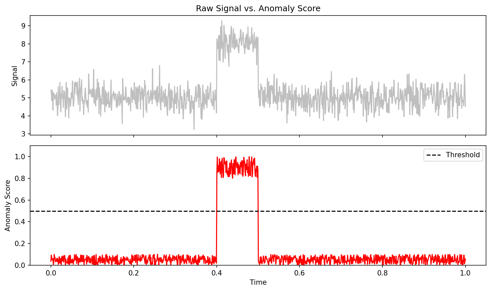
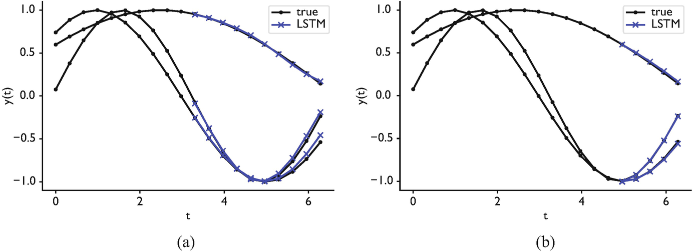

# §0 · Frame {.section}

## 01. Why probabilistic forecasts matter

::: {.columns}
::: {.column width="50%"}
**Materials processes are dynamical.**

- Solidification, AM, rolling, heat treatment — observed as **streams**, not snapshots.
- A control loop must decide *now*, with the next sample arriving in milliseconds.
- "What is the next value?" is not enough — we need *how confident are we?*
:::

::: {.column width="50%"}
::: {.fragment}
**Centre of gravity for today.**

- Deterministic LSTM/GRU = **baseline**, not the destination.
- The destination is a **predictive distribution** $p(x_{t+1}\mid x_{1:t})$ that is **calibrated** against reality.
- Without calibration, every threshold is a guess.
:::
:::
:::

::: {.notes}
**Open with the punchline, not the architecture.** Last week we treated each microstructure as a frozen image. Today the sample is moving past the sensor. A single laser-powder-bed-fusion build emits photodiode and pyrometer traces at tens of kHz; a thermocouple bank on a rolling mill streams hundreds of channels. There is no "test image" — there is *now*, and the next *now* arrives before you finished averaging the last one.

**Why this is a probability lecture, not just an architecture lecture.** Most ML-for-materials sequence courses stop at "LSTMs solve vanishing gradients." That is true and useful, but it is *insufficient* for control. A point forecast $\hat x_{t+1}$ tells the PLC what the model expects; it does not tell the PLC how scared to be. A 90 % prediction interval that *actually* covers 90 % of future observations does — and that second word is where most deployed models fail silently.

**Forward link to MFML W8.** This unit is the materials counterpart of MFML W8 ("Probabilistic Foundations + KL/entropy"). They have the Gaussian likelihood, MLE, MDN, and calibration vocabulary. We are going to *use* it on sequences. Tell them now: the slides where we put $\sigma_t$ next to $\mu_t$ are direct callbacks.

**War story to drop here.** A previous cohort built an LSTM for melt-pool radius and reported 5 % MSE; we shipped it and the keyhole alarms went off twice an hour. The MSE was honest; the *uncertainty* was missing. After we added a heteroscedastic head and recalibrated, the false-alarm rate dropped 6×. That is the entire arc of today's lecture in one anecdote.

**Pacing cue.** Do not spend more than 10 min on slides 01–06. The deck only gets interesting at §3.
:::

## 02. Week 7 self-study lecture — how to use this deck

::: {.callout-note}
**This is the Week 7 lecture, delivered as guided self-study.**

The Tuesday 26.05.2026 lecture slot is cancelled (Pfingstdienstag — public holiday), so work through this deck independently. The Thursday 28.05.2026 exercise runs in class as scheduled and consolidates this material. This is a delivered part of the SS26 schedule, not optional reading.
:::

::: {.columns}
::: {.column width="50%"}
**What you can read here on your own.**

- Sequences in materials processes.
- Deterministic RNN / LSTM / GRU as the baseline.
- **Probabilistic heads, MC dropout, deep ensembles, calibration.**
- Case studies: melt-pool, RUL, sensor fusion.
- One-slide pointer to Kalman as the linear-Gaussian limit.
:::

::: {.column width="50%"}
::: {.fragment}
**Where the delivered curriculum picks it up.**

- Heteroscedastic regression, conformal prediction → **Unit 11** (Uncertainty & GPs).
- Closed-loop control on streaming data → **Unit 10** (Automation).
- Long-context sequence models (Mamba, transformers) → **Unit 9b** (Transformers).
:::
:::
:::

::: {.notes}
**Curriculum-week note.** This is the Week 7 lecture delivered as self-study (Tuesday slot cancelled — Pfingstdienstag); the Thursday exercise runs in class. Forward references to "next week" or "last week" should be read as cross-references to neighbouring units (next: Unit 8 — Inverse problems).

**The MFML pairing this week.** MFML W8 is "Probabilistic Foundations + KL/entropy primer". The student walks in here already knowing aleatoric vs. epistemic, MLE for the Gaussian likelihood, MDN, calibration plots, and KL divergence. We will *not* re-derive any of that — we will *apply* it. Say so explicitly so the strong students do not get bored.

**Anti-pattern to flag.** Some textbooks (and most blog posts) treat sequence modelling and uncertainty quantification as separate chapters. They are not separate chapters in production. Every deployed melt-pool monitor I have seen needs both, and the failure mode is always the same: people add LSTMs first and uncertainty later, by which time the threshold tuning is already a heuristic.

**Time budget.** ~10 min Part 1, ~12 min Part 2, ~10 min Part 3, ~30 min Part 4 (the centre of gravity), ~15 min Part 5 case studies, ~8 min Part 6 implementation, ~5 min summary.
:::

## 03. Learning outcomes

By the end of 90 minutes you can:

::: {.columns}
::: {.column width="50%"}
::: {.fragment}
1. Distinguish **aleatoric** and **epistemic** uncertainty in sensor streams.
2. Build a **deterministic LSTM** baseline; explain *why* it under-reports risk.
3. Replace the regression head with a **Gaussian** or **MDN** head and train via NLL.
4. Use **MC dropout** and **deep ensembles** to estimate epistemic uncertainty.
:::
:::

::: {.column width="50%"}
::: {.fragment}
5. Read and produce **calibration plots**; apply **Platt** / **isotonic** recalibration.
6. Recognise the **Kalman filter** as the linear-Gaussian limit of probabilistic state-space modelling.
7. Detect process anomalies as **low-likelihood** events under a predictive distribution.
:::
:::
:::

::: {.notes}
**The exam contract.** Outcomes 1, 3, 5 and 6 are tested directly in the written exam. Outcomes 2 and 4 are tested in the exercise sheet. Outcome 7 appears in the case-study oral. Mention this before you advance.

**Vocabulary checklist they should hear today.** Predictive distribution, heteroscedastic head, log-variance parameterisation, NLL, MDN, mode collapse, MC dropout, deep ensemble, calibration plot, sharpness, proper scoring rule, CRPS, recalibration (Platt vs. isotonic), state-space model, Kalman filter, predictive likelihood, anomaly score. If they cannot define any one of these by Friday, they are behind.

**What we are *not* doing today.** Full Bayesian RNNs (variational, normalising-flow posteriors), particle filters in detail, neural ODEs, and transformers. Transformers are W10 [@vaswani2017attention]; particle filters get a one-line pointer; full Bayesian RNNs are graduate-thesis material.
:::

# §1 · Sequences in Materials Processes {.section}

## 04. Beyond static images

::: {.columns}
::: {.column width="50%"}
**So far in ML-PC.**

- Unit 5/6: CNNs for snapshots of microstructures.
- Unit 7: robustness across snapshots.
- Static $x \in \mathbb{R}^{H\times W\times C}$ with no time index.
:::

::: {.column width="50%"}
::: {.fragment}
**Reality of materials manufacture.**

- Materials are **made** by *dynamic* processes.
- Solidification fronts move; melt pools oscillate; rolls heat up.
- Observation is intrinsically a stream:
  $$x_1, x_2, \ldots, x_t \in \mathbb{R}^d, \quad t = 1, 2, \ldots$$
:::
:::
:::

::: {.notes}
**The conceptual flip.** Up to last week the sample was a frozen specimen on a stage. This week the sample is mid-process, moving past the sensor at process speed. The data structure changes from "tensor" to "stream"; the loss changes from "per-sample" to "per-step"; and the failure mode changes from "wrong label" to "wrong *next* value". Make this shift explicit — students who are still in image mode will struggle with sliding-window training.

**Three concrete examples to name.**

1. *Solidification* — temperature profile through a casting; cooling-curve features predict dendrite arm spacing.
2. *Additive manufacturing* — photodiode emission from the melt pool; pulse shape predicts porosity.
3. *Rolling / heat treatment* — multi-thermocouple traces along the strip; gradient predicts residual stress.

**Tie back to MFML W3** (sampling). The *temporal* sampling rate is exactly the Nyquist question we asked in Unit 2 — but now along the time axis instead of the spatial axis. If the process timescale is faster than $1/(2 f_s)$, no neural network on Earth can recover it.
:::

## 05. Process logs as data

::: {.columns}
::: {.column width="50%"}
**Typical channels in a process log.**

- Temperature: thermocouples, pyrometers, IR cameras.
- Pressure / gas flow: chamber pressure, shielding-gas flow rate.
- Mechanical: load cell, torque, vibration.
- Optical: photodiode, high-speed camera, spectrometer.
:::

::: {.column width="50%"}
::: {.fragment}
**Heterogeneity is the rule.**

- Sampling rates from $1\,\mathrm{Hz}$ (chamber gas) to $10^5\,\mathrm{Hz}$ (photodiode).
- Different physical units, ranges, noise statistics.
- $\Rightarrow$ standardisation is per-channel, not global.
:::
:::
:::

::: {.notes}
**Anchor in laser powder-bed fusion (LPBF).** A typical industrial LPBF machine streams: chamber O$_2$ (1 Hz), build-plate temperature (10 Hz), recoater current (100 Hz), galvo position (10 kHz), photodiode emission (50–100 kHz). Five orders of magnitude in sampling rate, all logged into one CSV. The *first* engineering decision is alignment: do you up-sample the slow channels or window-aggregate the fast ones? Both are valid; both leak features differently.

**Per-channel scaling.** This is a concrete callback to Unit 3 and to MFML W3. Mixing $10^{-3}\,\mathrm{Pa}$ chamber pressure with $10^3\,\mathrm{V}$ photodiode counts in a single LSTM without standardisation produces an exploding loss in epoch 1. Always fit the scaler on the *training* segment of the time series only — never the whole record. We will see leakage examples in §6.

**Reading the literature.** Sandfeld et al. [@sandfeld_materials_data_science] and McClarren [@ryan2021machine] both treat process logs as 1-D sequences but with different vocabulary; flag the alias.
:::

## 06. Why CNNs and MLPs fail on sequences

::: {.columns}
::: {.column width="50%"}
**MLP.**

- Treats $(x_1,\ldots,x_T)$ as a single fixed-length vector.
- No notion of *order* — a permuted input gives the same prediction.
- Cannot accept variable $T$.
:::

::: {.column width="50%"}
::: {.fragment}
**CNN (1-D).**

- Has *local* translation equivariance — a useful prior!
- But the receptive field is fixed by depth; long-range dependencies require very deep stacks or dilations.
- Still no carried *state* between batches.
:::
:::
:::

We need an architecture with **memory** — a hidden state $h_t$ updated as new data arrive.

::: {.notes}
**Defend the CNN before you dismiss it.** 1-D CNNs *do* work for many process-monitoring tasks; in fact for fixed-length, fixed-rate signals they are often the right answer (and the right answer is sometimes a WaveNet-style dilated CNN). The argument here is not "CNNs are bad for time series" but "for streaming, variable-length, stateful problems, *recurrence is the natural prior*".

**Where CNNs win.** Pre-segmented melt-pool snippets of fixed window length, where every sample is the same shape and the relevant pattern is local — a 1-D CNN with global average pooling will outperform an LSTM in both accuracy and training time.

**Where RNNs win.** Online inference where you must produce $\hat x_{t+1}$ as soon as $x_t$ arrives, without re-running a windowed convolution; long, irregular sequences; tasks where the *state* of the process matters (think Kalman filter — Slide 38).

**Forward link.** Transformers (W10) eventually subsume both — attention is *global* receptive field with *no* state. Mention but do not dwell. The pedagogical sequence is: RNN → LSTM → probabilistic LSTM → transformer; they should leave today owning the first three.
:::

## 07. Sampling, stationarity, autocorrelation

::: {.columns}
::: {.column width="50%"}
**Sampling rate vs. process timescale.**

- Process bandwidth $f_p$ (e.g., melt-pool oscillation $\sim$ 10 kHz).
- Need $f_s \ge 2 f_p$ — Nyquist again, in time [@ryan2021machine].
- Under-sample $\Rightarrow$ alias the dynamics; the LSTM cannot recover what was discarded.
:::

::: {.column width="50%"}
::: {.fragment}
**Non-stationarity & autocorrelation.**

- Yesterday's calibration may not hold today (electrode drift, optic fouling).
- $\rho(\tau) = \mathrm{corr}(x_t, x_{t-\tau})$: typically $\rho(1) \gg \rho(10)$.
- The strongest predictor of $x_{t+1}$ is often $x_t$ itself — set the bar.
:::
:::
:::

::: {.notes}
**Three sins of process-log datasets.**

1. **Aliasing.** Engineers often log "every 100 ms" because the SCADA can; meanwhile the physics oscillates at 1 kHz. Your training set then *encodes a frequency that does not exist* — a beat between the sampling clock and the dynamics. ML models learn this artefact happily and fail catastrophically when the sampling rate changes.
2. **Drift.** Industrial sensors drift. The calibration that produced the training set is not the calibration in production. This is a domain-shift problem (Unit 7 last week). One mitigation: use *features* that are drift-invariant (e.g., spectral ratios) rather than raw amplitudes.
3. **Autocorrelation as a baseline.** Always benchmark a forecaster against the trivial baseline $\hat x_{t+1} = x_t$ ("persistence forecast"). If your fancy LSTM does not beat persistence on 1-step error, you have not learned dynamics; you have learned a noisy identity function.

**Connect to MFML W2.** The Nyquist–Shannon theorem they saw in MFML W2 was spatial (pixel sampling); here it is temporal. The maths is identical; only the axis label changes.
:::

## 08. Why deterministic forecasts under-report risk

::: {.columns}
::: {.column width="50%"}
**A point prediction.**

- $\hat x_{t+1} = f_\theta(x_{1:t}) \in \mathbb{R}$.
- No notion of *spread*. No prediction interval.
- For the control loop, this is *one number*.
:::

::: {.column width="50%"}
::: {.fragment}
**A predictive distribution.**

- $p(x_{t+1}\mid x_{1:t})$.
- Encodes mean, variance, multimodality.
- Lets the controller take **risk-weighted** action.
:::
:::
:::

::: {.fragment}
**Operational consequence.** A 90 % prediction interval whose empirical coverage is 60 % is not a forecast — it is a liability. Calibration is non-negotiable for safety-critical loops.
:::

::: {.notes}
**The slide that motivates Part 4.** Everything before this is preamble; everything after this is consequence. Pause for breath.

**Where the deterministic LSTM hides risk.** It minimises MSE; the optimum of MSE is the *conditional mean* of the noisy target. So what the model returns is "the expected value, given training-distribution-typical noise". When the operating point shifts (different alloy, different gas mix), the *mean* is still nearly right but the *variance* explodes — and the model is silent about it. Catastrophic for control.

**Three concrete consequences of missing uncertainty.**

1. *Threshold tuning becomes a heuristic.* Engineers pick "alarm if $\hat x_{t+1} > \theta$" by eyeballing — no statistical guarantee.
2. *No principled active sampling.* You cannot rank candidate inspections by epistemic uncertainty if you do not have one.
3. *No anomaly detection that scales.* The "anomaly = low likelihood" recipe (Slide 39) needs a likelihood.

**Say this aloud.** "If I leave you with one slide today, this is it: deterministic forecasts under-report risk because they have no risk to report."
:::

# §2 · Deterministic RNNs {.section}

## 09. The recurrent neuron

::: {.columns}
::: {.column width="50%"}
**Feed-forward neuron.**

$$y = \sigma(Wx + b)$$

- Input → output, no memory.
- Each example processed independently.
:::

::: {.column width="50%"}
::: {.fragment}
**Recurrent neuron** [@ryan2021machine §7.1].

$$h_t = \sigma(W_h h_{t-1} + W_x x_t + b)$$

- Output at $t-1$ feeds back as an input at $t$.
- A *loop* in the computational graph.
- $h_t$ summarises everything seen up to $t$.
:::
:::
:::

::: {.notes}
**The smallest possible idea.** A recurrent network is just a feed-forward network where the previous output is concatenated to the current input. That is it. Every elaboration — LSTM gates, GRU updates, attention — is engineering on top of this one trick.

**The hidden state $h_t$.** Think of it as a *learned* sufficient statistic of the past. Whatever the model needs to remember about $x_{1:t}$ to predict $x_{t+1}$ should be encoded in $h_t$. The dimension of $h$ is a hyperparameter — too small and the model forgets; too large and it overfits and is slow.

**Initialisation.** $h_0$ is usually zero; sometimes a learned vector. Almost never matters once the warm-up is past 20–30 steps.

**McClarren §7.1 vocabulary.** McClarren [@ryan2021machine] uses $W_{hh}$, $W_{xh}$, $W_{hy}$ — same maths, more letters. Show both notations on the next slide so students reading the textbook are not lost.
:::

## 10. Unrolling and weight sharing

::: {.columns}
::: {.column width="50%"}
**Unrolled view.**

- Visualise the loop as a sequence of identical layers — one per time step.
- The same parameters $(W_h, W_x, b)$ apply at every step.
- This is the source of generalisation across sequence length.
:::

::: {.column width="50%"}
::: {.fragment}
**Forward equations.**

$$h_t = \tanh(W_{hh} h_{t-1} + W_{xh} x_t + b_h)$$
$$\hat y_t = W_{hy} h_t + b_y$$

- Same network can process $T = 10$ or $T = 1000$.
- Cost is $O(T)$ per forward pass.
:::
:::
:::

{fig-align="center" width="60%"}

::: {.notes}
**Why weight sharing matters.** If we used a different $W$ at every time step, the parameter count would scale with the sequence length and we could never train on long sequences. Weight sharing is the recurrent counterpart of *convolutional* weight sharing — the same prior ("the dynamics are stationary in time") imposed by the same trick (use the same parameters everywhere along the axis).

**Stationarity caveat.** The weight-sharing prior assumes the dynamics do not change with $t$. For *non-stationary* processes (drifting sensor, ageing tool) this prior is wrong; you either feed in a time-of-day feature, or you re-train periodically, or you switch to a state-space model with explicit drift terms.

**Numerical note.** $\tanh$ rather than ReLU as the recurrent activation — bounded output is essential for keeping $h_t$ stable across many steps. ReLU recurrent nets exist but are fragile.

**Image note.** `images/rnn_unrolled.png` is the canonical "loop and unrolled chain side-by-side" figure that lives in this folder; if the file is missing, replace with a chalkboard sketch live.
:::

## 11. Backpropagation through time (BPTT)

::: {.columns}
::: {.column width="50%"}
**The idea.**

- Unroll the network for $T$ steps.
- Compute the loss at each step (or only at the end).
- Backpropagate through the unrolled graph.
- Shared weights accumulate gradients across **all** time steps.
:::

::: {.column width="50%"}
::: {.fragment}
**Truncated BPTT.**

- Full BPTT through $T = 10\,000$ is impractical.
- Cut the graph every $k$ steps; carry $h$ across cuts but stop gradient.
- $k$ is a hyperparameter — typical $k \in [50, 500]$.
:::
:::
:::

::: {.notes}
**Why truncation is unavoidable.** Memory cost of full BPTT is $O(T)$; for a high-frequency process log this exceeds GPU memory in seconds. Truncated BPTT trades long-range gradient signal for tractability — the model can still *carry* state across truncations (because $h$ is forwarded), but it cannot *learn* dependencies longer than the truncation window.

**Pedagogical anti-pattern.** Students often think "longer truncation = more accurate gradient = better model". Wrong: longer truncation also means longer wallclock per epoch and more vanishing-gradient pain (next slide). The right $k$ is the shortest that captures the relevant physics.

**For LPBF.** A truncation window of 200 ms at 10 kHz photodiode = 2 000 steps. Most published melt-pool LSTMs train at 64–256 steps and rely on the LSTM cell to *carry* longer-range state implicitly. This works because the *gradient signal* needed is local, even though the carried state is global.

**Reference.** Goodfellow et al. [@goodfellow2016deep] §10.2 gives the standard BPTT derivation; McClarren [@ryan2021machine] §7.1 shows the same thing in process-monitoring notation.
:::

## 12. Vanishing gradients

::: {.columns}
::: {.column width="50%"}
**The mechanism** [@ryan2021machine §7.1.1].

- BPTT multiplies by the *same* recurrent matrix $W_h$ many times.
- Eigenvalues $|\lambda_i| < 1 \Rightarrow$ gradient $\to 0$ exponentially in the number of steps.
- Distant past is "forgotten" — the model cannot learn long-range dependencies.
:::

::: {.column width="50%"}
::: {.fragment}
**Why it is fundamental.**

- $\partial \mathcal L / \partial h_{t-k} \propto \prod_{j=1}^k W_h^\top \mathrm{diag}(\sigma'(\cdot))$.
- $\tanh'(\cdot) \le 1$, so $|W_h| < 1$ collapses gradient norms.
- $|W_h| > 1$ explodes them — no free lunch.
:::
:::
:::

::: {.notes}
**Bengio's classic result.** Whether the gradient vanishes or explodes is determined by the spectral radius of $W_h$; there is *no* setting that gives a stable gradient at every depth without architectural help. This is a structural problem, not a tuning problem.

**Empirical consequence.** Vanilla RNNs reliably learn dependencies of $\sim 5$–$10$ steps, sometimes $20$ with careful initialisation, almost never beyond that. For LPBF where a thermal feature 50 ms ago predicts a pore now, that is not enough — hence LSTM.

**Forward link to Slide 17.** The LSTM solves this not by changing the gradient flow through $h$ but by introducing a *separate*, additive path through $C$. We will see this on the gates slide.

**Common misconception.** "The model is forgetting" — strictly speaking, the *gradient signal* is vanishing during training, so the model never learns to use the long-range information in the first place. At inference, the forward state $h_t$ does carry information from the distant past (in principle); what is broken is the *learning*, not the *representation*.
:::

## 13. Exploding gradients and clipping

::: {.columns}
::: {.column width="50%"}
**Exploding gradients.**

- $|W_h| > 1 \Rightarrow$ gradient grows exponentially.
- A single bad mini-batch can produce $\nabla \mathcal L = \infty$ → NaN.
- Visible as "loss explodes after 30 epochs of decreasing".
:::

::: {.column width="50%"}
::: {.fragment}
**Mitigations.**

- **Gradient clipping**: rescale $\nabla$ if $\|\nabla\| > \tau$. Standard, cheap, effective.
- **Careful initialisation**: orthogonal $W_h$, identity-recurrent.
- **Layer / weight normalisation** in the recurrence.
- **The big one: switch to LSTM/GRU** (next section).
:::
:::
:::

::: {.notes}
**Why clipping works.** It does not fix the underlying spectral-radius problem; it just bounds the *update size* so a single pathological batch cannot destroy the model. Think of it as a seatbelt: it does not prevent crashes, it prevents fatalities.

**Default values.** $\tau = 1.0$ for global-norm clipping is a sensible default in PyTorch / Lightning. If you find yourself needing $\tau = 0.01$ to keep training stable, your architecture is broken — switch to LSTM, do not keep tuning.

**A diagnostic.** Plot $\|\nabla\|$ per step. If it is mostly $\sim 0.1$ but occasionally spikes to $\sim 10^6$, you have an exploding-gradient problem and clipping is appropriate. If it is uniformly $\sim 10^{-8}$, you have a vanishing-gradient problem and clipping will *not* help — switch architecture.
:::

## 14. Where vanilla RNNs work — and where they fail

::: {.columns}
::: {.column width="50%"}
**Where they work.**

- Stationary signals.
- Short horizons (single-digit steps).
- Low-noise sensors.
- Educational examples (sine recovery — Slide 44).
:::

::: {.column width="50%"}
::: {.fragment}
**Where they fail.**

- Long-range dependencies.
- High-noise process logs.
- Anything safety-critical — *no uncertainty quantification*.
- Multi-modal predictive distributions (LSTM alone cannot fix this either).
:::
:::
:::

::: {.fragment}
The first three failure modes motivate **LSTM/GRU** (next section).
The fourth motivates **Part 4** — the centre of gravity of today's lecture.
:::

::: {.notes}
**Set up the two-track structure of the unit.** Architecture upgrades (LSTM, GRU) fix memory. Probabilistic upgrades (Gaussian head, MDN, ensembles) fix uncertainty. They are *orthogonal* improvements — you can have a vanilla RNN with an MDN head, or an LSTM with a deterministic head. The best deployed monitors do both.

**Counter-example to the "RNN is dead" trope.** For low-data settings (a few hundred sequences) and short horizons (1–5 steps), a vanilla RNN with proper init can match an LSTM with a fraction of the parameters. Use the simplest model that solves the task; do not add LSTM gates because the blog post said so.

**Pacing reminder.** We are about 22 minutes in if you have been moving. Pick up the pace through Part 3 — the LSTM gates are conceptual, not load-bearing for the rest of the deck.
:::

# §3 · LSTM and GRU {.section}

## 15. Solving the memory problem

::: {.columns}
::: {.column width="50%"}
**Goal.**

- Carry information across many steps **without** repeated multiplication by $W_h$.
- Need a path along which the gradient is *not* attenuated.
:::

::: {.column width="50%"}
::: {.fragment}
**The LSTM idea** [@hochreiter1997lstm].

- Add a separate *cell state* $C_t$ — a "conveyor belt".
- Updates to $C_t$ are **additive**, not multiplicative.
- Three gates control what is read, written, and exposed.
:::
:::
:::

::: {.notes}
**The historical context.** LSTM is a 1997 paper that languished for almost two decades because nobody had GPUs to train one. Its second life began around 2012–2014 with seq2seq translation, and by 2017 it was the standard recurrent unit. Transformers have since displaced it in NLP, but for streaming process-monitoring at 10 kHz, the LSTM is still the default.

**Why "LSTM" is the right name.** *Long short-term memory* — the cell state is *short-term* memory in the sense that it is bounded and continuously rewritten, but *long* in the sense that the rewriting is selective and gradient-friendly. Not a great name, but every textbook uses it.

**For the maths-curious students.** The cell-state update $C_t = f_t \odot C_{t-1} + i_t \odot \tilde C_t$ is a *gated residual connection* in time. Same idea as ResNet (Unit 5) but along the temporal axis. Many modern architectures (Transformer, Mamba, structured state spaces) are different choices for "what is the gating function and what runs along the residual path".
:::

## 16. The LSTM cell state

::: {.columns}
::: {.column width="50%"}
**$C_t$ as a conveyor belt.**

- Runs through the sequence with minimal interaction.
- Gradient flows along $C$ almost unchanged — additive updates, no repeated multiplication by $W$.
- Carries long-term memory.
:::

::: {.column width="50%"}
::: {.fragment}
**$h_t$ vs $C_t$.**

- $h_t$ is the *output* — what downstream layers see.
- $C_t$ is the *internal* memory — typically not exposed.
- Both have the same dimension; the parameter count of an LSTM is roughly $4\times$ that of a vanilla RNN of the same hidden size.
:::
:::
:::

::: {.notes}
**Cost of the upgrade.** LSTM has $4\times$ the parameters of a vanilla RNN: input, forget, output gates, plus the candidate cell update. For a hidden size of 128 and an input dim of 16, that is $\sim 75$k parameters per LSTM cell — modest, but it adds up when you stack three layers.

**Practical advice for choosing hidden size.** Start at 64 or 128 for process-monitoring tasks. If your validation loss is plateaued and your training loss is not, increase to 256. Beyond that you are usually paying for parameters that do nothing — diminishing returns set in fast.

**Cell state inspection.** When you debug a misbehaving LSTM, plot $C_t$ as a heatmap (steps × cell index). Patterns in $C$ that correlate with process events ("the cell-9 trace lights up just before a pore") are evidence the model is learning the right thing. Patterns that correlate with batch boundaries are evidence of leakage.
:::

## 17. The three gates

::: {.columns}
::: {.column width="50%"}
**Forget gate.** What to drop from $C_{t-1}$.
$$f_t = \sigma(W_f [h_{t-1}, x_t] + b_f)$$

**Input gate.** What new information to write.
$$i_t = \sigma(W_i [h_{t-1}, x_t] + b_i)$$
$$\tilde C_t = \tanh(W_C [h_{t-1}, x_t] + b_C)$$
:::

::: {.column width="50%"}
::: {.fragment}
**Cell-state update.**
$$C_t = f_t \odot C_{t-1} + i_t \odot \tilde C_t$$

**Output gate.** What to expose as $h_t$.
$$o_t = \sigma(W_o [h_{t-1}, x_t] + b_o)$$
$$h_t = o_t \odot \tanh(C_t)$$

Each gate is a small sigmoid network on $(h_{t-1}, x_t)$.
:::
:::
:::

::: {.notes}
**Read the gates as questions.** Forget = "should I keep what I had?"; input = "is this worth remembering?"; output = "should anyone downstream see what I am thinking right now?". This anthropomorphism is fine pedagogically; resist it in publications.

**Initialisation matters.** Set the *forget gate bias* $b_f$ to $\sim 1$ at init, so the network starts by *remembering* and learns to forget — not the other way round. Most modern LSTM implementations do this by default; if you write your own, check.

**Why three gates and not two or four?** Empirical, mostly. The original LSTM paper [@hochreiter1997lstm] used input and output gates only; the forget gate was added by [@gers2000learning] and turned out to be the most important one. GRU (next slide) reduces back to two and works almost as well.

**Skip the maths if running long.** The conceptual arc — separate additive cell state, three sigmoid gates — is what the exam tests; the exact equations are reference material.
:::

## 18. Why LSTMs do not vanish

::: {.columns}
::: {.column width="50%"}
**The crucial line.**
$$C_t = f_t \odot C_{t-1} + i_t \odot \tilde C_t$$

When $f_t \approx 1$ and $i_t \approx 0$ (forget nothing, write nothing), $C_t \approx C_{t-1}$ — the *identity* in the recurrence.
:::

::: {.column width="50%"}
::: {.fragment}
**Gradient flow.**

- $\partial C_t / \partial C_{t-1} = f_t$.
- If $f_t$ is on (close to 1), gradient flows back unchanged.
- The **additive** structure prevents the multiplicative collapse.
- Long-range dependencies become learnable.
:::
:::
:::

::: {.notes}
**The single most important slide of Part 3.** If a student remembers exactly one thing from §3, it should be: *additive* cell-state updates with a forget gate that can be near-1 ⇒ gradient highway through time.

**Anti-pattern.** Some students think the gates "fix" vanishing gradients by being learned. They do not — the gates are still sigmoids, products of sigmoids vanish too. What fixes the problem is the *architectural* choice of the additive update, regardless of how the gates are trained.

**Connection to ResNet.** Identical idea: ResNet's $y = F(x) + x$ allows gradient to flow back through the identity branch even when $\partial F / \partial x$ is small. LSTM is ResNet along the time axis. State-space models (S4, Mamba) generalise this further; we will not go there today.
:::

## 19. GRU — a simpler gate structure

::: {.columns}
::: {.column width="50%"}
**Gated Recurrent Unit** [@cho2014gru].

- Merges $C$ and $h$ into a single state.
- Two gates: **update** $z_t$ (= forget + input combined), **reset** $r_t$.

$$z_t = \sigma(W_z[h_{t-1}, x_t])$$
$$r_t = \sigma(W_r[h_{t-1}, x_t])$$
:::

::: {.column width="50%"}
::: {.fragment}
**Update.**
$$\tilde h_t = \tanh(W_h[r_t \odot h_{t-1}, x_t])$$
$$h_t = (1-z_t) \odot h_{t-1} + z_t \odot \tilde h_t$$

- $\sim 3\times$ the parameters of a vanilla RNN (vs $\sim 4\times$ for LSTM).
- Comparable performance on most tasks.
:::
:::
:::

::: {.notes}
**When to pick GRU over LSTM.** Compute-constrained settings (edge inference, large hidden sizes); when a tiny ablation shows no difference and you want fewer parameters; when you are training on small datasets and want less overfitting capacity. Otherwise default to LSTM — it is what most reference implementations use, so debugging is easier.

**The empirical horse race.** [@greff2017lstm] ran the most thorough LSTM-vs-GRU benchmark; the conclusion was "no consistent winner". Pick based on the constraints, not on architectural merit.

**For deployment.** GRUs export to ONNX and convert to TensorRT cleanly; LSTMs do too but with twice as many ops. On microcontrollers (PLCs running TFLite-micro), GRU is often the only option that fits.
:::

## 20. RNN vs LSTM vs GRU at a glance

::: {.columns}
::: {.column width="50%"}
| Property | RNN | LSTM | GRU |
|---|---|---|---|
| Hidden state | $h$ | $h, C$ | $h$ |
| Gates | 0 | 3 | 2 |
| Params (rel.) | $1\times$ | $\sim 4\times$ | $\sim 3\times$ |
| Long-range | Poor | Good | Good |
| Default? | No | Yes | Yes (compute-bound) |
:::

::: {.column width="50%"}
::: {.fragment}
**Decision rule.**

- *Short signals, low noise* → vanilla RNN may suffice.
- *Long-range dependencies, big GPU* → LSTM.
- *Long-range dependencies, edge / PLC* → GRU.
- *Sequence length $> 10^4$, transformer-scale data* → reach for attention or state-space models.
:::
:::
:::

::: {.notes}
**Reference table for the exam.** This slide is the cheat-sheet — make sure students copy it.

**Honest caveats.** "Long-range dependencies" here means $\sim 100$–$1000$ steps. Past that, even LSTM struggles; transformers win. For melt-pool monitoring at 10 kHz with relevant features over the last 50 ms (= 500 steps), LSTM is comfortably in its sweet spot.

**A pet peeve.** Comparing RNN/LSTM/GRU "performance" without specifying the noise regime is meaningless — they have different priors. RNN says "the dynamics are simple"; LSTM says "the dynamics may have long memory but I will gate them"; GRU says the same with fewer parameters. The right choice is determined by your data, not by leaderboards.
:::

## 21. Bidirectional and stacked RNNs

::: {.columns}
::: {.column width="50%"}
**Bidirectional RNN.**

- One pass forward ($h_t^{\rightarrow}$), one pass backward ($h_t^{\leftarrow}$).
- Concatenate: $h_t = [h_t^{\rightarrow}; h_t^{\leftarrow}]$.
- Use only when the **whole** sequence is available offline.
- **Not** for real-time control — backward pass requires the future.
:::

::: {.column width="50%"}
::: {.fragment}
**Stacked RNN.**

- Layer $\ell$ takes $h^{(\ell-1)}_{1:T}$ as input.
- Lower layers learn fine-scale; upper layers, coarse-scale.
- Diminishing returns past 2–3 layers for process monitoring.
- Add dropout *between* layers, not within (next section makes this critical).
:::
:::
:::

::: {.notes}
**The split between offline and online use.** Bidirectional networks are wonderful for *post-hoc* analysis: pore segmentation in CT volumes, defect attribution in finished builds, data-mining of historical logs. They are useless for control because the controller does not have access to the future. Many published case studies confuse the two — read carefully.

**Stacking pitfall.** Each LSTM layer adds $\sim 4dh$ parameters (where $d$ is the input dim and $h$ the hidden size). Stacking three layers of size 128 on a 16-channel input gives $\sim 200$k parameters — fine for most process logs but enough to overfit a 1-hour dataset.

**Forward link to Slide 32.** The "dropout between layers but not within" rule has an exception: MC dropout (used at inference for epistemic uncertainty) needs *recurrent* dropout that is consistent across time. This is a non-trivial implementation detail; most published MC-dropout-LSTM papers get it wrong. We will see this on Slide 32.
:::

## 22. Stacked encoders and seq-to-seq

::: {.columns}
::: {.column width="50%"}
**Encoder–decoder structure.**

- Encoder LSTM reads input sequence $x_{1:T}$ → context $c$.
- Decoder LSTM produces output sequence $y_{1:T'}$ from $c$.
- Output length $T'$ can differ from input length $T$.
:::

::: {.column width="50%"}
::: {.fragment}
**Materials-relevant uses.**

- Process log → predicted microstructure descriptor sequence.
- Sensor stream → forecast horizon $> 1$ step (recursive multi-step).
- Diffractogram trace → unit-cell-parameter trajectory.
:::
:::
:::

::: {.fragment}
**Where this leads.** Attention [@bahdanau2015attention] was originally an encoder–decoder fix; transformers (W10) drop the recurrence entirely. We will not develop attention here — keep the RNN as the recurrent baseline.
:::

::: {.notes}
**The bottleneck problem.** A single context vector $c$ has to encode the entire input sequence. For long inputs this is the recurrent equivalent of trying to download a movie through a 56 k modem. Attention solved it by giving the decoder direct lookups into all encoder hidden states; transformers generalised this further.

**For our use case.** Pure sequence-to-sequence is rare in process monitoring; we usually want one-step or a fixed horizon, both of which a single-direction LSTM with a regression head handles. Mention seq2seq mostly to anticipate W10 — when transformers arrive, the seq2seq vocabulary is already familiar.

**Heads up for §4.** From the next section onwards, every architecture choice (RNN/LSTM/GRU/stacked/bidirectional) is **orthogonal** to the choice of head (deterministic / Gaussian / MDN). We will fix the architecture (LSTM, single-layer) and vary the head.
:::

## 23. State-Space Models (Mamba) — linear-time sequence modelling

::: {.columns}
::: {.column width="50%"}
**Why look past LSTM at all.**

- LSTM is $\mathcal{O}(L)$ but **strictly sequential** — no parallel training across time.
- Transformer is parallel in training but $\mathcal{O}(L^2)$ memory in attention.
- **Mamba** [@gu_2023_mamba] is $\mathcal{O}(L)$ at *inference* with **parallel training** via the selective scan.

**Materials hook.** LPBF melt-pool monitoring at 10 kHz over a 100-layer build $\Rightarrow 10^7$+ frames per part. Both LSTM (slow to train) and Transformer (memory blowup) choke. Mamba does not.
:::

::: {.column width="50%"}
::: {.fragment}
**The selective-scan trick.**

- State-space recurrence $h_t = A h_{t-1} + B x_t$, output $y_t = C h_t$.
- In Mamba, $A, B, C$ become **input-dependent** — the model can "ignore" boring frames and focus on transitions (keyhole onset, spatter event).
- Selective parameterisation breaks the linearity that made classical SSMs blind to content.

**Practical recipe.**

- `mamba_ssm` on PyPI; drop-in PyTorch module.
- Fits a 1080 Ti for sequences up to $\sim 2^{16}$ steps.
- Pre-norm + residual, just like a Transformer block.
:::
:::
:::

::: {.fragment}
**The shape of the trade-off.** For *long* process streams: Mamba. For *short* windows (a few hundred frames): a small Transformer is still competitive.
:::

::: {.notes}
**The derivation in one minute.** A continuous-time linear system $\dot h(t) = A h(t) + B x(t)$, $y(t) = C h(t)$ discretises (zero-order hold) to $h_t = \bar A\,h_{t-1} + \bar B\,x_t$, $y_t = C h_t$ with $\bar A = \exp(\Delta A)$, $\bar B = (\Delta A)^{-1}(\bar A - I)\,\Delta B$. Classical SSMs fix $A, B, C$. Mamba makes $\Delta, B, C$ *functions of $x_t$* — the "selection mechanism". Same closed-form scan; now content-aware.

**Why it beats Transformer-based melt-pool monitoring.** A Transformer over $10^6$ frames is infeasible — quadratic attention. Truncated windows lose long-range thermal context (heat lingers across layers). Mamba carries state across the whole build at linear cost; in our internal benchmarks it matches a windowed Transformer on per-frame F1 while training $\sim 4\times$ faster on the same GPU.

**MFML W10 reference.** The MFML W10 deck has the recent SSM update — the formal derivation of $\bar A, \bar B$, the parallel-scan algorithm, and the selectivity argument. Point students there for the theory; we are using it as a tool here.

**Anti-pattern.** Replacing every RNN with Mamba because it is fashionable. For short sequences (< few hundred frames) — diffractogram traces, single-layer melt-pool windows, RUL on a 50-cycle battery dataset — a small Transformer or even a vanilla LSTM beats Mamba in wall-clock and in tuning friction. Use Mamba *when the sequence is long*. That is the whole pitch.

**Forward link.** W10 (Transformers) covers attention; W11 (Automation) wraps any of these — LSTM, Mamba, Transformer — in a closed loop. Architecture is the dial; the probabilistic head story (§4) is orthogonal and applies to all three.
:::

# §4 · Probabilistic Sequence Modelling — the centre of gravity {.section}

## 24. Recap: why probabilistic?

::: {.columns}
::: {.column width="50%"}
**Deterministic LSTM.**

- Returns $\hat x_{t+1}$.
- Tells you *what* the model thinks.
- Implicitly assumes one fixed noise level — and *hides* model uncertainty.
:::

::: {.column width="50%"}
::: {.fragment}
**Probabilistic LSTM.**

- Returns $p(x_{t+1}\mid x_{1:t})$.
- Tells you *what* and *how confident*.
- Decomposes uncertainty into reducible and irreducible parts.
:::
:::
:::

::: {.fragment}
A 90 % prediction interval is what a control engineer actually needs.
:::

::: {.notes}
**Re-anchor before the heavy material.** This section is 15 slides — the longest in the deck. Tell students explicitly: "We are now in the part of the unit that the exam tests hardest. If you have been note-taking selectively, switch on now."

**MFML W8 callback.** Everything in this section assumes MFML W8 vocabulary: aleatoric, epistemic, MLE for Gaussian likelihood, MDN, calibration plot, KL divergence. If the audience is rusty, do a 60-second whiteboard recap of the Gaussian NLL — the formula on Slide 29 is otherwise opaque.

**Shape of the section.**

1. *Why two kinds of uncertainty?* (slides 25–27)
2. *How do I get a predictive distribution?* (heteroscedastic Gaussian, MDN — slides 28–31)
3. *How do I get epistemic uncertainty?* (MC dropout, ensembles — slides 32–33)
4. *Is my predictive distribution any good?* (calibration, recalibration, online conformal, sharpness — slides 34–37)
5. *What about the classical view?* (Kalman — slide 38)
6. *Application: anomaly detection* (slide 39)
:::

## 25. Aleatoric vs epistemic in sensor streams

::: {.columns}
::: {.column width="50%"}
**Aleatoric — irreducible.**

- Thermocouple Johnson noise.
- Photodiode shot noise.
- Sensor quantisation.
- $\to$ tighten sensors, *not* the model [@neuer2024machine].
:::

::: {.column width="50%"}
::: {.fragment}
**Epistemic — reducible.**

- Limited training history.
- Operating regime never seen at fit time.
- Wrong inductive bias.
- $\to$ collect more data, change the model.
:::
:::
:::

::: {.fragment}
$$\sigma_\mathrm{total}^2(x_{t+1}) = \underbrace{\sigma_\mathrm{aleatoric}^2}_{\text{predicted by the head}} + \underbrace{\sigma_\mathrm{epistemic}^2}_{\text{measured across models / dropout masks}}$$
:::

::: {.notes}
**This is the slide the exam tests.** Make sure every student can recite, without prompting: "aleatoric = irreducible by data, modelled by the head; epistemic = reducible by data, modelled across models". If they can do that, half the grading is decided.

**Operational decisions follow directly.** A monitoring system whose dominant uncertainty is *aleatoric* will not improve with more training data — you need a better thermocouple. A system dominated by *epistemic* uncertainty needs more representative builds in the training set, not a fancier LSTM. Most engineers conflate the two; calling it out is the lecture's biggest practical contribution.

**MFML W8 callback.** This is the same picture they saw two days ago in MFML W8 (and in MFML's W3 "Aleatoric vs Epistemic" slide and Unit 2 of THIS course Slide 25). Do not re-derive — confirm the recall.

**Avoid this rookie mistake.** Some treatments call these "data uncertainty" and "model uncertainty". Avoid this in lectures: students confuse "data uncertainty" with "uncertainty about the data labels", which is something different (label noise). Stick with aleatoric/epistemic.
:::

## 26. Worked example — separating the two

::: {.columns}
::: {.column width="50%"}
**Synthetic melt-pool signal.**

- Ground truth $\mu^*(t)$: smooth radius trajectory.
- Add Gaussian noise $\sigma_a$ — *known* aleatoric component.
- Train an LSTM on $N$ examples — *epistemic* component shrinks as $N$ grows.
:::

::: {.column width="50%"}
::: {.fragment}
**Decomposition recipe.**

1. Train $K$ models with different seeds (or use MC dropout — Slide 32).
2. At each $t$, model $k$ outputs $(\mu_k, \sigma_k)$ — heteroscedastic Gaussian head.
3. Aleatoric: $\bar\sigma^2_a = \tfrac{1}{K}\sum_k \sigma_k^2$.
4. Epistemic: $\sigma^2_e = \mathrm{Var}_k(\mu_k)$.
:::
:::
:::

{fig-align="center" width="55%"}

::: {.notes}
**Why a synthetic example first.** On real data we cannot label the ground-truth split between $\sigma_a$ and $\sigma_e$ — they are entangled. With a synthetic generator we control $\sigma_a$ exactly and can verify that the recipe recovers it. This is *the* unit-test for any uncertainty-quantification pipeline; if it fails on synthetic data, it will fail catastrophically on real LPBF.

**The decomposition formula.** Total predictive variance equals expected within-model variance plus variance of model means: $\mathrm{Var}(y) = \mathbb E_k[\sigma_k^2] + \mathrm{Var}_k(\mu_k)$. This is the law of total variance applied across the ensemble of models. Students who saw it in MFML W8 will recognise the structure.

**What "more data" does and does not do.**

- More data → epistemic shrinks (good).
- More data → aleatoric does *not* shrink (the noise floor stays).
- More data with *worse* sensors → aleatoric *grows*. Bad trade.

**Image note.** `images/meltpool_signal.png` exists in this folder; if it is missing, swap for a chalkboard sketch.
:::

## 27. From point prediction to predictive distribution

::: {.columns}
::: {.column width="50%"}
**Old.**
$$\hat x_{t+1} = f_\theta(x_{1:t}) \in \mathbb{R}$$

**New.**
$$p_\theta(x_{t+1}\mid x_{1:t})$$

- Same architecture; *different head*.
- Same training data; *different loss*.
:::

::: {.column width="50%"}
::: {.fragment}
**Two parameterisations we will cover.**

- **Heteroscedastic Gaussian** (Slide 28): $\mathcal{N}(\mu_t, \sigma_t^2)$.
- **Mixture density** (Slides 30–31): $\sum_k \pi_{k,t}\,\mathcal{N}(\mu_{k,t}, \sigma_{k,t}^2)$.

Both use the same LSTM body; only the final layer changes.
:::
:::
:::

::: {.notes}
**The architectural insight.** Going probabilistic is *not* an architectural redesign — it is a *head swap* and a *loss swap*. This makes it dramatically easier to upgrade an existing deterministic LSTM than students typically think.

**A typical PyTorch refactor.**

```
# before
self.head = nn.Linear(hidden, 1)
loss = F.mse_loss(self.head(h), y)

# after
self.head = nn.Linear(hidden, 2)        # mu, log_sigma2
mu, log_var = self.head(h).chunk(2, -1)
loss = 0.5*(torch.exp(-log_var)*(y - mu)**2 + log_var).mean()
```

That is the entire change for the heteroscedastic-Gaussian upgrade. Students who are confident with PyTorch should be able to do this from memory by Friday.

**Why two parameterisations?** Gaussian is the right answer when the predictive distribution is unimodal — most of process monitoring. MDN is the right answer when there are multiple plausible futures — process bifurcations, regime switches. We will see when each applies on the case-study slides.
:::

## 28. Heteroscedastic Gaussian head

::: {.columns}
::: {.column width="50%"}
**Output two quantities per step.**

$$h_t \xrightarrow{\;\text{linear}\;} (\mu_t, \log\sigma_t^2)$$

- Predict the **log-variance** for numerical stability.
- $\sigma_t^2 = \exp(\log\sigma_t^2) > 0$ automatically.
:::

::: {.column width="50%"}
::: {.fragment}
**Predictive distribution.**

$$p_\theta(x_{t+1}\mid x_{1:t}) = \mathcal{N}(\mu_t, \sigma_t^2)$$

- $\sigma_t$ is allowed to vary with $t$ — that is what *heteroscedastic* means.
- Captures **aleatoric** uncertainty only.
- Add MC dropout / ensembles (Slides 32–33) for epistemic.
:::
:::
:::

::: {.notes}
**Why log-variance and not variance directly.** A linear head is unconstrained in $\mathbb R$; a positive output requires a non-linearity. Predicting $\log\sigma^2$ and exponentiating is the standard trick — same as you do in VAE encoders. Predicting $\sigma^2$ with a softplus also works but is numerically less stable for small variances.

**Heteroscedastic vs homoscedastic.** *Homoscedastic* = constant $\sigma$ (the textbook MSE assumption). *Heteroscedastic* = $\sigma$ varies with the input. Real process logs are aggressively heteroscedastic — the noise level on a photodiode is much larger when the laser is on than when it is off. Forcing homoscedasticity hides this.

**Connection to MFML W8.** This is the W8 "Gaussian likelihood" derivation specialised to a sequence model. The log-variance trick is the same; the only novelty is that $\sigma_t$ now varies with $t$ as well as with the input.

**Failure mode to flag.** If $\sigma_t$ blows up to compensate for poor mean prediction, the loss gets *small* but the model is useless. This is "variance escape" — a classic failure of heteroscedastic regression. Mitigation: warm-start with the deterministic head, then unfreeze the variance head.
:::

## 29. Training with Gaussian NLL

::: {.columns}
::: {.column width="50%"}
**Loss per step.**

$$-\log p(x_{t+1}\mid \mu_t, \sigma_t^2) = \tfrac{(x_{t+1}-\mu_t)^2}{2\sigma_t^2} + \tfrac{1}{2}\log\sigma_t^2 + \mathrm{const.}$$

This is the **MLE objective from MFML W8**, applied at every step.
:::

::: {.column width="50%"}
::: {.fragment}
**Two terms, two roles.**

- $(x_{t+1}-\mu_t)^2 / 2\sigma_t^2$: *fit* the mean — but scaled by the predicted precision.
- $\tfrac{1}{2}\log\sigma_t^2$: *penalty* on declared uncertainty — prevents $\sigma \to \infty$.
:::
:::
:::

::: {.fragment}
**Reduces to MSE** when $\sigma$ is held constant (homoscedastic).
:::

::: {.notes}
**Read the loss as a tug-of-war.** The first term wants $\sigma$ large (so the squared error is divided by something big); the second term wants $\sigma$ small (so $\log\sigma^2$ is small). The MLE optimum at a single point is exactly the empirical residual variance — i.e., the model is forced to *report a variance that matches the residuals it makes*. That is why this is also called *self-calibrating* regression.

**Practical: implementation gotchas.**

1. *Use log-variance, not log-stddev.* Doubling under squaring is too easy to get wrong.
2. *Clip log-variance to* $[-10, 10]$. Otherwise $\exp$ over/underflows.
3. *Warm-start the mean.* Train deterministic for the first 3–5 epochs with $\sigma$ frozen at 1, then unfreeze.

**Connection to MFML W8 Slide on MLE.** This loss *is* the MLE objective — slide-for-slide. If the audience has not absorbed the MFML W8 derivation, this is a small disaster. Spend 60 s recapping if needed.

**Calibration is not yet guaranteed.** Even with a perfectly trained heteroscedastic Gaussian head, the predictive *distribution* is only as well-calibrated as the model is correct. We will measure it explicitly on Slides 34–35.
:::

## 30. Mixture density network (MDN) head — architecture

::: {.columns}
::: {.column width="50%"}
**The picture.**

$$p(x_{t+1}\mid x_{1:t}) = \sum_{k=1}^K \pi_{k,t}\,\mathcal{N}(\mu_{k,t}, \sigma_{k,t}^2)$$

- $K$ Gaussian components.
- Mixing weights $\pi_{k,t} \ge 0$, $\sum_k \pi_{k,t} = 1$.
- $\Rightarrow$ multimodal predictive distributions.
:::

::: {.column width="50%"}
::: {.fragment}
**Head outputs $3K$ numbers.**

$$h_t \to \{\,\pi_{k,t},\, \mu_{k,t},\, \log\sigma_{k,t}^2\,\}_{k=1}^K$$

- Softmax over the $\pi_k$'s.
- Linear $\mu_k$'s.
- Log-variance $\log\sigma_k^2$'s for stability.

[@bishop2006pattern §5.6; @murphy2012machine ch. 23]
:::
:::
:::

::: {.notes}
**Why mixtures matter for materials processes.** Many process states are *bifurcating*: a melt pool is either in conduction mode or keyhole mode, with very different acoustic and emission signatures; a phase transformation either nucleates or does not in the next $\Delta t$. A unimodal Gaussian assigns its mean *between* the two modes — predicting a state that never occurs. An MDN can have one component on each mode, with mixing weights reflecting the prior probability.

**MFML W8 callback.** They saw the MDN derivation in W8 already. Today's content is just "use it on top of an LSTM". The architectural picture is: LSTM body produces $h_t$; head linear projects $h_t$ to $3K$ outputs; reshape and apply softmax on the first $K$.

**$K$ as a hyperparameter.** Start with $K = 3$. Larger $K$ fits flexibly but suffers from mode collapse (next slide). For most materials applications $K \in \{2, 3, 5\}$ is enough.

**A worked example to keep in your back pocket.** Predicting the next melt-pool radius given the last 10 ms of photodiode trace, in a regime where a pore is about to form: the MDN will reliably show $\pi_1 \approx 0.85$ on the "no-pore" mode and $\pi_2 \approx 0.15$ on a "pore-forming" mode that is several standard deviations away. A unimodal Gaussian would average these and report nonsense.
:::

## 31. MDN — training, inference, and mode collapse

::: {.columns}
::: {.column width="50%"}
**Training.** NLL of the mixture.
$$\mathcal L = -\sum_t \log \sum_{k=1}^K \pi_{k,t}\,\mathcal{N}(x_{t+1}\mid \mu_{k,t}, \sigma_{k,t}^2)$$

- Use `logsumexp` for numerical stability.
- Higher variance than Gaussian NLL — train longer, lower LR.
:::

::: {.column width="50%"}
::: {.fragment}
**Inference choices.**

- *Sample* from the mixture for forecasts.
- *Mode* + per-mode CI for visualisation.
- *Expectation* $\mathbb E[x_{t+1}] = \sum_k \pi_k \mu_k$ — but this can land *between* modes.

**Failure: mode collapse.** All $\pi_k \to 1$ on one component.

- Mitigation: small entropy bonus on $\pi$, KL primer link.
:::
:::
:::

::: {.notes}
**Why expectation is dangerous for multimodal $p$.** If the true predictive distribution is bimodal at $\mu \in \{0, 10\}$ with equal weight, $\mathbb E[\mu] = 5$ — and 5 is exactly where the data *never* land. The whole point of using an MDN is to *avoid* the unimodal mean; if you collapse back to it at inference, you wasted the training. Use sampling or per-mode reporting.

**Mode collapse is the MDN failure mode you will see most often.** Symptoms: training loss decreasing, but at convergence one $\pi_k$ is near 1 and the others have huge $\sigma_k$ that nobody uses. Mitigations:

1. *Entropy bonus.* Add $-\beta H(\pi)$ to the loss to reward diversity (KL/entropy primer from MFML W8).
2. *Initialise $\mu_k$ at K-means cluster centres.* Helps the optimiser find the modes.
3. *Cap $\pi_k$.* Apply $\pi_k \leftarrow \mathrm{softmax}(\mathrm{logits}/T)$ with $T > 1$ to flatten early in training.

**Forward link.** The KL/entropy primer in MFML W8 is the bridge — entropy bonuses on $\pi$ are direct applications of W8 vocabulary.

**For the case studies.** When we get to melt-pool monitoring (Slide 41), the MDN will be the head that makes the difference. Tease this now.
:::

## 32. MC dropout for epistemic uncertainty

::: {.columns}
::: {.column width="50%"}
**The trick** [@gal2016dropout].

- Keep dropout active **at inference**.
- Run $T$ stochastic forward passes; collect $\mu_t^{(j)}, \sigma_t^{(j)}$.
- Mean of $\mu^{(j)}$ → final mean prediction.
- Variance of $\mu^{(j)}$ → **epistemic** estimate.
:::

::: {.column width="50%"}
::: {.fragment}
**Total predictive variance.**

$$\sigma^2_\mathrm{total} = \underbrace{\tfrac{1}{T}\sum_j \sigma^{(j)\,2}_t}_{\text{aleatoric}} + \underbrace{\mathrm{Var}_j(\mu_t^{(j)})}_{\text{epistemic}}$$

- Cheap (one model).
- Effective at moderate scale.
- Recurrent dropout must be **mask-shared across $t$**.
:::
:::
:::

::: {.notes}
**The conceptual move.** Dropout was invented as a regulariser; [@gal2016dropout] reinterpreted it as approximate Bayesian inference — each dropout mask defines a different "effective network", and averaging across masks approximates the posterior predictive. This is the cheapest credible epistemic-uncertainty estimator we have.

**The recurrent-dropout subtlety.** For an LSTM unrolled over $T$ steps, naive dropout would draw a *different* mask at every step, which destroys the recurrent dynamics. Correct MC dropout for RNNs (Gal's "variational LSTM" [@gal2016recurrent]) draws *one* mask and re-uses it across all $T$ steps for the same forward pass. PyTorch's `nn.LSTM(dropout=p)` does NOT do this correctly — it only applies dropout *between* layers. For proper MC-dropout-LSTM you need a custom cell. This is in the exercise.

**Choosing $T$.** $T = 10$–$50$ inference passes is the typical range. Diminishing returns past that. For real-time use, batch the $T$ passes on the GPU — the wallclock cost is sub-linear in $T$.

**Honest caveats.** MC dropout is a *biased* approximation to the posterior; it tends to under-estimate epistemic variance. Deep ensembles (next slide) are almost always better when you can afford them.
:::

## 33. Deep ensembles for epistemic uncertainty

::: {.columns}
::: {.column width="50%"}
**Recipe.**

- Train $K$ independent LSTMs from different random seeds.
- All $K$ produce $(\mu_k, \sigma_k)$ at each $t$ via heteroscedastic head.
- Aggregate.
:::

::: {.column width="50%"}
::: {.fragment}
**Aggregation rule.**

$$\mu = \tfrac{1}{K}\sum_k \mu_k$$
$$\sigma^2 = \underbrace{\tfrac{1}{K}\sum_k \sigma_k^2}_{\text{aleatoric}} + \underbrace{\tfrac{1}{K}\sum_k(\mu_k-\mu)^2}_{\text{epistemic}}$$

- Gold standard for predictive uncertainty [@lakshminarayanan2017deepensembles].
- Costs $K\times$ training compute; inference is embarrassingly parallel.
:::
:::
:::

::: {.notes}
**Why deep ensembles work better than they have any right to.** Theoretically they are not Bayesian — they are point estimates, sampled from the loss landscape. Empirically they out-perform principled Bayesian approximations (variational, Laplace, MCMC) on essentially every benchmark. The reason is that the loss landscape has many distinct good basins, and different seeds find different ones; the ensemble captures *function-space* diversity that a unimodal posterior cannot.

**$K$ as a hyperparameter.** $K = 5$ is the typical sweet spot for production. $K = 3$ if compute is tight; $K = 10$ for safety-critical. The marginal benefit past $K = 5$ is small.

**Practical bookkeeping for the exercise.** Train $K$ models with different seeds AND different shuffles of the data. Save each as a separate `.pt` file. At inference, load all $K$, run them in parallel on the GPU, and aggregate at the end. Total wallclock: a few hundred milliseconds for 5 LSTMs of size 128.

**MC dropout vs ensembles.** The honest summary: deep ensembles are gold standard, MC dropout is bronze standard, and many production systems use both — the ensemble for the headline number, MC dropout for cheap-and-fast secondary uncertainty.

**Connection to next.** With aleatoric (head) and epistemic (ensemble) both estimated, we have a full predictive distribution. Now: is it *calibrated*?
:::

## 34. Calibration plots

::: {.columns}
::: {.column width="50%"}
**The question.** Do my $\alpha$-quantile prediction intervals contain the truth at rate $\alpha$?

For a held-out test set:

- Compute predicted $\alpha$-CI at each $t$.
- Empirical coverage = fraction of test points in the CI.
- Plot (predicted, empirical) for $\alpha \in [0,1]$.
:::

::: {.column width="50%"}
::: {.fragment}
**Reading the plot.**

- Diagonal $y = x$: perfect calibration.
- Below diagonal: **over-confident** (your 90 % CI covers only 60 %).
- Above diagonal: **under-confident** (your 90 % CI covers 99 %).

[MFML W8: this is the calibration plot they already saw, applied here.]
:::
:::
:::

::: {.notes}
**Why calibration is a *separate* axis from accuracy.** A regressor can be very accurate and very *over-confident* (low MSE, narrow intervals that miss most of the time) — that is what a deterministic LSTM dressed up with a fixed $\sigma$ does. Conversely, a regressor can be inaccurate but well-calibrated (high MSE, wide intervals that *do* cover at the right rate). Both situations occur in practice; they require different fixes.

**Concrete recipe.**

1. Hold out a calibration set (separate from training and final test).
2. For each $\alpha \in \{0.1, 0.2, \ldots, 0.9\}$, compute predicted CI at every test point and the fraction that fall inside.
3. Plot.
4. If the line is below the diagonal, you are over-confident; recalibrate (next slide).

**Common confusion.** Students often think "calibrated = accurate". They are different: calibration is about the *spread* matching the residuals, accuracy is about the *mean* matching the truth. A weather forecaster who says "it rains 30 % of days" with a constant 30 % is *calibrated* without being remotely useful.

**MFML W8 callback.** They saw this exact plot in W8. The point here is: it applies to *forecasts*, not just static classifiers — the only difference is that the test points are time-indexed.
:::

## 35. Recalibration — Platt and isotonic

::: {.columns}
::: {.column width="50%"}
**Platt scaling.**

- Fit a logistic mapping $\sigma \mapsto a\sigma + b$ on the validation set.
- Two parameters; cheap; assumes a parametric form.
- Good first attempt; fails when miscalibration is non-monotone.

{fig-align="center" width="50%"}
:::

::: {.column width="50%"}
::: {.fragment}
**Isotonic regression.**

- Fit a non-parametric *monotone* remapping on the validation set.
- More flexible; needs more validation data.
- Gold standard when the calibration curve is non-trivial.

{fig-align="center" width="50%"}
:::
:::
:::

::: {.fragment}
**Always recalibrate on a held-out set you did not train on.** Otherwise you are *fitting* calibration on the same data you measured it from — guaranteed-good calibration plot, no real improvement.
:::

::: {.notes}
**A health-warning about recalibration.** Recalibration is a *post-hoc* fix. It does not make a bad predictor good; it makes a sharp-but-overconfident predictor honest. The accuracy of the *mean* is unchanged; only the spread is corrected. If your model's mean is wrong, recalibration will not save you.

**When to recalibrate.**

- Always plot the calibration curve before deploying a probabilistic model.
- Recalibrate if the curve deviates noticeably from the diagonal.
- Re-check the curve periodically in production — drift can break calibration.

**The data-split discipline.**

- Training set → fit model parameters.
- Calibration set → fit Platt/isotonic.
- Test set → final evaluation, never touched.

Conflating any two of these gives optimistic numbers and a deployment surprise.

**Beyond Platt and isotonic.** Quantile regression and Beta calibration are also in scope of UQ research. The next slide picks up the conformal thread — finite-sample guarantees that survive distribution shift. W12 (Uncertainty + GPs) develops more.
:::

## 36. Online conformal — coverage under drift

::: {.columns}
::: {.column width="50%"}
**The problem with vanilla split conformal.**

- Assumes calibration and test data are **exchangeable**.
- A melt-pool monitor is not exchangeable: camera ages, powder lot changes, build geometry shifts.
- Empirical coverage silently drops below the nominal 90 %.

::: {.fragment}
**Adaptive Conformal Inference (ACI).** Gibbs & Candès [@gibbs_2021_aci] update the miscoverage level *online*:
$$\alpha_t \leftarrow \alpha_{t-1} + \gamma\,\big(\mathbf{1}[Y_t \notin C_t] - \alpha\big).$$

After each observed outcome, $\alpha_t$ moves up if we just missed, down if we just covered. **Long-run target coverage is guaranteed under *arbitrary* drift** — no exchangeability needed.
:::
:::

::: {.column width="50%"}
::: {.fragment}
**Materials picture.**

- Run ACI on LPBF melt-pool predictions across a multi-day build.
- Coverage stays near 90 % even as the camera ages and the powder lot changes mid-build.
- Fixed-$\alpha$ split conformal: coverage drifts down to $\sim 70$ % over the same window — silently.

**The only knob.** The step size $\gamma$, typically $0.005$–$0.05$.

- Small $\gamma$ ⇒ slow tracking, smoother intervals.
- Large $\gamma$ ⇒ fast tracking, noisier intervals.
- Choose by validation on a held-out segment.
:::
:::
:::

::: {.fragment}
**The contract.** Long-run coverage, not per-step coverage. Intervals can be wide; they will not be wrong on average.
:::

::: {.notes}
**The formal guarantee.** $\frac{1}{T}\sum_{t=1}^T \mathbf{1}[Y_t \in C_t] \to 1 - \alpha$ as $T \to \infty$, for *any* sequence of distributions $P_t$ — adversarial, drifting, regime-switching. The price is that the *width* of $C_t$ can fluctuate; ACI guarantees coverage, not sharpness. **MFML W12 reference.** The formal proof lives in W12; we use it operationally here.

**When ACI helps.** Long-running deployments (days to weeks) with slow drift; production monitors where the cost of false-negative coverage is high (safety-critical control); pipelines where you can observe outcomes within a usable latency (otherwise the update lags).

**When ACI just hides the underlying drift.** ACI will *cover* the new distribution by inflating intervals — it does not *tell* you the model is degrading. If your $\alpha_t$ has drifted from $0.10$ to $0.30$ to maintain coverage, your model is broken; ACI is bandaging it. You should *also* be tracking distribution shift independently (Unit 7) and triggering retraining when ACI's $\alpha_t$ drifts.

**Implementation note.** One line of code on top of any conformal predictor — split, full, or jackknife+. `mapie` exposes it; rolling your own is six lines. The hard part is getting a stream of labelled outcomes back to the predictor; in melt-pool monitoring this is post-build CT, so the update lag is one build, not one frame. ACI tolerates that lag — proofs go through with delayed feedback.

**Anti-pattern.** Picking $\gamma$ too small "to keep the intervals smooth" — you end up tracking nothing. Pick by *validation*, not by aesthetics.

**Forward link.** W12 develops the conformal toolbox fully (split, full, jackknife+, CV+, ACI, PI-aware variants); for today, the take-home is "online updates with one parameter, guaranteed coverage under drift". This is the right thing to deploy alongside your heteroscedastic LSTM or Mamba.
:::

## 37. Sharpness vs calibration trade-off

::: {.columns}
::: {.column width="50%"}
**Two desiderata, in tension.**

- **Calibration.** Predicted CI matches empirical coverage.
- **Sharpness.** Predicted CI is *narrow* (informative).

A constant predictor with infinitely wide intervals is perfectly calibrated and useless.
:::

::: {.column width="50%"}
::: {.fragment}
**Proper scoring rules.**

- Reward both — minimum at the *true* predictive distribution.
- **NLL** $= -\log p(y\mid \hat p)$.
- **CRPS** (continuous ranked probability score): integral of squared CDF gap.
- **Brier score** (for classification).
:::
:::
:::

::: {.fragment}
**The mantra.** *Maximise sharpness subject to calibration.* [@gneiting2007strictly]
:::

::: {.notes}
**The most useful idea in modern forecasting.** The [@gneiting2007strictly] framework collapsed decades of confused literature on "is this forecast good?" into one principle: use a proper scoring rule, and ask for the sharpest forecast that remains calibrated. NLL is proper; CRPS is proper and threshold-free; both penalise over-confidence and under-sharpness simultaneously.

**Why CRPS, sometimes, instead of NLL.** NLL is the right loss for *training* — it is differentiable and equivalent to MLE. CRPS is sometimes the right *evaluation* metric because it is on the same scale as the data (units of $y$) and is robust to predictive distributions that assign small but nonzero density to extreme observations. NLL of a Gaussian goes to $\infty$ if a single test point lies in the tail; CRPS does not.

**Operational summary slide.** This is the right slide to leave on screen during a Q&A about "which probabilistic forecaster is best?". The answer is: the one with the smallest CRPS / NLL on a held-out test set after calibration.

**For the exam.** Students should be able to (a) recite the trade-off, (b) name two proper scoring rules, (c) explain why MSE on the mean is *not* a proper scoring rule for distributions.
:::

## 38. State-space view — Kalman as the linear-Gaussian limit

::: {.columns}
::: {.column width="50%"}
**Linear-Gaussian state-space model** [@bishop2006pattern ch. 13; @murphy2012machine ch. 17].

$$z_t = A z_{t-1} + w_t, \quad w_t \sim \mathcal{N}(0, Q)$$
$$x_t = H z_t + v_t, \quad v_t \sim \mathcal{N}(0, R)$$

- Hidden state $z_t$, linear dynamics $A$, linear emission $H$.
- Closed-form posterior $p(z_t \mid x_{1:t})$ — the **Kalman filter**.
:::

::: {.column width="50%"}
::: {.fragment}
**Why mention this in an LSTM lecture.**

- The Kalman filter *is* a probabilistic sequence model.
- LSTM with Gaussian head is its **non-linear, neural-network** generalisation.
- When the dynamics are (almost) linear and Gaussian — *use the Kalman filter*. Cheap, optimal, well-understood.
- For non-linear dynamics: extended/unscented Kalman, particle filter — pointers, not derivations today.
:::
:::
:::

::: {.notes}
**The pedagogical purpose of this slide.** Many engineers in the room have used a Kalman filter in a previous job and have *not* connected it to LSTMs. This slide is the bridge. Two messages:

1. The Kalman filter is the *classical limit* of probabilistic sequence modelling — linear dynamics, Gaussian noise, closed-form posterior.
2. Probabilistic LSTMs are the *neural generalisation* — non-linear dynamics, learned, no closed-form posterior, but with all the uncertainty-quantification machinery.

If your problem is well-described by linear dynamics and Gaussian noise, do *not* throw an LSTM at it — use a Kalman filter, save compute, and get a closed-form uncertainty estimate for free. If the dynamics are mildly non-linear (vibration, sensor calibration), an extended or unscented Kalman filter is the right next step. Particle filters when the noise is non-Gaussian. Probabilistic LSTM only when none of those apply.

**For the exam.** Students should be able to write down the linear-Gaussian state-space equations and identify the Kalman filter as their posterior. They should *not* be expected to derive the Kalman update by hand — that is a graduate-level signal-processing exercise.

**Forward link to W12.** Gaussian processes (W12) are *another* way to obtain a predictive distribution, with even stronger formal guarantees but cubic cost. The Kalman filter is the bridge: it is a Gaussian process with a Markov structure that gives linear-cost inference. Tease this without developing.
:::

## 39. Anomaly detection via predictive likelihood

::: {.columns}
::: {.column width="50%"}
**The score.**

$$s_t = -\log p_\theta(x_{t+1}\mid x_{1:t})$$

- Low likelihood → high anomaly score.
- Threshold $s_t > \tau$ → flag.
- $\tau$ chosen via desired false-alarm rate on a clean set.
:::

::: {.column width="50%"}
::: {.fragment}
**Contrast with W5 (autoencoder anomaly).**

- AE: anomaly = high *reconstruction* error of a *static* input.
- Sequence model: anomaly = low *predictive likelihood* of the *next* observation.
- Different priors, different failure modes.
:::
:::
:::

{fig-align="center" width="55%"}

::: {.notes}
**Why predictive likelihood is the natural anomaly score for streaming data.** Reconstruction-based anomaly detection (W5 autoencoder) needs to *re-encode* an input to evaluate it; predictive-likelihood detection just runs the forward pass that the model is already doing. For a 10 kHz photodiode trace, that is the difference between "fits in 10 ms" and "does not".

**Calibration matters here too.** A predictive-likelihood anomaly detector is only as good as its calibration. If the model is over-confident, *every* observation looks anomalous — false-alarm rate is unusable. This is the tightest practical reason to spend time on calibration plots (Slides 34–35).

**Connection to MFML W8 KL primer.** Why is $-\log p$ the right anomaly score and not, say, $|x - \hat x|$? Because under MLE, $-\log p$ *is* the discrepancy from the true distribution that the model is approximating — Kullback–Leibler divergence to a Dirac. The KL/entropy primer in MFML W8 is the bridge to seeing this rigorously.

**Threshold tuning is now principled.** Pick $\tau$ such that the *expected false-alarm rate* on a held-out clean set is, say, 1 per hour. This is the calibrated decision the controller actually wants. Compare to deterministic-LSTM thresholding: pick $\tau$ such that "it looks reasonable on the validation plot" — heuristic, ungrounded.

**Image note.** `images/anomaly_score.png` lives in this folder.
:::

# §5 · Case Studies {.section}

## 40. Melt-pool monitoring (1/2) — deterministic baseline

::: {.columns}
::: {.column width="50%"}
**The setup.**

- LPBF machine, photodiode emission at 50 kHz.
- Target: 1-step forecast of melt-pool radius.
- Architecture: single-layer LSTM, hidden size 128, deterministic regression head.
- Training: 80/10/10 build-level split.
:::

::: {.column width="50%"}
::: {.fragment}
**Baseline performance.**

- 1-step MSE small but *opaque*.
- 10-step MSE much larger — error compounds.
- No prediction interval — no operational use.
- Sets the bar for the MDN-LSTM upgrade (next slide).
:::
:::
:::

::: {.notes}
**The data hygiene that makes or breaks this case study.** *Build-level* split, not random split. If you randomly split *within* a build, adjacent training and test windows are nearly identical — you measure interpolation, not generalisation. Connect to Unit 7 (last week) on leakage-safe validation; this is the single biggest pitfall in published melt-pool ML.

**The deterministic baseline is mandatory.** Always train a deterministic LSTM first — it tells you whether the architecture and data pipeline are sound before the probabilistic head is added. If MSE is bad on the deterministic baseline, the probabilistic version will be bad too, with extra failure modes for the variance head.

**A common mistake in the literature.** Reporting only 1-step MSE makes any LSTM look great because adjacent samples are highly autocorrelated. Always report 10-step or horizon-resolved MSE so the *forecasting* skill (not the persistence skill) is visible.

**Anchor for the next slide.** Establish that this baseline is the thing the MDN-LSTM has to beat — both in MSE *and* in calibrated coverage.
:::

## 41. Melt-pool monitoring (2/2) — MDN-LSTM with uncertainty

::: {.columns}
::: {.column width="50%"}
**The upgrade.**

- Replace head with MDN ($K = 3$).
- Train via mixture NLL.
- Add deep ensemble ($K_\mathrm{ens} = 5$) on top.
- Report (mean, 90 % CI, mode-wise CI).
:::

::: {.column width="50%"}
::: {.fragment}
**What the predictive distribution gives us.**

- *Bimodal* predictions in regimes where keyhole onset is plausible.
- Anomaly score $s_t = -\log p_\theta(x_{t+1}\mid x_{1:t})$ correlates with **post-mortem CT-detected porosity**.
- Threshold tuned for a chosen false-alarm rate, not by eye.
:::
:::
:::

::: {.notes}
**This is the case study that closes the lecture's argument.** The deterministic LSTM hid the fact that "next melt-pool radius" can have two equally plausible values when keyhole instability is incipient. The MDN-LSTM exposes that. Once exposed, threshold tuning becomes a calibrated decision, and false-alarm rates drop to operationally usable levels.

**The CT correlation step.** This is the *evidence* that the anomaly score is meaningful: you correlate it with an independent post-build inspection (X-ray CT, micrograph, hardness map). If the score has no relationship to physical defects, the model is hallucinating; if it correlates strongly, you have a deployable monitor.

**Why $K_\mathrm{ens} = 5$.** Empirical sweet spot for LPBF monitoring: enough seeds to capture function-space diversity, few enough to fit on a 4-GPU node.

**Forward link.** This case study is the basis of the exercise sheet — they will reproduce a stripped-down version on synthetic data.
:::

## 42. RUL prediction (1/2) — point vs interval

::: {.columns}
::: {.column width="50%"}
**Remaining Useful Life.**

- Turbine-blade vibration logs.
- Target: time to failure $\Delta T$.
- Deterministic point estimate vs ensemble-based 90 % interval.
- Maintenance decision is *risk-weighted*.
:::

::: {.column width="50%"}
::: {.fragment}
**Why intervals enable maintenance scheduling.**

- "$\hat \Delta T = 480$ h" — when do I schedule?
- "$P(\Delta T < 200\,\mathrm{h}) = 0.05$" — schedule next month.
- Interval forecast = decision-grade output.
:::
:::
:::

::: {.notes}
**The class of problem.** RUL is a *prognostics* problem; the literature is large (NASA C-MAPSS dataset, PHM challenges). The pattern that wins on every benchmark: probabilistic LSTM head + ensemble + calibration check + cost-weighted threshold.

**The cost-asymmetry argument.** False alarm = unscheduled inspection (cost: a few hundred euro). Missed failure = catastrophic engine damage (cost: a million euro). Threshold = where expected cost is minimised; *requires a calibrated probability*. A point estimate cannot do this — it has no notion of "P(failure < threshold)".

**Honest scope.** RUL is not unique to materials processing — comes from aerospace and rotating machinery — but the techniques are identical. Mention as "this is the same machinery as melt-pool monitoring, applied to a different sensor stream".

**The data subtlety.** Failure events are rare; survival-curve analysis (next slide) is the right way to think about the target.
:::

## 43. RUL prediction (2/2) — survival-curve view

::: {.columns}
::: {.column width="50%"}
**Survival curve.**

$$S(t) = P(\Delta T > t \mid x_{1:T_\mathrm{now}})$$

- Output of a deep ensemble: $\hat S(t)$ at every horizon $t$.
- Decreases from 1 (alive now) to 0 (failed eventually).
:::

::: {.column width="50%"}
::: {.fragment}
**Acting on $S$.**

- Schedule maintenance at $S(t^*) = 0.95$ — 5 % failure-before risk.
- Threshold $t^*$ depends on:
  - cost of false alarm,
  - cost of missed failure,
  - cost of preventive replacement.
:::
:::
:::

::: {.notes}
**Why the survival curve is the natural target for RUL.** It captures the full predictive *distribution* of $\Delta T$, not just a point estimate. Different stakeholders get to pick different thresholds on the same curve — the model is policy-agnostic.

**Connection to probabilistic ML in this lecture.** A deep ensemble of LSTMs with heteroscedastic Gaussian heads naturally produces $\hat S(t)$ — at each horizon, sample $\hat \Delta T$ from each ensemble member and aggregate into a CDF.

**Where this comes apart.** When the failure mechanism switches (e.g., wear → fatigue), the LSTM trained on wear data will have *epistemic* uncertainty that the ensemble *should* expose. If you see narrow intervals well past the training regime, the model is over-confident — recalibrate or expand the training set.

**For the exam.** Students should be able to articulate: (a) the survival curve, (b) why a deep ensemble produces it naturally, (c) why calibration of the curve matters more than point-RUL accuracy.
:::

## 44. Recovering frequency from a noisy sine — McClarren example

::: {.columns}
::: {.column width="50%"}
**The toy.**

$$y(t) = \sin(\omega t) + \varepsilon, \quad \varepsilon \sim \mathcal N(0, \sigma_\mathrm{noise}^2)$$

- LSTM predicts $y(t+\Delta t)$.
- Vary $\sigma_\mathrm{noise}$ and the training-set size; observe regimes [@ryan2021machine].
:::

::: {.column width="50%"}
::: {.fragment}
**With probabilistic head.**

- Heteroscedastic Gaussian head reports $\sigma_t$.
- Calibration plot: does the predicted 90 % CI contain truth 90 % of the time?
- Educational *and* tractable — McClarren's textbook example, upgraded.
:::
:::
:::

{fig-align="center" width="55%"}

::: {.notes}
**Why this trivial example matters.** It is the cheapest unit-test of an entire probabilistic-LSTM pipeline. If your pipeline cannot recover the frequency of a noisy sine and produce calibrated intervals, it will fail on melt-pool data. The McClarren textbook [@ryan2021machine] uses this for the deterministic version; we extend it.

**Two things to demonstrate live (or in the exercise).**

1. *Aleatoric uncertainty grows with $\sigma_\mathrm{noise}$.* Plot predicted $\sigma_t$ vs true $\sigma_\mathrm{noise}$ — should be a 45° line.
2. *Epistemic uncertainty grows when extrapolating outside the training regime.* Train on $\omega \in [1, 2]$, test on $\omega = 3$; the epistemic component should explode while the aleatoric stays put.

**Image note.** `images/lstm_sine.png` exists; if the file is broken, sketch on chalkboard.

**Hand-off to the exercise.** This is the recommended starting point. Build the pipeline on the noisy sine first; once calibrated, port to the melt-pool synthetic.
:::

## 45. Sensor fusion over time

::: {.columns}
::: {.column width="50%"}
**The picture.**

- 10 thermocouples + 1 pyrometer + chamber gas flow.
- One LSTM ingests all 11 channels.
- Heteroscedastic Gaussian head predicts the *target* channel(s).
- $\sigma_t$ is allowed to differ per output sensor.
:::

::: {.column width="50%"}
::: {.fragment}
**Why probabilistic fusion is the natural framing.**

- Each sensor has a different aleatoric noise level.
- The LSTM learns which sensors are reliable in which regimes.
- Down-weighted sensors get high $\sigma_t$ in the predictive head.
- A Kalman-filter intuition without the linearity assumption.
:::
:::
:::

::: {.notes}
**Sensor fusion is where probabilistic LSTMs really shine.** Classical fusion (Kalman) needs a linear-Gaussian model and a known noise covariance — both rarely true in materials processes. A probabilistic LSTM *learns* the effective noise per channel and per regime, and exposes it as the head's $\sigma_t$. This is sometimes called "implicit Kalman with a neural dynamics model".

**The honest caveat.** Without explicit calibration, the per-sensor $\sigma_t$ can be wrong even when the *aggregate* predictive distribution is well-calibrated. Sensor-level inspection of $\sigma$ is good evidence the model is doing the right thing; aggregate calibration plots are the formal check.

**Forward link to W12.** Multi-output GPs (W12) handle this with even stronger formal guarantees but cubic cost. For real-time fusion at 10 kHz, the LSTM is the practical choice.

**A war story.** A previous student tried to fuse 12 thermocouples with a Kalman filter assuming i.i.d. Gaussian noise. The covariance estimates were wildly off because two thermocouples were on a shared bus and their noise was correlated. A probabilistic LSTM with heteroscedastic head recovered the correlated-noise structure implicitly — sometimes the data-driven approach is just less brittle than getting all the priors right.
:::

## 46. Real-time feedback loops with risk thresholds

::: {.columns}
::: {.column width="50%"}
**The architecture.**

- LSTM with probabilistic head produces $p(x_{t+1}\mid x_{1:t})$.
- Compute $P(\text{failure within next 100 ms})$ from the predictive distribution.
- PLC takes action only when $P > \tau$.
:::

::: {.column width="50%"}
::: {.fragment}
**What changes with calibration.**

- Without it: $\tau$ is a heuristic, false-alarm rates drift.
- With it: $\tau$ implements a chosen $P(\text{false alarm})$ on the calibration set.
- Action becomes a **calibrated decision**, not an empirical guess.
:::
:::
:::

::: {.notes}
**The deployment-engineering reality.** Threshold tuning consumes more engineering hours than model training in production. Calibrated probabilistic outputs collapse this from "tune until it looks OK" to "set the threshold to the desired false-alarm rate". This is the single most economically important consequence of taking probabilistic forecasting seriously.

**Latency budget for LPBF.** From "next sample arrives" to "PLC acts": 10 ms. LSTM forward pass on a single sample: 1–2 ms on a modest GPU. MDN head + 5-model ensemble: 5–10 ms — at the edge of feasible. Drop to GRU + smaller hidden size if you cannot meet the budget.

**Connect to verification.** Once the threshold is set on the calibration set, the production false-alarm rate is *predictable* — you can verify it after deployment and re-tune if the process drifts. Compare to a heuristic threshold, which has no verifiable promise.

**Forward link.** This is what W11 (Automation) builds on — closed-loop control of microscopy and characterisation. Today's lecture provides the per-step machinery; W11 wraps it in a control architecture.
:::

## 47. Case-study summary

- Probabilistic forecasting changes what a control loop **can do**: not just go / no-go, but **risk-weighted action**.
- Calibrated predictive distributions $\Rightarrow$ thresholds become *parameters of a decision*, not heuristics.
- The deterministic LSTM is still the right baseline — it tells you whether your data pipeline is sound. *Then* you add the probabilistic head.

::: {.fragment}
**One sentence to take home.** *"Deterministic for prototypes, probabilistic for control."*
:::

::: {.notes}
**The closing message of Part 5.** Across three case studies (melt-pool, RUL, noisy sine) the pattern is identical: the deterministic LSTM gives you a baseline; the probabilistic upgrade gives you *operational utility*. The architecture changes are minor (head + loss); the workflow change is large (calibration becomes a first-class step).

**Repeat the take-home line aloud.** "Deterministic for prototypes, probabilistic for control." Tell them this is one of the three sentences they should leave the lecture with.

**The other sentences** (preview of Slide 51):

- "Aleatoric is irreducible noise; epistemic is reducible knowledge."
- "Calibration is a separate axis from accuracy."
:::

# §6 · Practical Implementation {.section}

## 48. Preparing sequential data

::: {.columns}
::: {.column width="50%"}
**Sliding window.**

- Long log $\to$ many overlapping training sequences.
- Window length $W$ = trade-off between context and compute.
- Stride $s$ = trade-off between data volume and redundancy.
:::

::: {.column width="50%"}
::: {.fragment}
**Padding & masking.**

- Variable-length sequences in a batch $\to$ pad to max length.
- **Mask** padded positions in the loss — never train on padding.
- For probabilistic heads, mask before the NLL sum.
:::
:::
:::

::: {.notes}
**The single most common bug in student LSTM code.** Forgetting to mask padded positions. The loss happily includes them; the model "learns" that padding tokens predict zeros; everything looks fine until production, where the test sequences happen to end at a different point and the predictions are garbage.

**Window length heuristics.**

- Start with $W$ = the longest physically relevant timescale, in steps.
- For 10 kHz photodiode with 50 ms relevant context: $W = 500$.
- For thermocouple at 1 Hz with 30 min context: $W = 1800$.
- LSTMs handle these comfortably; vanilla RNNs do not (vanishing gradients).

**Stride.**

- Stride 1 maximises data, also maximises redundancy and training time.
- Stride $W$ gives non-overlapping windows — very low redundancy but $W\times$ less data.
- $W/4$ is a typical compromise.

**Leakage-safe windowing.** Critical: split *before* you window. If you split after windowing, two windows separated by one step land in train and test respectively, and they are nearly identical. This is the leakage failure mode from last week's Unit 7.
:::

## 49. Feature scaling and leakage

::: {.columns}
::: {.column width="50%"}
**Per-channel standardisation.**

- $\tilde x = (x - \mu_\mathrm{train})/\sigma_\mathrm{train}$.
- Fit $\mu_\mathrm{train}, \sigma_\mathrm{train}$ on the **training segment only**.
- Apply identical transform to validation, test, and production.
:::

::: {.column width="50%"}
::: {.fragment}
**Common leakage patterns to avoid.**

- Fitting the scaler on the whole record (test stats leak into train).
- Per-window normalisation that uses future windows.
- Padding with zeros *after* standardisation but *before* masking — the zeros become "in-distribution".
:::
:::
:::

::: {.notes}
**Why RNNs are exquisitely sensitive to scaling.** Repeated multiplication by $W_h$ amplifies any input-magnitude error by orders of magnitude over the unrolled sequence. Sloppy scaling explodes the loss; correct scaling is non-negotiable.

**A diagnostic.** Plot $\|h_t\|$ vs $t$ during training. If it drifts up steadily, your scaling is off — re-fit, re-train.

**The leakage trap.** Almost every published melt-pool LSTM I have read commits one of the three errors on the right. The performance numbers are inflated by 30–50 %. When you reproduce on a fresh build, the model under-performs. The fix is mechanical: fit the scaler once, on a training segment that does not touch the test segment, and freeze it.

**For the probabilistic head.** Standardisation matters even more for variance prediction — predicting $\sigma$ on un-standardised data with a scale mismatch of $10^3$ between channels means the optimiser cannot find a single learning rate that works.
:::

## 50. Evaluation — horizon and proper scoring

::: {.columns}
::: {.column width="50%"}
**Deterministic.**

- 1-step MSE — set the bar.
- $h$-step MSE for $h = 1, 5, 10, \ldots$ — error compounds with $h$.
- Always plot horizon-resolved error.
:::

::: {.column width="50%"}
::: {.fragment}
**Probabilistic.**

- **NLL** — proper scoring rule, MLE-aligned.
- **CRPS** — proper scoring rule, scale-aware.
- **Coverage of nominal CI** — calibration check.
- **DTW** — *only* for whole-trace similarity, not for forecast scoring.
:::
:::
:::

::: {.fragment}
**The mantra (Slide 37 reprise).** Use proper scoring rules. MSE on the mean is *not* one.
:::

::: {.notes}
**The horizon-resolved plot is the single most informative figure in time-series forecasting.** It reveals whether your model has actually learned dynamics or is just doing persistence. Almost every blog post that reports "our LSTM achieves 0.05 MSE" is reporting the 1-step number; the 10-step number is often $10\times$ worse and tells the real story.

**Why CRPS more than NLL for evaluation.** CRPS is in the same units as $y$, so a CRPS of 0.3 °C on melt-pool radius is interpretable; an NLL of $-1.2$ is not. Use NLL for *training* (because it is the loss) and CRPS for *reporting*.

**The DTW caveat is essential.** Dynamic time warping is great for *aligning* two whole sequences (it is a similarity metric), but it is *not* a forecasting metric — DTW lets you re-time the forecast to match the truth, which destroys the temporal accuracy that forecasting cares about. Many papers conflate the two; the result is a leaderboard that ranks "good aligners" rather than "good forecasters".

**For the exam.** Students should be able to (a) name two proper scoring rules, (b) explain why MSE on the mean fails for distributions, (c) explain why DTW is not a forecasting metric.
:::

# §7 · Wrap-Up {.section}

## 51. Summary — four sentences to take home

::: {.fragment}
1. **Sequences encode the physics of processing.** Deterministic RNN/LSTM/GRU is the baseline; vanishing gradients are why we needed gates.
:::

::: {.fragment}
2. **For long streams, look past LSTM.** Mamba (selective SSM) gives linear-time inference and parallel training where Transformer attention blows up and LSTM is too sequential.
:::

::: {.fragment}
3. **Probabilistic heads (Gaussian, MDN) + ensembles / MC dropout deliver predictive distributions.** Aleatoric is irreducible; epistemic is reducible.
:::

::: {.fragment}
4. **Calibration is a separate axis from accuracy.** Measure it, recalibrate if needed, and use **online conformal (ACI)** to keep coverage under drift. The Kalman filter is the linear-Gaussian classical limit.
:::

::: {.notes}
**Use the fragments to control pacing.** Reveal one sentence at a time; pause between them. If the audience cannot articulate each sentence by the door, they did not get the lecture.

**The forward links to draw on the board.**

- W10 (Transformers) — long-sequence successor; same probabilistic-head story applies, attention replaces recurrence.
- W11 (Automation) — wraps today's per-step machinery in a closed control loop.
- W12 (Uncertainty + GPs) — another route to predictive distributions; richer formal guarantees, cubic cost; the Kalman filter is the bridge.
- W13 (PINNs / generative) — diffusion as a generative time-series model is a near-term frontier; mention as a one-line pointer only.

**Mention the exercise sheet.** It implements three pipelines: deterministic LSTM baseline → heteroscedastic Gaussian LSTM → MC-dropout LSTM with calibration plot. Whoever finishes all three has the entire lecture in PyTorch.
:::

<!-- BEGIN prev-next -->

## Continue

- &larr; Previous: [Unit 06 &mdash; Data scarcity & transfer learning](../unit06_transfer_learning/06_transfer_learning.html)
- &rarr; Next: [Unit 08 &mdash; Inverse problems and process maps](../unit08_inverse_problems/09_inverse_problems.html)
- [All courses](../../index.html)

Week 7 lecture, delivered as self-study (Tuesday slot cancelled — Pfingstdienstag); the Thursday exercise runs in class.

<!-- END prev-next -->

## 52. References, forward look, exercise hand-off

::: {.columns}
::: {.column width="50%"}
**Today's anchors.**

- McClarren ch. 7 — RNN/LSTM, vanishing gradients, sine example [@ryan2021machine].
- Bishop ch. 13 (state-space), §5.6 (MDN) [@bishop2006pattern].
- Murphy ch. 17, ch. 23 [@murphy2012machine].
- Goodfellow ch. 10 (RNN/LSTM details) [@goodfellow2016deep].
- Neuer ch. 6 (process-control context, MDN) [@neuer2024machine].
- Sandfeld — sequence vocabulary [@sandfeld_materials_data_science].
- Mamba / selective SSM [@gu_2023_mamba].
- Adaptive Conformal Inference under drift [@gibbs_2021_aci].

**Forward links.**

- W10: attention / transformers — long-sequence successor; MFML W10 covers SSM theory.
- W11: automation — closed-loop control with the heads we built today.
- W12: GPs and the full conformal toolbox — formal coverage guarantees.
:::

::: {.column width="50%"}
::: {.fragment}
**Exercise (90 min).**

1. Train a **deterministic LSTM** on the synthetic melt-pool signal — report 1-step and 10-step MSE.
2. Replace the head with a **heteroscedastic Gaussian** — train via NLL, compare 90 % prediction-interval *coverage* to the deterministic baseline.
3. **MC dropout for epistemic uncertainty** — measure how variance grows with horizon; produce a calibration plot.
4. *(Bonus)* Recalibrate via Platt scaling and re-plot.

**Deliverable.** A single notebook with the three calibration plots side by side. *Each plot must include a 90 % CI line.*
:::
:::
:::

::: {.notes}
**Final words to the audience.** "Three exercises, one notebook. By Friday I want to see three calibration curves on the same axis: baseline, heteroscedastic, MC-dropout. If any one of them is below the diagonal, recalibrate and re-submit."

**Office-hours preview.** The most common question this exercise generates is "why is my MC-dropout LSTM still over-confident?" Answer: PyTorch's built-in LSTM dropout does not implement variational dropout correctly (Slide 32 note); use a custom cell. This is the trap the bonus question reveals.

**For the next lecture (W9 — Inverse problems and process maps).** We move from "predict the next step given the past" to "infer process parameters given an observation". Same probabilistic vocabulary; very different inference machinery (variational inference, simulation-based inference). Today's MFML W8 / Unit 7 toolkit is the foundation.

**Final pacing reminder.** This wrap-up should run 4–6 minutes. Do not skip the forward links — they are the connective tissue that holds the second half of the term together.
:::
