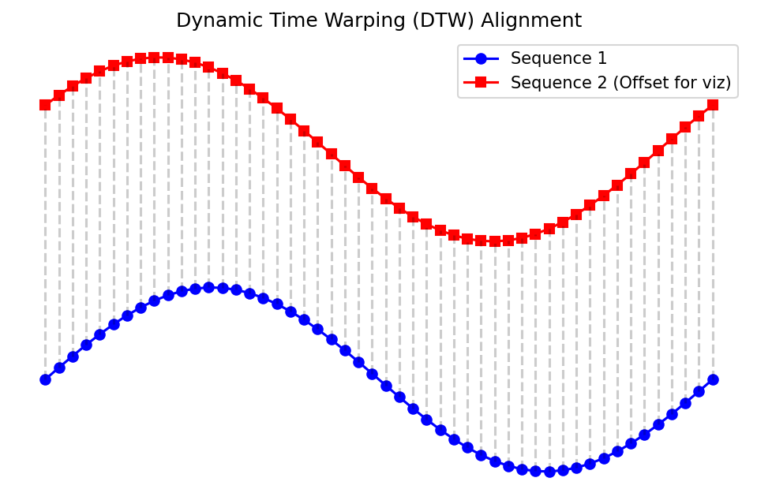

## 01. From Snapshots to Sequences

::: {.fragment}
- Previous units: static data — micrographs, spectra, tabular descriptors
- This unit: **dynamic data** — signals that evolve over time
- Materials processing is not a photograph; it is a **movie**
:::

::: {.fragment}
**Key question**: How do we build neural networks that understand *order* and *history*?
:::

## 02. Learning Outcomes

By the end of this unit, you can:

::: {.fragment}
1. Explain why standard MLPs and CNNs fail on sequential process data
2. Draw and describe the architecture of an RNN, LSTM, and GRU
3. Explain the vanishing gradient problem and how gating solves it
4. Apply recurrent networks to anomaly detection and remaining useful life prediction
5. Prepare time-series data with sliding windows, padding, and proper scaling
6. Evaluate sequential predictions using horizon-based error and DTW
:::

---

## {background-color="#1a1a2e"}

### Part 1: Sequences in Materials Science {style="text-align: center; margin-top: 15%;"}

*Slides 03–08*

## 03. Beyond Static Images

::: {.fragment}
- A micrograph captures the **result** of processing
- But the **process itself** produces rich temporal data:
  - Temperature profiles during heat treatment
  - Laser power logs in additive manufacturing
  - Pressure curves during injection molding
  - Acoustic emission during fatigue testing
:::

::: {.fragment}
The process history **determines** the final microstructure — we should learn from it directly.
:::

## 04. Process Logs as Data

::: {.fragment}
- **1D sensor streams**: Thermocouples ($\sim 1$ Hz), strain gauges ($\sim 100$ Hz)
- **High-frequency signals**: Acoustic emission ($\sim 100$ kHz), melt pool photodiodes ($\sim 50$ kHz)
- **Multivariate logs**: Multiple sensors recording simultaneously — temperature, pressure, gas flow, motor current
:::

::: {.fragment}
A single additive manufacturing build can produce **terabytes** of time-series data across thousands of sensors.
:::

## 05. Example: Melt Pool Monitoring in Additive Manufacturing

::: {.fragment}
{width=80%}
:::

::: {.fragment}
- The photodiode captures **light intensity** from the melt pool at $\sim 50$ kHz
- Stable melting produces a characteristic signal pattern
- Pore formation or lack-of-fusion cause detectable **deviations**
- **Goal**: Predict defects in real time from the signal history
:::

## 06. Why CNNs and MLPs Fail Here (I)

::: {.fragment}
**The MLP problem**: Flattening a time-series destroys temporal order

- Input: $[x_1, x_2, \ldots, x_T]$ becomes just a vector of features
- The MLP treats $x_1$ and $x_T$ as equally "close" to $x_5$
- **No concept of sequence** — shuffling the inputs gives a different prediction
:::

::: {.fragment}
::: {.callout-note}
An MLP cannot distinguish "heat then quench" from "quench then heat" — both are just a bag of temperature values.
:::
:::

## 07. Why CNNs and MLPs Fail Here (II)

::: {.fragment}
**The CNN problem**: 1D convolutions capture *local* patterns, but lack *global memory*

- A 1D CNN with kernel size $k$ sees only $k$ time steps at once
- To capture long-range dependencies, you need very deep networks
- No explicit mechanism to "remember" events from the distant past
:::

::: {.fragment}
**The fixed-length problem**: Both MLPs and CNNs require fixed input dimensions

- But process logs vary in length — different builds, different cycle times
- Padding to a maximum length wastes computation and introduces artifacts
:::

## 08. Time-Series Characteristics

::: {.fragment}
Key properties of process signals that matter for ML:

- **Autocorrelation**: $x_t$ is correlated with $x_{t-1}, x_{t-2}, \ldots$ — the past predicts the future
- **Non-stationarity**: Statistical properties change over time (sensor drift, tool wear)
- **Sampling rate vs. physical timescale**: Aliasing if sampling is too slow
- **Noise structure**: Gaussian (thermal) vs. impulsive (spatter events)
:::

::: {.fragment}
**What we need**: An architecture that naturally handles variable-length, ordered, autocorrelated data with a persistent memory.
:::

---

## {background-color="#1a1a2e"}

### Part 2: Recurrent Neural Networks {style="text-align: center; margin-top: 15%;"}

*Slides 09–20*

## 09. The Concept of Recursion

::: {.fragment}
- In a standard feedforward network, information flows in one direction: input $\to$ output
- **Idea**: What if a neuron could feed its output back to itself?
- This creates a **loop** — the neuron remembers its previous activation
:::

::: {.fragment}
```{mermaid}
%%| fig-width: 12
graph LR
    X["x<sub>t</sub><br>(input)"] --> N["RNN Cell"]
    N --> Y["y<sub>t</sub><br>(output)"]
    N -- "h<sub>t</sub>" --> N
    style N fill:#2d6a4f,stroke:#fff,color:#fff
```
:::

## 10. The Hidden State

::: {.fragment}
The hidden state $h_t$ is the network's **memory**:

- It encodes a summary of all inputs seen so far: $x_1, x_2, \ldots, x_t$
- At each time step, the hidden state is updated based on:
  - The **current input** $x_t$
  - The **previous hidden state** $h_{t-1}$
:::

::: {.fragment}
$$h_t = f(x_t, h_{t-1})$$

This simple recursion is the foundation of all recurrent architectures.
:::

## 11. RNN Architecture

::: {.fragment}
The vanilla RNN computes:

$$h_t = \tanh(W_{xh}\, x_t + W_{hh}\, h_{t-1} + b_h)$$
$$y_t = W_{hy}\, h_t + b_y$$
:::

::: {.fragment}
- $W_{xh}$: input-to-hidden weights
- $W_{hh}$: hidden-to-hidden weights (the recurrence)
- $W_{hy}$: hidden-to-output weights
- $\tanh$: squashes values to $[-1, 1]$, centered at zero
:::

::: {.fragment}
**Crucially**: The same weights $W_{xh}, W_{hh}, W_{hy}$ are shared across all time steps — just like CNN kernels are shared across spatial positions.
:::

## 12. Unrolling the RNN (I)

::: {.fragment}
To understand training, we "unroll" the loop across time:
:::

::: {.fragment}
```{mermaid}
%%| fig-width: 18
graph LR
    x1["x<sub>1</sub>"] --> R1["RNN<br>Cell"]
    x2["x<sub>2</sub>"] --> R2["RNN<br>Cell"]
    x3["x<sub>3</sub>"] --> R3["RNN<br>Cell"]
    xT["x<sub>T</sub>"] --> RT["RNN<br>Cell"]
    R1 -- "h<sub>1</sub>" --> R2
    R2 -- "h<sub>2</sub>" --> R3
    R3 -. "..." .-> RT
    R1 --> y1["y<sub>1</sub>"]
    R2 --> y2["y<sub>2</sub>"]
    R3 --> y3["y<sub>3</sub>"]
    RT --> yT["y<sub>T</sub>"]
    h0["h<sub>0</sub>"] --> R1
    style R1 fill:#2d6a4f,stroke:#fff,color:#fff
    style R2 fill:#2d6a4f,stroke:#fff,color:#fff
    style R3 fill:#2d6a4f,stroke:#fff,color:#fff
    style RT fill:#2d6a4f,stroke:#fff,color:#fff
```
:::

## 13. Unrolling the RNN (II)

::: {.fragment}
**Key observations from the unrolled view**:

- The RNN is equivalent to a **very deep feedforward network** with $T$ layers
- All layers share the **same weights** (weight tying)
- Information flows left-to-right through the hidden state chain
- The depth equals the **sequence length** — this can be thousands of steps!
:::

::: {.fragment}
{width=80%}
:::

## 14. The Forward Pass: Step by Step

::: {.fragment}
**Example**: 3-step sequence, $h_0 = \mathbf{0}$

| Step | Computation |
|------|-------------|
| $t=1$ | $h_1 = \tanh(W_{xh} x_1 + W_{hh} \cdot \mathbf{0} + b_h)$ |
| $t=2$ | $h_2 = \tanh(W_{xh} x_2 + W_{hh} h_1 + b_h)$ |
| $t=3$ | $h_3 = \tanh(W_{xh} x_3 + W_{hh} h_2 + b_h)$ |
| Output | $y_3 = W_{hy} h_3 + b_y$ |
:::

::: {.fragment}
Notice: $h_3$ contains information about $x_1, x_2, x_3$ — but $x_1$'s influence has been transformed **twice** by $W_{hh}$.
:::

## 15. Handling Variable-Length Sequences

::: {.fragment}
Unlike MLPs and CNNs, RNNs naturally handle sequences of different lengths:

- Process run A: 500 time steps
- Process run B: 1200 time steps
- Process run C: 87 time steps
:::

::: {.fragment}
**How it works**: Simply run the forward pass for as many steps as the sequence requires. The hidden state accumulates information regardless of length.
:::

::: {.fragment}
**For batched training**: Pad shorter sequences and use a **mask** to ignore padded positions (more in Part 5).
:::

## 16. Training: Backpropagation Through Time (BPTT)

::: {.fragment}
- Unroll the RNN for the full sequence length
- Compute the loss at each time step (or only at the final step)
- Backpropagate gradients **through all time steps** back to $t=1$
:::

::: {.fragment}
$$\frac{\partial \mathcal{L}}{\partial W_{hh}} = \sum_{t=1}^{T} \frac{\partial \mathcal{L}_t}{\partial W_{hh}} = \sum_{t=1}^{T} \sum_{k=1}^{t} \frac{\partial \mathcal{L}_t}{\partial h_t} \prod_{j=k+1}^{t} \frac{\partial h_j}{\partial h_{j-1}} \frac{\partial h_k}{\partial W_{hh}}$$
:::

::: {.fragment}
The product $\prod_{j=k+1}^{t} \frac{\partial h_j}{\partial h_{j-1}}$ is the source of all problems.
:::

## 17. Think About This...

::: {.fragment}
**Scenario**: You are monitoring a laser powder bed fusion build. At layer 50 (out of 500), there was a brief power fluctuation that caused incomplete melting. The final part is tested at layer 500.

**Question**: Can a vanilla RNN at layer 500 still "remember" what happened at layer 50?
:::

::: {.fragment .fade-in}
\

**Answer**: Almost certainly not. The information must survive 450 multiplications by $W_{hh}$. Unless the eigenvalues of $W_{hh}$ are exactly 1, the signal either vanishes or explodes.
:::

::: {.fragment .fade-in}
This is the **vanishing gradient problem** — and it is a show-stopper for long sequences.
:::

## 18. The Vanishing Gradient Problem

::: {.fragment}
Each factor in the gradient product is:

$$\frac{\partial h_j}{\partial h_{j-1}} = \text{diag}\!\bigl(\tanh'(z_j)\bigr) \cdot W_{hh}$$
:::

::: {.fragment}
- $\tanh'(z) \in (0, 1]$ — always $\leq 1$, and often $\ll 1$ for saturated units
- If the largest singular value of $W_{hh}$ is $< 1$: gradients **vanish** exponentially
- After $T$ steps: gradient $\sim \sigma_{\max}^T \to 0$
:::

::: {.fragment}
**Consequence**: The network cannot learn long-range dependencies. It effectively has a "memory horizon" of $\sim 10$–$20$ steps [@mcclarren2021machine].
:::

## 19. The Exploding Gradient Problem

::: {.fragment}
The opposite case: if the largest singular value of $W_{hh}$ is $> 1$:

- Gradients **explode** exponentially: gradient $\sim \sigma_{\max}^T \to \infty$
- Training becomes unstable — weights oscillate wildly
- Loss function jumps erratically
:::

::: {.fragment}
**Practical fix**: **Gradient clipping** — rescale the gradient if its norm exceeds a threshold:

$$\tilde{g} = \begin{cases} g & \text{if } \|g\| \leq \theta \\ \theta \cdot \frac{g}{\|g\|} & \text{if } \|g\| > \theta \end{cases}$$
:::

::: {.fragment}
Gradient clipping handles the exploding case, but does **not** fix vanishing gradients. We need a fundamentally different architecture for that.
:::

## 20. Part 2 Summary

::: {.fragment}
1. RNNs introduce **recurrence** — a hidden state that carries memory across time steps
2. The same weights are **shared** across all time steps (like CNN weight sharing)
3. Training uses **BPTT**: backpropagation through the unrolled computation graph
4. **Vanishing gradients** prevent learning long-range dependencies ($> 10$–$20$ steps)
5. **Exploding gradients** are fixed by clipping; vanishing gradients need architectural solutions
:::

::: {.fragment}
**Next**: LSTMs and GRUs — architectures designed to maintain long-term memory.
:::

---

## {background-color="#1a1a2e"}

### Part 3: LSTMs and GRUs {style="text-align: center; margin-top: 15%;"}

*Slides 21–32*

## 21. Solving the Memory Problem

::: {.fragment}
**The core insight** (Hochreiter & Schmidhuber, 1997):

- The vanishing gradient occurs because information must pass through **multiplicative** transformations at every step
- Solution: Create a **separate memory pathway** with **additive** updates
- Addition does not cause vanishing: $\frac{\partial (a + b)}{\partial a} = 1$, always
:::

::: {.fragment}
::: {.callout-tip}
Think of the cell state as a **conveyor belt** running through time. Information can be placed on or removed from the belt via gates, but the belt itself just moves forward — no multiplicative shrinkage.
:::
:::

## 22. LSTM: The Cell State

::: {.fragment}
The LSTM introduces a **cell state** $C_t$ alongside the hidden state $h_t$:
:::

::: {.fragment}
```{mermaid}
%%| fig-width: 18
graph LR
    C_prev["C<sub>t-1</sub>"] -- "×forget + add new" --> C_next["C<sub>t</sub>"]
    h_prev["h<sub>t-1</sub>"] --> Gates["Gates"]
    x_t["x<sub>t</sub>"] --> Gates
    Gates --> C_next
    Gates --> h_next["h<sub>t</sub>"]
    C_next --> h_next
    style Gates fill:#e76f51,stroke:#fff,color:#fff
    style C_prev fill:#264653,stroke:#fff,color:#fff
    style C_next fill:#264653,stroke:#fff,color:#fff
```
:::

::: {.fragment}
- $C_t$: the long-term memory (conveyor belt)
- $h_t$: the working memory (short-term, used for output)
- **Gates**: Learned mechanisms that control what to forget, store, and output
:::

## 23. The Forget Gate

::: {.fragment}
**Purpose**: Decide which parts of the old cell state $C_{t-1}$ to **erase**

$$f_t = \sigma(W_f [h_{t-1}, x_t] + b_f)$$

- $\sigma$: sigmoid function, outputs values in $(0, 1)$
- $f_t \approx 1$: keep this memory
- $f_t \approx 0$: forget this memory
:::

::: {.fragment}
**Materials example**: When a new casting cycle begins, the forget gate can learn to clear the memory of the previous cycle.
:::

## 24. The Input Gate

::: {.fragment}
**Purpose**: Decide what **new information** to store in the cell state

**Step 1** — What to update:
$$i_t = \sigma(W_i [h_{t-1}, x_t] + b_i)$$

**Step 2** — Candidate values:
$$\tilde{C}_t = \tanh(W_C [h_{t-1}, x_t] + b_C)$$
:::

::: {.fragment}
**Cell state update** (the critical equation):
$$C_t = f_t \odot C_{t-1} + i_t \odot \tilde{C}_t$$

This is **additive** — no vanishing gradient along the $C_t$ pathway!
:::

## 25. The Output Gate

::: {.fragment}
**Purpose**: Decide what to **output** from the cell state as the new hidden state

$$o_t = \sigma(W_o [h_{t-1}, x_t] + b_o)$$
$$h_t = o_t \odot \tanh(C_t)$$
:::

::: {.fragment}
- The cell state $C_t$ stores raw information
- The output gate filters what is relevant for the **current** prediction
- $h_t$ is used for computing the output $y_t$ and is passed to the next time step
:::

::: {.fragment}
**Materials example**: The cell state might remember the entire thermal history, but the output gate selects only the information relevant for predicting the current microstructural phase.
:::

## 26. Why LSTMs Don't Vanish

::: {.fragment}
**Gradient flow through the cell state**:

$$\frac{\partial C_t}{\partial C_{t-1}} = f_t$$

- The forget gate $f_t$ is the **only** factor in the gradient path
- When $f_t \approx 1$ (gate open): gradient flows **unattenuated**
- No repeated multiplication by $W_{hh}$ — the cell state bypass is the key
:::

::: {.fragment}
Compare to vanilla RNN: $\frac{\partial h_t}{\partial h_{t-1}} = \text{diag}(\tanh') \cdot W_{hh}$

| | Vanilla RNN | LSTM (cell state) |
|---|---|---|
| Gradient factor | $\tanh' \cdot W_{hh}$ | $f_t$ (learned, near 1) |
| After 100 steps | $\sim 10^{-30}$ | $\sim 0.9^{100} \approx 10^{-5}$ |
:::

## 27. Gated Recurrent Units (GRU)

::: {.fragment}
Cho et al. (2014) simplified the LSTM to two gates:

**Update gate**: $z_t = \sigma(W_z [h_{t-1}, x_t])$ — combines forget + input gates

**Reset gate**: $r_t = \sigma(W_r [h_{t-1}, x_t])$ — controls how much past to use for candidate
:::

::: {.fragment}
$$\tilde{h}_t = \tanh(W [r_t \odot h_{t-1}, x_t])$$
$$h_t = (1 - z_t) \odot h_{t-1} + z_t \odot \tilde{h}_t$$
:::

::: {.fragment}
- **No separate cell state** — $h_t$ serves both roles
- Fewer parameters than LSTM ($\sim 25\%$ less)
- Often **comparable performance** on shorter sequences [@mcclarren2021machine]
:::

## 28. RNN vs. LSTM vs. GRU Comparison

::: {.fragment}
| Property | Vanilla RNN | LSTM | GRU |
|----------|-------------|------|-----|
| Gates | 0 | 3 (forget, input, output) | 2 (update, reset) |
| Memory states | $h_t$ only | $h_t$ and $C_t$ | $h_t$ only |
| Parameters per unit | $n_h^2 + n_h n_x$ | $4(n_h^2 + n_h n_x)$ | $3(n_h^2 + n_h n_x)$ |
| Long-range memory | Poor ($\sim 10$ steps) | Excellent ($\sim 1000$ steps) | Good ($\sim 500$ steps) |
| Training speed | Fast | Slowest | Medium |
:::

::: {.fragment}
**Rule of thumb**: Start with LSTM. Try GRU if training is too slow. Vanilla RNN only for very short sequences or as a pedagogical stepping stone.
:::

## 29. Bidirectional RNNs

::: {.fragment}
- Standard RNNs process sequences left-to-right: future is unknown
- **Bidirectional RNNs**: Run two RNNs — one forward, one backward — and concatenate their hidden states
:::

::: {.fragment}
$$\overrightarrow{h_t} = \text{RNN}_{\text{fwd}}(x_t, \overrightarrow{h_{t-1}}) \qquad \overleftarrow{h_t} = \text{RNN}_{\text{bwd}}(x_t, \overleftarrow{h_{t+1}})$$
$$h_t = [\overrightarrow{h_t};\, \overleftarrow{h_t}]$$
:::

::: {.fragment}
**When to use**: Only for **offline analysis** where the full sequence is available

- Post-mortem analysis of a completed build
- Labeling phases in a historical process log
- **Not** for real-time prediction (you cannot look into the future!)
:::

## 30. Deep (Stacked) RNNs

::: {.fragment}
- Just as CNNs stack convolutional layers, we can stack RNN layers
- The hidden state of layer $l$ becomes the input to layer $l+1$

$$h_t^{(l)} = \text{RNN}^{(l)}(h_t^{(l-1)}, h_{t-1}^{(l)})$$
:::

::: {.fragment}
- Layer 1: learns low-level temporal patterns (noise filtering, local trends)
- Layer 2: learns mid-level patterns (cycles, phases)
- Layer 3: learns high-level patterns (overall process trajectory)
:::

::: {.fragment}
**Practical tip**: 2–3 layers is typical. Beyond that, use dropout between layers to prevent overfitting.
:::

## 31. Sequence-to-Sequence (Seq2Seq) Architectures

::: {.fragment}
Not all tasks map a sequence to a single output. Common patterns:

- **Many-to-one**: Sequence $\to$ single label (defect/no-defect classification)
- **Many-to-many**: Sequence $\to$ sequence (predicting future sensor values)
- **One-to-many**: Single input $\to$ sequence (generating a process recipe)
:::

::: {.fragment}
**Encoder-Decoder** for many-to-many:

1. **Encoder** RNN reads the input sequence, compresses it into a context vector $c$
2. **Decoder** RNN generates the output sequence from $c$
:::

::: {.fragment}
**Materials application**: Input = current thermal history $\to$ Output = predicted future temperature profile for the next 100 time steps.
:::

## 32. Part 3 Summary

::: {.fragment}
1. LSTMs solve vanishing gradients with a **cell state** and **additive updates**
2. Three gates (forget, input, output) **learn** what to remember and what to discard
3. GRUs are a **simpler alternative** with comparable performance on many tasks
4. **Bidirectional** RNNs use future context (offline only)
5. **Stacking** layers creates hierarchical temporal feature extraction
6. **Seq2Seq** architectures enable sequence-to-sequence prediction
:::

---

## {background-color="#1a1a2e"}

### Part 4: Case Studies in Process Monitoring {style="text-align: center; margin-top: 15%;"}

*Slides 33–42*

## 33. AM Anomaly Detection

::: {.fragment}
**Task**: Detect defects during laser powder bed fusion from in-situ sensor data

- Input: Photodiode intensity time-series ($50$ kHz, per scan track)
- Model: LSTM trained on "normal" scan tracks
- Prediction: Expected next intensity value $\hat{x}_{t+1}$
:::

::: {.fragment}
**Anomaly score**: $a_t = |x_{t+1} - \hat{x}_{t+1}|$

- If $a_t > \theta$: flag as anomalous (possible pore, keyhole, spatter)
- Threshold $\theta$ set from validation data or statistical analysis
:::

::: {.fragment}
{width=80%}
:::

## 34. Predicting Pore Formation

::: {.fragment}
**Going beyond detection**: Can we predict defects *before* they occur?

- Use the sensor history up to time $t$ to predict whether a pore will form in the **next** scan track
- This gives a time window for **corrective action** (adjust laser power, scan speed)
:::

::: {.fragment}
**Architecture**: Stacked LSTM with many-to-one output

- Input: Last 200 time steps of [photodiode, pyrometer, scan speed]
- Output: Probability of pore formation in the next 50 ms
- **Key finding**: Precursor signals exist $\sim 20$–$50$ ms before pore formation
:::

## 35. Remaining Useful Life (RUL) Prediction

::: {.fragment}
**Problem**: Given sensor data from a machine or component, predict how many cycles/hours remain before failure

- Critical for **predictive maintenance** in manufacturing
- Avoids both premature replacement (wasteful) and unexpected failure (dangerous)
:::

::: {.fragment}
**LSTM approach**:

- Input: Rolling window of vibration, temperature, current signals
- Output: Estimated RUL in hours or cycles
- Training data: Run-to-failure datasets (NASA turbofan, bearing datasets)
:::

::: {.fragment}
::: {.callout-note}
RUL prediction is a **regression** task where the target decreases monotonically. The LSTM must learn degradation trajectories from historical failures and generalize to new operating conditions.
:::
:::

## 36. Creep and Corrosion Modeling

::: {.fragment}
**Creep**: Time-dependent deformation under constant stress at elevated temperature

- Creep curves have three stages: primary, secondary, tertiary
- The transition from secondary to tertiary creep **precedes fracture**
- LSTM can learn to predict tertiary onset from early creep data
:::

::: {.fragment}
**Corrosion monitoring**: Electrochemical impedance spectroscopy (EIS) over months

- Impedance evolves as protective layers form and break down
- Sudden impedance drops indicate **pitting** initiation
- RNN-based models forecast corrosion rates from impedance histories
:::

## 37. Signal Frequency Extraction

::: {.fragment}
**McClarren's example** [@mcclarren2021machine]: Can an RNN recover the frequency of a noisy sine wave?

$$x(t) = A \sin(2\pi f t) + \epsilon(t)$$

- Input: Noisy time-series samples
- Output: Frequency $f$
:::

::: {.fragment}
- A simple RNN can learn this for clean signals
- With noise ($\text{SNR} < 10$ dB), LSTMs significantly outperform vanilla RNNs
- The LSTM learns to **integrate** over many cycles to average out noise — this requires long-term memory
:::

::: {.fragment}
**Materials relevance**: Extracting characteristic frequencies from acoustic emission, vibration analysis, or impedance spectroscopy in noisy industrial environments.
:::

## 38. Phase Shift Prediction

::: {.fragment}
**Extension**: Predicting the **phase shift** between two synchronized signals

- In materials processing: phase between excitation and response reveals material properties
- Example: Dynamic Mechanical Analysis (DMA) — phase lag $\delta$ between stress and strain indicates viscoelastic behavior
:::

::: {.fragment}
**LSTM advantage**: The phase relationship between signals requires comparing events separated in time — exactly the kind of long-range dependency that LSTMs handle well.
:::

::: {.fragment}
{width=80%}
:::

## 39. The Cart-Pendulum Control Problem

::: {.fragment}
**McClarren's benchmark** [@mcclarren2021machine]: Balancing an inverted pendulum on a cart

- State: $[x, \dot{x}, \theta, \dot{\theta}]$ (position, velocity, angle, angular velocity)
- Action: Force applied to cart (left/right)
- **Sequential decision problem**: Each action depends on the full history of states
:::

::: {.fragment}
- An MLP controller works for simple cases (Markov property holds)
- An LSTM controller excels when there is **latency, partial observability, or delayed rewards**
- The LSTM can learn to anticipate: "the pendulum is about to fall right, so push right *now*"
:::

## 40. Sensor Fusion with RNNs

::: {.fragment}
Real manufacturing processes have **multiple sensors** recording simultaneously:

- Photodiode (melt pool brightness)
- Pyrometer (melt pool temperature)
- Acoustic sensor (process sounds)
- Accelerometer (vibration)
- Camera (melt pool geometry)
:::

::: {.fragment}
**Multivariate LSTM**: Input $x_t \in \mathbb{R}^d$ where $d$ = number of sensor channels

- The LSTM learns **cross-sensor correlations** automatically
- Example: A temperature spike + acoustic anomaly together predict a defect more reliably than either alone
:::

## 41. Real-Time Feedback Loops

::: {.fragment}
```{mermaid}
%%| fig-width: 18
graph LR
    S["Sensors"] --> P["Preprocessing<br>(filtering, scaling)"]
    P --> L["LSTM Model<br>(inference)"]
    L --> D{"Anomaly<br>Detected?"}
    D -- "Yes" --> A["Adjust Parameters<br>(power, speed)"]
    D -- "No" --> C["Continue<br>Normal Operation"]
    A --> M["Manufacturing<br>Process"]
    C --> M
    M --> S
    style L fill:#2d6a4f,stroke:#fff,color:#fff
    style D fill:#e76f51,stroke:#fff,color:#fff
```
:::

::: {.fragment}
**Latency requirements**: The entire loop must complete in $< 1$ ms for high-speed processes

- LSTM inference: $\sim 0.1$ ms on GPU
- Preprocessing + communication: $\sim 0.5$ ms
- **Feasible** for most manufacturing processes, but requires optimized deployment
:::

## 42. Part 4 Summary

::: {.fragment}
1. **Anomaly detection**: Train on normal data, flag deviations
2. **Pore prediction**: Precursor signals enable proactive correction
3. **RUL prediction**: LSTM learns degradation trajectories for predictive maintenance
4. **Frequency/phase tasks**: Long-term memory enables signal analysis
5. **Sensor fusion**: Multivariate LSTMs combine multiple sensor streams
6. **Feedback loops**: LSTM inference is fast enough for real-time control
:::

---

## {background-color="#1a1a2e"}

### Part 5: Practical Implementation {style="text-align: center; margin-top: 15%;"}

*Slides 43–50*

## 43. Preparing Sequential Data: Sliding Windows

::: {.fragment}
**The sliding window approach**: Convert a long time-series into many training samples

Given a signal $[x_1, x_2, \ldots, x_N]$ with window size $W$ and prediction horizon $H$:

| Input (window) | Target |
|----------------|--------|
| $[x_1, \ldots, x_W]$ | $x_{W+H}$ |
| $[x_2, \ldots, x_{W+1}]$ | $x_{W+1+H}$ |
| $[x_3, \ldots, x_{W+2}]$ | $x_{W+2+H}$ |
:::

::: {.fragment}
**Critical choices**:

- **Window size $W$**: Must be large enough to capture relevant patterns (at least 2–3 periods for periodic signals)
- **Stride**: How many steps to shift the window (stride = 1 gives maximum samples but high overlap)
- **Horizon $H$**: How far ahead to predict ($H = 1$ for next-step, $H > 1$ for forecasting)
:::

## 44. Padding and Masking

::: {.fragment}
**Problem**: Batched training requires all sequences in a batch to have the same length

**Solution**: Pad shorter sequences with zeros and use a **mask** to ignore padded positions
:::

::: {.fragment}
```python
# Example: Three sequences of different lengths
seq_1 = [0.3, 0.5, 0.7, 0.2, 0.1]      # length 5
seq_2 = [0.8, 0.6, 0.4]                  # length 3
seq_3 = [0.1, 0.9, 0.3, 0.7]            # length 4

# After padding (to max length 5)
padded = [[0.3, 0.5, 0.7, 0.2, 0.1],    # mask: [1,1,1,1,1]
          [0.8, 0.6, 0.4, 0.0, 0.0],    # mask: [1,1,1,0,0]
          [0.1, 0.9, 0.3, 0.7, 0.0]]   # mask: [1,1,1,1,0]
```
:::

::: {.fragment}
**PyTorch**: `torch.nn.utils.rnn.pack_padded_sequence` handles this efficiently — padded positions are skipped during computation, saving time and preventing the model from learning to predict zeros.
:::

## 45. Feature Scaling for RNNs

::: {.fragment}
**Why scaling matters more for RNNs than for other architectures**:

- $\tanh$ and $\sigma$ saturate for large inputs $\to$ vanishing gradients
- LSTM gates operate in $[0, 1]$ — inputs should be in a comparable range
- Mixed scales across features (e.g., temperature in $^\circ$C vs. pressure in MPa) cause one feature to dominate
:::

::: {.fragment}
**Recommended approach**:

1. **StandardScaler**: $\tilde{x} = \frac{x - \mu}{\sigma}$ — fit on training data only
2. Apply the **same** scaler to validation and test data
3. For non-stationary signals: consider **rolling normalization** (normalize within each window)
:::

::: {.fragment}
::: {.callout-tip}
**Beware of look-ahead leakage**: Never compute statistics using future data. In time-series, even the mean and standard deviation must be computed only from past and current observations.
:::
:::

## 46. Think About This...

::: {.fragment}
**Scenario**: You train an LSTM to predict melt pool temperature 10 steps ahead. Your model achieves MSE = 0.01 on the test set. Your colleague congratulates you.

**But wait**: What is the MSE of a "naive" baseline that simply predicts $\hat{x}_{t+10} = x_t$ (the last known value)?
:::

::: {.fragment .fade-in}
\

**Surprise**: For slowly-varying signals, the naive baseline often achieves MSE $\approx 0.005$ — **better** than your LSTM!
:::

::: {.fragment .fade-in}
**Lesson**: Always compare against baselines. For time-series, the **persistence model** ($\hat{x}_{t+H} = x_t$) and **linear trend** ($\hat{x}_{t+H} = x_t + H \cdot \Delta x_t$) are essential baselines. Report **skill score**: $\text{SS} = 1 - \frac{\text{MSE}_\text{model}}{\text{MSE}_\text{baseline}}$.
:::

## 47. Horizon-Based Error and Multi-Step Prediction

::: {.fragment}
**Single-step prediction** ($H = 1$): Easy, often trivially good due to autocorrelation

**Multi-step prediction** ($H \gg 1$): Hard, error accumulates over the horizon
:::

::: {.fragment}
Two strategies for multi-step prediction:

1. **Recursive (autoregressive)**: Feed predictions back as inputs
   - $\hat{x}_{t+1} \to \hat{x}_{t+2} \to \ldots \to \hat{x}_{t+H}$
   - Errors compound exponentially
2. **Direct**: Train separate models for each horizon
   - Model 1 predicts $x_{t+1}$, Model 2 predicts $x_{t+2}$, etc.
   - No error compounding, but ignores inter-step dependencies
:::

::: {.fragment}
**Best practice**: Report error as a function of horizon $H$ — plot MSE($H$) to show where the model's predictive skill degrades.
:::

## 48. Dynamic Time Warping (DTW)

::: {.fragment}
**Problem**: Two time-series may have the same shape but different speeds

- Casting cycle A runs slightly faster than cycle B
- Standard MSE penalizes this temporal misalignment heavily
:::

::: {.fragment}
**DTW** finds the optimal alignment between two sequences:

$$\text{DTW}(X, Y) = \min_{\pi} \sum_{(i,j) \in \pi} d(x_i, y_j)$$

where $\pi$ is a warping path that maps indices of $X$ to indices of $Y$
:::

::: {.fragment}
{width=80%}
:::

## 49. Transformers: A Brief Teaser

::: {.fragment}
- Transformers (Vaswani et al., 2017) replaced RNNs in NLP and are now entering time-series analysis
- **Key idea**: Replace recurrence with **self-attention** — every time step attends to every other time step directly
- No sequential processing $\to$ fully **parallelizable** training
:::

::: {.fragment}
| | RNN/LSTM | Transformer |
|---|---|---|
| Long-range dependencies | Via cell state (gradual) | Direct attention (instant) |
| Training parallelism | Sequential (slow) | Fully parallel (fast) |
| Inductive bias | Strong temporal prior | Weak (learns from data) |
| Data efficiency | Better on small datasets | Needs more data |
:::

::: {.fragment}
**For this course**: RNNs/LSTMs remain the right tool for most materials science tasks where data is limited. Transformers will be covered in depth in a future unit.
:::

## 50. Summary and Key Takeaways

::: {.fragment}
**Architecture hierarchy**:

- **Vanilla RNN**: Simple but limited memory ($\sim 10$ steps). Use for very short sequences only.
- **LSTM**: Additive cell state solves vanishing gradients. The workhorse for process monitoring.
- **GRU**: Simpler, faster LSTM variant. Try when LSTM is too slow.
- **Transformers**: Future direction for large-scale time-series. Needs more data.
:::

::: {.fragment}
**Practical checklist**:

1. Scale your features (StandardScaler, fit on training data only)
2. Use sliding windows to create samples; choose window size from domain knowledge
3. Always compare against persistence and linear baselines
4. Report multi-horizon error, not just one-step MSE
5. Use gradient clipping during training (threshold $\sim 1.0$)
:::

::: {.fragment}
**Next unit**: Generalization and robustness — how to ensure your models work on new data.
:::

## References

::: {#refs}
:::
