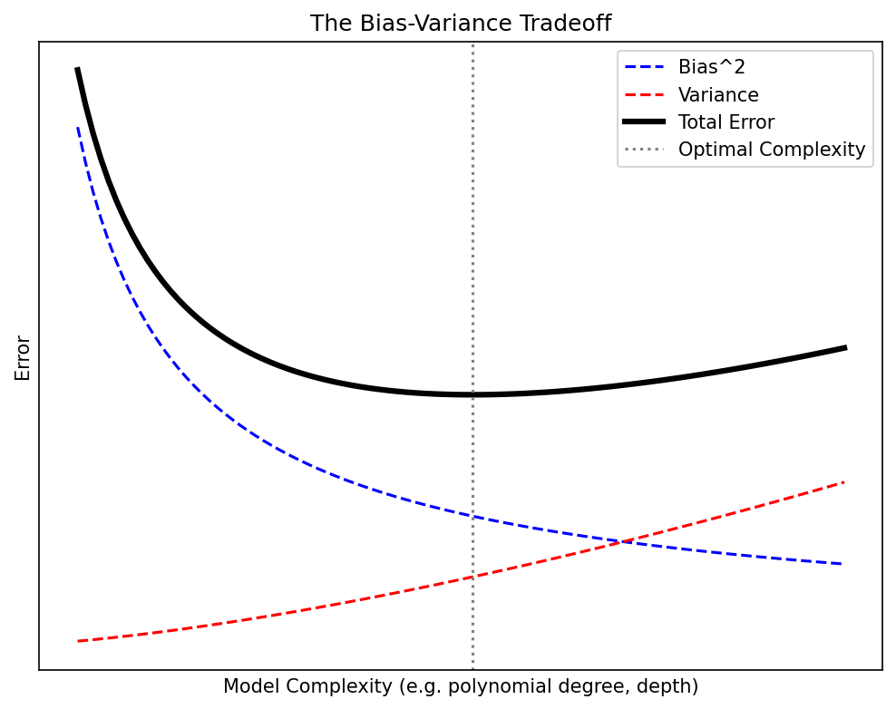
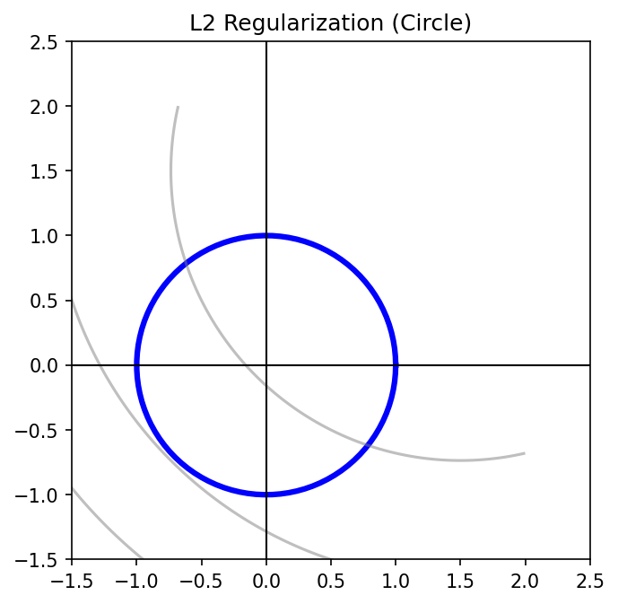
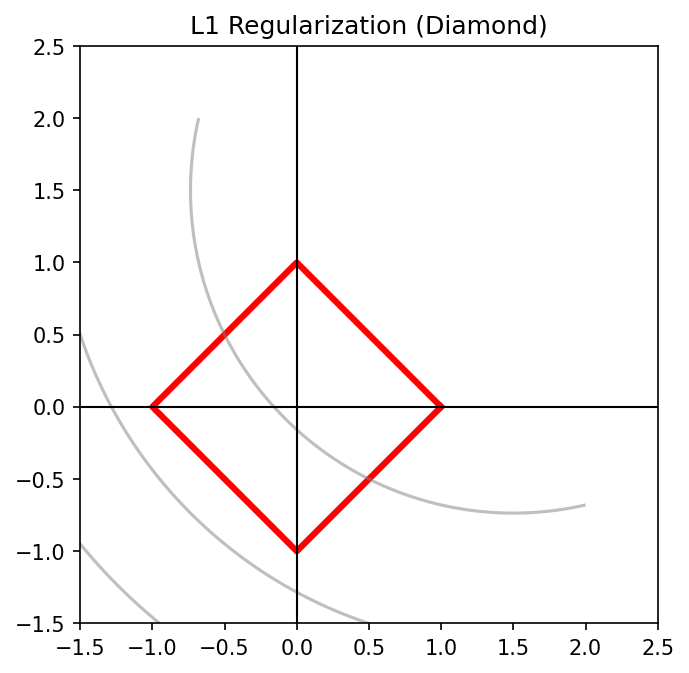
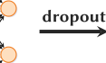
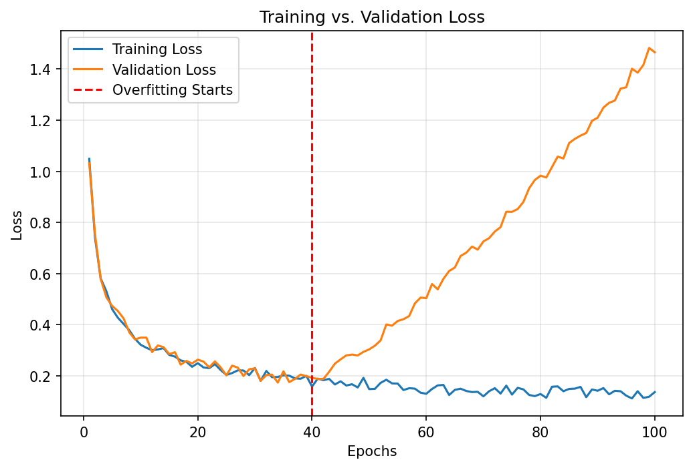
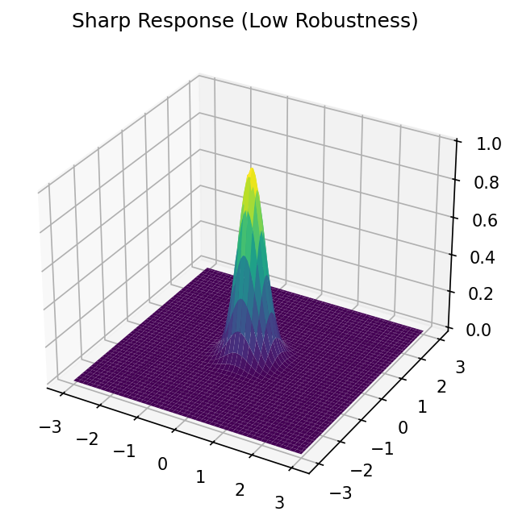
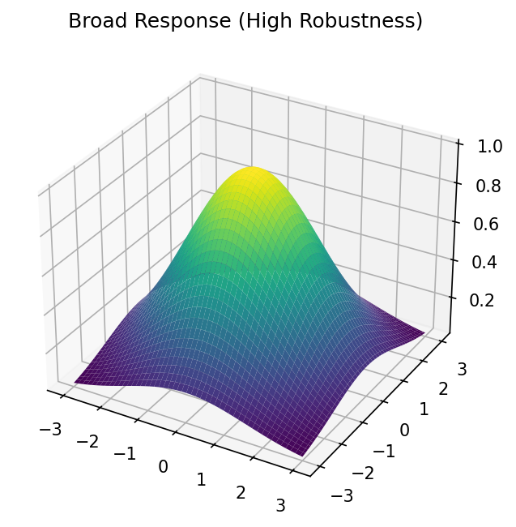
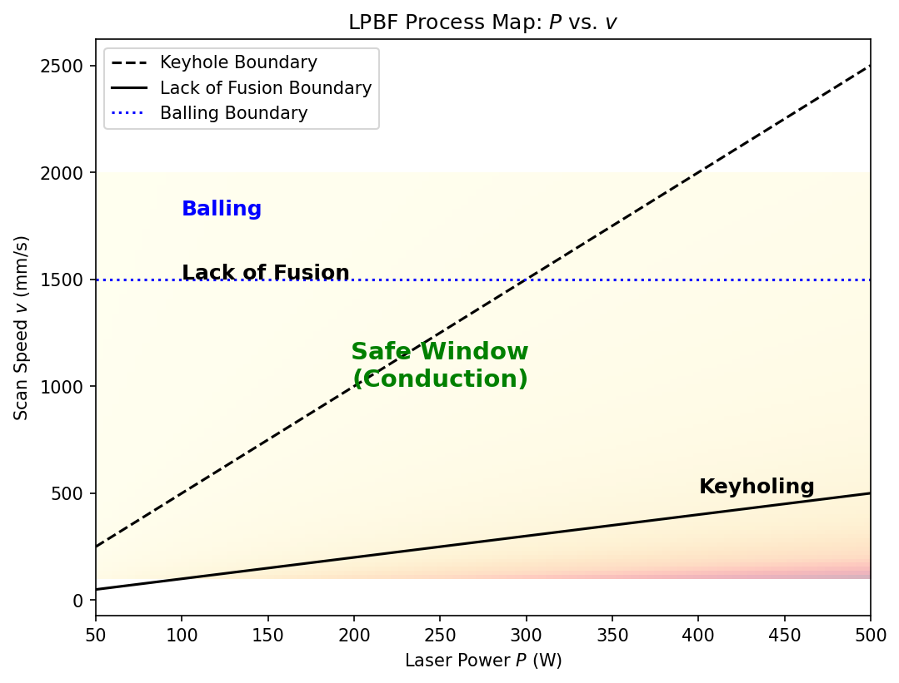
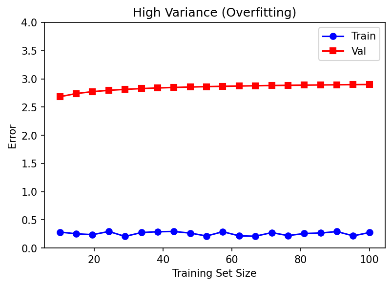

## 01. Learning Outcomes

::: {.fragment}
After this unit, you will be able to:
:::

::: {.fragment}
1. **Explain** the bias-variance tradeoff and its implications for model selection
:::

::: {.fragment}
2. **Apply** cross-validation strategies appropriate for materials science data
:::

::: {.fragment}
3. **Compare** regularization techniques (L1, L2, Dropout, Early Stopping)
:::

::: {.fragment}
4. **Define** process windows using ML predictions and sensitivity analysis
:::

::: {.fragment}
5. **Design** a robust model selection workflow for engineering applications
:::

# Part 1: Why Models Fail {background-color="#1a1a2e"}

::: {.r-fit-text}
Generalization, Bias, and Variance
:::

## 02. The Generalization Challenge

### From the Lab Bench to the Production Floor

::: {.fragment}
- **Training error**: How well the model fits the data it has seen
:::

::: {.fragment}
- **Generalization error**: How well the model performs on **unseen** data
:::

::: {.fragment}
- These are **not the same thing** — and confusing them is the #1 mistake in applied ML
:::

::: {.fragment}
**Materials Example:**

A model trained on 50 tensile test specimens from a single batch predicts yield strength perfectly — but fails on specimens from a different powder lot, a different machine, or a different humidity level.
:::

::: {.callout-note}
## The Generalization Gap
The difference between training error and test error is the **generalization gap**. Our entire goal in model selection is to minimize this gap while keeping both errors low.
:::

## 03. Underfitting vs Overfitting

::: columns
::: {.column width="33%"}
::: {.fragment}
### Underfitting


- Model is **too simple**
- High **bias**
- Misses the underlying pattern
- Example: Fitting a line to a nonlinear stress-strain curve
:::
:::

::: {.column width="33%"}
::: {.fragment}
### Good Fit


- Model captures the **true relationship**
- Balanced bias and variance
- Generalizes well to new data
:::
:::

::: {.column width="33%"}
::: {.fragment}
### Overfitting


- Model is **too complex**
- High **variance**
- Memorizes noise
- Example: Degree-20 polynomial on 15 data points
:::
:::
:::

## 04. The Bias-Variance Tradeoff

### The Fundamental Decomposition

::: {.fragment}
For a model $\hat{f}(x)$ trained on data $\mathcal{D}$, the **expected prediction error** at a point $x$ is:

$$\text{EPE}(x) = \underbrace{\text{Bias}^2[\hat{f}(x)]}_{\text{systematic error}} + \underbrace{\text{Var}[\hat{f}(x)]}_{\text{sensitivity to training data}} + \underbrace{\sigma^2_\varepsilon}_{\text{irreducible noise}}$$
:::

::: {.fragment}
{width=80%}
:::

::: {.fragment}
- As complexity increases: **bias decreases**, **variance increases**
- The optimal model sits at the **minimum of total error**
- The irreducible noise $\sigma^2_\varepsilon$ sets a floor — no model can beat it
:::

## 05. Bias-Variance Decomposition: Mathematical Detail

### Deriving the Decomposition

::: {.fragment}
Let $y = f(x) + \varepsilon$ where $\mathbb{E}[\varepsilon] = 0$ and $\text{Var}[\varepsilon] = \sigma^2_\varepsilon$.
:::

::: {.fragment}
$$\mathbb{E}_\mathcal{D}\left[(y - \hat{f}(x))^2\right] = \mathbb{E}_\mathcal{D}\left[(f(x) + \varepsilon - \hat{f}(x))^2\right]$$
:::

::: {.fragment}
Expanding and using $\bar{f}(x) = \mathbb{E}_\mathcal{D}[\hat{f}(x)]$:
:::

::: {.fragment}
$$= \underbrace{(f(x) - \bar{f}(x))^2}_{\text{Bias}^2} + \underbrace{\mathbb{E}_\mathcal{D}\left[(\hat{f}(x) - \bar{f}(x))^2\right]}_{\text{Variance}} + \underbrace{\sigma^2_\varepsilon}_{\text{Noise}}$$
:::

::: {.fragment}
| Term | Meaning | Reduced by |
|------|---------|------------|
| $\text{Bias}^2$ | Model assumptions miss the truth | More flexible model |
| $\text{Variance}$ | Model changes with different training data | More data, regularization |
| $\sigma^2_\varepsilon$ | Inherent measurement noise | Better instruments (not ML!) |
:::

## 06. Polynomial Regression Example

### Complexity vs Generalization [@mcclarren2021machine]

::: {.fragment}
**Setup:** $n = 20$ noisy samples from $f(x) = \sin(2\pi x)$
:::

::: {.fragment}
| Polynomial Degree | Training MSE | Test MSE | Diagnosis |
|:-:|:-:|:-:|:--|
| 1 | 0.42 | 0.45 | Underfitting (high bias) |
| 3 | 0.08 | 0.09 | Good fit |
| 9 | 0.001 | 0.35 | Overfitting (high variance) |
| 15 | $\approx 0$ | 12.7 | Severe overfitting |
:::

::: {.fragment}
{width=80%}
:::

::: {.fragment}
- **Degree 3** has the best test error — not degree 15!
- Training error always decreases with complexity — but **test error does not**
:::

## 07. Think About This...

### A Materials Scientist's Dilemma

::: {.fragment}
You are building a model to predict **melt pool depth** in laser powder bed fusion from 5 process parameters (laser power, scan speed, hatch spacing, layer thickness, preheat temperature).
:::

::: {.fragment}
You have **40 experimental measurements**.

A colleague suggests using a neural network with 3 hidden layers of 128 neurons each.
:::

::: {.fragment .fade-in-then-semi-out}
**Question 1:** How many parameters does this network have?

→ Approximately $5 \times 128 + 128 \times 128 + 128 \times 128 + 128 \times 1 \approx 33{,}000$ parameters
:::

::: {.fragment}
**Question 2:** What will happen when you train it on 40 data points?

→ The model will **perfectly memorize** all 40 points (training error ≈ 0) but **fail catastrophically** on new data. You have 33,000 knobs to fit 40 numbers — the model has 825× more capacity than data!
:::

::: {.fragment}
**What should you do instead?**

→ Start with a simpler model (linear regression, low-degree polynomial, small network with regularization). Use cross-validation to verify generalization.
:::

## 08. Summary: Part 1

### Why Models Fail — Key Takeaways

::: {.fragment}
- **Generalization** — performance on unseen data — is the only metric that matters for deployment
:::

::: {.fragment}
- **Bias** (underfitting) and **Variance** (overfitting) are in tension: reducing one increases the other
:::

::: {.fragment}
- Total Error = Bias² + Variance + Irreducible Noise
:::

::: {.fragment}
- **More complex ≠ better** — the optimal model balances complexity against available data
:::

::: {.fragment}
- In materials science with small datasets, **overfitting is the dominant failure mode**
:::

# Part 2: Robust Validation Strategies {background-color="#1a1a2e"}

::: {.r-fit-text}
Cross-Validation and Data Splitting
:::

## 09. The Problem with Holdout Validation

### A Single Split Is Not Enough

::: {.fragment}
**Simple holdout:** Split data into 80% training / 20% test

- Train on 80%, evaluate on 20%
- Report the test error as "model performance"
:::

::: {.fragment}
**Problems for materials data:**

1. With $n = 50$ samples, the test set has only **10 samples** — high variance in the estimate
2. Results depend on **which** 10 samples end up in the test set
3. We "waste" 20% of our precious data — we cannot train on it
:::

::: {.fragment}
**Demonstration:** Random splits of a 40-sample dataset:

| Split seed | Test MSE |
|:-:|:-:|
| 42 | 0.12 |
| 17 | 0.31 |
| 99 | 0.08 |
| 7 | 0.24 |

Which is the "true" performance? **None of them are reliable individually.**
:::

## 10. K-Fold Cross-Validation

### The Standard Approach [@sandfeld_materials_data_science]

::: {.fragment}
**Algorithm:**

1. Randomly partition data into $k$ equally-sized **folds**
2. For $i = 1, \ldots, k$:
   - Hold out fold $i$ as the **validation set**
   - Train on the remaining $k-1$ folds
   - Record validation error $e_i$
3. Report: $\text{CV}_k = \frac{1}{k}\sum_{i=1}^k e_i \pm \text{SE}$
:::

::: {.fragment}
**Benefits:**

- Every sample is used for both training and validation
- The average over $k$ folds is much more **stable** than a single holdout
- Standard error gives a **confidence interval** on performance
:::

::: {.fragment}
**Typical choice:** $k = 5$ or $k = 10$
:::

## 11. K-Fold Visualization

```{mermaid}
%%| fig-width: 18
flowchart LR
    subgraph "5-Fold Cross-Validation"
        direction TB
        F1["Fold 1: <b>Val</b> | Train | Train | Train | Train → e₁"]
        F2["Fold 2: Train | <b>Val</b> | Train | Train | Train → e₂"]
        F3["Fold 3: Train | Train | <b>Val</b> | Train | Train → e₃"]
        F4["Fold 4: Train | Train | Train | <b>Val</b> | Train → e₄"]
        F5["Fold 5: Train | Train | Train | Train | <b>Val</b> → e₅"]
    end
    F5 --> R["CV Score = (e₁+e₂+e₃+e₄+e₅) / 5"]
    style R fill:#2d6a4f,stroke:#333,color:#fff
```

::: {.fragment}
**Python Implementation:**

```python
from sklearn.model_selection import KFold, cross_val_score
from sklearn.linear_model import Ridge

kf = KFold(n_splits=5, shuffle=True, random_state=42)
model = Ridge(alpha=1.0)
scores = cross_val_score(model, X, y, cv=kf, scoring='neg_mean_squared_error')
print(f"CV MSE: {-scores.mean():.4f} ± {scores.std():.4f}")
```
:::

## 12. Leave-One-Out Cross-Validation

### When Every Sample Counts

::: {.fragment}
**LOOCV** is K-Fold CV where $k = n$ (number of samples):

- Each "fold" contains exactly **one sample**
- Train on $n-1$ samples, test on 1
- Repeat $n$ times
:::

::: {.fragment}
**Advantages:**

- Maximum possible training set size ($n-1$)
- Deterministic — no randomness in the split
- Nearly **unbiased** estimate of generalization error
:::

::: {.fragment}
**Disadvantages:**

- Computationally expensive ($n$ models to train)
- High **variance** in the estimate (single-sample folds)
- Folds are highly correlated (they share $n-2$ samples)
:::

::: {.fragment}
::: {.callout-tip}
## When to use LOOCV
LOOCV is most appropriate when $n < 30$ and training a single model is fast (e.g., linear regression, small random forests). For neural networks on small datasets, use 5- or 10-fold CV instead.
:::
:::

## 13. Stratified Cross-Validation

### Handling Imbalanced Materials Data

::: {.fragment}
**Problem:** In classification tasks, some classes may be rare.

- Example: 95% "Good" parts, 5% "Defective" parts
- A random fold might contain **zero defective samples** → unreliable evaluation
:::

::: {.fragment}
**Stratified K-Fold CV:**

- Each fold preserves the **class distribution** of the full dataset
- If 5% of samples are defective, each fold also has ~5% defective samples
:::

::: {.fragment}
```python
from sklearn.model_selection import StratifiedKFold

skf = StratifiedKFold(n_splits=5, shuffle=True, random_state=42)
for train_idx, val_idx in skf.split(X, y_class):
    # Each fold has the same proportion of each class
    X_train, X_val = X[train_idx], X[val_idx]
    y_train, y_val = y_class[train_idx], y_class[val_idx]
```
:::

::: {.fragment}
**Materials examples requiring stratification:**

- Defect detection (rare defect classes)
- Phase classification (minority phases)
- Pass/fail quality classification (high yield processes)
:::

## 14. Grouped Cross-Validation

### Preventing Spatial and Batch Leakage

::: {.fragment}
**Problem:** In materials data, samples are often correlated within groups:

- Multiple measurements from the **same specimen**
- Images from different regions of the **same wafer**
- Tests on parts from the **same powder batch**
:::

::: {.fragment}
**Data leakage:** If correlated samples appear in both train and test sets, the model "sees" the answer.
:::

::: {.fragment}
```python
from sklearn.model_selection import GroupKFold

# group_labels: e.g., specimen ID or batch number
gkf = GroupKFold(n_splits=5)
for train_idx, val_idx in gkf.split(X, y, groups=group_labels):
    # All samples from a given specimen stay together
    X_train, X_val = X[train_idx], X[val_idx]
```
:::

::: {.fragment}
::: {.callout-warning}
## Critical for Materials Science!
Ignoring group structure can give **overly optimistic** CV scores. Your model appears to generalize — but it is actually just recognizing which specimen a sample came from, not learning the underlying physics.
:::
:::

## 15. Nested Cross-Validation

### Unbiased Model Selection + Performance Estimation

::: {.fragment}
**The problem with standard CV for hyperparameter tuning:**

If you use CV to select hyperparameters, the CV score is **optimistically biased** — you have selected the hyperparameters that happen to score best on these particular folds.
:::

::: {.fragment}
```{mermaid}
%%| fig-width: 18
flowchart LR
    subgraph "Outer Loop (Performance Estimation)"
        direction TB
        O1["Outer Fold 1: Hold out test"]
        O2["Outer Fold 2: Hold out test"]
        O3["..."]
        O4["Outer Fold K: Hold out test"]
    end
    subgraph "Inner Loop (Hyperparameter Tuning)"
        direction TB
        I1["Inner 5-Fold CV on training portion"]
        I2["Select best hyperparameters"]
        I3["Retrain on full training portion"]
    end
    O1 --> I1 --> I2 --> I3
    I3 --> E["Evaluate on held-out test fold"]
    style E fill:#2d6a4f,stroke:#333,color:#fff
```
:::

::: {.fragment}
- **Inner loop:** tunes hyperparameters via CV on training data
- **Outer loop:** estimates generalization error on truly unseen data
- Computationally expensive but gives an **unbiased** performance estimate
:::

## 16. Think About This...

### Choosing the Right Validation Strategy

::: {.fragment}
**Scenario:** You have collected hardness measurements from 8 different steel specimens. For each specimen, you measured hardness at 20 different locations, giving you 160 total measurements. You want to predict hardness from composition and processing parameters.
:::

::: {.fragment}
**A colleague uses standard 10-fold CV and reports $R^2 = 0.95$.**

Is this result trustworthy?
:::

::: {.fragment .fade-in-then-semi-out}
**Answer:** Almost certainly **no**. Standard K-Fold will randomly distribute the 20 measurements from each specimen across folds. The model can learn specimen-specific patterns (spatial correlations, local microstructure) rather than the composition→hardness relationship.
:::

::: {.fragment}
**What should be done instead?**

→ Use **GroupKFold** with `groups = specimen_id`, giving 8 groups. This tests whether the model can predict hardness for an **entirely new specimen** it has never seen — which is the real question.

The $R^2$ will likely drop significantly — but it will be **honest**.
:::

## 17. Summary: Part 2

### Robust Validation — Key Takeaways

::: {.fragment}
- **Holdout validation** is unstable for small datasets — use **K-Fold CV**
:::

::: {.fragment}
- **LOOCV** maximizes training data when $n < 30$ and models train quickly
:::

::: {.fragment}
- **Stratified CV** preserves class balance for imbalanced classification problems
:::

::: {.fragment}
- **Grouped CV** prevents data leakage from correlated samples — **essential** in materials science
:::

::: {.fragment}
- **Nested CV** gives unbiased performance estimates when tuning hyperparameters
:::

::: {.fragment}
| Scenario | Recommended CV |
|:--|:--|
| Small balanced dataset ($n < 30$) | LOOCV |
| Medium dataset, no groups | 5- or 10-Fold |
| Imbalanced classes | Stratified K-Fold |
| Grouped/correlated data | GroupKFold |
| Hyperparameter tuning + evaluation | Nested CV |
:::

# Part 3: Regularization Techniques {background-color="#1a1a2e"}

::: {.r-fit-text}
Taming Model Complexity
:::

## 18. Why Regularize?

### Constraining the Solution Space

::: {.fragment}
**Core idea:** Add a penalty for model complexity to the loss function.

$$J_\text{regularized} = \underbrace{\mathcal{L}(\mathbf{w})}_{\text{data fit}} + \underbrace{\lambda \, \Omega(\mathbf{w})}_{\text{complexity penalty}}$$
:::

::: {.fragment}
**Without regularization ($\lambda = 0$):**

- Model is free to use arbitrarily large weights
- Learns noise, overfits
:::

::: {.fragment}
**With regularization ($\lambda > 0$):**

- Large weights are penalized
- Model is forced to find **simpler** solutions
- Better generalization at the cost of slightly worse training fit
:::

::: {.fragment}
**The hyperparameter $\lambda$** controls the tradeoff:

- $\lambda$ too small → still overfitting
- $\lambda$ too large → underfitting (penalty dominates, weights → 0)
- Select $\lambda$ via **cross-validation**
:::

## 19. L2 Regularization (Ridge Regression)

### Shrinking Weights Toward Zero

::: {.fragment}
$$J_\text{Ridge} = \sum_{i=1}^n (y_i - \hat{y}_i)^2 + \lambda \sum_{j=1}^p w_j^2 = \|\mathbf{y} - \mathbf{X}\mathbf{w}\|_2^2 + \lambda \|\mathbf{w}\|_2^2$$
:::

::: {.fragment}
**Closed-form solution:**

$$\hat{\mathbf{w}}_\text{Ridge} = (\mathbf{X}^\top \mathbf{X} + \lambda \mathbf{I})^{-1} \mathbf{X}^\top \mathbf{y}$$
:::

::: {.fragment}
**Properties:**

- Shrinks all weights **proportionally** toward zero
- Never sets weights exactly to zero — keeps all features
- Stabilizes ill-conditioned problems (adds $\lambda$ to diagonal)
- Also called **Tikhonov regularization** in engineering/physics
:::

::: {.fragment}
**Geometric interpretation:**

{width=80%}

The L2 constraint defines a **circle** (sphere in higher dimensions). The regularized solution is where the loss contours first touch this circle.
:::

## 20. L1 Regularization (Lasso)

### Automatic Feature Selection Through Sparsity

::: {.fragment}
$$J_\text{Lasso} = \|\mathbf{y} - \mathbf{X}\mathbf{w}\|_2^2 + \lambda \|\mathbf{w}\|_1 = \|\mathbf{y} - \mathbf{X}\mathbf{w}\|_2^2 + \lambda \sum_{j=1}^p |w_j|$$
:::

::: {.fragment}
**Properties:**

- Drives many weights to **exactly zero**
- Performs automatic **feature selection**
- Solution is sparse: only a subset of features are "active"
- No closed-form solution — requires iterative optimization
:::

::: {.fragment}
**Geometric interpretation:**

{width=80%}

The L1 constraint defines a **diamond** (cross-polytope). The corners of the diamond lie on coordinate axes — so the loss contours often touch at a corner, setting one or more weights to exactly zero.
:::

::: {.fragment}
**Materials application:** With 100 candidate process parameters, Lasso can identify the 5-10 that truly matter — interpretable and physically meaningful.
:::

## 21. L1 vs L2: A Visual Comparison

::: columns
::: {.column width="50%"}
::: {.fragment}
### L2 (Ridge) — Circle


- Smooth constraint boundary
- Solution usually **not** on an axis
- All features retained with small weights
- Good for: correlated features, prediction
:::
:::

::: {.column width="50%"}
::: {.fragment}
### L1 (Lasso) — Diamond


- Pointy corners on axes
- Solution often **at a corner** → sparse
- Some features exactly zeroed out
- Good for: feature selection, interpretability
:::
:::
:::

::: {.fragment}
| Property | L2 (Ridge) | L1 (Lasso) |
|:--|:--|:--|
| Weight behavior | Small but nonzero | Many exactly zero |
| Feature selection | No | Yes |
| Correlated features | Shares weight among correlated features | Picks one, zeros others |
| Computation | Closed-form | Iterative |
| Use case | Prediction with all features | Sparse, interpretable model |
:::

## 22. Elastic Net: The Best of Both Worlds

::: {.fragment}
$$J_\text{ElasticNet} = \|\mathbf{y} - \mathbf{X}\mathbf{w}\|_2^2 + \lambda_1 \|\mathbf{w}\|_1 + \lambda_2 \|\mathbf{w}\|_2^2$$
:::

::: {.fragment}
Or equivalently with mixing parameter $\alpha \in [0, 1]$:

$$J = \|\mathbf{y} - \mathbf{X}\mathbf{w}\|_2^2 + \lambda \left[\alpha \|\mathbf{w}\|_1 + (1 - \alpha) \|\mathbf{w}\|_2^2\right]$$

- $\alpha = 1$: Pure Lasso
- $\alpha = 0$: Pure Ridge
- $0 < \alpha < 1$: Elastic Net
:::

::: {.fragment}
**Why Elastic Net?**

- Handles **correlated features** better than Lasso (groups of correlated features are selected together)
- Still produces **sparse** solutions (unlike pure Ridge)
- Particularly useful in materials science where process parameters are often correlated (e.g., power and energy density)
:::

::: {.fragment}
```python
from sklearn.linear_model import ElasticNet
model = ElasticNet(alpha=0.1, l1_ratio=0.5)  # l1_ratio = alpha
model.fit(X_train, y_train)
print(f"Nonzero features: {(model.coef_ != 0).sum()} / {len(model.coef_)}")
```
:::

## 23. Dropout for Neural Networks

### Randomly Disabling Neurons During Training [@goodfellow2016deep]

::: {.fragment}
**Idea:** During each training step, randomly set each neuron's output to zero with probability $p$ (typically $p = 0.2$ to $0.5$).
:::

::: {.fragment}
{width=80%}
:::

::: {.fragment}
**Why it works:**

- Prevents **co-adaptation** — neurons cannot rely on specific other neurons
- Each training step trains a different "sub-network"
- Effectively an **ensemble** of $2^n$ sub-networks (where $n$ = number of neurons)
- At test time: use all neurons but scale outputs by $(1-p)$
:::

::: {.fragment}
```python
import torch.nn as nn

model = nn.Sequential(
    nn.Linear(10, 128),
    nn.ReLU(),
    nn.Dropout(p=0.3),    # Drop 30% of neurons
    nn.Linear(128, 64),
    nn.ReLU(),
    nn.Dropout(p=0.3),
    nn.Linear(64, 1)
)
```
:::

## 24. Batch Normalization

### Stabilizing Training Through Normalization

::: {.fragment}
**Batch Normalization** normalizes the inputs to each layer using mini-batch statistics:

$$\hat{x}_i = \frac{x_i - \mu_\text{batch}}{\sqrt{\sigma^2_\text{batch} + \epsilon}} \qquad y_i = \gamma \hat{x}_i + \beta$$

where $\gamma$ (scale) and $\beta$ (shift) are learned parameters.
:::

::: {.fragment}
**Benefits:**

- **Stabilizes** training — reduces sensitivity to weight initialization
- Allows **higher learning rates** → faster convergence
- Acts as a **mild regularizer** (batch statistics add noise)
- Reduces the need for dropout in some architectures
:::

::: {.fragment}
**Caution for small batch sizes:**

In materials science, batch sizes may be very small (e.g., 4-8 samples). Batch normalization becomes unreliable because the batch statistics are noisy. Consider **Layer Normalization** or **Group Normalization** instead.
:::

## 25. Early Stopping

### The Simplest and Most Effective Regularizer

::: {.fragment}
{width=80%}
:::

::: {.fragment}
**Principle:**

- Training loss **always decreases** as training continues
- Validation loss **decreases then increases** (overfitting begins)
- **Stop training at the minimum of validation loss**
:::

::: {.fragment}
**Implementation:**

```python
from sklearn.neural_network import MLPRegressor

# Or in PyTorch with a patience-based callback:
best_val_loss = float('inf')
patience, wait = 10, 0
for epoch in range(1000):
    train_loss = train_one_epoch(model, train_loader)
    val_loss = evaluate(model, val_loader)
    if val_loss < best_val_loss:
        best_val_loss = val_loss
        save_checkpoint(model)  # Save the best model
        wait = 0
    else:
        wait += 1
        if wait >= patience:
            break  # Stop training
```
:::

::: {.fragment}
- **Patience** parameter: how many epochs to wait for improvement before stopping
- Acts as an implicit constraint on model complexity — limits effective number of parameters
:::

## 26. Data Augmentation as Regularization

### Manufacturing More Training Data

::: {.fragment}
**Idea:** Apply domain-appropriate transformations to existing data to create new training samples.
:::

::: {.fragment}
**For micrograph images:**

- Rotation (90°, 180°, 270° for isotropic materials)
- Flipping (horizontal, vertical)
- Random cropping
- Brightness/contrast variation (simulating imaging conditions)
- Adding Gaussian noise (simulating detector noise)
:::

::: {.fragment}
**For tabular process data:**

- Adding small Gaussian noise: $\tilde{x}_j = x_j + \mathcal{N}(0, \sigma_j^2)$
- Mixup: $\tilde{x} = \alpha x_a + (1-\alpha) x_b$, $\tilde{y} = \alpha y_a + (1-\alpha) y_b$
- SMOTE for imbalanced classification (generates synthetic minority samples)
:::

::: {.fragment}
::: {.callout-tip}
## Domain Knowledge Matters
Only apply augmentations that preserve the **physical meaning** of the data. Rotating a micrograph of a columnar grain structure by 45° changes the physics — don't do it! Always validate augmentations against domain knowledge.
:::
:::

## 27. Ensemble Methods: Bagging and Random Forests

### Reducing Variance Through Averaging

::: {.fragment}
**Bagging (Bootstrap Aggregating):**

1. Draw $B$ bootstrap samples from the training data (sample with replacement)
2. Train a separate model on each bootstrap sample
3. Average the predictions: $\hat{f}_\text{bag}(x) = \frac{1}{B}\sum_{b=1}^B \hat{f}_b(x)$
:::

::: {.fragment}
**Why it works (variance reduction):**

If each model has variance $\sigma^2$ and correlation $\rho$:

$$\text{Var}\left[\hat{f}_\text{bag}\right] = \rho \sigma^2 + \frac{1-\rho}{B}\sigma^2$$

As $B \to \infty$, variance approaches $\rho \sigma^2$ — reduced by factor $(1-\rho)$!
:::

::: {.fragment}
**Random Forests** = Bagged decision trees with additional randomization:

- At each split, only a random subset of features is considered
- This **decorrelates** the trees (reduces $\rho$), further reducing variance
- Extremely effective for tabular materials data with minimal tuning
:::

## 28. Summary: Part 3

### Regularization Techniques — Overview

::: {.fragment}
```{mermaid}
%%| fig-width: 18
flowchart TD
    R["Regularization"] --> E["Explicit Penalties"]
    R --> I["Implicit Methods"]
    R --> A["Architectural"]
    E --> L2["L2 / Ridge<br>Shrinks all weights"]
    E --> L1["L1 / Lasso<br>Zeros out features"]
    E --> EN["Elastic Net<br>L1 + L2 combined"]
    I --> ES["Early Stopping<br>Limit training time"]
    I --> DA["Data Augmentation<br>More virtual data"]
    I --> ENS["Ensembles / Bagging<br>Average models"]
    A --> DO["Dropout<br>Random neuron masking"]
    A --> BN["Batch Normalization<br>Normalize activations"]
    style R fill:#1a1a2e,stroke:#333,color:#fff
    style E fill:#2d6a4f,stroke:#333,color:#fff
    style I fill:#1b4965,stroke:#333,color:#fff
    style A fill:#6a2d4f,stroke:#333,color:#fff
```
:::

::: {.fragment}
**Rule of thumb for materials science:**

- **Tabular data, small $n$**: Start with Ridge/Elastic Net or Random Forests
- **Images/CNNs**: Dropout + Data Augmentation + Early Stopping
- **Always**: Use cross-validation to select $\lambda$ and other regularization hyperparameters
:::

# Part 4: Process Robustness and Sensitivity {background-color="#1a1a2e"}

::: {.r-fit-text}
From Model Quality to Process Quality
:::

## 29. What Is Process Robustness?

### Taguchi's Quality Philosophy Meets ML

::: {.fragment}
**Robust process:** A process whose output quality is **insensitive** to uncontrollable variation (noise).
:::

::: {.fragment}
**Sources of noise in manufacturing:**

- Raw material variation (powder particle size, composition fluctuations)
- Environmental factors (temperature, humidity)
- Equipment drift (laser power decay, nozzle wear)
- Operator-to-operator variation
:::

::: {.fragment}
**Key insight:** A process operating at the **peak** of a narrow performance hill is fragile. A process operating on a **plateau** of acceptable performance is robust — even if the peak value is slightly lower.
:::

::: {.fragment}
$$\text{Robustness} \propto \frac{1}{\left\|\nabla_{\mathbf{x}} f(\mathbf{x})\right\|} \bigg|_{\mathbf{x} = \mathbf{x}_\text{operating}}$$

Low gradient magnitude = robust operating point.
:::

## 30. Sensitivity Analysis: Local Methods

### How Much Does Each Input Matter?

::: {.fragment}
**Local sensitivity (partial derivatives):**

$$S_i = \frac{\partial \hat{f}}{\partial x_i}\bigg|_{\mathbf{x}_0}$$

Measures the rate of change of the prediction with respect to input $x_i$ at operating point $\mathbf{x}_0$.
:::

::: {.fragment}
**Normalized sensitivity (elasticity):**

$$S_i^\text{norm} = \frac{\partial \hat{f}}{\partial x_i} \cdot \frac{x_i}{\hat{f}(\mathbf{x}_0)}$$

"A 1% change in $x_i$ causes an $S_i^\text{norm}$% change in the output."
:::

::: {.fragment}
**One-at-a-time (OAT) sensitivity:**

- Vary one parameter while holding all others fixed
- Plot output vs each parameter → sensitivity curves
- Simple but misses **interactions** between parameters
:::

::: {.fragment}
**For neural networks:** Use automatic differentiation (backpropagation) to compute $\nabla_{\mathbf{x}} \hat{f}$ efficiently.
:::

## 31. Global Sensitivity: Sobol Indices

### Decomposing Variance Across the Entire Parameter Space

::: {.fragment}
**Limitation of local methods:** They only tell you about sensitivity at **one** operating point. The sensitivity may change dramatically across the parameter space.
:::

::: {.fragment}
**Sobol indices** decompose the total output variance into contributions from each input (and their interactions):

$$\text{Var}[Y] = \sum_i V_i + \sum_{i<j} V_{ij} + \cdots + V_{1,2,\ldots,p}$$
:::

::: {.fragment}
**First-order Sobol index** for input $x_i$:

$$S_i = \frac{V_i}{\text{Var}[Y]} = \frac{\text{Var}_{x_i}\left[\mathbb{E}_{\mathbf{x}_{\sim i}}[Y \mid x_i]\right]}{\text{Var}[Y]}$$

Fraction of total variance explained by $x_i$ **alone** (ignoring interactions).
:::

::: {.fragment}
**Total-effect index:** $S_{T_i} = 1 - \frac{\text{Var}_{\mathbf{x}_{\sim i}}\left[\mathbb{E}_{x_i}[Y \mid \mathbf{x}_{\sim i}]\right]}{\text{Var}[Y]}$

Includes all interactions involving $x_i$.
:::

## 32. SHAP Values for Feature Importance

### Fair Attribution of Predictions [@neuer2024machine]

::: {.fragment}
**SHAP (SHapley Additive exPlanations)** assigns each feature a contribution to each individual prediction:

$$\hat{f}(x) = \phi_0 + \sum_{j=1}^p \phi_j(x)$$

where $\phi_0 = \mathbb{E}[\hat{f}]$ and $\phi_j(x)$ is the SHAP value for feature $j$ at input $x$.
:::

::: {.fragment}
**Based on game theory:** The Shapley value is the unique attribution that satisfies:

- **Efficiency:** contributions sum to the prediction
- **Symmetry:** equal features get equal credit
- **Null:** irrelevant features get zero credit
:::

::: {.fragment}
**Visualization:**

- **Beeswarm plot:** One dot per sample, colored by feature value, positioned by SHAP value
- **Dependence plot:** SHAP value of one feature vs its value, colored by an interacting feature
:::

::: {.fragment}
```python
import shap
explainer = shap.TreeExplainer(rf_model)  # or KernelExplainer for any model
shap_values = explainer.shap_values(X_test)
shap.summary_plot(shap_values, X_test)
```
:::

## 33. Process Windows: Definition

### The Safe Operating Region

::: {.fragment}
A **process window** is the region in parameter space where:

1. The target property meets its **specification** (e.g., density > 99.5%)
2. The process is **robust** to expected noise levels
3. The model prediction is **confident** (low uncertainty)
:::

::: {.fragment}
**Formally:**

$$\mathcal{W} = \left\{\mathbf{x} \in \mathbb{R}^p : \hat{f}(\mathbf{x}) \in [y_\text{min}, y_\text{max}] \;\wedge\; \|\nabla \hat{f}(\mathbf{x})\| < \tau \right\}$$

where $[y_\text{min}, y_\text{max}]$ is the specification range and $\tau$ is the sensitivity threshold.
:::

::: {.fragment}
{width=80%}
:::

::: {.fragment}
**In additive manufacturing:** The process window is the region in (Power, Speed) space that avoids both **lack-of-fusion** (insufficient melting) and **keyhole** (excessive vaporization) porosity.
:::

## 34. Mapping Process Windows with ML

### From Experimental Data to Operating Maps

::: {.fragment}
**Traditional approach:** Costly design-of-experiments (DOE), one point at a time.
:::

::: {.fragment}
**ML-accelerated approach:**

1. Collect a moderate number of experimental points spanning the parameter space
2. Train a surrogate model (e.g., Gaussian Process, Random Forest)
3. Predict the response surface over a fine grid
4. Identify the process window from predictions + uncertainty
:::

::: {.fragment}
```{mermaid}
%%| fig-width: 18
flowchart LR
    D["DOE Experiments<br>(30-50 points)"] --> T["Train ML<br>Surrogate Model"]
    T --> P["Predict on<br>Dense Grid"]
    P --> W["Identify Process<br>Window"]
    P --> S["Sensitivity<br>Analysis"]
    W --> R["Robust Operating<br>Point Selection"]
    S --> R
    R --> V["Experimental<br>Validation"]
    V -->|"Iterate"| D
    style R fill:#2d6a4f,stroke:#333,color:#fff
```
:::

::: {.fragment}
**Advantage:** An ML surrogate can be evaluated in milliseconds, enabling:

- Exhaustive sensitivity analysis
- Monte Carlo uncertainty propagation
- Real-time process optimization
:::

## 35. Robust Optimization vs Peak Optimization

### Choosing Where to Operate

::: columns
::: {.column width="50%"}
::: {.fragment}
### Peak Optimization



- Finds the **maximum** of the predicted property
- Operating point: $\mathbf{x}^* = \arg\max_\mathbf{x} \hat{f}(\mathbf{x})$
- **Risk:** Small deviations cause large quality drops
- Good for: laboratory research
:::
:::

::: {.column width="50%"}
::: {.fragment}
### Robust Optimization



- Finds a **plateau** where the property is good AND stable
- $\mathbf{x}^* = \arg\max_\mathbf{x}\left[\hat{f}(\mathbf{x}) - \kappa \|\nabla \hat{f}(\mathbf{x})\|\right]$
- **Benefit:** Tolerates process noise
- Good for: production/manufacturing
:::
:::
:::

::: {.fragment}
::: {.callout-note}
## The Engineering Tradeoff
In production, a 5% lower peak performance with 10× better robustness is almost always the right choice. A process that produces 98% density every time is more valuable than one that produces 99.5% density half the time and 95% density the other half.
:::
:::

## 36. Case Study: LPBF Keyhole Porosity Avoidance

### Laser Powder Bed Fusion Process Window

::: {.fragment}
**Problem:** In LPBF additive manufacturing, porosity arises from two mechanisms:

- **Lack-of-fusion** (too little energy): unmolten powder, large irregular pores
- **Keyhole** (too much energy): vapor depression traps gas, spherical pores
:::

::: {.fragment}
**ML approach:**

- **Inputs:** Laser power $P$ [W], Scan speed $v$ [mm/s], Layer thickness $t$ [µm], Hatch spacing $h$ [µm]
- **Output:** Relative density [%] or porosity classification
- **Model:** Random Forest trained on ~200 single-track experiments
:::

::: {.fragment}
**Results:**

{width=80%}

- The ML model identifies a **band** of safe parameters between two failure modes
- Sensitivity analysis reveals that $P/v$ (linear energy density) is the dominant parameter
- The robust operating point is at the **center** of the safe band, not at the edge
:::

## 37. Summary: Part 4

### Process Robustness — Key Takeaways

::: {.fragment}
- **Process robustness** = insensitivity to uncontrollable noise
:::

::: {.fragment}
- **Local sensitivity** (partial derivatives) reveals which parameters matter most at a given operating point
:::

::: {.fragment}
- **Global sensitivity** (Sobol indices) accounts for interactions and variation across the full parameter space
:::

::: {.fragment}
- **SHAP values** provide fair, per-prediction feature attributions
:::

::: {.fragment}
- **Process windows** define the safe operating region where specifications are met robustly
:::

::: {.fragment}
- **Robust optimization** prioritizes stability over peak performance — essential for production
:::

# Part 5: Practical Guidelines {background-color="#1a1a2e"}

::: {.r-fit-text}
From Theory to Practice
:::

## 38. The Model Selection Workflow

### A Systematic Approach

::: {.fragment}
```{mermaid}
%%| fig-width: 18
flowchart TD
    S["Start: Define Problem<br>& Success Criteria"] --> D["Explore Data<br>EDA + Domain Knowledge"]
    D --> B["Establish Baseline<br>(Linear model / mean)"]
    B --> M["Try 2-3 Model Families<br>(Ridge, RF, small NN)"]
    M --> CV["Evaluate via CV<br>(Grouped if needed)"]
    CV --> C{"Acceptable<br>performance?"}
    C -->|No| DG["Diagnose: Bias or Variance?"]
    DG -->|High Bias| HB["More features / complex model"]
    DG -->|High Variance| HV["Regularize / more data"]
    HB --> M
    HV --> M
    C -->|Yes| T["Tune Hyperparameters<br>(Nested CV)"]
    T --> F["Final Evaluation<br>on Held-out Test Set"]
    F --> DEP["Deploy + Monitor"]
    style S fill:#1a1a2e,stroke:#333,color:#fff
    style DEP fill:#2d6a4f,stroke:#333,color:#fff
```
:::

::: {.fragment}
**Critical:** Always start with a **simple baseline** — you need to know what "good" looks like before you can judge if a complex model is worth the effort.
:::

## 39. Hyperparameter Tuning Strategies

### Grid Search, Random Search, and Bayesian Optimization

::: columns
::: {.column width="33%"}
::: {.fragment}
### Grid Search

- Evaluate all combinations on a fixed grid
- $k^p$ evaluations for $p$ parameters with $k$ values each
- **Exhaustive** but scales poorly
- Only feasible for 1-2 hyperparameters

```python
from sklearn.model_selection import GridSearchCV
param_grid = {'alpha': [0.01, 0.1, 1, 10]}
gs = GridSearchCV(Ridge(), param_grid, cv=5)
```
:::
:::

::: {.column width="33%"}
::: {.fragment}
### Random Search

- Sample hyperparameters from distributions
- More efficient than grid for $p > 2$ [@mcclarren2021machine]
- Covers more of the space per evaluation
- Often finds good solutions faster

```python
from sklearn.model_selection import RandomizedSearchCV
from scipy.stats import loguniform
param_dist = {'alpha': loguniform(1e-3, 1e2)}
rs = RandomizedSearchCV(Ridge(), param_dist,
                        n_iter=50, cv=5)
```
:::
:::

::: {.column width="33%"}
::: {.fragment}
### Bayesian Optimization

- Builds a **surrogate model** of CV score vs hyperparameters
- Selects next point to maximize expected improvement
- Most sample-efficient for expensive models
- Tools: Optuna, scikit-optimize

```python
import optuna
def objective(trial):
    alpha = trial.suggest_loguniform('alpha', 1e-3, 1e2)
    model = Ridge(alpha=alpha)
    return cross_val_score(model, X, y, cv=5).mean()
study = optuna.create_study(direction='maximize')
study.optimize(objective, n_trials=50)
```
:::
:::
:::

## 40. Learning Curves: Diagnosis Tool

### Identifying Bias vs Variance from Data

::: {.fragment}
**Learning curve:** Plot training error and validation error as a function of **training set size**.
:::

::: {.fragment}
::: columns
::: {.column width="50%"}
### High Bias (Underfitting)


- Training error **increases** as data grows
- Validation error **decreases** but plateaus high
- Both converge to a **large** gap from target
- **Fix:** More complex model, better features
:::

::: {.column width="50%"}
### High Variance (Overfitting)



- Training error remains **low**
- Validation error remains **high**
- Large **gap** between training and validation
- **Fix:** More data, regularization, simpler model
:::
:::
:::

::: {.fragment}
```python
from sklearn.model_selection import learning_curve
train_sizes, train_scores, val_scores = learning_curve(
    model, X, y, train_sizes=np.linspace(0.1, 1.0, 10),
    cv=5, scoring='neg_mean_squared_error'
)
```
:::

## 41. When to Collect More Data vs Improve the Model

### A Decision Framework

::: {.fragment}
| Observation | Diagnosis | Action |
|:--|:--|:--|
| High train error, high val error | High bias | More complex model or better features |
| Low train error, high val error | High variance | More data or regularization |
| Low train error, low val error, large gap to target | Irreducible noise | Better measurements or new features |
| Good CV but poor production performance | Distribution shift | Collect production-representative data |
:::

::: {.fragment}
**Collecting more data helps when:**

- You have high variance (overfitting)
- Your current data does not cover the deployment distribution
- You need to characterize rare events (defects, failures)
:::

::: {.fragment}
**Improving the model helps when:**

- You have high bias (underfitting)
- Domain knowledge suggests important features are missing
- The relationship is highly nonlinear and you are using a linear model
:::

::: {.fragment}
::: {.callout-tip}
## Practical Rule of Thumb
If doubling your training data improves CV score by less than 5%, you have reached the point of diminishing returns for data collection. Focus on feature engineering or model architecture instead.
:::
:::

## 42. Think About This...

### Regularization in Practice

::: {.fragment}
You are training a neural network to predict fatigue life from 12 processing and microstructure features. Your dataset has $n = 80$ samples.

The network has 2 hidden layers with 64 neurons each (~5,000 parameters).
:::

::: {.fragment}
You apply **no regularization**. After training:

- Training $R^2 = 0.99$
- 5-Fold CV $R^2 = 0.35$
:::

::: {.fragment .fade-in-then-semi-out}
**Question:** What regularization strategies would you combine to improve this?
:::

::: {.fragment}
**Recommended combination:**

1. **Reduce network size** → 2 layers of 16 neurons (~300 parameters)
2. **Add Dropout** ($p = 0.3$) after each hidden layer
3. **Early Stopping** with patience = 15 epochs
4. **L2 weight decay** ($\lambda = 10^{-3}$) in the optimizer
5. Use **data augmentation** (small Gaussian noise on inputs)
6. Tune all regularization hyperparameters via **cross-validation**
:::

## 43. Domain-Informed Regularization

### Using Physics to Constrain ML Models

::: {.fragment}
**Beyond generic regularization:** Use domain knowledge to impose **physically meaningful** constraints.
:::

::: {.fragment}
**Examples in materials science:**

| Constraint | Implementation |
|:--|:--|
| Output must be positive (density, strength) | Use ReLU or softplus output activation |
| Monotonic relationship (more energy → more melting) | Constrained optimization or monotonic networks |
| Symmetry (isotropic material → rotation invariance) | Equivariant architectures or augmentation |
| Conservation laws (mass, energy) | Physics-informed loss terms |
| Known scaling laws ($\sigma \propto d^{-1/2}$ Hall-Petch) | Feature engineering: include $d^{-1/2}$ as input |
:::

::: {.fragment}
::: {.callout-note}
## Physics-Informed ML
Domain-informed regularization is a form of **inductive bias** — it encodes prior knowledge about the problem into the model structure. This is especially powerful for small datasets where data alone cannot distinguish between physically plausible and implausible solutions. We will explore this further in Units 12-13.
:::
:::

## 44. Industrial Deployment Considerations

### From Notebook to Production

::: {.fragment}
**Model validation is not the end — it is the beginning.**
:::

::: {.fragment}
**Deployment checklist:**

1. **Distribution monitoring:** Track input distributions; alert when production data differs from training data
2. **Performance monitoring:** Continuously compare predictions to ground truth when available
3. **Model versioning:** Track which model version produced which predictions
4. **Fallback strategy:** What happens when the model fails? (default to conservative parameters)
5. **Retraining policy:** When and how to update the model with new data
:::

::: {.fragment}
**Common failure modes in production:**

- **Covariate shift:** New powder supplier → different particle size distribution
- **Concept drift:** Machine aging → relationship between parameters and output changes
- **Out-of-distribution inputs:** Operator enters parameter values outside training range
:::

::: {.fragment}
**Best practice:** Define an **applicability domain** — the region of input space where the model has been validated. Flag predictions outside this domain.
:::

## 45. Model Selection: A Complete Example

### Predicting Tensile Strength from AM Process Parameters

::: {.fragment}
**Data:** $n = 120$ specimens from 8 build plates, 5 input features
:::

::: {.fragment}
**Step 1 — Baseline:**

- Mean prediction: MAE = 45 MPa
- Linear regression (GroupKFold, groups=build_plate): MAE = 28 MPa, $R^2 = 0.62$
:::

::: {.fragment}
**Step 2 — Model comparison (GroupKFold CV):**

| Model | CV MAE [MPa] | CV $R^2$ |
|:--|:-:|:-:|
| Ridge ($\lambda = 1.0$) | 26.3 | 0.67 |
| Elastic Net ($\alpha = 0.5$) | 25.8 | 0.69 |
| Random Forest (100 trees) | 22.1 | 0.76 |
| Small NN (2×32, dropout=0.3) | 23.5 | 0.73 |
:::

::: {.fragment}
**Step 3 — Tune Random Forest (Nested CV):**

- Best: `n_estimators=300, max_depth=8, min_samples_leaf=5`
- Nested CV MAE = 21.4 MPa, $R^2 = 0.78$
:::

::: {.fragment}
**Step 4 — Sensitivity analysis:** Laser power and scan speed account for 72% of variance (Sobol).
:::

## 46. Common Pitfalls and How to Avoid Them

### Lessons Learned

::: {.fragment}
| Pitfall | Consequence | Prevention |
|:--|:--|:--|
| Using test data for model selection | Optimistic performance estimate | Nested CV or separate holdout |
| Ignoring group structure | Data leakage, inflated $R^2$ | GroupKFold |
| No baseline model | Cannot judge if complex model is worthwhile | Always start with linear/mean |
| Over-engineering with deep learning | Overfitting, uninterpretable | Start simple, increase complexity if needed |
| Reporting training accuracy | Meaningless metric | Report CV or test accuracy only |
| Not checking learning curves | Wrong diagnosis | Always plot learning curves |
:::

::: {.fragment}
**The golden rule of applied ML:**

> "If your result seems too good to be true, it probably is. Check for data leakage."
:::

## 47. Exercise Preview

### What You Will Practice

::: {.fragment}
**Exercise 8a: Cross-Validation Strategies**

- Implement standard, stratified, and grouped K-Fold CV on an AM dataset
- Compare the CV scores to demonstrate the effect of ignoring group structure
- Plot learning curves to diagnose bias vs variance
:::

::: {.fragment}
**Exercise 8b: Regularization Comparison**

- Fit Ridge, Lasso, and Elastic Net to a materials dataset with 50 features
- Visualize the regularization path (coefficients vs $\lambda$)
- Identify which features are selected by Lasso
:::

::: {.fragment}
**Exercise 8c: Process Window Mapping**

- Train a Random Forest on LPBF process data
- Map the predicted density in Power-Speed space
- Perform sensitivity analysis using SHAP values
- Identify the robust operating point
:::

## 48. Summary & Key Takeaways

::: {.fragment}
### 1. Generalization is Everything
Models must perform on **unseen data**. The bias-variance tradeoff governs this.
:::

::: {.fragment}
### 2. Validate Rigorously
Use **cross-validation** with appropriate grouping and stratification. Never evaluate on training data.
:::

::: {.fragment}
### 3. Regularize Intelligently
Combine explicit penalties (L1/L2), implicit methods (early stopping, augmentation), and architectural approaches (dropout) — tuned via CV.
:::

::: {.fragment}
### 4. Think About Robustness
Optimize for **stability**, not just peak performance. Use sensitivity analysis to understand which parameters matter.
:::

::: {.fragment}
### 5. Start Simple, Increase Complexity Only When Justified
Linear models → Random Forests → Neural Networks. Always compare to a baseline.
:::

## 49. Looking Ahead

### Connections to Future Units

::: {.fragment}
| Concept from Unit 8 | Extended in | Topic |
|:--|:--|:--|
| Bias-Variance Tradeoff | Unit 9 | Ensemble Methods & Boosting |
| Cross-Validation | Unit 10 | Bayesian Model Selection |
| Regularization | Units 12-13 | Physics-Informed Neural Networks |
| Process Windows | Unit 11 | Uncertainty Quantification |
| SHAP & Sensitivity | Unit 14 | Explainable AI (XAI) |
:::

::: {.fragment}
**Next Unit (9):** We will see how **ensemble methods** (Boosting, Gradient-Boosted Trees) systematically reduce bias while controlling variance — building on the bias-variance framework from today.
:::

## 50. References

### Textbooks

- **@mcclarren2021machine**: Ch. 2 (Linear Models, Bias-Variance), Ch. 3 (Model Selection)
- **@neuer2024machine**: Ch. 4 (Supervised Learning Evaluation)
- **@sandfeld_materials_data_science**: Ch. 12 (Generalization), Ch. 16 (Cross-Validation)
- **@bishop2006pattern**: Ch. 3 (Linear Models for Regression, Regularization)
- **@goodfellow2016deep**: Ch. 7 (Regularization for Deep Learning)

### Further Reading

- **@murphy2012machine**: Ch. 7 (Linear Regression), Ch. 13 (Sparse Linear Models)
- Bergstra & Bengio (2012): "Random Search for Hyper-Parameter Optimization"
- Lundberg & Lee (2017): "A Unified Approach to Interpreting Model Predictions" (SHAP)
- Sobol (1993): "Sensitivity Estimates for Nonlinear Mathematical Models"

::: {#refs}
:::

