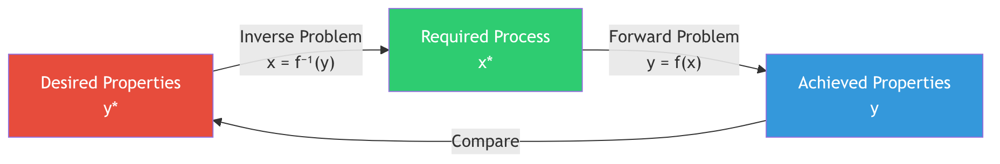
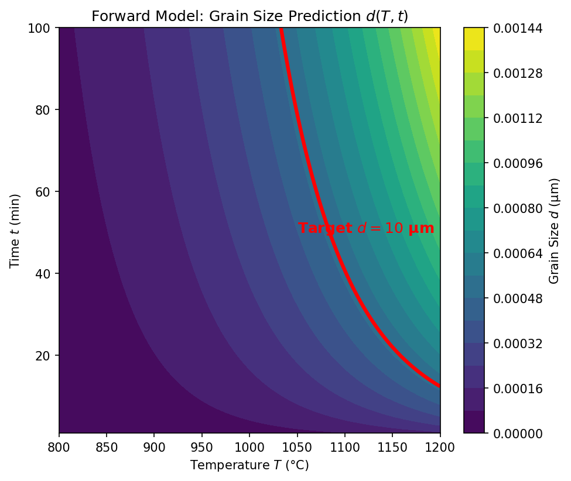
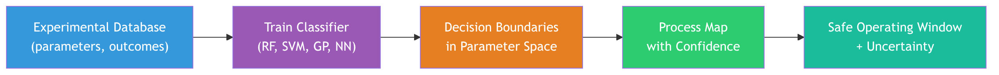
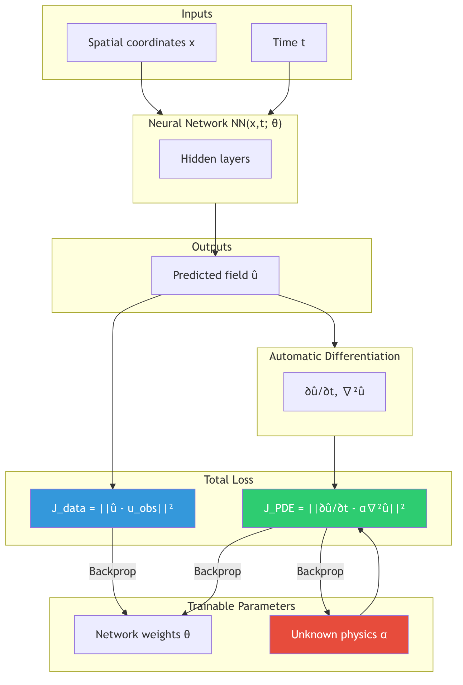
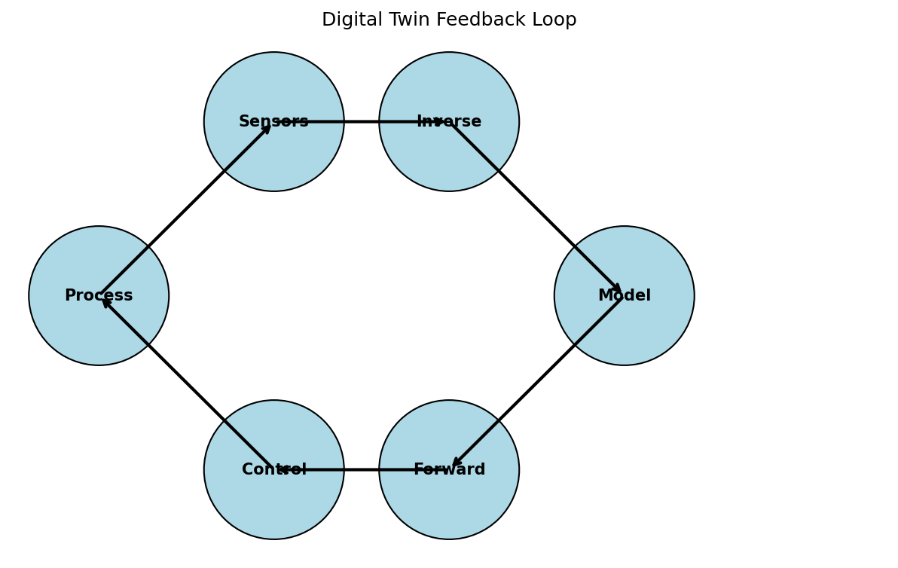
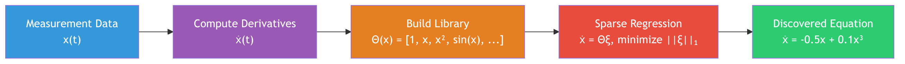

## 01. Learning Outcomes

::: {.fragment}
After this unit, you will be able to:
:::

::: {.fragment}
1. **Distinguish** forward from inverse problems and explain why inverse problems are ill-posed
:::

::: {.fragment}
2. **Apply** regularization strategies (Tikhonov, Bayesian priors) to stabilize inverse solutions
:::

::: {.fragment}
3. **Construct** process maps and identify safe operating windows for manufacturing
:::

::: {.fragment}
4. **Formulate** PINNs-based inverse problems to discover material parameters from data
:::

::: {.fragment}
5. **Explain** the SINDy algorithm and its use for discovering governing equations from data
:::

::: {.fragment}
6. **Sketch** how flow matching and consistency models turn inverse design into a conditional generative-sampling problem
:::

::: notes
- Open by naming the through-line of the whole unit: every previous unit built *forward* models — process in, property out.
- Today we turn the arrow around, and that single act of reversal breaks almost everything we relied on (uniqueness, stability, the adequacy of MSE loss).
- Tell students that the six outcomes are not a checklist of disconnected tricks but one escalating story: we first diagnose *why* inversion is hard (Hadamard), then the universal cure (regularization = prior knowledge), then three concrete modern instantiations of that cure — physics priors via PINNs, sparsity priors via SINDy, and learned generative priors via flow matching.
- If they leave with one sentence it should be: "An inverse problem is solved not by better inversion but by better prior knowledge."
- Promise them that by slide 47 every row of the summary table will feel obvious.
- Keep this slide short — 90 seconds — it is a map, not a destination.
:::

# Section 1: Forward / Inverse Duality {background-color="#1a1a2e"}

::: {.r-fit-text}
The Fundamental Asymmetry
:::

## 02. Recap: Forward Modeling

### Process → Structure → Properties

::: {.fragment}
The **forward problem** is what we have been doing in previous units:

$$\mathbf{y} = f(\mathbf{x}) + \varepsilon$$

Given process parameters $\mathbf{x}$, predict the resulting structure or properties $\mathbf{y}$.
:::

::: {.fragment}
**Examples:**

| Input $\mathbf{x}$ | Model $f$ | Output $\mathbf{y}$ |
|:--|:--|:--|
| Laser power, scan speed | Thermal simulation | Melt pool depth |
| Alloy composition | CALPHAD | Phase fractions |
| Annealing time, temperature | Diffusion model | Grain size |
:::

::: {.fragment}
- Forward problems are typically **well-posed**: the output is uniquely determined by the input
- Physics gives us the direction of causality: cause $\rightarrow$ effect
:::

::: notes
- Ground students in the familiar before pulling the rug out.
- Everything on this slide they already know — it is deliberately comfortable.
- Walk the three table rows out loud and stress the *direction of the arrow*: in each case physics hands us cause → effect for free.
- Define "well-posed" informally here (one input, one clean answer) so the word is already in the room before Hadamard formalizes it on slide 06.
- The one subtlety worth flagging: even forward models have noise $\varepsilon$ — but noise in the forward direction is benign (it blurs the output a little); the same noise run backwards through $f^{-1}$ is what will detonate later (slide 07).
- Ask the class: "Which of these three forward models would you trust to two significant figures?" — it primes them to notice that trust does not survive inversion.
- Transition line: "Now — what does an engineer actually want?
- Never the forward question."
:::

## 03. What Is an Inverse Problem?

### Structure → Process

::: {.fragment}
The **inverse problem** reverses the arrow:

$$\mathbf{x} = f^{-1}(\mathbf{y})$$

Given the desired output $\mathbf{y}^*$, find the input $\mathbf{x}^*$ that produces it.
:::

::: {.fragment}
**The question engineers actually ask:**

- "I need a part with $< 0.1\%$ porosity — what laser parameters should I use?"
- "I want a grain size of $10\,\mu\text{m}$ — what annealing schedule gives me that?"
- "I need yield strength $> 800\,\text{MPa}$ — what alloy composition and heat treatment?"
:::

{width=85%}

::: notes
- This is the emotional pivot of the unit — make it land.
- The three bullet questions are real questions engineers email you; read them in a practitioner's voice.
- The key reframing: the inverse problem is the *only* question industry ever asks, yet it is the question physics refuses to answer directly.
- That tension is the entire motivation for the next 45 slides.
- Use the diagram as a loop you trace with your finger: we know how to go B → C (forward, easy), we want A → B (inverse, hard), and the "Compare" arrow is the trick that lets us *attack the inverse by repeatedly solving the forward* — foreshadow optimization-based inversion (slide 09) and digital twins (slide 30) here.
- Emphasize $\mathbf{y}^*$ with the star: the star means "desired/target," distinct from an achieved $\mathbf{y}$.
- Misconception to pre-empt: students assume "inverse" means literally computing a matrix inverse $f^{-1}$; stress that for nonlinear or non-injective $f$ no such object exists — which is exactly slide 04.
:::

## 04. The Challenge: Non-Uniqueness

### Many Inputs Can Produce the Same Output

::: {.columns}
::: {.column width="55%"}
::: {.fragment}
If the forward map $f$ is **many-to-one**, then $f^{-1}$ is **one-to-many**:

$$f(\mathbf{x}_1) = f(\mathbf{x}_2) = \ldots = f(\mathbf{x}_k) = \mathbf{y}^*$$
:::

::: {.fragment}
**Materials example:**

A grain size of $d = 10\,\mu\text{m}$ can be achieved by:

- High temperature, short time: $(T_1 = 1100°\text{C},\; t_1 = 5\,\text{min})$
- Moderate temperature, medium time: $(T_2 = 900°\text{C},\; t_2 = 60\,\text{min})$
- Low temperature, long time: $(T_3 = 750°\text{C},\; t_3 = 480\,\text{min})$
:::

::: {.fragment}
- The forward problem has **one answer**; the inverse has **infinitely many**
- Which solution should we choose? Physics alone does not decide — we need additional criteria
:::
:::

::: {.column width="45%"}
::: {.fragment}
{width=100%}
:::
:::
:::

::: notes
- The grain-growth example is gold because it is physically intuitive: students know that high-T-short-time and low-T-long-time both coarsen grains — this is the Arrhenius trade-off they have seen.
- Drive home the logical core slowly: *many-to-one forward ⟹ one-to-many inverse.*
- Write $f(x_1)=f(x_2)=\dots=y^*$ on the board and ask "so what is $f^{-1}(y^*)$?" — let them answer "a set, not a point."
- That set-valued nature is the precise reason a single-output network will fail on the next slide, so plant the seed now.
- Second teaching beat: non-uniqueness is not a defect of our method — it is a property of the physics, and *no algorithm can remove it.*
- The only escape is to inject a preference (cheapest energy budget, fastest cycle time, least residual stress) that selects one element of the solution set.
- That preference *is* a prior — connecting forward to the regularization theme.
- If the image renders, point out that the iso-grain-size contour is literally the level set $\{x : f(x)=10\,\mu m\}$ — the geometric picture of non-uniqueness.
:::

## 05. Why Standard NNs Fail for Inverse Problems

### The Averaging Problem

::: {.fragment}
Train a standard neural network to map $\mathbf{y} \rightarrow \mathbf{x}$ using MSE loss:

$$\mathcal{L} = \frac{1}{N}\sum_{i=1}^{N} \|\mathbf{x}_i - \hat{\mathbf{x}}(\mathbf{y}_i)\|^2$$
:::

::: {.fragment}
If multiple valid solutions $\{\mathbf{x}_1, \mathbf{x}_2, \mathbf{x}_3\}$ exist for the same $\mathbf{y}^*$:

$$\hat{\mathbf{x}}_\text{NN} \approx \frac{1}{k}\sum_{j=1}^{k}\mathbf{x}_j \quad \text{(the mean of valid solutions)}$$
:::

::: {.fragment}
**The mean of valid solutions is often not itself a valid solution!**
:::

::: {.callout-warning}
## The Averaging Trap
A standard neural network trained with MSE loss on an inverse problem will predict the **average** of all valid solutions. This average may lie in a region of parameter space that produces defective parts — it is a physically meaningless compromise.
:::

::: notes
- This slide converts the abstract "one-to-many" worry into a concrete, alarming failure of the tool students trust most — the neural network.
- The mathematics is a one-liner everyone already knows: the minimizer of $\mathbb{E}\|x - \hat x\|^2$ is the conditional mean $\mathbb{E}[x\mid y]$.
- So a network trained with MSE on an inverse problem does not pick *a* valid solution — it averages *all* of them.
- The punchline must be visceral: draw two valid parameter points and mark their midpoint; if the valid region is non-convex (a banana, a ring, two islands), the midpoint sits in the forbidden zone.
- Best concrete analogy: two safe laser settings — low-power/slow and high-power/fast — average to medium-power/medium-speed, which can land squarely in the keyholing regime.
- So the "average part" is the *worst* part.
- This is also a quiet preview of why generative models (slide 43) win: they sample from the solution set instead of collapsing it to a mean.
- Ask: "What loss would *not* average?" — accept "predict a distribution," and tell them that is literally where Section 6 goes.
:::

# Section 2: Ill-Posedness & Regularization {background-color="#1a1a2e"}

::: {.r-fit-text}
Taming Unstable Solutions
:::

## 06. Hadamard's Definition of Well-Posedness

### Three Conditions (Jacques Hadamard, 1902)

::: {.fragment}
A problem is **well-posed** if and only if all three conditions hold:
:::

::: {.fragment}
1. **Existence**: A solution exists for every admissible input
:::

::: {.fragment}
2. **Uniqueness**: The solution is unique
:::

::: {.fragment}
3. **Stability**: The solution depends continuously on the data — small changes in input produce small changes in output
:::

::: {.fragment}
A problem that violates **any** of these conditions is called **ill-posed**.
:::

::: {.fragment}
| Condition | Forward Problem | Inverse Problem |
|:--|:-:|:-:|
| Existence | Usually yes | May fail (no process gives exactly $\mathbf{y}^*$) |
| Uniqueness | Usually yes | Often fails (many-to-one forward map) |
| Stability | Usually yes | Often fails (noise amplification) |
:::

::: notes
- Give Hadamard his historical due — 1902, studying PDEs, he was the first to articulate that "has a solution" is not enough for a problem to be physically meaningful.
- The three conditions map cleanly onto the three failures we just saw: Existence ↔ "maybe no process gives exactly $y^*$"; Uniqueness ↔ slide 04's many-to-one; Stability ↔ the averaging/noise issues.
- Emphasize that *stability* is the subtle, dangerous one — students intuit existence and uniqueness but rarely think about continuity of $f^{-1}$.
- Define stability operationally: small input wiggle ⟹ small output wiggle.
- An unstable inverse means your reconstruction depends discontinuously on measurement noise, so two near-identical datasets give wildly different answers — useless in practice even if a unique solution formally exists.
- Walk the comparison table column by column: the forward column is a wall of "yes," the inverse column a wall of "fails."
- That visual asymmetry *is* the lecture title ("The Fundamental Asymmetry").
- Note that violating *any one* condition makes it ill-posed — it is a logical AND.
:::

## 07. When Problems Are Ill-Posed

### The Butterfly Effect in Inversion

::: {.fragment}
**Stability violation — noise amplification:**

If the forward model maps a large range of inputs to a narrow range of outputs, then the inverse must map a narrow range of outputs back to a large range of inputs.
:::

::: {.fragment}
$$\text{Forward: } \Delta x = 100 \;\rightarrow\; \Delta y = 1$$
$$\text{Inverse: } \Delta y = 1 \;\rightarrow\; \Delta x = 100$$
:::

::: {.fragment}
A $1\%$ measurement error in $y$ causes a $100\%$ error in the inferred $x$!
:::

::: {.fragment}
**Materials example:**

- Measuring porosity with $\pm 0.05\%$ accuracy
- The inverse map amplifies this to $\pm 50\,\text{W}$ uncertainty in laser power
- This spans the entire range between "good" and "keyholing" regimes
:::

::: notes
- Focus the whole slide on instability — the condition students underweight.
- The arithmetic is deliberately stark: a forward map that compresses a wide input range into a narrow output range *must* have an inverse that expands a narrow output range into a wide input range.
- That expansion factor is the condition number, and it multiplies your noise.
- Make the units real with the LPBF example: $\pm0.05\%$ porosity error blows up to $\pm50\,\mathrm{W}$ laser-power uncertainty — and $50\,\mathrm{W}$ is the entire distance between "dense" and "keyholing."
- So a measurement you trust to two decimal places yields a process recommendation you cannot trust at all.
- Tie it back to the SVD language students will meet on slide 11: small singular values of $A$ are exactly the directions of catastrophic amplification, and regularization is the act of refusing to divide by them.
- The mantra to leave on the board: *"Inversion amplifies noise along the least-determined directions."*
- This is the mechanical reason we cannot proceed from data alone — motivating the priors of slide 09.
:::

## 08. Think About This...

### The Tomography Puzzle

::: {.fragment}
You have an X-ray CT scanner and take **projection images** of a metal part from 180 angles.
:::

::: {.fragment}
The forward problem is straightforward:

$$p_\theta(s) = \int_{\text{ray}} \mu(x, y)\, dl$$

Each projection is a line integral of the attenuation coefficient $\mu(x, y)$.
:::

::: {.fragment .fade-in-then-semi-out}
**Question 1:** Is the inverse problem (reconstructing $\mu(x, y)$ from projections) well-posed?

$\rightarrow$ It depends! With **infinite** noiseless projections, it is well-posed (Radon transform is invertible). With **finitely many noisy** projections, it is ill-posed — many images are consistent with the data.
:::

::: {.fragment}
**Question 2:** What happens if you reduce from 180 projections to 10?

$\rightarrow$ The problem becomes **severely ill-posed**. The null space of the measurement operator grows — there are many structures that produce the same 10 projections. You need strong priors (sparsity, smoothness, physics) to regularize.
:::

::: notes
- This is a worked Socratic slide — do not just read the answers.
- After posing each question, *wait*.
- Question 1 teaches that ill-posedness is not binary but depends on the *richness of the data*: the Radon transform is perfectly invertible with infinitely many noiseless angles (well-posed in the continuum), yet any real, finite, noisy acquisition is ill-posed.
- Question 2 introduces the single most important geometric object in inverse problems — the **null space** of the measurement operator.
- Going from 180 to 10 projections does not just add noise; it enlarges the set of structures the data literally cannot distinguish (they project identically).
- Draw two very different phantoms that yield the same 10 sinograms.
- The only way to choose between them is a prior — sparsity, smoothness, or known physics.
- This tomography puzzle is also a callback target: revisit it on slide 28 when we do ML-enhanced reconstruction and on slide 18 of the missing-wedge problem in electron tomography.
- End by asking: "If the data cannot decide, what should?" — the answer is the title of the next slide.
:::

## 09. Regularization: Prior Knowledge as a Constraint

### Turning Ill-Posed into Well-Posed

::: {.fragment}
**Core idea:** We cannot solve the inverse problem from data alone — we need to add **prior knowledge** about what a "good" solution looks like.
:::

::: {.fragment}
$$\hat{\mathbf{x}} = \arg\min_{\mathbf{x}} \underbrace{\|f(\mathbf{x}) - \mathbf{y}_\text{obs}\|^2}_{\text{data fidelity}} + \lambda \underbrace{R(\mathbf{x})}_{\text{regularization}}$$
:::

::: {.fragment}
| Regularizer $R(\mathbf{x})$ | Prior assumption | Effect |
|:--|:--|:--|
| $\|\mathbf{x}\|_2^2$ (L2 / Ridge) | Parameters are small | Smooth solutions, shrinks all parameters |
| $\|\mathbf{x}\|_1$ (L1 / LASSO) | Solution is sparse | Feature selection, sets parameters to zero |
| $\|\nabla \mathbf{x}\|_2^2$ | Solution is smooth | Suppresses oscillations |
| Total Variation $\|\nabla \mathbf{x}\|_1$ | Piecewise constant | Preserves sharp edges |
:::

::: {.fragment}
- $\lambda$ controls the **tradeoff** between fitting data and satisfying the prior
- Too small $\lambda$: noise dominates (overfitting to noisy measurements)
- Too large $\lambda$: prior dominates (underfitting the data)
:::

::: notes
- This is the conceptual keystone of the entire unit — if students remember one equation, it is the data-fidelity-plus-regularizer objective.
- Read it as a sentence: "find the $x$ that both *explains the data* and *looks like what I believe a good answer looks like*."
- The two terms are in tension and $\lambda$ is the dial between them.
- Spend real time on the regularizer table — each row is a *different sentence about the world*: L2 says "parameters are small/the answer is smooth," L1 says "the answer is sparse — most components are exactly zero," TV says "the answer is piecewise constant with sharp edges."
- This is where you connect to things they already know: Ridge and LASSO from the regression unit are *literally* L2 and L1 regularization — same math, now reframed as priors for inversion.
- Then nail the $\lambda$ bias-variance story: too small ⟹ noise wins (overfit the measurements), too large ⟹ prior wins (ignore the data, oversmooth).
- The L-curve on slide 11 is how we pick $\lambda$ in practice.
- Forward-reference: "the best prior of all is not a generic math penalty — it is physics," which is the very next slide.
:::

## 10. Physics as a Regularizer

### The Most Powerful Prior

::: {.fragment}
Instead of generic mathematical penalties, we can use **physical laws** as regularizers:
:::

::: {.fragment}
$$\hat{\mathbf{x}} = \arg\min_{\mathbf{x}} \|\mathbf{y}_\text{obs} - f(\mathbf{x})\|^2 + \lambda_\text{PDE} \underbrace{\left\|\mathcal{N}[\mathbf{u}(\mathbf{x})]\right\|^2}_{\text{PDE residual}} + \lambda_\text{BC} \underbrace{\left\|\mathcal{B}[\mathbf{u}(\mathbf{x})]\right\|^2}_{\text{boundary conditions}}$$
:::

::: {.fragment}
**Physical constraints in materials science:**

- Conservation of mass, momentum, energy
- Thermodynamic equilibrium (Gibbs energy minimization)
- Constitutive laws (stress-strain relations)
- Symmetry constraints (crystal symmetries)
:::

::: {.fragment}
**Advantage over L1/L2:**

- Physics-based regularizers encode **domain knowledge**, not just mathematical smoothness
- They constrain the solution to the **physically realizable** manifold
- They dramatically reduce the space of admissible solutions
:::

::: notes
- The argument here is one of *strength of prior*.
- Generic penalties (L1/L2) only know "small" or "sparse" — they are blind to physics.
- A PDE residual penalty knows conservation of mass, momentum, energy; thermodynamic admissibility; crystal symmetry.
- So instead of constraining the answer to a vague mathematical neighborhood, physics constrains it to the *physically realizable manifold* — a vastly smaller, sharper set.
- Use a picture: L2 shrinks toward the origin (a ball); physics shrinks toward a curved sheet of solutions that actually obey nature.
- This is *the* reason the whole field of physics-informed ML exists, and it is the thesis that Section 4 (PINNs) will operationalize.
- Note for honesty: physics priors are only as good as the physics you encode — a wrong PDE is a confidently wrong prior, worse than an agnostic L2.
- Two notations to flag so they are not scared on slide 20: $\mathcal{N}[\cdot]$ is the PDE operator (the residual is zero when the PDE holds), $\mathcal{B}[\cdot]$ enforces boundary conditions.
- We are just adding "disobeying physics is expensive" to the loss.
:::

## 11. Tikhonov Regularization

### The Classical Approach

::: {.columns}
::: {.column width="55%"}
**Tikhonov regularization** (also called Ridge regression in ML) adds an L2 penalty:

$$\hat{\mathbf{x}} = \arg\min_{\mathbf{x}} \|\mathbf{A}\mathbf{x} - \mathbf{y}\|_2^2 + \lambda \|\mathbf{L}\mathbf{x}\|_2^2$$

For the linear case $\mathbf{y} = \mathbf{A}\mathbf{x}$, the solution is:

$$\hat{\mathbf{x}}_\lambda = (\mathbf{A}^T\mathbf{A} + \lambda \mathbf{L}^T\mathbf{L})^{-1}\mathbf{A}^T\mathbf{y}$$

**Effect on the singular values:**

- Without regularization: $\hat{x}_i = \frac{\sigma_i}{\sigma_i^2} (\mathbf{u}_i^T\mathbf{y})$ — small singular values $\sigma_i$ cause blow-up
- With regularization: $\hat{x}_i = \frac{\sigma_i}{\sigma_i^2 + \lambda} (\mathbf{u}_i^T\mathbf{y})$ — the $\lambda$ term damps small singular values
:::

::: {.column width="45%"}
{width=100%}
:::
:::

::: notes
- This slide makes the abstract idea of "damping small singular values" mechanically concrete — it is the place to do real board math if your audience is mathematical.
- The SVD line is the heart of it: write $\hat x_i = \frac{\sigma_i}{\sigma_i^2}(u_i^\top y) = \frac{1}{\sigma_i}(u_i^\top y)$ and ask what happens as $\sigma_i \to 0$ — division by a tiny number, the blow-up from slide 07 made explicit.
- Then show the regularized filter factor $\frac{\sigma_i}{\sigma_i^2 + \lambda}$: for large $\sigma_i$ it ≈ $1/\sigma_i$ (well-determined directions pass through untouched), for small $\sigma_i$ it ≈ $\sigma_i/\lambda \to 0$ (poorly-determined directions are smoothly suppressed instead of exploding).
- That is the whole trick — regularization is a *soft low-pass filter on the singular spectrum*.
- The matrix $L$ lets you penalize derivatives instead of magnitude (smoothness rather than smallness).
- Finally, the **L-curve**: plot solution norm vs residual norm on log-log as $\lambda$ sweeps; the corner is the sweet spot — maximal noise suppression before you start destroying signal.
- This is the practical answer to "how do I pick $\lambda$?"
:::

## 12. Bayesian View of Inverse Problems

### From Point Estimates to Posterior Distributions

::: {.fragment}
Instead of finding a single "best" $\mathbf{x}$, compute the **posterior distribution**:

$$p(\mathbf{x} \mid \mathbf{y}) = \frac{p(\mathbf{y} \mid \mathbf{x})\, p(\mathbf{x})}{p(\mathbf{y})}$$
:::

::: {.fragment}
| Bayesian Term | Inverse Problem Meaning |
|:--|:--|
| $p(\mathbf{x} \mid \mathbf{y})$ — Posterior | Probability of parameters given observed data |
| $p(\mathbf{y} \mid \mathbf{x})$ — Likelihood | How well the forward model fits the data |
| $p(\mathbf{x})$ — Prior | Our regularization / domain knowledge |
| $p(\mathbf{y})$ — Evidence | Normalization constant |
:::

::: {.fragment}
**Connection to regularization:**

- Gaussian prior $p(\mathbf{x}) \propto \exp(-\frac{\lambda}{2}\|\mathbf{x}\|^2)$ $\;\Leftrightarrow\;$ L2 (Tikhonov) regularization
- Laplace prior $p(\mathbf{x}) \propto \exp(-\lambda\|\mathbf{x}\|_1)$ $\;\Leftrightarrow\;$ L1 (LASSO) regularization
- The MAP estimate $\hat{\mathbf{x}}_\text{MAP} = \arg\max_\mathbf{x}\, p(\mathbf{x} \mid \mathbf{y})$ recovers the regularized solution
:::

::: {.callout-tip}
## Why Go Bayesian?
The posterior distribution gives us not just a point estimate but **uncertainty quantification**: we know which process parameters are well-constrained by the data and which are uncertain. This is essential for risk-aware manufacturing.
:::

::: notes
- The reveal that students should feel as an "aha": **regularization was Bayes all along.**
- Everything in slides 09–11 was secretly the negative-log-posterior.
- Make the dictionary explicit by deriving it live — take $-\log$ of $p(x\mid y) \propto p(y\mid x)p(x)$: the log-likelihood becomes the data-fidelity term, the log-prior becomes the regularizer.
- A Gaussian prior $\exp(-\frac{\lambda}{2}\|x\|^2)$ gives back *exactly* Tikhonov; a Laplace prior gives back *exactly* LASSO.
- So MAP estimation = regularized least squares.
- This unifies the whole section and should be drawn as a two-column equivalence on the board.
- But the bigger payoff is the callout: Bayes does not stop at the MAP point — it returns the *whole posterior*, hence **uncertainty quantification**.
- We learn not just "use 280 W" but "use 280 ± 8 W, and the scan speed is barely constrained at all."
- That distinction — which knobs are pinned by data and which float free — is exactly what risk-aware manufacturing needs, and it is the bridge to Unit 9.
- Emphasize: the prior is not cheating; choosing *no* prior is itself a (usually terrible) choice of flat prior.
:::

# Section 3: Process Maps & Corridors {background-color="#1a1a2e"}

::: {.r-fit-text}
Navigating the Parameter Space
:::

## 13. What Is a Process Map?

::: columns
:::: {.column width="60%"}

### Visualizing the Feasible Region [@neuer2024machine]

::: {.fragment}
A **process map** is a visualization of the parameter space that classifies regions by outcome quality:
:::

::: {.fragment}
- **Axes**: Key process parameters (e.g., laser power $P$, scan speed $v$)
- **Regions**: Classified by dominant defect mechanism or quality metric
- **Boundaries**: Critical transitions between regimes
:::

::: {.fragment}
**The engineering goal:** Find the region in parameter space where **all** quality criteria are simultaneously satisfied — the **safe operating window**.
:::

::::

:::: {.column width="40%"}
::: {.fragment}
{width=100%}
:::
::::
:::

::: notes
- Shift register here: Sections 1–2 were theory; Section 3 is the *engineering payoff* — how inverse-problem thinking becomes a picture a process engineer can act on.
- Define a process map plainly: take the parameter space (often laser power vs scan speed for LPBF), color every point by what comes out (dense / keyhole / lack-of-fusion / balling).
- Stress that the map is a *compressed forward model* — it is the forward map $f$ evaluated everywhere and binned by outcome.
- The inverse use is then visual and intuitive: "I want dense" ⟹ "stay in the green region."
- That sidesteps the averaging trap of slide 05 entirely, because we are choosing a *region*, not collapsing to a mean.
- The engineering goal line is the one to underline: we rarely optimize a single property — we need *all* quality criteria satisfied at once, which is an intersection of regions.
- That intersection is the "safe operating window," the subject of the next slide.
- Note the citation: process maps and corridors here follow Neuer et al. (2024).
- If the P–v map image renders, point to a real boundary and ask the class to predict which defect lies on each side.
:::

## 14. Defining the Safe Operating Window

### Defect Mechanisms as Constraints

::: {.fragment}
Each defect mechanism defines a **constraint boundary** in parameter space:
:::

::: {.fragment}
| Defect | Mechanism | Boundary condition |
|:--|:--|:--|
| **Keyholing** | Vapor depression collapse | $E_v > E_\text{keyhole}^*$ (energy density too high) |
| **Lack of fusion** | Insufficient melting | $E_v < E_\text{fusion}^*$ (energy density too low) |
| **Balling** | Rayleigh instability | $v > v_\text{ball}^*(P)$ (speed too high for given power) |
| **Cracking** | Thermal stress | $\dot{T} > \dot{T}_\text{crack}^*$ (cooling rate too high) |
:::

::: {.fragment}
The **safe operating window** is the intersection:

$$\Omega_\text{safe} = \{\mathbf{x} : E_v(\mathbf{x}) \in [E_\text{fusion}^*, E_\text{keyhole}^*] \;\wedge\; v < v_\text{ball}^*(P) \;\wedge\; \dot{T} < \dot{T}_\text{crack}^*\}$$
:::

::: {.fragment}
- In LPBF, the volumetric energy density is often used: $E_v = \frac{P}{v \cdot h \cdot t}$
- The safe window may be **narrow** — leaving little room for process variation
:::

::: notes
- This slide makes the safe window *mechanistic* — each boundary is not arbitrary, it is a specific physics failure mode.
- Walk the table as a story of "too much / too little": too much energy density ⟹ keyholing (vapor depression collapses, traps pores); too little ⟹ lack of fusion (didn't fully melt).
- Balling is a Rayleigh–Plateau instability — a fast, thin melt track breaks into droplets like a stream of water; cracking is thermal-stress driven by excessive cooling rate.
- The safe window is the *logical AND* of all these inequalities — the $\Omega_\text{safe}$ set.
- Make the connection explicit: this is exactly the regularized feasibility set from Section 2, but now the "regularizer" is a stack of physically-motivated hard constraints.
- Introduce the volumetric energy density $E_v = P/(v\,h\,t)$ as the classic lumped parameter — but warn that it is a *useful oversimplification*: two settings with identical $E_v$ can behave very differently, which is precisely why we need full multi-dimensional maps (slide 16) and ML boundaries (slide 17).
- Final beat: the window "may be narrow."
- A narrow window means tiny process tolerance — the motivation for corridors and monitoring on the next two slides.
:::

## 15. Process Corridors

### Drift Over Time [@neuer2024machine]

:::: {.columns}
::: {.column width="30%"}
::: {.fragment}
{width=100%}
:::
:::
::: {.column width="70%"}
::: {.fragment}
A **process corridor** extends the static process map to account for **temporal drift**:
:::

::: {.fragment}
- Equipment degradation (laser power drift, optics contamination)
- Raw material variation (powder reuse, batch-to-batch variability)
- Environmental changes (humidity, ambient temperature)
:::

::: {.fragment}
**The corridor concept:**

- The **nominal operating point** is the center of the safe window
- The **corridor** is the trajectory of the actual operating point over time
- If the corridor exits the safe window, defects occur
- **Monitoring** the corridor enables **predictive maintenance** and **adaptive process control**
:::
:::
::::

::: notes
- The key new idea: a process map is a *snapshot*, but a real machine *drifts*.
- The safe window is fixed in parameter space, yet the machine's actual operating point wanders over hours and builds — laser power decays, optics fog, powder gets reused, the room warms up.
- A corridor is the *trajectory* of that operating point through time.
- The danger is not being in the wrong place today; it is drifting out of the green region mid-build without noticing.
- This reframes quality control as a *dynamical* problem and motivates two industrially important moves: (1) place the nominal setpoint at the *center* of the window, not its edge, to maximize drift margin — a robustness argument students should internalize for any design problem; (2) *monitor* the corridor so you can predict the exit before it happens — predictive maintenance and adaptive control.
- Tie this forward to Unit 7's time-series monitoring (the previous unit) — the corridor is literally a multivariate time series with a feasibility constraint.
- Ask: "If your window is narrow and your laser drifts 5% per 100 hours, how often must you recalibrate?" — turns the concept into a maintenance schedule.
:::

## 16. Multi-Dimensional Feasibility Regions

### Beyond 2D Maps

::: {.fragment}
Real manufacturing processes have many more than 2 parameters:
:::

::: {.fragment}
**LPBF example — at least 8 key parameters:**

| Parameter | Typical Range |
|:--|:--|
| Laser power $P$ | 100 – 500 W |
| Scan speed $v$ | 200 – 2000 mm/s |
| Hatch spacing $h$ | 50 – 150 μm |
| Layer thickness $t$ | 20 – 100 μm |
| Spot diameter $d$ | 50 – 200 μm |
| Preheat temperature $T_0$ | 25 – 500 °C |
| Scan strategy | Stripe, island, meander |
| Gas flow rate | 1 – 10 m/s |
:::

::: {.fragment}
- The feasible region is a **high-dimensional manifold** that cannot be visualized directly
- 2D process maps are **projections** — they can hide important interactions
- ML enables navigation of the full-dimensional space
:::

::: notes
- The honest reality check: the pretty 2D power-vs-speed map is a *projection* of an 8+ dimensional reality, and projections lie.
- Two settings that look identical on the P–v plane can differ in hatch spacing, layer thickness, or preheat and land in different defect regimes — the boundary you drew is really a shadow.
- Walk a couple of the table rows to show the ranges are wide and the interactions matter (e.g., the balling speed threshold *depends on* power, so the parameters are not separable).
- The pedagogical payoff: in high dimensions you cannot eyeball the feasible region — you cannot even plot it — so you need a *function* that, given any 8-D point, tells you the outcome.
- That function is a learned classifier, which is exactly slide 17.
- This is the moment to motivate ML as a *navigation tool for spaces humans cannot visualize*, not as a black box for its own sake.
- Caution students against the common industrial mistake of optimizing on a 2D slice and being blindsided by an unmodeled third parameter — the "hidden interaction" failure.
:::

## 17. ML for Mapping Defect Boundaries

### Classification Approach

::: {.fragment}
**Idea:** Train a classifier to predict defect type from process parameters:

$$\hat{c}(\mathbf{x}) = \text{Classifier}(P, v, h, t, d, T_0, \ldots)$$

where $c \in \{\text{dense}, \text{keyhole}, \text{LOF}, \text{balling}, \text{cracking}\}$
:::

::: {.fragment}
**Common approaches:**

- **Random Forests**: Handle mixed parameter types, provide feature importance
- **SVM**: Good boundaries with limited data, kernel methods for non-linear boundaries
- **Neural Networks**: Flexible boundaries, but need more data
- **Gaussian Processes**: Provide uncertainty on boundary location
:::

::: {.fragment}
{width=90%}
:::

::: notes
- Now ML earns its keep: instead of hand-drawing boundaries, we *learn* them from an experimental database — process parameters in, defect class out.
- Frame it as plain supervised classification, which students already know, so the novelty is purely in the application.
- Spend the time on the *model-choice trade-offs* because that judgment is examinable and practical: Random Forests handle mixed/categorical parameters (scan strategy!) and hand you feature importances for free; SVMs draw clean boundaries from few samples and kernelize to nonlinear shapes; neural nets are the most flexible but the most data-hungry — usually a poor fit for AM where each data point is an expensive printed-and-sectioned coupon; Gaussian Processes are the quiet hero here because they return *calibrated uncertainty on the boundary location.*
- Emphasize the last column of the flow: the deliverable is not just a boundary but a boundary *with confidence*, which feeds directly into how much safety margin you leave.
- Data-scarcity is the dominant constraint in this domain — say it explicitly: prefer the most sample-efficient model that still captures the boundary shape.
- This also sets up sensitivity analysis: once you have a differentiable model of quality, you can ask which knob matters most.
:::

## 18. Sensitivity Analysis on the Process Map

### Which Parameters Matter Most?

::: {.fragment}
**Sensitivity analysis** identifies which process parameters have the strongest influence on quality:
:::

::: {.fragment}
**Local sensitivity (gradient-based):**

$$S_i = \frac{\partial \hat{y}}{\partial x_i}\bigg|_{\mathbf{x}_0}$$

How much does the output change when parameter $i$ is perturbed?
:::

::: {.fragment}
**Global sensitivity (Sobol indices):**

$$S_i = \frac{\text{Var}[\mathbb{E}[\hat{y} \mid x_i]]}{\text{Var}[\hat{y}]}$$

What fraction of the total output variance is attributable to parameter $i$?
:::

::: {.fragment}
**Materials insight:** If the safe operating window is narrow along parameter $x_i$ but wide along $x_j$:

- $x_i$ requires **tight control** (high sensitivity)
- $x_j$ can tolerate **more variation** (low sensitivity)
- Focus monitoring and control efforts on the high-sensitivity parameters
:::

::: notes
- The actionable question: with eight knobs, which ones do you guard with tight tolerances and which can you let breathe?
- Contrast the two flavors carefully.
- **Local sensitivity** is just the gradient $\partial \hat y/\partial x_i$ at one operating point — cheap, but only valid in a small neighborhood and blind to interactions.
- **Global sensitivity** (Sobol) partitions the *total output variance* into contributions from each parameter across the whole input distribution — it captures nonlinearity and interactions but costs many model evaluations (which is why a fast surrogate from slide 17 matters).
- Make the manufacturing payoff vivid with the geometry: if the safe window is *narrow* along $x_i$, then $x_i$ has high sensitivity and demands tight control (expensive, precise hardware); if the window is *wide* along $x_j$, that parameter is forgiving and you can spend your control budget elsewhere.
- So sensitivity analysis is fundamentally a *resource-allocation tool* — it tells you where to spend money on metrology and feedback.
- Connect to Sobol's variance decomposition if students have seen ANOVA: it is the same "fraction of variance explained" idea applied to a simulator.
- This closes the loop: process maps + sensitivity = a rational control strategy.
:::

## 19. Summary: Process Maps

::: {.fragment}
**Key concepts:**
:::

::: {.fragment}
- Process maps visualize **feasibility regions** in parameter space, bounded by defect mechanisms
:::

::: {.fragment}
- The **safe operating window** is the intersection of all quality constraints
:::

::: {.fragment}
- **Process corridors** capture temporal drift of the operating point
:::

::: {.fragment}
- ML classifiers can learn defect boundaries from experimental data
:::

::: {.fragment}
- **Sensitivity analysis** identifies which parameters require tightest control
:::

::: {.fragment}
- Finding the **optimal operating point** within the safe window is an inverse problem
:::

::: notes
- Use this as a genuine recap pause — let students breathe and consolidate before the harder PINN section.
- Do not just re-read the bullets; instead, ask the class to reconstruct the logical chain: feasible region → bounded by defect *mechanisms* → safe window is their *intersection* → corridors add *time* → ML *learns* the boundaries from data → sensitivity tells us where to *control*.
- The single most important conceptual closure is the last bullet: finding the *optimal* point inside the safe window is itself an inverse problem (desired performance → required parameters), so Section 3 was never a detour from the unit's theme — it was the inverse problem dressed in engineering clothes.
- This is also the natural place to ask an exam-style synthesis question: "You are handed a labeled AM dataset of 60 coupons.
- Sketch the pipeline from data to a controlled, robust setpoint."
- A good answer touches classifier choice (data-scarce ⟹ GP/RF), uncertainty on the boundary, center-of-window setpoint for drift margin, and sensitivity-driven tolerance allocation.
- Then transition: "We have been treating $f$ as a black box we sample.
- What if we *know the governing PDE* but not its coefficients?
- That changes everything — enter PINNs."
:::

# Section 4: Parameter Discovery with PINNs {background-color="#1a1a2e"}

::: {.r-fit-text}
From Data to Physics
:::

## 20. PINNs for Inverse Problems

### Recap: The PINN Framework

::: {.fragment}
Recall (preview of Unit 12 — PINNs): A **Physics-Informed Neural Network** represents the solution $u(x, t)$ as a neural network and trains it by minimizing:

$$\mathcal{L} = \underbrace{\mathcal{L}_\text{data}}_{\text{match observations}} + \underbrace{\lambda_\text{PDE}\, \mathcal{L}_\text{PDE}}_{\text{satisfy physics}} + \underbrace{\lambda_\text{BC}\, \mathcal{L}_\text{BC}}_{\text{boundary conditions}}$$
:::

::: {.fragment}
**Forward PINN:** All parameters of the PDE are **known**. The network learns $u(x,t)$.
:::

::: {.fragment}
**Inverse PINN:** Some parameters of the PDE are **unknown**. The network learns $u(x,t)$ **and** the unknown parameters simultaneously.
:::

::: {.fragment}
**Key insight:** Unknown physical parameters (diffusivity, conductivity, viscosity) become **trainable parameters** of the optimization, alongside the network weights.
:::

::: notes
- This is a preview of Unit 12, so calibrate depth to your audience — give enough that the inverse trick lands, but do not teach the full PINN machinery yet.
- The one idea that must be crystal clear is the *reframing of an unknown physical constant as a trainable parameter*.
- In a forward PINN, the PDE coefficients (diffusivity, conductivity, viscosity) are known and the network only learns the field $u(x,t)$.
- In an inverse PINN we make a tiny but profound change: we declare the unknown coefficient $\alpha$ to be just another `requires_grad=True` parameter and let the *same* optimizer that tunes the network weights also tune $\alpha$.
- The PDE-residual loss term is what couples them — to drive that residual down, the optimizer is forced to find the $\alpha$ that makes the data-fit field actually satisfy the physics.
- Emphasize that this is mechanically *trivial* in autodiff frameworks (one line), yet conceptually it unifies "solve the PDE" and "identify the parameter" into a single optimization.
- Reassure students who fear the $\lambda$ notation: it is the same data-vs-physics balance dial from slide 10, nothing new.
- Then promise a concrete worked case next.
:::

## 21. Case Study: Discovering Thermal Diffusivity

### The Heat Equation with Unknown $\alpha$ [@mcclarren2021machine]

::: {.fragment}
**The heat equation:**

$$\frac{\partial T}{\partial t} = \alpha \nabla^2 T$$

where $\alpha$ is the thermal diffusivity — **unknown**.
:::

::: {.fragment}
**Data:** Temperature measurements $T_\text{obs}(x_i, t_j)$ at scattered sensor locations.
:::

::: {.fragment}
**Inverse PINN setup:**

1. Network: $\hat{T}(x, t; \boldsymbol{\theta})$ approximates the temperature field
2. Unknown: $\alpha$ is a trainable scalar parameter
3. Minimize:

$$\mathcal{L} = \frac{1}{N_d}\sum_{i=1}^{N_d}\left(\hat{T}(x_i, t_i) - T_\text{obs}^i\right)^2 + \frac{\lambda}{N_c}\sum_{j=1}^{N_c}\left(\frac{\partial \hat{T}}{\partial t} - \alpha \nabla^2 \hat{T}\right)^2_{\!(x_j, t_j)}$$
:::

::: notes
- Make this fully concrete — the heat equation is the "hydrogen atom" of inverse problems and worth doing slowly.
- Set the scene physically: someone embedded a few thermocouples in a sample, recorded $T$ at scattered $(x_i, t_j)$, and wants the material's thermal diffusivity $\alpha$.
- Walk the two loss terms separately.
- The **data term** says "your predicted temperature must match the sensors" — that alone is just curve fitting and would be wildly underdetermined from a handful of points.
- The **PDE term** says "and your field must obey $\partial_t T = \alpha\nabla^2 T$ *everywhere*, at thousands of collocation points where we have no data."
- That second term is the regularizer doing the heavy lifting — it stitches the sparse sensor data into a globally physical field and simultaneously pins down $\alpha$.
- Stress that collocation points are *free* — we just sample them in the domain, no measurement needed — which is why PINNs are so data-efficient.
- A good board moment: ask "what value of $\alpha$ minimizes the PDE residual given the data-fit field?" to show $\alpha$ is identified by *consistency*, not by direct measurement.
- This sets up the autodiff plumbing on the next slide.
:::

## 22. The Inverse Loss Function

### Anatomy of $\mathcal{J} = \mathcal{J}_\text{data} + \mathcal{J}_\text{PDE}$

:::: {.columns}
::: {.column width="60%"}
{width=30%}
:::

::: {.column width="40%"}
::: {.fragment}
- Gradients of $\mathcal{L}$ w.r.t. $\alpha$ flow through the PDE residual via **automatic differentiation**
- The optimizer simultaneously updates $\boldsymbol{\theta}$ (network weights) and $\alpha$ (physics)
:::
:::
::::

::: notes
- This diagram is the mechanical heart of inverse PINNs — trace the dataflow with your finger and let the picture do the teaching.
- Inputs $(x,t)$ go into the network, out comes the predicted field $\hat u$.
- Two things then happen to $\hat u$: it is compared to observations (the blue data loss), and it is fed through **automatic differentiation** to produce the exact derivatives $\partial \hat u/\partial t$ and $\nabla^2 \hat u$ that the PDE needs (the green physics loss).
- The crucial, beautiful detail — and the thing to emphasize — is the *two red backprop arrows into $\alpha$*: gradients of the loss flow not only into the network weights $\theta$ but also into the unknown physics $\alpha$ (highlighted in red).
- The same backward pass that trains the net also identifies the physical constant.
- Underscore that the derivatives are *exact*, not finite-difference approximations — autodiff differentiates the network analytically, which is why PINNs handle high-order PDEs cleanly.
- If students have only ever seen autodiff used for weights, this is an eye-opener: autodiff differentiates the *output w.r.t. the inputs* to build the physics residual, a second, orthogonal use of the same tool.
- Keep the energy up — this slide is where "it's just one optimization" becomes visible.
:::

## 23. Why PINNs Beat Curve Fitting

### Advantages of the Physics-Informed Approach

::: {.fragment}
**Traditional approach — least-squares curve fitting:**

1. Assume a parametric form: $T(x, t; \alpha) = T_0 + \Delta T\, \text{erfc}\!\left(\frac{x}{2\sqrt{\alpha t}}\right)$
2. Fit $\alpha$ by minimizing $\sum_i (T_\text{model}^i - T_\text{obs}^i)^2$
:::

::: {.fragment}
**Problems with curve fitting:**

- Requires an **analytical solution** — only available for simple geometries and BCs
- Cannot handle **complex domains**, nonlinear PDEs, or coupled physics
- Sensitive to **noise** — no regularization from the PDE structure
:::

::: {.fragment}
**PINN advantages:**

- Works with **any** PDE — no analytical solution needed
- Handles **arbitrary geometries** and boundary conditions
- The PDE itself acts as a **regularizer**, denoising the observations
- Can discover **spatially varying** parameters: $\alpha(x)$ instead of a single scalar
- Naturally extends to **multi-physics** problems
:::

::: notes
- Pre-empt the natural student objection: "Couldn't I just fit $\alpha$ with old-fashioned least squares?"
- Sometimes yes — so be fair and show the traditional route first (assume the analytical erfc solution, fit $\alpha$).
- Then expose its three fatal limits: it *requires* a closed-form solution (only exists for trivial geometry and boundary conditions), it cannot touch complex domains / nonlinear / coupled physics, and with no PDE structure it has nothing to denoise against, so it is noise-sensitive.
- PINNs dissolve all three: any PDE works, arbitrary geometry is just point sampling, and the PDE residual *is* a regularizer that cleans the data (the same denoising idea from Section 2, now physics-powered).
- The standout advantage to dwell on — because it motivates the next slide — is that PINNs can discover *spatially or temperature varying* parameters $\alpha(x)$, $D(T)$, which curve fitting essentially cannot.
- Be intellectually honest though: for a simple 1-D constant-$\alpha$ problem with a known solution, curve fitting is faster and perfectly adequate — PINNs earn their complexity only when the problem is genuinely hard.
- Avoid overselling; slide 27 will give the balanced comparison.
:::

## 24. Discovering Variable Parameters: $D(T)$

### Beyond Scalar Constants

::: columns
:::: {.column width="57%"}
::: {.fragment}
Many material properties depend on temperature or composition:

$$\frac{\partial c}{\partial t} = \nabla \cdot [D(T)\, \nabla c]$$

where $D(T)$ is the **temperature-dependent diffusivity** — unknown functional form.

**PINN approach:**

- Represent $D(T)$ as a **second neural network**: $\hat{D}(T; \boldsymbol{\phi})$
- Train simultaneously:
  - $\hat{c}(x, t; \boldsymbol{\theta})$ — concentration field  
  - $\hat{D}(T; \boldsymbol{\phi})$ — diffusivity function

:::
::::

:::: {.column width="43%"}
::: {.fragment}
$$\mathcal{L} = \underbrace{\sum_i (c_\text{obs}^i - \hat{c}^i)^2}_{\text{data}} + \lambda \underbrace{\sum_j \left(\frac{\partial \hat{c}}{\partial t} - \nabla \cdot [\hat{D}(\hat{T}) \nabla \hat{c}]\right)^2_j}_{\text{PDE}} + \mu \underbrace{\sum_k \left(\frac{d\hat{D}}{dT}\right)^2_k}_{\text{smoothness prior on } D}$$

**Result:**  
We discover the full functional relationship $D(T)$ from data — not just a single number!
:::
::::
:::

::: notes
- This is the conceptual high point of the PINN section — discovering a *function*, not a number.
- The leap: instead of one trainable scalar $\alpha$, we represent the unknown material law $D(T)$ as a *second neural network* $\hat D(T;\phi)$ and co-train it with the field network.
- Help students see why this is powerful — most real material properties are not constants; diffusivity, conductivity, and viscosity all vary with temperature and composition, and the *functional form* is often unknown.
- The PINN learns that whole curve from data without ever assuming Arrhenius or any parametric shape.
- Point out the third loss term, the **smoothness prior** $\mu\sum(d\hat D/dT)^2$: without it, the function network can wiggle wildly between data points and still satisfy the PDE — the problem is again ill-posed, so we regularize the *function*, not just fit it.
- This is Section 2's lesson recurring one level up: even our discovered function needs a prior.
- Flag the design tension: too much $\mu$ oversmooths real curvature in $D(T)$; too little lets noise in.
- Land the punchline on screen — "we discover the full relationship $D(T)$, not just a single number" — and connect it to slide 38's discovery of constitutive laws.
:::

## 25. Example: Melt Pool Shapes to Thermal Conductivity

### Inverse Problem in Additive Manufacturing

::: columns
:::: {.column width="55%"}

::: {.fragment}
**Scenario:** You have cross-sectional images of melt pool shapes from LPBF experiments at various process parameters.
:::

::: {.fragment}
**Forward model:** Steady-state heat equation with convection:

$$\rho c_p (\mathbf{v} \cdot \nabla T) = \nabla \cdot [k(T)\, \nabla T] + Q_\text{laser}$$
:::

::: {.fragment}
**Known:**  
- Laser power $Q_\text{laser}$
- Scan speed $\mathbf{v}$
- Melt pool boundary (solidus isotherm location)

**Unknown:**  
- Temperature-dependent thermal conductivity $k(T)$
:::

::: {.fragment}
**Inverse PINN approach:**
- Melt pool boundary provides data: $\hat{T}(x_\text{boundary}) = T_\text{solidus}$
- PDE provides physics: heat equation residual
- The network learns $k(T)$ that produces observed melt pool shapes
:::

::::

:::: {.column width="45%"}
::: {.fragment}
{width=90%}
:::
::::

:::

::: notes
- Ground the abstraction in a real AM problem students care about.
- The clever twist here is the *data source*: we have no thermocouples inside a melt pool (impossible), but we *do* have the melt-pool boundary from cross-sectioned micrographs — and that boundary is an isotherm, the solidus temperature contour.
- So the geometry of the melt pool *is* the data: $\hat T(x_\text{boundary}) = T_\text{solidus}$.
- Let students appreciate the elegance — a shape measurement becomes a temperature constraint.
- The PINN then finds the temperature-dependent conductivity $k(T)$ that makes the heat-convection PDE reproduce the observed pool shape across many power/speed settings.
- Note the forward model includes a convection term ($\mathbf v\cdot\nabla T$) because the laser scans — this is no longer a textbook problem, which is exactly why the meshfree PINN shines.
- This example also closes a loop with Section 3: the same melt-pool physics that defined the keyhole/LOF boundaries on the process map is what we are now inverting for material parameters.
- (Heads-up: the image reuses the grain-size figure as a placeholder — describe the intended melt-pool cross-section verbally rather than relying on it.)
:::

## 26. Accuracy and Convergence

### How Well Do Inverse PINNs Work?

::: {.fragment}
**Typical accuracy for parameter discovery:**

| Problem | Unknown | Relative Error | Data Points |
|:--|:--|:-:|:-:|
| 1D Heat equation | $\alpha$ (scalar) | $< 1\%$ | 100 |
| 2D Diffusion | $D$ (scalar) | $1\text{–}3\%$ | 500 |
| Navier-Stokes | $\nu$ (viscosity) | $2\text{–}5\%$ | 1000 |
| Variable $D(T)$ | $D(T)$ (function) | $5\text{–}10\%$ | 2000 |
:::

::: {.fragment}
**Convergence challenges:**

- Inverse PINNs are **harder to train** than forward PINNs — the loss landscape is more complex
- Multiple local minima may correspond to different physical parameters
- The balance $\lambda$ between data and PDE loss is critical
- **Strategies:** Learning rate scheduling, curriculum training (start with data, add PDE gradually), multi-fidelity approaches
:::

::: {.callout-note}
## Practical Tip
Start the inverse PINN training with a good initial guess for the unknown parameter. If $\alpha_\text{true} \approx 10^{-5}$, initializing at $\alpha_0 = 10^{-7}$ may converge to a wrong local minimum. Use rough estimates from literature or dimensional analysis.
:::

::: notes
- Give students realistic expectations so they neither over-trust nor dismiss inverse PINNs.
- The accuracy table tells a clear story: scalar constants in clean problems are recovered to ~1%, but as you climb to functions and to noisier/coupled physics the error grows to 5–10% and you need far more data.
- Use this to teach a general principle — *the harder the unknown (scalar → vector → function) and the weaker the data, the worse the inverse.*
- The convergence warnings are the practical meat: inverse PINNs are genuinely harder to train than forward ones because the loss landscape is non-convex with multiple minima, and different local minima correspond to *different physical answers* — a wrong $\alpha$ that still fits is the nightmare scenario.
- Share the working strategies as a checklist: curriculum training (fit data first, ramp up the PDE weight gradually), learning-rate scheduling, and careful $\lambda$ balancing.
- The callout's tip is genuinely important and worth repeating: *initialize near a physically plausible value.*
- If $\alpha_\text{true}\approx10^{-5}$ and you start at $10^{-7}$, you may converge to a confident wrong answer.
- Dimensional analysis or a literature value as a starting guess is not cheating — it is good practice.
- This humility sets up the fair comparison next.
:::

## 27. Traditional Inverse Methods vs PINNs

### A Fair Comparison

::: {.fragment}
| Criterion | Traditional (Adjoint/FEM) | PINNs |
|:--|:--|:--|
| **Mesh requirement** | Yes (FEM mesh) | No (meshfree) |
| **Analytical solution** | Sometimes needed | Never needed |
| **Complex geometry** | Challenging meshing | Easy (point sampling) |
| **Nonlinear PDEs** | Iterative, expensive | Natural (backprop) |
| **Spatially varying parameters** | Parameterization needed | Network approximation |
| **Uncertainty quantification** | Adjoint-based | Ensemble/Bayesian NN |
| **Computational cost** | One FEM solve per iteration | One training run |
| **Maturity** | Decades of development | Rapidly evolving |
| **Industrial adoption** | Widespread | Early stage |
:::

::: {.fragment}
**Bottom line:** PINNs are not always better — but they offer unique advantages for complex, multi-physics, data-scarce problems where meshing or analytical solutions are impractical.
:::

::: notes
- Resist hype — this slide exists to build *judgment*, not allegiance.
- Adjoint/FEM methods are decades mature, industrially trusted, and often the right tool; PINNs are early-stage and rapidly evolving.
- Walk the table as a decision aid: PINNs win decisively on meshfree handling of complex geometry, nonlinear PDEs (backprop is natural where adjoint methods iterate expensively), and spatially-varying parameters.
- Traditional methods win on maturity, industrial certification, and raw efficiency for problems where a good mesh already exists.
- The cost rows deserve nuance: adjoint methods pay one full FEM solve *per optimization iteration*, while a PINN pays a single (slow, finicky) training run — which is cheaper depends entirely on the problem.
- The bottom line is the sentence to leave them with: PINNs are not "better," they are *differently capable* — choose them for complex, multi-physics, data-scarce, hard-to-mesh problems, and choose adjoint/FEM for well-understood, certification-bound, mesh-friendly ones.
- This balanced framing is exactly the engineering maturity you want students to carry into industry — tool selection over tool tribalism.
- Then pivot to tomography, where ML and classical reconstruction meet head-on.
:::

## 28. Inverse Problems in Tomography

### ML-Enhanced Reconstruction

::: {.fragment}
**Classical reconstruction:**

$$\hat{\mu}(x, y) = \text{FBP}[p_\theta(s)] \quad \text{(Filtered Backprojection)}$$

Works well with many projections, but fails with limited/noisy data.
:::

::: {.fragment}
**ML inverse approaches:**

1. **Learned post-processing:** FBP → CNN denoiser
2. **Learned iterative reconstruction:** Unrolled optimization with learned regularizers
3. **Direct inversion:** Train network to map sinograms to images
4. **Physics-informed:** PDE-constrained reconstruction (e.g., beam hardening model)
:::

::: {.fragment}
**Why it matters for materials:**

- In-situ tomography during solidification: **few projections**, fast acquisition
- Electron tomography: **limited tilt range** (missing wedge problem)
- Neutron tomography: **low SNR**, need strong regularization
:::

::: notes
- This is the payoff to the tomography puzzle from slide 08 — now we *solve* it.
- Start with the classical baseline, Filtered Backprojection: it is essentially the analytic inverse Radon transform and works beautifully *when* you have many clean projections, but degrades badly with few or noisy ones (exactly the materials regime).
- Then lay out the ladder of ML approaches in increasing integration: (1) FBP then a CNN denoiser — easy, post-hoc, but cannot recover information FBP threw away; (2) learned iterative / unrolled optimization — unroll an iterative solver and learn the regularizer, the current state of the art; (3) direct sinogram→image networks — powerful but data-hungry and prone to hallucination; (4) physics-informed reconstruction folding in beam-hardening or scatter models.
- Make the materials motivation concrete and memorable: *in-situ* tomography during solidification gives you only a handful of fast projections; electron tomography suffers the **missing-wedge** problem (limited tilt range ⟹ a permanent null space); neutron tomography is photon-starved and noisy.
- Every one of these is a severely ill-posed reconstruction where strong priors — learned or physical — are the only path.
- Tie back: the null space from slide 08 is *why* we need these methods, not a footnote.
:::

## 29. Multi-Physics Inversion

### Coupling Multiple Governing Equations

::: {.fragment}
Real manufacturing involves **coupled physics**:

$$\text{Thermal} \longleftrightarrow \text{Mechanical} \longleftrightarrow \text{Microstructural} \longleftrightarrow \text{Fluid}$$
:::

::: {.fragment}
**Multi-physics inverse PINN:**

$$\mathcal{L} = \mathcal{L}_\text{data} + \lambda_1 \mathcal{L}_\text{heat} + \lambda_2 \mathcal{L}_\text{Navier-Stokes} + \lambda_3 \mathcal{L}_\text{phase-field} + \lambda_4 \mathcal{L}_\text{mechanics}$$
:::

::: {.fragment}
**Example — LPBF multi-physics inversion:**

- **Observe:** Surface temperature (thermal camera) + melt pool shape (high-speed video)
- **Discover:** Absorptivity $\eta$, Marangoni coefficient $\partial\gamma/\partial T$, mushy zone constant $A_\text{mush}$
- **Constrained by:** Heat equation + Navier-Stokes + Stefan condition
:::

::: {.fragment}
**Challenge:** Balancing loss terms $\lambda_1, \ldots, \lambda_4$ becomes critical — active research area (adaptive weighting, gradient normalization)
:::

::: notes
- This is where inverse PINNs reach their most ambitious form — and where students should sense both the power and the difficulty.
- Real manufacturing is *coupled*: the thermal field drives fluid flow (Marangoni convection), which sets the microstructure, which feeds back into mechanical response.
- A multi-physics inverse PINN stacks one residual term per governing equation and discovers several unknowns at once.
- Use the LPBF example concretely: from a thermal camera (surface temperature) plus high-speed video (melt-pool shape) we infer absorptivity $\eta$, the Marangoni coefficient $\partial\gamma/\partial T$, and the mushy-zone drag constant — quantities you simply cannot measure directly.
- The honest hard part is the *loss balancing*: with four $\lambda$ weights, terms at wildly different scales fight each other, and naive weighting lets one physics dominate and starve the others.
- Name the active-research fixes — adaptive/learned weighting, gradient normalization (e.g., GradNorm-style), and neural tangent kernel balancing — so motivated students know the keywords.
- The meta-lesson: as inverse problems become more ambitious, the *optimization* (not the modeling) becomes the bottleneck.
- Set up the next slide by noting that this calibrated multi-physics model, continuously updated, is precisely a digital twin.
:::

## 30. From Data to Digital Twin

### The Inverse Problem Perspective

::: {.columns}
::: {.column width="55%"}
::: {.fragment}
A **digital twin** is a continuously updated computational model of a physical system:
:::

::: {.fragment}
1. **Initialization:** Solve inverse problem to calibrate model parameters from initial data  
2. **Prediction:** Run forward model to predict future behavior  
3. **Update:** As new data arrives, solve inverse problem again to update parameters  
4. **Control:** Use updated model to optimize process parameters (another inverse problem!)
:::

::: {.fragment}
**The inverse problem is at the heart of every digital twin:**

- Without inversion, the model is a static simulation — not a twin  
- The "twin" aspect comes from continuous calibration against real-world data
:::
:::

::: {.column width="45%"}
::: {.fragment}
{width=100%}
:::
:::
:::

::: notes
- "Digital twin" is a buzzword students will hear constantly in industry — use this slide to give it rigorous meaning rooted in *this unit's* concepts.
- The defining claim: a digital twin is distinguished from an ordinary simulation by *continuous inverse-problem solving*.
- Walk the four-step loop and label each step with the machinery we just built: initialize = solve the inverse problem to calibrate parameters; predict = run the forward model; update = re-solve the inverse problem as new sensor data streams in; control = solve *yet another* inverse problem to choose the next process settings.
- Emphasize the punchline on screen — *without inversion, you have a static simulation, not a twin.*
- The "twin" is alive precisely because it keeps re-calibrating against reality.
- This is also the unifying moment of the unit: forward modeling (earlier units), inverse calibration (Section 4), process-map control (Section 3), and uncertainty (Section 2 / Unit 9) all live inside this one loop.
- Ask students to spot which of the four steps is "easy" (predict) and which three are inverse problems — it cements that inversion is the beating heart of the whole system.
- If the loop diagram renders, trace it twice: once clockwise narrating the steps, once highlighting only the inverse arrows.
:::

## 31. Summary: PINN Inversion

::: {.fragment}
**Key concepts:**
:::

::: {.fragment}
- PINNs solve inverse problems by making unknown physical parameters **trainable**
:::

::: {.fragment}
- They can discover **scalar constants** ($\alpha$, $k$, $\nu$) or **functional relationships** ($D(T)$, $k(T)$)
:::

::: {.fragment}
- The PDE acts as a **physics-based regularizer**, stabilizing the ill-posed inverse problem
:::

::: {.fragment}
- PINNs excel at **meshfree, multi-physics** problems with scattered data
:::

::: {.fragment}
- **Challenges** include training stability, loss balancing, and convergence to local minima
:::

::: {.fragment}
- The digital twin concept relies on continuous inverse problem solving for model calibration
:::

::: notes
- A consolidation pause before the SINDy section — and a chance to draw the contrast that frames what comes next.
- Have students articulate the PINN inverse recipe in one breath: "make the unknown physics a trainable parameter; let the PDE residual regularize and identify it."
- Stress the range of what is discoverable — scalars ($\alpha$, $k$, $\nu$) all the way to functions ($D(T)$).
- Re-emphasize the honest limitations (local minima = wrong physics, loss balancing, training instability) so students do not leave thinking PINNs are magic.
- Now set up the pivot that defines Section 5: in *every* PINN example so far, **we knew the form of the PDE** and only inferred its coefficients.
- The diffusivity was unknown, but "diffusion" was assumed.
- The next, more radical question is: *what if we don't even know the equation?*
- What if we must discover the functional *form* itself from data — is it diffusion, is it advection, is there a nonlinear source term?
- That is equation discovery, and SINDy is the elegant answer.
- Pose it as a genuine cliffhanger: "PINNs assume the physics and fit the constants.
- Can we let the data tell us the physics?"
:::

# Section 5: Equation Discovery — SINDy {background-color="#1a1a2e"}

::: {.r-fit-text}
Discovering Governing Equations from Data
:::

## 32. Symbolic Regression: The Idea

### From Data to Equations

::: {.fragment}
**Standard regression:** Fit parameters of a **known** model

$$y = a_0 + a_1 x + a_2 x^2 \quad \text{(we chose the form, fit the } a_i\text{)}$$
:::

::: {.fragment}
**Symbolic regression:** Discover both the **form** and the parameters

$$y = ??? \quad \text{(find the equation itself from data)}$$
:::

::: {.fragment}
**The dream:**

| Input Data | Discovered Equation |
|:--|:--|
| Planetary orbits | $F = \frac{Gm_1 m_2}{r^2}$ |
| Pendulum motion | $\ddot{\theta} = -\frac{g}{l}\sin\theta$ |
| Cooling curves | $\frac{dT}{dt} = -h(T - T_\infty)$ |
| Stress-strain data | $\sigma = K\varepsilon^n$ |
:::

::: {.fragment}
**Challenge:** The space of possible equations is **combinatorially vast** — brute force search is infeasible
:::

::: notes
- Open with the crisp distinction that organizes the whole section: ordinary regression *fits the parameters of a form you chose*; symbolic regression *discovers the form itself.*
- Write both on the board — $y = a_0 + a_1 x + a_2 x^2$ with the $a_i$ unknown (regression) versus $y = \,?$ (symbolic regression) — and let the difference sink in.
- The "dream" table is genuinely inspiring; linger on it: imagine handing an algorithm planetary positions and getting back the inverse-square law, or stress-strain data and getting back $\sigma = K\varepsilon^n$.
- This is the aspiration of automated scientific discovery, and it should excite students.
- Then deliver the reality check that motivates SINDy's cleverness: the space of *all possible equations* (every combination of operators, functions, nesting) is combinatorially infinite — naive search is hopeless, and classical symbolic regression via genetic programming is slow and unstable.
- The genius of SINDy, on the next slide, is to *constrain* the search to linear combinations of a fixed library, turning an intractable combinatorial search into a tractable sparse-regression problem.
- Frame it as: "We can't search all equations — but if we fix a menu of candidate terms, we *can* ask which few of them matter."
- That reframing is the entire trick.
:::

## 33. SINDy: Sparse Identification of Nonlinear Dynamics

### The Key Insight (Brunton et al. 2016) [@mcclarren2021machine]

::: {.fragment}
**Observation:** Most physical laws involve only a **few terms** from a large space of possible terms.

$$\frac{d\mathbf{x}}{dt} = f(\mathbf{x}) = \boldsymbol{\Theta}(\mathbf{x})\, \boldsymbol{\xi}$$
:::

::: {.fragment}
where:

- $\mathbf{x}(t)$ — measured state variables (e.g., position, temperature, concentration)
- $\dot{\mathbf{x}}$ — time derivatives (estimated from data)
- $\boldsymbol{\Theta}(\mathbf{x})$ — **library of candidate functions** (many columns)
- $\boldsymbol{\xi}$ — **sparse coefficient vector** (mostly zeros!)
:::

::: {.fragment}
{width=95%}
:::

::: notes
- This is the central idea of the section — Brunton, Proctor & Kutz (2016) — and it deserves a slow, careful build.
- The key *observation* is empirical and almost philosophical: nature's laws are *sparse*.
- Out of the vast menu of conceivable terms, real dynamics use only a handful ($F=ma$, $q=-k\nabla T$).
- SINDy weaponizes that observation.
- Decode the equation $\dot{\mathbf x} = \Theta(\mathbf x)\xi$ piece by piece, because the whole method lives here: $\dot{\mathbf x}$ is the time derivative we estimate from data; $\Theta(\mathbf x)$ is a *library matrix* whose columns are candidate functions evaluated on the data (1, $x$, $x^2$, $\sin x$, …); $\xi$ is the coefficient vector we solve for — and the entire bet is that $\xi$ is *mostly zeros.*
- So discovery = "which columns of $\Theta$ have nonzero coefficients?"
- That reframes equation discovery as *feature selection*, a thing students already understand from the LASSO unit.
- Trace the pipeline diagram as the section roadmap: measure $x(t)$ → estimate $\dot x$ → build library → sparse-regress → read off the equation.
- Flag the one practical landmine early so it doesn't ambush them later: estimating $\dot x$ from noisy data is itself ill-posed (slide 36, Q3).
- Keep the awe — this is genuinely one of the prettiest ideas in data-driven science.
:::

## 34. The Function Library $\boldsymbol{\Theta}$

### Building the Dictionary of Candidates

::: {.fragment}
For state variables $\mathbf{x} = [x_1, x_2]$, a typical library includes:
:::

::: {.fragment}
$$\boldsymbol{\Theta}(\mathbf{x}) = \begin{bmatrix} 1 & x_1 & x_2 & x_1^2 & x_1 x_2 & x_2^2 & x_1^3 & \ldots & \sin(x_1) & \cos(x_1) & \ldots \end{bmatrix}$$
:::

::: {.fragment}
**Design choices:**

| Choice | Tradeoff |
|:--|:--|
| **Polynomials up to degree** $d$ | Higher $d$ → more expressive but more columns → harder sparsity |
| **Trigonometric functions** | Include if oscillatory behavior expected |
| **Cross-terms** $x_i x_j$ | Capture interactions between state variables |
| **Domain-specific terms** | $e^{-E_a/RT}$ for Arrhenius, $x(1-x)$ for logistic growth |
:::

::: {.fragment}
**The library should be:**

- **Rich enough** to contain the true terms
- **Not too large** — more columns means more spurious correlations
- **Informed by domain knowledge** — include physically motivated terms
:::

::: notes
- The library is where domain expertise meets the algorithm — make students feel the Goldilocks tension.
- Each column is a *hypothesis* about the physics.
- Read the design-choice table as trade-offs: higher polynomial degree is more expressive but adds columns, and every extra column is a chance for a *spurious* correlation to sneak a nonzero coefficient; trig terms only if you expect oscillation; cross-terms $x_i x_j$ for interactions; and crucially, *domain-specific* terms like the Arrhenius factor $e^{-E_a/RT}$ or the logistic $x(1-x)$ — this is where a materials scientist's knowledge directly improves discovery.
- State the two hard requirements plainly: the library must be **rich enough to contain the true terms** (if the truth isn't in the menu, SINDy can't find it — slide 36 Q2 drives this home) yet **not so large that spurious fits proliferate.**
- That balance *is* the art of SINDy.
- A memorable framing: the library encodes your hypotheses; sparse regression adjudicates between them; so SINDy is hypothesis-testing at the level of equation terms.
- Warn against the temptation to "throw in everything" — a bloated library both raises spurious-discovery risk and weakens the sparsity that makes the result interpretable.
- Good library design is informed, deliberate, and minimal.
:::

## 35. Sparse Regression: LASSO

### Finding the Sparse Coefficients

::: {.fragment}
**The optimization problem:**

$$\hat{\boldsymbol{\xi}} = \arg\min_{\boldsymbol{\xi}} \|\dot{\mathbf{X}} - \boldsymbol{\Theta}(\mathbf{X})\boldsymbol{\xi}\|_2^2 + \lambda \|\boldsymbol{\xi}\|_1$$
:::

::: {.fragment}
- The L1 penalty $\|\boldsymbol{\xi}\|_1$ promotes **sparsity** — drives small coefficients to exactly zero
- $\lambda$ controls the sparsity level:
  - Small $\lambda$: many nonzero terms (complex equation)
  - Large $\lambda$: few nonzero terms (simple equation)
:::

::: {.fragment}
**Alternative: Sequential Thresholded Least Squares (STLS)**

1. Solve least squares: $\boldsymbol{\xi} = (\boldsymbol{\Theta}^T\boldsymbol{\Theta})^{-1}\boldsymbol{\Theta}^T\dot{\mathbf{X}}$
2. Set small coefficients to zero: $\xi_i = 0$ if $|\xi_i| < \tau$
3. Repeat with reduced library (columns for nonzero $\xi_i$ only)
4. Iterate until convergence
:::

::: {.fragment}
STLS is the original SINDy algorithm — simpler and often more robust than LASSO for equation discovery.
:::

::: notes
- Here the section's threads converge: the *sparsity prior* from slide 09's L1 row is now the engine of discovery.
- Show the LASSO objective and name its two parts — data fit plus $\lambda\|\xi\|_1$ — and remind students that L1 (unlike L2) drives coefficients *exactly* to zero, which is why it selects terms rather than just shrinking them.
- The $\lambda$ knob is the *complexity dial*: small $\lambda$ ⟹ many terms ⟹ a complicated, possibly overfit equation; large $\lambda$ ⟹ few terms ⟹ a simple equation.
- We are sliding along an interpretability-vs-fit curve, the equation-discovery analog of the L-curve.
- Then introduce **STLS** (sequential thresholded least squares) as the *original* SINDy algorithm and explain why it is often preferred: repeatedly least-squares-fit, zero out any coefficient below threshold $\tau$, refit on the survivors, iterate.
- It is dead simple, has one intuitive knob ($\tau$), and tends to be more robust than LASSO for this task because LASSO biases the surviving coefficients toward zero whereas the STLS refit gives unbiased estimates of the terms it keeps.
- If you have time, do one STLS iteration by hand on a toy 3-term example so students see "fit → threshold → refit" concretely.
- This is the algorithmic core of the section.
:::

## 36. Think About This...

### What Would SINDy Discover?

::: {.fragment}
You measure the **angular position** $\theta(t)$ of a damped pendulum at 1000 time points over 30 seconds.
:::

::: {.fragment}
You build a library:

$$\boldsymbol{\Theta} = [1,\; \theta,\; \dot{\theta},\; \theta^2,\; \theta\dot{\theta},\; \dot{\theta}^2,\; \theta^3,\; \sin\theta,\; \cos\theta]$$
:::

::: {.fragment .fade-in-then-semi-out}
**Question 1:** What equation should SINDy discover?
:::

::: {.fragment .fade-in-then-semi-out}
$\rightarrow$ The damped pendulum: $\ddot{\theta} = -\frac{g}{l}\sin\theta - b\dot{\theta}$

So $\boldsymbol{\xi}$ should have nonzero entries only for $\sin\theta$ and $\dot{\theta}$.

:::

::: {.fragment .fade-in-then-semi-out}
**Question 2:** What if you forgot to include $\sin\theta$ in your library?
:::

::: {.fragment .fade-in-then-semi-out}
$\rightarrow$ SINDy would find the **best sparse approximation** using available terms, likely $\ddot{\theta} \approx -c_1\theta + c_3\theta^3 - b\dot{\theta}$ — a polynomial approximation to sine. The library must contain the true terms!
:::

::: {.fragment}
**Question 3:** What if the data is very noisy?
:::

::: {.fragment .fade-in-then-semi-out}
$\rightarrow$ Computing $\ddot{\theta}$ by numerical differentiation **amplifies noise**. This is itself an ill-posed inverse problem! Solutions: smoothing, total variation differentiation, or weak-form SINDy.
:::

::: notes
- Run this as a real think-pair-share — give 60–90 seconds per question before revealing.
- Q1 builds confidence: the damped pendulum is $\ddot\theta = -(g/l)\sin\theta - b\dot\theta$, so the *correct* sparse answer activates only the $\sin\theta$ and $\dot\theta$ columns — students should predict which entries of $\xi$ survive.
- Q2 is the most important pedagogical moment of the section: if you *omit* $\sin\theta$ from the library, SINDy cannot fail gracefully — it returns the best sparse *polynomial* approximation ($-c_1\theta + c_3\theta^3 - b\dot\theta$, the Taylor series of sine), which looks plausible and is *wrong*.
- The lesson lands hard: **the truth must be in your library**, and a confident-looking discovery can be an artifact of an incomplete library.
- This is the SINDy analog of "garbage in, garbage out," and it is the method's single biggest practical failure mode.
- Q3 connects back to the whole unit's spine — computing $\ddot\theta$ by numerical differentiation *amplifies noise* (an ill-posed inverse problem nested inside our inverse problem!).
- Name the cures: smoothing, total-variation regularized differentiation, and weak-form/integral SINDy (multiply by a test function and integrate by parts to move derivatives off the data).
- These three questions together inoculate students against naive over-trust in discovered equations.
:::

## 37. Case Study: Pendulum Dynamics

### SINDy in Action [@mcclarren2021machine]

::: {.fragment}
**Setup (McClarren Ch 2.5):**

- Simulate damped pendulum: $\ddot{\theta} = -\frac{g}{l}\sin\theta - 0.1\dot{\theta}$
- Sample $\theta(t)$ and $\dot{\theta}(t)$ at $\Delta t = 0.01$ s
:::

::: {.fragment}
**Library** (10 candidate terms):

$$\boldsymbol{\Theta} = [1,\; \theta,\; \dot{\theta},\; \theta^2,\; \theta\dot{\theta},\; \dot{\theta}^2,\; \theta^3,\; \theta^2\dot{\theta},\; \sin\theta,\; \cos\theta]$$
:::

::: {.fragment}
**Discovered coefficients** after STLS:

| Term | $\xi_i$ for $\ddot{\theta}$ |
|:-:|:-:|
| $\sin\theta$ | $-9.81$ ✓ |
| $\dot{\theta}$ | $-0.10$ ✓ |
| All others | $0$ ✓ |
:::

::: {.fragment}
**Discovered equation:** $\ddot{\theta} = -9.81\sin\theta - 0.10\dot{\theta}$ — matches the ground truth exactly!
:::

::: notes
- This is the satisfying "it actually works" slide — pure payoff after the conceptual build.
- We simulate a damped pendulum with *known* ground truth ($g=9.81$, damping $0.1$), sample it, build a 10-term library, run STLS, and read off the answer.
- The discovered coefficients are the moment of triumph: $-9.81$ on $\sin\theta$, $-0.10$ on $\dot\theta$, and *exactly zero* on all eight other candidates.
- Point at each checkmark.
- Two things to emphasize so it is not mistaken for magic: first, the recovered coefficient $9.81$ is literally $g/l$ — SINDy didn't just find the *form*, it found *physically meaningful constants*, so the discovered equation is interpretable and dimensionally real.
- Second, this is *synthetic, clean* data with the true terms in the library — the best-case scenario — which is exactly why it works perfectly and why the slide 36/46 caveats matter for real experiments.
- Use this as the template students should reproduce in a lab: simulate something you know, verify SINDy recovers it, *then* trust it on data you don't.
- Reference McClarren Ch 2.5 for the worked code; pysindy (slide 49) makes this a ten-line exercise.
- Land it on the on-screen equation matching ground truth exactly — earned applause.
:::

## 38. Discovering Constitutive Laws

### From Stress-Strain Data to Material Models

::: {.fragment}
**Problem:** Given experimental stress-strain curves, discover the constitutive model.
:::

::: {.fragment}
**Library for 1D plasticity:**

$$\boldsymbol{\Theta} = [\varepsilon,\; \varepsilon^2,\; \varepsilon^{1/2},\; \varepsilon^n,\; \ln(1+\varepsilon),\; \dot{\varepsilon},\; \dot{\varepsilon}^m,\; T,\; e^{-Q/RT}]$$
:::

::: {.fragment}
**Potential discoveries:**

| Material behavior | Discovered law |
|:--|:--|
| Linear elastic | $\sigma = E\varepsilon$ |
| Power-law hardening | $\sigma = K\varepsilon^n$ |
| Johnson-Cook | $\sigma = (A + B\varepsilon^n)(1 + C\ln\dot{\varepsilon}^*)(1 - T^{*m})$ |
| Voce hardening | $\sigma = \sigma_s - (\sigma_s - \sigma_0)e^{-\varepsilon/\varepsilon_0}$ |
:::

::: {.fragment}
**Advantage:** No assumption about which model is "right" — the data decides!
:::

::: notes
- Bring SINDy home to the students' own discipline — this is the slide that makes it *theirs*.
- The setup is everyday materials science: you have stress-strain (and maybe strain-rate, temperature) data and you want the constitutive law, but you don't want to pre-commit to a model.
- The plasticity library mixes powers of strain, log terms, strain-rate dependence, and an Arrhenius temperature factor — note how *domain knowledge* (slide 34) is baked into those candidate terms.
- Walk the discoveries table as a ladder of sophistication that students recognize from mechanics: linear elastic $\sigma=E\varepsilon$, power-law (Hollomon) hardening $\sigma=K\varepsilon^n$, rate-and-temperature-dependent Johnson–Cook, saturating Voce hardening.
- The headline advantage is exactly the inverse-design dream applied to materials: *no assumption about which model is right — the data adjudicates.*
- This directly attacks a real pathology in the field, where people fit a favorite model and ignore that another fits as well or better.
- Caveat to state for honesty: Johnson–Cook is multiplicative, not a clean linear combination of library columns, so vanilla SINDy needs the product terms in the library or a generalized formulation — a nice discussion of method limits.
- This example is the strongest argument for why a materials student should care about equation discovery at all.
:::

## 39. Why Sparsity Is the Physical Prior

### Occam's Razor as Mathematics

:::::: {.columns}
::: {.column width="50%"}
**William of Occam (c. 1287–1347):**

*"Entities should not be multiplied beyond necessity."*

 

**In equation discovery:**

- Physical laws are **parsimonious** — few terms
- Newton’s second law: $F = ma$ (1 term/side)
- Fourier’s law: $q = -k\nabla T$
- Navier-Stokes: 3–4 terms per equation
 

:::

::: {.column width="50%"}
**L1 regularization is the mathematics of Occam’s Razor:**
$$\min \|\dot{\mathbf{X}} - \boldsymbol{\Theta}\boldsymbol{\xi}\|_2^2 + \lambda\|\boldsymbol{\xi}\|_1$$

- Of all equations that fit, prefer the **simplest** (fewest terms)
- This is not just aesthetic — simpler models **generalize better** and are more **interpretable**

::: {.callout-tip .fragment}
## Why This Matters for Materials Science

A discovered equation like $\dot{d} = k_0 d^{-1} e^{-Q/RT}$ tells you about the **mechanism** (*grain boundary diffusion-controlled growth*).

A neural network with 10,000 parameters that fits the same data tells you **nothing** about the physics.
:::
:::
::::::

::: notes
- This is the *philosophical* heart of the section — slow down and make it memorable, because it reframes a machine-learning regularizer as a 700-year-old principle of science.
- Occam's razor ("entities should not be multiplied beyond necessity") is not aesthetic preference; in physics it is *empirically true* that fundamental laws are parsimonious — $F=ma$, $q=-k\nabla T$, Navier–Stokes have a handful of terms each.
- The deep point to deliver clearly: **L1 regularization is the mathematical operationalization of Occam's razor.**
- Among all equations that fit the data, the $\lambda\|\xi\|_1$ penalty *prefers the one with fewest terms.*
- And this is not just tidiness — simpler models *generalize better* (less overfitting) and *extrapolate*, because they encode mechanism rather than memorized correlation.
- The callout is the slide's thesis and worth reading aloud verbatim: a discovered law like $\dot d = k_0 d^{-1}e^{-Q/RT}$ tells you the *mechanism* (grain-boundary diffusion-controlled growth), whereas a 10,000-parameter network that fits the same data tells you *nothing* about the physics.
- That contrast — interpretability and mechanistic insight versus opaque fit — is the entire case for equation discovery, and it sets up the black-box comparison on slide 41.
- Tie back to slide 09: sparsity was always a prior; here we see it is the *physicist's* prior.
:::

## 40. SINDy with PINNs

### Combining Equation Discovery with Physics Constraints

::: {.fragment}
**Idea:** Use a PINN to learn the solution field, and SINDy to discover the equation from the learned field.
:::

::: {.fragment}
**Two-stage approach:**

1. **Stage 1 (PINN):** Train $\hat{u}(x, t; \boldsymbol{\theta})$ to fit sparse observational data — the PINN provides a smooth, denoised field everywhere
2. **Stage 2 (SINDy):** Apply SINDy to the PINN-predicted field to discover the governing equation
:::

::: {.fragment}
**Why combine?**

- SINDy needs **dense, clean data** — PINNs provide this from sparse, noisy observations
- PINNs need a **known PDE** — SINDy discovers it
- Together: discover equations from **sparse, noisy** real-world data
:::

::: {.fragment}
**Integrated approach (PDE-FIND, DeepMoD):**

- The library $\boldsymbol{\Theta}$ is embedded in the PINN loss function
- Sparsity is enforced during training
- The equation and solution are discovered simultaneously
:::

::: notes
- This slide resolves a tension students have been sitting with: SINDy needs clean, dense data and a known derivative, but real experiments are sparse and noisy (slide 36 Q3) — so how is it usable?
- Answer: pair it with a PINN.
- Lay out the two-stage logic as a division of labor where each method covers the other's weakness.
- Stage 1: a PINN ingests sparse, noisy observations and produces a smooth, denoised field *everywhere* in the domain — exactly the dense clean data SINDy craves, plus exact autodiff derivatives instead of noisy numerical ones.
- Stage 2: run SINDy on the PINN's output to extract the governing equation.
- The complementarity is the memorable beat — *SINDy needs clean data, PINNs provide it; PINNs need a known PDE, SINDy discovers it.*
- Then mention the more sophisticated *integrated* approaches (PDE-FIND, DeepMoD) where the candidate library is embedded directly in the network loss and sparsity is enforced *during* training, so the solution field and its governing equation emerge jointly rather than in two passes.
- Keep the framing forward-looking: this hybrid is active research and represents where the field is going — combining the data-efficiency of physics priors with the interpretability of sparse discovery.
- It is also a satisfying synthesis of Sections 4 and 5.
:::

## 41. Advantages over Black-Box Neural Networks

### Interpretability, Generalizability, Trust

::: {.fragment}
| Criterion | Black-Box NN | SINDy / Symbolic |
|:--|:--|:--|
| **Prediction accuracy** | High (on training distribution) | High (if correct form found) |
| **Extrapolation** | Poor — fails outside training range | Good — physics extrapolates |
| **Interpretability** | None — "black box" | Complete — explicit equation |
| **Data efficiency** | Needs large datasets | Works with moderate data |
| **Parameter count** | Thousands to millions | Typically < 10 |
| **Physical insight** | None | Reveals mechanisms |
| **Regulatory acceptance** | Difficult to certify | Equation can be validated |
:::

::: {.fragment}
**For materials science and engineering:**

- Discovered equations can be **published, verified, and reused**
- They can be **incorporated into existing simulation codes**
- They provide **mechanistic understanding**, not just correlations
- They can be **validated against independent experiments**
:::

::: notes
- Use this table to crystallize *when* a materials engineer should reach for symbolic discovery over a black-box net — it is a recurring exam and design question.
- Both approaches predict well *on the training distribution*; the differences appear everywhere else.
- The two rows that matter most for engineering are **extrapolation** and **interpretability**.
- A black-box net fails outside its training range because it learned correlations, not mechanism; a correctly-discovered equation extrapolates because physics extrapolates — a vivid way to say it: "$F=ma$ works on Mars too."
- Interpretability is the other decisive axis — and here connect to the real-world constraint students will face: in regulated industries (aerospace, biomedical, nuclear) you must *certify* your model, and certifying a 10-million-parameter network is a nightmare, whereas an explicit equation can be validated against independent experiments, published, peer-reviewed, and dropped straight into existing simulation codes.
- Also flag data efficiency: discovered equations have <10 parameters and work with moderate data, while nets are data-hungry — and materials data is expensive.
- The balanced takeaway (don't be tribal): black-box nets are the right tool when there is genuinely no compact equation and you have abundant data; symbolic discovery wins when interpretability, extrapolation, certification, or data scarcity dominate — which is *often* in materials science.
:::

## 42. Summary: Equation Discovery

::: {.fragment}
**Key concepts:**
:::

::: {.fragment}
- **Symbolic regression** discovers both the functional form and parameters of governing equations
:::

::: {.fragment}
- **SINDy** converts equation discovery into **sparse regression** on a library of candidate functions
:::

::: {.fragment}
- **Sparsity** is the mathematical implementation of Occam's Razor — the physical prior that laws are parsimonious
:::

::: {.fragment}
- **Library design** requires domain knowledge — the true terms must be present
:::

::: {.fragment}
- Computing **derivatives from noisy data** remains the main practical challenge
:::

::: {.fragment}
- Combining SINDy with PINNs enables equation discovery from **sparse, noisy** experimental data
:::

::: notes
- A short consolidation before the final, forward-looking section.
- Have students state the SINDy pipeline back to you in one sentence — library → sparse regression → read off the equation — and the one-line philosophy: *sparsity is Occam's razor as mathematics.*
- Re-emphasize the two load-bearing caveats so they don't leave overconfident: the library must contain the truth, and noisy derivative estimation is the practical Achilles' heel (mitigated by smoothing, weak-form SINDy, or a PINN front-end).
- Now frame the pivot into Section 6.
- Everything so far — regularized optimization, Bayesian inference, PINNs, SINDy — produces a *point estimate or a single equation.*
- But recall the averaging trap from slide 05: when the inverse problem is genuinely one-to-many, what we really want is not one answer but the *distribution* of valid answers.
- That is a generative-modeling problem, and the final section reframes inverse *design* as conditional *sampling* — flow matching and consistency models.
- Tease it as the unit coming full circle: "We opened by showing why averaging valid solutions fails.
- We close by learning to *sample* them instead."
:::

# Section 6: Synthesis & Outlook {background-color="#1a1a2e"}

::: {.r-fit-text}
Putting It All Together
:::

<!-- ## 43. Flow Matching for Microstructure Inverse Design

::: {.columns}
::: {.column width="50%"}
::: {.fragment}
**The principle.** Train a network $u_\theta(x_t, t)$ to predict the **velocity field** of a Gaussian probability path from prior $p_0 = \mathcal{N}(0, I)$ to data distribution $p_1$ [@lipman_2023_flow_matching].
:::

::: {.fragment}
Linear interpolant: $x_t = (1-t)\,x_0 + t\,x_1$ with $x_0 \sim p_0$, $x_1 \sim p_1$.
:::

::: {.fragment}
Conditional flow-matching loss:

$$\mathcal{L}_{\mathrm{CFM}} = \mathbb{E}_{t, x_0, x_1}\,\bigl\|u_\theta(x_t, t) - (x_1 - x_0)\bigr\|^2$$
:::

::: {.fragment}
- **Simulation-free** training — no SDE rollout, no score-network detour
- **ODE sampling** at inference: 10 Heun steps and you have a microstructure
:::
:::

::: {.column width="50%"}
::: {.fragment}
**Why this beats score-matching / DDPM** for materials inverse design:

- No SDE — deterministic ODE sampler
- **Closed-form regression target** $(x_1 - x_0)$, not a learned score
- Numerically stable; works at low NFE
:::

::: {.fragment}
**Materials hook.** Stable Diffusion 3 ships flow matching; the generative-models community is migrating away from DDPM. The same machinery applied to microstructure patches gives a generative prior over admissible structures.
:::

::: {.callout-note .fragment}
**Inverse design as conditional flow matching.** Condition on target property $y$ and sample

$$x \sim u_\theta(\cdot, t;\, y)$$

— the trained velocity field becomes a property-conditioned microstructure generator.
:::
:::
:::

::: notes
30-second derivation: with the linear interpolant $x_t = (1-t)x_0 + t x_1$, the conditional vector field along that path is exactly $x_1 - x_0$ — no derivation of a score function needed, it falls out by differentiating in $t$. Conditioning: same trick as in diffusion — classifier-free guidance still applies, drop the condition with some probability during training and at sampling time blend the conditional and unconditional velocities. 1080Ti budget: small U-Net on a low-resolution microstructure grid is fine, the loss is just an MSE. Full SD3-scale ($\sim$ B params, latent space at $1024^2$) is not what we are doing — we are using the same recipe on 64×64 or 128×128 phase-field patches.
::: -->

<!-- ## 44. Consistency Models — One-Step Inverse Sampling

::: {.columns}
::: {.column width="50%"}
::: {.fragment}
**Motivation.** 10-step Heun is fast, but **not real-time**. Operator-in-the-loop process tuning wants sub-100 ms feedback.
:::

::: {.fragment}
**Consistency models** [@song_2023_consistency] distil a flow-matching (or diffusion) **teacher** into a **one-step student** $f_\phi(x_t, t)$ that maps *any point on the trajectory back to the data endpoint* $x_1$.
:::

::: {.fragment}
Consistency loss enforces

$$f_\phi(x_t, t) \approx f_\phi(x_{t'}, t')$$

for any two points on the same trajectory — so the student learns a trajectory-consistent shortcut to $x_1$.
:::

::: {.fragment}
- Trajectory regularises the loss — easier than training a one-step generator from scratch
- Quality vs NFE trade-off is explicit
:::
:::

::: {.column width="50%"}
::: {.fragment}
**Materials use case: real-time process-parameter recommendation.**

Operator twists a knob (laser power, scan speed); the consistency model immediately returns the predicted microstructure / property — no 10-step rollout in the inner loop.
:::

::: {.fragment}
**Where it scales.** Latent Consistency Models (LCM, Luo et al. 2023) lift the consistency idea into a learned latent space — fewer pixels, same trajectory consistency, deployable on a workstation GPU.
:::

::: {.callout-note .fragment}
**Practical recipe.** Train a flow-matching teacher first (slide 43). Distil into a consistency student. Ship the student to the lab — keep the teacher around for re-distillation when the data distribution drifts.
:::
:::
:::

::: notes
The consistency loss as written here is the self-consistency form — in practice you train against a target network (EMA copy of $f_\phi$) along adjacent points on the trajectory, which is what makes the loss well-conditioned. NFE = number of function evaluations: a flow-matching model takes 10–50 NFE for good samples, a consistency model takes 1–4. Why this is more practical than directly training a one-step generator: a raw one-step generator (GAN-style) has no trajectory to regularise the optimisation — the consistency loss inherits the implicit regularisation of the diffusion / flow-matching trajectory, which is why it trains stably where naïve one-step distillation does not. Real-time caveat: even 1-step inference at 128×128 on a 1080Ti is $\sim$ 30 ms — fast enough for interactive sliders, not fast enough for closed-loop laser control at kHz.
::: -->

## 45. Designing Experiments for Inversion

### Not All Data Is Equally Informative

::: {.fragment}
**Optimal experimental design (OED)** for inverse problems: choose measurements that **maximally constrain** the unknown parameters.
:::

::: {.fragment}
**Key principle:**

$$\text{Information} \propto \text{sensitivity of observation to unknown parameter}$$

If $\frac{\partial y_\text{obs}}{\partial \theta}$ is large, the observation $y_\text{obs}$ is informative about $\theta$.
:::

::: {.fragment}
**Practical guidelines:**

1. **Measure in sensitive regions:** Place sensors where the forward model output is most sensitive to the unknown parameters
2. **Diversify measurements:** Multiple measurement types constrain different parameters
3. **Space-time coverage:** Sparse but well-distributed measurements outperform dense local measurements
4. **Sequential design:** Use early measurements to guide placement of later ones (Bayesian OED)
:::

::: {.fragment}
**Materials example:** To determine thermal diffusivity from cooling data:

- Measure **early** in the cooling process (high $\partial T/\partial \alpha$) — not at equilibrium!
- Measure at **multiple spatial locations** — not just the surface
:::

::: notes
- A subtle, mature idea that students often miss: *which* data you collect matters as much as how much.
- Optimal experimental design closes the loop on the whole unit — if inversion amplifies noise along poorly-determined directions (slide 08), then we should *choose measurements that illuminate exactly those directions.*
- State the governing intuition simply: information about a parameter $\theta$ is proportional to the sensitivity $\partial y_\text{obs}/\partial\theta$ — measure where the observable *responds* to the unknown.
- The thermal-diffusivity example is the perfect crystallizer: to find $\alpha$, measure *early* in cooling when $\partial T/\partial\alpha$ is large, not at equilibrium where the temperature is insensitive to $\alpha$ and tells you nothing.
- That single example overturns the naive instinct to "wait for steady state."
- Walk the four guidelines as a practitioner's checklist — measure in sensitive regions, diversify measurement types to constrain different parameters, prioritize well-distributed sparse sampling over dense local sampling, and use sequential/Bayesian design where early measurements steer later ones.
- Connect to slide 18's sensitivity analysis: the same gradients that tell us which parameter to *control* tell us where to *measure*.
- The meta-lesson for their research careers: a well-designed cheap experiment beats a poorly-designed expensive one — design the experiment for the inversion, not the other way around.
:::

## 46. Limitations of ML-Based Inversion

### Knowing What Can Go Wrong

::: {.fragment}
**Data limitations:**

- ML inverse methods are only as good as the **training data**
- Biased or unrepresentative data leads to biased inversions
- Small datasets increase the risk of overfitting and false discoveries (SINDy)
:::

::: {.fragment}
**Model limitations:**

- PINNs can converge to **local minima** (wrong physics!)
- SINDy requires the true terms to be in the library
- Neural network surrogates do not extrapolate beyond training distribution
:::

::: {.fragment}
**Physics limitations:**

- True non-uniqueness cannot be resolved by better algorithms — it is a property of the physics
- Some parameters are **fundamentally unidentifiable** from available measurements
- Multi-scale coupling makes some inverse problems **intractable** in practice
:::

::: {.fragment}
**The responsible approach:** Always validate inversions against independent data, report uncertainties, and state the assumptions explicitly.
:::

::: notes
- This is the intellectual-honesty slide, and it is non-negotiable for responsible practice — do not rush it just because it is near the end.
- Organize the failure modes into the three layers on screen, because they fail for *different* reasons and have *different* fixes.
- **Data limitations**: ML inversions inherit every bias in the training set; unrepresentative data yields confidently biased answers, and small datasets make SINDy "discover" spurious terms.
- **Model limitations**: PINNs converge to local minima that are *wrong physics*; SINDy fails silently if the true term is absent from the library (callback to slide 36 Q2); surrogates do not extrapolate.
- **Physics limitations** — the deepest and most important: some non-uniqueness is *irreducible.*
- No algorithm, however clever, can resolve parameters that are *fundamentally unidentifiable* from the available measurements — this is a property of the physics and the experiment, not a software bug.
- Hammer this so students don't believe a fancier net can rescue a badly-posed experiment; the fix is *better measurements* (slide 45), not a bigger model.
- Close on the responsible-practice mantra, which should be the ethical takeaway of the whole unit: *always validate against independent data, always report uncertainties, always state your assumptions.*
- An inversion presented without uncertainty is not a result — it is a guess wearing a lab coat.
:::

## 47. Unit Summary & Key Takeaways

::: {.fragment}
### The Inverse Problem Landscape

| Approach | Discovers | Best for |
|:--|:--|:--|
| **Regularized optimization** | Parameter values | Linear/mildly nonlinear problems |
| **Bayesian inference** | Posterior distributions | Uncertainty quantification |
| **Process maps** | Feasible regions | Manufacturing process design |
| **PINNs (inverse)** | Parameters + fields | Multi-physics, complex geometry |
| **SINDy** | Governing equations | Interpretable dynamics models |
| **Flow matching / consistency models** | Property-conditioned samples | Generative inverse design, real-time recommendation |
:::

::: {.fragment}
### Five Big Ideas

1. Inverse problems are **fundamentally harder** than forward problems — non-uniqueness, instability, noise amplification
2. **Regularization = prior knowledge** — physics is the most powerful regularizer
3. **Process maps** translate inverse problem solutions into engineering decisions
4. **PINNs** unify forward and inverse problems in a single optimization framework
5. **SINDy** discovers interpretable equations from data — Occam's Razor as mathematics
6. **Flow matching** + **consistency models** reframe inverse design as conditional sampling — a generative prior over admissible microstructures, distilled to one-step for real-time use [@lipman_2023_flow_matching; @song_2023_consistency]
:::

::: notes
- The capstone — spend real time here and make the connections explicit; this is where scattered techniques become one coherent worldview.
- Use the comparison table as a *decision tool*, not a list: each row answers "given my problem, which method?"
- Regularized optimization for linear/mildly-nonlinear; Bayesian when you need uncertainty; process maps for manufacturing design; inverse PINNs for multi-physics/complex geometry; SINDy when you want an interpretable equation; flow matching/consistency models for generative inverse design and real-time recommendation.
- Then deliver the Big Ideas as the *takeaway students should remember in five years* — read them with conviction.
- The spine of the entire unit is Idea 2: **regularization = prior knowledge, and physics is the most powerful prior.**
- Everything else is a different way of injecting a prior — Tikhonov injects smoothness, PINNs inject PDEs, SINDy injects sparsity, generative models inject a learned prior over admissible structures.
- If students see that *all six methods are the same move in different clothes — adding prior knowledge to defeat ill-posedness* — the unit has succeeded.
- Close the narrative arc explicitly: we opened on the averaging trap (one-to-many breaks the mean) and closed on generative sampling (embrace one-to-many by sampling the solution set).
- Same problem, matured solution.
:::

## 48. Looking Ahead: Unit 9

::: {.fragment}
**Next unit: Uncertainty Quantification and Bayesian Methods**
:::

::: {.fragment}
- From point predictions to **probability distributions**
- **Bayesian neural networks** for materials property prediction
- **Gaussian processes** as flexible probabilistic surrogates
- **Uncertainty propagation** through process chains
- Connecting UQ to process map confidence bounds
:::

::: {.fragment}
**Reading assignment:**

- @mcclarren2021machine: Chapter 3 (Bayesian Methods)
- @neuer2024machine: Chapter 7 (Uncertainty in Process Models)
:::

::: notes
- End on momentum, not a flat "see you next time."
- The crucial pedagogical move here is to show that Unit 9 is not a new topic but the *completion* of one we kept bumping into.
- Three times this unit we hit the wall of "we have a point estimate but we really want a distribution": the averaging trap (slide 05), the Bayesian posterior we previewed (slide 12), and the responsible-practice demand to *report uncertainties* (slides 12, 47).
- Unit 9 — Uncertainty Quantification — is where we finally build the machinery: Bayesian neural networks, Gaussian processes as probabilistic surrogates, and uncertainty propagation through process chains.
- Make the connective tissue concrete: the "confidence" on the process-map boundaries (slide 17) and the error bars on discovered parameters (slide 26) are exactly what UQ formalizes, and they feed straight back into how much margin you leave in a safe operating window.
- So the loop closes — inverse problems give you parameters, UQ tells you how much to trust them, and trust determines control.
- Point students at the reading (McClarren Ch 3, Neuer Ch 7) and give them one teaser question to chew on: "Your inverse PINN says $\alpha = 1.2\times10^{-5}$.
- How confident are you — and how would you even answer that?"
- That question *is* Unit 9.
:::

<!-- BEGIN prev-next -->

## Continue

- &larr; Previous: [Unit 07 &mdash; Time-series and process monitoring](../unit07_time_series/01_intro.html)
- &rarr; Next: [Unit 09 &mdash; ML for characterization signals](../unit09_characterization_signals/10_characterization_signals.html)
- [All courses](../../index.html)

<!-- END prev-next -->

::: notes
- Don't read references aloud — instead, point students to the *right* entry point for their goal.
- For the theory of regularization and SINDy, McClarren Ch 2 / 2.5 is the most accessible and matches the worked examples in this deck.
- For process maps and corridors (Section 3), Neuer Ch 6 / 6.5.
- The three foundational papers are worth naming so students recognize them later: Hadamard (1902) for well-posedness, Raissi–Perdikaris–Karniadakis (2019) as *the* PINN paper, and Brunton–Proctor–Kutz (2016) as the original SINDy.
- For anyone wanting to *do* rather than read, push the software hard: `pip install pysindy` reproduces the slide-37 pendulum in ~10 lines, and DeepXDE is the gentlest on-ramp to inverse PINNs.
- Suggest a concrete starter exercise as the natural homework: simulate a system you know (damped oscillator, 1-D heat), corrupt it with noise, and see at what noise level SINDy stops recovering the true equation — it makes the slide-36/46 caveats visceral.
- The flow-matching and consistency-model references (Lipman 2023, Song 2023) are advanced/optional but signal where the field is heading for the curious.
- Frame references not as a bibliography to skim but as the *next steps* for each kind of student in the room.
:::

## 49. References

::: {.fragment}
**Textbooks:**

- @mcclarren2021machine — Ch 2 (Regression, Regularization), Ch 2.5 (SINDy)
- @neuer2024machine — Ch 6 (Process Maps), Ch 6.5 (Process Corridors)
- @sandfeld_materials_data_science — Ch on Inverse Problems in Materials
:::

::: {.fragment}
**Key papers:**

- Brunton, S. L., Proctor, J. L., & Kutz, J. N. (2016). Discovering governing equations from data by sparse identification of nonlinear dynamics. *PNAS*, 113(15), 3932–3937.
- Raissi, M., Perdikaris, P., & Karniadakis, G. E. (2019). Physics-informed neural networks. *Journal of Computational Physics*, 378, 686–707.
- Hadamard, J. (1902). Sur les problèmes aux dérivées partielles et leur signification physique. *Princeton University Bulletin*, 13, 49–52.
:::

::: {.fragment}
**Software:**

- PySINDy: Python package for SINDy — `pip install pysindy`
- DeepXDE: PINN library for inverse problems — `pip install deepxde`
- NVIDIA Modulus: Industrial PINN framework
:::

