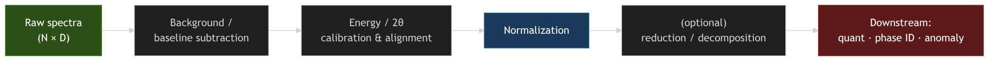
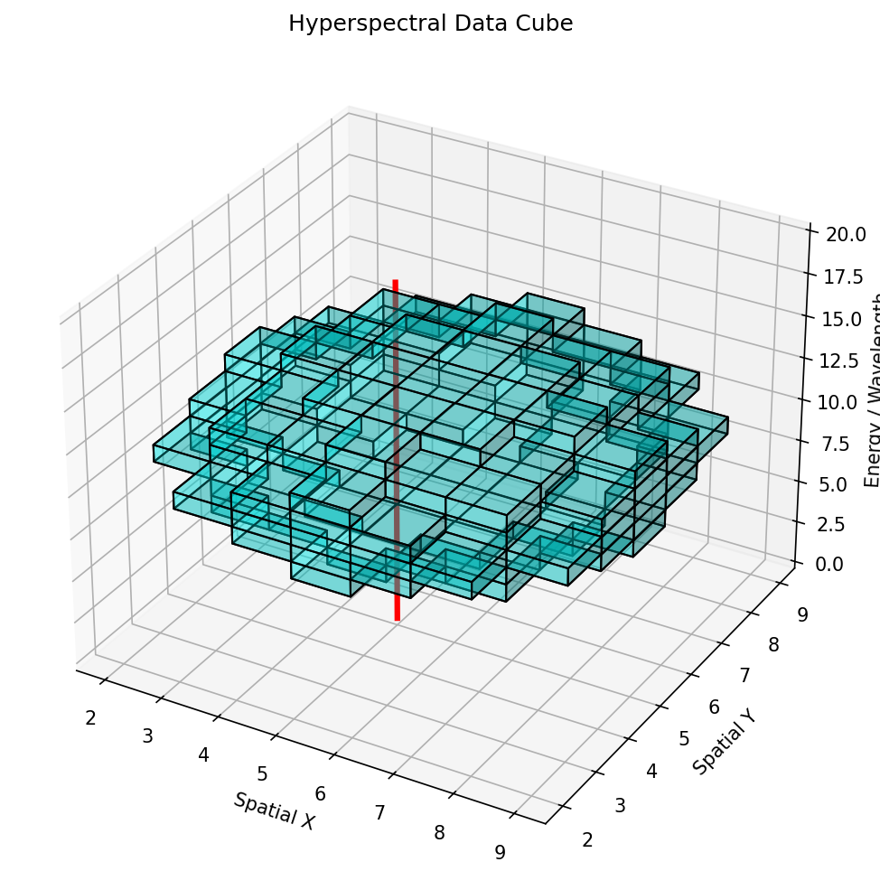

# §1 · Signals & their physics {.section}

## 01. Unit 9 — The Signal Application & Domain Unit

::: {.columns}
::: {.column width="55%"}
This unit is **not** a methods unit. The methods were derived elsewhere; here we ask **what the signal physics demands** of them.

| Method | Owned by (derived in) |
|:--|:--|
| PCA / SVD | MFML u02 · ML-PC u02 |
| Clustering, autoencoders | MFML u05 · ML-PC u05 |
| NMF | MFML u02 · ML-PC u05 |
| t-SNE / UMAP, latent spaces | MFML u09 |
| MAE / SSL (DINOv2, I-JEPA) | MFML u09 · ML-PC u09b |

::: {.callout-important .fragment}
We **reference** these methods. We do **not** re-derive them. Unit 9 is about background subtraction, calibration transfer, quantification, rotational ambiguity, operando streaming — the things the *signal physics* forces on you.
:::
:::
::: {.column width="45%"}
::: {.fragment}
**Learning outcomes.** After 90 minutes you can:

1. Explain how the *probe physics* dictates the structure of XRD / EELS / EDX / XPS / Raman signals.
2. Build a defensible **spectral preprocessing pipeline** (background → calibrate/align → normalize).
3. Apply **MCR-ALS** and reason about **rotational ambiguity**.
4. Turn a latent/peak into a **quantified concentration with an error bar** (Cliff-Lorimer / ζ-factor).
5. Deploy **EM-native deep denoisers** (conv-DAE, UDVD) and SSL-pretrained encoders for low-dose EELS/EDS, and run operando novelty detection.
:::
:::
:::

::: {.notes}
**Why this slide exists.** The old version of this unit re-derived PCA and autoencoders that the students had just seen in two parallel tracks. That is wasted lecture time and it teaches students that the same idea has two unrelated names. Open by killing that confusion explicitly: the table is the contract for the next 90 minutes.

**Say this out loud.** "If at any point today you think 'this is just PCA' or 'this is just an autoencoder' — you are right, and that is the point. The method is a black box you already own. What you do *not* own yet is the judgement about what the EELS edge, the Bragg peak, or the bremsstrahlung background does to that black box. That judgement is today."

**Materials hook.** Frame the stakes: a metallurgist does not want a latent vector, they want "this region is 4.2 ± 0.3 at.% Cr, Fe³⁺-rich, and there is an unindexed phase at the interface." Every method we reference is only a means to that sentence.

**Pre-empt the student question.** "Will the exam test PCA math?" — No, that is MFML u02 / ML-PC u02 weight. This unit's exam weight is the *pipeline reasoning*: which normalization, why a wrong background biases everything, what rotational ambiguity is, how a k-factor becomes a number with an uncertainty.

**Forward link.** Outcomes 2 and 4 are the spine of the exercise; outcome 5 gestures toward closed-loop / self-driving-microscope ideas (an outlook beyond this term's units).

**Pacing.** 3 minutes max. The table is a reference the students will photograph; do not read it line by line.
:::

## 02. Beyond Images: 1-D Signals

::: {.fragment}
- Most of the course so far: **spatial data** (micrographs, microstructure maps).
:::

::: {.fragment}
- But many instruments produce **1-D spectral signals** — intensity vs. energy / angle / wavenumber:
  - **XRD** — crystal structure via Bragg peaks
  - **EELS** — bonding and electronic structure (edges, fine structure)
  - **EDX/EDS** — elemental composition (characteristic X-ray lines)
  - **XPS** — surface chemistry and oxidation states (chemical shifts)
  - **Raman** — molecular / phonon fingerprints
:::

::: {.fragment}
- Modern instruments collect **millions of spectra per experiment** — every pixel of a STEM scan is a spectrum (spectrum imaging).
:::

::: {.callout-note .fragment}
A spectrum with $N$ channels is a vector $\mathbf{x} \in \mathbb{R}^N$. Every linear-algebra / ML tool applies directly — but each "dimension" is a *physical energy channel*, and that is what makes this unit different from generic vector ML.
:::

::: {.notes}
**Mechanism in one sentence.** A spectrum is a histogram of counts versus a physical axis; the axis carries meaning (an eV, a 2θ, a cm⁻¹), so unlike a generic feature vector you cannot permute the dimensions.

**Materials hook.** Drive home scale: a single 4D-STEM-EDS map is routinely 512×512 pixels × 2048 channels ≈ half a billion numbers. Nobody hand-fits that. This is *the* reason ML enters — not because ML is fashionable, but because the data volume crossed a line around 2015.

**Anti-pattern to flag now.** Treating the energy axis as exchangeable features (e.g., shuffling channels before PCA "to be safe"). The ordering *is* the physics; convolutional and aligned methods exploit it, channel-permuting methods throw it away.

**Forward link.** "Spectra are vectors" is the bridge to §2: every preprocessing step is a transformation of that vector chosen to make the *chemistry* (not the dose or the drift) the dominant source of variance.

**Pacing.** Light slide, ~2 minutes. Kept material from the old deck — keep it brisk.
:::

## 03. The Nature of Characterization Signals

::: {.columns}
::: {.column width="50%"}
::: {.fragment}
- **High dimensionality** — 1024–4096 channels; each spectrum a point in $\mathbb{R}^{N}$.
:::
::: {.fragment}
- **Sparse peaks** — most channels are background; the science lives in a handful of channels.
:::
::: {.fragment}
- **Continuous backgrounds** — bremsstrahlung (EDX), plasmon tails (EELS), fluorescence (Raman).
:::
:::
::: {.column width="50%"}
::: {.fragment}
- **Noise** — Poisson (shot) noise dominates at low dose; Gaussian detector/readout noise adds on top.
:::
::: {.fragment}
- **Variability** — peak *positions* shift with composition; peak *shapes* change with bonding/oxidation.
:::
::: {.fragment}
- **Low intrinsic dimensionality** — a sample with $P$ phases spans $\approx P$ + a few directions, $\ll N$.
:::
:::
:::

::: {.callout-important .fragment}
The signal-to-noise is *Poisson*: variance equals the mean. A peak with 100 counts has $\pm 10$ noise; a background of 10 000 counts has $\pm 100$. This is why dose, normalization, and background all couple — you cannot treat them independently.
:::

::: {.notes}
**Mechanism.** Counting experiments obey Poisson statistics: $\mathrm{Var}=\mathrm{mean}$. This single fact propagates through the entire unit — it is why total-count normalization changes the noise model, why background subtraction must precede variance-stabilizing transforms, and why MSE losses are technically wrong for raw counts (Poisson NLL is right).

**Materials hook / quantitative anchor.** EELS core-loss edge on a power-law plasmon tail: the edge might be 5% of the local intensity. At realistic dose the Poisson noise on the *background* can exceed the entire *signal*. That is the daily reality of valence-state mapping — not a corner case.

**War story.** A student "discovers" a new phase in PCA component 4. It is the detector's per-channel gain pattern beating against Poisson noise. Diagnostic symptom: the "phase" has no spatial coherence and its spectrum is high-frequency hash with no physical edges. Always check spatial coherence and physical plausibility before celebrating a component.

**Pre-empt the question.** "Why not just acquire longer to beat the noise?" — Beam damage and instrument time. Doubling SNR needs 4× dose (Poisson), and the specimen is often destroyed first. This is exactly why denoising/SSL matter — but see slide 20 for the trap.

**Forward link.** Low intrinsic dimensionality is *why* PCA/AE/NMF work on spectra — referenced, not re-derived. Today's consequence: the preprocessing pipeline (§2) must not inject artificial dimensions (a bad baseline adds a spurious component).

**Pacing.** ~3 minutes. The Poisson callout is exam-weight; say it twice.
:::

## 04. Signal Formation: The Physics of the Probe

The signal's **structure is dictated by the physics of the probe** — every method in §2–§4 must respect it.

::: {.columns}
::: {.column width="50%"}
::: {.fragment}
- **EELS** — ionization **edges** (sawtooth/hydrogenic) on a steep **plasmon / power-law background** ($\sim AE^{-r}$); near-edge fine structure (ELNES) encodes valence.
:::
::: {.fragment}
- **EDX** — characteristic lines (Gaussian-ish, detector-broadened) on a **bremsstrahlung continuum**; absorption + fluorescence distort intensities.
:::
::: {.fragment}
- **XRD** — **Bragg peaks** at $2\theta$ from $d$-spacings; instrumental + size/strain broadening (Caglioti, Scherrer); preferred orientation reweights intensities.
:::
:::
::: {.column width="50%"}
::: {.fragment}
- **XPS** — core-level lines whose **binding-energy shift** (chemical shift, ~0.1–3 eV) encodes oxidation state; inelastic background (Shirley/Tougaard).
:::
::: {.fragment}
- **Raman** — sharp phonon lines on a broad, sample-dependent **fluorescence background** that can dwarf the signal.
:::
::: {.callout-note .fragment}
Different physics → **different background model, different noise, different invariances**. There is no universal preprocessing. The pipeline must be chosen per modality.
:::
:::
:::

> **[FIGURE: five mini-panels, one per modality, each showing the characteristic peak/edge shape sitting on its characteristic background, annotated with the physical origin of each component]**

::: {.notes}
**Why this slide is new and essential.** The old deck jumped straight to "spectrum = vector, apply PCA," hiding the most important teaching point: the *shape* of the background and the *invariances* of the signal are physics, and they tell you which method is legal.

**Mechanism, one line each.** EELS: a core electron is ejected, cross-section gives the hydrogenic edge; background is the tail of lower-energy losses (plasmons). EDX: an inner-shell hole is filled emitting a characteristic photon; continuum is decelerated beam electrons (bremsstrahlung). XRD: constructive interference at the Bragg condition. XPS: photoemission; binding energy depends on chemical environment (the chemical shift *is* the measurement). Raman: inelastic scattering off phonons; fluorescence is a competing radiative process orders of magnitude stronger.

**Materials hook / exam trap.** A student SNV-normalizes EELS *before* removing the power-law background. SNV assumes per-spectrum mean and std are meaningful; with a steep $E^{-r}$ background dominating the integral, SNV encodes the *background slope*, not chemistry. Order matters and is dictated by the physics on this slide.

**Quantitative anchor.** XPS chemical shift: metallic Fe 2p₃/₂ ≈ 707 eV, Fe³⁺ in Fe₂O₃ ≈ 711 eV — a ~3–4 eV shift that *is* the oxidation-state signal. A 1 eV calibration drift (slide 08) throws away a quarter of the discriminating signal.

**Pre-empt the question.** "Can a foundation model just learn the background?" — In principle (slide 19), but only if the corpus spans the background variability; physical background models remain more sample-efficient and auditable. Revisited on slide 20.

**Forward link.** Every §2 slide is "given *this* physics, here is the right operation": 07 = these background models; 08 = the calibration the XPS shift demands; 09 = why each normalization assumes a particular physics.

**Pacing.** 4–5 minutes — the conceptual keystone of §1. Two sentences per modality; do not turn it into a spectroscopy lecture.
:::

## 05. Why ML — and Where Manual Fitting Breaks

::: {.fragment}
- **Manual peak fitting** is slow, subjective, non-reproducible, and does not scale.
  - 10 peaks in 1 spectrum: a Friday afternoon. 10 peaks in $10^6$ spectra: impossible.
:::

::: {.fragment}
- **Overlapping peaks** make decomposition ambiguous.
  - Fe-L and Mn-L (EELS) overlap near ~640 eV; Ti-Kα and Ba-Lα (EDX) overlap near ~4.5 keV.
:::

::: {.fragment}
- **Subtle spectral changes encode the science.**
  - The Fe-L₂,₃ white-line ratio distinguishes Fe²⁺ from Fe³⁺; a 0.3 eV onset shift = an oxidation-state change.
:::

::: {.fragment}
- **Batch effects** — calibration drift, detector aging, beam damage, contamination — break naïve models.
:::

::: {.callout-important .fragment}
**Pointer.** The *methods* that solve these — PCA/SVD (**MFML u02**, **ML-PC u02**), autoencoders / VAE / conv-AE (**MFML u05**, **ML-PC u05**), t-SNE/UMAP & latent spaces & MAE/DINOv2/I-JEPA (**MFML u09**) — were all derived there. From here we *apply* them to what the signal physics demands.
:::

::: {.notes}
**Purpose.** The hinge slide. Justify ML on materials-domain grounds (scale, overlap, subtlety, drift) and then *explicitly* hand off the method derivations so §2 onward is unambiguously application.

**Materials hook / war story.** "Monday model fails on Friday": a CNN trained on one detector session, deployed a week later, silently mispredicts because the energy axis drifted 0.4 eV and bremsstrahlung shape changed with new contamination. Diagnostic symptom: training-week hold-out fine, new sessions collapse; residual spectra show a *coherent* shift, not random error. Motivates slides 08 and 11.

**Pre-empt the question.** "If 0.3 eV shifts matter, can ML even resolve that under Poisson noise?" — Yes, with correct preprocessing and enough averaging / SSL priors; the through-line of §2 and §4. Plant the question now, pay it off later.

**Cross-reference discipline.** Read the callout verbatim — it is the contract. Whenever a student later asks "how does the autoencoder train?", point here: "MFML u05 — we do not re-derive; today we ask what the spectrum forces on it."

**Pacing.** ~3 minutes. End §1; the divider to §2 is the natural breath.
:::

# §2 · The spectral preprocessing pipeline {.section}

## 06. The Pipeline — Garbage In Dominates Everything

{width="100%" fig-align="center"}

::: {.fragment}
- Every box is a **physics-informed choice**, not a default. Order matters (slide 04).
:::

::: {.fragment}
- The reduction/decomposition box is the **referenced methods** (PCA/AE/NMF) — it is *one* box, not the unit.
:::

::: {.callout-important .fragment}
**The dominant error term in any spectral-ML result is almost never the model — it is the preprocessing.** A 2% baseline error swamps the difference between PCA and a transformer. §2 is the unit's real content because almost none of it exists in the methods units.
:::

::: {.notes}
**Purpose.** Reframe the whole unit: the methods units gave them the *reduction* box; this unit is the other five boxes, which nobody else teaches and which dominate real results.

**War story / quantitative anchor.** In real EELS quant, a 2–3% systematic error in the power-law background shifts the extracted Fe²⁺/Fe³⁺ ratio by more than the Fe²⁺/Fe³⁺ ELNES difference itself. The entire downstream ML is then fitting a background artifact. Lesson: spend effort on boxes 1–3, not on swapping PCA for a transformer.

**Anti-pattern.** "We improved phase-ID accuracy by switching to a deep model." Viva question: did you hold preprocessing fixed? Nine times in ten the gain came from a bundled preprocessing change; the model contribution is noise.

**Pre-empt the question.** "Is the reduction box ever skippable?" — Yes; for quantification (slide 15) you go straight from a clean, calibrated, background-subtracted spectrum to a physical model. Reduction is for compression/discovery/denoising, not mandatory.

**Forward link.** Next four slides walk boxes 1→3 in order: 07 background, 08 calibration/alignment, 09 normalization, 10 deconvolution, 11 cross-instrument transfer, 12 spatial-spectral.

**Pacing.** ~2 minutes; this is the map. Energy on the *callout*.
:::

## 07. Baseline / Background Subtraction

::: {.columns}
::: {.column width="50%"}
**Algorithmic (model-free)**

::: {.fragment}
- **SNIP** — Statistics-sensitive Nonlinear Iterative Peak-clipping [@ryan1988snip]: iteratively clip each channel to the min of itself and the mean of its $\pm m$ neighbours; peaks survive, the smooth continuum is estimated.
:::
::: {.fragment}
- **Asymmetric Least Squares (AsLS)** [@eilers2005baseline]: penalized smoother with asymmetric weights — points above the baseline are down-weighted. Two knobs: smoothness $\lambda$, asymmetry $p$.
:::
:::
::: {.column width="50%"}
**Physical (model-based)**

::: {.fragment}
- **EELS**: power-law $A E^{-r}$ in a pre-edge window, or a **linear combination of power laws** + **local background averaging** that pool spatial redundancy [@cueva2012eels].
- **EDX**: bremsstrahlung continuum (Kramers + detector response + absorption).
- **XPS**: Shirley / Tougaard inelastic background.
:::
::: {.callout-important .fragment}
A wrong background **biases every downstream feature** — peak areas, ratios, latent coordinates. It is a *systematic*, not random, error: averaging more spectra does **not** remove it.
:::
:::
:::

![A real Raman spectrum (black) with a strong rising fluorescence background; several baseline estimates (dotted/dashed) and the resulting baseline-corrected spectra. Background subtraction *is* the measurement here, not housekeeping [@xu2021isrea].](images/lit/raman_baseline_isrea.png){width="60%" fig-align="center"}

::: {.notes}
**Mechanism.** SNIP = morphological erosion: narrow tall peaks get clipped over iterations, the broad continuum survives; iteration count sets the maximum peak width treated as "signal." AsLS = minimize $\|y-b\|_W^2 + \lambda\|D^2 b\|^2$ with $w_i=p$ if $y_i>b_i$ else $1-p$; asymmetry lets the baseline hug the bottom of the signal.

**Quantitative recipe anchor.** AsLS for Raman: $\lambda \in [10^5,10^8]$ (more = stiffer), $p \in [0.001,0.01]$. SNIP for EDX: window $m$ ≈ FWHM of the broadest line; ~24 iterations. Day-one numbers.

**War story / diagnostic.** AsLS with $\lambda$ too small chews into broad-peak bases — symptom = negative lobes flanking strong peaks. $\lambda$ too large and a sloping fluorescence leaks through — symptom = a residual ramp that PCA/t-SNE then "discovers" as a fake component.

**Materials hook.** Raman fluorescence can be 10–100× the phonon signal and varies pixel-to-pixel with heterogeneity — *the* reason Raman mapping is hard; background subtraction is the core of the measurement, not housekeeping.

**Pre-empt the question.** "Model-free or physical?" — Physical when you trust the physics and want auditable, transferable parameters (EELS power-law for quant); model-free when no clean parametric form (Raman fluorescence). Hybrid is common.

**Cross-reference.** Systematic-vs-random ties back to slide 03 (Poisson): random → average down; background bias → identical in every spectrum, cannot. Forward to slide 14 (ambiguity) and 16 (uncertainty budget).

**Pacing.** ~5 minutes — one of the highest-value slides. Exam-weight: the systematic-vs-random distinction.
:::

## 07a. EELS Background in the STEM — LCPL & Local Background Averaging

::: {.columns}
::: {.column width="46%"}
![Core-loss edges (La-M ≈ 830 eV, Al-K ≈ 1560 eV) riding on a steep power-law background — the edge can be a few % of the local intensity [@cueva2012eels].](images/lit/cueva_powerlaw_background.png){width="100%"}
:::
::: {.column width="54%"}
::: {.fragment}
**The STEM-specific problem.** At atomic resolution and low dose, the power-law fit is *itself* dominated by Poisson noise — a noisy background becomes a **systematic** error in every extracted edge (slide 03).
:::
::: {.fragment}
- **Linear combination of power laws (LCPL).** One global $E^{-r}$ is too rigid; a small basis of power laws captures curvature a single law misses.
- **Local background averaging (LBA).** Borrow background counts from spectrally-similar neighbours — the spectrum image is *redundant*, so averaging the **background** (not the signal) cuts its error without blurring the edge.
:::
::: {.callout-important .fragment}
Exploiting dataset redundancy improves background estimation and chemical sensitivity — the basis of the **Cornell Spectrum Imager** [@cueva2012eels]. Better background craft, not a bigger model, is what lowers detection limits.
:::
:::
:::

::: {.notes}
**Why this slide exists.** Slide 07 gave the general background toolbox; this is the EELS-in-the-STEM instantiation, and the first slide to put a *real microscopy algorithm paper* on the board. Cueva, Hovden, Mundy, Xin & Muller (2012) is the reference behind the Cornell Spectrum Imager that a large fraction of the field actually uses.

**Mechanism.** A single power law $A E^{-r}$ assumes the pre-edge continuum is scale-free; real plasmon tails curve, so the extrapolated background under the edge is biased. LCPL fits a few power laws (different $r$) and lets their linear combination bend. LBA uses the fact that adjacent pixels are nearly the same spectrum: you can estimate each pixel's background from a spatial neighbourhood, raising the effective dose *on the background only*, where you do not care about spatial resolution.

**Quantitative anchor.** Cueva et al. show the edge of interest can be a few percent of the local intensity; a 2–3% background error then dominates the extracted signal — the same systematic-vs-random point as slide 07, now with the published EELS evidence.

**War story / diagnostic.** A core-loss map "shows" a composition gradient that is actually the background slope drifting across the scan. Symptom: the gradient tracks specimen thickness, not chemistry; fitting LCPL per region or LBA removes it. Same disease as the derivative-shaped PCA loading on slide 08.

**Pre-empt the question.** "Why not just denoise then fit one power law?" — Denoising (PCA/AE) can itself bias the background (slides 20/20b); LBA is a *physics-redundancy* estimator with no learned prior, so it is the safer first move and is auditable.

**Cross-reference.** Poisson/systematic: 03, 07. Redundancy → denoising tension: 12, 20. The Cornell tool also motivates the PCA-artifact caution Cueva raises (slide 20b).

**Pacing.** ~3 minutes. The figure makes the "edge on a steep background" viscerally clear — point at how little of the signal is the edge.
:::

## 08. Energy / 2θ Calibration & Spectral Alignment

::: {.fragment}
- **The problem.** The physical axis is not stable: EELS energy offset drifts (zero-loss wander), XRD $2\theta$ has zero/sample-height errors, Raman wavenumber depends on laser/grating. A 0.3 eV / 0.05° shift destroys cross-spectrum ML.
:::

::: {.columns}
::: {.column width="50%"}
::: {.fragment}
**Peak-referenced calibration.** Anchor to known features:

- EELS: zero-loss peak (0 eV), a known edge onset.
- XRD: a silicon / LaB₆ standard, known reflections.
- Raman: a Si line at 520.7 cm⁻¹.
:::
:::
::: {.column width="50%"}
::: {.fragment}
**Warping for non-rigid misalignment.**

- **DTW** — dynamic time warping: optimal monotone alignment of two spectra.
- **COW** — correlation-optimized warping [@nielsen1998cow]: piecewise stretch maximizing segment correlation; the chemometrics workhorse.
:::
:::
:::

::: {.callout-important .fragment}
Misalignment is the silent killer of **cross-instrument** ML: PCA "discovers" a component that is just the shift; a classifier learns the instrument, not the chemistry. Always align *before* reduction.
:::

::: {.notes}
**Mechanism.** Calibration = an affine (or low-order polynomial) map of the axis fixed by reference peaks. Warping = a *non-rigid* monotone reparametrization; DTW finds it by dynamic programming under monotonicity+continuity; COW restricts to piecewise-linear segments with a slack parameter, maximizing correlation — cheaper and less pathological than raw DTW.

**War story / diagnostic.** Two-instrument study: a phase classifier hits 98% on instrument A's hold-out, 61% on B. The "discriminative" PCA loading is a derivative-of-a-peak shape — the textbook signature of a rigid energy shift (a shift adds a multiple of $dx/dE$). Fix calibration, the gap collapses. Teach them to recognize the derivative-shaped loading.

**Quantitative anchor.** EELS valence needs the axis stable to ≤0.1 eV (the chemical signal is ~0.3 eV, slide 04). XRD: a 0.05° zero-error shifts a refined lattice parameter enough to misassign a phase. Tighter than students expect — say the numbers.

**Anti-pattern.** Over-warping: unconstrained DTW warps peak A onto peak B of a *different* compound and reports great alignment. Symptom: alignment "succeeds" but peak areas become physically impossible. Constrain warp flexibility; sanity-check against reference peaks.

**Pre-empt the question.** "Isn't shift augmentation enough?" — Buys robustness to small shifts but is a band-aid; cannot recover signal when test shift exceeds the augmentation range, and dilutes the model. Augmentation + explicit calibration is the robust combination (revisited slide 11).

**Cross-reference.** Same domain-shift phenomenon ML-PC u11 treats from the uncertainty side; here we fix the cause. Forward to slide 11 (full response-function mismatch).

**Pacing.** ~4 minutes. The derivative-shaped-loading diagnostic is a memorable examable nugget.
:::

## 09. Normalization Strategies — and What Each Assumes

| Strategy | Formula | Physical assumption |
|:--|:--|:--|
| **Total count / area** | $\mathbf{x}' = \mathbf{x}/\sum_j x_j$ | All variation in *total* intensity is dose/thickness, not chemistry |
| **Max-peak height** | $\mathbf{x}' = \mathbf{x}/\max_j x_j$ | A reference peak is composition-invariant |
| **SNV** | $\mathbf{x}' = (\mathbf{x}-\bar x)/s_x$ | Per-spectrum mean & std are nuisance scatter/offset (chemometrics) |
| **Reference-peak ratio** | $\mathbf{x}/x_{\text{ref}}$ | An internal-standard line is constant (e.g. matrix element) |

::: {.fragment}
- Normalization is **not cosmetic**: without it PCA/AE learn *dose and thickness*, not chemistry (variance is dominated by the largest, least interesting effect).
:::

::: {.callout-important .fragment}
Every normalization **changes the noise model**. Total-count normalization correlates channels and breaks the clean Poisson assumption — do it *after* any variance-stabilizing / Poisson-aware step, not before.
:::

::: {.notes}
**Mechanism / the trap.** Each row is an *assumption* false in some regime. Max-peak assumes the reference peak is composition-invariant — but in EDX the biggest peak is often the matrix line, which *does* change with composition, so you normalize away signal. SNV assumes per-spectrum mean/std are nuisance — true for diffuse-reflectance NIR (its origin), often false for sparse-peak EELS where the mean is background-dominated.

**Why it's not cosmetic (core point).** PCA/AE maximize variance. The largest variance in raw spectra is overall intensity (dose × thickness), scientifically boring. Skip normalization and PC1 is "thickness," chemistry is buried in PC5+ under noise. Normalization makes the *interesting* variance dominant so referenced methods point at chemistry.

**War story.** A student's beautiful UMAP "phase map" was a thickness map — wedge-polished foil. Diagnostic: clusters formed a smooth gradient correlating 0.95 with sample position, not composition. Total-count normalization collapsed the gradient, revealing the actual two phases.

**Quantitative recipe.** EDX/EELS SI: total-count (or post-background characteristic-counts) is the safe default. Raman/XPS: area or reference-line. SNV: for vibrational reflectance; be suspicious elsewhere.

**Pre-empt the question.** "Which should I always use?" — None always; the third column is the answer. Exam-weight: given modality + question, justify normalization from physics.

**Cross-reference.** Noise-model callout ties to slide 03 (Poisson) and slide 19 (Poisson NLL must see counts).

**Pacing.** ~3 minutes. Kept-and-tightened; the callout is the new examable part.
:::

## 10. Peak Deconvolution & Physically-Constrained Fitting

::: {.columns}
::: {.column width="55%"}
::: {.fragment}
- Real peaks have **physical line shapes**: **Gaussian** (instrumental/Doppler) ⊗ **Lorentzian** (lifetime) = **Voigt** / pseudo-Voigt; EELS edges have hydrogenic/ELNES shape.
:::
::: {.fragment}
- **Overlap separation** = constrained non-linear least squares: shared widths, fixed multiplet ratios, non-negative amplitudes, positions from physics.
:::
::: {.fragment}
- **Differentiable forward models** $f_\theta(\text{physics}) \to$ spectrum: fit by gradient descent, drop into autograd → the bridge to **physics-informed** fitting and to slide 27 (inverse problems).
:::
:::
::: {.column width="45%"}
::: {.callout-note .fragment}
**Applied callout — DAE-assisted EELS.** At low dose the Fe-L₂,₃ fine structure separating Fe²⁺/Fe³⁺ is buried in Poisson noise. A denoising autoencoder *trained on simulated Fe-L edges* (the **method** is ML-PC u05 §D) is used here purely as a **preprocessing denoiser feeding the constrained fit** — not as the analysis. Result: clean white-line ratios at ~10× lower dose. The AE is a tool inside box 1–4, not the deliverable.
:::
:::
:::

> **[FIGURE: two overlapping EELS L₃/L₂ white lines, raw noisy data, the constrained Voigt-multiplet fit with shared width and fixed branching ratio, and residuals]**

::: {.notes}
**Mechanism.** A Voigt is Lorentzian (natural lifetime, physical) ⊗ Gaussian (instrument + thermal). Pseudo-Voigt is a cheap linear-combination approximation (true Voigt has no closed form). Constrained NLLS = Levenberg-Marquardt / trust-region with constraints encoding physics (L₃:L₂ branching, fixed spin-orbit splitting, amplitudes ≥ 0).

**Why constraints are the whole game.** Unconstrained, two overlapping peaks are *non-identifiable* — infinitely many (position, width, amplitude) triples fit within noise. Physics constraints collapse that to a unique answer. Same identifiability theme as *rotational ambiguity* in MCR-ALS (slide 14) — flag the parallel.

**Differentiable forward model — the modern point.** If $f_\theta$ (peak model, or a FEFF/Rietveld surrogate) is differentiable, fitting is gradient descent and chains with neural components — the seed for physics-informed ML and the inverse problems of slide 27.

**Materials hook / war story.** Folded-in old slide 22: low-dose Fe valence mapping. Anti-pattern: using the *autoencoder's latent value itself* as "the oxidation state." It is not — it is an uncalibrated coordinate. Defensible pipeline: AE denoises, constrained physical fit extracts the white-line ratio, slide 15 turns it into a number. Diagnostic symptom of the anti-pattern: latent "oxidation state" changes when you retrain with a different seed.

**Pre-empt the question.** "Why not end-to-end concentration?" — You can, but uncertainty and audit trail vanish; a constrained fit gives parameters a referee can check. ML for the hard representation step, physics for the accountable readout.

**Cross-reference.** Denoising method = ML-PC u05 §D (do not re-derive). Differentiable model = forward link to slide 27 and ML-PC u08.

**Pacing.** ~5 minutes. "Constraints resolve non-identifiability" is the spine connecting this slide to 14.
:::

## 11. Calibration Transfer Between Instruments

::: {.fragment}
- **Industrial reality.** A model trained on instrument A *fails* on B: different detector response, resolution, geometry — even after axis calibration. Re-labelling per instrument is unaffordable.
:::

::: {.columns}
::: {.column width="50%"}
::: {.fragment}
**Piecewise Direct Standardization (PDS)** [@wang1991pds]

- Measure a few **transfer standards** on both A and B.
- Learn a banded linear map $\mathbf{X}_B \approx \mathbf{X}_A \mathbf{P}$ (each B-channel from a local window of A-channels).
- Apply $\mathbf{P}^{-1}$ to bring B into A's space → reuse A's model.
:::
:::
::: {.column width="50%"}
::: {.fragment}
**Simpler & more general**

- **Slope/bias correction** — affine fix when only gain+offset differ.
- **Domain adaptation** — align *feature distributions* A↔B (the DA *idea* is **MFML u09**; reference, do not re-derive).
:::
:::
:::

::: {.callout-important .fragment}
PDS needs only a handful of standards measured on both instruments — orders of magnitude cheaper than re-labelling. The difference between a model that ships to one lab and one that ships to a fleet.
:::

::: {.notes}
**Mechanism.** PDS: for each target channel $j$, regress it on a *window* of source channels $[j-w,j+w]$ using paired standards (PLS/ridge per window), assembling a banded $\mathbf{P}$. The band encodes "B's channel $j$ is a local blur/shift/rescale of A's neighbourhood" — the response-function mismatch a scalar calibration (slide 08) cannot fix.

**Why slide 08 is not enough.** Slide 08 fixes the *axis* (where peaks sit). PDS fixes the *response* (width/height, detector tails). Both can be wrong; align first, then standardize.

**War story / anchor.** NIR chemometrics (PDS's birthplace) transfers a calibration with 15–30 transfer samples instead of re-measuring a 1000-sample set per spectrometer. Same logic now in multi-microscope EDX/EELS facilities: a shared standard (NIST glass, known oxide) measured on each tool is the transfer set.

**Anti-pattern / diagnostic.** Shipping with no transfer plan, then retraining from scratch per instrument — multiplies labelling cost by instrument count, yields $N$ silently divergent models. Symptom: same specimen, different quant on two tools, nobody can say which is right.

**Pre-empt the question.** "DA or PDS?" — PDS when you can measure paired standards (best, auditable, few samples). DA when you cannot pair (only unlabelled target). State which and why — exam-weight.

**Cross-reference.** DA idea: MFML u09. Uncertainty consequence of unhandled transfer: ML-PC u11. Expands the old "robustness to instrumental shifts" slide into a named, cheap procedure. Forward: §5 case studies only work because the model is portable.

**Pacing.** ~4 minutes.
:::

## 12. Spatial-Spectral Models for Spectrum Images

::: {.fragment}
- A spectrum image is a **cube** $(x, y, E)$ — STEM-EDS easily $256{\times}256{\times}2048$, STEM-EELS $100{\times}100{\times}1024$.
:::

::: {.fragment}
- **Naïve**: unfold to $N_\text{pix}\times D$, treat each pixel independently. Throws away that **neighbouring pixels are almost the same spectrum**.
:::

::: {.fragment}
- **Better**: exploit spatial correlation — factored **2-D spatial + 1-D spectral** convolutions, or a 3-D conv-AE.  
:::

::: {.fragment}
- **Benefit**: implicit spatial averaging denoises *for free*; spatial context separates interface pixels from bulk; learns core-shell / gradient structure.
:::

::: {.callout-important .fragment}
**Trade-off.** Spatial smoothing blurs sharp interfaces and can *invent* mixed spectra at boundaries — choose the receptive field to match the smallest real feature, not the noise.
:::

{width="46%" fig-align="center"}

::: {.notes}
**Mechanism.** Factored conv: depthwise 2-D conv over (x,y) per energy band + 1-D conv over E — far fewer parameters than full 3-D conv, with the right inductive bias (spatial smoothness AND spectral locality) separated. The denoising is bias-variance: borrowing counts from spatially adjacent, chemically-identical pixels raises effective dose without raising actual dose.

**Materials hook / war story.** Interface-blur failure: a 5×5 spatial receptive field on 2 nm pixels averages a 10 nm window — wider than the grain-boundary segregation layer you want to image. Symptom: the segregation "disappears" and reviewers think the sample is clean. The model did not lie; the receptive field was wrong for the science.

**Anti-pattern.** Cranking smoothing until the phase map looks "clean" for the figure. Clean is not the objective; *correct at the relevant length scale* is. Honest move: show the receptive field next to the smallest feature claimed.

**Pre-empt the question.** "Why not just bin pixels?" — Binning is uniform non-adaptive smoothing; a learned model can preserve edges where data demand (non-linear). Same fundamental risk if the receptive field is too large — no free lunch, only a better-shaped one.

**Cross-reference.** Conv-AE / 3-D conv: MFML u05, ML-PC u05. The denoising-vs-discovery tension here is paid off on slide 20 (rare-phase erasure).

**Pacing.** ~3 minutes. End §2; last preprocessing/representation box before decomposition.
:::

# §3 · Decomposition & quantification {.section}

## 13. Reference Recap — Spectral Decomposition (one slide)
 

| Decomposition | Factorization | Spectral interpretation |
|:--|:--|:--|
| **PCA / SVD** | $\mathbf{X}\approx \bar{\mathbf{x}} + \mathbf{C}\mathbf{V}^\top$, $\mathbf{V}$ orthonormal | Eigenspectra = orthogonal *variation* directions (can be negative — **not** physical phases) |
| **NMF** | $\mathbf{X}\approx \mathbf{W}\mathbf{H}$, $\mathbf{W},\mathbf{H}\ge 0$ | $\mathbf{H}$ = end-member spectra (≈ pure phases), $\mathbf{W}$ = abundance maps |
| **AE / conv-AE** | $\mathbf{x}\!\to\!\mathbf{z}\!\to\!\hat{\mathbf{x}}$ | Non-linear latent; handles peak *shift*, not just mixing |

::: {.fragment}
- The **only** thing this unit adds: the *spectral reading* — non-negativity is physical because **photon counts and concentrations cannot be negative**; orthogonality is a math convenience with **no physical mandate**.
:::

::: {.fragment}
![A spectrum image factorizes as $\mathbf{D}=\mathbf{T}\,\mathbf{p}^{\top}$ (pixels × energy channels → scores × component loadings, ranked by variance) [@potapov2019pca]. EM-native instantiations: PCA of EELS SI [@bosman2006eels]; MCR of EDS SI [@kotula2006mcr].](images/lit/potapov_pca_factorization.png){width="44%" fig-align="center"}
:::

::: {.notes}
**Purpose.** One slide, on purpose: the explicit "we are not re-teaching factorization" slide. Spend time on the *interpretation column*, the only domain content.

**Teaching point.** Why NMF is "the natural choice for spectra" in one breath: a spectrum is non-negative counts; a mixture of phases is a non-negative combination of non-negative pure spectra; PCA's orthogonality forces negative lobes with no physical referent (you cannot have −3 counts at 700 eV). NMF's constraint *is* the physics — one sentence, not a section.

**Pre-empt the question.** "Then why ever use PCA?" — Speed, uniqueness, denoising, and as initialization/whitening for everything (including NMF and MCR-ALS init). The fast first look; just not the physical model. (Salvaged content of the old PCA/AE/NMF slides, compressed to one row each.)

**Cross-reference discipline.** If asked for multiplicative-update NMF or the SVD proof: "MFML u02 — open your notes; today the question is what $\mathbf{H}$ *means*." Hold the line.

**Forward link.** Sets up slide 14: NMF gives *a* non-negative factorization, not a unique one — that non-uniqueness (rotational ambiguity) and how constraints fix it is the genuinely new content.

**Pacing.** ~3 minutes, table-driven. Resist deriving.
:::

## 13a. PCA of EELS Spectrum Images — Composition (Bosman et al. 2006)

::: {.columns}
::: {.column width="44%"}
![Low-loss EELS: reference Ti-oxide spectra (TiO → TiO₂ anatase) above, and the PCA-resolved Area A/B/C spectra of a single spectrum image below; Ca-M and Ti-M edges track phase and oxidation state [@bosman2006eels].](images/lit/bosman_ti_reference_spectra.png){width="100%"}
:::
::: {.column width="56%"}
::: {.fragment}
**The seminal EM result.** PCA of an EEL spectrum image extracts *chemically relevant* components — score maps localize phases, loadings are interpretable spectra [@bosman2006eels].
:::
::: {.fragment}
- Only a handful of phases → a few components carry the chemistry; the rest is noise (low intrinsic dimensionality, slide 03).
- Matching resolved area spectra to **reference oxides** assigns Ti valence (TiO, Ti₂O₃, Ti₄O₇, Ti₅O₉, TiO₂).
:::
::: {.callout-note .fragment}
This is slide 13's PCA row **in the STEM**: the method is MFML u02; the *reading of the loadings as chemistry* is the materials content.
:::
:::
:::

::: {.notes}
**Purpose.** Put the founding EELS-multivariate-statistics paper on the board (Bosman, Watanabe, Alexander & Keast 2006). It is the concrete answer to "what does slide 13's PCA row look like on real EELS?"

**Mechanism.** Stack the spectrum image as pixels × energy channels, mean-centre, SVD. The leading right-singular vectors (loadings) are the recurring spectral shapes; the scores map where each occurs. Because a real specimen has few phases, the chemistry lives in the first few components and everything above is noise — that is *why* truncation denoises (and why it can erase the rare, slide 20).

**Materials hook.** The Magnéli-phase Ti oxides (TiO, Ti₂O₃, Ti₄O₇, Ti₅O₉, TiO₂) form a valence ladder; the low-loss and Ti-M edges shift systematically, so the PCA loadings map directly onto an oxidation-state assignment when compared against the reference library shown.

**War story / diagnostic.** A component that is high-frequency hash with no spatial coherence is detector/noise structure, not a phase (slide 03). Always view the *score map* and the *loading spectrum* together before believing a component.

**Pre-empt the question.** "Is PCA the final answer for phases?" — No: PCA components are orthogonal, so they mix and go negative (slide 13). For *physical* end-members you move to NMF/MCR (slide 14/14a). PCA is the fast, denoising first look.

**Cross-reference.** Method: MFML u02 / ML-PC u02. Non-negativity for physical phases: 13, 14. Weighting/denoising caveats: 13b, 20a, 20b.

**Pacing.** ~3 minutes. Let the reference-ladder figure carry the "loadings = chemistry" point.
:::

## 13b. Weighted PCA Recovers ELNES Bonding (Bosman et al. 2006)

::: {.columns}
::: {.column width="46%"}
![A noisy core-loss edge (top) and its PCA reconstruction (bottom): the π* (~285 eV) and σ* (~292 eV) near-edge features survive — bonding, not just composition [@bosman2006eels].](images/lit/bosman_elnes_denoised.png){width="100%"}
:::
::: {.column width="54%"}
::: {.fragment}
**Composition *and* bonding.** With **weighted / two-way-scaled PCA**, the same decomposition recovers near-edge fine structure (ELNES) — bonding and orientation, not only which elements are present [@bosman2006eels].
:::
::: {.fragment}
- **Why weight.** Plain PCA weights channels by variance — under Poisson noise that means by *intensity*, so the background dominates. Scaling by the noise (variance-stabilizing) lets PCA see the weak edge.
:::
::: {.callout-important .fragment}
Get the weighting wrong and PCA "denoises" the bonding signal away. Weighting is not a detail — it decides whether the chemistry survives (slide 20a).
:::
:::
:::

::: {.notes}
**Purpose.** The second half of Bosman 2006's claim, and the bridge to the "do PCA denoising right" pair (20a/20b). ELNES is the subtle-but-decisive signal (slide 04); showing it survives a *correctly weighted* PCA — and dies under a naive one — is the teaching point.

**Mechanism.** Poisson noise has variance = mean, so high-count channels carry more *absolute* variance and dominate an unweighted SVD even though they are scientifically dull (background, big plasmon). Two-way scaling (Keenan–Kotula weighting) divides each entry by an estimate of its noise standard deviation, equalizing the statistical weight so the decomposition optimizes for *signal*, not for counts.

**Materials hook.** The π*/σ* split at the C-K / B-K edge encodes sp²-vs-sp³ bonding and, with a tilt series, orientation. That is electronic-structure information from a 1-D spectrum — the reason EELS is more than an elemental tool.

**War story.** Unweighted PCA on a low-dose core-loss map returns gorgeous "phase" components that are really the plasmon background beating against noise; the ELNES the experiment was *for* lands in component 11, below the noise floor, and gets truncated. Symptom: denoised map looks clean, valence/bonding contrast is gone.

**Pre-empt the question.** "Isn't weighting just a preprocessing knob?" — It changes which subspace is 'top-K', i.e. what survives truncation. It is the difference between measuring bonding and measuring the background. Carried forward quantitatively on slide 20a (Potapov optimal truncation).

**Cross-reference.** Poisson: 03. Normalization changes the noise model: 09. Optimal weighting/truncation: 20a. PCA bias if done naively: 20b.

**Pacing.** ~3 minutes.
:::

## 14. MCR-ALS & Rotational Ambiguity

::: {.columns}
::: {.column width="52%"}
::: {.fragment}
**MCR-ALS** — Multivariate Curve Resolution by Alternating Least Squares [@dejuan2014mcr]: solve $\mathbf{X}=\mathbf{C}\mathbf{S}^\top+\mathbf{E}$ by alternating non-negative least squares for concentrations $\mathbf{C}$ and spectra $\mathbf{S}$. In the STEM it unmixes raw EDS/EELS spectrum images into pure-component spectra + abundance maps [@kotula2006mcr] (slide 14a).
:::
::: {.fragment}
**Rotational ambiguity.** For any invertible $\mathbf{T}$:
$$\mathbf{X} = (\mathbf{C}\mathbf{T})(\mathbf{T}^{-1}\mathbf{S}^\top)$$
fits **equally well**. Non-negativity alone leaves a *feasible band* of solutions, not a unique answer.
:::
:::
::: {.column width="48%"}
::: {.fragment}
**Constraints collapse the band:**

- **Closure** — abundances sum to 1 (mass balance).
- **Unimodality** — a concentration profile has one maximum.
- **Known spectra** — fix a reference end-member.
- **Selectivity / local rank** — zones where only one component exists.
:::
::: {.callout-important .fragment}
Genuinely **not** in the methods units. NMF is taught there; **MCR-ALS + rotational ambiguity + how physical constraints resolve it** is the new content.
:::
:::
:::

> **[FIGURE: feasible band of resolved spectra under non-negativity only (a fan of curves) collapsing to a single curve as closure + unimodality + a known end-member are added]**

::: {.notes}
**Why this is the intellectual heart of §3.** Students leave the methods units thinking "NMF gives the pure phases." It does not — it gives one member of a *continuum* of equally-good factorizations (rotational/intensity ambiguity). The craft of curve resolution is choosing physically-motivated constraints to shrink that continuum to a unique defensible answer. Same *identifiability* idea as slide 10, now at dataset level — say it out loud.

**Mechanism.** ALS: fix $\mathbf{S}$, solve non-negative LS for $\mathbf{C}$; fix $\mathbf{C}$, solve for $\mathbf{S}$; iterate. The $\mathbf{T}/\mathbf{T}^{-1}$ argument is the key board derivation: write it, then note non-negativity restricts $\mathbf{T}$ but does not pin it — hence a "feasible band."

**Materials hook.** EELS/EDX of a diffusion couple or battery cathode: MCR-ALS resolves pure phase spectra and abundance maps directly, *with* abundances non-negative and summing to one (closure = a real material, fractions must add up). Unimodality is natural for a diffusion profile.

**War story / diagnostic.** Two groups publish "the pure phase spectrum" of the same sample and they differ — both valid points in the feasible band, neither reported their constraints. Symptom of unresolved ambiguity: resolved spectra change qualitatively when you re-run from a different initial guess. The fix is more physics in the constraints, not a better optimizer.

**Pre-empt the question.** "Just NMF with extra steps?" — NMF *is* a special case (non-negativity only). MCR-ALS adds the *other* physical constraints (closure, unimodality, selectivity, known spectra) that make the solution unique. The constraints are the science.

**Cross-reference.** Non-negativity result: slide 13 / MFML u02. Identifiability parallel: slide 10. Uncertainty on resolved profiles: forward to slide 16.

**Pacing.** ~5 minutes. Exam-weight: state rotational ambiguity and name two constraints that resolve it.
:::

## 14a. MCR in the STEM — Unmixing EDS Spectrum Images (Kotula & Keenan 2006)

::: {.columns}
::: {.column width="40%"}
![MCR of a STEM-EDS spectral image of a microelectronics interface: pure-component X-ray spectra (O, Si, Ti, Pt/Ga, Al) and their abundance maps, extracted directly from the raw datacube [@kotula2006mcr].](images/lit/kotula_mcr_eds.png){width="100%"}
:::
::: {.column width="60%"}
::: {.fragment}
**The EDS instantiation of slide 14.** MCR applied to a raw STEM-EDS spectrum image returns a *high-contrast* set of component spectra + maps — no element-by-element windowing [@kotula2006mcr].
:::
::: {.fragment}
- Each component is a **non-negative** spectrum (a phase) with a **non-negative** abundance map — the constraints *are* the physics (slide 13).
- Resolves overlapping lines (e.g. the Ga/Pt FIB artifact) into their own component instead of contaminating the chemistry.
:::
::: {.callout-important .fragment}
Sandia's MSA-for-EM line of work is *why* MCR/PCA are the production default in EDS labs — decades before deep learning. Reach for a network only when these break (slide 24).
:::
:::
:::

::: {.notes}
**Purpose.** The canonical EDS multivariate-statistics paper (Kotula & Keenan 2006, Sandia). Pairs with slide 13's NMF/MCR row and slide 14's MCR-ALS theory: here is the published STEM-EDS result the theory describes.

**Mechanism.** MCR factorizes the unfolded datacube $\mathbf{X}\approx\mathbf{C}\mathbf{S}^\top$ under non-negativity (and often a noise weighting); each column of $\mathbf{S}$ is a physical X-ray spectrum, each column of $\mathbf{C}$ its spatial abundance. Unlike per-window elemental mapping, it separates *overlapping* lines and bremsstrahlung into distinct components.

**Materials hook.** Interfacial analysis in microelectronics (the paper's case): thin diffusion barriers and silicide layers a few nm wide are resolved as their own components, with the FIB-implanted Ga and the Pt protective cap cleanly separated — exactly the overlaps that defeat naive Kα windowing.

**War story / diagnostic.** Treat a Ga or Cu component as a "phase" and you will report a contaminant as chemistry; MCR isolating it into its own map is the *feature*, not a bug — read every component, including the boring ones. Rotational ambiguity (slide 14) still applies: rerun from different initializations and check the spectra are stable.

**Pre-empt the question.** "Deep unmixing instead?" — Verified EDS deep-unmixing method papers are still thin; MCR/optimal-PCA remain the audited workhorses (slides 20a, 24). Use a learned non-linear decoder only when absorption/multiple-scattering break linearity (slide 17).

**Cross-reference.** Theory: 14. Non-negativity: 13. Optimal PCA denoising for EDS: 20a. Throughput case: 24.

**Pacing.** ~3 minutes.
:::

## 14b. Unmixing as Geometry — Endmembers & the Mixing Simplex (Dobigeon & Brun 2012)

::: {.columns}
::: {.column width="46%"}
![Linear mixing places every pixel inside a simplex whose vertices $\mathbf{m}_1,\mathbf{m}_2,\mathbf{m}_3$ are the pure end-member spectra; unmixing = finding the vertices + each pixel's barycentric abundances [@dobigeon2012unmixing].](images/lit/dobigeon_simplex.png){width="100%"}
:::
::: {.column width="54%"}
::: {.fragment}
**A geometric view of slide 14.** Under linear mixing each spectrum is a convex combination of end-members → the data fill a **simplex**; its vertices are the pure phases.
:::
::: {.fragment}
- **Closure** (abundances sum to 1) is the simplex constraint; **non-negativity** keeps pixels inside it.
- This is the same geometry as the **Gibbs triangle** the autoencoder rediscovers on slide 21 — and the linear model slide 17 stress-tests.
:::
::: {.callout-note .fragment}
The endmember/abundance picture borrowed from **hyperspectral remote sensing** — spectroscopy's cousin discipline. Same math, different photons.
:::
:::
:::

::: {.notes}
**Purpose.** Give MCR/unmixing a single picture students remember: the simplex. It unifies slide 14 (rotational ambiguity = which simplex), slide 17 (when linear mixing breaks), and slide 21 (the Gibbs-triangle latent).

**Mechanism.** With $\mathbf{x}=\sum_k a_k \mathbf{m}_k$, $a_k\ge0$, $\sum a_k=1$, the reachable spectra are the convex hull of the end-members — a simplex with $K$ vertices. Estimating the vertices is geometric end-member extraction; the abundances are barycentric coordinates. Rotational ambiguity (slide 14) is exactly the freedom to choose a *larger* enclosing simplex — constraints shrink it.

**Why Bayesian linear unmixing.** Dobigeon & Brun (2012) note PCA/ICA do poorly when material abundances are statistically *dependent* (common in real maps); a Bayesian model with the simplex priors estimates end-members and abundances jointly with uncertainty — see slide 17a for the EELS result.

**Materials hook.** A diffusion couple or a core–shell nanoparticle: interior pixels are pure (vertices), interface pixels are genuine mixtures (interior points). The simplex makes "this pixel is 30% phase A" a coordinate, not a hand-wave.

**Pre-empt the question.** "Is the simplex always right?" — Only if mixing is linear. Multiple scattering / absorption curve the data off the flat simplex (slide 17) — then you correct the physics or use a non-linear decoder.

**Cross-reference.** Ambiguity: 14. Linear-mixing breakdown: 17. Bayesian unmixing result: 17a. Gibbs-triangle latent: 21.

**Pacing.** ~3 minutes. Draw the triangle; mark a vertex (pure) and an interior point (interface mixture).
:::

## 15. Quantification — From Spectra to Concentrations

::: {.fragment}
- A latent coordinate or a peak area is **not** a number a metallurgist trusts. Quantification produces *at.%* with a physical basis.
:::

::: {.columns}
::: {.column width="50%"}
::: {.fragment}
**Cliff-Lorimer** (EDX, thin film) [@cliff1975quantitative]
$$\frac{C_A}{C_B} = k_{AB}\,\frac{I_A}{I_B}$$
Ratio of background-subtracted line intensities × a known **$k$-factor**. Needs the thin-film approximation (no absorption).
:::
:::
::: {.column width="50%"}
::: {.fragment}
**ζ-factor method** [@watanabe2006zeta]
$$C_A = \zeta_A \frac{I_A}{\rho t}\cdot(\dots)$$
Absolute quantification from first principles; folds in **mass-thickness**, handles **absorption** self-consistently — the modern standard.
:::
:::
:::

::: {.callout-important .fragment}
ML can predict $I_A$ robustly (denoising, deconvolution); the **$k$/ζ-factor step is physics**. Skipping it and regressing concentration end-to-end discards the physical audit trail a lab/certifier requires.
:::

::: {.notes}
**Mechanism.** Cliff-Lorimer: in a thin specimen, generated X-ray intensity ∝ concentration; the proportionality constants cancel into one ratio factor $k_{AB}$ (element pair, beam energy, detector). ζ-factor: keeps the absolute proportionality (ζ relates counts to mass-thickness), so no reference element needed and an absorption correction is built in iteratively with estimated thickness — why it is the modern standard for light elements / thicker foils where Cliff-Lorimer's no-absorption assumption fails.

**Why this must exist in an ML unit.** End-to-end-trained students want to regress composition directly. The domain answer: a referee, an ISO certification, or a failure investigation needs to see *which physical model and which factor* produced the number. A black box saying "4.2% Cr" with no traceable physics is not a deliverable in a certified lab. ML's job is clean unbiased $I_A$ (slides 07–10); physics turns $I_A$ into $C_A$.

**Quantitative anchor.** Cliff-Lorimer breaks exactly where it matters: light elements (O, N, C) and thicker regions, absorption biasing results 10–30%. Precisely why Watanabe-Williams ζ exists; quote the failure regime, not just the formula.

**War story / anti-pattern.** "Our network predicts at.% directly and beats Cliff-Lorimer on the test set." On *whose* labels? Usually labels were themselves Cliff-Lorimer outputs — the network mimics the method it claims to beat, plus its biases, with no error model. Diagnostic: ask for absolute-accuracy validation against a certified reference material, not other software.

**Pre-empt the question.** "Is ML useless for quant?" — No: best tool for *intensity extraction* under overlap/noise (07, 10) and for *uncertainty propagation* (next slide). Wrong tool for replacing the traceable physical conversion.

**Cross-reference.** Intensity extraction = 07/10. Uncertainty on $C_A$ = slide 16 + ML-PC u11.

**Pacing.** ~4 minutes. Exam-weight: why the k/ζ step is not replaceable by end-to-end regression.
:::

## 16. Uncertainty on the Quantification

::: {.fragment}
- A concentration without an error bar **is not a deliverable** (recall the ML-PC u11 thesis: a threshold decision needs a distribution, not a number).
:::

::: {.fragment}
- **Error budget for $C_A$:** counting statistics on $I_A$ (Poisson) · background-model error (systematic, slide 07) · $k$/ζ-factor uncertainty · absorption/thickness uncertainty · ML denoiser bias.
:::

::: {.fragment}
- **Propagation.** Analytic error propagation through the Cliff-Lorimer / ζ equation for the physical terms; **the UQ machinery for the ML-predicted parts is ML-PC u11** (GP CIs, deep ensembles, MC-dropout) — referenced, not re-derived.
:::

::: {.callout-important .fragment}
The often-dominant term is **not** counting statistics — it is the **background-model systematic** (slide 07). Reporting only $\sqrt{N}$ Poisson error bars is the most common honest-looking lie in the field.
:::

::: {.notes}
**Purpose.** Close the quantification arc honestly. The deliverable is $C_A \pm \sigma_{C_A}$ with a *decomposed* error budget, not a bare number with a cosmetic Poisson bar.

**Mechanism.** Error propagation on $C_A/C_B = k\,I_A/I_B$: relative variances add — $(\sigma_C/C)^2 \approx (\sigma_k/k)^2 + (\sigma_{I_A}/I_A)^2 + (\sigma_{I_B}/I_B)^2 + \dots$. Each term has a different *character*: counting is random (shrinks with dose), background and k-factor are systematic (do not shrink — connect to 03/07). The ML denoiser contributes a *bias* invisible to internal cross-validation; assess against a reference.

**The honest-looking lie (say it slowly).** Most published spectral quant reports $\pm\sqrt{N}$ bars. That term is frequently the *smallest*. A 2% background systematic on a peak with 1% Poisson error means the real uncertainty is dominated by a term they did not report. The single most important integrity message of §3 — it ties slide 07 (background bias is systematic) to slide 15 (quant) to ML-PC u11 (calibrated uncertainty is the actual deliverable).

**Materials hook / anchor.** Light-element EDX (oxygen in an oxide): k-factor uncertainty alone routinely 5–15%; absorption-correction uncertainty similar in thick regions. Counting error might be 1%. Reporting 1% is off by an order of magnitude — a referee should reject it.

**Pre-empt the question.** "How do I get the ML part's uncertainty?" — Do not invent it here; it is ML-PC u11's content (GP closed-form CI, deep-ensemble disagreement, MC-dropout per-pixel variance). This slide says *which terms exist and which dominates*, and hands ML-UQ to u11.

**Cross-reference.** Background systematic: 07. Quant equations: 15. UQ methods: ML-PC u11. MCR-ALS feasible-band width (14) is itself an uncertainty contribution for decomposition-based quant — mention if time.

**Pacing.** ~3 minutes. High exam-weight and integrity-weight; do not rush the "dominant term" callout.
:::

## 17. Non-Linear Unmixing — When Linear Mixing Fails

::: {.fragment}
- The comfortable model: a boundary pixel is $\mathbf{x} = \alpha\,\mathbf{e}_A + (1-\alpha)\,\mathbf{e}_B + \boldsymbol{\eta}$ — *linear* mixing; estimate $\alpha$ from a latent coordinate or Bayesian linear unmixing [@dobigeon2012unmixing] (slide 17a). Often fine.
:::

::: {.fragment}
- **When linear mixing breaks:**
  - **EELS multiple scattering** — thick specimen: losses convolve, not add.
  - **EDX absorption / fluorescence** — emitted X-rays re-absorbed depth-dependently.
  - **XRD channelling / extinction**, preferred orientation — intensities not additive in phase fraction.
:::

::: {.fragment}
- **What to do:** physical forward model (deconvolve plural scattering; absorption correction) → *then* unmix; or a **non-linear decoder** (AE — *method* in ML-PC u05) whose non-linearity absorbs the curvature. Validate against a known mixture.
:::

::: {.callout-important .fragment}
A non-linear method *fitting* a non-linear mixture does **not** prove it recovered the physics. Always check against a sample of known fractional composition.
:::

::: {.notes}
**Mechanism.** Linear unmixing assumes intensities superpose. They do not when the measurement is non-linear in path: EELS, a thicker region means multiple energy losses, so the spectrum is the Poisson-weighted self-convolution series of the single-scattering distribution — not $\alpha\mathbf{e}_A+(1-\alpha)\mathbf{e}_B$. EDX, generated photons re-absorbed depth-/matrix-dependently — same reason ζ beats Cliff-Lorimer (slide 15). Tie it back.

**Materials hook.** Sub-pixel composition at an interface where the probe straddles two phases: linear unmixing gives a clean $\alpha$ only if thin and absorption-negligible. In a real 80 nm foil it is biased, and the bias looks like a *shifted phase boundary* — a metallurgically meaningful error from a modelling shortcut.

**War story / the punchline anti-pattern.** An AE reconstructs mixed spectra beautifully and someone reads $\alpha$ off the latent axis. Low reconstruction error proves the decoder can *represent* the data; it says nothing about whether the latent equals the physical phase fraction. Diagnostic: a known 30/70 specimen; if the recovered fraction is not ~0.30 with a sane error bar, the latent is not the physics. Same "latent ≠ physical quantity" warning as slide 10 — repeat it; students forget.

**Pre-empt the question.** "So non-linear methods are dangerous?" — Not dangerous, just non-self-validating. The discipline is identical across the unit: ML for representation, *physics + a known reference* for the quantitative claim.

**Cross-reference.** Decoder/AE method: ML-PC u05. Absorption link: 15. Latent-is-not-physics theme: 10, 20.

**Pacing.** ~3 minutes. Salvaged from the old "signal separation" slide, reframed entirely around failure modes and validation discipline.
:::

## 17a. Bayesian Linear Unmixing of EELS Spectrum-Images (Dobigeon & Brun 2012)

::: {.columns}
::: {.column width="46%"}
![Bayesian linear unmixing of an EELS spectrum image of nanoparticles: end-member abundance maps recovered jointly with their spectra and uncertainty [@dobigeon2012unmixing].](images/lit/dobigeon_endmember_maps.png){width="100%"}
:::
::: {.column width="54%"}
::: {.fragment}
**When PCA/ICA struggle.** If end-member abundances are statistically *dependent* — the usual case in real maps — PCA/ICA unmix poorly. A **Bayesian** model with the simplex priors (slide 14b) estimates end-members + abundances *and* their uncertainty [@dobigeon2012unmixing].
:::
::: {.fragment}
- Non-negativity and closure enter as **priors**, not post-hoc fixes.
- Returns posterior distributions → an error bar on every abundance (slide 16 discipline).
:::
::: {.callout-important .fragment}
A principled prior beats a generic decomposition when the physics (non-negativity, closure, dependence) is known. Encode the physics; don't hope the SVD stumbles onto it.
:::
:::
:::

::: {.notes}
**Purpose.** Close §3's unmixing arc with a *probabilistic* method, and pay off slide 14b's promise. It is also the natural place to say "decomposition can carry an uncertainty," linking to slide 16.

**Mechanism.** Bayesian linear unmixing (BLU) posits $\mathbf{x}=\sum_k a_k\mathbf{m}_k+\mathbf{n}$ with Dirichlet-type priors enforcing $a_k\ge0,\sum a_k=1$ and priors on the end-members; MCMC (or variational) inference returns posteriors over both. PCA/ICA assume orthogonality/independence — false when, e.g., two oxides always co-vary — so they place end-members at non-physical, even negative, spectra.

**Materials hook.** Heterogeneous nanoparticle aggregates where a shell phase never appears without its core: the abundances are correlated by construction, exactly the regime where BLU's joint prior wins and ICA's independence assumption fails.

**War story / diagnostic.** An ICA "end-member" with negative lobes and an abundance map that anticorrelates perfectly with another is the signature of forcing independence on dependent phases. The posterior spread from BLU also flags pixels where the unmixing is simply underdetermined.

**Pre-empt the question.** "MCMC on a million-pixel cube?" — Run on the *spectral* end-member problem after spatial binning / PCA pre-reduction; the abundances then solve per-pixel. Cost is in the end-member inference, not per-pixel.

**Cross-reference.** Simplex geometry: 14b. Uncertainty deliverable: 16, ML-PC u11. Non-linear breakdown of the linear model: 17.

**Pacing.** ~3 minutes. End §3 on "encode the physics as a prior."
:::

# §4 · Representation learning for spectra, applied {.section}

## 18. Deep Denoising Autoencoders for EELS — the EM-Native Workhorse

::: {.columns}
::: {.column width="50%"}
![A 1-D convolutional denoising autoencoder: a low-SNR EELS spectrum is encoded to a ~5-D latent and decoded to a denoised spectrum; a small head reads oxidation state off the latent [@pate2021rapideels].](images/lit/rapideels_architecture.png){width="100%"}
:::
::: {.column width="50%"}
::: {.fragment}
**What the EM field actually deploys.** Not a giant foundation model — a compact **convolutional denoising autoencoder** mapping noisy → clean spectra. RapidEELS [@pate2021rapideels] is the canonical case.
:::
::: {.fragment}
- 1-D conv encoder → small latent (≈5-D) → decoder → denoised spectrum.
- Train on simulated / paired clean–noisy spectra (slide 21); deploy at the column.
- The **self-supervised / MAE extension** (mask 75 %, reconstruct masked bins) is the generic recipe — *method owned by MFML u09*; add it when an unlabelled archive dwarfs the labels.
:::
::: {.callout-note .fragment}
The conv-DAE is the workhorse because it is **small, fast, trainable on simulation, and auditable**: it drops in as a *preprocessing denoiser* feeding the physical fit (slide 10), not an end-to-end black box.
:::
:::
:::

::: {.notes}
**Why this slide replaced the old MAE-first slide.** The EELS/EDS literature's deployed deep learning is overwhelmingly conv denoising autoencoders, not Vision-Transformer foundation models. Leading with RapidEELS (Pate, Hart & Taheri 2021) tells the field's true story; the generic SSL recipe is demoted to a pointer (it is MFML u09's content).

**Mechanism.** A denoising autoencoder reconstructs a clean target from a noisy input; the bottleneck forces it to learn the manifold of physically-plausible spectra, so off-manifold noise is not reproduced. 1-D convolutions exploit the ordered energy axis (slide 02). The latent is ~5-D because the chemistry is low-dimensional (slide 03).

**Connection to ML-PC u05.** Same encoder–decoder, same MSE as the vanilla AE; the only change is noisy-in / clean-out training. Do not re-derive — point to u05.

**Materials hook.** The denoiser earns its place by enabling *low dose*: halve the dose and still recover a fittable edge, which for beam-sensitive oxides is the difference between measuring the sample and measuring the beam (slides 23, 26).

**Anti-pattern.** Using the DAE's latent value as "the answer" (an oxidation state, a concentration). It is an uncalibrated coordinate (slide 17). The DAE denoises; the *physical fit* quantifies (slides 10, 15).

**Pre-empt the question.** "Why not a transformer foundation model?" — Because (a) there is no validated EELS/EDS foundation model yet (slide 19), and (b) a ~1 M-param conv-DAE trains on one GPU and is auditable. Use the big hammer only when it demonstrably wins.

**Cross-reference.** AE method: ML-PC u05. SSL extension: MFML u09 (slide 19). Denoiser-feeds-fit: 10. Results: 18a; oxidation classification: 18b.

**Pacing.** ~4 minutes. The architecture figure carries it; stress "denoiser feeding a physical fit."
:::

## 18a. RapidEELS — Low-Dose Denoising at 25–400 FPS

![Denoised EELS at 25/100/200/400 FPS vs ground truth: the conv-DAE recovers the O-K / Fe-L edge shape even at ~15 counts/channel (shot-noise SNR ≈ 3.8), and beats 5- and 7-component PCA on fine-feature MSE [@pate2021rapideels].](images/lit/rapideels_denoised_grid.png){width="64%" fig-align="center"}

::: {.columns}
::: {.column width="50%"}
::: {.fragment}
- **Dose, not method, is the constraint.** At 400 FPS (0.0025 s dwell) the raw edge is buried in Poisson noise; the DAE restores a fittable edge.
:::
:::
::: {.column width="50%"}
::: {.fragment}
- **Beats PCA** on fine-feature MSE (vs 5-/7-component) — the non-linearity helps where peak *shape*, not just intensity, carries the signal.
:::
:::
:::

::: {.callout-important .fragment}
Denoising here is a *preprocessing* step validated against **ground truth** (slide 10) — never a latent read as the answer (slide 17).
:::

::: {.notes}
**Purpose.** The evidence slide for slide 18: real low-dose EELS denoised across an order of magnitude in frame rate, with a quantitative PCA baseline.

**Quantitative anchors (from the paper).** ~15 counts/channel at the O K-edge; shot-noise-limited SNR $=\sqrt{N}\approx3.8$; 0.0025 s dwell at 400 FPS; the autoencoder reconstruction beats 5- and 7-component PCA in MSE (3-component PCA is comparable on the coarse shape but loses fine features).

**Materials hook.** Video-rate EELS turns spectrum imaging from a slow, damage-prone acquisition into something usable on beam-sensitive battery cathodes — *if* you can denoise. The grid shows the edge is recoverable even where the raw spectrum looks like hash.

**War story / diagnostic.** "Our denoiser is great" — on what metric? Against ground truth, per-feature, not eyeballed smoothness. A denoiser minimizing global MSE can still flatten the white-line ratio that carries the valence; validate the *feature you will quantify*.

**Pre-empt the question.** "If 3-component PCA is close, why bother?" — At the fine-feature level (white-line ratio, ELNES) the non-linear DAE wins, and that is the part that becomes the oxidation state (slides 18b, 23).

**Cross-reference.** Architecture: 18. Oxidation readout: 18b, 23. PCA baseline & its limits: 20a/20b. Poisson floor: 03.

**Pacing.** ~3 minutes.
:::

## 18b. From Latent to Oxidation State — Fe³⁺ vs Fe⁴⁺ (RapidEELS)

::: {.columns}
::: {.column width="52%"}
![The learned latent separates Fe³⁺ (SrFeO₂.₅) from Fe⁴⁺ (SrFeO₃); a small classifier on the *frozen* latent reaches ≈ 93/92/89/82 % accuracy at 25/100/200/400 FPS [@pate2021rapideels].](images/lit/rapideels_latent_oxidation.png){width="100%"}
:::
::: {.column width="48%"}
::: {.fragment}
- Freeze the denoiser's encoder; train a tiny classifier on the latent — the SSL "pretrain → probe" recipe (MFML u09), here on EELS.
- Accuracy **degrades gracefully** with dose: usable oxidation-state triage even at video rate.
:::
::: {.callout-important .fragment}
**But a softmax class is not a calibrated valence.** For the continuous mixed-valence gradient, read the **fitted white-line ratio** (slide 23), not the latent (slide 17). Classification is fast triage; the physical fit is the deliverable.
:::
:::
:::

::: {.notes}
**Purpose.** Show the payoff of the latent — and immediately bound it. The slide-17 "latent ≠ physical quantity" lesson made concrete on a real, citable result.

**Mechanism.** The DAE encoder, trained only to denoise, already organizes spectra by edge shape; a small classifier on the frozen 5-D latent then separates Fe³⁺ from Fe⁴⁺ — exactly "pretrain (self-supervised denoising) → probe (small supervised head)".

**Quantitative anchor.** Accuracy ≈ 93/92/89/82 % at 25/100/200/400 FPS (SrFeO₃ Fe⁴⁺ vs SrFeO₂.₅ Fe³⁺) — graceful degradation as dose drops.

**War story / the bound.** A two-class softmax cannot express "62 % Fe³⁺ at this pixel." The science at an interface is the *continuous* gradient; fit the white-line ratio (slide 23, referee-checkable) and reserve the classifier for fast survey.

**Pre-empt the question.** "So is the classifier useless?" — No: it is the fast first pass that flags where to spend a careful fit, and honest evidence the denoiser preserved valence information.

**Cross-reference.** Latent caution: 17. Physical readout: 23. Pretrain→probe: MFML u09. Calibrating a class score: ML-PC u11.

**Pacing.** ~3 minutes.
:::

## 18c. Self-Supervised Deep Denoising of Weak Signals — UDVD (Wang et al. 2025)

::: {.fragment}
- **No clean targets needed.** The **unsupervised deep video denoiser (UDVD)**, adapted from computer vision, denoises an EELS *series* from the noisy data alone — blind-spot self-supervision, no ground truth [@wang2025denoiser].
:::
::: {.fragment}
- **Benchmarked on simulated EELS** (>10× SNR on core-loss), then shown on two hard cases:
  - mapping dilute **Gd dopants in CeO₂** nanoparticles;
  - **vibrational / phonon modes in h-BN** at atomic resolution.
:::
::: {.callout-important .fragment}
Self-supervision is the right tool in the STEM because clean references rarely exist and dose is capped by beam damage — you learn from the noisy data you can afford to acquire (slides 03, 26).
:::
::: {.callout-note .fragment}
**Method lineage:** UDVD is a blind-spot CV denoiser *adapted* to EELS — the generic architecture is MFML u05/u09; the contribution is the physics-aware adaptation + simulation benchmarking.
:::

::: {.notes}
**Purpose.** Bring the §4 denoising story to the present (2025) and contrast with the supervised conv-DAE: UDVD needs *no clean target*, which matters when none exists.

**Mechanism.** Blind-spot networks predict each channel from its neighbours while excluding itself, so the network cannot learn the identity map and must learn signal structure — self-supervised denoising from the noisy acquisition itself. Across an EELS series, scan/temporal redundancy supplies the "frames".

**Why simulation benchmarking matters.** Without ground truth you cannot prove a denoiser preserves physics; Wang et al. generate simulated EELS to quantify >10× SNR gains before trusting the method on real Gd/CeO₂ and h-BN vibrational data — the "validate against truth" discipline of slide 18a.

**Materials hook.** Vibrational (phonon) EELS and dilute-dopant mapping are the extreme low-signal frontier; recovering them at atomic resolution is exactly where self-supervised denoising changes what is measurable.

**Pre-empt the question.** "Supervised DAE (18) or self-supervised UDVD?" — Supervised when you can simulate/measure clean targets (fast, strong priors); self-supervised when you cannot. Often complementary.

**Cross-reference.** Supervised DAE: 18/18a. Simulation training: 21. Beam-damage/dose budget: 26. Generic blind-spot method: MFML u05/u09. (Image-domain and 4D-STEM deep denoisers exist too, but those are not EELS/EDS spectroscopy.)

**Pacing.** ~3 minutes. A figure-light slide — the "state of the art, honestly scoped" beat.
:::

## 19. Foundation & Self-Supervised Models for Spectra — Promise vs Reality

::: {.fragment}
- The SSL families are **generic, owned by MFML u09**: masked autoencoders, **DINOv2**-style self-distillation [@oquab_2024_dinov2], **I-JEPA**-style latent prediction. On spectra they would turn an unlabelled archive into a feature extractor — *rule of thumb:* you need $\gtrsim 10\times$ more unlabelled than labelled spectra before it pays off.
:::

::: {.fragment}
- **The domain content is the augmentations** — which transforms are *physically valid* invariances?
  - ✅ energy shift within calibration tolerance · peak broadening within instrument range · Poisson resampling at lower dose.
  - ❌ intensity flips · channel permutation · contrast stretch — these teach *false* invariances and erase chemistry (slide 02: the axis is physics).
:::

::: {.callout-important .fragment}
**Reality check.** There is **no validated EELS/EDS foundation model** yet. The field's deployed deep learning is the **conv denoiser** (slide 18) and decades-old **multivariate statistics** (slides 13–14a). Treat "spectral foundation model" as a research direction, not a tool to reach for.
:::

::: {.notes}
**Why this slide was reframed.** The original led with DINOv2/I-JEPA/foundation models as if they were the EELS/EDS toolkit. They are not: a literature scan turns up no validated EELS/EDS foundation or generative model — the deployed reality is conv denoisers (slide 18) and multivariate statistics (13–14a). This slide now states that honestly and keeps only the genuinely domain-specific lesson: the augmentations.

**The augmentation point (the keeper).** The augmentation set *is* the inductive bias. Energy shift within calibration tolerance is just drift (valid). Peak broadening within instrumental range is valid. Poisson resampling to a lower dose is physically motivated (valid). Intensity flips, channel permutation, contrast stretch are nonphysical and teach invariance to exactly the chemistry you measure. Choosing augmentations is a materials decision, not an ML default.

**Materials hook / war story.** A "spectral foundation model" pretrained with vision-style brightness/contrast: brightness ≈ dose (fine), but contrast stretch distorts peak ratios = the chemistry. Symptom: great pretraining loss, downstream valence no better than from-scratch — invariance learned to the signal you need.

**Pre-empt the question.** "Should I build a spectral foundation model for my lab?" — Only if you have a genuinely huge, diverse unlabelled corpus *and* the augmentation discipline above; otherwise a conv-DAE (18) + a small supervised head beats it at a fraction of the cost and is auditable.

**Cross-reference.** SSL families: MFML u09. Transformer backbone: ML-PC u10 (the next unit). Deployed denoiser: 18. Compression erases the rare: 20.

**Pacing.** ~3 minutes. Land the reality-check callout — it is the slide's reason to exist.
:::

## 20. Why Unsupervised Compression Can Destroy the Science

### Think About This — the PCA rare-phase trap

::: {.fragment}
**Question.** PCA denoising lets you cut acquisition dose 10×. Why not always do it?
:::

::: {.fragment}
**Hint.** Think about a feature present in only **one or two pixels** of a million-pixel map.
:::

::: {.fragment .fade-in-then-semi-out}
**Consider.**

- Eigenspectra are computed from the **whole dataset** — they encode the *common*.
- A rare phase contributes negligible **variance** → it falls outside the top-$K$ subspace.
- Truncated reconstruction **projects the rare phase away**: denoising literally **erases the discovery**.
- The same logic indicts MAE/SSL latents, NMF with too-few components, aggressive spatial smoothing (slide 12).
:::

::: {.callout-important .fragment}
**Denoising vs. discovery is a fundamental tension, not a tuning issue.** Always inspect the **residual** $\mathbf{x}-\hat{\mathbf{x}}$ spatially — a rare phase hides there, not in the reconstruction. In EELS this is documented: PCA filtering introduces a systematic **bias** [@lichtert2013pca] and artifacts when peak-to-background is poor [@cueva2012eels] (slide 20b).
:::

::: {.notes}
**Why this kept slide is reframed.** Originally a PCA-specific aside. Here it is the *philosophical hinge* of §4: every powerful unsupervised compressor in this course — PCA, AE, MAE, SSL, NMF, spatial-spectral — optimises for the *common* and is structurally blind to the *rare*. Make that the general lesson, PCA the cleanest illustration.

**Mechanism.** Variance-maximising / reconstruction-minimising objectives weight a component by how many spectra exhibit it. A precipitate in 2 of 10⁶ pixels contributes ~$10^{-6}$ of the variance — below the noise eigenvalues — so any top-$K$ truncation discards it by construction. Not a tunable hyperparameter; it is what the objective *is*.

**Materials hook / war story.** Real case: an unexpected intermetallic at a diffusion-couple interface, in a thin pixel band, vanished from the PCA-denoised map and was found only because someone plotted the *reconstruction residual* and saw a spatially-coherent hot region. The discovery lived entirely in the discarded subspace. Diagnostic recipe: residual must be spatially *incoherent* (looks like noise) if denoising was safe; any spatial structure in the residual = you threw away physics.

**Pre-empt the question.** "So never denoise?" — Denoise for *known, common* features (matrix-phase quant). Do *not* trust a denoised map for *discovery*; for discovery work with anomaly/residual maps (slide 25). Different question → different tool. This is the through-line that makes §5's discovery workflow honest.

**Cross-reference.** Indicts methods from MFML u02/u05/u09 — as an *application caution*, not a re-derivation. Forward to slide 25 (anomaly workflow) and 26 (operando novelty).

**Pacing.** ~4 minutes. Run as a genuine think-pause; let them answer the hint before revealing. High exam-weight: state the tension and the residual-inspection remedy.
:::

## 20a. Getting PCA Denoising Right — Weighting & Optimal Truncation

::: {.columns}
::: {.column width="44%"}
![STEM-XEDS element maps (Si/Ti/Al/Ta/Hf): raw → filtered → PCA unweighted → PCA weighted → PCA filtered & weighted. Weighting + the right truncation separates a clean map from a destroyed one [@potapov2019pca].](images/lit/potapov_weighted_pca_maps.png){width="100%"}
:::
::: {.column width="56%"}
::: {.fragment}
**PCA denoising must be done right.**

- **Weight for Poisson noise** before the SVD (variance-stabilizing) — otherwise high-count channels dominate and the weak signal is lost (slide 13b).
- **Choose the truncation rank carefully:** too few components erase real features, too many keep noise. Potapov & Lubk give an *optimal* truncation that beats ad-hoc scree-elbow choices [@potapov2019pca].
:::
::: {.fragment}
![Weighted vs unweighted PCA change which components count as "signal" [@bosman2006eels].](images/lit/bosman_scree_weighted.png){width="76%" fig-align="center"}
:::
:::
:::

::: {.notes}
**Purpose.** The constructive counterpart to slide 20: PCA denoising is genuinely useful *if* you weight and truncate correctly. Potapov & Lubk (2019) is the EDS reference; Bosman (2006) supplies the weighted-vs-unweighted scree intuition.

**Mechanism — weighting.** Poisson variance = mean, so an unweighted SVD assigns the most variance to the highest-count (often least interesting) channels. Two-way / Poisson weighting divides each entry by its noise σ so the decomposition optimizes for signal-to-noise, not raw counts. The bottom-row "PCA weighted" maps in the figure are visibly cleaner than "PCA unweighted".

**Mechanism — truncation.** Keeping rank $K$ too small projects real low-variance features away (slide 20); too large readmits noise. Potapov & Lubk derive an optimal $K$ from the noise statistics that outperforms eyeballing the scree elbow.

**War story.** A facility pipeline used a fixed "keep 5 components" rule across every sample; on a dilute-dopant map that rule discarded the dopant. The fix was not a bigger model but a per-dataset optimal truncation + weighting.

**Pre-empt the question.** "Is weighted PCA enough, or do I need the DAE (18)?" — Weighted, optimally-truncated PCA is the fast, linear, auditable default; go non-linear only when peak *shape* (not just mixing) carries the signal (slide 18a MSE comparison).

**Cross-reference.** Weighting/Poisson: 03, 09, 13b. Rare-phase erasure: 20. Bias if done wrong: 20b. DAE alternative: 18/18a. EDS throughput: 24.

**Pacing.** ~4 minutes. The five-row figure is the whole argument — walk down it.
:::

## 20b. When PCA Filtering Lies — Bias & Artifacts

::: {.columns}
::: {.column width="38%"}
![Atomic-resolution EELS maps after PCA noise filtering: the filter can inject structured artifacts and bias fitted parameters even when precision looks excellent [@lichtert2013pca].](images/lit/lichtert_pca_artifacts.png){width="84%" fig-align="center"}
:::
::: {.column width="62%"}
::: {.fragment}
**The cautionary literature — take it seriously.**

- **Lichtert & Verbeeck (2013):** PCA noise filtering introduces a *significant bias* in estimated parameters — precision can even beat the Cramér–Rao bound while the answer is wrong. Origin: incorrect retrieval of loadings for noisy data [@lichtert2013pca].
- **Cueva et al. (2012):** poor peak-to-background EELS, PCA-filtered → *serious artifacts* [@cueva2012eels].
:::
::: {.callout-important .fragment}
"Looks clean" ≠ "is correct". A denoised map can be **precise and biased at once**. Validate against unfiltered fits / known references (slide 16) before trusting PCA-denoised numbers.
:::
:::
:::

::: {.notes}
**Purpose.** Name the specific failure mode and the specific papers so students cannot dismiss slide 20 as hand-waving. This is the integrity slide of §4.

**Mechanism.** PCA filtering = projection onto the top-$K$ subspace estimated *from noisy data*. For noisy data the estimated loadings are themselves biased, so the projection systematically distorts the signal. Crucially the *precision* (scatter) can look excellent — even below the Cramér–Rao bound for the unfiltered estimator — which fools people into trusting a biased number.

**Why precision-beating-CRB is a red flag, not a triumph.** The CRB bounds an *unbiased* estimator; "beating" it means you traded bias for variance. A tighter error bar around the wrong value is worse than an honest wide one.

**Materials hook.** Atomic-resolution column-by-column quantification (the Lichtert/Verbeeck setting): PCA-filtered maps look beautiful and report tight numbers that are shifted from truth — exactly the kind of result that survives review and is wrong.

**Pre-empt the question.** "So never PCA-filter?" — Filter for *visualization* and known/common features; never read *quantitative* parameters off filtered data without validating against an unfiltered fit or a reference (slide 16). Pair with slide 20a's correct weighting/truncation.

**Cross-reference.** Tension: 20. Correct practice: 20a. Background artifacts: 07a. Validation/uncertainty: 16. Discovery via residual: 25.

**Pacing.** ~3 minutes. End §4 on "precise and biased at once".
:::

## 21. What the Latent Learns — and Seeding It From Simulation

::: {.columns}
::: {.column width="50%"}
**The latent can rediscover the physics.**

::: {.fragment}
- Train a 2-D-latent AE on EDX of a ternary Fe-Cr-Ni alloy; colour latent points by known composition.
:::
::: {.fragment}
- $c_\text{Fe}+c_\text{Cr}+c_\text{Ni}=1$ → only **2** free composition variables → the latent forms a **triangle**: the network re-derived the **Gibbs ternary** with no thermodynamics input.
:::
::: {.fragment}
- Emergent, not programmed — but **only** if preprocessing (§2) made composition the dominant variance.
:::
:::
::: {.column width="50%"}
**Seed it from simulation when labels are scarce.**

::: {.fragment}
- Pretrain on **simulated** spectra, fine-tune on few real ones:
  - XRD: Rietveld / structure-factor simulation
  - EELS: FEFF / DFT
  - EDX: Monte-Carlo (CASINO, DTSA-II)
- Add realistic Poisson + readout noise + drift to the sim.
:::
::: {.callout-important .fragment}
The sim must capture the **right physics** (peak shapes, backgrounds, artifacts) or you transfer a **simulation accent** the real instrument never speaks.
:::
:::
:::

::: {.notes}
**Purpose.** Merge two kept insights (ternary→Gibbs latent; synthetic→real transfer) into one coherent "what the latent is and how to bootstrap it" slide. They belong together: the latent only rediscovers physics if (a) preprocessing exposed the chemistry and (b) the training distribution contains the physics — simulation guarantees (b) when real labels are scarce.

**Mechanism — the Gibbs point.** Three concentrations with sum-to-one live on a 2-simplex (triangle). A 2-D-bottleneck AE trained on normalized composition-dominated spectra must lay the data on that 2-manifold; coloured by composition it *is* the Gibbs triangle. The caveat is the teaching point: skip normalization (slide 09) and the latent encodes thickness, not the simplex — the "magic" is downstream of §2.

**Follow-up to pose.** "What if the latent were 1-D?" — Collapse the triangle onto a line; two alloys with different Cr/Ni but similar Fe alias to the same code. 60-second Socratic beat.

**Materials hook / war story (the simulation accent).** A DAE pretrained on FEFF EELS edges that omitted the experimental point-spread / energy-resolution broadening learned to expect sharper near-edge structure than any real spectrometer delivers; on real data it "sharpened" artifacts into fake fine structure mis-read as a valence change. Diagnostic: synthetic-validation excellent, real-data features that disappear when the microscope's actual energy resolution is convolved into the sim. Fix: physics in the simulator (instrument response, realistic noise, drift), not more network.

**Pre-empt the question.** "How much real data to fine-tune?" — Enough to correct the residual sim-to-real gap, typically tens to low hundreds if sim physics is good; the regime where slide 18's SSL pretraining and this slide's sim pretraining are complementary (sim = physics priors, SSL = instrument-specific structure).

**Cross-reference.** Latent/AE method: MFML u05 / ML-PC u05. Transfer-learning idea: MFML u09. Today = the materials reading + simulation-fidelity caution.

**Pacing.** ~3–4 minutes. The Gibbs reveal is a delight — let it land before the caveat.
:::

# §5 · Applications & operando {.section}

## 22. Case: Automatic XRD Phase Identification (non-STEM contrast)

::: {.fragment}
**Problem.** Identify crystallographic phases in a noisy multi-phase XRD pattern; ICDD peak-matching is manual and brittle to mixtures, preferred orientation, and broadening.
:::

::: {.fragment}
**Pipeline (all methods referenced).** §2 preprocessing (SNIP background, LaB₆ $2\theta$ calibration) → AE/classifier *pretrained on simulated patterns* (slide 21) → nearest-neighbour in latent space; high reconstruction error → amorphous/unknown (slide 20).
:::

::: {.callout-note .fragment}
**Here only briefly.** XRD is *not* a (S)TEM modality — a contrast case. The same recipe (sim-pretrain + latent + residual) carries straight over to the EELS/EDS cases that follow (23–24a).
:::

::: {.notes}
**Status — trimmed.** XRD phase ID was the old flagship §5 case; the unit's focus is EELS/EDS in the (S)TEM, so this is now a brief contrast that shows the sim-pretrain + latent + residual recipe is modality-general. Expand only for an XRD-heavy audience.

**One-line teaching point.** Preferred orientation/broadening defeat rigid peak-position matching; a representation trained on simulated patterns *with* texture variation tolerates intensity reweighting — the concrete win. The amorphous halo is caught by the residual (slide 20), not the matcher.

**Cross-reference.** Sim pretrain: 21. Residual/anomaly: 20, 25. EELS/EDS analogues: 23 (valence), 24/24a (EDS maps).

**Pacing.** ~1–2 minutes. Brisk — a contrast, not the destination.
:::

## 23. Case: EELS Spectrum Imaging — Fe Oxidation-State Mapping

::: {.columns}
::: {.column width="42%"}
![HAADF-STEM of a SrFeOₓ interface with atomic-resolution detail and the O-K / Fe-L EELS edges — the setting for low-dose valence mapping [@pate2021rapideels].](images/lit/rapideels_haadf_context.png){width="100%"}
:::
::: {.column width="58%"}
::: {.fragment}
**Problem.** Map Fe oxidation state at nm resolution. The Fe-L₂,₃ white-line ratio ($L_3/L_2$) and onset shift (~0.3 eV, slide 04) separate the valences — but it is buried in Poisson noise at usable dose.
:::
::: {.fragment}
**Pipeline.** Power-law background (07/07a) → ZLP calibration (08) → **DAE denoise** pretrained on simulated Fe-L edges [@pate2021rapideels]; weak signal → self-supervised UDVD [@wang2025denoiser] (18c) → **constrained white-line fit** (10) → continuous valence from the fitted ratio, **not** a raw latent (17).
:::
::: {.fragment}
**Impact.** Oxidation-state mapping at ~5–10× lower dose; resolves **continuous mixed-valence gradients**; validated against valence **reference standards** (16).
:::
:::
:::

::: {.notes}
**Purpose.** The flagship characterization case — the entire unit's discipline visible in one pipeline: background (07/07a) → calibration (08) → denoise (RapidEELS conv-DAE [@pate2021rapideels], slide 18) → constrained physical fit (10) → number not latent (17) → reference-validated (16). Now anchored on a real, citable EELS denoising paper rather than a generic AE.

**Materials hook / anchor.** $L_3/L_2$ white-line ratio is the textbook valence proxy; it shifts measurably with oxidation state, onset moves ~0.3 eV. The dose saving matters because the oxides of interest (battery cathodes, corrosion layers) are beam-sensitive — over-dose and you change the oxidation state *with the beam* (Fe³⁺→Fe²⁺), measuring an artifact of your own probe.

**War story / killer anti-pattern.** Beam-induced reduction: scan too slow/hot and the act of measuring changes the oxidation state, producing a gorgeous fake valence gradient that "correlates with dose." Diagnostic symptom: the gradient tracks scan direction / dwell time, not microstructure. Why low-dose + denoising (18/18c) is not a convenience here — it is the difference between measuring the sample and measuring the beam (slide 26).

**Pre-empt the question.** "Why not just classify the valence with the latent (18b)?" — The RapidEELS classifier *does* this and is excellent fast triage; but the deliverable is the *continuous* mixed-valence gradient, and a fitted physical ratio is referee-checkable while a softmax is not (slide 15). Triage with the classifier, quantify with the fit.

**Cross-reference.** Denoise: 18/18a/18c. Latent caution: 17. Background/calibration: 07a/08. Beam damage: 26. Validation: 16.

**Pacing.** ~3 minutes.
:::

## 24. Case: Large-Scale EDS Maps — the Throughput Story

::: {.fragment}
**The scale challenge (the point of the slide).** $512{\times}512{\times}2048 \approx 5\times10^5$ spectra per field; multiple fields → $10^6$–$10^7$ spectra per sample. The bottleneck is **engineering**, not method novelty.
:::

::: {.fragment}
**Why PCA, specifically, here.** Linear, one-pass, $O(\min(N,D)^2)$, deterministic, streamable (incremental SVD). Denoise via top-$K$ reconstruction → K-means in score space → map clusters back to $(x,y)$ → phase map in **minutes on a workstation**. (Method: ML-PC u02; noise-weighted optimal truncation [@potapov2019pca]; **MCR** for physical components [@kotula2006mcr], slide 14a.)
:::

::: {.fragment}
**Engineering reality.** Memory-mapped datacubes, chunked/out-of-core SVD, GPU only where it pays. The win is *throughput at fixed accuracy*, not a better model.
:::

::: {.callout-important .fragment}
And it inherits slide 20's caveat: trace elements below the noise floor and rare phases can be denoised **away**. Keep a residual/anomaly pass alongside the phase map.
:::

::: {.notes}
**Purpose.** Deliberately *not* a method slide. The lesson: at $10^7$ spectra, the right question is "what is fast, streamable, deterministic?" — and the boring linear method wins on engineering grounds. Students over-index on model sophistication; this slide is the antidote.

**Materials hook / anchor.** A modern silicon-drift-detector EDS map is acquired in minutes; analysis taking hours per map is a throughput crisis in a service lab running dozens of samples a day. PCA+K-means at minutes/map is what makes routine phase mapping operationally viable — why it is the production default despite AEs being "better."

**War story.** A group replaced PCA with a deep AE for "better" phase maps; per-sample processing went 4 → 40 minutes, the queue backed up two weeks, and the maps were not measurably better because preprocessing (slide 06!) was the actual limiter. The fix was a better background model, not a bigger network.

**Pre-empt the question.** "When *is* the AE worth it at scale?" — When non-linear effects (peak shift, slide 17) genuinely break the linear subspace *and* you amortise training across many samples. Otherwise PCA. Decision = effect size vs throughput cost, same logic as ML-PC u11's budget table.

**Cross-reference.** PCA method: ML-PC u02. Rare-phase caveat: 20. Streaming connects forward to slide 26 (operando).

**Pacing.** ~2–3 minutes.
:::

## 24a. Worked Case — STEM-EDS Phase Mapping of a Device Cross-Section

::: {.columns}
::: {.column width="40%"}
![STEM cross-section of a microelectronics device (Al/Ti/W contacts, ILD-1/ILD-2 dielectrics) — the specimen behind the MCR maps of slide 14a [@kotula2006mcr].](images/lit/kotula_device.png){width="100%"}
:::
::: {.column width="60%"}
::: {.fragment}
**The end-to-end story.** Raw EDS datacube → noise-weighted PCA denoise + optimal truncation [@potapov2019pca] → **MCR** for physical components [@kotula2006mcr] → abundance maps registered to $(x,y)$ → interfacial chemistry of the device.
:::
::: {.fragment}
- Resolves nm-scale barrier / silicide layers and separates FIB Ga / Pt-cap artifacts into their own components (slide 14a).
- **Decades old, still the production default** — the bar any deep method must clear.
:::
::: {.callout-important .fragment}
The deliverable is *which phase is where, with what spectrum* — auditable components, not a latent embedding. Match the method to the question (throughput + interpretability), not to fashion.
:::
:::
:::

::: {.notes}
**Purpose.** A concrete, end-to-end EDS application that closes the loop between the §3 method slides (14a MCR, 20a optimal PCA) and the §5 throughput slide (24). Shows the classical multivariate-statistics pipeline solving a real device-analysis problem.

**Mechanism / pipeline.** (1) Noise-weight and optimally truncate the PCA of the datacube to denoise (Potapov & Lubk, slide 20a). (2) Run MCR for non-negative physical component spectra + abundance maps (Kotula & Keenan, slide 14a). (3) Register abundances to real space → the interfacial chemistry. No deep learning required.

**Materials hook.** Microelectronics failure/interface analysis is a high-throughput service-lab task; barrier layers a few nm thick and implanted-Ga artifacts must be separated cleanly. This is the canonical Sandia use-case and a reason MSA is standard in EDS software.

**War story / diagnostic.** Skipping the optimal-truncation step (slide 20a) either leaves noise (too many components) or erases the thin barrier layer (too few). The device geometry is the ground truth: if a known layer is missing from the maps, the truncation/weighting is wrong, not the sample.

**Pre-empt the question.** "Where would deep learning help here?" — Only if absorption/non-linear mixing in thick regions breaks the linear model (slide 17); otherwise MCR+PCA is faster, auditable, and certifiable. Reach for a network when the linear subspace demonstrably fails.

**Cross-reference.** MCR method: 14a. Optimal PCA: 20a. Throughput: 24. Non-linear breakdown: 17. Rare-phase caveat: 20.

**Pacing.** ~2–3 minutes.
:::

## 25. Discovery via Anomaly — the Workflow

::: {.fragment}
- Train a representation on spectra from **known** phases only (clean nominal set — *the* prerequisite, ML-PC u05 §E).
:::

::: {.fragment}
**Workflow:**

1. Apply to a new sample; most pixels reconstruct well.
2. Map reconstruction error spatially → **anomaly map** (the slide-20 residual, used deliberately).
3. Extract spectra from high-error regions; inspect *physically*.
4. Identify the unknown phase; add to training; retrain.
:::

::: {.fragment}
- **Example.** AE trained on two base metals of a diffusion couple; a high-error band at the interface revealed an unexpected intermetallic invisible in the denoised map.
:::

::: {.callout-important .fragment}
**The AE-anomaly *method* is ML-PC u05 §E (threshold from nominal validation error, never from anomalies).** This slide is the *materials discovery workflow* wrapped around it.
:::

::: {.notes}
**Purpose.** Convert slide 20's warning into a constructive procedure. Deliberate pairing: slide 20 says "denoising hides the rare," slide 25 says "so make the residual your *primary* discovery instrument." Same mathematics, opposite intent.

**Mechanism / non-negotiable rule.** Reconstruction error is an anomaly score *only if the training set is clean nominal*. The threshold comes from the nominal validation-error distribution (e.g., 99th percentile), never from labelled anomalies (you usually have none; if you did it would be supervised). Exactly ML-PC u05 §E — say "method is u05 §E, do not re-derive; today is the workflow and the materials judgement."

**War story / diagnostic.** Nominal set quietly contaminated with a few unknown-phase pixels → the AE learns to reconstruct the anomaly → never flags it. Symptom: anomaly map uniformly low even on a sample you *know* contains a surprise. Curation of the nominal set is the real work; the algorithm is trivial.

**Materials hook.** The diffusion-couple intermetallic: trained on Cu and Ni, the Cu-Ni interface intermetallic lights up the residual because it is in neither training class — discovery precisely *because* the model is blind to it (slide 20 inverted). Step 4 (add & retrain) is the human-in-the-loop closure — the seed of an active-learning loop (an outlook beyond this term's units).

**Pre-empt the question.** "Different from OOD detection?" — It *is* OOD detection; the materials specifics are (a) the nominal set is *your known phases*, (b) the score must be *spatially mapped* (an isolated hot pixel is noise, a coherent region is a phase), (c) the loop ends in a physical identification, not just a flag.

**Cross-reference.** Method: ML-PC u05 §E. Residual logic: 20. Streaming version: 26. Active-learning closure: outlook (no dedicated unit this term).

**Pacing.** ~3 minutes.
:::

## 26. Operando / Streaming Spectral Monitoring

::: {.fragment}
- **Operando**: time-resolved XRD / Raman / EELS *during* synthesis, cycling, heating, catalysis — a spectrum **stream**, not a static cube.
:::

::: {.columns}
::: {.column width="50%"}
::: {.fragment}
**New problems the stream creates**

- **Drift over time** — the nominal distribution itself moves; a fixed threshold goes stale.
- **Novelty detection online** — a new phase appearing *is the result*.
- **Adaptive acquisition** — spend dose where the spectrum is changing.
:::
:::
::: {.column width="50%"}
::: {.fragment}
**Beam-damage / dose-fractionation**

- Track spectral change vs accumulated dose; **stop or fractionate** before the probe alters the sample (recall slide 23: beam-induced Fe³⁺→Fe²⁺).
- Poisson model (slide 03) sets the detectable-change floor per frame.
:::
:::
:::

::: {.callout-important .fragment}
**Methods referenced: AE-anomaly ML-PC u05 §E; Poisson noise ML-PC u02.** New here: *time* — non-stationarity, online thresholds, dose as a budgeted resource.
:::

::: {.notes}
**Why this slide is new and important.** Everything before §5 assumed a static dataset. Operando breaks that and creates genuinely new domain problems no methods unit covers: the *nominal distribution is non-stationary* (it drifts as the reaction proceeds), so a fixed anomaly threshold (slide 25) silently degrades; and *dose is a depletable budget* spent in real time against an irreversible sample.

**Mechanism.** Streaming/online anomaly: maintain a running (e.g., exponentially-weighted) estimate of the nominal distribution and distinguish *expected* drift (reaction progressing) from *novelty* (a new phase nucleating) — that separation is the hard, materials-specific part. Dose-fractionation: the Poisson floor (slide 03, variance=mean) tells you the minimum counts per frame to detect a change of a given size; below that you integrate noise, above it you waste dose / damage the sample — an explicit information-vs-damage optimisation.

**Materials hook / war story.** Operando battery-cycling XRD: the cathode phase genuinely evolves every cycle (that *is* the experiment), so a naive anomaly detector screams every frame. The skill is modelling the expected reaction trajectory and flagging only departures. Diagnostic symptom of getting it wrong: anomaly score perfectly correlated with state-of-charge — you are detecting the experiment, not a surprise (compare slide 20's "you detected thickness").

**Beam damage — the integrity point.** Connect to slide 23: in beam-sensitive operando EELS the probe changes the very quantity measured. Online dose tracking that halts acquisition when cumulative spectral change exceeds a threshold is not optimisation polish — it is the difference between data and artifact.

**Pre-empt the question.** "Just slide 25 in a loop?" — No: slide 25's nominal set is fixed; here it moves, the threshold must adapt, and the cost of a query (dose) is itself the thing being optimised. That non-stationarity + budgeted-resource framing is the new content and the seed of self-driving-microscope ideas (an outlook beyond this term's units).

**Cross-reference.** Anomaly method: ML-PC u05 §E. Poisson: ML-PC u02. Beam damage: 23. Adaptive acquisition closure: outlook (no dedicated unit this term).

**Pacing.** ~3–4 minutes.
:::

## 27. Spectral Inverse Problems — EXAFS → Local Structure (stretch)

::: {.fragment}
- Some spectra **encode a structure**: **EXAFS** $\chi(k)$ is a sum over scattering paths, Fourier-related to a radial distribution (neighbour distances, coordination numbers). Recovering it is a **modality-specific inverse problem** through a known forward model (FEFF) — ML supplies a fast differentiable/surrogate inverse with uncertainty (*theory: ML-PC u08*).
:::

::: {.callout-important .fragment}
**The unit's recurring lesson, a third time.** Ill-posedness here = rotational ambiguity in MCR (14) = non-identifiable peaks (10). The cure is always the same: **physical constraints** (path filtering, known coordination chemistry). EXAFS is a synchrotron method, kept only to make that pattern unmistakable.
:::

::: {.notes}
**Status — trimmed to a headline.** EXAFS is non-(S)TEM (synchrotron); kept only because it completes the identifiability triad (10 → 14 → 27). Pressed for time, state the headline and move on.

**The unifying point (why it survives the trim).** Three times the same disease — non-identifiable peaks (10), MCR rotational ambiguity (14), inverse ill-posedness (here); one cure — physical constraints collapse a continuum of fits to a defensible one. Likely exam synthesis question.

**Materials hook.** EXAFS is routinely over-fitted: add shells/paths and you fit noise (negative Debye-Waller factors, absurd distances). Path filtering + bounded parameters is the same discipline as slide 10's shared-width/branching-ratio constraints.

**Cross-reference.** Inverse theory: ML-PC u08. Differentiable forward model: 10. Identifiability family: 10, 14.

**Pacing.** ~1 minute headline.
:::

# Wrap {.section}

## 28. Key Takeaways — It Was Never About the Method

::: {.columns}
::: {.column width="50%"}
::: {.fragment}
1. The signal's structure is **dictated by the probe physics** — that, not the algorithm, dictates the pipeline.
:::
::: {.fragment}
2. **Preprocessing dominates**: a wrong background/calibration is a *systematic* error no model fixes (slides 06–11).
:::
::: {.fragment}
3. **Identifiability is the recurring disease** — peak overlap (10), MCR rotational ambiguity (14), inverse ill-posedness (27); **physical constraints are the recurring cure**.
:::
:::
::: {.column width="50%"}
::: {.fragment}
4. A latent is **not** a quantity: physics + a reference standard turn it into a number with an **honest error budget** (15–17).
:::
::: {.fragment}
5. Unsupervised compression **erases the rare** — denoising vs discovery; live in the residual (20, 25, 26).
:::
::: {.fragment}
6. **EM-native deep denoisers** (conv-DAE, UDVD) recover low-dose EELS/EDS (18, 18c); PCA denoising must be **weighted & validated** (20a/20b); spectroscopy foundation models are still nascent (19).
:::
:::
:::

::: {.callout-important .fragment}
**The methods live in MFML u02/u05/u09 and ML-PC u02/u05. This unit was about what the signal physics demands.** Next: Unit 10 — Transformers for materials.
:::

::: {.notes}
**Purpose.** Land the thesis the unit opened with (slide 01). The six points are the examable spine; read them as "if you remember six things." The closing callout is the literal contract from slide 01 — closing the frame deliberately.

**Five must-know statements for the exam (state now, they recur).**
1. Probe physics → pipeline; there is no universal preprocessing (slide 04).
2. Background/calibration error is *systematic* — averaging does not remove it; usually the dominant uncertainty term (07, 16).
3. Rotational ambiguity / identifiability: non-uniqueness is the default; constraints encode the physics that resolves it (10, 14, 27).
4. A latent/peak ≠ a concentration; the k/ζ physical step is non-negotiable and gives the audit trail (15).
5. Unsupervised compression is structurally blind to the rare; discovery lives in the residual/anomaly channel (20, 25).

**Anti-pattern recap.** The single behaviour to leave them fearing: swapping in a fancier model while leaving preprocessing untouched and claiming the gain. Nine times in ten the gain was preprocessing bundled with the swap.

**Pre-empt the exam-strategy question.** "What will be tested?" — Not PCA/AE/MAE math (u02/u05/u09). Domain judgement: choose & justify a pipeline for a given modality+question; explain a failure (drift, background bias, rare-phase erasure); decompose a quantification error budget.

**Forward link.** Unit 10 (transformers for materials) supplies the backbone behind slide 19's foundation models.

**Pacing.** ~3 minutes. End on the callout; add no new content.
:::

## 28a. EELS/EDS Algorithms in the STEM — A Map

| Task | Classical (still the default) | Deep / modern |
|:--|:--|:--|
| **Background** | power law, SNIP, AsLS; LCPL + local averaging [@cueva2012eels] | — |
| **Denoising** | weighted / optimal PCA [@bosman2006eels; @potapov2019pca] | conv-DAE [@pate2021rapideels]; self-supervised UDVD [@wang2025denoiser] |
| **Decomposition / unmixing** | PCA [@bosman2006eels], MCR [@kotula2006mcr], Bayesian LU [@dobigeon2012unmixing] | non-linear AE decoders (u05) |
| **Quantification** | Cliff-Lorimer [@cliff1975quantitative], ζ-factor [@watanabe2006zeta] | ML for intensity extraction only |
| **Valence / ELNES** | reference-spectrum fitting [@bosman2006eels] | latent classifier [@pate2021rapideels] |

::: {.callout-important .fragment}
**Two honest truths.** (1) Multivariate statistics (2006–2019) is still the production workhorse. (2) Deep learning's clearest EELS/EDS win so far is **denoising for low dose** — *the* enabler, not a replacement for the physics.
:::

::: {.notes}
**Purpose.** One synthesis table the students photograph: which algorithm solves which EELS/EDS task, and the honest classical-vs-deep split. Aggregates every algorithm reference in the unit.

**Teaching point.** Read the two columns aloud: classical multivariate statistics still owns most tasks; deep learning's clear win is denoising for low dose. Resist the narrative that deep learning replaced the field — it extended the low-dose frontier (slides 18, 18c) while the physics (15, 16) and the multivariate statistics (13a–14a) remain the deliverable.

**Cross-reference.** Background 07a; denoising 18/18c/20a; unmixing 13a–14b/17a; quantification 15–16; valence 18b/23.

**Pacing.** ~2 minutes. A reference/summary beat bridging the takeaways and the citations.
:::

<!-- BEGIN prev-next -->

## Continue

- &larr; Previous: [Unit 08 &mdash; Inverse problems and process maps](../unit08_inverse_problems/09_inverse_problems.html)
- &rarr; Next: [Unit 10 &mdash; Transformers for materials (ViT, Flash Attention, Mamba)](../unit10_transformers_for_materials/transformers_for_materials.html)
- [All courses](../../index.html)

<!-- END prev-next -->

## 29. References

::: {.fragment}
### EELS/EDS algorithms in the (S)TEM
- Multivariate statistics: **@bosman2006eels** (PCA-EELS, composition + bonding), **@kotula2006mcr** (MCR-EDS), **@dobigeon2012unmixing** (Bayesian unmixing), **@potapov2019pca** (optimal PCA)
- Background & PCA cautions: **@cueva2012eels** (LCPL / local averaging), **@lichtert2013pca** (PCA noise-filter bias)
- Deep learning: **@pate2021rapideels** (RapidEELS conv-DAE), **@wang2025denoiser** (self-supervised UDVD)
:::

::: {.fragment}
### Preprocessing, chemometrics & quantification
- Background **@ryan1988snip** (SNIP), **@eilers2005baseline** (AsLS) · alignment **@nielsen1998cow** (COW) · transfer **@wang1991pds** (PDS) · curve resolution **@dejuan2014mcr** (MCR-ALS)
- Quantification **@cliff1975quantitative** (Cliff-Lorimer), **@watanabe2006zeta** (ζ-factor)
:::

::: {.fragment}
### Generic ML (derived in MFML u05/u09 — referenced, not central)
- **@he_2022_mae** (Masked Autoencoders) · **@oquab_2024_dinov2** (DINOv2)
- Course texts: **@sandfeld_materials_data_science**, **@mcclarren2021machine**, **@neuer2024machine**
:::

::: {#refs}
:::
