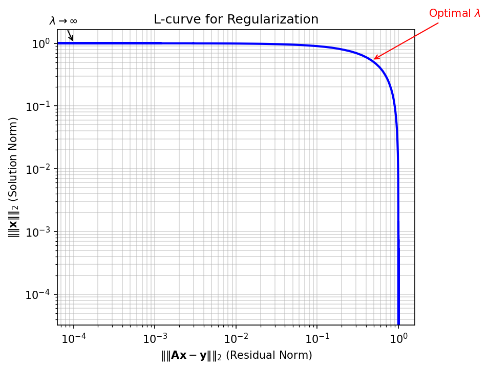

## 01. Learning Outcomes

::: {.fragment}
After this unit, you will be able to:
:::

::: {.fragment}
1. **Distinguish** forward from inverse problems and explain why inverse problems are ill-posed
:::

::: {.fragment}
2. **Apply** regularization strategies (Tikhonov, Bayesian priors) to stabilize inverse solutions
:::

::: {.fragment}
3. **Construct** process maps and identify safe operating windows for manufacturing
:::

::: {.fragment}
4. **Formulate** PINNs-based inverse problems to discover material parameters from data
:::

::: {.fragment}
5. **Explain** the SINDy algorithm and its use for discovering governing equations from data
:::

# Section 1: Forward / Inverse Duality {background-color="#1a1a2e"}

::: {.r-fit-text}
The Fundamental Asymmetry
:::

## 02. Recap: Forward Modeling

### Process → Structure → Properties

::: {.fragment}
The **forward problem** is what we have been doing in previous units:

$$\mathbf{y} = f(\mathbf{x}) + \varepsilon$$

Given process parameters $\mathbf{x}$, predict the resulting structure or properties $\mathbf{y}$.
:::

::: {.fragment}
**Examples:**

| Input $\mathbf{x}$ | Model $f$ | Output $\mathbf{y}$ |
|:--|:--|:--|
| Laser power, scan speed | Thermal simulation | Melt pool depth |
| Alloy composition | CALPHAD | Phase fractions |
| Annealing time, temperature | Diffusion model | Grain size |
:::

::: {.fragment}
- Forward problems are typically **well-posed**: the output is uniquely determined by the input
- Physics gives us the direction of causality: cause $\rightarrow$ effect
:::

## 03. What Is an Inverse Problem?

### Structure → Process

::: {.fragment}
The **inverse problem** reverses the arrow:

$$\mathbf{x} = f^{-1}(\mathbf{y})$$

Given the desired output $\mathbf{y}^*$, find the input $\mathbf{x}^*$ that produces it.
:::

::: {.fragment}
**The question engineers actually ask:**

- "I need a part with $< 0.1\%$ porosity — what laser parameters should I use?"
- "I want a grain size of $10\,\mu\text{m}$ — what annealing schedule gives me that?"
- "I need yield strength $> 800\,\text{MPa}$ — what alloy composition and heat treatment?"
:::

```{mermaid}
%%| fig-width: 14
flowchart LR
    A["Desired Properties<br>y*"] -->|"Inverse Problem<br>x = f⁻¹(y)"| B["Required Process<br>x*"]
    B -->|"Forward Problem<br>y = f(x)"| C["Achieved Properties<br>y"]
    C -->|"Compare"| A
    style A fill:#e74c3c,color:#fff
    style B fill:#2ecc71,color:#fff
    style C fill:#3498db,color:#fff
```

## 04. The Challenge: Non-Uniqueness

### Many Inputs Can Produce the Same Output

::: {.fragment}
If the forward map $f$ is **many-to-one**, then $f^{-1}$ is **one-to-many**:

$$f(\mathbf{x}_1) = f(\mathbf{x}_2) = \ldots = f(\mathbf{x}_k) = \mathbf{y}^*$$
:::

::: {.fragment}
**Materials example:**

A grain size of $d = 10\,\mu\text{m}$ can be achieved by:

- High temperature, short time: $(T_1 = 1100°\text{C},\; t_1 = 5\,\text{min})$
- Moderate temperature, medium time: $(T_2 = 900°\text{C},\; t_2 = 60\,\text{min})$
- Low temperature, long time: $(T_3 = 750°\text{C},\; t_3 = 480\,\text{min})$
:::

::: {.fragment}
{width=80%}
:::

::: {.fragment}
- The forward problem has **one answer**; the inverse has **infinitely many**
- Which solution should we choose? Physics alone does not decide — we need additional criteria
:::

## 05. Why Standard NNs Fail for Inverse Problems

### The Averaging Problem

::: {.fragment}
Train a standard neural network to map $\mathbf{y} \rightarrow \mathbf{x}$ using MSE loss:

$$\mathcal{L} = \frac{1}{N}\sum_{i=1}^{N} \|\mathbf{x}_i - \hat{\mathbf{x}}(\mathbf{y}_i)\|^2$$
:::

::: {.fragment}
If multiple valid solutions $\{\mathbf{x}_1, \mathbf{x}_2, \mathbf{x}_3\}$ exist for the same $\mathbf{y}^*$:

$$\hat{\mathbf{x}}_\text{NN} \approx \frac{1}{k}\sum_{j=1}^{k}\mathbf{x}_j \quad \text{(the mean of valid solutions)}$$
:::

::: {.fragment}
**The mean of valid solutions is often not itself a valid solution!**
:::

::: {.callout-warning}
## The Averaging Trap
A standard neural network trained with MSE loss on an inverse problem will predict the **average** of all valid solutions. This average may lie in a region of parameter space that produces defective parts — it is a physically meaningless compromise.
:::

# Section 2: Ill-Posedness & Regularization {background-color="#1a1a2e"}

::: {.r-fit-text}
Taming Unstable Solutions
:::

## 06. Hadamard's Definition of Well-Posedness

### Three Conditions (Jacques Hadamard, 1902)

::: {.fragment}
A problem is **well-posed** if and only if all three conditions hold:
:::

::: {.fragment}
1. **Existence**: A solution exists for every admissible input
:::

::: {.fragment}
2. **Uniqueness**: The solution is unique
:::

::: {.fragment}
3. **Stability**: The solution depends continuously on the data — small changes in input produce small changes in output
:::

::: {.fragment}
A problem that violates **any** of these conditions is called **ill-posed**.
:::

::: {.fragment}
| Condition | Forward Problem | Inverse Problem |
|:--|:-:|:-:|
| Existence | Usually yes | May fail (no process gives exactly $\mathbf{y}^*$) |
| Uniqueness | Usually yes | Often fails (many-to-one forward map) |
| Stability | Usually yes | Often fails (noise amplification) |
:::

## 07. When Problems Are Ill-Posed

### The Butterfly Effect in Inversion

::: {.fragment}
**Stability violation — noise amplification:**

If the forward model maps a large range of inputs to a narrow range of outputs, then the inverse must map a narrow range of outputs back to a large range of inputs.
:::

::: {.fragment}
$$\text{Forward: } \Delta x = 100 \;\rightarrow\; \Delta y = 1$$
$$\text{Inverse: } \Delta y = 1 \;\rightarrow\; \Delta x = 100$$
:::

::: {.fragment}
A $1\%$ measurement error in $y$ causes a $100\%$ error in the inferred $x$!
:::

::: {.fragment}
**Materials example:**

- Measuring porosity with $\pm 0.05\%$ accuracy
- The inverse map amplifies this to $\pm 50\,\text{W}$ uncertainty in laser power
- This spans the entire range between "good" and "keyholing" regimes
:::

## 08. Think About This...

### The Tomography Puzzle

::: {.fragment}
You have an X-ray CT scanner and take **projection images** of a metal part from 180 angles.
:::

::: {.fragment}
The forward problem is straightforward:

$$p_\theta(s) = \int_{\text{ray}} \mu(x, y)\, dl$$

Each projection is a line integral of the attenuation coefficient $\mu(x, y)$.
:::

::: {.fragment .fade-in-then-semi-out}
**Question 1:** Is the inverse problem (reconstructing $\mu(x, y)$ from projections) well-posed?

$\rightarrow$ It depends! With **infinite** noiseless projections, it is well-posed (Radon transform is invertible). With **finitely many noisy** projections, it is ill-posed — many images are consistent with the data.
:::

::: {.fragment}
**Question 2:** What happens if you reduce from 180 projections to 10?

$\rightarrow$ The problem becomes **severely ill-posed**. The null space of the measurement operator grows — there are many structures that produce the same 10 projections. You need strong priors (sparsity, smoothness, physics) to regularize.
:::

## 09. Regularization: Prior Knowledge as a Constraint

### Turning Ill-Posed into Well-Posed

::: {.fragment}
**Core idea:** We cannot solve the inverse problem from data alone — we need to add **prior knowledge** about what a "good" solution looks like.
:::

::: {.fragment}
$$\hat{\mathbf{x}} = \arg\min_{\mathbf{x}} \underbrace{\|f(\mathbf{x}) - \mathbf{y}_\text{obs}\|^2}_{\text{data fidelity}} + \lambda \underbrace{R(\mathbf{x})}_{\text{regularization}}$$
:::

::: {.fragment}
| Regularizer $R(\mathbf{x})$ | Prior assumption | Effect |
|:--|:--|:--|
| $\|\mathbf{x}\|_2^2$ (L2 / Ridge) | Parameters are small | Smooth solutions, shrinks all parameters |
| $\|\mathbf{x}\|_1$ (L1 / LASSO) | Solution is sparse | Feature selection, sets parameters to zero |
| $\|\nabla \mathbf{x}\|_2^2$ | Solution is smooth | Suppresses oscillations |
| Total Variation $\|\nabla \mathbf{x}\|_1$ | Piecewise constant | Preserves sharp edges |
:::

::: {.fragment}
- $\lambda$ controls the **tradeoff** between fitting data and satisfying the prior
- Too small $\lambda$: noise dominates (overfitting to noisy measurements)
- Too large $\lambda$: prior dominates (underfitting the data)
:::

## 10. Physics as a Regularizer

### The Most Powerful Prior

::: {.fragment}
Instead of generic mathematical penalties, we can use **physical laws** as regularizers:
:::

::: {.fragment}
$$\hat{\mathbf{x}} = \arg\min_{\mathbf{x}} \|\mathbf{y}_\text{obs} - f(\mathbf{x})\|^2 + \lambda_\text{PDE} \underbrace{\left\|\mathcal{N}[\mathbf{u}(\mathbf{x})]\right\|^2}_{\text{PDE residual}} + \lambda_\text{BC} \underbrace{\left\|\mathcal{B}[\mathbf{u}(\mathbf{x})]\right\|^2}_{\text{boundary conditions}}$$
:::

::: {.fragment}
**Physical constraints in materials science:**

- Conservation of mass, momentum, energy
- Thermodynamic equilibrium (Gibbs energy minimization)
- Constitutive laws (stress-strain relations)
- Symmetry constraints (crystal symmetries)
:::

::: {.fragment}
**Advantage over L1/L2:**

- Physics-based regularizers encode **domain knowledge**, not just mathematical smoothness
- They constrain the solution to the **physically realizable** manifold
- They dramatically reduce the space of admissible solutions
:::

## 11. Tikhonov Regularization

### The Classical Approach

::: {.fragment}
**Tikhonov regularization** (also called Ridge regression in ML) adds an L2 penalty:

$$\hat{\mathbf{x}} = \arg\min_{\mathbf{x}} \|\mathbf{A}\mathbf{x} - \mathbf{y}\|_2^2 + \lambda \|\mathbf{L}\mathbf{x}\|_2^2$$
:::

::: {.fragment}
For the linear case $\mathbf{y} = \mathbf{A}\mathbf{x}$, the solution is:

$$\hat{\mathbf{x}}_\lambda = (\mathbf{A}^T\mathbf{A} + \lambda \mathbf{L}^T\mathbf{L})^{-1}\mathbf{A}^T\mathbf{y}$$
:::

::: {.fragment}
**Effect on the singular values:**

- Without regularization: $\hat{x}_i = \frac{\sigma_i}{\sigma_i^2} (\mathbf{u}_i^T\mathbf{y})$ — small singular values $\sigma_i$ cause blow-up
- With regularization: $\hat{x}_i = \frac{\sigma_i}{\sigma_i^2 + \lambda} (\mathbf{u}_i^T\mathbf{y})$ — the $\lambda$ term damps small singular values
:::

::: {.fragment}
{width=80%}
:::

## 12. Bayesian View of Inverse Problems

### From Point Estimates to Posterior Distributions

::: {.fragment}
Instead of finding a single "best" $\mathbf{x}$, compute the **posterior distribution**:

$$p(\mathbf{x} \mid \mathbf{y}) = \frac{p(\mathbf{y} \mid \mathbf{x})\, p(\mathbf{x})}{p(\mathbf{y})}$$
:::

::: {.fragment}
| Bayesian Term | Inverse Problem Meaning |
|:--|:--|
| $p(\mathbf{x} \mid \mathbf{y})$ — Posterior | Probability of parameters given observed data |
| $p(\mathbf{y} \mid \mathbf{x})$ — Likelihood | How well the forward model fits the data |
| $p(\mathbf{x})$ — Prior | Our regularization / domain knowledge |
| $p(\mathbf{y})$ — Evidence | Normalization constant |
:::

::: {.fragment}
**Connection to regularization:**

- Gaussian prior $p(\mathbf{x}) \propto \exp(-\frac{\lambda}{2}\|\mathbf{x}\|^2)$ $\;\Leftrightarrow\;$ L2 (Tikhonov) regularization
- Laplace prior $p(\mathbf{x}) \propto \exp(-\lambda\|\mathbf{x}\|_1)$ $\;\Leftrightarrow\;$ L1 (LASSO) regularization
- The MAP estimate $\hat{\mathbf{x}}_\text{MAP} = \arg\max_\mathbf{x}\, p(\mathbf{x} \mid \mathbf{y})$ recovers the regularized solution
:::

::: {.callout-tip}
## Why Go Bayesian?
The posterior distribution gives us not just a point estimate but **uncertainty quantification**: we know which process parameters are well-constrained by the data and which are uncertain. This is essential for risk-aware manufacturing.
:::

# Section 3: Process Maps & Corridors {background-color="#1a1a2e"}

::: {.r-fit-text}
Navigating the Parameter Space
:::

## 13. What Is a Process Map?

### Visualizing the Feasible Region [@neuer2024machine]

::: {.fragment}
A **process map** is a visualization of the parameter space that classifies regions by outcome quality:
:::

::: {.fragment}
{width=80%}
:::

::: {.fragment}
- **Axes**: Key process parameters (e.g., laser power $P$, scan speed $v$)
- **Regions**: Classified by dominant defect mechanism or quality metric
- **Boundaries**: Critical transitions between regimes
:::

::: {.fragment}
**The engineering goal:** Find the region in parameter space where **all** quality criteria are simultaneously satisfied — the **safe operating window**.
:::

## 14. Defining the Safe Operating Window

### Defect Mechanisms as Constraints

::: {.fragment}
Each defect mechanism defines a **constraint boundary** in parameter space:
:::

::: {.fragment}
| Defect | Mechanism | Boundary condition |
|:--|:--|:--|
| **Keyholing** | Vapor depression collapse | $E_v > E_\text{keyhole}^*$ (energy density too high) |
| **Lack of fusion** | Insufficient melting | $E_v < E_\text{fusion}^*$ (energy density too low) |
| **Balling** | Rayleigh instability | $v > v_\text{ball}^*(P)$ (speed too high for given power) |
| **Cracking** | Thermal stress | $\dot{T} > \dot{T}_\text{crack}^*$ (cooling rate too high) |
:::

::: {.fragment}
The **safe operating window** is the intersection:

$$\Omega_\text{safe} = \{\mathbf{x} : E_v(\mathbf{x}) \in [E_\text{fusion}^*, E_\text{keyhole}^*] \;\wedge\; v < v_\text{ball}^*(P) \;\wedge\; \dot{T} < \dot{T}_\text{crack}^*\}$$
:::

::: {.fragment}
- In LPBF, the volumetric energy density is often used: $E_v = \frac{P}{v \cdot h \cdot t}$
- The safe window may be **narrow** — leaving little room for process variation
:::

## 15. Process Corridors

### Drift Over Time [@neuer2024machine]

::: {.fragment}
A **process corridor** extends the static process map to account for **temporal drift**:
:::

::: {.fragment}
- Equipment degradation (laser power drift, optics contamination)
- Raw material variation (powder reuse, batch-to-batch variability)
- Environmental changes (humidity, ambient temperature)
:::

::: {.fragment}
{width=80%}
:::

::: {.fragment}
**The corridor concept:**

- The **nominal operating point** is the center of the safe window
- The **corridor** is the trajectory of the actual operating point over time
- If the corridor exits the safe window, defects occur
- **Monitoring** the corridor enables **predictive maintenance** and **adaptive process control**
:::

## 16. Multi-Dimensional Feasibility Regions

### Beyond 2D Maps

::: {.fragment}
Real manufacturing processes have many more than 2 parameters:
:::

::: {.fragment}
**LPBF example — at least 8 key parameters:**

| Parameter | Typical Range |
|:--|:--|
| Laser power $P$ | 100 – 500 W |
| Scan speed $v$ | 200 – 2000 mm/s |
| Hatch spacing $h$ | 50 – 150 μm |
| Layer thickness $t$ | 20 – 100 μm |
| Spot diameter $d$ | 50 – 200 μm |
| Preheat temperature $T_0$ | 25 – 500 °C |
| Scan strategy | Stripe, island, meander |
| Gas flow rate | 1 – 10 m/s |
:::

::: {.fragment}
- The feasible region is a **high-dimensional manifold** that cannot be visualized directly
- 2D process maps are **projections** — they can hide important interactions
- ML enables navigation of the full-dimensional space
:::

## 17. ML for Mapping Defect Boundaries

### Classification Approach

::: {.fragment}
**Idea:** Train a classifier to predict defect type from process parameters:

$$\hat{c}(\mathbf{x}) = \text{Classifier}(P, v, h, t, d, T_0, \ldots)$$

where $c \in \{\text{dense}, \text{keyhole}, \text{LOF}, \text{balling}, \text{cracking}\}$
:::

::: {.fragment}
**Common approaches:**

- **Random Forests**: Handle mixed parameter types, provide feature importance
- **SVM**: Good boundaries with limited data, kernel methods for non-linear boundaries
- **Neural Networks**: Flexible boundaries, but need more data
- **Gaussian Processes**: Provide uncertainty on boundary location
:::

::: {.fragment}
```{mermaid}
%%| fig-width: 14
flowchart LR
    A["Experimental Database<br>(parameters, outcomes)"] --> B["Train Classifier<br>(RF, SVM, GP, NN)"]
    B --> C["Decision Boundaries<br>in Parameter Space"]
    C --> D["Process Map<br>with Confidence"]
    D --> E["Safe Operating Window<br>+ Uncertainty"]
    style A fill:#3498db,color:#fff
    style B fill:#9b59b6,color:#fff
    style C fill:#e67e22,color:#fff
    style D fill:#2ecc71,color:#fff
    style E fill:#1abc9c,color:#fff
```
:::

## 18. Sensitivity Analysis on the Process Map

### Which Parameters Matter Most?

::: {.fragment}
**Sensitivity analysis** identifies which process parameters have the strongest influence on quality:
:::

::: {.fragment}
**Local sensitivity (gradient-based):**

$$S_i = \frac{\partial \hat{y}}{\partial x_i}\bigg|_{\mathbf{x}_0}$$

How much does the output change when parameter $i$ is perturbed?
:::

::: {.fragment}
**Global sensitivity (Sobol indices):**

$$S_i = \frac{\text{Var}[\mathbb{E}[\hat{y} \mid x_i]]}{\text{Var}[\hat{y}]}$$

What fraction of the total output variance is attributable to parameter $i$?
:::

::: {.fragment}
**Materials insight:** If the safe operating window is narrow along parameter $x_i$ but wide along $x_j$:

- $x_i$ requires **tight control** (high sensitivity)
- $x_j$ can tolerate **more variation** (low sensitivity)
- Focus monitoring and control efforts on the high-sensitivity parameters
:::

## 19. Summary: Process Maps

::: {.fragment}
**Key concepts:**
:::

::: {.fragment}
- Process maps visualize **feasibility regions** in parameter space, bounded by defect mechanisms
:::

::: {.fragment}
- The **safe operating window** is the intersection of all quality constraints
:::

::: {.fragment}
- **Process corridors** capture temporal drift of the operating point
:::

::: {.fragment}
- ML classifiers can learn defect boundaries from experimental data
:::

::: {.fragment}
- **Sensitivity analysis** identifies which parameters require tightest control
:::

::: {.fragment}
- Finding the **optimal operating point** within the safe window is an inverse problem
:::

# Section 4: Parameter Discovery with PINNs {background-color="#1a1a2e"}

::: {.r-fit-text}
From Data to Physics
:::

## 20. PINNs for Inverse Problems

### Recap: The PINN Framework

::: {.fragment}
Recall from Unit 7: A **Physics-Informed Neural Network** represents the solution $u(x, t)$ as a neural network and trains it by minimizing:

$$\mathcal{L} = \underbrace{\mathcal{L}_\text{data}}_{\text{match observations}} + \underbrace{\lambda_\text{PDE}\, \mathcal{L}_\text{PDE}}_{\text{satisfy physics}} + \underbrace{\lambda_\text{BC}\, \mathcal{L}_\text{BC}}_{\text{boundary conditions}}$$
:::

::: {.fragment}
**Forward PINN:** All parameters of the PDE are **known**. The network learns $u(x,t)$.
:::

::: {.fragment}
**Inverse PINN:** Some parameters of the PDE are **unknown**. The network learns $u(x,t)$ **and** the unknown parameters simultaneously.
:::

::: {.fragment}
**Key insight:** Unknown physical parameters (diffusivity, conductivity, viscosity) become **trainable parameters** of the optimization, alongside the network weights.
:::

## 21. Case Study: Discovering Thermal Diffusivity

### The Heat Equation with Unknown $\alpha$ [@mcclarren2021machine]

::: {.fragment}
**The heat equation:**

$$\frac{\partial T}{\partial t} = \alpha \nabla^2 T$$

where $\alpha$ is the thermal diffusivity — **unknown**.
:::

::: {.fragment}
**Data:** Temperature measurements $T_\text{obs}(x_i, t_j)$ at scattered sensor locations.
:::

::: {.fragment}
**Inverse PINN setup:**

1. Network: $\hat{T}(x, t; \boldsymbol{\theta})$ approximates the temperature field
2. Unknown: $\alpha$ is a trainable scalar parameter
3. Minimize:

$$\mathcal{L} = \frac{1}{N_d}\sum_{i=1}^{N_d}\left(\hat{T}(x_i, t_i) - T_\text{obs}^i\right)^2 + \frac{\lambda}{N_c}\sum_{j=1}^{N_c}\left(\frac{\partial \hat{T}}{\partial t} - \alpha \nabla^2 \hat{T}\right)^2_{\!(x_j, t_j)}$$
:::

## 22. The Inverse Loss Function

### Anatomy of $\mathcal{J} = \mathcal{J}_\text{data} + \mathcal{J}_\text{PDE}$

::: {.fragment}
```{mermaid}
%%| fig-width: 16
flowchart TB
    subgraph Inputs
        X["Spatial coordinates x"]
        T["Time t"]
    end
    subgraph Network["Neural Network NN(x,t; θ)"]
        H1["Hidden layers"]
    end
    subgraph Outputs
        U["Predicted field û"]
    end
    subgraph AutoDiff["Automatic Differentiation"]
        DU["∂û/∂t, ∇²û"]
    end
    subgraph Loss["Total Loss"]
        LD["J_data = ||û - u_obs||²"]
        LP["J_PDE = ||∂û/∂t - α∇²û||²"]
    end
    subgraph Params["Trainable Parameters"]
        TH["Network weights θ"]
        AL["Unknown physics α"]
    end
    X --> Network
    T --> Network
    Network --> U
    U --> AutoDiff
    U --> LD
    AutoDiff --> LP
    AL --> LP
    LD --> |"Backprop"| TH
    LP --> |"Backprop"| TH
    LP --> |"Backprop"| AL
    style AL fill:#e74c3c,color:#fff
    style LD fill:#3498db,color:#fff
    style LP fill:#2ecc71,color:#fff
```
:::

::: {.fragment}
- Gradients of $\mathcal{L}$ w.r.t. $\alpha$ flow through the PDE residual via **automatic differentiation**
- The optimizer simultaneously updates $\boldsymbol{\theta}$ (network weights) and $\alpha$ (physics)
:::

## 23. Why PINNs Beat Curve Fitting

### Advantages of the Physics-Informed Approach

::: {.fragment}
**Traditional approach — least-squares curve fitting:**

1. Assume a parametric form: $T(x, t; \alpha) = T_0 + \Delta T\, \text{erfc}\!\left(\frac{x}{2\sqrt{\alpha t}}\right)$
2. Fit $\alpha$ by minimizing $\sum_i (T_\text{model}^i - T_\text{obs}^i)^2$
:::

::: {.fragment}
**Problems with curve fitting:**

- Requires an **analytical solution** — only available for simple geometries and BCs
- Cannot handle **complex domains**, nonlinear PDEs, or coupled physics
- Sensitive to **noise** — no regularization from the PDE structure
:::

::: {.fragment}
**PINN advantages:**

- Works with **any** PDE — no analytical solution needed
- Handles **arbitrary geometries** and boundary conditions
- The PDE itself acts as a **regularizer**, denoising the observations
- Can discover **spatially varying** parameters: $\alpha(x)$ instead of a single scalar
- Naturally extends to **multi-physics** problems
:::

## 24. Discovering Variable Parameters: $D(T)$

### Beyond Scalar Constants

::: {.fragment}
Many material properties depend on temperature or composition:

$$\frac{\partial c}{\partial t} = \nabla \cdot [D(T)\, \nabla c]$$

where $D(T)$ is the **temperature-dependent diffusivity** — unknown functional form.
:::

::: {.fragment}
**PINN approach:**

- Represent $D(T)$ as a **second neural network**: $\hat{D}(T; \boldsymbol{\phi})$
- Train simultaneously:
  - $\hat{c}(x, t; \boldsymbol{\theta})$ — concentration field
  - $\hat{D}(T; \boldsymbol{\phi})$ — diffusivity function
:::

::: {.fragment}
$$\mathcal{L} = \underbrace{\sum_i (c_\text{obs}^i - \hat{c}^i)^2}_{\text{data}} + \lambda \underbrace{\sum_j \left(\frac{\partial \hat{c}}{\partial t} - \nabla \cdot [\hat{D}(\hat{T}) \nabla \hat{c}]\right)^2_j}_{\text{PDE}} + \mu \underbrace{\sum_k \left(\frac{d\hat{D}}{dT}\right)^2_k}_{\text{smoothness prior on } D}$$
:::

::: {.fragment}
**Result:** We discover the full functional relationship $D(T)$ from data — not just a single number!
:::

## 25. Example: Melt Pool Shapes to Thermal Conductivity

### Inverse Problem in Additive Manufacturing

::: {.fragment}
**Scenario:** You have cross-sectional images of melt pool shapes from LPBF experiments at various process parameters.
:::

::: {.fragment}
**Forward model:** Steady-state heat equation with convection:

$$\rho c_p (\mathbf{v} \cdot \nabla T) = \nabla \cdot [k(T)\, \nabla T] + Q_\text{laser}$$
:::

::: {.fragment}
**Known:** Laser power $Q_\text{laser}$, scan speed $\mathbf{v}$, melt pool boundary (solidus isotherm location)

**Unknown:** Temperature-dependent thermal conductivity $k(T)$
:::

::: {.fragment}
**Inverse PINN:**

- The melt pool boundary provides data: $\hat{T}(x_\text{boundary}) = T_\text{solidus}$
- The PDE provides physics: heat equation residual
- The network learns $k(T)$ that produces the observed melt pool shapes
:::

::: {.fragment}
{width=80%}
:::

## 26. Accuracy and Convergence

### How Well Do Inverse PINNs Work?

::: {.fragment}
**Typical accuracy for parameter discovery:**

| Problem | Unknown | Relative Error | Data Points |
|:--|:--|:-:|:-:|
| 1D Heat equation | $\alpha$ (scalar) | $< 1\%$ | 100 |
| 2D Diffusion | $D$ (scalar) | $1\text{–}3\%$ | 500 |
| Navier-Stokes | $\nu$ (viscosity) | $2\text{–}5\%$ | 1000 |
| Variable $D(T)$ | $D(T)$ (function) | $5\text{–}10\%$ | 2000 |
:::

::: {.fragment}
**Convergence challenges:**

- Inverse PINNs are **harder to train** than forward PINNs — the loss landscape is more complex
- Multiple local minima may correspond to different physical parameters
- The balance $\lambda$ between data and PDE loss is critical
- **Strategies:** Learning rate scheduling, curriculum training (start with data, add PDE gradually), multi-fidelity approaches
:::

::: {.callout-note}
## Practical Tip
Start the inverse PINN training with a good initial guess for the unknown parameter. If $\alpha_\text{true} \approx 10^{-5}$, initializing at $\alpha_0 = 10^{-7}$ may converge to a wrong local minimum. Use rough estimates from literature or dimensional analysis.
:::

## 27. Traditional Inverse Methods vs PINNs

### A Fair Comparison

::: {.fragment}
| Criterion | Traditional (Adjoint/FEM) | PINNs |
|:--|:--|:--|
| **Mesh requirement** | Yes (FEM mesh) | No (meshfree) |
| **Analytical solution** | Sometimes needed | Never needed |
| **Complex geometry** | Challenging meshing | Easy (point sampling) |
| **Nonlinear PDEs** | Iterative, expensive | Natural (backprop) |
| **Spatially varying parameters** | Parameterization needed | Network approximation |
| **Uncertainty quantification** | Adjoint-based | Ensemble/Bayesian NN |
| **Computational cost** | One FEM solve per iteration | One training run |
| **Maturity** | Decades of development | Rapidly evolving |
| **Industrial adoption** | Widespread | Early stage |
:::

::: {.fragment}
**Bottom line:** PINNs are not always better — but they offer unique advantages for complex, multi-physics, data-scarce problems where meshing or analytical solutions are impractical.
:::

## 28. Inverse Problems in Tomography

### ML-Enhanced Reconstruction

::: {.fragment}
**Classical reconstruction:**

$$\hat{\mu}(x, y) = \text{FBP}[p_\theta(s)] \quad \text{(Filtered Backprojection)}$$

Works well with many projections, but fails with limited/noisy data.
:::

::: {.fragment}
**ML inverse approaches:**

1. **Learned post-processing:** FBP → CNN denoiser
2. **Learned iterative reconstruction:** Unrolled optimization with learned regularizers
3. **Direct inversion:** Train network to map sinograms to images
4. **Physics-informed:** PDE-constrained reconstruction (e.g., beam hardening model)
:::

::: {.fragment}
**Why it matters for materials:**

- In-situ tomography during solidification: **few projections**, fast acquisition
- Electron tomography: **limited tilt range** (missing wedge problem)
- Neutron tomography: **low SNR**, need strong regularization
:::

## 29. Multi-Physics Inversion

### Coupling Multiple Governing Equations

::: {.fragment}
Real manufacturing involves **coupled physics**:

$$\text{Thermal} \longleftrightarrow \text{Mechanical} \longleftrightarrow \text{Microstructural} \longleftrightarrow \text{Fluid}$$
:::

::: {.fragment}
**Multi-physics inverse PINN:**

$$\mathcal{L} = \mathcal{L}_\text{data} + \lambda_1 \mathcal{L}_\text{heat} + \lambda_2 \mathcal{L}_\text{Navier-Stokes} + \lambda_3 \mathcal{L}_\text{phase-field} + \lambda_4 \mathcal{L}_\text{mechanics}$$
:::

::: {.fragment}
**Example — LPBF multi-physics inversion:**

- **Observe:** Surface temperature (thermal camera) + melt pool shape (high-speed video)
- **Discover:** Absorptivity $\eta$, Marangoni coefficient $\partial\gamma/\partial T$, mushy zone constant $A_\text{mush}$
- **Constrained by:** Heat equation + Navier-Stokes + Stefan condition
:::

::: {.fragment}
**Challenge:** Balancing loss terms $\lambda_1, \ldots, \lambda_4$ becomes critical — active research area (adaptive weighting, gradient normalization)
:::

## 30. From Data to Digital Twin

### The Inverse Problem Perspective

::: {.fragment}
A **digital twin** is a continuously updated computational model of a physical system:
:::

::: {.fragment}
1. **Initialization:** Solve inverse problem to calibrate model parameters from initial data
2. **Prediction:** Run forward model to predict future behavior
3. **Update:** As new data arrives, solve inverse problem again to update parameters
4. **Control:** Use updated model to optimize process parameters (another inverse problem!)
:::

::: {.fragment}
{width=80%}
:::

::: {.fragment}
**The inverse problem is at the heart of every digital twin:**

- Without inversion, the model is a static simulation — not a twin
- The "twin" aspect comes from continuous calibration against real-world data
:::

## 31. Summary: PINN Inversion

::: {.fragment}
**Key concepts:**
:::

::: {.fragment}
- PINNs solve inverse problems by making unknown physical parameters **trainable**
:::

::: {.fragment}
- They can discover **scalar constants** ($\alpha$, $k$, $\nu$) or **functional relationships** ($D(T)$, $k(T)$)
:::

::: {.fragment}
- The PDE acts as a **physics-based regularizer**, stabilizing the ill-posed inverse problem
:::

::: {.fragment}
- PINNs excel at **meshfree, multi-physics** problems with scattered data
:::

::: {.fragment}
- **Challenges** include training stability, loss balancing, and convergence to local minima
:::

::: {.fragment}
- The digital twin concept relies on continuous inverse problem solving for model calibration
:::

# Section 5: Equation Discovery — SINDy {background-color="#1a1a2e"}

::: {.r-fit-text}
Discovering Governing Equations from Data
:::

## 32. Symbolic Regression: The Idea

### From Data to Equations

::: {.fragment}
**Standard regression:** Fit parameters of a **known** model

$$y = a_0 + a_1 x + a_2 x^2 \quad \text{(we chose the form, fit the } a_i\text{)}$$
:::

::: {.fragment}
**Symbolic regression:** Discover both the **form** and the parameters

$$y = ??? \quad \text{(find the equation itself from data)}$$
:::

::: {.fragment}
**The dream:**

| Input Data | Discovered Equation |
|:--|:--|
| Planetary orbits | $F = \frac{Gm_1 m_2}{r^2}$ |
| Pendulum motion | $\ddot{\theta} = -\frac{g}{l}\sin\theta$ |
| Cooling curves | $\frac{dT}{dt} = -h(T - T_\infty)$ |
| Stress-strain data | $\sigma = K\varepsilon^n$ |
:::

::: {.fragment}
**Challenge:** The space of possible equations is **combinatorially vast** — brute force search is infeasible
:::

## 33. SINDy: Sparse Identification of Nonlinear Dynamics

### The Key Insight (Brunton et al. 2016) [@mcclarren2021machine]

::: {.fragment}
**Observation:** Most physical laws involve only a **few terms** from a large space of possible terms.

$$\frac{d\mathbf{x}}{dt} = f(\mathbf{x}) = \boldsymbol{\Theta}(\mathbf{x})\, \boldsymbol{\xi}$$
:::

::: {.fragment}
where:

- $\mathbf{x}(t)$ — measured state variables (e.g., position, temperature, concentration)
- $\dot{\mathbf{x}}$ — time derivatives (estimated from data)
- $\boldsymbol{\Theta}(\mathbf{x})$ — **library of candidate functions** (many columns)
- $\boldsymbol{\xi}$ — **sparse coefficient vector** (mostly zeros!)
:::

::: {.fragment}
```{mermaid}
%%| fig-width: 16
flowchart LR
    A["Measurement Data<br>x(t)"] --> B["Compute Derivatives<br>ẋ(t)"]
    B --> C["Build Library<br>Θ(x) = [1, x, x², sin(x), ...]"]
    C --> D["Sparse Regression<br>ẋ = Θξ, minimize ||ξ||₁"]
    D --> E["Discovered Equation<br>ẋ = -0.5x + 0.1x³"]
    style A fill:#3498db,color:#fff
    style B fill:#9b59b6,color:#fff
    style C fill:#e67e22,color:#fff
    style D fill:#e74c3c,color:#fff
    style E fill:#2ecc71,color:#fff
```
:::

## 34. The Function Library $\boldsymbol{\Theta}$

### Building the Dictionary of Candidates

::: {.fragment}
For state variables $\mathbf{x} = [x_1, x_2]$, a typical library includes:
:::

::: {.fragment}
$$\boldsymbol{\Theta}(\mathbf{x}) = \begin{bmatrix} 1 & x_1 & x_2 & x_1^2 & x_1 x_2 & x_2^2 & x_1^3 & \ldots & \sin(x_1) & \cos(x_1) & \ldots \end{bmatrix}$$
:::

::: {.fragment}
**Design choices:**

| Choice | Tradeoff |
|:--|:--|
| **Polynomials up to degree** $d$ | Higher $d$ → more expressive but more columns → harder sparsity |
| **Trigonometric functions** | Include if oscillatory behavior expected |
| **Cross-terms** $x_i x_j$ | Capture interactions between state variables |
| **Domain-specific terms** | $e^{-E_a/RT}$ for Arrhenius, $x(1-x)$ for logistic growth |
:::

::: {.fragment}
**The library should be:**

- **Rich enough** to contain the true terms
- **Not too large** — more columns means more spurious correlations
- **Informed by domain knowledge** — include physically motivated terms
:::

## 35. Sparse Regression: LASSO

### Finding the Sparse Coefficients

::: {.fragment}
**The optimization problem:**

$$\hat{\boldsymbol{\xi}} = \arg\min_{\boldsymbol{\xi}} \|\dot{\mathbf{X}} - \boldsymbol{\Theta}(\mathbf{X})\boldsymbol{\xi}\|_2^2 + \lambda \|\boldsymbol{\xi}\|_1$$
:::

::: {.fragment}
- The L1 penalty $\|\boldsymbol{\xi}\|_1$ promotes **sparsity** — drives small coefficients to exactly zero
- $\lambda$ controls the sparsity level:
  - Small $\lambda$: many nonzero terms (complex equation)
  - Large $\lambda$: few nonzero terms (simple equation)
:::

::: {.fragment}
**Alternative: Sequential Thresholded Least Squares (STLS)**

1. Solve least squares: $\boldsymbol{\xi} = (\boldsymbol{\Theta}^T\boldsymbol{\Theta})^{-1}\boldsymbol{\Theta}^T\dot{\mathbf{X}}$
2. Set small coefficients to zero: $\xi_i = 0$ if $|\xi_i| < \tau$
3. Repeat with reduced library (columns for nonzero $\xi_i$ only)
4. Iterate until convergence
:::

::: {.fragment}
STLS is the original SINDy algorithm — simpler and often more robust than LASSO for equation discovery.
:::

## 36. Think About This...

### What Would SINDy Discover?

::: {.fragment}
You measure the **angular position** $\theta(t)$ of a damped pendulum at 1000 time points over 30 seconds.
:::

::: {.fragment}
You build a library:

$$\boldsymbol{\Theta} = [1,\; \theta,\; \dot{\theta},\; \theta^2,\; \theta\dot{\theta},\; \dot{\theta}^2,\; \theta^3,\; \sin\theta,\; \cos\theta]$$
:::

::: {.fragment .fade-in-then-semi-out}
**Question 1:** What equation should SINDy discover?

$\rightarrow$ The damped pendulum: $\ddot{\theta} = -\frac{g}{l}\sin\theta - b\dot{\theta}$

So $\boldsymbol{\xi}$ should have nonzero entries only for $\sin\theta$ and $\dot{\theta}$.
:::

::: {.fragment .fade-in-then-semi-out}
**Question 2:** What if you forgot to include $\sin\theta$ in your library?

$\rightarrow$ SINDy would find the **best sparse approximation** using available terms, likely $\ddot{\theta} \approx -c_1\theta + c_3\theta^3 - b\dot{\theta}$ — a polynomial approximation to sine. The library must contain the true terms!
:::

::: {.fragment}
**Question 3:** What if the data is very noisy?

$\rightarrow$ Computing $\ddot{\theta}$ by numerical differentiation **amplifies noise**. This is itself an ill-posed inverse problem! Solutions: smoothing, total variation differentiation, or weak-form SINDy.
:::

## 37. Case Study: Pendulum Dynamics

### SINDy in Action [@mcclarren2021machine]

::: {.fragment}
**Setup (McClarren Ch 2.5):**

- Simulate damped pendulum: $\ddot{\theta} = -\frac{g}{l}\sin\theta - 0.1\dot{\theta}$
- Sample $\theta(t)$ and $\dot{\theta}(t)$ at $\Delta t = 0.01$ s
:::

::: {.fragment}
**Library** (10 candidate terms):

$$\boldsymbol{\Theta} = [1,\; \theta,\; \dot{\theta},\; \theta^2,\; \theta\dot{\theta},\; \dot{\theta}^2,\; \theta^3,\; \theta^2\dot{\theta},\; \sin\theta,\; \cos\theta]$$
:::

::: {.fragment}
**Discovered coefficients** after STLS:

| Term | $\xi_i$ for $\ddot{\theta}$ |
|:-:|:-:|
| $\sin\theta$ | $-9.81$ ✓ |
| $\dot{\theta}$ | $-0.10$ ✓ |
| All others | $0$ ✓ |
:::

::: {.fragment}
**Discovered equation:** $\ddot{\theta} = -9.81\sin\theta - 0.10\dot{\theta}$ — matches the ground truth exactly!
:::

## 38. Discovering Constitutive Laws

### From Stress-Strain Data to Material Models

::: {.fragment}
**Problem:** Given experimental stress-strain curves, discover the constitutive model.
:::

::: {.fragment}
**Library for 1D plasticity:**

$$\boldsymbol{\Theta} = [\varepsilon,\; \varepsilon^2,\; \varepsilon^{1/2},\; \varepsilon^n,\; \ln(1+\varepsilon),\; \dot{\varepsilon},\; \dot{\varepsilon}^m,\; T,\; e^{-Q/RT}]$$
:::

::: {.fragment}
**Potential discoveries:**

| Material behavior | Discovered law |
|:--|:--|
| Linear elastic | $\sigma = E\varepsilon$ |
| Power-law hardening | $\sigma = K\varepsilon^n$ |
| Johnson-Cook | $\sigma = (A + B\varepsilon^n)(1 + C\ln\dot{\varepsilon}^*)(1 - T^{*m})$ |
| Voce hardening | $\sigma = \sigma_s - (\sigma_s - \sigma_0)e^{-\varepsilon/\varepsilon_0}$ |
:::

::: {.fragment}
**Advantage:** No assumption about which model is "right" — the data decides!
:::

## 39. Why Sparsity Is the Physical Prior

### Occam's Razor as Mathematics

::: {.fragment}
**William of Occam (c. 1287–1347):**

*"Entities should not be multiplied beyond necessity."*
:::

::: {.fragment}
**In equation discovery:**

- Physical laws are **parsimonious** — they involve few terms
- Newton's second law: $F = ma$ (one term per side)
- Fourier's law: $q = -k\nabla T$ (one term per side)
- Navier-Stokes: 3–4 terms per equation
:::

::: {.fragment}
**L1 regularization is the mathematical implementation of Occam's Razor:**

$$\min \|\dot{\mathbf{X}} - \boldsymbol{\Theta}\boldsymbol{\xi}\|_2^2 + \lambda\|\boldsymbol{\xi}\|_1$$

- Among all equations that fit the data, prefer the **simplest** (fewest terms)
- This is not just aesthetic — simpler models **generalize better** and are more **interpretable**
:::

::: {.callout-tip}
## Why This Matters for Materials Science
A discovered equation like $\dot{d} = k_0 d^{-1} e^{-Q/RT}$ tells you about the **mechanism** (grain boundary diffusion-controlled growth). A neural network with 10,000 parameters that fits the same data tells you nothing about the physics.
:::

## 40. SINDy with PINNs

### Combining Equation Discovery with Physics Constraints

::: {.fragment}
**Idea:** Use a PINN to learn the solution field, and SINDy to discover the equation from the learned field.
:::

::: {.fragment}
**Two-stage approach:**

1. **Stage 1 (PINN):** Train $\hat{u}(x, t; \boldsymbol{\theta})$ to fit sparse observational data — the PINN provides a smooth, denoised field everywhere
2. **Stage 2 (SINDy):** Apply SINDy to the PINN-predicted field to discover the governing equation
:::

::: {.fragment}
**Why combine?**

- SINDy needs **dense, clean data** — PINNs provide this from sparse, noisy observations
- PINNs need a **known PDE** — SINDy discovers it
- Together: discover equations from **sparse, noisy** real-world data
:::

::: {.fragment}
**Integrated approach (PDE-FIND, DeepMoD):**

- The library $\boldsymbol{\Theta}$ is embedded in the PINN loss function
- Sparsity is enforced during training
- The equation and solution are discovered simultaneously
:::

## 41. Advantages over Black-Box Neural Networks

### Interpretability, Generalizability, Trust

::: {.fragment}
| Criterion | Black-Box NN | SINDy / Symbolic |
|:--|:--|:--|
| **Prediction accuracy** | High (on training distribution) | High (if correct form found) |
| **Extrapolation** | Poor — fails outside training range | Good — physics extrapolates |
| **Interpretability** | None — "black box" | Complete — explicit equation |
| **Data efficiency** | Needs large datasets | Works with moderate data |
| **Parameter count** | Thousands to millions | Typically < 10 |
| **Physical insight** | None | Reveals mechanisms |
| **Regulatory acceptance** | Difficult to certify | Equation can be validated |
:::

::: {.fragment}
**For materials science and engineering:**

- Discovered equations can be **published, verified, and reused**
- They can be **incorporated into existing simulation codes**
- They provide **mechanistic understanding**, not just correlations
- They can be **validated against independent experiments**
:::

## 42. Summary: Equation Discovery

::: {.fragment}
**Key concepts:**
:::

::: {.fragment}
- **Symbolic regression** discovers both the functional form and parameters of governing equations
:::

::: {.fragment}
- **SINDy** converts equation discovery into **sparse regression** on a library of candidate functions
:::

::: {.fragment}
- **Sparsity** is the mathematical implementation of Occam's Razor — the physical prior that laws are parsimonious
:::

::: {.fragment}
- **Library design** requires domain knowledge — the true terms must be present
:::

::: {.fragment}
- Computing **derivatives from noisy data** remains the main practical challenge
:::

::: {.fragment}
- Combining SINDy with PINNs enables equation discovery from **sparse, noisy** experimental data
:::

# Section 6: Synthesis & Outlook {background-color="#1a1a2e"}

::: {.r-fit-text}
Putting It All Together
:::

## 43. Designing Experiments for Inversion

### Not All Data Is Equally Informative

::: {.fragment}
**Optimal experimental design (OED)** for inverse problems: choose measurements that **maximally constrain** the unknown parameters.
:::

::: {.fragment}
**Key principle:**

$$\text{Information} \propto \text{sensitivity of observation to unknown parameter}$$

If $\frac{\partial y_\text{obs}}{\partial \theta}$ is large, the observation $y_\text{obs}$ is informative about $\theta$.
:::

::: {.fragment}
**Practical guidelines:**

1. **Measure in sensitive regions:** Place sensors where the forward model output is most sensitive to the unknown parameters
2. **Diversify measurements:** Multiple measurement types constrain different parameters
3. **Space-time coverage:** Sparse but well-distributed measurements outperform dense local measurements
4. **Sequential design:** Use early measurements to guide placement of later ones (Bayesian OED)
:::

::: {.fragment}
**Materials example:** To determine thermal diffusivity from cooling data:

- Measure **early** in the cooling process (high $\partial T/\partial \alpha$) — not at equilibrium!
- Measure at **multiple spatial locations** — not just the surface
:::

## 44. Limitations of ML-Based Inversion

### Knowing What Can Go Wrong

::: {.fragment}
**Data limitations:**

- ML inverse methods are only as good as the **training data**
- Biased or unrepresentative data leads to biased inversions
- Small datasets increase the risk of overfitting and false discoveries (SINDy)
:::

::: {.fragment}
**Model limitations:**

- PINNs can converge to **local minima** (wrong physics!)
- SINDy requires the true terms to be in the library
- Neural network surrogates do not extrapolate beyond training distribution
:::

::: {.fragment}
**Physics limitations:**

- True non-uniqueness cannot be resolved by better algorithms — it is a property of the physics
- Some parameters are **fundamentally unidentifiable** from available measurements
- Multi-scale coupling makes some inverse problems **intractable** in practice
:::

::: {.fragment}
**The responsible approach:** Always validate inversions against independent data, report uncertainties, and state the assumptions explicitly.
:::

## 45. Unit Summary & Key Takeaways

::: {.fragment}
### The Inverse Problem Landscape

| Approach | Discovers | Best for |
|:--|:--|:--|
| **Regularized optimization** | Parameter values | Linear/mildly nonlinear problems |
| **Bayesian inference** | Posterior distributions | Uncertainty quantification |
| **Process maps** | Feasible regions | Manufacturing process design |
| **PINNs (inverse)** | Parameters + fields | Multi-physics, complex geometry |
| **SINDy** | Governing equations | Interpretable dynamics models |
:::

::: {.fragment}
### Five Big Ideas

1. Inverse problems are **fundamentally harder** than forward problems — non-uniqueness, instability, noise amplification
2. **Regularization = prior knowledge** — physics is the most powerful regularizer
3. **Process maps** translate inverse problem solutions into engineering decisions
4. **PINNs** unify forward and inverse problems in a single optimization framework
5. **SINDy** discovers interpretable equations from data — Occam's Razor as mathematics
:::

## 46. Looking Ahead: Unit 10

::: {.fragment}
**Next unit: Uncertainty Quantification and Bayesian Methods**
:::

::: {.fragment}
- From point predictions to **probability distributions**
- **Bayesian neural networks** for materials property prediction
- **Gaussian processes** as flexible probabilistic surrogates
- **Uncertainty propagation** through process chains
- Connecting UQ to process map confidence bounds
:::

::: {.fragment}
**Reading assignment:**

- @mcclarren2021machine: Chapter 3 (Bayesian Methods)
- @neuer2024machine: Chapter 7 (Uncertainty in Process Models)
:::

## 47. References

::: {.fragment}
**Textbooks:**

- @mcclarren2021machine — Ch 2 (Regression, Regularization), Ch 2.5 (SINDy)
- @neuer2024machine — Ch 6 (Process Maps), Ch 6.5 (Process Corridors)
- @sandfeld_materials_data_science — Ch on Inverse Problems in Materials
:::

::: {.fragment}
**Key papers:**

- Brunton, S. L., Proctor, J. L., & Kutz, J. N. (2016). Discovering governing equations from data by sparse identification of nonlinear dynamics. *PNAS*, 113(15), 3932–3937.
- Raissi, M., Perdikaris, P., & Karniadakis, G. E. (2019). Physics-informed neural networks. *Journal of Computational Physics*, 378, 686–707.
- Hadamard, J. (1902). Sur les problèmes aux dérivées partielles et leur signification physique. *Princeton University Bulletin*, 13, 49–52.
:::

::: {.fragment}
**Software:**

- PySINDy: Python package for SINDy — `pip install pysindy`
- DeepXDE: PINN library for inverse problems — `pip install deepxde`
- NVIDIA Modulus: Industrial PINN framework
:::

