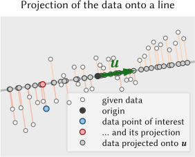
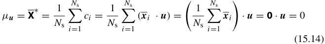
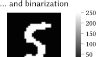
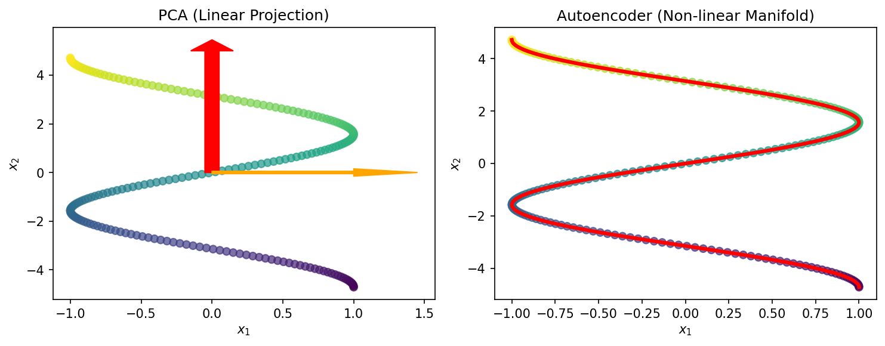
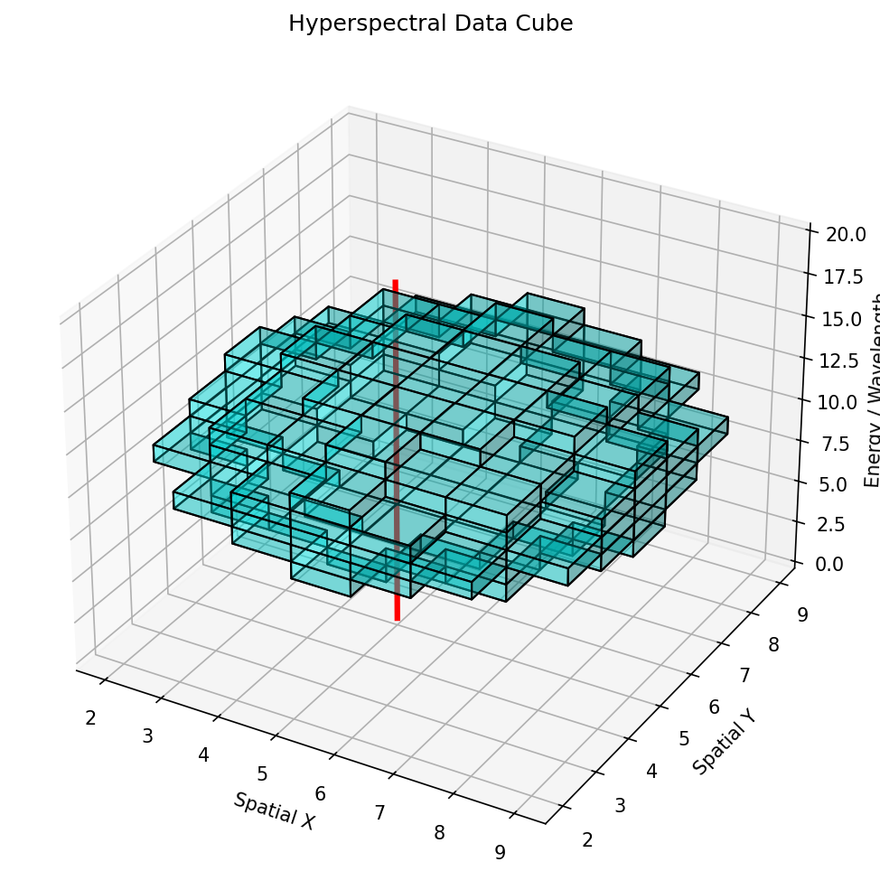
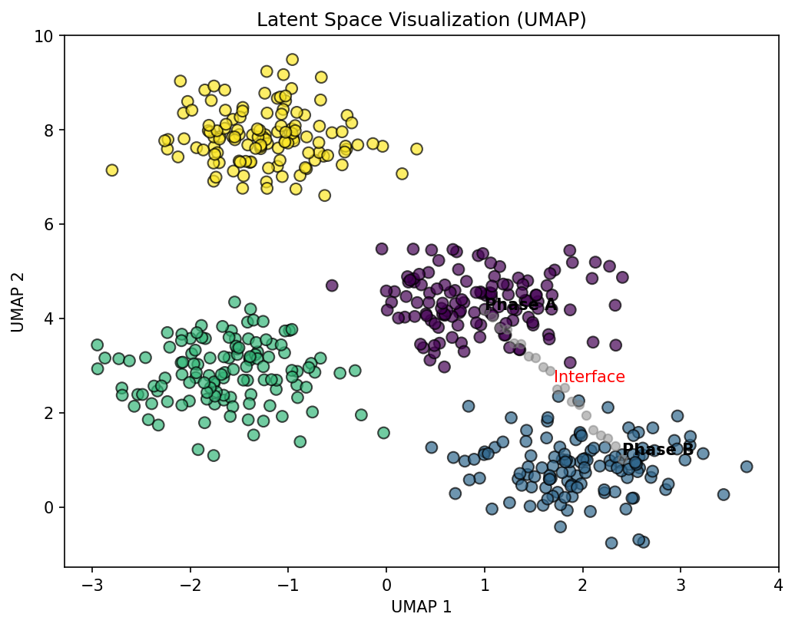

## 01. Learning Outcomes

::: {.fragment}
After this unit, you will be able to:
:::

::: {.fragment}
1. **Describe** the characteristics of 1D characterization signals (XRD, EELS, EDS, XPS, Raman) and why ML is needed
:::

::: {.fragment}
2. **Apply** PCA to spectral data for dimensionality reduction and denoising
:::

::: {.fragment}
3. **Explain** the architecture and training of autoencoders and their variants (DAE, CAE, VAE)
:::

::: {.fragment}
4. **Compare** PCA and autoencoders for spectral compression and feature extraction
:::

::: {.fragment}
5. **Design** a signal processing pipeline for hyperspectral materials data
:::

## 02. Beyond Images: 1D Characterization Signals

::: {.fragment}
- Most of our course so far: **spatial data** (micrographs, microstructure maps)
:::

::: {.fragment}
- But many instruments produce **1D spectral signals**:
  - **XRD** — X-ray Diffraction: crystal structure via Bragg peaks
  - **EELS** — Electron Energy Loss Spectroscopy: bonding and electronic structure
  - **EDS** — Energy Dispersive X-ray Spectroscopy: elemental composition
  - **XPS** — X-ray Photoelectron Spectroscopy: surface chemistry and oxidation states
  - **Raman** — Vibrational spectroscopy: molecular fingerprints
:::

::: {.fragment}
- Each technique produces a **spectrum**: intensity vs. energy (or angle, or wavenumber)
:::

::: {.fragment}
- Modern instruments collect **millions** of spectra per experiment (spectrum imaging)
:::

## 03. The Nature of Characterization Signals

::: {.fragment}
- **High dimensionality**: A single spectrum may have 1024, 2048, or 4096 channels
  - Each spectrum is a point in $\mathbb{R}^{2048}$
:::

::: {.fragment}
- **Sparse peaks**: Most channels contain background; only a few contain signal
:::

::: {.fragment}
- **Continuous backgrounds**: Bremsstrahlung (EDS), plasmon tails (EELS), fluorescence
:::

::: {.fragment}
- **Noise**: Shot noise (Poisson) dominates at low dose; detector noise adds Gaussian contributions
:::

::: {.fragment}
- **Variability**: Peak positions shift with composition; peak shapes change with bonding
:::

::: {.callout-note}
## Spectra as Vectors
A spectrum with $N$ channels is simply a vector $\mathbf{x} \in \mathbb{R}^N$. All the linear algebra and ML tools we have learned apply directly — but the physical meaning of each "dimension" (an energy channel) matters for interpretation.
:::

## 04. The Need for ML

::: {.fragment}
### Traditional Analysis Is Breaking Down
:::

::: {.fragment}
- **Manual peak fitting** is slow, subjective, and does not scale
  - Fitting 10 peaks in 1 spectrum: feasible
  - Fitting 10 peaks in 1,000,000 spectra: impossible
:::

::: {.fragment}
- **Overlapping peaks** make decomposition ambiguous
  - Fe-L and Mn-L edges in EELS overlap at ~640 eV
  - Ti-K$\alpha$ and Ba-L$\alpha$ overlap in EDS at ~4.5 keV
:::

::: {.fragment}
- **Subtle spectral changes** encode critical physics
  - The Fe-L$_{2,3}$ edge shape distinguishes Fe$^{2+}$ from Fe$^{3+}$
  - Peak shift of 0.3 eV indicates a change in oxidation state
:::

::: {.fragment}
- **Batch effects**: Instrument calibration drifts, detector aging, beam damage
:::

## 05. Goals: Compression, Denoising, Phase ID

::: {.fragment}
### Three Core Tasks for ML on Spectra
:::

::: {.fragment}
1. **Compression**: Reduce $\mathbf{x} \in \mathbb{R}^{2048}$ to $\mathbf{z} \in \mathbb{R}^{K}$ with $K \ll 2048$
   - Store and transmit massive spectral maps efficiently
:::

::: {.fragment}
2. **Denoising**: Recover the clean signal from noisy measurements
   - Equivalent to faster acquisition or higher beam current — without the dose
:::

::: {.fragment}
3. **Phase Identification**: Group similar spectra and identify distinct phases
   - Automated chemical/structural mapping across entire specimens
:::

::: {.fragment}
- All three tasks are connected through **dimensionality reduction**
- If we find the right low-dimensional representation, compression, denoising, and clustering all follow naturally
:::

## {background-color="#1a1a2e"}

::: {.r-fit-text}
Section 2: PCA for Spectra
:::

::: {.fragment}
Eigenspectra, Scree Plots, and Linear Denoising
:::

## 07. PCA for Spectra

### The Classical Tool for Spectral Decomposition [@sandfeld_materials_data_science]

::: {.fragment}
- Given $N$ spectra, each with $D$ channels, form the data matrix $\mathbf{X} \in \mathbb{R}^{N \times D}$
:::

::: {.fragment}
- PCA finds orthogonal directions of **maximum variance** in this $D$-dimensional space
:::

::: {.fragment}
- Each spectrum can be approximated as a **linear combination** of $K$ basis vectors:

$$\mathbf{x}_i \approx \bar{\mathbf{x}} + \sum_{k=1}^{K} c_{ik} \, \mathbf{v}_k$$
:::

::: {.fragment}
- $\bar{\mathbf{x}}$: mean spectrum (average over all $N$ spectra)
- $\mathbf{v}_k$: the $k$-th eigenvector of the covariance matrix (the $k$-th **eigenspectrum**)
- $c_{ik}$: the score (coefficient) of spectrum $i$ on component $k$
:::

::: {.fragment}
- **Compression**: Store only the $K$ scores $c_{ik}$ instead of the full $D$ channels
:::

## 08. The Basis Function View: Eigenspectra

```{mermaid}
%%| fig-width: 14
flowchart LR
    A["Raw Spectrum<br>x ∈ ℝ²⁰⁴⁸"] --> B["Center<br>x - x̄"]
    B --> C["Project onto<br>Eigenspectra V"]
    C --> D["Score Vector<br>c ∈ ℝᴷ"]
    D --> E["Reconstruct<br>x̂ = x̄ + Vc"]
    E --> F["Denoised<br>Spectrum"]

    style A fill:#2d5016,stroke:#4a8c2a,color:#fff
    style D fill:#1a3a5c,stroke:#2a6a9c,color:#fff
    style F fill:#5c1a1a,stroke:#9c2a2a,color:#fff
```

::: {.fragment}
- The eigenspectra $\{\mathbf{v}_1, \mathbf{v}_2, \ldots, \mathbf{v}_K\}$ form an **orthonormal basis**
:::

::: {.fragment}
- Each eigenspectrum is a "building block" — a spectral shape that varies across the dataset
:::

::: {.fragment}
- The scores $c_{ik} = \mathbf{v}_k^\top (\mathbf{x}_i - \bar{\mathbf{x}})$ are computed by simple inner products
:::

::: {.fragment}
- This is computationally cheap: once the eigenspectra are computed, projecting a new spectrum is a matrix-vector multiply
:::

## 09. Interpreting Eigenspectra

::: {.fragment}
- **PC1** (first eigenspectrum): Typically resembles the **mean spectrum**
  - Captures the dominant overall shape (background + major peaks)
:::

::: {.fragment}
- **PC2, PC3**: Capture the **dominant variations**
  - Often correspond to specific chemical differences between phases
  - Example: PC2 might show positive Fe peaks and negative Cr peaks (Fe vs. Cr variation)
:::

::: {.fragment}
- **Higher PCs** ($k > K_{\text{signal}}$): Capture **noise**
  - Appear as random oscillations with no physical meaning
:::

::: {.fragment}
{width=80%}
:::

## 10. Intrinsic Dimensionality

::: {.fragment}
- A 2048-channel spectrum lives in $\mathbb{R}^{2048}$ — but how many dimensions does the **data** actually use?
:::

::: {.fragment}
- If the sample has 4 distinct phases, the spectra approximately span a **4-dimensional subspace**
:::

::: {.fragment}
- The **intrinsic dimensionality** $K$ is the number of independent spectral variations
:::

::: {.fragment}
- For most materials datasets: $K \sim 3\text{--}20 \ll D = 2048$
:::

::: {.callout-tip}
## Rule of Thumb
The intrinsic dimensionality of a spectral dataset is typically close to the number of distinct phases or chemical environments in the sample, plus a few components for background variations and thickness effects.
:::

## 11. Scree Plots: Choosing the Number of Components

### How Many PCs to Keep? [@sandfeld_materials_data_science]

::: {.fragment}
- The **scree plot** shows the explained variance (eigenvalue) for each component
:::

::: {.fragment}
- Signal components have **large** eigenvalues; noise components have **small**, roughly equal eigenvalues
:::

::: {.fragment}
{width=80%}
:::

::: {.fragment}
- **The Elbow Rule**: Keep components before the "elbow" where eigenvalues level off
:::

::: {.fragment}
- **Cumulative variance**: Often 95% or 99% of total variance is captured by $K \sim 5\text{--}15$ components
:::

::: {.fragment}
- Alternative: **Parallel analysis** — compare eigenvalues against those from random data
:::

## 12. Denoising via Reconstruction

### Truncated PCA as a Filter [@sandfeld_materials_data_science]

::: {.fragment}
**Algorithm:**

1. Compute eigenspectra from the dataset: $\mathbf{V}_K = [\mathbf{v}_1, \ldots, \mathbf{v}_K]$
2. Project each noisy spectrum: $\mathbf{c}_i = \mathbf{V}_K^\top (\mathbf{x}_i - \bar{\mathbf{x}})$
3. Reconstruct: $\hat{\mathbf{x}}_i = \bar{\mathbf{x}} + \mathbf{V}_K \mathbf{c}_i$
:::

::: {.fragment}
- The reconstruction $\hat{\mathbf{x}}_i$ retains only the signal subspace — **noise is discarded**
:::

::: {.fragment}
{width=80%}
:::

::: {.fragment}
- Equivalent to **reducing acquisition time by 10x** while maintaining chemical sensitivity
:::

## 13. Think About This...

### PCA Denoising: Free Lunch?

::: {.fragment}
**Question:** If PCA denoising is so effective, why not always reduce acquisition time by 10x and denoise afterwards?
:::

::: {.fragment}
**Hint:** Think about what happens when a spectrum contains a feature that is unique — present in only one or two pixels of the map.
:::

::: {.fragment .fade-in-then-semi-out}
**Consider:**

- PCA eigenspectra are computed from the **entire dataset**
- Rare features may not contribute enough variance to be captured by the top-$K$ components
- PCA denoising can **erase rare phases** — minority signals get projected away
- This is a fundamental tension: **denoising vs. discovery**
:::

::: {.fragment}
::: {.callout-tip}
## Key Insight
PCA denoising is excellent for **known, common features** but can suppress **rare or unexpected signals**. Always inspect the residuals $\mathbf{x}_i - \hat{\mathbf{x}}_i$ for signs of discarded information.
:::
:::

## 14. PCA Limitations

::: {.fragment}
### The Linearity Constraint
:::

::: {.fragment}
- PCA assumes that spectral variations can be expressed as **linear combinations**
- This works well when: phases mix additively (Beer-Lambert law, EDS from thin sections)
:::

::: {.fragment}
- PCA **fails** when:
  - Peak positions **shift** with composition (e.g., XRD peak shift with lattice parameter)
  - Peak shapes **change** non-linearly (e.g., EELS fine structure with oxidation state)
  - Backgrounds are multiplicative rather than additive
:::

::: {.fragment}
- PCs are **orthogonal** — but physical phases are **not** orthogonal
  - PCs can have negative values, but spectra are non-negative
  - Alternative: **NMF** (Non-negative Matrix Factorization) enforces $\mathbf{V} \geq 0$, $\mathbf{C} \geq 0$
:::

::: {.fragment}
- These limitations motivate **autoencoders**: non-linear generalizations of PCA
:::

## 15. Summary: PCA for Spectra

::: {.fragment}
| Aspect | PCA |
|--------|-----|
| **Type** | Linear dimensionality reduction |
| **Speed** | Very fast (SVD or eigendecomposition) |
| **Solution** | Unique, deterministic |
| **Interpretation** | Eigenspectra = orthogonal basis functions |
| **Denoising** | Truncated reconstruction |
| **Compression** | Store $K$ scores instead of $D$ channels |
| **Limitation** | Cannot handle non-linear variations |
:::

::: {.fragment}
**When to use PCA:**

- As the **first step** in any spectral analysis pipeline
- When variations are approximately **linear** (additive mixing)
- When you need **fast, reproducible** results
- For **denoising** large spectral maps
:::

## {background-color="#1a1a2e"}

::: {.r-fit-text}
Section 3: Autoencoders for Signals
:::

::: {.fragment}
Non-linear Compression, Denoising, and Feature Extraction
:::

## 17. Autoencoder Concept

### A Neural Network That Learns to Compress [@sandfeld_materials_data_science]

::: {.fragment}
- An **autoencoder** (AE) is a neural network trained to **reconstruct its own input**
:::

::: {.fragment}
- The identity function $f(\mathbf{x}) = \mathbf{x}$ is trivial — so we add a **bottleneck**
:::

::: {.fragment}
- The network must learn a **compressed representation** $\mathbf{z}$ that captures the essential information
:::

::: {.fragment}
$$\mathbf{z} = f_{\text{enc}}(\mathbf{x}; \theta_{\text{enc}}) \quad \quad \hat{\mathbf{x}} = f_{\text{dec}}(\mathbf{z}; \theta_{\text{dec}})$$
:::

::: {.fragment}
- If $\dim(\mathbf{z}) \ll \dim(\mathbf{x})$, the AE must discover **meaningful features**
:::

::: {.fragment}
- With **linear** activations and one hidden layer, an AE recovers **PCA** [@sandfeld_materials_data_science]
- With **non-linear** activations, it learns more powerful representations
:::

## 18. AE Architecture: The Hourglass

```{mermaid}
%%| fig-width: 16
flowchart LR
    subgraph Encoder
        I["Input<br>2048 channels"] --> H1["Dense 512<br>ReLU"]
        H1 --> H2["Dense 128<br>ReLU"]
        H2 --> H3["Dense 32<br>ReLU"]
    end

    subgraph Bottleneck
        H3 --> Z["Latent z<br>dim = 8"]
    end

    subgraph Decoder
        Z --> H4["Dense 32<br>ReLU"]
        H4 --> H5["Dense 128<br>ReLU"]
        H5 --> H6["Dense 512<br>ReLU"]
        H6 --> O["Output<br>2048 channels"]
    end

    style I fill:#2d5016,stroke:#4a8c2a,color:#fff
    style Z fill:#8B0000,stroke:#cc3333,color:#fff
    style O fill:#2d5016,stroke:#4a8c2a,color:#fff
```

::: {.fragment}
- **Encoder** $f_{\text{enc}}$: Progressively reduces dimensionality (2048 → 512 → 128 → 32 → 8)
:::

::: {.fragment}
- **Bottleneck** $\mathbf{z}$: The latent representation — the "compressed DNA" of the spectrum
:::

::: {.fragment}
- **Decoder** $f_{\text{dec}}$: Mirrors the encoder, reconstructing from the latent code (8 → 32 → 128 → 512 → 2048)
:::

## 19. Why the Bottleneck?

::: {.fragment}
- Without a bottleneck, the network would learn the **identity function** — trivial and useless
:::

::: {.fragment}
- The bottleneck creates an **information bottleneck**: the network must decide what to keep and what to discard
:::

::: {.fragment}
- What gets kept: **systematic, recurring patterns** — peaks, backgrounds, spectral shapes shared across the dataset
:::

::: {.fragment}
- What gets discarded: **random, non-repeating variations** — noise, detector artifacts, cosmic rays
:::

::: {.fragment}
- The bottleneck size is a **hyperparameter**:
  - Too large: noise passes through (undercomplete but still noisy)
  - Too small: signal is lost (over-compressed)
  - Just right: captures the intrinsic dimensionality
:::

## 20. Non-linearity: The Power of AE vs PCA

::: {.fragment}
- **PCA**: Finds the best **linear subspace** (a hyperplane)
:::

::: {.fragment}
- **AE**: Finds the best **non-linear manifold** (a curved surface)
:::

::: {.fragment}
- **Example — XRD peak shift:**
  - As lattice parameter $a$ increases, the (111) peak shifts to lower $2\theta$
  - PCA needs **multiple components** to approximate this shift
  - An AE learns: "one latent variable controls peak position" — direct physical meaning
:::

::: {.fragment}
{width=80%}
:::

::: {.fragment}
- Non-linearity lets the AE learn **physically meaningful** latent variables
:::

## 21. Training: Reconstruction Loss

::: {.fragment}
- The training objective is to minimize the **reconstruction error**:

$$\mathcal{L}(\theta) = \frac{1}{N} \sum_{i=1}^{N} \|\mathbf{x}_i - \hat{\mathbf{x}}_i\|^2$$
:::

::: {.fragment}
- This is the **mean squared error** (MSE) between input and output spectra
:::

::: {.fragment}
- Training is **unsupervised**: no labels needed — the spectrum itself is the target
:::

::: {.fragment}
- Optimization: **Adam** optimizer, mini-batch gradient descent
- Training on $10^5$--$10^6$ spectra typically takes minutes on a GPU
:::

::: {.fragment}
- Alternative losses:
  - **Poisson negative log-likelihood**: Better for photon-counting data
  - **Spectral angle distance**: Focuses on spectral shape, not intensity
:::

## 22. Latent Space Properties

::: {.fragment}
- The latent variables $\mathbf{z}$ often develop **physically interpretable** meanings during training
:::

::: {.fragment}
- Examples of latent-physical correlations:
  - $z_1 \leftrightarrow$ specimen **thickness** (controls overall intensity)
  - $z_2 \leftrightarrow$ **Fe/Cr ratio** (controls relative peak heights)
  - $z_3 \leftrightarrow$ **oxidation state** (controls edge fine structure)
:::

::: {.fragment}
- These correlations are **emergent** — not programmed, but discovered by the network
:::

::: {.fragment}
- The latent space can be used for:
  - **Clustering**: Group spectra by latent coordinates
  - **Visualization**: Plot $z_1$ vs. $z_2$ as a chemical map
  - **Interpolation**: Generate intermediate spectra by moving through latent space
:::

## 23. Denoising Autoencoders (DAE)

### Learning the Clean Manifold [@mcclarren2021machine]

::: {.fragment}
- **Standard AE**: Input = clean spectrum, Target = clean spectrum
- **Denoising AE**: Input = **noisy** spectrum, Target = **clean** spectrum
:::

::: {.fragment}
$$\mathcal{L}_{\text{DAE}} = \frac{1}{N}\sum_{i=1}^{N} \|\mathbf{x}_i^{\text{clean}} - f_{\text{dec}}(f_{\text{enc}}(\mathbf{x}_i^{\text{clean}} + \boldsymbol{\eta}_i))\|^2$$
:::

::: {.fragment}
- The noise $\boldsymbol{\eta}_i$ can be:
  - **Gaussian**: $\eta \sim \mathcal{N}(0, \sigma^2)$
  - **Poisson**: Resample from $\text{Poisson}(\mathbf{x}_i^{\text{clean}})$
  - **Masking**: Randomly zero out spectral channels
:::

::: {.fragment}
- The DAE learns to project noisy spectra **back onto the clean data manifold**
:::

::: {.callout-note}
## DAE vs. PCA Denoising
Both discard noise by projecting onto a low-dimensional representation. But a DAE explicitly trains on noisy-clean pairs, making it more robust when the noise model is known. PCA denoising is implicit — it assumes noise is in the discarded components.
:::

## 24. DAE Example: EELS Spectra

::: {.fragment}
### Denoising the Fe-L$_{2,3}$ Edge
:::

::: {.fragment}
- **Problem**: At low dose, the EELS fine structure that distinguishes Fe$^{2+}$ from Fe$^{3+}$ is buried in noise
:::

::: {.fragment}
- **Approach**:
  1. Train a DAE on simulated Fe-L edge spectra with known oxidation states
  2. Add Poisson noise at realistic dose levels during training
  3. Apply trained DAE to experimental spectra pixel-by-pixel
:::

::: {.fragment}
{width=80%}
:::

::: {.fragment}
- **Result**: Clear Fe$^{2+}$/Fe$^{3+}$ discrimination at 10x lower dose than conventional analysis
:::

## 25. Convolutional Autoencoders for Spectra

::: {.fragment}
- Standard AEs use **fully connected** (dense) layers — every channel connects to every neuron
:::

::: {.fragment}
- Problem: Dense layers do not know that **nearby channels are related**
:::

::: {.fragment}
- **1D Convolutional AE**: Replace dense layers with **1D convolution + pooling**
:::

::: {.fragment}
- Advantages:
  - **Shift invariance**: A peak at 640 eV is recognized the same way as at 650 eV
  - **Fewer parameters**: Weight sharing across the spectral axis
  - **Local feature detection**: Learns peak shapes, edge onsets, and local patterns
:::

::: {.fragment}
- Architecture: Input → [Conv1D → ReLU → MaxPool1D] × 3 → Latent → [ConvTranspose1D → ReLU] × 3 → Output
:::

::: {.fragment}
- Particularly effective for **XRD** and **Raman** where peak shapes are well-defined
:::

## 26. Variational Autoencoders (VAE)

::: {.fragment}
- Standard AE: The latent space $\mathbf{z}$ has **no structure** — just whatever the network finds useful
:::

::: {.fragment}
- **VAE**: The encoder outputs a **probability distribution** $q(\mathbf{z}|\mathbf{x}) = \mathcal{N}(\boldsymbol{\mu}, \boldsymbol{\sigma}^2)$
:::

::: {.fragment}
- Training loss adds a **KL divergence** term:

$$\mathcal{L}_{\text{VAE}} = \underbrace{\|\mathbf{x} - \hat{\mathbf{x}}\|^2}_{\text{reconstruction}} + \beta \cdot \underbrace{D_{\text{KL}}(q(\mathbf{z}|\mathbf{x}) \| p(\mathbf{z}))}_{\text{regularization}}$$
:::

::: {.fragment}
- The KL term encourages the latent space to be **smooth and continuous**
  - Nearby points in latent space produce similar spectra
  - You can **sample** from the latent space to generate new, realistic spectra
:::

::: {.fragment}
- **Materials application**: Generate synthetic training spectra, explore phase space, uncertainty estimation
:::

## 27. PCA vs. Autoencoder: Head-to-Head

::: {.fragment}
| Feature | PCA | Autoencoder |
|---------|-----|-------------|
| **Linearity** | Linear only | Non-linear |
| **Speed** | Very fast (SVD) | Slower (GPU training) |
| **Solution** | Unique, deterministic | Depends on initialization |
| **Interpretability** | Eigenspectra are intuitive | Latent space needs probing |
| **Data requirement** | Works with small datasets | Needs more data |
| **Peak shifts** | Needs many components | Handles naturally |
| **Denoising** | Truncated reconstruction | DAE with noise model |
| **Generative** | No | Yes (VAE) |
:::

::: {.fragment}
**Practical recommendation:**

- Start with **PCA** — it is fast, unique, and gives you a baseline
- Switch to **AE** when PCA reconstruction error plateaus or non-linear effects are important
- Use **DAE** when you have a good noise model
- Use **VAE** when you need generative capabilities or uncertainty
:::

## 28. Think About This...

### The Latent Space as a Chemical Compass

::: {.fragment}
**Question:** You train an autoencoder with a 2D latent space on EDS spectra from a ternary alloy (Fe-Cr-Ni). You plot the latent coordinates for each pixel and color them by known composition. What do you expect to see?
:::

::: {.fragment}
**Hint:** The alloy has three independent compositional degrees of freedom, but they sum to 100%.
:::

::: {.fragment .fade-in-then-semi-out}
**Consider:**

- Three elements with the constraint $c_{\text{Fe}} + c_{\text{Cr}} + c_{\text{Ni}} = 1$ means **two** independent compositional variables
- A 2D latent space should be sufficient to capture this variation
- You would expect the latent space to look like a **triangle** (the ternary phase diagram!)
- The autoencoder has rediscovered the Gibbs triangle — without being told anything about thermodynamics
:::

::: {.fragment}
- **Follow-up:** What if you used a 1D latent space? What would be lost?
:::

## 29. Anomaly Detection with Autoencoders

::: {.fragment}
- Train the AE on "normal" spectra from the expected phases
:::

::: {.fragment}
- For a new spectrum $\mathbf{x}$, compute the **reconstruction error**: $e = \|\mathbf{x} - \hat{\mathbf{x}}\|^2$
:::

::: {.fragment}
- If $e > \tau$ (threshold), the spectrum is **anomalous** — it does not fit the learned representation
:::

::: {.fragment}
- **Materials applications:**
  - Detecting **unexpected phases** or contamination
  - Flagging **instrument malfunctions** (detector artifacts, calibration drift)
  - Finding **rare events** (nano-precipitates, grain boundary segregation)
:::

::: {.fragment}
{width=80%}
:::

::: {.fragment}
- Unlike supervised anomaly detection, this requires **no labels** — only knowledge of what "normal" looks like
:::

## 30. Summary: Autoencoders for Spectra

::: {.fragment}
- Autoencoders are the **non-linear generalization of PCA** for spectral data
:::

::: {.fragment}
- Key variants:
  - **Standard AE**: Compression and feature extraction
  - **DAE**: Denoising with explicit noise models
  - **CAE**: 1D convolutions for shift-invariant peak detection
  - **VAE**: Probabilistic latent space for generation and uncertainty
:::

::: {.fragment}
- The **latent space** is the central concept — it provides:
  - A compressed representation for storage
  - A denoised representation for analysis
  - A feature space for clustering and classification
  - A basis for anomaly detection
:::

::: {.fragment}
- **Best practice**: Always compare AE results against PCA as a baseline
:::

## {background-color="#1a1a2e"}

::: {.r-fit-text}
Section 4: Practical Signal Processing
:::

::: {.fragment}
Pipelines, Hyperspectral Data, and Transfer Learning
:::

## 32. Signal Processing Workflow

```{mermaid}
%%| fig-width: 16
flowchart TD
    A["Raw Spectra<br>(N × D)"] --> B["Preprocessing"]
    B --> B1["Background Subtraction"]
    B --> B2["Normalization"]
    B --> B3["Alignment / Calibration"]
    B1 & B2 & B3 --> C["Dimensionality Reduction"]
    C --> C1["PCA"]
    C --> C2["Autoencoder"]
    C1 & C2 --> D["Latent Representation<br>(N × K)"]
    D --> E1["Clustering<br>(Phase Maps)"]
    D --> E2["Anomaly Detection<br>(Rare Phases)"]
    D --> E3["Classification<br>(Known Phases)"]

    style A fill:#2d5016,stroke:#4a8c2a,color:#fff
    style D fill:#1a3a5c,stroke:#2a6a9c,color:#fff
    style E1 fill:#5c1a1a,stroke:#9c2a2a,color:#fff
    style E2 fill:#5c1a1a,stroke:#9c2a2a,color:#fff
    style E3 fill:#5c1a1a,stroke:#9c2a2a,color:#fff
```

::: {.fragment}
- **Preprocessing**: Prepare spectra for ML (remove artifacts, normalize, align)
:::

::: {.fragment}
- **Dimensionality Reduction**: PCA or AE to extract the latent representation
:::

::: {.fragment}
- **Downstream Analysis**: Clustering, anomaly detection, or classification in latent space
:::

## 33. Normalization Strategies

::: {.fragment}
### Why Normalize?
- Raw spectral intensities depend on **dose, dwell time, specimen thickness** — not just chemistry
- Without normalization, PCA/AE will learn intensity variations, not chemical variations
:::

::: {.fragment}
### Common Strategies
:::

::: {.fragment}
1. **Total-count normalization**: $\mathbf{x}' = \mathbf{x} / \sum_j x_j$
   - Makes all spectra have unit area — removes thickness/dose effects
:::

::: {.fragment}
2. **Peak-height normalization**: $\mathbf{x}' = \mathbf{x} / \max_j x_j$
   - Makes the strongest peak equal to 1 — preserves relative peak ratios
:::

::: {.fragment}
3. **Standard Normal Variate (SNV)**: $\mathbf{x}' = (\mathbf{x} - \bar{x}) / s_x$
   - Centers and scales each spectrum individually — common in chemometrics
:::

::: {.fragment}
4. **Min-max per channel**: Normalize each energy channel across the dataset
   - Ensures all channels contribute equally to the loss
:::

## 34. Multi-Spectral and Hyperspectral Data

::: {.fragment}
### The Data Cube: $(x, y, E)$
:::

::: {.fragment}
- In **spectrum imaging**, every pixel $(x, y)$ has an associated spectrum $\mathbf{s}(E)$
:::

::: {.fragment}
- The result is a **3D data cube**: two spatial dimensions + one spectral dimension
:::

::: {.fragment}
- Typical sizes:
  - STEM-EDS: $256 \times 256$ pixels $\times$ $2048$ channels $= 134$ million values
  - STEM-EELS: $100 \times 100$ pixels $\times$ $1024$ channels $= 10$ million values
:::

::: {.fragment}
- **Naive approach**: Unfold to a $N_{\text{pixels}} \times D_{\text{channels}}$ matrix, apply PCA/AE per spectrum
- **Better approach**: Exploit **spatial correlations** — neighboring pixels likely have similar spectra
:::

::: {.fragment}
{width=80%}
:::

## 35. Spatial-Spectral Autoencoders

::: {.fragment}
- **Idea**: Use spatial context to improve spectral analysis
:::

::: {.fragment}
- **Architecture**: Instead of encoding a single spectrum $\mathbf{x}(x,y)$, encode a **patch** of spectra around each pixel
  - Input: $P \times P \times D$ (e.g., $5 \times 5 \times 2048$)
  - Use **3D convolutions** or factored **2D spatial + 1D spectral** convolutions
:::

::: {.fragment}
- **Benefits**:
  - Neighboring pixels provide **implicit averaging** (denoising)
  - Spatial context helps distinguish **interface regions** from bulk phases
  - Can learn **spatially correlated features** (e.g., core-shell structures)
:::

::: {.fragment}
- **Trade-off**: Spatial smoothing can blur sharp interfaces — choose patch size carefully
:::

## 36. Learning the Peak Dictionary: End-Members

::: {.fragment}
- **Goal**: Decompose every spectrum as a **non-negative mixture** of "pure" end-member spectra
:::

::: {.fragment}
$$\mathbf{x}_i \approx \sum_{k=1}^{K} a_{ik} \, \mathbf{e}_k, \quad a_{ik} \geq 0, \quad \mathbf{e}_k \geq 0$$
:::

::: {.fragment}
- This is **Non-negative Matrix Factorization (NMF)** — physically more meaningful than PCA
- End-members $\mathbf{e}_k$ resemble actual spectra of pure phases
:::

::: {.fragment}
- **Autoencoder variant**: The decoder weights, if constrained to be non-negative, act as a learned dictionary of end-member spectra
:::

::: {.fragment}
- **Advantage over database matching**: Learns end-members **from the data** — accounts for instrument-specific peak shapes and backgrounds
:::

## 37. Signal Separation: Unmixing Overlapping Peaks

::: {.fragment}
- **Problem**: At a grain boundary between phase A and phase B, the measured spectrum is a **mixture**
:::

::: {.fragment}
- **Linear unmixing**: $\mathbf{x} = \alpha \, \mathbf{e}_A + (1-\alpha) \, \mathbf{e}_B + \boldsymbol{\eta}$
  - Estimate $\alpha$ from the latent space position
:::

::: {.fragment}
- **Non-linear unmixing**: When mixing is not additive
  - Multiple scattering in EELS
  - Absorption effects in thick EDS specimens
  - Autoencoders handle this naturally through non-linear decoder
:::

::: {.fragment}
- **Application**: Sub-pixel composition mapping
  - Even when the beam probe is larger than the feature, unmixing recovers fractional compositions
:::

## 38. Transfer Learning for Signals: Synthetic to Real

::: {.fragment}
- **Problem**: Real spectral datasets for training may be scarce or lack ground truth labels
:::

::: {.fragment}
- **Solution**: Pre-train on **simulated spectra**, fine-tune on real data
:::

::: {.fragment}
- **Simulation tools**:
  - XRD: CrystalDiffract, VESTA, Rietveld simulation
  - EELS: FEFF, DFT-based calculations
  - EDS: Monte Carlo (CASINO, DTSA-II)
:::

::: {.fragment}
- **Pipeline**:
  1. Simulate spectra for all expected phases with realistic parameters
  2. Add synthetic noise (Poisson + readout noise)
  3. Pre-train DAE or classifier on simulated data
  4. Fine-tune on a small number of real experimental spectra
:::

::: {.fragment}
- **Key**: The simulation must capture the relevant physics — peak shapes, backgrounds, artifacts
:::

## 39. Robustness to Instrumental Shifts

::: {.fragment}
- Real instruments are not perfectly stable:
  - Energy **calibration drift** (peak positions shift over time)
  - **Gain changes** (detector sensitivity varies)
  - **Contamination** buildup (affects background)
:::

::: {.fragment}
- A model trained on Monday's data may fail on Friday's data
:::

::: {.fragment}
- **Strategies for robustness:**
:::

::: {.fragment}
1. **Data augmentation**: During training, randomly shift, scale, and broaden spectra
:::

::: {.fragment}
2. **Calibration layer**: Learn an alignment transformation as part of the model
:::

::: {.fragment}
3. **Domain adaptation**: Align feature distributions between source and target instruments
:::

::: {.fragment}
4. **Convolutional architectures**: Inherently more robust to small shifts (shift equivariance)
:::

## 40. Summary: Signal Processing Pipeline

::: {.fragment}
| Stage | Method | Purpose |
|-------|--------|---------|
| **Preprocessing** | Normalization, alignment | Remove instrumental effects |
| **Reduction** | PCA or AE | Compress to latent representation |
| **Denoising** | Truncated PCA or DAE | Remove noise while preserving signal |
| **Decomposition** | NMF or constrained AE | Identify end-member spectra |
| **Clustering** | K-means, UMAP in latent space | Map spatial phase distribution |
| **Anomaly detection** | Reconstruction error | Flag unexpected features |
:::

## 41. Non-Negative Matrix Factorization (NMF)

### The Natural Choice for Spectra

::: {.fragment}
**Constraint:** Spectra $\mathbf{X}$ and their components must be **non-negative**:

$$\mathbf{X} \approx \mathbf{W}\mathbf{H} \quad \text{s.t. } W_{ik}, H_{kj} \ge 0$$
:::

::: {.fragment}
| Matrix | Characterization Meaning |
|:--|:--|
| $\mathbf{X}$ ($N \times D$) | Raw dataset (spatial pixels $\times$ energy channels) |
| $\mathbf{W}$ ($N \times K$) | **Abundance maps** (spatial distribution of each phase) |
| $\mathbf{H}$ ($K \times D$) | **End-member spectra** (pure phase signatures) |
:::

::: {.fragment}
**Why NMF beats PCA for spectra:**

- **Interpretability**: Components (H) are "real" spectra, not abstract "variations"
- **Physicality**: No negative concentrations or negative photon counts
- **Parts-based**: Naturally learns additive "building blocks" of the signal
:::

::: {.fragment}
**Key takeaways:**

- The latent space is the **universal interface** between raw spectra and scientific insight
- Choose the right normalization for your data type
- Always validate against known references and physical expectations
:::

## {background-color="#1a1a2e"}

::: {.r-fit-text}
Section 5: Case Studies
:::

::: {.fragment}
From XRD Phase ID to Real-time Signal Monitoring
:::

## 42. Case Study: Automatic XRD Phase Identification

::: {.fragment}
### Problem
- Given a noisy XRD pattern, identify which crystallographic phases are present
- Traditional: Match peaks against the ICDD database (manual, slow, error-prone for mixtures)
:::

::: {.fragment}
### ML Approach
1. Train an autoencoder on simulated XRD patterns for all candidate phases
2. Encode the unknown pattern into latent space
3. Use **nearest-neighbor classification** or **clustering** in latent space
:::

::: {.fragment}
### Results
- Handles **multi-phase mixtures** by decomposition in latent space
- Robust to **preferred orientation** and **peak broadening** (which confuse database matching)
- Can detect **amorphous phases** as anomalies (high reconstruction error)
:::

::: {.fragment}
{width=80%}
:::

## 43. Case Study: EELS Spectrum Imaging — Fe$^{2+}$/Fe$^{3+}$ Mapping

::: {.fragment}
### Problem
- Map the spatial distribution of iron oxidation states at nanometer resolution
- The Fe-L$_{2,3}$ white line ratio ($L_3/L_2$) and onset energy differ between Fe$^{2+}$ and Fe$^{3+}$
:::

::: {.fragment}
### ML Approach
- Train a **denoising autoencoder** on simulated Fe-L edges for both oxidation states
- Apply to experimental EELS spectrum image pixel by pixel
- Use the **latent space** to map oxidation state continuously (not just binary classification)
:::

::: {.fragment}
### Impact
- Enables oxidation state mapping at **5x lower dose** than conventional analysis
- Captures **continuous gradients** (e.g., mixed-valence regions at interfaces)
- Validated against reference spectra from known Fe$^{2+}$ and Fe$^{3+}$ standards
:::

## 44. Case Study: Large-Scale EDS Maps

::: {.fragment}
### The Scale Challenge
- Modern SEM/STEM-EDS: $512 \times 512$ pixels, 2048 channels = **~500,000 spectra**
- Multiple fields of view → **millions of spectra** per sample
:::

::: {.fragment}
### PCA-Based Pipeline
1. Apply PCA to the unfolded data cube ($N \times D$ matrix)
2. Denoise: Reconstruct using top-$K$ components (typically $K = 10\text{--}20$)
3. Cluster in score space using K-means
4. Map cluster assignments back to spatial coordinates → **phase map**
:::

::: {.fragment}
### Results
- **Denoised maps** reveal trace elements below the raw noise floor
- **Phase maps** identify 5-8 distinct phases automatically
- **Processing time**: Minutes on a standard workstation (PCA is fast!)
:::

::: {.fragment}
{width=80%}
:::

## 45. Clustering in Latent Space: UMAP Visualization

### From Latent Codes to Phase Maps [@sandfeld_materials_data_science]

::: {.fragment}
- After dimensionality reduction (PCA or AE), each spectrum is a point $\mathbf{z}_i \in \mathbb{R}^K$
:::

::: {.fragment}
- **UMAP** (Uniform Manifold Approximation and Projection) projects $K$-dimensional latent codes to 2D for visualization
  - Preserves both local **and** global structure (better than t-SNE for this)
:::

::: {.fragment}
{width=80%}
:::

::: {.fragment}
- **Clusters** in UMAP space correspond to distinct material phases
- **Bridges** between clusters indicate transition regions (interfaces, diffusion zones)
- **Outliers** flag anomalies or rare phases
:::

## 46. Discovering New Phases with Anomaly Detection

::: {.fragment}
### When the Model Says "I Don't Know"
:::

::: {.fragment}
- Train an autoencoder on spectra from **known phases**
- Apply it to a **new sample** — most spectra reconstruct well
:::

::: {.fragment}
- **High reconstruction error pixels** indicate spectra that differ from all known phases
:::

::: {.fragment}
- **Discovery workflow:**
  1. Map reconstruction error spatially → **anomaly map**
  2. Extract spectra from high-error regions
  3. Inspect these spectra manually → **identify the unknown phase**
  4. Add to the training set and retrain
:::

::: {.fragment}
- **Example**: Discovery of an unexpected intermetallic compound at a diffusion couple interface
  - The AE was trained on the two base metals
  - High reconstruction error at the interface revealed a third phase
:::

## 47. Real-time Signal Monitoring

::: {.fragment}
### Closing the Loop: ML During Acquisition
:::

::: {.fragment}
- **Conventional workflow**: Acquire → Store → Analyze offline
- **ML-enabled workflow**: Acquire → Analyze **in real time** → Adjust acquisition
:::

::: {.fragment}
- **Applications:**
  - Monitor reconstruction error during scanning — **stop early** when all phases are mapped
  - Detect **beam damage** by tracking spectral changes in real time
  - **Adaptive acquisition**: Spend more time on interesting regions, less on uniform areas
:::

::: {.fragment}
- **Requirements:**
  - Model must be fast enough for real-time inference (PCA: trivially fast; small AE: ~ms per spectrum)
  - Must handle streaming data (incremental PCA, online AE updates)
:::

::: {.callout-tip}
## The Future Is Adaptive
Combining real-time ML with instrument control creates **self-driving microscopes** that autonomously explore materials, guided by the scientific questions encoded in the ML model. This is the topic of Unit 11.
:::

## 48. Exercise Preview

::: {.fragment}
### Hands-on: PCA and Autoencoder for EDS Spectra
:::

::: {.fragment}
**Part 1: PCA Analysis**

1. Load a simulated EDS spectrum image (100 $\times$ 100 pixels, 1024 channels, 3 phases)
2. Compute PCA and plot the scree plot — determine the intrinsic dimensionality
3. Reconstruct the data using $K = 3, 5, 10$ components — compare denoised spectra
4. Plot PCA score maps and identify the three phases
:::

::: {.fragment}
**Part 2: Autoencoder**

5. Build a fully-connected autoencoder with bottleneck size 4
6. Train on the same dataset — compare reconstruction loss vs. PCA
7. Visualize the latent space and compare clustering to PCA scores
8. Introduce an "unknown" phase in a few pixels — use reconstruction error to detect it
:::

::: {.fragment}
**Part 3: Denoising**

9. Add Poisson noise at various dose levels — compare PCA and DAE denoising
:::

## 49. Summary and Key Takeaways

::: {.fragment}
### What We Learned Today
:::

::: {.fragment}
1. **Characterization signals** (XRD, EELS, EDS, XPS, Raman) are high-dimensional but lie on **low-dimensional manifolds**
:::

::: {.fragment}
2. **PCA** provides fast, linear dimensionality reduction — excellent for denoising and compression, but limited to linear variations
:::

::: {.fragment}
3. **Autoencoders** extend PCA to **non-linear** settings — handling peak shifts, shape changes, and complex backgrounds
:::

::: {.fragment}
4. **Denoising autoencoders** explicitly learn to map noisy spectra to clean ones — enabling lower-dose characterization
:::

::: {.fragment}
5. The **latent space** is the universal interface: it enables compression, denoising, clustering, anomaly detection, and visualization
:::

::: {.fragment}
6. **Practical pipelines** require careful normalization, validation, and robustness to instrumental shifts
:::

::: {.fragment}
**Next unit**: Unit 11 — Automation in Microscopy (closing the loop)
:::

<!-- BEGIN prev-next -->

## Continue

- &larr; Previous: [Unit 09 &mdash; Inverse problems and process maps](../unit09_inverse_problems/09_inverse_problems.html)
- &rarr; Next: [Unit 11 &mdash; Automation in microscopy and characterization](../unit11_automation/11_automation.html)
- [All courses](../../index.html)

<!-- END prev-next -->

## 50. References

::: {.fragment}
### Core References

- **@sandfeld_materials_data_science**: Ch. 15 (PCA), Ch. 15.3.2 (Scree Plots), Ch. 15.3.3 (Denoising), Ch. 15.6 (Clustering), Ch. 19.4 (Autoencoders)
- **@mcclarren2021machine**: Ch. 8.3.2 (Denoising Autoencoders)
- **@neuer2024machine**: Ch. 5 (Unsupervised Learning)
:::

::: {.fragment}
### Further Reading

- Kingma & Welling (2014): "Auto-Encoding Variational Bayes" — the original VAE paper
- Lee & Seung (1999): "Learning the parts of objects by non-negative matrix factorization" — NMF
- McInnes et al. (2018): "UMAP: Uniform Manifold Approximation and Projection" — dimensionality reduction for visualization
:::

::: {.fragment}
### Software

- **HyperSpy**: Open-source Python library for multi-dimensional spectral data analysis
- **scikit-learn**: PCA, NMF, K-means implementations
- **PyTorch / TensorFlow**: Autoencoder implementations
:::

::: {#refs}
:::

