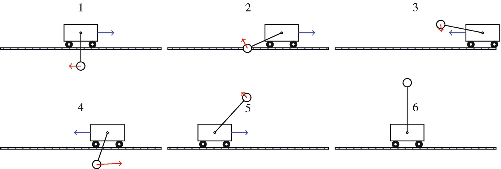
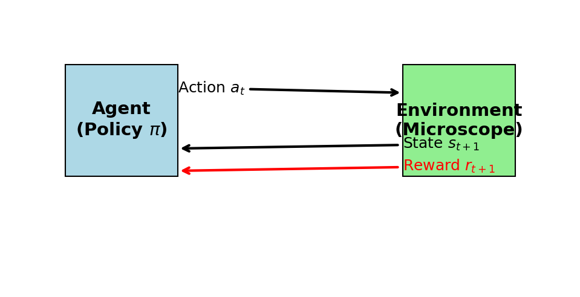
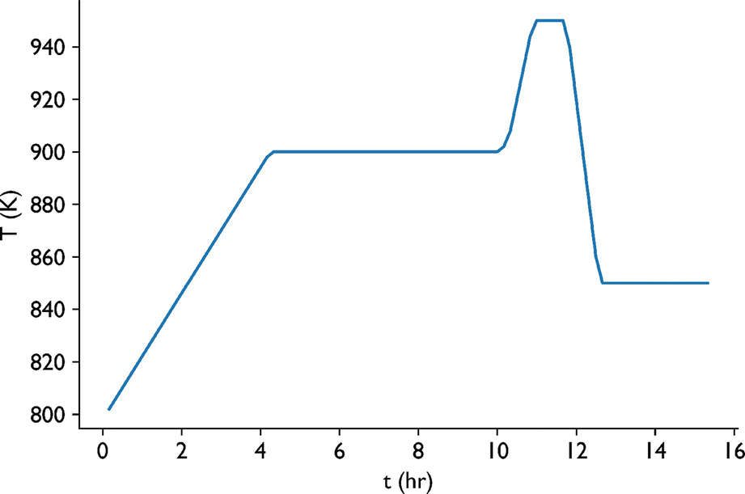
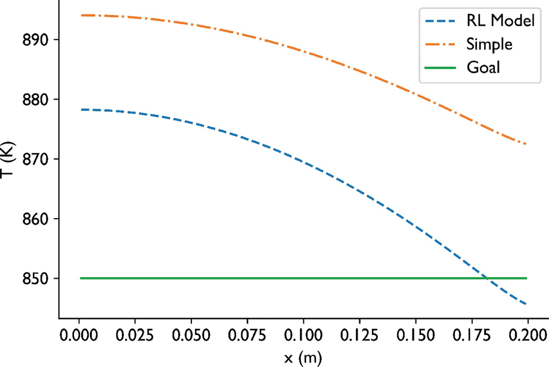
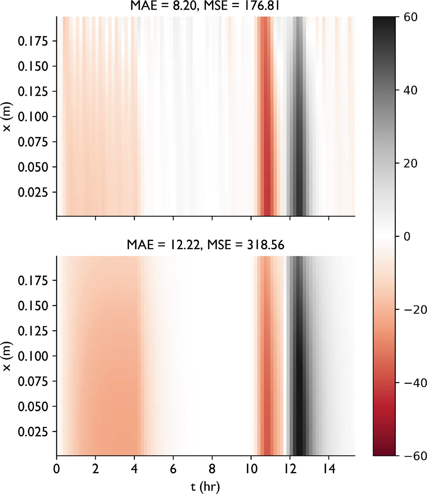

# 01. Intro & Motivation

## The Manual Bottleneck
- Materials science is becoming high-throughput.
- 1000s of samples need characterization.
- Human operators are expensive, prone to fatigue, and introduce bias.
- **Goal**: Self-operating instruments that work 24/7.

## The "Self-Driving" Microscope
- Traditionally: Human $\rightarrow$ Knob $\rightarrow$ Image $\rightarrow$ Interpretation.
- Future: Agent $\rightarrow$ Action $\rightarrow$ Reward $\rightarrow$ Discovery.
- Defining objectives (e.g., "Find all Ni-rich precipitates") instead of commands.

# 02. Instrumentation & Control Basics

## Control Theory: Refresher
- **Feedback**: Measure error, adjust control (e.g., thermostat).
- **Sensors**: Detectors, beam current meters.
- **Actuators**: Lenses, deflector coils, stage motors.

## Why is Microscopy Control Hard?
- **Non-linear response**: Magnetic lenses, saturation.
- **Hysteresis**: Remanent magnetic fields.
- **High-dimensionality**: Aligning an EM has 50+ interactings "knobs."
- **State** $\mathbf{x}_t$: Position, focus, stigmation, illumination.

# 03. Reinforcement Learning (RL) Foundations

## What is Reinforcement Learning?
- (McClarren Ch 9.1)
- Learning by **Trial and Error**.
- No labels needed! Only a **Reward Signal**.
- Agent (ML Model) $\leftrightarrow$ Environment (The Microscope).

::: {.fragment}
{width=80%}
:::

## Key Components: State, Action, Reward
- **State**: What the microscope "sees" (current image/signal).
- **Action**: What the agent "does" (change lens current, move stage).
- **Reward**: A scalar indicating how "good" the action was.
- **Policy** $\pi(s)$: Mapping from state to action.

::: {.fragment}
{width=80%}
:::

## Policy Gradients (The Strategy)
- (McClarren 9.2)
- Turning decisions into a probability distribution.
- Update the NN to make "good" decisions (high reward) more likely.
- **Exploration vs. Exploitation**: Trying new things vs. using what works.

# 04. Automation in Microscopy

## Low-Level Automation: Autofocus
- **Traditional**: Sweep lens current, pick max sharpness.
- **ML**: Learn to jump directly to optimal focus from a single blurry image.
- **Reward**: Image sharpness index (Laplacian, FFT high-freq).

## Beam Alignment & Stigmation
- Correcting for non-circular beams and tilt.
- Agent learns to adjust deflector currents by observing beam shape.
- **ROI Selection**: Automatically finding rare features in large samples.

## Multi-Modal Data Fusion
- Combining Images (SEM), Spectra (EDS), and Diffraction (EBSD).
- **Bayesian Sensor Fusion**: Weighting each sensor by its precision.
- A unified material state vector $z = f(\text{Image}, \text{Spectrum}, \text{EBSD})$.

## UMAP for Streaming Anomaly Triage

::: {.columns}
::: {.column width="55%"}
::: {.fragment}
**The recipe.**

1. Embed each incoming SEM / micrograph frame with the lab's CNN or DINOv2 feature extractor.
2. Maintain a **frozen reference UMAP** [@mcinnes_2018_umap] of the **nominal manifold**, built once on a QC-verified set of frames.
3. Project new frames into that fixed UMAP via `umap-learn`'s `.transform()` — no retraining at deploy time.
4. **Alarm** on frames whose 2-D coordinates land $> \tau$ standard deviations from the nominal centroid, where $\tau$ is set by held-out nominal validation.
5. Operator dashboards display the live UMAP with a coloured trail — the eye picks up drift before the threshold does.
:::
:::

::: {.column width="45%"}
::: {.fragment}
**Why UMAP and not t-SNE.**

- UMAP **preserves global structure** — clusters of different defect types stay separable across runs.
- UMAP is parametric enough to support `.transform()` on new points; **t-SNE cannot** project an unseen frame into a fixed embedding.
- Runs in **seconds on a 1080Ti** for $\sim 10^4$ frames — cheap enough to recompute the reference monthly.
:::
:::
:::

::: {.notes}
**Trade-off vs the §5-style raw AE-residual anomaly score.** UMAP catches *novel-cluster* anomalies — a new defect morphology that lands far from any nominal cluster. The autoencoder-residual score catches *novel-pixel* anomalies — local pixel-level departures. Use both: they cover different failure modes. A frame that scores nominal on AE residual but lands in a sparse UMAP region is exactly the case where a new failure mode is emerging.

**MFML reference.** The UMAP algorithm — fuzzy simplicial sets, cross-entropy on the graph — is in MFML W9. We **use** the result here.

**Anti-pattern.** Training the UMAP on the live deployment stream. The whole point is to have a *fixed* nominal manifold to compare against; refitting on streaming data lets the embedding silently track the drift, defeating the alarm.

**Implementation note.** Cache the fitted `UMAP()` object as a pickle alongside the CNN / DINOv2 weights. Version-pin both. A "tool drift after chamber vent" investigation needs the exact UMAP and feature extractor that were live at the time.
:::

# 05. Case Study: Industrial Glass Cooling

## Why Process Control?
- Automation isn't just for labs; it's for manufacturing.
- (McClarren Ch 9.4)
- Problem: Cooling rate controls chemical reactions and physical stress.

## RL Control Strategy
- **Physics**: Coupled Radiation and Diffusion PDEs.
- **Input**: Current Temp, Target Temp (Future).
- **Action**: Change boundary temperature $\Delta u$.
- **Reward**: Inverse of squared difference from target.

::: {layout-nw="[[1,1], [1]]"}

{width=60%}
:::

- **Outcome**: RL learns to "overheat" to reach targets faster, discovering system lags.

# 06. Synthesis & Self-Driving Labs

## The "Self-Driving Lab" Framework
- Automated Synthesis $\rightarrow$ Automated Characterization $\rightarrow$ ML Analysis $\rightarrow$ Loop.
- Integration of Units 1-14.
- **Challenges**: Software APIs, data standards, and trust.

## Conformal Classification — Emit Prediction Sets, Not Single Labels

::: {.columns}
::: {.column width="55%"}
::: {.fragment}
**The recipe (classification variant).**

- Train any classifier $\hat f$ that emits softmax probabilities.
- On a held-out **calibration set**, compute non-conformity scores

$$s_i = 1 - \hat f_{y_i}(x_i)$$

— one minus the predicted probability of the *true* class.

- Take $\hat q = \text{Quantile}_{(1-\alpha)}(s)$.
- At test time, emit the **prediction set**

$$C(x) = \{\, y : 1 - \hat f_y(x) \le \hat q \,\}.$$

- **Guaranteed coverage**: the true class lies in $C(x)$ on at least $1 - \alpha$ of test inputs [@angelopoulos_2023_conformal].
:::
:::

::: {.column width="45%"}
::: {.fragment}
**Why this matters for automated defect detection.**

- Instead of `class = scratch`, the system emits `class ∈ {scratch, stain} → send to operator`.
- The **set size** *is* a calibrated uncertainty signal — singleton sets mean the model is sure, multi-class sets mean it is not.
- Plays cleanly with the §3-style closed-loop triage: **singleton set → automate**, **multi-class set → escalate**.
:::
:::
:::

::: {.notes}
**Connection to the U12 split-conformal slide.** Unit 12 introduces split conformal for *regression* (intervals around a point estimate). This slide is the *classification* variant — same exchangeability argument, score is one-minus-softmax-of-the-true-class, output is a set instead of an interval.

**Empty-set degenerate case.** If $1 - \hat f_y(x) > \hat q$ for **every** class, the prediction set is empty. Rare on calibrated models, but it happens — and it means the input is extreme OOD. Flag and route to human; do not auto-decide.

**MFML reference.** The exchangeability proof and the finite-sample coverage bound are in MFML W12.

**Anti-pattern.** Using prediction-set size as the *only* uncertainty signal. The marginal coverage guarantee is unconditional on the input — a model can satisfy $\geq 1 - \alpha$ on average while being wildly miscalibrated on individual subgroups (a particular defect class, a particular operator). Always pair with a per-class reliability diagram on a held-out lab-realistic set.

**Practical width.** On a typical 4-class SEM defect classifier with $\alpha = 0.1$ and a calibration set of $\sim 500$ frames, ~70% of test frames get singleton prediction sets (auto), ~25% get 2-class sets (operator-review), ~5% get 3+ class sets (definitely operator). Tune $\alpha$ to the cost ratio: cheaper operator time → lower $\alpha$, larger sets, more automation safety.
:::

## Recap: Unit 11
- RL is the engine of automation.
- **Policy Gradients** bridge control and deep learning.
- **Reward design** is the most critical human task.
- **UMAP** on a frozen nominal manifold gives streaming anomaly triage; **conformal prediction sets** turn classifiers into calibrated automate/escalate decisions.
- Next: Handling the "unknown" (Uncertainty and Gaussian Processes).

<!-- BEGIN prev-next -->

## Continue

- &larr; Previous: [Unit 10b &mdash; Transformers for materials (ViT, Flash Attention, Mamba)](../unit10_transformers_for_materials/transformers_for_materials.html)
- &rarr; Next: [Unit 12 &mdash; Uncertainty-aware regression & Gaussian Processes](../unit12_uncertainty_gp/12_uncertainty_gp.html)
- [All courses](../../index.html)

<!-- END prev-next -->

## References & Further Reading
- **McClarren (2021)**: Ch. 9 (Reinforcement Learning)
- **Murphy (2012)**: Ch. 11 (Data Fusion)
- **Neuer (2024)**: Ch. 7.3 (Automation & Causality)
- **McInnes, Healy & Melville (2018)** — UMAP for streaming anomaly triage [@mcinnes_2018_umap].
- **Angelopoulos & Bates (2023)** — conformal prediction sets for automated defect classification [@angelopoulos_2023_conformal].

::: {#refs}
:::

## Example Notebook

::: {.callout-note icon=false}
## Week 11: Anomaly Detection via Autoencoder — CahnHilliardDataset
[Open rendered notebook →](https://eclipse-lab.github.io/Ai4MatLectures/notebooks/MLPC/week11_anomaly_cahn_hilliard.html)  

:::
