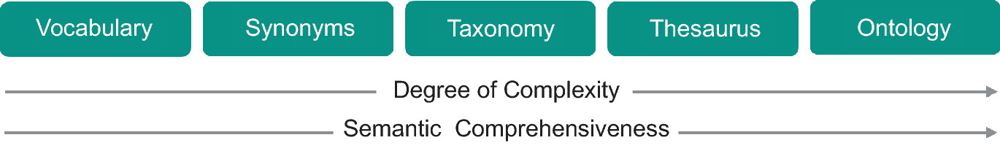
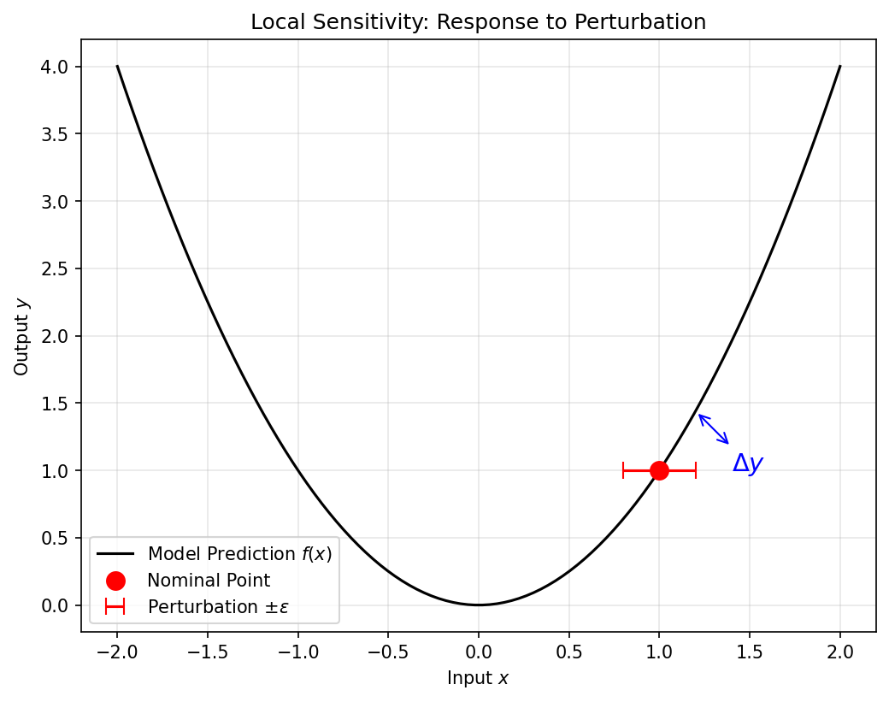
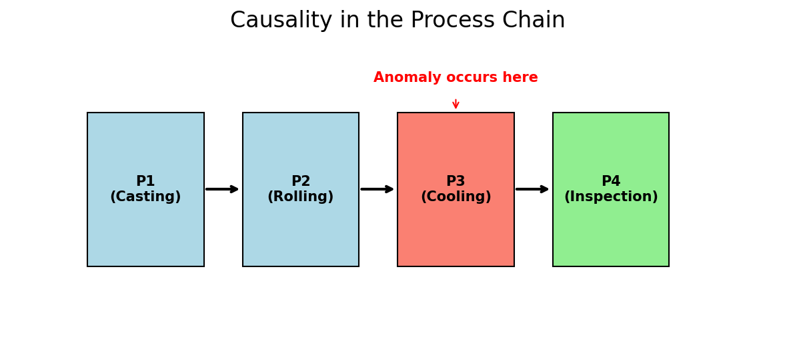
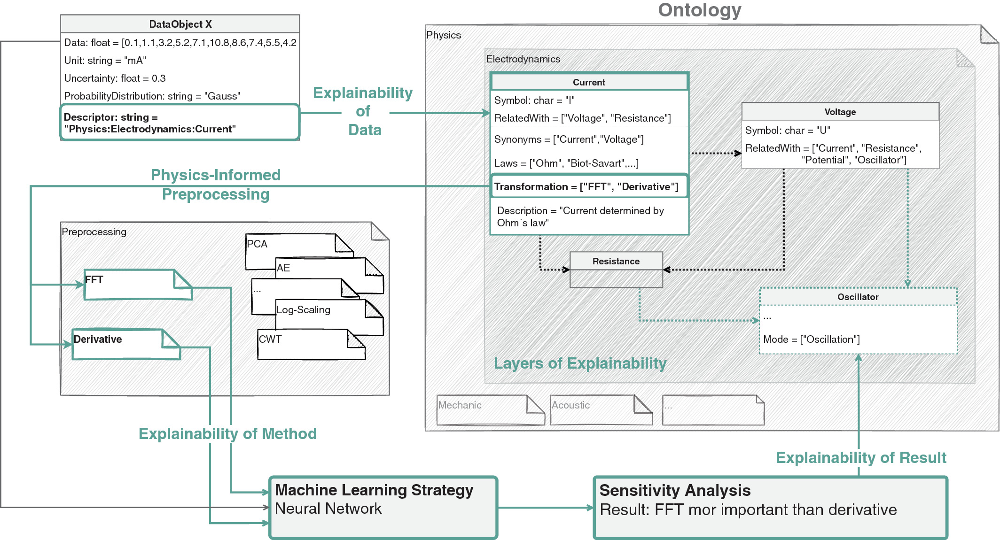

## 01. The AI-Driven Materials Scientist

- Final Recap: From atoms to bits, and back to materials discovery.
- We've covered:
  - Modalities & Physics (Week 2).
  - Pipeline Integrity (Week 3).
  - Deep Learning (Weeks 5-7).
  - Physics-Informed Models (Week 13).
- **Goal**: Reflecting on the "Why" and "What's Next".

## 02. Opening the Black Box: Explainability

- In engineering, knowing "what" will happen is not enough.
- **Trust**: An operator won't stop a machine because a model said "99% error" without a reason.
- **Explainability**: Providing human-interpretable evidence for a model's decision.

::: {.fragment}
{width=80%}
:::

## 03. Sensitivity Analysis (Neuer Ch 7.2)

- **Local Perturbation**:
  - Input: $x_i$.
  - Disturb: $x_i + \epsilon$.
  - Measure: $\Delta y$.
- If a $1^\circ$C change in temperature leads to a 50% change in prediction, the model is either very insightful or very brittle.

::: {.fragment}
{width=80%}
:::

## 04. Global Explanations: SHAP and Integrated Gradients

- **SHAP (Shapley Additive Explanations)**: based on game theory.
  - Quantifies the "fair share" of each feature toward the final prediction.
  - *Materials use*: identifying which chemical element drives corrosion resistance in a high-entropy alloy.
- **Integrated Gradients** [@sundararajan_2017_ig]: integrate the gradient of the model output along the straight path from a baseline $x_0$ to the input $x$:
$$
\mathrm{IG}_i(x) = (x_i - x_{0,i})\int_0^1 \frac{\partial f(x_0 + \alpha (x - x_0))}{\partial x_i}\, d\alpha.
$$
  - Satisfies *completeness*: $\sum_i \mathrm{IG}_i(x) = f(x) - f(x_0)$.
  - *Materials use*: per-pixel attribution for defect segmentation CNNs.

::: {.callout-note}
**Why not LIME?** LIME's ad-hoc perturbations and local linear surrogate fail the basic attribution axioms (completeness, sensitivity) that IG satisfies by construction. The 2026 syllabus uses **SHAP + IG**, not LIME.
:::

---

## 05. Mechanistic Interpretability — What Does the Model *Internally* Represent?

::: {.columns}
::: {.column width="50%"}
**SHAP and IG tell us which inputs matter.** They do *not* tell us *what concept* a hidden layer carries.

- A single neuron in a defect CNN typically encodes **many** unrelated patterns — *polysemanticity* — because the network had more features to learn than neurons available [@elhage_2022_superposition].
- Inspecting "top-activating images per neuron" gives a mosaic, not a concept.

::: {.fragment}
**Sparse Autoencoders (SAEs)** [@templeton_2024_scaling] decompose layer activations $h$ into an over-complete, sparsely active dictionary:
$$
\hat h = D(\mathrm{ReLU}(Eh - b)), \quad \mathcal L = \|h - \hat h\|_2^2 + \lambda \|Eh - b\|_1.
$$
Top-activating inputs *per SAE feature* tend toward **monosemantic** concepts: grain-boundary curvature, oxide stripe orientation, sample-tilt artefact.
:::
:::
::: {.column width="50%"}
**Why this matters for materials certification**

- A QC regulator asks: "what features does your classifier use to call a part *defective*?"
- A SHAP heatmap on *one* image: an anecdote.
- An SAE dictionary on the *model*: a named, auditable concept list.

::: {.fragment}
**An SAE is exactly the Unit-5 autoencoder** plus an $\ell_1$ activation penalty. Architecture unchanged; loss adds one term.
:::

::: {.fragment}
**Honest limits.**

- SAE features are an *interpretation*, not ground truth.
- $\lambda$ is a knob — too small ⇒ polysemantic; too large ⇒ dead features.
- Training cost is comparable to the underlying model.
:::

::: {.callout-note .fragment}
**SHAP/IG: per-prediction explanation. SAE: global model audit.** Different tools, complementary roles. Both are in the 2026 toolbox.
:::
:::
:::

---

## 06. Causality in the Process Chain

- **Correlation != Causality** (Recap from Week 1).
- **Causal Process Chain**:
  - Anomaly detected at Step 10.
  - Cause originated at Step 2.
- **Prediction vs. Detection**: AI must move earlier in the chain to allow for intervention (Neuer Ch 7.3.3).

::: {.fragment}
{width=80%}
:::

## 07. Materials Ontologies: Digitizing Meaning

- Does the computer know what "Quenching" means?
- **Ontology**: A semantic map of materials concepts.
- By connecting "Cooling Rate" to "Dislocation Density", we help the algorithm "reason" like a metallurgist.

::: {.fragment}
{width=80%}
:::

---

## 08. The Limits of AI in Materials

- **Data Bias**: Models are only as good as the history they've seen.
- **Success Bias**: Negative experimental results are rarely published, so AI is blind to failure modes.
- **Physical Hallucinations**: Large models can produce patterns that look plausible but violate thermodynamics.

## 09. The Ethical Cost of AI

- Training massive models consumes energy.
- In scientific ML, **Efficiency** is an ethical requirement.
- **PINNs** (Week 13) are more data-efficient and environmentally "greener" than brute-force NNs.

---

## 10. The Role of the Expert in 2030

- AI handles the **Tedious**: Peak picking, segmentation, data cleaning.
- AI explores the **Vast**: 10-dimensional process maps.
- The Human handles the **Question**: What material do we need to solve the climate crisis?
- The Human handles the **Interpretation**: Does this discovery make physical sense?

## 11. Conclusion: AI 4 Materials

- AI is not a replacement for domain knowledge; it is an **amplifier**.
- Your greatest asset is your ability to bridge the gap between physics and the algorithm.
- **Final Thought**: The best models are those that work in the lab, not just on a benchmark.

## 12. Recap: Unit 13

- Explainability builds engineering trust — **SHAP** for game-theoretic attribution, **Integrated Gradients** for axiomatic per-input gradients. LIME is *out*.
- **Mechanistic interpretability** (SAEs) is the global audit tool — different from SHAP/IG, complementary.
- Causality is the engine of discovery.
- Be aware of the limits: data bias and hallucinations.
- Next: Your mini-projects and the final exam!

---

<!-- BEGIN prev-next -->

## Continue

- &larr; Previous: [Unit 12 &mdash; Physics-informed and constrained ML](../unit12_pinns/13_pinns.html)
- [All courses](../../index.html)

<!-- END prev-next -->

## 13. References & Further Reading

- **Neuer (2024)**: Ch. 7 (Explainability and Semantics)
- **Sandfeld (2024)**: Ch. 1 (Materials Data Science)
- **McClarren (2021)**: Ch. 10 (Future Directions)
- **Sundararajan, Taly & Yan (2017)** — Integrated Gradients with the completeness axiom [@sundararajan_2017_ig].
- **Elhage et al. (2022)** — Toy Models of Superposition: why neurons are polysemantic [@elhage_2022_superposition].
- **Templeton et al. (2024)** — Scaling Monosemanticity: sparse autoencoders at production scale [@templeton_2024_scaling].
