## 01. The course in one map

- Fourteen weeks, twelve units, one arc: **from raw materials data to models you can trust in the lab**.

| | Units | Arc |
|---|---|---|
| **Data** | 1–3 | What makes materials data special, how physics creates it, how quality breaks it |
| **Representations** | 4–5 | From handcrafted microstructure metrics to learned features |
| **Learning under constraints** | 6–9 | Scarcity & transfer, time series, inverse problems, characterization signals |
| **Modern architectures & physics** | 10–11 | Transformers; physics-informed models |
| **Trust** | 12 | Uncertainty you can act on |

## 02. How to use this lecture

- Every unit gets the same four questions:
  1. **What question** did the unit answer?
  2. **What method** answers it — and what is its central equation?
  3. **When do you reach for it** — and where does it break?
  4. **What should you be able to do** in the exam?
- Nothing here is new. If a slide surprises you, that unit needs review.

---

## Unit 1 — What makes materials data special?

**The question:** why is ML on materials data fundamentally different from mainstream ML?

::: {.columns}
::: {.column width="55%"}
- **Small data, high cost**: $10$–$10^3$ samples, not millions.
- **Multi-scale & multi-modal**: images + spectra + logs.
- **Curse of dimensionality**: you cannot sample densely.
- **White / grey / black-box** spectrum — pick by data size and domain knowledge.
- **CRISP-DM** structures the project, question → deployment.
- Correlation $\neq$ causation; leakage lurks in metadata.

The grey-box strategy [@neuer2024machine; @sandfeld_materials_data_science]:
$$
\sigma_y(c) = \underbrace{\Delta\sigma_{\text{SSS}}(c; \varepsilon, G)}_{\text{physics baseline}} + \underbrace{f_{\text{ML}}(c)}_{\text{data-driven residual}}
$$
:::
::: {.column width="45%"}
![The course's recurring dataset: hardness vs. tempering temperature with 95% confidence intervals — process→property regression with real measurement uncertainty [@Mantzoukas_2021_17709].](images/unit01_mantzoukas_tempering_diagram.png){width="85%" fig-align="center"}
:::
:::

## Unit 1 — Use it when, where it breaks

::: {.columns}
::: {.column width="50%"}
**Reach for it when**

- Starting any project: simple baseline first — Occam's razor applies to materials ML.
- Domain knowledge exists but data is too scarce for black-box learning → grey-box.
- Before collecting data: CRISP-DM phase 1 defines the scientific ROI.
:::
::: {.column width="50%"}
**Classic pitfalls**

- Sparse high-dimensional data: no model fills a space the experiments never sampled.
- Leakage via metadata — the network learns the microscope, not the material.
- Spurious correlation from confounders masquerading as physics.
:::
:::

::: {.callout-tip}
## You should be able to
Classify the challenges of a given materials dataset (small $n$, noise, multi-modality); choose white-, grey-, or black-box modeling for a project; structure it with CRISP-DM.
:::

---

## Unit 2 — Physics of data formation

**The question:** how does the physical chain from material property to digital number dictate model and loss design?

- The **measurement chain**: physical state → probe → transducer → ADC → digital value.
- **Nyquist–Shannon** and aliasing: sampling sets a hard resolution limit.
- **Point spread function**: every image is the object blurred by the instrument.
- **Noise models**: Gaussian (thermal), Poisson (shot noise), Weibull (failure statistics).
- **Bayes' theorem** unifies loss functions: likelihood = noise model, prior = physics.
- **Compressed sensing**: sub-Nyquist sampling bought with sparsity priors.

## Unit 2 — The key equations

::: {.columns}
::: {.column width="55%"}
The imaging equation — the most important of the unit [@neuer2024machine]:
$$
y(\mathbf{r}) = (h \ast x)(\mathbf{r}) + n(\mathbf{r})
$$

Bayes' theorem, which turns the noise model into the loss function:
$$
P(\boldsymbol{\theta} \mid \mathbf{X}) = \frac{P(\mathbf{X} \mid \boldsymbol{\theta})\, P(\boldsymbol{\theta})}{P(\mathbf{X})}
$$

- MSE **is** the Gaussian likelihood; Poisson data needs a Poisson NLL.
- Diagnose with a variance–mean plot: $\sigma^2 \propto \mu$ means shot noise.
:::
::: {.column width="45%"}
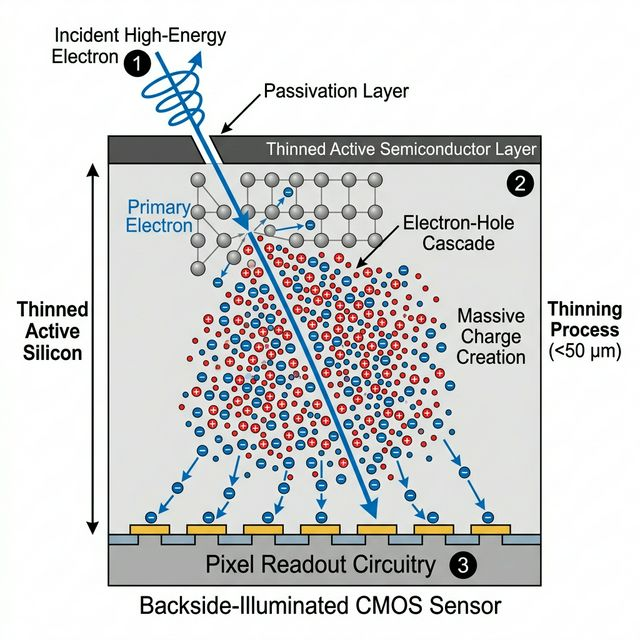{width="80%" fig-align="center"}
:::
:::

## Unit 2 — Use it when, where it breaks

::: {.columns}
::: {.column width="50%"}
**Reach for it when**

- Before any model: characterize PSF, noise model, and dynamic range.
- Low-dose EM/X-ray data → Poisson NLL, not MSE.
- Dose-limited acquisition → compressed sensing with a sparsity prior instead of blind oversampling.
:::
::: {.column width="50%"}
**Classic pitfalls**

- MSE on Poisson data systematically underpredicts counts.
- Aliasing, jitter, and PSF are physics, not artifacts — no network recovers what the sensor never recorded.
- Trusting PCA components as physical modes without validation.
:::
:::

::: {.callout-tip}
## You should be able to
Match the five probes (electrons, photons, ions, neutrons, forces) to data formats and architectures; apply Nyquist–Shannon to judge sampling adequacy; choose the loss function from the physical noise process.
:::

---

## Unit 3 — Data quality, labels, and leakage

**The question:** how do you turn raw, messy experimental data into clean training tensors — and prove your model learned physics, not an artifact?

- **GIGO**: data quality bounds model quality; errors enter at sensor, transmission, storage, and human handling.
- **Cleaning**: missing values, outliers, duplicates — repaired by physics, not reflex.
- **Transforms**: centering, standardization, log, FFT, wavelets — each required by specific algorithms.
- **Label uncertainty**: inter-annotator disagreement is measurement noise, and it caps model performance.
- **Leakage**: via preprocessing, temporal ordering, and group structure.

## Unit 3 — The key equations

- Standardization $z_i = (x_i - \mu)/\sigma$ — required by every distance-based and regularized method.

The bias–variance decomposition for $y = f(x) + \varepsilon$ — why validation design matters [@sandfeld_materials_data_science]:
$$
\mathbb{E}[(\hat{y} - y)^2] = \bigl(\mathbb{E}\hat{y} - f(x)\bigr)^2 + \mathrm{Var}(\hat{y}) + \sigma^2
$$

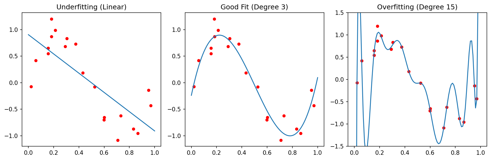{width="65%" fig-align="center"}

## Unit 3 — Use it when, where it breaks

::: {.columns}
::: {.column width="50%"}
**Reach for it when**

- Always: inspect → clean → transform → validate, in that order.
- Grouped data (many measurements per specimen) → group-based k-fold.
- Process data → time-aware splits; imbalanced classes → stratified folds.
- Report confusion matrix and residual plots — never a single metric.
:::
::: {.column width="50%"}
**Classic pitfalls**

- Fitting the scaler on train+test together — test statistics leak into training.
- Random k-fold on grouped data can inflate scores dramatically — the leak hides until deployment.
- Removing "outliers" by 3$\sigma$ rule deletes the rare physical events you were looking for.
:::
:::

::: {.callout-tip}
## You should be able to
Diagnose data-quality problems and justify each repair; explain why a given transform is needed for a given algorithm; design leakage-free validation for grouped and temporal data.
:::

---

## Unit 4 — From microstructure metrics to learned representations

**The question:** how do we encode micrographs and signals so the decision-relevant information survives — beyond a single stereological scalar?

- **Information bottleneck**: collapsing a micrograph to one scalar discards most learnable physics.
- The **encoding is an upper bound** on what any model can learn.
- Structured representations: two-point statistics $S_2$, eigen-modes, learned embeddings.
- **Convolutional inductive bias** matches the translation invariance of micrographs.
- **Specimen-level splits** and cross-instrument **lab shift** decide whether results are real.

## Unit 4 — The key method

Two-point statistics generalize stereology [@sandfeld_materials_data_science]:
$$
S_2(\mathbf{r}) = P\!\bigl(\text{phase}(\mathbf{x})=\alpha \,\wedge\, \text{phase}(\mathbf{x}+\mathbf{r})=\alpha\bigr)
$$

![The hero result that motivated the unit: a fully convolutional network reaches 93.94% on steel constituent classification where classical pipelines reached 48.9% — the representation change alone unlocks the gain [@azimi2018advanced].](images/unit04_azimi2018_fcnn.jpeg){width="70%" fig-align="center"}

## Unit 4 — Use it when, where it breaks

::: {.columns}
::: {.column width="50%"}
**Reach for it when**

- $N < 500$ specimens or audits required → tabular composition + process features.
- $N \approx 10^2$–$10^3$ and translation invariance holds → $S_2$ / MKS pipeline.
- $N \gtrsim 10^3$ or simulation augmentation available → CNN on raw images.
- Spectra (XRD, EELS, Raman) → 1-D CNN along the physical axis.
:::
::: {.column width="50%"}
**Classic pitfalls**

- Random patch splits hide specimen correlation — specimen-level splits are mandatory.
- Lab shift: $R^2 = 0.88$ on microscope A becomes $0.45$ on microscope B.
- 2% defect prevalence collapses recall to zero under accuracy-driven losses — use F1 / PR-AUC.
:::
:::

::: {.callout-tip}
## You should be able to
Quantify what a stereological scalar throws away; choose an encoding from $N$, physics, and regulatory context; name three failure modes that erase apparent CNN gains.
:::

---

## Unit 5 — Unsupervised learning: clustering & autoencoders

**The question:** how do we discover structure in unlabeled materials data?

- **K-means / GMM**: hard and soft clustering with interpretable centroids.
- **Frozen CNN embeddings** as feature spaces for unsupervised phase and defect discovery.
- **Hyperspectral pixel clustering**: flatten the datacube, cluster spectra, reimage as phase maps.
- **Convolutional autoencoders**: continuous representation learning through a bottleneck.
- **Reconstruction error** doubles as an anomaly score.

## Unit 5 — Method I: clustering

The K-means objective [@bishop2006pattern]:
$$
\min_{\{\mu_k\},\, \{c_i\}} \sum_{i=1}^{N} \|\mathbf{x}_i - \mu_{c_i}\|_2^2
$$

- Select $k$ with silhouette, elbow, or BIC — and be able to defend the choice.

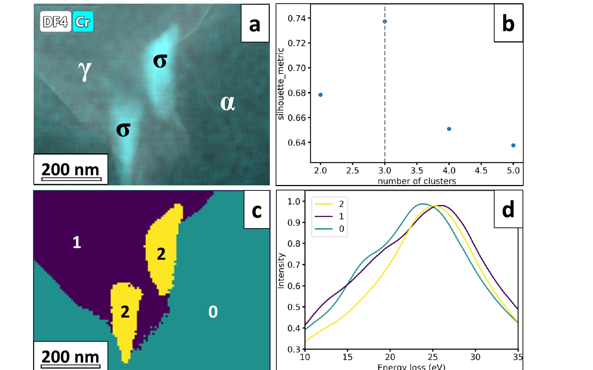{width="55%" fig-align="center"}

## Unit 5 — Method II: representations & autoencoders

Autoencoder objective and its anomaly score [@goodfellow2016deep]:
$$
\min_\theta\; \mathbb{E}_{x \sim \mathcal{D}}\, \|x - g_\theta(f_\theta(x))\|_2^2,
\qquad
a(x) = \|x - g_\theta(f_\theta(x))\|^2
$$

- The bottleneck dimension is an inductive bias: too small underfits structure, too large learns the identity.

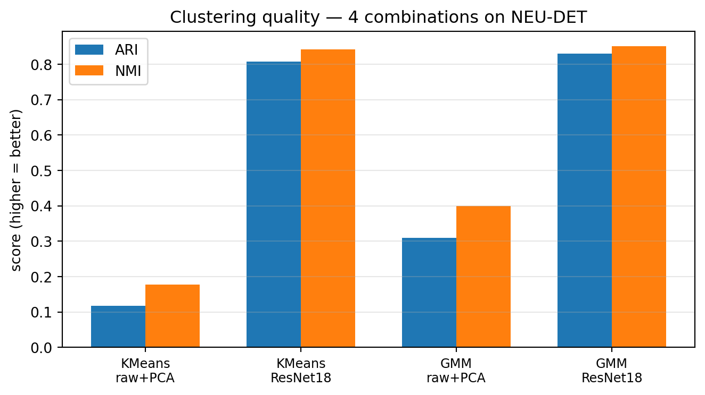{width="55%" fig-align="center"}

## Unit 5 — Use it when, where it breaks

::: {.columns}
::: {.column width="50%"}
**Reach for it when**

- Discrete phases with clear separation and no labels → K-means / GMM.
- Scarce labels but transferable morphology → cluster frozen CNN embeddings.
- Continuous variation along a processing axis → autoencoder latents.
- Rare, diverse, unlabeled anomalies → AE reconstruction error.
:::
::: {.column width="50%"}
**Classic pitfalls**

- Forcing clusters onto continuous structure (silhouette $< 0.25$) — switch to continuous representations.
- ImageNet features can mismatch specialized modalities — inspect cluster exemplars.
- Anomaly-detection AEs need strictly nominal training data; never tune thresholds on anomalies.
:::
:::

::: {.callout-tip}
## You should be able to
Run K-means/GMM with a defensible $k$; cluster CNN embeddings and hyperspectral pixels and interpret the results; train an AE, pick the bottleneck, and deploy it as an anomaly detector with a nominal-only threshold.
:::

---

## Unit 6 — Data scarcity & transfer learning

**The question:** how can deep models work with 50–500 labeled micrographs instead of millions?

::: {.columns}
::: {.column width="55%"}
- **Transfer learning**: ImageNet features transfer because early layers are generic — transferability falls with depth (Yosinski curve) [@yosinski2014transferable].
- **Differential learning rates** protect pretrained features:
$$
\text{lr}_{\text{backbone}} = \frac{\text{lr}_{\text{head}}}{100}
$$
- **Augmentation** must preserve the physics — rotation is illegal if direction matters.
- **Synthetic data**: powerful pretraining, but $p_{\text{synth}}(x) \neq p_{\text{real}}(x)$ — the generator fails exactly on what it omits.
:::
::: {.column width="45%"}
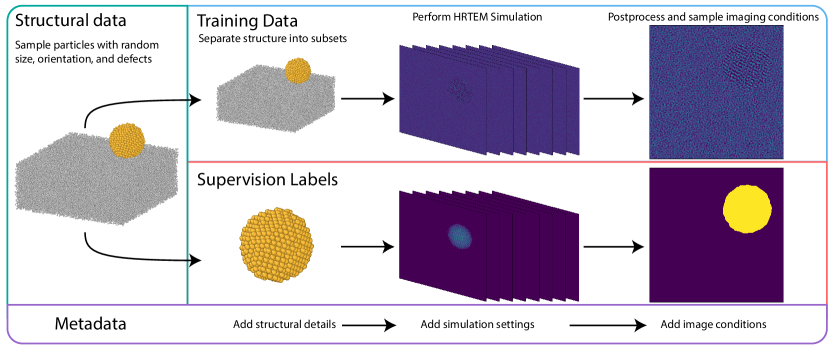{width="100%" fig-align="center"}
:::
:::

## Unit 6 — Use it when, where it breaks

::: {.columns}
::: {.column width="50%"}
**Reach for it when**

- $< 100$ labels, small domain gap → frozen feature extraction.
- $10^2$–$10^3$ labels, real domain gap → fine-tuning with differential learning rates.
- The generator captures the task physics → synthetic pretraining, then fine-tune on real labels.
:::
::: {.column width="50%"}
**Classic pitfalls**

- Specimen leakage: crops of one sample on both sides of the split.
- Augmenting before splitting measures memorization, not generalization.
- Full-backbone training at head learning rate → catastrophic forgetting.
- Frozen backbones with ImageNet batch-norm statistics silently corrupt features.
:::
:::

::: {.callout-tip}
## You should be able to
Explain why ImageNet features transfer despite the domain gap; design a physically valid augmentation pipeline; choose feature extraction vs. fine-tuning from data size and domain gap; diagnose sim-to-real failure modes.
:::

---

## Unit 7 — Time series & process monitoring

**The question:** how do we forecast the next observation in a process stream *with calibrated uncertainty*, so the forecast can drive decisions?

- **LSTM/GRU**: gated memory solves vanishing gradients over long sequences [@hochreiter1997lstm].
- **Aleatoric vs. epistemic** uncertainty — sensor noise vs. model ignorance.
- **Probabilistic heads** (Gaussian, mixture density) output distributions, not points.
- **Calibration**: a 90% interval must contain 90% of outcomes — check it, then recalibrate.
- **Anomaly detection** by thresholding the predictive likelihood.

## Unit 7 — The key equations

::: {.columns}
::: {.column width="55%"}
The LSTM cell update whose *additive* structure lets gradients flow through time:
$$
C_t = f_t \odot C_{t-1} + i_t \odot \tilde C_t
$$

Heteroscedastic Gaussian NLL — fit the mean *and* an honest variance:
$$
-\log p(x_{t+1}\mid \mu_t, \sigma_t^2) = \tfrac{(x_{t+1}-\mu_t)^2}{2\sigma_t^2} + \tfrac{1}{2}\log\sigma_t^2 + \mathrm{const.}
$$

- Epistemic part from deep ensembles or MC dropout [@gal2016dropout; @lakshminarayanan2017simple].
:::
::: {.column width="45%"}
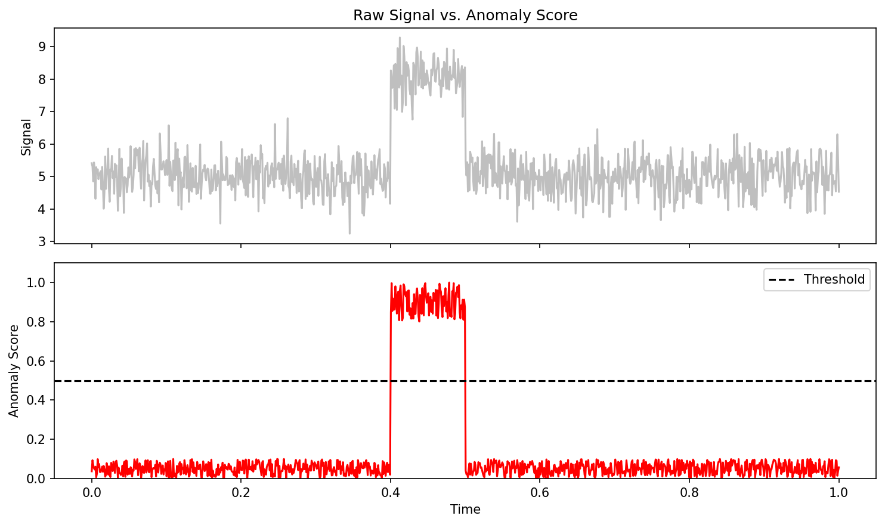{width="95%" fig-align="center"}
:::
:::

## Unit 7 — Use it when, where it breaks

::: {.columns}
::: {.column width="50%"}
**Reach for it when**

- Streaming, time-ordered process data (AM, rolling, heat treatment).
- The decision needs an interval, not a point forecast.
- Online anomaly detection where confidence matters as much as the mean.
:::
::: {.column width="50%"}
**Classic pitfalls**

- Deterministic LSTMs minimize MSE and report false certainty.
- Windowing before splitting → near-identical windows in train and test.
- PyTorch's built-in LSTM dropout does not share masks across time — naive MC dropout is silently wrong.
:::
:::

::: {.callout-tip}
## You should be able to
Separate aleatoric from epistemic uncertainty and estimate each; train an LSTM with an NLL head and produce calibrated intervals; read a calibration plot and recalibrate; set anomaly thresholds via predictive likelihood.
:::

---

## Unit 8 — Inverse problems & process maps

**The question:** how do we reverse the physics arrow — inferring process parameters from desired properties — when that problem is fundamentally ill-posed?

- **Hadamard's three conditions**: existence, uniqueness, stability — inverse problems violate them.
- **Regularization is prior knowledge**: Tikhonov, sparsity, physics constraints.
- **Process maps**: safe operating windows as intersections of defect-mechanism boundaries.
- **Inverse PINNs**: infer unknown material parameters with the PDE as regularizer.
- **SINDy**: discover the governing equation itself by sparse regression on a term library.

## Unit 8 — The key equations

::: {.columns}
::: {.column width="55%"}
The regularized inverse problem [@neuer2024machine]:
$$
\hat{\mathbf{x}} = \arg\min_{\mathbf{x}} \|f(\mathbf{x}) - \mathbf{y}_\text{obs}\|^2 + \lambda R(\mathbf{x})
$$

SINDy — the governing equation as a sparse combination of library terms [@brunton2016sindy]:
$$
\frac{d\mathbf{x}}{dt} = \boldsymbol{\Theta}(\mathbf{x})\,\boldsymbol{\xi}
$$
:::
::: {.column width="45%"}
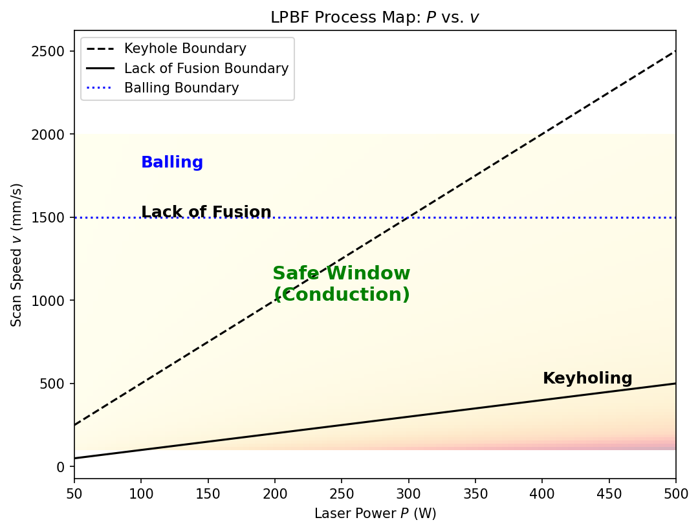{width="85%" fig-align="center"}
:::
:::

## Unit 8 — Use it when, where it breaks

::: {.columns}
::: {.column width="50%"}
**Reach for it when**

- Linear/mildly nonlinear inversion with known priors → Tikhonov / LASSO.
- Known governing equations, unknown parameters → inverse PINN.
- Unknown equations, interpretability required → SINDy / symbolic regression.
- Robust manufacturing design → process maps with tolerance corridors.
:::
::: {.column width="50%"}
**Classic pitfalls**

- Non-uniqueness: MSE-trained networks return the *mean* of valid solutions — often infeasible.
- Small singular values amplify noise catastrophically; instability is intrinsic, not a bug.
- SINDy confidently fits a wrong equation if the true term is missing from the library.
:::
:::

::: {.callout-tip}
## You should be able to
Explain Hadamard's conditions with a materials example for each failure; compute a safe operating window from constraint boundaries; formulate an inverse-PINN loss; design and critique a SINDy library.
:::

---

## Unit 9 — ML for characterization signals

**The question:** how does probe physics (XRD, EELS, EDX, XPS, Raman) dictate a defensible pipeline that outputs materials answers, not latent coordinates?

- **Physics dictates preprocessing**: power-law background for EELS, bremsstrahlung for EDX, Shirley for XPS.
- **Calibrate the axis first**, or the model learns instrumental drift instead of chemistry.
- **Poisson noise vs. systematic error**: only one of them averages away.
- **Latent coordinates are not physical quantities** — quantification needs constrained fits.
- **Compression erases rare phases** — discoveries hide in the residual.

## Unit 9 — The key method

Linear spectral unmixing — and its fundamental ambiguity [@kotula2006mcr]:
$$
\mathbf{X} = \mathbf{C}\mathbf{S}^\top + \mathbf{E},
\qquad
\mathbf{X} = (\mathbf{C}\mathbf{T})(\mathbf{T}^{-1}\mathbf{S}^\top)
$$

- Any invertible $\mathbf{T}$ fits equally well: **rotational ambiguity**. Physical constraints — non-negativity, closure, selectivity, known spectra — collapse the feasible band.
- Denoising by weighted PCA with optimal truncation [@potapov2019pca]; keep the residual channel for anomaly detection.

{width="95%" fig-align="center"}

## Unit 9 — Use it when, where it breaks

::: {.columns}
::: {.column width="50%"}
**Reach for it when**

- Choosing preprocessing: match the background model to the modality's physics.
- Denoising spectrum images → weighted PCA with noise-aware truncation.
- Hunting rare phases → anomaly detection on reconstruction *residuals*.
:::
::: {.column width="50%"}
**Classic pitfalls**

- A 2–3% background-model error is *systematic* — more averaging never removes it, and it dominates the uncertainty budget.
- PCA/AE denoising is structurally blind to rare phases and erases them.
- A latent that separates oxidation states still isn't a calibrated valence.
:::
:::

::: {.callout-tip}
## You should be able to
Build and justify a preprocessing pipeline for a given modality; explain rotational ambiguity and name constraints that resolve it; decompose an uncertainty budget into random and systematic parts and say which dominates.
:::

---

## Unit 10 — Transformers for materials characterization

**The question:** how do transformers capture long-range correlations in diffraction patterns, spectra, and process sequences — and when do they beat CNNs?

- **Attention is global mixing**: every token sees every other token in one layer.
- **Tokenization + positional encoding** map physical axes (detector, energy, layer index) into the model.
- **ViT**: images as patch sequences [@dosovitskiy_2021_vit].
- **Flash Attention** makes long sequences affordable [@dao_2022_flashattention].
- **Pretrain → fine-tune** is the default recipe under materials-scale label budgets.

## Unit 10 — Method I: attention

Scaled dot-product attention — the core mechanism [@vaswani_2017_attention]:
$$
\mathrm{Attn}(Q, K, V) = \mathrm{softmax}\!\left(\frac{QK^\top}{\sqrt{d_k}}\right) V
$$

- A CNN needs $\sim L/2$ stacked $3{\times}3$ layers to connect antipodal Bragg discs; attention does it in one.

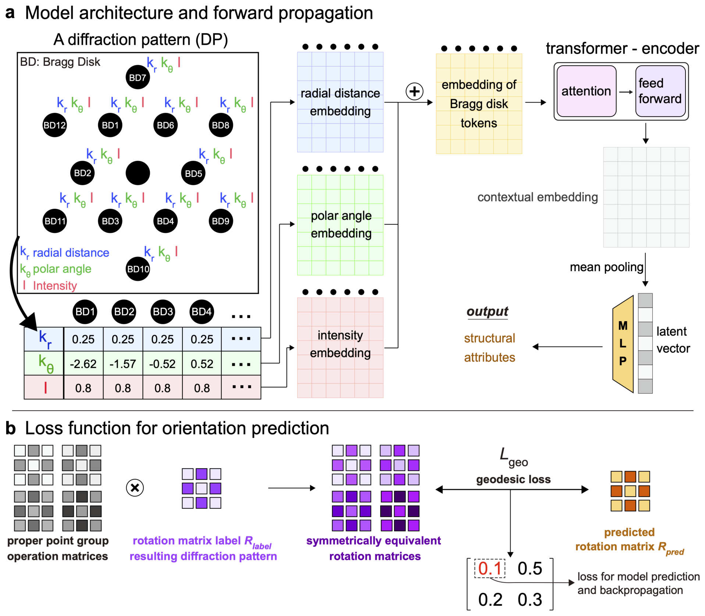{height="500px" fig-align="center"}

## Unit 10 — Method II: efficiency & the training recipe

Flash Attention: tiled computation with online softmax in SRAM
$$
\mathcal{O}(L^2) \;\to\; \mathcal{O}(L) \quad \text{in memory}
$$

- The label-scarce recipe: collect unlabeled data → self-supervised pretraining (MAE, DINOv2) → freeze backbone → fine-tune the head on 50–500 labels with group-wise splits.

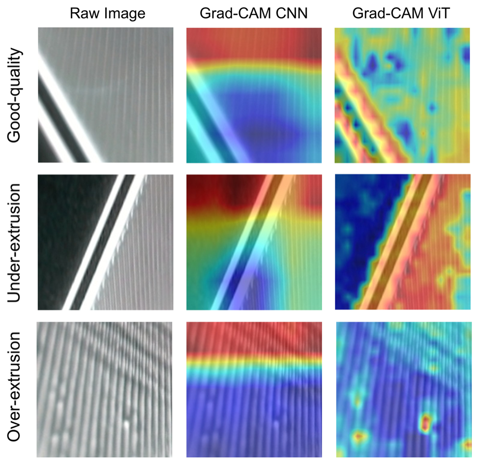{height="520px" fig-align="center"}

## Unit 10 — Use it when, where it breaks

::: {.columns}
::: {.column width="50%"}
**Reach for it when**

- Diffraction tasks where antipodal disc pairs and long-range geometry matter.
- Spectra with fine-structure correlations spanning hundreds of channels.
- Layer-to-layer continuity in tomography stacks or AM build histories.
:::
::: {.column width="50%"}
**Classic pitfalls**

- Dropped or shuffled positional encodings → a silently permutation-invariant model.
- Absolute coordinates on crystals break translational invariance — encode periodicity instead.
- ViT from scratch on $< 10^4$ labels loses to ResNet18 — pretraining is not optional.
- Dose mismatch between training and deployment fails silently.
:::
:::

::: {.callout-tip}
## You should be able to
Explain the receptive-field argument for attention on diffraction data; choose tokenization and positional encoding per modality; implement the pretrain→fine-tune recipe; decide transformer vs. CNN vs. GNN from data size and relationship range.
:::

---

## Unit 11 — Physics-informed and constrained ML

**The question:** how do we make networks respect physical constraints, so they cannot hallucinate impossible predictions?

- **Soft constraints**: penalty terms in the loss (phase-library membership, conservation laws).
- **Hard constraints**: built into the architecture (Lagaris substitution, softplus-increment monotonicity).
- **PINNs**: data + PDE residual + boundary conditions in one composite loss.
- **Equivariant architectures** vs. data augmentation for symmetry.
- **Neural operators** (FNO/PINO): learn parametric *families* of PDEs [@li_2024_pino].

## Unit 11 — Method I: the PINN composite loss

$$
J = J_{\text{data}} + \lambda\, J_{\text{phys}} + \lambda_b\, J_{\text{BC}}
$$

- Autodiff evaluates the PDE residual on dense collocation points; sparse measurements anchor the data term — that's how a handful of pyrometer readings becomes a dense temperature field.

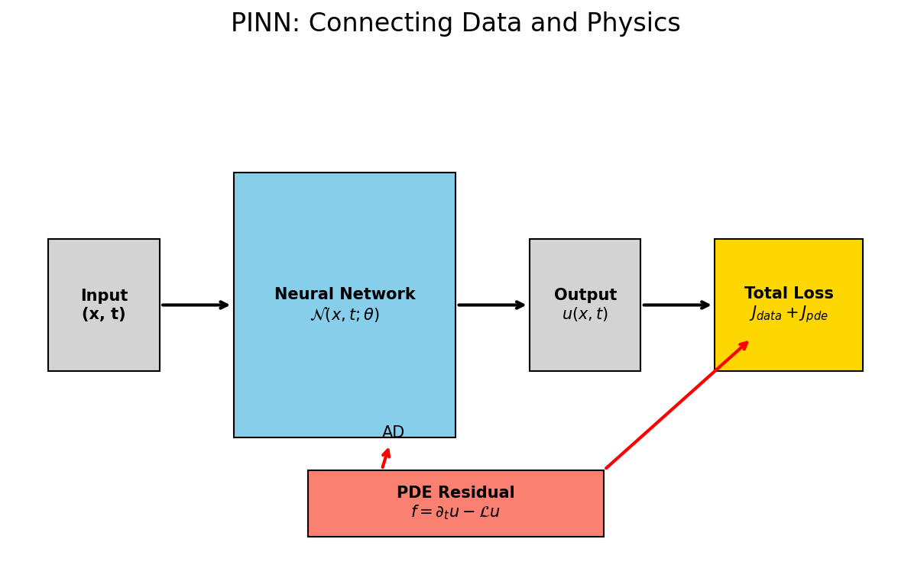{width="55%" fig-align="center"}

## Unit 11 — Method II: constraint patterns

- **Pattern A** — soft penalty: quick, approximate, tunable via $\lambda$.
- **Pattern B** — full PINN: known PDE + sparse data → dense super-resolution *between* measurements.
- **Pattern C** — symmetry: augmentation (cheap, approximate) vs. equivariant architecture (exact, costly).
- **Pattern D** — structural: softplus increments make monotonicity mathematically exact.
- **Neural operators** solve whole families of boundary conditions and geometries at inference speed.

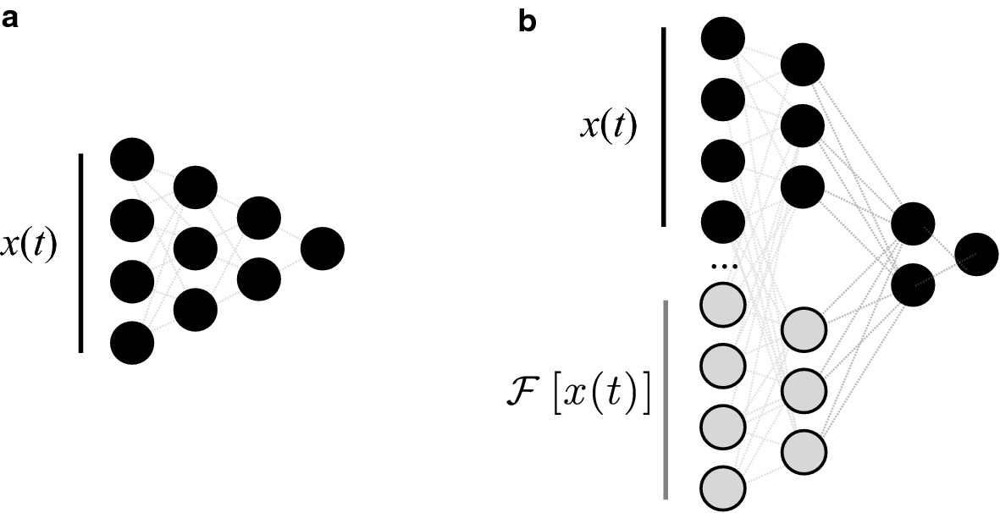{width="55%" fig-align="center"}

## Unit 11 — Use it when, where it breaks

::: {.columns}
::: {.column width="50%"}
**Reach for it when**

- Approximate, easy-to-encode constraints → soft penalties.
- Known PDE + sparse sensors → PINN super-resolution.
- Parametric PDE families (varying BCs, geometries) → neural operators.
- Exactness required → hard structural constraints, not penalties.
:::
::: {.column width="50%"}
**Classic pitfalls**

- **Gradient pathology**: one loss term dominates by orders of magnitude — non-dimensionalize or reweight, don't just raise $\lambda$.
- Constraint conflicts (physics says $A \geq 0$, data says otherwise) signal calibration drift or wrong physics — diagnose, don't suppress.
- Constraints can mask architecture bugs: if removing them yields nonsense, fix the inductive bias.
:::
:::

::: {.callout-tip}
## You should be able to
Explain how a phase-library penalty prevents impossible XRD predictions; write the three-term PINN loss and state when collocation super-resolution is valid; trade augmentation against equivariance; diagnose gradient pathology.
:::

---

## Unit 12 — Uncertainty-aware regression & Gaussian Processes

**The question:** which regions of a process are safe to operate without more experiments — and how confident are you in that answer?

- **Honest UQ is a deployment requirement**, not an ornament.
- **Gaussian Processes**: closed-form Bayesian regression for small tabular data.
- **MC Dropout**: per-pixel epistemic uncertainty from an already-trained CNN.
- **Calibration**: reliability diagrams + temperature scaling before anything ships.
- **Active learning**: spend the experiment budget where $\sigma$ is largest.
- **OOD detection**: refuse to predict when the input drifts off-distribution.

## Unit 12 — Method I: Gaussian Processes

::: {.columns}
::: {.column width="52%"}
The RBF kernel, whose length scale $\ell$ is a *physical* correlation length:
$$
k_{\text{RBF}}(T, T') = \sigma_f^2 \exp\!\left(-\frac{(T - T')^2}{2\,\ell^2}\right)
$$

The acquisition function that turns $\sigma$ into an experiment plan:
$$
\alpha_{\text{UCB}}(P,v) = \mu(P,v) + \beta\,\sigma(P,v)
$$
:::
::: {.column width="48%"}
![The core GP deliverable on the 21CrMoV5-7 hardness data: the confidence band narrows at the five sampled temperatures and widens between them [@Mantzoukas_2021_17709].](images/unit12_gp_17709_fit.png){width="90%" fig-align="center"}
:::
:::

## Unit 12 — Method II: uncertainty for deep networks

MC Dropout at inference: average $T$ stochastic passes, report per-pixel entropy [@gal2016dropout]:
$$
\bar{p}_{i,c} = \tfrac{1}{T}\sum_t p_{i,c}^{(t)},
\qquad
H_i = -\sum_c \bar{p}_{i,c} \log \bar{p}_{i,c}
$$

- Deep ensembles ($M \in [5,10]$) remain the empirical gold standard for NN calibration [@lakshminarayanan2017simple].

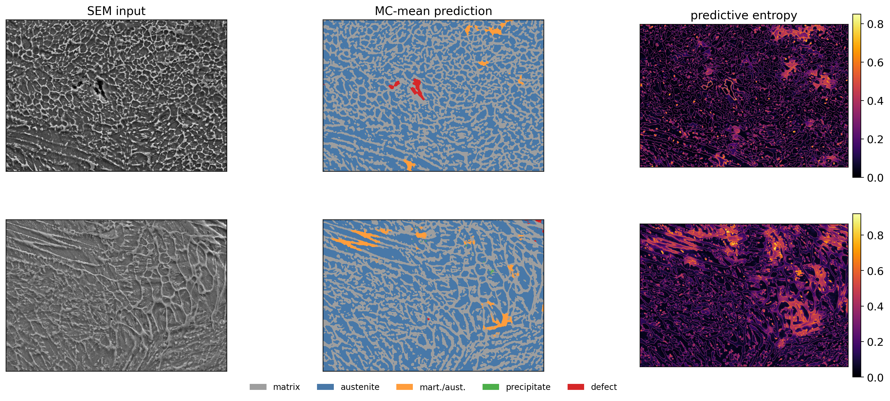{width="75%" fig-align="center"}

## Unit 12 — Use it when, where it breaks

::: {.columns}
::: {.column width="50%"}
**Reach for it when**

- Tabular regression, $n \in [10, 300]$ → GP (Matérn $\nu = 5/2$) with interpretable length scales.
- Trained CNN needs per-pixel uncertainty → MC Dropout ($T \approx 30$), no retraining.
- High-stakes prediction with retraining budget → deep ensembles.
- Process-window exploration → active learning with UCB/EI; the unit's L-PBF case study mapped the window with 31 experiments instead of a 196-point grid.
:::
::: {.column width="50%"}
**Classic pitfalls**

- Raw softmax as confidence: modern NNs are systematically overconfident — temperature scaling is mandatory.
- Calibrating on a random split misses the distribution shift that breaks deployment.
- Calibration does not fix OOD: a perfectly calibrated model still needs a detector to refuse off-distribution inputs.
:::
:::

::: {.callout-tip}
## You should be able to
Choose a UQ method per task and budget; fit and physically interpret a GP; build and audit an active-learning loop; construct a reliability diagram and apply temperature scaling.
:::

---

## Synthesis {background-color="#1a1a2e"}

### One course, one decision guide {style="text-align: center; margin-top: 15%;"}

## The decision guide — which tool for which problem?

| Your situation | Reach for | Unit |
|---|---|---|
| Tabular, small $n$, need error bars | Gaussian Process | 12 |
| Trained NN, need cheap per-pixel uncertainty | MC Dropout / deep ensembles | 12 |
| Few labels, related big dataset exists | Transfer learning + differential LRs | 6 |
| No labels at all | Clustering, CNN embeddings, autoencoders | 5 |
| Spectra / diffraction with known probe physics | Physics-matched preprocessing + constrained unmixing | 9 |
| Streaming sensor data, decisions on forecasts | Probabilistic LSTM + calibration | 7 |
| Properties known, parameters wanted | Regularized inversion, inverse PINN, SINDy | 8 |
| Known PDE, sparse sensors | PINN super-resolution | 11 |
| Long-range correlations, pretraining available | Transformers (ViT + Flash Attention) | 10 |
| Micrographs → properties | Representation choice by $N$: $S_2$ → CNN | 4 |

## The two questions that precede every model

- **Where did this data come from?**
  - Units 1–3: the physics of formation, the noise model, the leakage paths. Most project failures happen here — before any model is trained.
- **How wrong can I afford to be?**
  - Unit 12: calibrated uncertainty is what turns a prediction into a decision. Without it, a forecast is a suggestion.

---

## What happens next

- **Mini-projects**: apply at least two units of this course to one materials dataset — the rubric rewards *justified* method choice over exotic methods.
- **Exam**: the "you should be able to…" checkpoints in this deck are the coverage map.
- Full mathematical depth for every method: the MFML lecture notes and the course notebooks at [ECLIPSE-Lab/Ai4MatLectures](https://github.com/ECLIPSE-Lab/Ai4MatLectures).

## Closing thought

- ML did not replace the materials scientist this semester — it **amplified** one.
- The skill you actually trained: translating between a physical question and a learnable objective — **in both directions**.
- The best models are those that work in the lab, not just on a benchmark.

---

<!-- BEGIN prev-next -->

## Continue

- &larr; Previous: [Unit 12 &mdash; Uncertainty-aware regression & Gaussian Processes](../unit12_uncertainty_gp/13_uncertainty_gp.html)
- [All courses](../../index.html)

<!-- END prev-next -->

## References

::: {#refs}
:::
